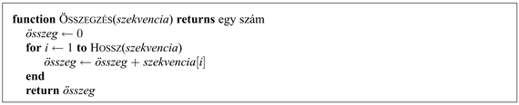

<?xml version="1.0" encoding="UTF-8" standalone="no"?>

<html xmlns="http://www.w3.org/1999/xhtml"><head><meta name="generator" content="DocBook XSL Stylesheets V1.76.1"/></head><body>

<h1 class="title"><a id="id803256"/>A. függelék - Matematikai alapok</h1>

<h1 class="title"><a id="id803260"/>A1. Bonyolultságanalízis és az O() jelölés</h1>

A számítógépes szakembereknek gyakran szembe kell nézniük azzal a feladattal, hogy eldöntsék, két algoritmus közül melyik fut gyorsabban, vagy melyik igényel kevesebb memóriát. Ezt a feladatot kétféle módon lehet megközelíteni. Az első a <strong>teljesítménymérés</strong> (<strong>benchmarking</strong>) – ahol az algoritmusokat számítógépen futtatjuk, és megmérjük, milyen a sebességük másodpercekben, valamint a memóriafogyasztásuk bájtokban. Hiszen végül is ez az, ami igazából számít. A teljesítménymérés azonban nem biztos, hogy kielégítő mérték, mivel igen specifikus: egy konkrét program teljesítményét méri, amely program egy konkrét programozási nyelven íródott, konkrét gépen fut, konkrét fordító és bemeneti adatok mellett. A teljesítménymérő program által szolgáltatott egyszerű adatokból nehéz lenne arra következtetni, hogy az algoritmus milyen jól vizsgázik más fordító, más számítógép vagy más adathalmaz esetén.

<h2 class="title"><a id="id803275"/>Aszimptotikus analízis</h2>

A második megközelítés az <strong>algoritmusok</strong> matematikai <strong>elemzésé</strong>n (<strong>analysis of algorithms</strong>) alapul, konkrét implementációtól és bemenetektől függetlenül. Ezt a megközelítést egy példa kapcsán, egy számsorozatot összeadó program esetén fogjuk ismertetni:

Az elemzés első lépése a bemenetektől való eltekintés, olyan paraméter vagy paraméterek megkeresése, amely vagy amelyek jellemzők a bemenet méretére. Jelen példában a bemenetet a szekvencia hosszával jellemezhetjük, aminek a jele legyen <em>n</em>. Második lépés az implementációktól való eltekintés, azaz egy olyan mérték megkeresése, amely tükrözi az algoritmus futásiidő-igényét, de nem kötődik egy konkrét fordítóhoz vagy számítógéphez. Az <code class="code">ÖSSZEGZÉS</code> program esetén ez lehetne például a végrehajtott kód sorainak a száma. A mérték részletesebb is lehetne, külön specifikálva az algoritmus által végrehajtott összeadások, értékadások, tömbhivatkozások és elágazások számát. Mindkét esetben megkapjuk az algoritmus által végzett lépések teljes számának a jellemzését a bemenet nagyságának függvényében, amit <em>T</em>(<em>n</em>)-nek fogunk nevezni. Ha megszámoljuk a kód sorait, a példánk esetében az eredmény <em>T</em>(<em>n</em>) = 2<em>n + </em>2.

Ha minden program olyan egyszerű lenne, mint az <code class="code">ÖSSZEGZÉS</code>, az algoritmusok elemzése triviális lenne. Két probléma miatt a helyzet azért bonyolultabb. Először is, ritka eset olyan paramétert találni, mint az <em>n</em>, amely teljes egészében jellemzi az algoritmus által végrehajtott lépések számát. A legjobb, amivel ehelyett rendelkezhetünk, a legrosszabb esetet jelentő <em>T</em>legrosszabb(<em>n</em>) vagy az átlagos <em>T</em>átlag(<em>n</em>) számítása. Az átlag kiszámításához az elemzőnek fel kell tételeznie a bemenetek valamilyen eloszlását.

A másik probléma az, hogy az algoritmusok ellenállnak az egzakt elemzésnek. Ilyen esetben közelítésekre szükséges támaszkodnunk. Azt mondhatjuk, hogy az <code class="code">ÖSSZEGZÉS</code> algoritmus <em>O</em>(<em>n</em>) – avagy nagy ordó <em>n</em> – jelezvén, hogy a mértéke, néhány kis értékű <em>n</em> kivételével, a legtöbb esetben <em>n</em> konstans-szorosa. Formálisan:

<code class="code"><em>T</em>(<em>n</em>) <em>O</em>(<em>f </em>(<em>n</em>)) mértékű, ha <em>T</em>(<em>n</em>) ≤ <em>kf</em>(<em>n</em>) valamilyen <em>k</em>-ra, minden <em>n </em>&gt;<em> n</em>0 esetén.</code>

Az <em>O</em>(<em>n</em>) jelölés az <strong>aszimptotikus analízis</strong>t (<strong>asymptotic analysis</strong>) jelenti. Külön vizsgálat nélkül azt mondhatjuk, hogy ha <em>n</em> aszimptotikusan közeledik a végtelenhez, egy <em>O</em>(<em>n</em>) algoritmus jobb, mint egy <em>O</em>(<em>n</em>2) algoritmus. Egy egyedi teljesítménymérő adat egy ilyen kijelentést nem tudna alátámasztani.

Az <em>O</em>() jelölés a konstans szorzóktól eltekint, emiatt kevésbé precíz, viszont könnyebb használni, mint a <em>T</em>()-t. Így például egy <em>O</em>(<em>n</em>2) algoritmus egy <em>O</em>(<em>n</em>) algoritmusnál hosszú távon mindig rosszabb lesz, azonban ha a két algoritmus <em>T</em>(<em>n</em>2 + 1) és <em>T</em>(100<em>n</em> + 1000), akkor az <em>O</em>(<em>n</em>2) algoritmus <em>n </em>≤<em> </em>110-re jobb lesz.

E hátránya ellenére az aszimptotikus elemzés az algoritmuselemzés legelterjedtebben használt módszere. Ez azért van így, mert az elemzés mind a műveletek egzakt számától (a <em>k</em> konstans tényezőt figyelmen kívül hagyva), mind a bemenet egzakt tartalmától (csupán <em>n</em> nagyságát figyelembe véve) elvonatkoztat. Ily módon az elemzés matematikailag kivitelezhetővé válik. Az <em>O</em>() jelölés jó kompromisszum a precizitás és a könnyű elemzés között.

<h2 class="title"><a id="id803547"/>NP és az inherensen nehéz problémák</h2>

Az algoritmusok elemzése és az <em>O</em>() jelölés lehetővé teszi, hogy egy konkrét algoritmus hatékonyságáról nyilatkozzunk. Arról azonban nem tudunk mondani semmit, hogy az adott problémához van-e nála jobb algoritmus. A <strong>bonyolultságelmélet</strong> (<strong>complexity analysis</strong>) területe nem az algoritmusokat, hanem inkább a problémákat elemzi. Az első nagy szakadék a polinom időben megoldható és a polinom idejű megoldást nélkülöző problémák között van, akármilyen algoritmust is használnánk. A polinom idejű problémák osztályát – azokét, amelyek <em>O</em>(<em>nk</em>) időben oldhatók meg valamilyen <em>k</em> esetén – P-vel jelöljük. Ezeket néha „könnyű” problémáknak hívjuk, mert az osztályhoz <em>O</em>(log<em>n</em>) és <em>O</em>(<em>n</em>) futási idejű problémák is tartoznak. Idetartoznak azonban <em>O</em>(<em>n</em>1000) problémák is, a „könnyű” elnevezést tehát túlságosan szó szerint venni nem lehet.

A problémák másik fontos osztálya az NP osztály, a nemdeterminisztikus polinom idejű problémák osztálya. Egy probléma akkor tartozik ide, ha létezik egy algoritmus, ami polinom időben meg tud találni egy megoldást, és még ellenőrizni is tudja, hogy a megtalált megoldás korrekt-e. Az ötlet az, hogy ha tetszőlegesen nagyszámú proceszszorral rendelkezünk ahhoz, hogy az összes sejtést egyszerre próbáljuk ki, vagy pedig ha szerencsések vagyunk, és mindig elsőre eltaláljuk a helyes megoldást, az NP probléma P problémává válik. A számítógépes tudomány egyik nagy nyitott kérdése az, hogy az NP osztály ekvivalens-e a P osztállyal akkor, ha nélkülözzük a végtelen processzorhalmaz, illetve a mindentudó sejtés luxusát. A legtöbb számítógépes szakember meg van győződve arról, hogy P ≠ NP, vagyis, hogy az NP problémák inherens módon nehezek, és nincsenek számukra polinom idejű algoritmusok. Ezt azonban még soha sem bizonyították be.

Akik a P = NP eldöntése iránt érdeklődnek, azok figyelmébe az NP osztály egy alosztályát, az <strong>NP-teljes</strong> (<strong>NP-complete</strong>) problémák alosztályát ajánljuk. A <em>teljes</em> szó itt a „legvégsőt” jelenti, és az NP osztály legnehezebb problémáit jelöli ki. Azt bebizonyították már, hogy vagy minden NP-teljes probléma P-ben van, vagy egyik sem. Emiatt ez az osztály elméletileg érdekes, de gyakorlati jelentősége is van, mert sok fontos problémáról tudjuk, hogy NP-teljes. Egy lehetséges példa a Boole-kifejezések kielégíthetőségének problémája: egy adott logikai kifejezés esetén létezik-e az ítéletváltozóinak olyan logikaiérték-hozzárendelése, hogy a kifejezés igaz legyen? Hacsak egy csodának nem leszünk tanúi, és a P = NP nem lesz igaz, nincs olyan algoritmus, amely <em>minden</em> kielégíthetőségi problémát polinomiális időben megold. Az MI azonban jobban érdekelt abban, hogy vajon léteznek-e hatékony algoritmusok <em>tipikus,</em> előre rögzített eloszlásokból sorsolt problémák esetén. Ahogy ezt a 7. fejezetben láttuk, vannak olyan algoritmusok, mint a <code class="code">WALKSAT</code>, amelyek sok probléma esetén egészen jól teljesítenek.

A <strong>co-NP</strong> osztály az NP komplemense abban az értelemben, hogy minden NP-beli döntési probléma esetén létezik egy neki megfelelő co-NP-beli probléma felcserélt „igen” és „nem” válaszokkal. Tudjuk, hogy a P mind az NP, mind a co-NP osztályok részhalmaza, és azt gondoljuk, hogy vannak olyan co-NP-beli problémák, amelyek P-nek nem elemei. A co-NP osztály legnehezebb problémái a <strong>co-NP-teljes</strong> problémák.

A #P osztály az NP-beli döntési problémáknak megfelelő számlálási problémák halmaza. Döntési problémáknak igen-nem a megoldásuk: például létezik-e megoldása ennek a 3-SAT mondatnak? A számlálási problémáknak egész számok a megoldásaik; mennyi megoldása van ennek a 3-SAT mondatnak? Egyes esetekben a számlálási probléma a döntési problémánál sokkal nehezebb. Így például annak az eldöntése, hogy egy páros gráfhoz létezik-e egy tökéletes párosítása <em>O</em>(<em>VE</em>) idejű (ahol a gráfnak <em>V</em> csúcsa és <em>E</em> éle van). A „hány tökéletes párosítása létezik egy konkrét páros gráf esetén” számlálási probléma viszont #P-teljes, amin azt kell érteni, hogy legalább olyan nehéz, mint a #P-beli problémák bármelyike, és így legalább olyan nehéz, mint az NP-beli problémák bármelyike.

A P-TÁR – a polinom-tárigényű – problémák osztályát szintén tanulmányozták még nemdeterminisztikus gép esetén is. Az az általános vélekedés, hogy a P-TÁR-nehéz problémák az NP-teljes problémáknál nehezebbek, bár kiderülhet, hogy NP = P-TÁR, mint ahogy az is kiderülhet, hogy P = NP.

</body></html>
