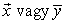
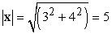
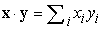
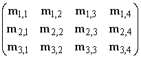
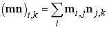
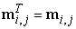
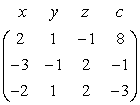
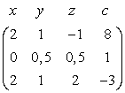
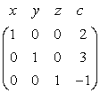

<?xml version="1.0" encoding="UTF-8" standalone="no"?>
<!DOCTYPE html PUBLIC "-//W3C//DTD XHTML 1.1//EN" "http://www.w3.org/TR/xhtml11/DTD/xhtml11.dtd">
<html xmlns="http://www.w3.org/1999/xhtml"><head><meta name="generator" content="DocBook XSL Stylesheets V1.76.1"/></head><body>

<h1 class="title"><a id="id803663"/>A2. Vektorok, mátrixok és lineáris algebra</h1>

A matematikusok egy <strong>vektor</strong>t egy vektortérelemként definiálnak. Mi azonban konkrétabb definíciót fogunk használni. Egy vektor az értékek egy rendezett szekvenciája. A kétdimenziós térben például olyan vektoraink vannak, mint: <strong>x = </strong>〈3, 4〉 és <strong>y = </strong>〈0, 2〉. A szokásos konvencióhoz folyamodunk vastagon szedett betűket használva a vektorneveknek, bár egyes szerzők a nevek fölé nyilat vagy vonalat húznak: <em> </em>. Egy vektor elemeire indexekkel lehet hivatkozni: <strong>z</strong> = 〈<em>z</em>1, <em>z</em>2, …, <em>zn</em>〉.

A vektorokon értelmezett két alapvető művelet a vektorok összeadása és egy skalárral való szorzása. Az <strong>x</strong> + <strong>y</strong> vektorösszeadás az elemenkénti összegzés: <strong>x </strong>+<strong> y</strong> = 〈3 + 0, 4 + 2〉 = 〈3, 6〉. A skalárszorzás mindegyik elemet egy konstans értékkel szorozza be: 5<strong>x</strong> = 〈5 × 3, 5 × 4〉 = 〈15, 20〉.

Egy vektor hosszát az |<strong>x</strong>| jelöli, amelynek értéke egyenlő a vektor elemeinek négyzetösszegéből vett négyzetgyökével: . Két vektor skalárszorzata, <strong>x </strong>·<strong> y</strong> a megfelelő vektorelemek szorzatának összege, azaz<strong> </strong>, vagy konkrét esetünkben <strong>x</strong> · <strong>y<em> = </em></strong>3 × 0 + 4 × 2 = 8.

A vektorokat sokszor egy <em>n</em>-dimenziós euklideszi tér irányított vonalszakaszainak (nyilaknak) képzeljük. Ekkor a vektorösszeadás annak felel meg, mintha az egyik vektor kezdő pontját a másik vektor végpontjához illesztenénk, az <strong>x </strong>·<strong> y<em> </em></strong>skalárszorzat viszont |<strong>x</strong>||<strong>y</strong>|cos<em>θ</em>-vel lesz egyenlő, ahol <em>θ</em> az <strong>x</strong> és az <strong>y</strong> közötti szög.

Egy <strong>mátrix</strong> az értékek négyszögletes elrendezése sorokba és oszlopokba. Itt egy 3 × 4 méretű <strong>m</strong> mátrixot látunk:

Az <strong>m</strong><em>i</em>,<em>j</em> első indexe a sort, a második az oszlopot jelöli. Programozási nyelvekben <strong>m</strong><em>i</em>,<em>j</em>-t gyakran m[i,j], vagy m[i][j]-nek írják.

Két mátrix összegét a megfelelő elemek összeadásával definiáljuk: (<strong>m + n</strong>)<em>i</em>,<em>j</em><em> = </em><strong>m</strong><em>i</em>,<em>j</em> + <strong>n</strong><em>i</em>,<em>j</em>. (Az összeg különböző méretű <strong>m</strong> és <strong>n</strong> mátrixokra nincs definiálva.) Egy mátrixnak egy skalárral történő szorzatát szintén definiálhatjuk: (<em>c</em><strong>m</strong>)<em>i</em>,<em>j</em> = <em>c</em><strong>m</strong><em>i</em>,<em>j</em>. A mátrixszorzat (két mátrix szorzata) már bonyolultabb. Az <strong>mn</strong> szorzat csak akkor definiált, ha az <strong>m</strong> mátrix <em>a</em> × <em>b</em>, az <strong>n</strong> mátrix pedig<em> b</em> × <em>c</em> méretű (azaz a második mátrixnak annyi sora van, mint amennyi oszlopa az első mátrixnak). Az eredmény egy <em>a </em>×<em> c</em> méretű mátrix. Ez azt jelenti, hogy a mátrixszorzat nem kommutatív: általánosságban <strong>mn </strong>≠<strong> nm</strong>. Ha a mátrixok megfelelő méretűek, akkor az eredmény:

Az <strong>I</strong> egységmátrix <strong>I</strong><em>i</em>,<em>j</em> elemei egységnyiek, ha <em>i = j</em>, különben nullák. Az egységmátrix tulajdonsága, hogy <strong>mI = m</strong>, minden <strong>m</strong>-re. Az <strong>m</strong> transzponáltját, <strong>m</strong>T-t, megkapjuk, ha az <strong>m</strong> sorait és oszlopait felcseréljük, formálisan: .

A mátrixokat lineáris egyenletrendszerek megoldására a <strong>Gauss–Jordan-elimináció</strong>s (<strong>Gauss–Jordan elimination</strong>) algoritmussal használjuk, ami egy <em>O</em>(<em>n</em>3) komplexitású algoritmus. Tekintsünk az alábbi egyenletrendszert, amelynek <em>x</em>, <em>y</em> és <em>z</em> megoldására vagyunk kíváncsiak:

<code class="code">+2<em>x</em> + <em>y</em> – <em>z</em> = 8</code>

<code class="code">–3<em>x</em> – <em>y</em> + 2<em>z</em> = –11</code>

<code class="code">–2<em>x</em> + <em>y</em> + 2<em>z</em> = –3</code>

Ezt az egyenletrendszert kifejezhetjük mátrixos formában is:

Itt az <em>x</em> <em>y</em> <em>z</em> <em>c</em> nem része a mátrixnak, csak emlékeztetőül szolgál. Tudjuk, hogy ha egy egyenlet mindkét oldalát egy konstanssal megszorozzuk, vagy ha két egyenletet egymáshoz hozzáadunk, akkor szintén egy érvényes egyenlethez jutunk el. A Gauss– Jordan-elimináció ezeket a lépéseket ismételten alkalmazza úgy, hogy először az első változót (az <em>x</em>-et) elimináljuk, az elsőt kivéve az összes egyenletből, majd folytatjuk minden <em>i</em>-re, az <em>i</em>-edik változót minden egyenletből eliminálva, az <em>i</em>-edik egyenletet kivéve. Az <em>x</em>-et a második egyenletből úgy elimináljuk, hogy az első egyenletet 3/2-vel megszorozzuk, az eredményt pedig a második egyenlethez hozzáadjuk. Ezzel az alábbi mátrixhoz jutunk el:

Folytatjuk így eliminálva az <em>x</em>-et, az <em>y</em>-t és a <em>z</em>-t, míg végül a:

mátrixot kapjuk, amely jelzi, hogy a megoldás <em>x = </em>2, <em>y = </em>3, <em>z = </em>–1. (Próbálja ki!)

</body></html>
