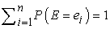
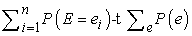
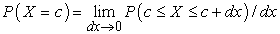
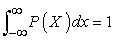
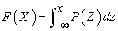
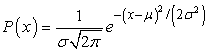
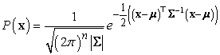
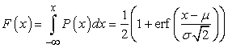

<?xml version="1.0" encoding="UTF-8" standalone="no"?>

<html xmlns="http://www.w3.org/1999/xhtml"><head><meta name="generator" content="DocBook XSL Stylesheets V1.76.1"/></head><body>

<h1 class="title"><a id="id804245"/>A3. Valószínűségi eloszlások</h1>

A valószínűség az eseményhalmazokon definiált olyan mérték, amely az alábbi három axiómát elégíti ki:

<ol class="orderedlist"><li class="listitem">
Minden esemény mértéke egy 0 és 1 közötti szám. Ezt a következőképpen írjuk: 0 ≤ <em>P</em>(<em>E = ei</em>) ≤ 1, ahol az <em>E</em> egy eseményt képviselő véletlen változó, és az <em>ei-</em>k az <em>E</em> lehetséges értékei. Általánosságban a véletlen változókat nagybetűkkel, az értékeit pedig kisbetűkkel jelöljük.
</li><li class="listitem">
Az egész halmaz mértéke 1; azaz 
</li><li class="listitem">
Diszjunkt halmazok uniójának a valószínűsége az egyedi események valószínűségeinek összege, azaz <em>P</em>(<em>E = e</em>1 ∨ <em>E = e</em>2) = <em>P</em>(<em>E = e</em>1) + <em>P</em>(<em>E = e</em>2), ahol <em>e</em>1 és <em>e</em>2 diszjunktak.
</li></ol>

Egy <strong>valószínűségi modell</strong> (<strong>probabilistic model</strong>) a kölcsönösen egymást kizáró, lehetséges kimenetelek mintateréből áll, és minden kimenetel valószínűségi mértékéből. A holnapi időjárás modelljében például a kimenetelek a következők lehetnek: <em>napos</em>, <em>felhős</em>, <em>esős</em> vagy <em>havas</em>. Ezen kimenetelek egy részhalmaza képvisel egy eseményt. A csapadékesemény például az {<em>esős</em>, <em>havas</em>} részhalmaz.

A 〈<em>P</em>(<em>E</em> = <em>e</em>1), …, <em>P</em>(<em>E = en</em>)〉 értékekből képzett vektor jelölésére a <strong>P</strong>(<em>E</em>)-t fogjuk használni. A <em>P</em>(<em>ei</em>) jelölést szintén használni fogjuk a <em>P</em>(<em>E = ei</em>) rövidítésére, hasonlóan a -ként rövidítjük.

A <em>P</em>(<em>B</em>|<em>A</em>) feltételes valószínűséget a <em>P</em>(<em>B </em>∩<em> A</em>)/<em>P</em>(<em>A</em>) definiálja. <em>A</em> és <em>B</em> feltételesen függetlenek, ha <em>P</em>(<em>B</em>|<em>A</em>) = <em>P</em>(<em>B</em>) [vagy ekvivalens módon <em>P</em>(<em>A</em>|<em>B</em>) = <em>P</em>(<em>A</em>)]. Folytonos változók esetén az értékek halmaza végtelen, és hacsak pontszerű tüskék nincsenek, mindegyik érték valószínűsége 0. Emiatt egy <strong>valószínűségi sűrűségfüggvény</strong>t (<strong>probability </strong><strong>density function</strong>) definiálunk, amit szintén <em>P</em>(<em>X</em>)-szel fogunk jelölni. <em>P</em>(<em>X</em>) jelentése a <em>P</em>(<em>A</em>) diszkrét valószínűségi függvénytől kissé eltér. A <em>P</em>(<em>X = c</em>) sűrűségfüggvény-érték az a valószínűség, hogy az <em>X</em> a <em>c</em> körüli intervallumba esik, elosztva az intervallum hosszával, és határátmenetet képezve, ahogy az intervallum hossza tart a 0-hoz:

A sűrűségfüggvénynek nemnegatívnak kell lennie minden <em>x</em>-re, és teljesítenie kell, hogy:

Definiálhatunk egy <strong>valószínűségi eloszlásfüggvény</strong>t (<strong>cumulative probability density function</strong>), <em>F</em>(<em>X</em>)-et is, ami annak a valószínűsége, hogy a véletlen változó <em>x</em>-nél kisebb:

Jegyezzük meg, hogy a valószínűségi sűrűségfüggvénynek létezik egysége, az eloszlásfüggvény viszont egység nélküli. Ha az <em>X</em>-et például másodpercben mérjük, akkor a sűrűséget Hz-ben (azaz 1/s) fogjuk. Ha <strong>X</strong> a méterben mért háromdimenziós tér egy pontja, akkor a sűrűséget 1/m3-ben mérjük.

Az egyik legfontosabb valószínűség-eloszlás a <strong>Gauss-eloszlás</strong> (<strong>Gaussian distrib</strong><strong>ution</strong>), amit <strong>normális eloszlás</strong>nak (<strong>normal distribution</strong>) is szokás nevezni. A <em>μ</em> középértékű és <em>σ</em> szórású (<em>σ</em>2 varianciájú) Gauss-eloszlás definíciója:

ahol <em>x </em>egy<em> </em>folytonos változó –∞-től +∞-ig terjedő értékkészlettel. <em>μ</em> = 0 és <em>σ</em> 2 = 1 mellett kapjuk a <strong>standard normális eloszlás</strong> (<strong>standard normal distribution</strong>) speciális esetet. Egy <em>d </em>dimenziós <strong>x</strong> vektor feletti eloszlás a <strong>többváltozós Gauss-eloszlás</strong> (<strong>multivariate Gaussian distribution</strong>): 

ahol <em><strong>μ</strong></em> az eloszlás középértékvektora, <strong>Σ</strong> pedig a <strong>kovarianciamátrix</strong> (<strong>covariance matrix</strong>).

A standard normális eloszlás egydimenziós eloszlásfüggvénye:

ahol az erf(<em>x</em>) az ún. <strong>hibafüggvény</strong> (<strong>error function</strong>), amelynek zárt alakja nincs.

A <strong>központi határeloszlás tétele</strong> (<strong>central limit theorem</strong>) azt mondja, hogy <em>n</em> véletlen változó középértékének az eloszlása a normális eloszláshoz tart, ha <em>n</em> tart végtelenhez. Igaz ez a véletlen változók majdnem minden halmazára, hacsak valamelyik véges alhalmaz varianciája a többit nem fogja dominálni.

<h2 class="title"><a id="id804810"/>Irodalmi és történeti megjegyzések</h2>

A számítógépes tudományokban ma oly elterjedten használt <em>O</em>() jelölést (nagy ordó) P. G. H. Bachmann német matematikus vezette be a számelmélettel kapcsolatban (Bachmann, 1894). Az NP-teljesség koncepcióját Cook (Cook, 1971) dolgozta ki, míg a problémák egymásra redukálásának modern módszertanát Karpnak köszönhetjük (Karp, 1972). Munkásságukért mindketten Turing-díjban – a számítógépes tudományok legmagasabb elismerésében – részesültek.

Az algoritmusok elemzésére és tervezésére irányuló klasszikus munkák között találjuk a (Knuth, 1973; Aho és társai, 1974) műveket. Újabb adalékok Tarjantól (Tarjan, 1983) és a Cormen, Leiserson és Rivest szerzőhármastól (Cormen és társai, 1990) származnak. Ezekben a művekben a hangsúlyt a kezelhető problémákat megoldó algoritmusok tervezésére és elemzésére helyezték. Az NP-teljességnek, illetve a kezelhetetlenség más formáinak az elméletébe a legjobb bevezetők (Garey és Johnson, 1979) és (Papadimitriou, 1994). Az elmélet tárgyalásán túlmenően Garey és Johnson meggyőzően, példákkal illusztrálják, hogy a számítógépes szakemberek miért a polinom és az exponenciális futási időigény határára teszik egyhangúan a kezelhető és kezelhetetlen problémák közötti határvonalat. A szerzők az NP-teljesként vagy más szempontból kezelhetetlennek ismert problémák terjedelmes katalógusát is mellékelik.

A valószínűség-számításról jó művek (Chung, 1979; Ross, 1988; Bertsekas–Tsitsiklis, 2002; Feller, 1971).

</body></html>
