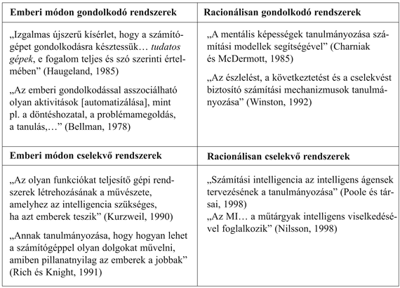

<?xml version="1.0" encoding="UTF-8" standalone="no"?>
<!DOCTYPE html PUBLIC "-//W3C//DTD XHTML 1.1//EN" "http://www.w3.org/TR/xhtml11/DTD/xhtml11.dtd">
<html xmlns="http://www.w3.org/1999/xhtml"><head><meta name="generator" content="DocBook XSL Stylesheets V1.76.1"/></head><body>

<h1 class="title"><a id="id522898"/>1. fejezet - Bevezetés</h1>

<em>Amelyben megkíséreljük megmagyarázni, hogy miért tartjuk a mesterséges intelligenciát olyan területnek, amit igenis érdemes tanulmányozni, és amelyben azt is megkíséreljük eldönteni, hogy vajon mi is ez a terület.</em>

Az ember <strong>Homo sapiens</strong>nek – gondolkodó embernek – nevezte el a saját fajtáját, mert mentális képességeink annyira fontosak a számunkra. Évezredek óta próbáljuk megérteni azt, hogy <em>hogyan gondolkozunk</em>. Azt, hogy az anyag néhány maréknyi mennyisége hogyan képes a saját magánál sokkal nagyobb és bonyolultabb világot észlelni, megérteni, a világ alakulását megjósolni és manipulálni. A <strong>mesterséges intelligencia</strong> (<strong>artificial intelligence</strong>), röviden MI (AI), még tovább is megy: az intelligens entitások megértése mellett ilyen entitások <em>építésével</em> is próbálkozik. 

Az MI az egyik legújabb tudományterület. A munka közvetlenül a második világháború befejeztével kezdődött. A mesterséges intelligencia elnevezés 1956-ban született meg. A molekuláris biológiával egyetemben az MI az a terület, amiről más tudományterületek kutatói úgy nyilatkoznak, hogy „én legszívesebben ezzel foglalkoznék”. Egy fizikushallgató teljes joggal gondolhatja, hogy Galilei, Newton, Einstein és mások már minden jó ötlettel rég előálltak. Ezzel szemben az MI-ben az Einstein-kaliberű egyéniségek előtt még szabad az út.

Az MI jelenleg az általános rendeltetésű területektől, mint az észlelés és a tanulás, egészen olyan specifikus feladatokig, mint a gépi sakk, a matematikai tételbizonyítás, a gépi költészet vagy az orvosi diagnózis, a legkülönbözőbb részterületek óriási választékát öleli át. Az MI az intellektuális képességeket igénylő feladatokat rendszerezi és automatizálja, és így potenciálisan releváns az értelmes emberi cselekvés minden területén. Ilyen értelemben az MI igazán univerzális tudomány.

<h1 class="title"><a id="id522833"/>Mi az MI?</h1>

Eddig arról beszéltünk, hogy miért izgalmas az MI, de nem mondtuk meg, hogy <em>mi is </em>valójában? Az MI definícióit, nyolc jelenlegi tankönyvet követve, az 1.1. ábra mutatja. Ezek a definíciók két dimenzió mentén értelmezhetők. Az ábra felső részében levők a <em>gondolati folyamatokat</em> és a <em>következtetést</em> célozzák, míg az alsó részben levők tárgya a <em>viselkedés</em>. A bal oldali definíciók a sikert az <em>emberi</em> teljesítményhez mérik, míg a jobb oldaliak mércéje az intelligencia egy <em>ideális</em> koncepciója, amit mi <strong>racionalitás</strong>nak (<strong>rationality</strong>) fogunk nevezni. Egy rendszer racionális, ha tudásához viszonyítva helyesen cselekszik. 

<a id="id522780"/>
<strong>1.1. ábra - Az MI néhány meghatározása négy kategóriába szervezve</strong>

Az idők folyamán mind a négy irányzat követőre talált. De ahogy ez várható volt, feszültség uralkodik az embercentrikus és a racionalitáscentrikus irányzatok között.[<a id="id522756" href="#ftn.id522756" class="footnote">1</a>] Az embercentrikus irányzat szükségképpen empirikus tudomány, hipotézisekkel és empirikus igazolással.

A racionalitáscentrikus megközelítés a matematikára és a mérnöki tudományokra támaszkodik. Mindegyik csoport rágalmazta is, de segítette is a többi csoport munkáját. Nézzük most a négyféle megközelítést kicsit részletesebben.

<h2 class="title"><a id="id522718"/>Emberi módon cselekedni: Turing-teszt megközelítés</h2>

A<strong> Turing-teszt</strong>et (<strong>Turing-test</strong>) Alan Turing javasolta azzal a céllal, hogy az intelligenciának egy kielégítő munkadefiníciót adjon (Turing, 1950). Ahelyett hogy az intelligenciára jellemző kvalitások hosszú és feltehetően vitás listáját megadná, Turing egy tesztet javasolt, amelynek alapja a vitathatatlanul intelligens entitástól – egy embertől – való megkülönböztethetetlensége. A számítógép akkor állja ki a próbát, ha az emberi kérdező néhány írásos kérdés feltevése után nem képes eldönteni, hogy az írásos válaszok egy embertől vagy egy géptől érkeznek-e. A tesztet a 26. fejezet tárgyalja részletesen, ahol azzal is foglalkozunk, hogy intelligensnek mondható-e a számítógép, ha teljesíti a tesztet. Jelenleg igen sok feladatot jelent egy gépet úgy programozni, hogy teljesítse a tesztet. A számítógépnek a következő képességekkel kellene rendelkeznie:

<ul class="itemizedlist"><li class="listitem">
<strong>természetes nyelvfeldolgozás</strong> (<strong>natural language processing</strong>) a sikeres angol (illetve más emberi) nyelvű párbeszédhez;
</li><li class="listitem">
<strong>tudásreprezentáció</strong> (<strong>knowledge representation</strong>) az ismert vagy hallott információ tárolására;
</li><li class="listitem">
<strong>automatizált következtetés</strong> (<strong>automated reasoning</strong>), hogy a tárolt információt kérdések megválaszolására és új következtetések levonására használjuk;
</li><li class="listitem">
<strong>g</strong><strong>épi tanulás</strong> (<strong>machine learning</strong>) az új körülményekhez való adaptálódáshoz, a mintázatok detektálására és általánosítására.
</li></ul>

A Turing-teszt a kérdező és a számítógép közötti fizikai kölcsönhatást szándékosan kerülte, mert egy személy <em>fizikai</em> szimulációja az intelligenciához nem szükséges. Az ún. <strong>teljes Turing-teszt</strong> (<strong>total Turing-test</strong>) azonban videojelet is fel kell dolgozzon, hogy a kérdező tesztelni tudja az illető érzékelési képességeit, valamint tartalmazza annak a lehetőségét is, hogy a kérdező az objektumokat átadhassa „egy nyíláson keresztül”. A teljes Turing-teszt teljesítéséhez a számítógépnek szüksége lesz:

<ul class="itemizedlist"><li class="listitem">
<strong>gépi látás</strong>ra (<strong>computer vision</strong>), az objektumok érzékeléséhez és
</li><li class="listitem">
<strong>robotiká</strong>ra (<strong>robotics</strong>) az objektumok mozgatásához.
</li></ul>

Ez a hat terület nagyjából lefedi az MI-t. Turing becsületére válik, hogy egy olyan tesztet talált ki, amely 50 év múltával is releváns maradt. Az MI-n belül a kutatók sok erőfeszítést mégsem fejtettek ki a Turing-teszt teljesítése érdekében, abban a hiedelemben, hogy a mögötte sorakozó elvek tanulmányozása fontosabb, mint egy példány duplikálása. A „mesterséges repülés” kutatása akkor járt sikerrel, amikor a Wright testvérek abbahagyták a madarak utánzását, és az aerodinamikát kezdték tanulmányozni. A repüléssel foglalkozó könyvek nem azt a célt fogalmazzák meg, hogy olyan „gépeket kellene építeni, amelyek annyira hasonlóan repülnek a galambokhoz, hogy ezzel akár más galambokat is képesek megtéveszteni”.

<h2 class="title"><a id="id524302"/>Emberi módon gondolkodni: a kognitív modellezés</h2>

Ha azt szeretnénk kijelenteni, hogy egy program emberi módon gondolkodik, valamilyen módon meg kellene határoznunk, hogy az emberek hogyan gondolkodnak. Ehhez az emberi elme működési mechanizmusának <em>belsejébe</em> kellene tudnunk belenézni. Két módja van ennek: önelemzés révén – az átsuhanó gondolataink megragadásával – vagy pszichológiai kísérletekkel. Ha egyszer majd rendelkezünk az elme elegendően részletes elméletével, lehetségessé válik az elmélet számítógépes programmal való kifejezése. Ha a program bemenetei és kimenetei, valamint időzítése az emberi viselkedéssel megegyeznek, ez egyben bizonyíték arra, hogy a program bizonyos mechanizmusai feltehetően az emberben is megtalálhatók. Így például Newell és Simon, akik az „általános problémamegoldót (General Problem Solver, GPS)” (Newell és Simon, 1961) kifejlesztették, csupán azzal, hogy a programjuk helyesen oldja meg a problémákat, nem voltak elégedettek. Jobban érdekelte őket, hogy összehasonlítsák a program következtetési lépéseit az ugyanazon a feladaton dolgozó emberek lépéseivel. Az MI számítógépes modelljeit és a pszichológia kísérleti technikáit a <strong>kognitív tudomány</strong> (<strong>cognitive science</strong>) interdiszciplináris területe kapcsolja össze azáltal, hogy kísérletet tesz precíz és verifikálható elméletek megfogalmazására az emberi elme működéséről.

A kognitív tudomány önmagában is vonzó terület, annyira, hogy egy önálló enciklopédia létrehozásának is van értelme (Wilson és Keil, 1999). A könyvünkben meg sem kíséreljük leírni, hogy az emberi megismerésből mit tudunk már. Esetenként azonban kitérünk az MI-technikák és az emberi gondolkodás közötti hasonlóságokra és különbségekre. Az igazi kognitív tudomány – szükségszerűen – a valódi emberek, illetve állatok kísérleti kutatásán alapul, mi pedig feltételezzük, hogy az olvasó a kísérleteihez csupán számítógéppel rendelkezik. 

Az MI-kutatás kezdeti szakaszában a megközelítéseket sokszor össze is keverték. Egy szerző állíthatta például, hogy ha egy algoritmus egy feladaton jól vizsgázik, <em>akkor</em> jó modellje az emberi képességeknek, és megfordítva. A mai szerzők a kétféle igényt elkülönítik. Ez a megkülönböztetés mind az MI, mind a kognitív tudomány gyorsabb fejlődését tette lehetővé. Az MI és a kognitív tudomány folyamatosan termékenyítően hatnak egymásra, különösképpen a látás és a természetes nyelv vonatkozásában. A látás a közelmúltban különösen sokat fejlődött a neurofiziológiai eredményeket és a számítási modelleket összefogó integrált megközelítés révén.

<h2 class="title"><a id="id524329"/>Racionálisan gondolkodni: a gondolkodás törvénye</h2>

Arisztotelész görög filozófus volt az elsők egyike, aki megkísérelte a „helyes gondolkodás”, azaz a megcáfolhatatlan következtetési folyamatok törvényekbe foglalását. Híres <strong>szillogisztiká</strong>ja (<strong>syllogisms</strong>) olyan mintákat szolgáltatott a következtetési sémákhoz, amelyek helyes premisszákból mindig helyes következményekre vezettek. Például „Szókratész egy ember; minden ember halandó; azaz Szókratész halandó.” Ezekről a gondolkodási törvényekről feltételezték, hogy az elme működését irányítják, és ezek indították el a <strong>logika</strong> (<strong>logic</strong>) tudományának kialakulását.

A 19. században a logikusok – a logika tudományát művelők – megadták a világ mindennemű objektumára és az azok közötti relációkra vonatkozó állításoknak a precíz megfogalmazását. (Hasonlítsuk ezt a közönséges aritmetikai jelölésrendszerhez, ami főleg a számokon értelmezett egyenlőségek és egyenlőtlenségek kifejezésére alkalmas.) 1965-ben léteztek már olyan programok, amelyek – legalább elvben – képesek voltak <em>tetszőleges,</em> logikai jelölésekkel kifejezett problémához megadni a probléma megoldását.[<a id="id524360" href="#ftn.id524360" class="footnote">2</a>] Az MI-n belül uralkodó <strong>logicista</strong> (<strong>logicist</strong>) hagyomány azt reméli, hogy ilyen programokra alapozva intelligens rendszereket képes létrehozni.

Ennek a megközelítésnek két alapvető baja van. Először is a logikai jelölésrendszer által igényelt formális elemekkel informális tudást kifejezni nem ilyen egyszerű, különösen ha a tudás nem 100%-osan biztos. A másik az, hogy nagy a különbség egy probléma „elvi”, illetve gyakorlati megoldása között. Már a néhány tíz tényt kitevő problémák megoldása is kimerítheti egy tetszőleges számítógépes rendszer számítási erőforrásait, hacsak valamilyen módon nincs vezérelve, hogy melyik következtetési lépésekkel próbálkozzék először. Annak ellenére, hogy ez a két probléma a számítógépes következtető rendszer <em>bármilyen</em> elven történő fejlesztésénél felbukkan, először a logicista hagyományban jelent meg.

<h2 class="title"><a id="id524382"/>Racionálisan cselekedni: a racionális ágens</h2>

Egy <strong>ágens</strong> (<strong>agent</strong>) nem más, mint valami, ami cselekszik (az <em>ágens</em> szó forrása a latin <em>agere</em> – cselekedni). Számítógépes ágensektől azonban elvárjuk, hogy legyenek más jellemzői is, amelyekben különböznek a „mezei” programoktól. Ilyen jellemzők például az autonóm vezérlés felügyelte cselekvés, a környezet észlelése, a hosszabb idejű tartós létezés, a változásokhoz történő adaptáció és mások céljainak az átvétele. Egy <strong>racionális ágens</strong> (<strong>rational agent</strong>) a legjobb kimenetel érdekében vagy – bizonytalanság jelenlétében – a legjobb várható kimenetel érdekében cselekszik.

A „gondolkodás törvénye” megközelítésben a hangsúly teljes egészében a korrekt következtetéseken volt. Korrekt következtetések meghozatala egyes esetekben a racionális ágensek <em>részét</em> képezi, hiszen a racionális cselekvés egyik módja, hogy logikusan következtetve olyan következményekre jutunk, hogy adott cselekvés a céljaink elérését biztosítja. A korrekt következtetés azonban nem <em>egésze</em> a racionalitásnak, mert gyakran megesik, hogy akkor is cselekedni kell, amikor bizonyíthatóan korrekt cselekvés nem létezik. A racionális cselekvésnek olyan esetei is vannak, amikor következtetésnek nyoma sincs. Így például a forró kályhától a kezet elrántó reflexszerű cselekvés sikeresebb, mint a tudatos megfontolásból adódó lassabb mozdulat.

A Turing-teszthez szükséges minden képesség lényeges a racionális cselekvés megvalósítása szempontjából. A tudásreprezentálás és a következtetés képessége szükséges ahhoz, hogy a helyzetek széles spektrumában helyes döntésre juthassunk. Természetes nyelven megfogalmazott érthető szövegek kimondásával egy komplex társadalomban is elboldogulunk. Tanulásra nem a műveltség kedvéért van szükség. A világ működéséről alkotott jobb elképzelések hatékonyabb stratégiákhoz vezethetnek a környezetünkkel való kapcsolat kialakításában. A vizuális érzékelés nem azért szükséges, mert látni szórakoztató dolog, hanem mert így jobb elképzelésünk lesz arról, hogy egy cselekvéssel mit érhetünk el. Egy ízletes falat látványa például segít abban, hogy tudatosan érte nyúljunk.

<h3 class="title">Fontos</h3>
Emiatt az MI-nek mint racionális ágensek tervezésének a tanulmányozása két előnyt jelent. Először is ez a megközelítés a „gondolkodás törvénye” megközelítésnél általánosabb, hiszen a korrekt következtetés csupán egyike a racionalitást biztosító mechanizmusoknak. Másodszor, tudományosan jobban is kezelhető, mint azok a megközelítések, amelyek az emberi viselkedésen vagy emberi gondolkodáson alapulnak, mert a racionalitás mértéke jól definiált és teljesen általános. Az emberi viselkedés viszont egy bizonyos specifikus környezethez jól adaptálódott, és részben egy olyan bonyolult, zömében nem ismert evolúciós folyamat eredménye, amely valószínűleg még messze áll a tökéletességtől. <em>Könyvünk tehát a racionális ágensek általános elveire és a létrehozásukhoz szükséges komponensekre koncentrálódik.</em> Látni fogjuk, hogy a problémamegfogalmazás látszólagos egyszerűsége ellenére, hihetetlen sok következménnyel kell szembenéznünk, ha megkíséreljük a problémát megoldani. Néhány ilyen következményről részletesebben a 2. fejezet szól.

Egy fontos dologról nem szabad elfeledkezni: rövidesen meglátjuk, hogy összetett környezetben a tökéletes racionalitást – mindig helyesen cselekedni – lehetetlen elérni. A számítási szükségletek egyszerűen túl nagyok. A könyv nagyobb részében azonban azzal a munkahipotézissel fogunk élni, hogy a tökéletes döntéshozatal megértése jó kiindulópont. A probléma így egyszerűbbé válik, és megfelelő keretet nyújt a területhez tartozó alapozó anyag többségéhez. A <strong>korlátozott racionalitás</strong>sal (<strong>limited rationality</strong>) – azaz megfelelően cselekedni, miközben az összes kívánt számítás elvégzésére nincs elegendő idő – explicit módon a 6. és a 17. fejezet foglalkozik.

 

[<a id="ftn.id522756" href="#id522756" class="para">1</a>]  Meg kell jegyeznünk, hogy az <em>emberi </em>és a <em>racionális </em>viselkedés megkülönböztetése nem jelenti, hogy az emberek szükségszerűen „irracionálisak” „emocionálisan instabil”, „elmebeteg” értelemben. Azonban fel kell figyelni arra, hogy nem vagyunk tökéletesek. Nem vagyunk valamennyien sakkmesterek, azok sem, akik a sakk minden szabályával tisztában vannak. Sajnálatos módon nem is vizsgázik mindenki jelesre. Az emberi következtetést terhelő szisztematikus hibák egy részét Kahneman sorolja fel (Kahneman és társai, 1982).

[<a id="ftn.id524360" href="#id524360" class="para">2</a>]  Ha nincs megoldás, a program a keresést esetleg soha nem fejezi be.

</body></html>
