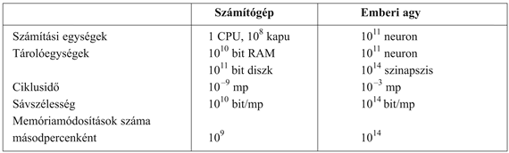

<?xml version="1.0" encoding="UTF-8" standalone="no"?>

<html xmlns="http://www.w3.org/1999/xhtml"><head><meta name="generator" content="DocBook XSL Stylesheets V1.76.1"/></head><body>

<h1 class="title"><a id="id524446"/>A mesterséges intelligencia alapjai</h1>

Ebben a részben azon tudományterületek rövid történetét mutatjuk be, amelyek ötleteikkel, nézőpontjukkal, módszereikkel hozzájárultak az MI-hez. Mint minden történetnél, most is csak kevés személyről és eseményről tudunk megemlékezni, másokat, akik, illetve amelyek szintén fontosak, figyelmen kívül hagyunk. Az eseményeket egy kérdéssorozat körül rendeztük sorba. Ugyanakkor azt a benyomást sem szeretnénk kelteni, mintha ezek a kérdések a terület által kizárólagosan vizsgált kérdések lennének, vagy, hogy ezek a tudományterületek célkitűzéseikben mind az MI irányába fejlődtek volna.

<h2 class="title"><a id="id524452"/>Filozófia (i. e. 428-tól napjainkig)</h2>

<ul class="itemizedlist"><li class="listitem">
Lehet-e formális szabályok révén helyes konklúziókhoz jutni?
</li><li class="listitem">
Hogyan emelkedik ki a mentális elme a fizikai agyból?
</li><li class="listitem">
Honnan jön a tudás?
</li><li class="listitem">
A tudás hogyan vezet a cselekvéshez?
</li></ul>

Arisztotelész (i. e. 384–322) volt az első, aki megkísérelte precízen megfogalmazni az elme racionális részén uralkodó törvényszerűségeket. A korrekt következtetéseket leíró szillogizmusok informális rendszerét fejlesztette ki, ami elvben lehetővé tette a konklúziók gépies származtatását, ha a kezdeti premisszák egyszer adottak voltak. Sokkal később Ramon Lull (élt 1315-ig) javasolta, hogy a hasznos következtetést éppenséggel egy gépezetre rá lehetne bízni. Az általa javasolt „fogalmi kerekek” a könyv borítóján láthatók. Thomas Hobbes (1588–1679) felvetette, hogy a következtetés olyan, mint egy numerikus számítás, vagyis hogy „csendes gondolatainkban kivonunk és összeadunk”. Eközben a számítások automatizálása már a legjobb úton haladt. 1500 körül Leonardo da Vinci (1452–1519) megtervezett – bár meg nem épített – egy mechanikus kalkulátort. A kalkulátor közelmúltbeli rekonstrukciója bebizonyította, hogy a tervezet működőképes volt. Az első ismert számítógépet 1623 körül Wilhelm Schickard (1592–1635) német tudós konstruálta, bár a Blaise Pascal (1623–1662) által 1642-ben épített Pascaline ismertebb. Pascal azt írta, hogy „az aritmetikai gép olyan hatást produkál, ami közelebbinek tűnik a gondolathoz, mint az állatok összes cselekvése”. Gottfried Wilhelm Leibniz (1646–1716) egy mechanikus berendezést épített, amely nem a számokon, hanem a fogalmakon végzett műveleteket, bár működési köre igen korlátozott volt.

Most, hogy van már elképzelésünk arról, hogy az elme formális, racionális részét milyen elvek alapján lehet leírni, a következő lépésként az elmét fizikai rendszernek tekintjük. René Descartes (1596–1650) elemezte először világosan az elme és az anyag közötti különbséget és az ebből adódó problémákat. Az elme tiszta fizikai megközelítésének egyik problémája az, hogy kevés helyet hagy a szabad akarat számára. Ha az elmét csupán fizikai törvények uralják, nincs több szabad akarata mint egy sziklának, amely „eldönti”, hogy a föld középpontja felé fog esni. Annak ellenére, hogy Descartes a következtetés hatalmának szószólója volt, ő volt az is, aki a <strong>dualizmus</strong>t (<strong>dualism</strong>) javasolta. Azt tartotta, hogy az elmének (vagy a léleknek) van olyan része, amely nem része a természetnek és nem alanya a fizikai törvényeknek. Ezzel szemben úgy érezte, hogy az állatok nélkülözik ezt a dualista természetet, lényegében gépeknek tekintendők. A dualizmus alternatívája a <strong>materializmus</strong> (<strong>materialism</strong>), amely azt tartja, hogy éppen az agynak a fizikai törvények szerinti működése <em>valósítja</em> <em>meg</em> az elmét. A szabad akarat nem más, mint az a mód, ahogyan a választási lehetőségek észlelése a döntési folyamat számára megjelenik.

Ha az elme a benne levő ismereteken operáló fizikai eszköz, akkor a következő probléma a tudás forrásának a meghatározása. Francis Bacon (1561–1626) <em>Novum Organum</em>ától[<a id="id524510" href="#ftn.id524510" class="footnote">3</a>] induló <strong>empiricista</strong> (<strong>empiricist</strong>) mozgalmat John Locke (1632–1704) kijelentése jellemzi: „Nincs semmi a megértésben, ami előbb ne létezne az érzékszervekben.” David Hume (1711–1776) <em>A</em> <em>Treatise of Human Nature</em> c. művében (Hume, 1739) javasolja azt a fogalmat, amit ma <strong>indukció</strong>nak (<strong>induction</strong>) nevezünk, nevezetesen hogy az általános elveket a komponenseik ismétlődő kapcsolataiból emeljük ki. Ludwig Wittgenstein (1889–1951) és Bertrand Russell (1872–1970) munkájára alapozva a Rudolf Carnap (1891–1970) vezette híres Bécsi Kör kialakította a <strong>logikai pozitivizmus</strong> (<strong>logical positivism</strong>) doktrínáját. Ez a doktrína azt állítja, hogy minden tudást végső soron az érzékszervi bemeneteknek megfelelő <strong>megfigyeléses állítások</strong>on (<strong>observation sentences</strong>) alapuló logikai elméletekkel meg lehet magyarázni.[<a id="id524566" href="#ftn.id524566" class="footnote">4</a>] Rudolf Carnap és Carl Hempel (1905–1997) <strong>igazoló elmélet</strong>e (<strong>confirmation theory</strong>) megkísérelte megvilágítani, miként gyarapítja a tudást a tapasztalat. Carnap könyve, a <em>The Logical Structure of the World</em> (Carnap, 1928) a tudás elemi tapasztalatból történő kinyerésére egy explicit számítási eljárást definiált. Ez volt talán az első olyan elmélet, amely az elmét számítási folyamatként ábrázolta.

Az elme filozófiai képének utolsó eleme a tudás és a cselekvés kapcsolata. Az MI szempontjából ez a kérdés elsődleges fontosságú, mert az intelligencia cselekvést is és következtetést is igényel. Továbbá ahhoz, hogy világos legyen előttünk, hogyan kell egy olyan ágenst építeni, amelynek cselekvései jogosak vagy racionálisak lesznek, meg kell értenünk, hogy hogyan igazolhatók a cselekvések. Arisztotelész a cselekvéseket azért tartotta jogosnak, mert a célok és a cselekvések kimenetelei között logikai kapcsolat lelhető fel (az alábbi idézet záró része a könyv borítóján is megtalálható):

<table border="0" width="100%" cellspacing="0" cellpadding="0" class="blockquote" summary="Block quote"><tr><td valign="top"> </td><td valign="top">
De hogyan lehetséges, hogy a gondolatot néha követi cselekvés, és néha nem, néha mozgással és néha anélkül? Úgy tűnik, mintha ugyanaz a dolog történne itt is, mint ami a változatlan objektumokra vonatkozó következtetések meghozatalánál. De ebben az esetben az eredmény egy spekulatív állítás … holott itt a premisszából következő konklúzió egy cselekvés. … Kellene egy ruha, a köpeny egy ruha. Kell egy köpeny.  Ami kell, azt elő kell állítanom, és kell egy köpeny. Elő kell állítanom egy köpenyt. A konklúzió tehát, hogy „elő kell állítanom egy köpenyt” nem más, mint egy cselekvés.
</td><td valign="top"> </td></tr><tr><td valign="top"> </td><td colspan="2" align="right" valign="top">--(Nussbaum, 1978, 40. o.)</td></tr></table>

A <em>Nicomachean Ethics</em>ben (III. könyv, 3, 1112b) Arisztotelész a témát tovább folytatja, egy algoritmust javasolva:

<table border="0" width="100%" cellspacing="0" cellpadding="0" class="blockquote" summary="Block quote"><tr><td valign="top"> </td><td valign="top">
Nem a célokat, hanem az eszközöket mérlegeljük. Az orvos nem azt fontolgatja, hogy gyógyítson-e, a szónok sem, hogy meggyőzzön-e, az államférfi sem azon hezitál, hogy jogot és törvényt teremtsen, és senki sem a célt mérlegeli. Mindenki feltételezi a célt, és azt fontolgatja, hogy az hogyan, milyen eszközökkel érhető el, és hogy azáltal könnyen és a lehető legjobban érhető-e el. És ha valamilyen eszközzel elérhető a cél, azt fontolgatjuk, hogy azzal az eszközzel <em>hogyan,</em> milyen módon érhetjük el, amíg a legelső okhoz el nem jutunk. Ez az ok a felfedezés sorában a legutolsó… és ami az elemzés rendjében az utolsó, a megtörténés rendjében elsőnek tűnik. És ha lehetetlenséghez jutunk, a keresést feladjuk, például ha pénzre van szükségünk, azt viszont megszerezni nem lehet. Ha azonban valami lehetségesnek tűnik, akkor megpróbálkozunk vele.
</td><td valign="top"> </td></tr><tr><td valign="top"> </td><td colspan="2" align="right" valign="top">--Arisztotelész</td></tr></table>

Arisztotelész megközelítését 2300 évvel később Newell és Simon a GPS-programjukban implementálták. Ma ezt regressziós tervkészítő rendszernek neveznénk (lásd<em> </em>11. fejezet).

A célalapú analízis hasznos, de nem segít akkor, amikor a célt több cselekvéssel is el lehet érni, vagy pedig, ha annak eléréséhez egy cselekvés sem elegendő. Antoine Arnauld (1612–1694) helyesen adta meg azt a kvantitatív formulát, hogy ilyen esetekben milyen cselekvéshez kellene folyamodni (lásd 16. fejezet). John Stuart Mill (1806–1873) <em>Utilitarianism</em> c. művében (Mill, 1863) a racionális döntés kritériumának a gondolatát az emberi cselekvés minden aspektusára kiterjesztette. A döntéshozatal egy jobban formalizált elméletéről a következő részben lesz szó.

<h2 class="title"><a id="id524620"/>Matematika (kb. 800-tól napjainkig)</h2>

<ul class="itemizedlist"><li class="listitem">
Melyek az érvényes következtetések formális szabályai?
</li><li class="listitem">
Mi az, ami kiszámítható?
</li><li class="listitem">
Hogyan vagyunk képesek a bizonytalan információ alapján következtetéseket levonni?
</li></ul>

A filozófusok számba vették az MI fontosabb ötleteit, de ahhoz, hogy a formális tudományra rátérhessünk, szükséges volt legalább három alapvető területnek – a logikának, a számítástechnikának és a valószínűségnek – bizonyos szintű matematikai formalizálása. 

A formális logika elképzelése egészen az ókori Görögország filozófusaihoz nyúlik vissza (lásd 7. fejezet), de a matematikai kialakulása George Boole (1815–1864) munkásságával kezdődött igazán, aki részleteiben kidolgozta az ítélet- vagy Boole-logikát (Boole, 1847). 1879-ben Gottlob Frege (1848–1925) kiterjesztette a Boole-logikát, hogy az objektumokat és relációkat is tartalmazhasson. Ezzel megalkotta azt az elsőrendű logikát, amely lényegében manapság a legalapvetőbb tudásreprezentációs rendszer.[<a id="id524642" href="#ftn.id524642" class="footnote">5</a>] Alfred Tarski (1902–1983) egy referenciaelméletet vezetett be, amely azt mutatja meg, hogy hogyan rendelhetők össze a logika és a valós világ objektumai. A következő lépés annak a kiderítése volt, hogy hol vannak a logikának és a számításoknak az alkalmazási határai.

Az első nem triviális <strong>algoritmus</strong>nak (<strong>algorithm</strong>) a legnagyobb közös osztót kiszámító euklideszi algoritmust tekintik. Az algoritmusok önmagában való tanulmányozása al-Hvárizmi, a 9. századi perzsa matematikus idejéig nyúlik vissza, akinek a művei az arab számokkal és az algebrával is megismertették Európát. Boole és mások a logikai dedukció algoritmusaival foglalkoztak, a 19. század végén pedig már erőfeszítések történtek az általános matematikai érvelés logikai dedukcióként való formalizálására. 1900-ban David Hilbert (1862–1943) 23 problémából álló listát publikált, amelyről – helyesen – azt vélte, hogy matematikus társait a század nagy részében le fogja kötni. Utolsó problémája azt firtatta, vajon létezik-e a természetes számokra vonatkozó tetszőleges logikai állítás igazságát eldöntő algoritmus. Ez a híres ún. <em>Entscheidungsproblem</em> (eldönthetőségi probléma). Hilbert lényegében azt a kérdést tette fel, hogy a hatékony bizonyítási eljárásoknak vannak-e elvi korlátjai. Kurt Gödel (1906–1978) 1930-ban megmutatta, hogy a Frege és Russell-féle elsőrendű logikában létezik hatékony eljárás tetszőleges igaz állítás bizonyítására. Az elsőrendű logika azonban nem elegendő a matematikai indukció kifejezéséhez, ez utóbbi viszont a természetes számok jellemzéséhez szükséges. 1931-ben Gödel meg is mutatta, hogy valóban léteznek elvi korlátok. <strong>Nemteljességi tétel</strong>e (<strong>incompleteness theorem</strong>) kimutatja, hogy minden, a természetes számok tulajdonságait kifejezni képes nyelvben léteznek igaz, de abban az értelemben eldönthetetlen állítások, hogy az igazságuk algoritmikusan nem mutatható ki.

Ez az alapvető eredmény úgy is interpretálható, hogy léteznek az egész számokon értelmezhető olyan függvények, amelyek algoritmikusan nem írhatók le, magyarán nem számíthatók ki. Ez motiválta Alan Turingot (1912–1954), hogy megkísérelje a <em>kiszámítható</em> függvények pontos jellemzését. Ez a megfogalmazás kissé problematikus, mert egy számítási procedúrának vagy egy hatékony eljárásnak a formális definícióját valójában lehetetlen megadni. Általánosan elfogadott azonban, hogy a Church–Turing-tézis, amely azt állítja, hogy a Turing-automata (Turing, 1936) képes minden kiszámítható függvényt kiszámítani, elegendő definíciót szolgáltat. Turing azt is kimutatta, hogy vannak olyan függvények, amelyeket semmilyen Turing-automata nem képes kiszámítani. Így például nincs olyan automata, amely <em>általánosságban</em> el tudná dönteni, hogy egy adott program egy adott bemenetre választ fog-e adni, vagy pedig örökké futni fog.

Ámbár az eldönthetetlenség és a kiszámíthatóság fontos fogalmak a számítások megértéséhez, a <strong>kezelhetetlenség</strong>nek (<strong>intractability</strong>) sokkal nagyobb hatása volt. Durván fogalmazva a problémák egy osztályát kezelhetetlennek mondjuk, ha az egyes problémapéldányok megoldásához szükséges idő legalább exponenciálisan nő a problémapéldányok nagyságától függően. A bonyolultság polinomiális és exponenciális növekedése közötti különbségre először az 1960-as évek közepén hívták fel a figyelmet (Cobham, 1964; Edmonds, 1965). A kétfajta növekedés közötti különbség fontos, mert az exponenciális növekedés következménye, hogy közepes nagyságú problémapéldányokat sem lehet értelmes időkorláton belül megoldani. Az intelligens viselkedés generálásának általános problémáját tehát inkább kezelhető, mint kezelhetetlen részproblémákra kellene lebontanunk.

Hogyan lehet egy kezelhetetlen problémát felismerni? A Stephen Cook és Richard Karp által útjára indított <strong>NP-teljesség</strong> (<strong>NP-completness</strong>) elmélete megadja rá a választ (Cook, 1971; Karp, 1972). Cook és Karp a kanonikus kombinatorikus keresési és következtetési problémák nagy osztályára belátta, hogy azok NP-teljesek. Bármilyen problémaosztály, amire egy NP-teljes problémaosztály visszavezethető, minden bizonnyal kezelhetetlen lesz (és bár még senkinek sem sikerült bebizonyítani, hogy az NP-teljes problémák szükségszerűen nem kezelhetők, kevés tudós van más véleményen). Ezek az eredmények élesen elütnek a számítógép megjelenését kísérő „elektronikus szuperagy – Einsteinnél gyorsabb” lelkesedéstől. Az egyre növekvő számítási sebesség ellenére az intelligens rendszerekre mindig jellemző lesz az erőforrások óvatos és kényes használata. Durván fogalmazva, a világ egy <em>rendkívül</em> nagy problémapéldány! Az utóbbi években az MI segített megérteni, hogy az NP-teljes problémák egyes példányai miért nehezek, holott mások könnyűnek bizonyulnak (Cheeseman és társai, 1991).

A logikán és a számításokon túlmenően a matematika harmadik nagy hozzájárulása az MI-hez a <strong>valószínűség-elmélet</strong> (<strong>probability</strong>). A valószínűség gondolatát – a szerencsejátékok lehetséges kimeneteleivel leírva – először az itáliai Girolamo Cardano (1501–1576) fogalmazta meg. A valószínűség hamarosan felbecsülhetetlen komponense lett az összes kvantitatív elméletnek, segítséget adva a bizonytalan mérések és hiányos elméletek kezeléséhez. Pierre Fermat (1601–1665), Blaise Pascal (1623–1662), James Bernoulli (1654–1705), Pierre Laplace (1749–1827) és mások az elméletet tovább fejlesztették, és új statisztikai módszereket vezettek be. A valószínűségek felfrissítési szabályát – új tények hatására – Thomas Bayes (1702–1761) javasolta. A Bayes-szabály és az azon alapuló Bayes-analízis az MI-rendszerekben alkalmazott bizonytalan következtetés korszerű megközelítésének az alapja. 

<h2 class="title"><a id="id524723"/>Gazdaságtan (1776-tól napjainkig)</h2>

<ul class="itemizedlist"><li class="listitem">
Hogyan kell döntenünk, hogy a hasznunk maximális legyen?
</li><li class="listitem">
Mit kell tennünk, ha mások esetleg nem segítőkészek?
</li><li class="listitem">
Hogyan kell döntenünk, ha a haszonhoz csak a távoli jövőben jutunk el?
</li></ul>

A közgazdaságtan tudománya 1776-ban kapott indító lökést, amikor is Adam Smith skót filozófus (1723–1790) megjelentette az <em>An Inquiry into the Nature and Causes of the Wealth of Nations</em> c. művét. Amíg az ókori görögök és mások a közgazdasági gondolkodáshoz járultak hozzá, addig Smith volt az első, aki a gazdaságtant tudományként kezelte, a gazdaságokat a saját gazdasági jólétet maximálizáló különálló ágensekből állóknak képzelve. Az emberek többsége azt véli, hogy a gazdaság lényege a pénz. A közgazdák azonban azt fogják állítani, hogy ők igazából azt tanulmányozzák, hogy az emberek hogyan döntenek, hogy kívánatos eredményekhez jussanak. A „kívánatos eredmények”, avagy a <strong>hasznosság</strong> (<strong>utility</strong>) matematikai kezelését elsőként Léon Walras (1834–1910) formalizálta. Ezt fejlesztette tovább Frank Ramsey (Ramsey, 1931) és később a <em>The Theory of Games and Economic Behavior</em> c. művében Neumann János és Oskar Morgenstern (Neumann és Morgenstern, 1944).

A <strong>döntéselmélet</strong> (<strong>decision theory</strong>), amely a valószínűség-elméletet és a hasznossági elméletet kapcsolja össze, a bizonytalanság melletti (gazdasági vagy egyéb) döntéshozatalhoz ad formális és teljes keretet – azaz azokban az esetekben, amikor a valószínűségi leírás megfelelően írja le a döntéshozó környezetét. Ez a megközelítés a „nagy” gazdaságokhoz jó, ahol az ágenseknek nem kell más ágensek (mint entitások) cselekvéseit figyelembe venni. „Kis” gazdaságokban a helyzet inkább egy <strong>játék</strong>ra (<strong>game</strong>) hasonlít: az egyik játékos cselekvései lényeges befolyással lehetnek a másik játékos hasznosságára (akár pozitív, akár negatív értelemben). A Neumann és Morgenstern által kifejlesztett <strong>játékelmélet</strong> (<strong>game theory</strong>) (lásd még Luce és Raiffa, 1957) olyan meglepő eredményeket is tartalmaz, miszerint az egyes játékokban a racionális ágensnek véletlenszerűen kell cselekednie, vagy legalábbis olyan módon, hogy az az ellenfelek számára véletlennek tűnjön.

Harmadik kérdésünkkel, vagyis, hogy hogyan kell racionálisan dönteni, ha a haszon nem azonnali, hanem több egymást követő cselekvés <em>sorozatának</em> az eredménye, a közgazdászok többsége nem foglalkozott. Ezt a feladatot az <strong>operációkutatás</strong> (<strong>operational research</strong>) területén vizsgálták, mely Angliában látott napvilágot, amikor a II. világháborúban a radartelepítést igyekezték optimalizálni, és amely később a komplex menedzsment döntéshozatal területén talált polgári alkalmazásokra. Richard Bellman (Bellman, 1957) a <strong>Markov döntési folyamat</strong>oknak (<strong>Markov decision process</strong>es) nevezett szekvenciális döntési problémákat formalizálta. Mi ezeket a 17. és 21. fejezetben tanulmányozzuk. 

A közgazdaságtan és az operációkutatás nagyban hozzájárult a racionális ágens felfogásunkhoz, mégis az MI-kutatás évekig egészen más pályán haladt. Az egyik ok a racionális döntéshozatal látszólag igen nagy <strong>komplexitás</strong>a (<strong>complexity</strong>) volt. Herbert Simon (1916–2001), az MI-kutatás egyik úttörője azzal nyerte meg 1978-ban a közgazdasági Nobel-díjat, hogy egy korai munkájában kimutatta, a <strong>kielégítő</strong> döntéshozatalon (<strong>satisfying</strong>), azaz az „elegendően jó” döntéseken alapuló modellek a tényleges emberi viselkedés jobb leírói, mint azok, amelyek hosszadalmas számításokkal meghatározott optimális döntések eredményeképp születtek (Simon, 1947). Az 1990-es években az ágensrendszerek területén a döntéselméleti technikák iránt fokozott érdeklődés mutatkozott (Wellman, 1995).

<h2 class="title"><a id="id512646"/>Neurális tudományok (1861-től napjainkig)</h2>

<ul class="itemizedlist"><li class="listitem">
Hogyan dolgozza fel az információt az agy?
</li></ul>

A <strong>neurális tudományok</strong> (<strong>neuroscience</strong>) az idegrendszert, de különösen az agyat tanulmányozzák. Annak egzakt módja, hogy hogyan keletkeznek a gondolatok az agyban, a tudomány egyik nagy feladványa. Évezredek óta tudjuk, hogy az agy valahogy részese a gondolatnak, hiszen egy erős fejbeütés a mentális funkciók károsodásához vezethet. Hosszú ideje azt is tudjuk, hogy az emberi agy valahogy más. I. e. 335-ben Arisztotelész azt írta, hogy „az összes állat közül méretéhez képest az ember agya a legnagyobb”.[<a id="id512586" href="#ftn.id512586" class="footnote">6</a>] Ennek ellenére csak a 18. század közepétől ismerték fel széles körben, hogy a tudat az agyban lakozik. Korábbi jelöltek között szerepelt a szív, a lép és a tobozmirigy.
<a id="ID_42_oldal"/>
<a id="id512575"/>
<strong>1.2. ábra - Az idegsejt vagy neuron részei. Minden neuron sejttestből vagy szómából áll, amely sejtmagot tartalmaz. A sejttestből ágazik el néhány dendritnek nevezett és egy hosszú, axonnak nevezett szál. Az axon jó messzire elér, sokkal messzebbre, mint ahogy ezt a jelen ábra sugallja. Az axonok tipikusan 1 cm hosszúak (ez a sejttest átmérőjének 100-szorosa), de elérhetik az 1 m-t is. Egy neuron 10–100 000 más neuronnal tart kapcsolatot a szinapszisoknak nevezett csatlakozásokon keresztül. A jeleket neuronról neuronra egy összetett elektrokémiai reakció továbbítja. A jelek rövid távon szabályozzák az agy aktivitását, hosszú távon pedig befolyásolják a neuronok helyzetét és a kapcsolódási rendszerüket. Úgy tartják, e mechanizmusok képezik az agyi tanulás alapját. Az információfeldolgozás zöme az agykéregben történik, ami az agy külső rétege. A feldolgozás szervezeti egysége, úgy tűnik, egy kb. 0,5 mm-es átmérőjű szövetoszlop, amelynek magassága az egész kéregre kiterjed, ez az embereknél kb. 4 mm. Egy oszlop kb. 20 000 neuront tartalmaz.</strong>

Paul Broca (1824–1880) afázia (beszédzavar) kutatása agysérült pácienseknél 1861-ben lökést adott e területnek, és meggyőzte az orvosi szakmát, hogy az agynak léteznek lokalizált, konkrét kognitív funkciókért felelős részei. Konkrétan azt mutatta ki, hogy a beszéd előállítása a bal félteke, most Broca-féle területnek nevezett részére korlátozódik.[<a id="id512540" href="#ftn.id512540" class="footnote">7</a>] Ekkor tudták már, hogy az agy idegsejtekből – <strong>neuron</strong>okból (<strong>neuron</strong>) – áll, de 1873-ig, amikor Camillo Golgi (1843–1926) kifejlesztett egy festési módszert, nem tudták az agyban az egyedi neuronokat megfigyelni (lásd 1.2. ábra). Ezt a módszert alkalmazta Santiago Ramon y Cajal (1852–1934) az agy neurális struktúráit feltáró úttörő munkájában.[<a id="id512507" href="#ftn.id512507" class="footnote">8</a>]

Ma már vannak adataink arról, hogy az agy egyes területei és az általuk kontrollált, vagy a szenzorikus bemeneteket generáló test részei között milyen leképezések vannak. Az ilyen leképezések hetek alatt képesek drasztikus változásokra, ráadásul egyes állatoknál úgy tűnik, többszörös leképezéseket találhatunk. Azt azonban még nem teljesen értjük, hogy az egyes területek miként veszik át más részek funkcióit, ha azok megsérülnek. Az egyedi emlékek tárolásáról kis híján semmilyen elméletünk nincs.

Az ép agy aktivitásának mérése 1929-ben kezdődött, amikor Hans Berger kidolgozta az elektroencefalográfia (EEG) elvét. A funkcionális mágneses rezonancia (fMRI) közelmúltbeli kifejlesztése (Ogawa és társai, 1990) eddig nem látott részletességgel tárja az idegsejtkutatók elé az agy aktivitását, olyan méréséket is lehetővé téve, amelyek érdekes módon korrelálnak a zajló kognitív folyamatokkal. Az ismereteket kiegészíti az egyedi sejt szintjén történő neuronaktivitás rögzítésének fejlődése. A nagymértékű fejlődés ellenére még messze vagyunk attól, hogy megértsük, hogy e kognitív folyamatok bármelyike valójában hogyan is működik.

<a id="id512478"/>
<strong>1.3. ábra - A számítógépek számítási erőforrásainak (2003 körül) és az agy erőforrásainak durva összehasonlítása. A könyv első kiadása óta a számítógépekre jellemző számok legalább egy 10-es szorzóval megnőttek, és várható, hogy ez a növekedés ebben az évtizedben is folytatódik. Az agyra jellemző számok az utóbbi 10 000 évben nem változtak.</strong>

<h3 class="title">Fontos</h3>
Az igazán csodálatos észrevétel az, hogy <em>egyszerű sejtek gyűjteménye elvezethet a gondolathoz, a cselekvéshez és a tudathoz,</em> vagy más szavakkal: az <em>agytól eljutunk az elméhez </em>(Searle, 1992). Az egyedüli elvi alternatíva a miszticizmus: hogy létezik egy misztikus világ, ahol megvalósul az elme a fizikai tudományok hatáskörén túl.

<h3 class="title">Fontos</h3>
Az agy és a számítógép igen eltérő feladatokat végeznek és eltérő tulajdonságokkal rendelkeznek. Az 1.3. ábra azt mutatja, hogy az emberi agyban tipikusan 1000-szer több neuron van, mint ahány kapu található egy korszerű számítógép processzorában. A Moore-törvény[<a id="id512409" href="#ftn.id512409" class="footnote">9</a>] alapján meg lehet jósolni, hogy egy processzorban lévő logikai kapuk száma az agyi neuronok számát 2020 körül éri el. Az ilyen jóslatokból persze vajmi kevés következtetésre lehet jutni. Ráadásul a tárolókapacitásbeli különbség elenyésző a kapcsolási sebességben és a párhuzamosságban mutatkozó különbségekhez képest. Egy számítógépes chip nanomásodpercek alatt hajt végre egy utasítást, a neuronok ennél milliószor lassabbak. Az agy ennél többet is kompenzál. Minden neuron és szinapszis egyidejűleg aktív, holott a legkorszerűbb számítógépeknek is csak egy vagy legfeljebb néhány processzora van. Így <em>annak ellenére, hogy a számítógép a nyers kapcsolási sebességben milliószor gyorsabb, az agy végeredményben százezerszer gyorsabban oldja meg a feladatait.</em>

<h2 class="title"><a id="id512390"/>Pszichológia (1879-től napjainkig)</h2>

<ul class="itemizedlist"><li class="listitem">
Hogyan gondolkoznak és cselekszenek az emberek és az állatok?
</li></ul>

Azt mondhatjuk, hogy a tudományos pszichológia Hermann von Helmholtz német fizikus (1821–1894) és tanítványa, Wilhelm Wundt (1832–1920) munkásságával kezdődött. Helmholtz tudományos módszereket alkalmazott az emberi látás tanulmányozásánál, és a <em>Handbook of Physiological Optics</em> c. művét még ma is úgy tekintik, mint „az emberi látás fizikájának és fiziológiának máig egyedüli legfontosabb tanulmányát” (Nalwa, 1993, 15. o.). Wundt 1879-ben a Lipcsei Egyetemen nyitotta meg a kísérleti pszichológia első laboratóriumát. Wundt ragaszkodott azon kísérletek szigorú ellenőrzéséhez, amelyekben munkatársai érzékelési, illetve asszociációs feladatokat végeztek, hogy közben a kísérletet végzők gondolkodási folyamatait is meg lehessen figyelni. A gondos felügyelet révén a pszichológia inkább tudománnyá vált, de az adatok szubjektív volta miatt valószínűtlen volt, hogy egy kísérletező képes legyen valaha is a saját elméleteit megcáfolni. Ezzel szemben az állati viselkedést tanulmányozó biológusok nem önmagukra vonatkozó adatokkal dolgoztak, és egy objektív módszertant dolgoztak ki, amit H. S. Jenkins (Jenkins, 1906) a <em>Behavior of Lower Organisms</em> c. nagy hatású műve mutat be. Ezt a nézőpontot az emberekre kivetítve a John Watson (1878–1958) vezette <strong>behaviorista</strong> mozgalom (<strong>behaviorism</strong>) a mentális folyamatok <em>minden</em> elméletét elutasította, azzal érvelve, hogy önelemzésből lehetetlen megbízható bizonyítékot szerezni. A behavioristák ragaszkodtak ahhoz, hogy az állatot érő érzést (vagy <em>ingert</em>) és az eredményül kapott cselekvést (másképpen <em>választ</em>) szigorúan objektív mércék szerint tanulmányozzuk. Olyan gondolati konstrukciókat, mint a tudást, a hiedelmeket, a célokat és a következtetés lépéseit elutasították, áltudományos, „népi pszichológiának” tartva azokat. A behaviorizmus eredményesnek bizonyult a patkányoknál és a galamboknál, de az emberek megértésében kevésbé volt sikeres. A pszichológiára azonban – különösképpen 1920 és 1960 között az Egyesült Államokban – erős hatást gyakorolt.

Az a <strong>kognitív pszichológiá</strong>t (<strong>cognitive psychology</strong>) jellemző alapvető nézet, miszerint az agy egy információfeldolgozó eszköz, egészen William James (1842–1910)[<a id="id512262" href="#ftn.id512262" class="footnote">10</a>] munkáihoz vezethető vissza. Helmholtz is ragaszkodott ahhoz az elképzeléshez, hogy az érzékelésben egy tudat alatti logikai következtetésnek is van szerepe. A kognitív álláspontot az Egyesült Államokban háttérbe szorította a behaviorizmus, de a Frederic Bartlett (1886–1969) vezette Cambridge-i Alkalmazott Pszichológiai Intézetben (Cambridge’s Applied Psychology Unit) a kognitív modellezés virágozhatott tovább. Kenneth Craiknek, aki Bartlett hallgatója, majd utódja volt, a <em>The Nature of Explanation</em> c. műve (Craik, 1943) határozottan visszaállította az olyan „mentális” fogalmak legitimációját, mint a hiedelmek és a célok, azzal érvelve, hogy ezek ugyanúgy tudományos fogalmak, mint a nyomás vagy a hőmérséklet, amikor gázokról beszélünk, miközben tudjuk, hogy a gázok molekulákból állnak, és azoknak sem nyomásuk, sem hőmérsékletük nincs. Craik megfogalmazta a tudásalapú ágens működésének három kulcsfontosságú lépését: (1) az ingert egy belső reprezentációra le kell fordítani, (2) e reprezentációt kognitív folyamatok manipulálják, és új belső reprezentációkat származtatnak belőle, amelyek (3) ismét cselekvésre fordítódnak vissza. Craik világosan megmagyarázta, hogy ez a megközelítés miért jó elgondolása egy ágensnek:

<table border="0" width="100%" cellspacing="0" cellpadding="0" class="blockquote" summary="Block quote"><tr><td valign="top"> </td><td valign="top">
Abban az esetben, ha egy szervezet magában hordja a külső valóság és a saját lehetséges cselekvéseinek „kisméretű modelljét”, képes különféle alternatívákat kipróbálni, a számára legjobb mellett dönteni, a jövőbeli helyzetekre azok bekövetkezése előtt reagálni, a múltbeli események ismeretét a jelen és a jövő kezelésében felhasználni, és a felmerülő szükséghelyzetekre minden vonatkozásban kimerítőbb, biztonságosabb és kompetensebb módon reagálni.
</td><td valign="top"> </td></tr><tr><td valign="top"> </td><td colspan="2" align="right" valign="top">--(Craik, 1943)</td></tr></table>

Miután Craik 1945-ben egy biciklibalesetben meghalt, munkáját Donald Broadbent folytatta. Műve, a <em>Perception and Communication</em> (Broadbent, 1958) a pszichológiai jelenségek néhány első információfeldolgozó modelljét írja le. Közben, az Egyesült Államokban, a számítógépes modellezés fejlődése elvezetett a <strong>kognitív tudomány</strong> (<strong>cognitive science</strong>) kialakulásához. Ez a terület mondhatni egy tudományos találkozóval indult 1956 szeptemberében az MIT-n. (Látni fogjuk, hogy ez éppen két hónappal később követte azt a konferenciát, ahol az MI „megszületett”.) A találkozón George Miller a <em>The Magic Number Seven,</em> Noam Chomsky a <em>Three Models of Language</em>, Allen Newell és Herbert Simon pedig a <em>The Logic Theory Machine</em> c. előadásokat tartották. Ez a három befolyásos előadás azt mutatta, hogy a számítógépes modelleket hogyan lehet bevetni a memória, a nyelv és a logikai gondolkodás pszichológiájába. Manapság a pszichológusok közt teljesen elfogadott, hogy „a kognitív elméletnek olyannak kell lennie, mint egy számítógépes programnak” (Anderson, 1980). Ezen azt értik, hogy az elméletnek egy kognitív funkció megvalósításához az információfeldolgozó mechanizmust részletesen le kell írnia.

<h2 class="title"><a id="id512142"/>Számítógépes tudományok (1940-től napjainkig)</h2>

<ul class="itemizedlist"><li class="listitem">
Hogyan lehet hatékony számítógépet építeni?
</li></ul>

A mesterséges intelligencia sikeréhez két dolog szükséges: intelligencia és valamilyen mesterségesen létrehozott termék, „műtermék”. A választott műtermék a számítógép lett. A korszerű digitális számítógépet, majdnem egy időben és egymástól függetlenül, három, a II. világháborúban harcoló országban találták fel. Az első <em>működőképes</em> számítógép az elektromechanikus Heath Robinson[<a id="id512090" href="#ftn.id512090" class="footnote">11</a>] volt, amit Alan Turing munkacsoportja 1940-ben épített azzal a kizárólagos céllal, hogy a német üzeneteket dekódolhassák. 1943-ban ugyanez a csoport fejlesztette ki a Colossust, egy elektroncsöves, nagy teljesítményű, általános célú gépet.[<a id="id512079" href="#ftn.id512079" class="footnote">12</a>] Az első működőképes <em>programozható</em> számítógép a Z–3, a német Konrad Zuse 1941-ből származó találmánya volt. A lebegőpontos számokat is Zuse találta ki, és ő volt az, aki az első magas szintű programozási nyelvet, a Plankalkült kifejlesztette. Az Egyesült Államokban az első <em>elektronikus</em> számítógépet, az ABC-t, John Atanasoff és végzős hallgatója, Clifford Berry állították össze 1940 és 1942 között az Iowai Állami Egyetemen. Munkájukat nemigen támogatták, elismerést sem kaptak érte. A mai számítógép előfutárai közül a legnagyobb hatású gép az ENIAC volt, amelyet egy titkos katonai projekt részeként John Mauchly és John Eckert részvételével a Pennsylvaniai Egyetem egy csoportja fejlesztett ki. 

Az azóta eltelt fél évszázad során a számítógéphardver minden újabb generációja sebességben és kapacitásban növekedést, árban esést hozott. A teljesítőképesség mintegy 18 havonta megduplázódik, és ez így mehet még egy vagy két évtizedig. Utána molukuláris gépekre vagy valamilyen más technológiára lesz szükségünk. 

Természetesen voltak számítóberendezések az elektronikus számítógépek előtt is. A 17. századból származó legkorábbi automatizált gépekről már a filozófiánál volt szó. Az első <em>programozható</em> gép Joseph Marie Jacquard 1805-ben feltalált szövőszéke volt, amely lyukasztott kártyákon tárolta a szövőmintához szükséges utasításokat. A 19. század közepe táján Charles Babbage (1792–1871) két gépet tervezett, de egyiket sem fejezte be. A könyvünk borítóján is látható Difference Engine rendeltetése matematikai táblázatok számítása lett volna mérnöki és tudományos feladatokhoz. Végül is ezt a gépet 1991-ben megépítették, és a londoni Science Museumban működés közben bemutatták (Swade, 1993). A Babbage-féle Analitikus Gép (Analytical Engine) sokkal ambiciózusabb terv volt. Címezhető memóriájával, tárolt programjával és feltételes ugrásaival ez volt az első, univerzális számításokra alkalmas műtermék. Ada Lovelace, Babbage kolléganője, Lord Byron költő lánya volt talán a világ első programozója. (Az Ada programozási nyelv róla kapta a nevét.) Ada programokat írt a befejezetlen Analitikus Gépre, sőt azon is spekulált, hogy a gép sakkjátékra vagy zenekomponálásra is képes lehet. 

Az MI a számítógép-tudományok szoftveroldalának is adósa, hiszen ez szolgáltatja az operációs rendszereket, a programozási nyelveket és a korszerű programok írásához szükséges eszközöket (és a róluk szóló cikkeket). Ez azonban egy olyan terület, ahol az adósságot törlesztették is. Az MI-kutatásokban megjelent sok ötlet visszakerült a számítógépes tudományok „fő áramlatába”, beleértve az időosztásos (time-sharing) operációs rendszereket, az interaktív értelmezőket, a személyi számítógépeket ablakokkal és egérrel, a gyors fejlesztést lehetővé tevő fejlesztői környezeteket, a láncolt listás adatszerkezeteket, az automatikus tárolókezelést és az objektumorientált, szimbolikus, funkcionális és dinamikus programozás kulcsfontosságú fogalmait.

<h2 class="title"><a id="id512017"/>Irányításelmélet és kibernetika (1948-tól napjainkig)</h2>

<ul class="itemizedlist"><li class="listitem">
Hogyan működhet egy műtermék a saját irányítása mellett?
</li></ul>

Az első önszabályozó gépezetet – egy vízi órát, amely olyan szabályozóval volt ellátva, hogy a víz átfolyását konstans, megjósolható értéken tartotta – az alexandriai Ktesibios (i. e. kb. 250) építette. Ez a találmány megváltoztatta annak definícióját, hogy egy műtermék mire képes. Korábban csak az élő dolgokról tartották, hogy képesek a viselkedésüket a környezeti változások hatására módosítani. Az önszabályozó visszacsatolt szabályozó rendszerek további példái a James Watt (1736–1819) építette gőzgépszabályozó vagy a Cornelis Drebbel (1572–1633) által feltalált termosztát. Cornelius Drebbel volt az is, aki a tengeralattjárót feltalálta. A stabil visszacsatolt rendszerek elméletét a 19. században fejlesztették ki.

A ma <strong>irányításelmélet</strong>nek (<strong>control theory</strong>) nevezett terület keletkezésében Norbert Wiener (1894–1964) játszott központi szerepet. Wiener zseniális matematikus volt, aki többek közt Bertrand Russell-lel is együttműködött, mielőtt az érdeklődését a biológiai és mechanikai szabályozó rendszereknek és ezek a kognitív mechanizmusokkal való kapcsolatának szentelte. Craikhoz hasonlóan (aki szintén használt szabályozási rendszereket mint pszichológiai modelleket), Wiener és kollégái, Arturo Rosenblueth és Julian Bigelow kihívást jelentettek a behaviorista ortodoxia számára (Rosenblueth és társai, 1943). Nézetük szerint a célorientált viselkedés a „hibát” – az aktuális állapot és a célállapot közötti különbséget – minimalizáló szabályozó mechanizmusból fejlődik ki. Az 1940-es évek végén Wiener, Warren McCulloch-val, Walter Pittsszel és Neumann Jánossal együtt egy sor konferenciát szervezett, ahol a kognitív folyamatok új matematikai és számítási modelljeivel foglalkoztak, és a behaviorista tudományok területén sok tudósra voltak hatással. Wiener <em>Cybernetics</em> c. könyve (Wiener, 1948) bestseller lett, és ráébresztette a széles publikumot az intelligens mesterséges gépek lehetőségére.

A korszerű irányításelmélet, és különösen ennek a <em>sztochasztikus optimális szabályozás</em> nevű ága olyan rendszerek kifejlesztését tűzte ki célul, amelyek egy <strong>célfüggvény</strong>t (<strong>objective function</strong>) maximalizálnak az időben. Ez nagyjából megegyezik az MI-ről alkotott képünkkel: optimálisan viselkedő rendszereket fejleszteni. Akkor miért lett az MI és az irányításelmélet két különböző kutatási terület, hiszen megalkotói még szoros kapcsolatban is álltak egymással? A válasz forrása az a szoros kapcsolat, amely a résztvevők által ismert matematikai technikák és az ezeknek megfelelő, mindegyik világképben megjelenő problémák halmaza között alakult ki. Az irányításelmélet eszközei, a mátrixalgebra és az analízis folytonos változók rögzített halmazai által leírható rendszerekhez vezettek. Az egzakt analízis ráadásul tipikusan csak <em>lineáris</em> rendszerek esetében lehetséges. Az MI-t részben azért alkották meg, hogy az irányításelmélet 1950-es évekbeli matematikájától meg tudjanak szabadulni. A logikai következtetés és a számítás eszközei lehetővé tették az MI-kutatók számára, hogy olyan problémákat is figyelembe vegyenek, mint a nyelv, a látás és a tervkészítés, amelyek az irányításelméleti célkitűzéseken teljesen kívül estek.

<h2 class="title"><a id="id511901"/>Nyelvészet (1957-től napjainkig)</h2>

<ul class="itemizedlist"><li class="listitem">
Mi a nyelv és a gondolat kapcsolata?
</li></ul>

B. F. Skinner 1957-ben publikálta a <em>Verbal Behavior</em> c. művét. A könyv e terület egyik legjobb szakértőjének tollából a nyelvtanulás behaviorista megközelítésének átfogó és részletes tárgyalását adta. Furcsamód a könyvismertető ugyanolyan híres lett, mint maga a könyv, és a behaviorizmus iránti érdeklődést csaknem kiirtotta. Az ismertető írója Noam Chomsky volt, aki épp akkor publikálta a saját elméletéről szóló <em>Syntactic Structures </em>c. könyvét. Chomsky kimutatta, hogy a behaviorista elmélet nem kezeli a nyelvben meglevő kreativitást. Az elmélet nem tudta megmagyarázni, hogy egy gyerek miként képes olyan mondatokat megérteni vagy megformálni, amilyeneket korábban soha nem hallott. Chomskynak, Pánini (kb. i. e. 350) indiai nyelvészig viszszatekintő, szintaktikai modellekre alapozó elmélete viszont magyarázatot tudott adni erre, és a korábbi elméletekkel ellentétben kellően formális volt ahhoz, hogy legalább elvben programozható is legyen.

A modern nyelvészet és az MI nagyjából ugyanabban az időben „született meg” és együtt fejlődött, a nyelv használatára összpontosító <strong>számítógépes nyelvészet</strong>nek (<strong>computational linguistics</strong>) vagy <strong>természetes nyelvfeldolgozás</strong>nak (<strong>natural language processing</strong>) nevezett hibrid területen találkozva egymással. A nyelv megértésének problémája rövidesen sokkal bonyolultabbnak bizonyult, mint ahogy ez 1957-ben látszott. A nyelv megértéséhez meg kell érteni a témát és a kontextust is, nem elegendő ehhez a mondat struktúrájának a megértése. Ez persze triviálisnak tűnhet, azonban az 1960-as évekig mégsem volt általánosan elfogadott. A <strong>tudásreprezentáció</strong>hoz (<strong>knowledge r</strong><strong>epresentation</strong>) – amely annak a kutatása, hogy a tudást hogyan fejezzük ki a számítógép által feldolgozható formában – tartozó kezdeti kutatások zöme a nyelvhez kötődött és a nyelvészeti kutatásokból táplálkozott, azok viszont a nyelv évtizedes filozófiai elemzéseivel voltak kapcsolatban.

 

[<a id="ftn.id524510" href="#id524510" class="para">3</a>]  Az Arisztotelész-féle <em>Organon, </em>azaz a gondolkodás eszközének egy újabb változata.

[<a id="ftn.id524566" href="#id524566" class="para">4</a>]  Ebben a megközelítésben, megvizsgálva a szavak értelmét illetve kísérleteket végezve, vagy igazolni, vagy cáfolni lehet minden értelmes állítást. Mivel ez – a szándéknak megfelelően – a metafizika többségét kizárja, a logikai pozitivizmus bizonyos körökben nem volt népszerű.

[<a id="ftn.id524642" href="#id524642" class="para">5</a>]  Az elsőrendű logika Frege javasolta felírása soha nem terjedt el. A nyilvánvaló okát könnyen megértjük, ha a borítón lévő példára pillantunk.

[<a id="ftn.id512586" href="#id512586" class="para">6</a>]  Azóta sikerült felfedezni, hogy az egyes delfin- és cetfajtáknál az agy relatív nagysága még nagyobb. Most úgy tartják, hogy az emberi agy tekintélyes nagyságát hűtőrendszerének fejlettsége teszi lehetővé.

[<a id="ftn.id512540" href="#id512540" class="para">7</a>]  Sokan Alexander Hoodot (Hood, 1824) idézik, mint lehetséges elsődleges forrást.

[<a id="ftn.id512507" href="#id512507" class="para">8</a>]  Golgi kitartott abban a hiedelmében, hogy az agyi funkciók egy folytonos közegben valósulnak meg, amibe a neuronok be vannak ágyazva. Ezzel ellentétben Cajal a „neurondoktrínát” képviselte. 1906-ban mindketten (megosztott) Nobel-díjban részesültek, de a díj átvételekor meglehetősen ellenséges hangnemű beszédeket tartottak.

[<a id="ftn.id512409" href="#id512409" class="para">9</a>]  A Moore-törvény azt állítja, hogy az egy négyzetcentiméterre eső tranzisztorok száma minden 1–1,5 évben megduplázódik. Az emberi agy kapacitása durván 2–4 millió évenként duplázódik.

[<a id="ftn.id512262" href="#id512262" class="para">10</a>]  William James Henry James író testvére volt. Azt mondják, hogy Henry úgy írt irodalmat, mintha pszichológia lenne, William viszont a pszichológiát írta úgy, mintha irodalom lenne.

[<a id="ftn.id512090" href="#id512090" class="para">11</a>]  Heath Robinson karikatúrarajzoló volt, aki a mindennapi feladatokhoz, mint például a vajaskenyér-kenéshez, kitalált szeszélyes és abszurd módon bonyolult szerkezeteiről volt híres.

[<a id="ftn.id512079" href="#id512079" class="para">12</a>]  A háború után Turing szerette volna ezeket a számítógépeket az MI-kutatáshoz – például az egyik legelső sakkprogramhoz (Turing és társai, 1953) – felhasználni. Erőfeszítéseinek azonban a brit kormány vetett gátat.

</body></html>
