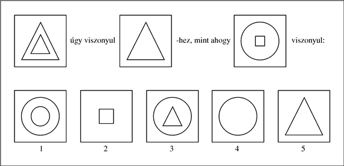
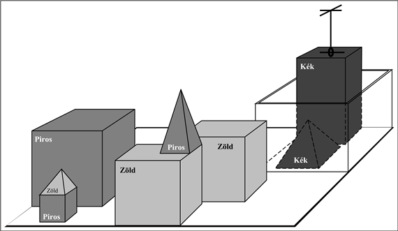

<?xml version="1.0" encoding="UTF-8" standalone="no"?>
<!DOCTYPE html PUBLIC "-//W3C//DTD XHTML 1.1//EN" "http://www.w3.org/TR/xhtml11/DTD/xhtml11.dtd">
<html xmlns="http://www.w3.org/1999/xhtml"><head><meta name="generator" content="DocBook XSL Stylesheets V1.76.1"/></head><body>

<h1 class="title"><a id="id511748"/>A mesterséges intelligencia története</h1>

A bevezető anyaggal a hátunk mögött most már készek vagyunk arra, hogy felvázoljuk a szó szoros értelmében vett mesterséges intelligencia fejlődését. 

<h2 class="title"><a id="id511734"/>A mesterséges intelligencia érlelődése (1943–1955)</h2>

Az első olyan eredményt, amit ma általánosan MI-eredménynek ismernek el, Warren McCulloch és Walter Pitts érte el (McCulloch és Pitts, 1943). Három forrásból merítettek: az alapszintű fiziológiai és az agyi neuronok működésére vonatkozó ismeretekből, az ítéletkalkulus Russell és Whitehead-féle formális elemzéséből és Turing számításelméletéből. Egy mesterséges neuron modellt javasoltak, ahol minden neuron vagy „bekapcsolt”, vagy „kikapcsolt” állapotban lehet, és ahol az átkapcsolás „be” állapotba akkor történik, amikor a neuront kellő számú szomszédos neuron stimulálja. A neuron állapotáról azt tartották, hogy „ténylegesen azzal a logikai állítással ekvivalens, amely a megfelelő ingert kiváltotta”. Kimutatták például, hogy összekapcsolt neuronok valamilyen hálózatával minden kiszámítható függvény előállítható, és hogy egyszerű hálóstruktúrákkal az összes logikai műveletet (ÉS, VAGY, NEM stb.) is elő lehet állítani. McCulloch és Pitts azt is felvetette, hogy egy megfelelően kialakított háló képes lehet tanulni is. Donald Hebb egy olyan egyszerű értékfrissítő szabályt mutatott be a neuronok közötti összeköttetések erősségének módosítására, amely lehetővé teszi a tanulást (Hebb, 1949). Tanulási szabálya, amit <strong>Hebb-tanulás</strong>nak (<strong>Hebbian learning</strong>) nevezünk, máig érvényes hatású modellnek bizonyult.

1951-ben a Princeton Egyetem matematika tanszékén két végzős hallgató – Marvin Minsky és Dean Edmonds – megépítette az első neurális számítógépet. A Snarc-nak elnevezett gépben 3000 elektroncső és a B–24 bombázó automatapilóta mechanizmusa egy 40 neuronból álló hálózatot szimulált. Minsky PhD-bizottsága szkeptikus volt, vajon egy ilyen munkát matematikának lehet-e nevezni, de Neumann János (aki tagja volt a bizottságnak) állítólag úgy nyilatkozott, hogy „ha ez nem is matematika most, valamikor az lesz”. Minsky volt később az, aki nagy hatású tételeivel kimutatta a neuronhálós kutatás korlátait.

Sok kezdeti eredményt lehetne MI-nek nevezni, azonban egy teljes elképzelést az MI-ről 1950-ben Alan Turing fogalmazott meg a <em>Computing Machinery and Intelligence</em> c. cikkében. Itt vezette be a Turing-teszt, a gépi tanulás, a genetikus algoritmusok és a megerősítéses tanulás fogalmakat.

<h2 class="title"><a id="id511667"/>A mesterséges intelligencia megszületése (1956)</h2>

Princeton volt az otthona az MI egy másik befolyásos személyiségének, John McCarthynak. Az egyetem befejezése után McCarthy a Dartmouth College-ba került, ami a témakör hivatalos szülőhelye lett. McCarthy meggyőzte Minskyt, Claude Shannont és Nathaniel Rochestert, hogy segítsenek neki azokat az amerikai kutatókat összehozni, akik érdekeltek az automataelméletben, a neurális hálókban és az intelligencia kutatásában. 1956 nyarán egy két hónapos munkatalálkozót szerveztek Dartmouthban. Összesen tíz résztvevő gyűlt össze, beleértve Trenchard More-t Princetonból, Arthur Samuelt az IBM-től, valamint Ray Solomonoffot és Oliver Selfridge-et az MIT-ből.

A pálmát a Carnegie Tech.[<a id="id511645" href="#ftn.id511645" class="footnote">13</a>] két kutatója, Allen Newell és Herbert Simon vitte el. Bár másoknak is voltak ötletei, és néhány esetben konkrét alkalmazásra – dámajátékra – voltak programjaik is, Newell és Simon már egy következtető programmal, a Logic Theorist (LT)-vel rendelkezett.[<a id="id511626" href="#ftn.id511626" class="footnote">14</a>] Erről Simon azt állította, hogy „egy olyan programot találtunk fel, amely képes nemnumerikusan gondolkodni, és ezzel meg is oldottuk a tiszteletre méltó anyag-szellem viszony problémáját”. Nem sokkal a munkatalálkozó után a program képes volt bebizonyítani a Russell és Whitehead <em>Principia Mathematica</em> c. művének 2. fejezetében foglalt tételek többségét. Azt mondják, Russell el volt ragadtatva, amikor Simon megmutatta neki, hogy az egyik tétel esetén a program rövidebb bizonyítással állt elő, mint amit a <em>Principiá</em>ban közöltek. A <em>Journal of Symbolic Logic</em> szerkesztőit kevésbé hatotta meg a dolog. A Newell, Simon és a Logic Theorist szerzői hármastól származó cikket elutasították.

A dartmouthi munkatalálkozó új áttöréshez ugyan nem vezetett, de a fontos személyiségek bemutatkoztak egymásnak. A következő húsz évben ők, továbbá hallgatóik és kollégáik az MIT-n, a CMU-n, a Stanfordon és az IBM-nél lesznek azok, akik meghatározó szerepet töltenek be az MI területén. A munkatalálkozó talán legtartósabb eredménye az volt, hogy elfogadták a terület McCarthy által kreált új nevét, azaz a <strong>mesterséges intelligenciá</strong>t (<strong>artificial intelligence</strong>). A „számítási racionalitás” talán jobb név lett volna, de az „MI” név azóta is megmaradt.

Ha bepillantunk a dartmouthi munkatalálkozót javasló anyagba (McCarthy és társai, 1955), látjuk, miért volt szükségszerű, hogy az MI egy külön területté váljon. De miért nem lehetett az MI-kutatást az irányításelmélet, az operációkutatás vagy a döntéselmélet keretein belül tartani, amikor ráadásul ezek célkitűzései nagyon hasonlók az MI célkitűzéseihez? Vagy az MI miért nem lett a matematika egyik ága? Az első válasz az, hogy az MI a kezdetek óta sajátjának tekintette az olyan emberi képességek duplikálását, mint a kreativitás, az önfejlesztés és a nyelv használata. Ezekkel a kérdésekkel semmilyen más terület nem foglalkozott. A másik válasz a módszertanban rejlik. Az említett területek közül tisztán csak az MI tekinthető a számítógépes tudományok egy ágának (bár az operációkutatás szintén súlyt helyez a számítógépes szimulációkra). Az MI az egyetlen olyan terület, ahol bonyolult, változó környezetben autonóm módon működő gépek építése a cél. 

<h2 class="title"><a id="id511548"/>Korai lelkesedés, nagy elvárások (1952–1969)</h2>

Az MI korai évei – bizonyos kereteken belül – bővelkedtek a sikerekben. Ha figyelembe vesszük azoknak az időknek a primitív számítógépeit és programozási eszközeit, továbbá azt, hogy még néhány évvel korábban is csupán aritmetikai feladatok elvégzésére tartották alkalmasnak a számítógépet, megdöbbentő volt, hogy a számítógép akár csak távolról is okosnak tűnő dologra lehet képes. Értelmiségi körökben, összességében, inkább azt szerették volna hinni, hogy „a gép <em>X</em>-re soha nem lesz képes” (az <em>X</em>-ek, Turing által kigyűjtött hosszú listája a 26. fejezetben található). Az MI kutatói természetesen erre azzal válaszoltak, hogy egymás után demonstrálták az <em>X</em>-eket. A modern MI-kutatók közül néhányan úgy említik ezt az időszakot, mint a „Nézze uram, biz’ isten, magától megy!” idejét.

Newell és Simon kezdeti sikerét az általános problémamegoldó program, a General Problem Solver, GPS követte. A Logic Theoristtal ellentétben ezt a programot eleve úgy tervezték, hogy az emberi problémamegoldás protokolljait imitálja. Az derült ki, hogy a program által kezelhető feladványok osztályán belül, a részcélok és a lehetséges cselekvések megfontolásának sorrendje tényleg hasonlított ahhoz, mint ahogy a hasonló problémákon dolgozó emberek cselekszenek. Így, a GPS volt talán az első, az „emberi módon gondolkodni” megközelítést megtestesítő program. A GPS és az azt követő programok sikere arra késztette Newellt és Simont (Newell és Simon, 1976), hogy megfogalmazzák híres <strong>fizikai szimbólumrendszer</strong> hipotézisüket (<strong>physical symbol system</strong>), amely azt állítja, hogy „a fizikai szimbólumrendszerek az általános intelligens cselekvés szükséges és elégséges eszközeivel rendelkeznek”. Arra gondoltak, hogy minden, intelligenciát felmutató rendszernek (legyen az ember vagy gép) képesnek kell lennie arra, hogy szimbólumokból álló adatstruktúrákat manipuláljon. Később látni fogjuk, hogy e hipotézist több irányból is megtámadták.

Az első néhány MI-programot az IBM-nél Nathaniel Rochester és kollégái fejlesztették ki. Herbert Gelernter egy olyan geometriai tételbizonyító programot (Geometry Theorem Prover, Gelernter, 1959) írt, mely sok matematikus hallgató által trükkösnek talált tételt tudott bebizonyítani. 1952-től kezdve Arthur Samuel dámajátékot játszó programokat írt, amelyek végül megtanultak egy erős amatőr versenyzői szinten játszani. Eközben sikerült megcáfolnia, hogy a számítógép csak arra képes, amire utasítják, hiszen programja gyorsan megtanult nála is jobban játszani. A program tv-bemutatása 1956 februárjában igen nagy hatást keltett. Turinghoz hasonlóan Samuelnek is csak nehezen sikerült gépidőt szereznie. Éjszaka dolgozott, az IBM számítógépes üzemében végtesztelésre váró gépeket használva. A kétszemélyes játékokkal a 6. fejezet<em>,</em> a Samuel által használt tanuló technikával és annak továbbfejlesztésével a 21. fejezet foglalkozik.

John McCarthy Dartmouth-ból átment az MIT-re, és ott egyetlen év alatt, a történelminek nevezhető 1958-as évben, három kulcsfontosságú eredményt ért el. Az 1. számú MIT AI Lab Memóban definiálta a <strong>Lisp</strong>et, amely elsődleges MI-programozási nyelvvé nőtte ki magát. A Lisp a második legrégebbi nyelv, amely még használatban van, a Fortrannál csak egy évvel fiatalabb. A Lisp esetén McCarthy rendelkezett már a szükséges eszközzel, de a ritka és drága számítógépes erőforrásokhoz való hozzáférés számára is komoly problémát jelentett. Így aztán az MIT-n McCarthy és mások kitalálták az időosztást. Szintén 1958-ban McCarthy <em>Programs with Common Sense</em> címen cikket publikált, amelyben az Advice Takert írta le. Ez egy hipotetikus program, amit az első teljes MI-rendszernek tekinthetünk. A Logic Theoristhez és a Geometry Theorem Proverhez hasonlóan McCarthy programja is tudást használt fel egy probléma megoldásának megtalálásához. Azonban másokkal ellentétben, ennek a programnak a világra vonatkozó általános tudással kellett rendelkeznie. McCarthy megmutatta például, hogy néhány egyszerű axióma elegendő ahhoz, hogy programja képes legyen terveket generálni arra vonatkozóan, hogyan kell a repülőtérre kimenni ahhoz, hogy a repülőgépet le ne késsük. A programot úgy tervezte, hogy képes legyen normális működés közben új axiómákat is elfogadni, és ennek eredményeként <em>átprogramozás nélkül</em> új területeken is kompetenciát mutatni. Az Advice Taker ily módon a tudásreprezentáció és a következtetés leglényegesebb elveit testesítette meg, miszerint hasznos, ha rendelkezünk a világot és az ágens cselekvéseinek eredményét leíró explicit és formális reprezentációval, és képesek vagyunk ezt a reprezentációt deduktív módon manipulálni. Figyelemre méltó, hogy 35 év múltával még mennyire releváns maradt az 1958-as cikk.

1958 volt az az év is, amikor Marvin Minsky az MIT-re ment át. Kezdeti együttműködése McCarthyval nem tartott sokáig. McCarthy a reprezentációra és a formális logikai következtetésre tette a hangsúlyt, Minskyt inkább az érdekelte, hogy a programok működőképesek legyenek, majd végül logikaellenes álláspontra helyezkedett. 1963-ban McCarthy a Stanfordon megalakította az ottani MI-labort. Kutatási programja – amely arra irányult, hogy a logikát felhasználja a legvégső Advice Taker építésében – lökést kapott, amikor J. A. Robinson felfedezte a rezolúciót, az elsőrendű logika teljes bizonyítási eljárását (lásd 9. fejezet). A Stanfordon a kutatás hangsúlyozottan a logikai következtetés általános módszereire irányult. A logika alkalmazásaihoz tartoztak Cordellnek a Green kérdését megválaszoló és tervkészítő rendszerei (Green, 1969b), továbbá Shakey robotikus projektje az új Stanfordi Kutatóintézetben (Stanford Research Institute, SRI).[<a id="id511086" href="#ftn.id511086" class="footnote">15</a>] Ez a projekt – amit részletesebben a 25. fejezetben tárgyalunk – volt az első, amely a logikai következtetést és a fizikai aktivitást teljes egészében integrálta.
<a id="ID_52_oldal"/>
<a id="id511137"/>
<strong>1.4. ábra - Egy konkrét probléma, amelyet Evans <code class="code">ANALOGY</code> programja megoldott</strong>

Minsky a hallgatók egész sorát irányította, akik a megoldásokhoz láthatóan intelligenciát igénylő, korlátos problémákkal foglalkoztak. Ezeket a korlátos problématerületeket később <strong>mikrovilág</strong>oknak<strong> </strong>(<strong>microworld</strong>s) nevezték el. James Slagle <code class="code">SAINT</code> nevű programja (Slagle, 1963a) képes volt az elsőéves analízis tanfolyamra jellemző, zárt alakra hozható integrálszámítási feladatokat megoldani. Tom Evans <code class="code">ANALOGY</code> programja (Evans, 1968) az IQ-tesztekben előforduló (lásd 1.4. ábra) geometriai analógia jellegű problémákat oldotta meg. Daniel Bobrow <code class="code">STUDENT</code> programja (Bobrow, 1967) olyan algebrai feladványokat oldott meg, mint például az alábbi:

<table border="0" width="100%" cellspacing="0" cellpadding="0" class="blockquote" summary="Block quote"><tr><td valign="top"> </td><td valign="top">
Ha Tamás ügyfeleinek a száma kétszerese az általa közzétett hirdetések 20%-a négyzetének, és Tamás 45 hirdetést adott közzé, akkor hány ügyfele van Tamásnak?
</td><td valign="top"> </td></tr><tr><td valign="top"> </td><td colspan="2" align="right" valign="top">--Bobrow, 1967</td></tr></table>

A mikrovilágok legismertebbike a kockavilág lett, amely egy asztalra (vagy gyakrabban egy szimulált asztalra) helyezett tömör geometriai testekből áll (lásd 1.5. ábra). Az ilyen világban értelmezett feladat a kockák egy bizonyos átrendezése egy olyan robotkar segítségével, amely egyszerre egyetlenegy kockát képes megfogni. A kockavilág otthont adott David Huffman gépi látási projektjének (Huffman, 1971), David Waltz gépi látási és kényszerterjesztés-kutatásának (Waltz, 1975), Patrick Winston tanulási elméletének (Winston, 1970), Terry Winograd természetes nyelvfeldolgozási programjának (Winograd, 1972) és Scott Fahlman tervkészítő programjának (Fahlman, 1974).

<a id="id511412"/>
<strong>1.5. ábra - Egy elrendezés a kockavilágban. A <code class="code">SHRDLU</code> robot (Winograd, 1972) éppen sikeresen teljesítette a „keresd meg azt a blokkot, ami a kezedben tartottnál magasabb, és tedd a dobozba” utasítást.</strong>

A McCulloch és Pitts neurális hálóin alapuló kezdeti kutatás szintén virágzott. Winograd és Cowan eredményei megmutatták, hogy a nagyszámú elem hogyan képes együttesen egy egyedi fogalmat reprezentálni, miközben növeli a párhuzamosságot és a robusztusságot (Winograd és Cowan, 1963). Hebb tanulási módszereit Bernie Widrow (Widrow és Hoff, 1960; Widrow, 1962) fejlesztette tovább, aki a hálózatait <strong>adaline</strong>-oknak nevezte, továbbá Frank Rosenblatt, aki a <strong>perceptron</strong>okat vezette be (Rosenblatt, 1962). Rosenblatt bebizonyította <strong>perceptron konvergencia tétel</strong>ét (<strong>perceptron convergence theorem</strong>), kimutatva ezzel, hogy tanulási algoritmusa képes a perceptron súlyait úgy módosítani, hogy az tetszőleges bemeneti adatokhoz illeszkedjen, feltéve, hogy ilyen illeszkedés egyáltalán lehetséges. Ezekről a kérdésekről a 20. fejezetben írunk majd.

<h2 class="title"><a id="id441493"/>Egy adag realitás (1966–1973)</h2>

Az MI kutatói már a kezdetekben sem voltak szégyenlősek a várható sikereiket illetően. Gyakran idézik Herbert Simonnak a következő, 1957-ből származó kijelentését:

<table border="0" width="100%" cellspacing="0" cellpadding="0" class="blockquote" summary="Block quote"><tr><td valign="top"> </td><td valign="top">
Sem meglepni, sem sokkolni senkit nem célom – de a legegyszerűbben összefoglalva azt mondhatom, hogy a világban léteznek ma már gondolkodó, tanuló és kreatív gépek. E képességük rohamosan fog fejlődni, és – a közeljövőben – az általuk feldolgozott problémák köre összemérhető lesz azokkal a problémákkal, amelyekkel az emberi elme eddig megküzdött.
</td><td valign="top"> </td></tr><tr><td valign="top"> </td><td colspan="2" align="right" valign="top">--Herbert Simon</td></tr></table>

Bár vitatható, hogy „közeljövőnek” mi tekinthető, Simon néhány más előrejelzése konkrétabb volt. Megjósolta, hogy tíz éven belül a számítógép sakkvilágbajnok lesz, és hogy a gép fontos új matematikai tételeket fog bebizonyítani. Ezek a jóslatok, ha nem is tíz, hanem inkább negyven év múltával (közelítőleg vagy teljesen), de beigazolódtak. Simon magabiztossága a korai MI-programok egyszerű példaproblémákon felmutatott sikereiből táplálkozott. Ezek a korai rendszerek azonban majdnem minden esetben szánalmasan csődöt mondtak, ha szélesebb körben vagy netán nehezebb problémákra akarták őket bevetni.

A nehézség egyik forrása az volt, hogy a korai programok az általuk kezelt problémákról sokszor kevés vagy szinte semmi tudást nem tartalmaztak, és csupán egyszerű szintaktikai manipulálással értek el sikereket. Egy tipikusnak mondható történet a korai gépi fordítással kapcsolatos. A gépi fordítást a Nemzeti Kutatási Alap (National Research Council) bőkezűen finanszírozta azért, hogy a Szputnyik 1957-es kilövését követően meggyorsítsák az orosz tudományos cikkek fordítását. Kezdetben azt vélték, hogy az angol és az orosz nyelvtanra alapozó egyszerű szintaktikai transzformációk és az elektronikus szótárra alapozó szóbehelyettesítés elegendő lesz a mondat pontos értelmének átadásához. Valójában a fordításhoz a téma általános ismerete szükséges, hogy feloldhassuk a kétértelműségeket, és a mondat jelentését megállapítsuk. „A szellem készséges, de a test gyenge” („the spirit is willing but the flesh is weak”) híres visszafordítása „a vodka jó, de a hús romlott”-ra („the vodka is good but the meat is rotten”) a tapasztalt nehézségeket világosan érzékeltette. Egy tanácsadó bizottság 1966-os jelentése azt állapította meg, hogy az „általános tudományos szöveg fordítása még nem megoldott, és a közeljövőben e téren gyors előrehaladás nem is várható”. Az egyetemi gépi fordítási projekteknek a kormány általi finanszírozását Amerikában teljesen megszüntették. Manapság a gépi fordítás egy nem tökéletes, ám széles körben alkalmazott eszköz műszaki, kereskedelmi, kormányzati és internetdokumentumok esetében.

<h3 class="title">Fontos</h3>
A másik nehézséget az jelentette, hogy sok olyan probléma, amelyeket az MI által kíséreltek megoldani, kezelhetetlen volt. A korai MI-programok többsége úgy dolgozott, hogy a problémára vonatkozó alapvető tényeket gépen reprezentálva, megoldó lépésszekvenciákat próbáltak ki, a különféle lépéskombinációkkal addig kísérletezve, amíg nem leltek rá a helyesre. A korai programok azért voltak használhatók, mert a mikrovilágok csak kevés objektumot, és ebből adódóan nagyon kevés lehetséges cselekvést és nagyon rövid megoldási sorozatokat tartalmaztak. Az NP-teljesség elméletének megfogalmazása előtt általában azt tartották, hogy a nagyobb problémákra „felskálázni” csupán gyorsabb hardver és nagyobb memória kérdése. A rezolúciós tételbizonyítás kifejlesztését kísérő optimizmus például hamarosan lelohadt, amikor a néhány tucat ténynél többet igénylő tételeket nem sikerült bebizonyítani. <em>Az a tény, hogy egy program egy megoldás megtalálására elvben alkalmas, nem jelenti azt, hogy a program bármi olyan mechanizmust is tartalmaz, amely a megoldás gyakorlati megvalósításához szükséges</em>.

A korlátlan számítási kapacitás illúziója nem csak a problémamegoldó programokra korlátozódott. A <strong>gépi evolúció</strong> (<strong>machine evolution</strong>), amelyet most <strong>genetikus algoritmus</strong>oknak<strong> </strong>(<strong>genetic algorithm</strong>s) nevezünk (Friedberg, 1958; Friedberg és társai, 1959), területén végzett korai kísérletek azon a kétségtelenül helyes feltevésen alapultak, amely szerint ha egy gépi kódú programot megfelelően kicsi mutációk révén változtatunk, tetszőleges, egyszerű feladatot jól megoldó programhoz juthatunk el. Az ötlet tehát az volt, hogy véletlen mutációkkal próbálkozva, a program viselkedését javító mutációkat tartsuk meg. Azonban ezernyi óra gépidő ellenére sem sikerült szinte semmilyen előrehaladást kimutatni. A korszerű genetikus algoritmusok jobb reprezentációkat használnak, és több sikerre is vitték.

Az volt az MI ellen irányuló legfontosabb kritika a Lighthill-tanulmányban (Lighthill, 1973), hogy nem képes leküzdeni a „kombinatorikus robbanást”. A tanulmány alapján a brit kormány, kettő kivételével az összes egyetemen minden MI-kutatási támogatást visszavont (a szóbeszéd kissé más és színesebb képet fest a nyomdafestéket nem tűrő politikai ambíciókról és a személyes ellenségeskedésről).

A harmadik nehézség forrását az intelligens viselkedés generálásához használt alapvető struktúrák fundamentális korlátai jelentették. Minsky és Papert <em>Perceptrons</em> c. könyve (Minsky és Papert, 1969) például azt bizonyította be, hogy bár a perceptron (a neurális háló egy egyszerű formája) megtanulhat mindent, amit képes reprezentálni, vajmi keveset képes reprezentálni. Így például a két bemenetű perceptront nem lehet megtanítani arra, hogy a bemeneteinek különbözőségét felismerje. És bár a szerzők eredményei bonyolultabb, többrétegű hálókra nem vonatkoztak, a neurális hálók kutatásának finanszírozása rövidesen majdnem nullára esett vissza. A sors iróniája, hogy a többrétegű neurális hálók későbbi, az 1980-as években történő óriási feltámadását hozó új visszaterjesztéses tanuló algoritmust éppen 1969-ben fedezték fel először (Bryson és Ho, 1969).

<h2 class="title"><a id="id465646"/>Tudásalapú rendszerek: a hatalom kulcsa? (1969–1979)</h2>

A problémamegoldásnak az a képe, amely az MI-kutatás első évtizedében alakult ki, egy olyan általános célú kereső mechanizmus volt, amely a teljes megoldás megtalálásának érdekében szekvenciába fűzte az elemi következtetési lépéseket. Az ilyen megközelítéseket <strong>gyenge módszer</strong>eknek<strong> </strong>(<strong>weak method</strong>s) nevezték, mert annak ellenére, hogy általánosak, a problémák nagy vagy nehéz példányaira nem skálázhatók fel. A gyenge módszerek alternatívája az erőteljesebb, területspecifikus tudás használata, amely lehetővé teszi a nagyobb granuláltságú következtetési lépések megvalósítását, és szűkebb szakértői tárgyterületeken a tipikus konkrét problémák megoldását. Ahhoz, hogy egy nehéz problémát megoldjunk, mondhatni majdnem kész válasszal kellene rendelkeznünk.

E megközelítés egyik korai példája a <code class="code">DENDRAL</code> program volt (Buchanan és társai, 1969). A programot a Stanfordon fejlesztették ki, ahol Ed Feigenbaum (Herbert Simon volt hallgatója), Bruce Buchanan (a számítógépes szakemberből lett filozófus) és Joshua Lederberg (Nobel-díjas genetikus) összefogtak, hogy a tömegspektrométer által szolgáltatott adatokból a molekuláris struktúra kinyerésének problémáját megoldják. A program bemeneti adatai a molekula alapképlete (például C6H13NO2) és a tömegspektrum voltak. A spektrum megadta a molekula bizonyos részeinek a tömegét, amikor a molekulát elektronsugárral bombázták. A tömegspektrum tartalmazhatott például <em>m </em>= 15-nél egy csúcsot, amit a metil (CH3) molekularésszel lehetett azonosítani.

A program naiv verziója a molekula képletével konzisztens minden lehetséges struktúrát előállított. Ezt követően minden egyes struktúrához megjósolta a megfelelő megfigyelhető tömegspektrumot, és ezt hasonlította össze az aktuálisan megfigyelt spektrummal. Ahogy várható volt, nagyobb molekulák esetén az eljárás gyorsan kezelhetetlenné vált. A <code class="code">DENDRAL</code> kutatói analitikus vegyészekhez fordultak segítségért. Azt találták, hogy a vegyészek a spektrumban a molekulában található elterjedt részstruktúrákra utaló, jól ismert csúcsmintákat keresik. Így például a keton (C = O) alcsoport (amely 28 súlyú) felismeréséhez az alábbi szabály volt használatos:

<code class="code"><em>ha</em> két olyan csúcs, <em>x</em>1 és <em>x</em>2 létezik, hogy</code>

<ol class="orderedlist"><li class="listitem">
<code class="code"><em>x</em>1 + <em>x</em>2 = <em>M</em> + 28 (<em>M</em> a teljes molekula tömege);</code>
</li><li class="listitem">
<code class="code"><em>x</em>1 – 28 egy magas csúcs;</code>
</li><li class="listitem">
<code class="code"><em>x</em>2 – 28 egy magas csúcs;</code>
</li><li class="listitem">
<code class="code"><em>x</em>1 és <em>x</em>2 közül legalább egy csúcs magas,</code>
</li></ol>

<code class="code"><em>akkor</em> ketoncsoport van jelen.</code>

Azzal, hogy felismerjük, hogy egy konkrét részstruktúra a molekula része, a lehetséges struktúrajelöltek száma nagyon nagy mértékben csökken. A <code class="code">DENDRAL</code>-rendszer hatékony volt, mert:

<table border="0" width="100%" cellspacing="0" cellpadding="0" class="blockquote" summary="Block quote"><tr><td valign="top"> </td><td valign="top">
Az ilyen problémák megoldásához szükséges összes elméleti tudást sikerült (a rendszer spektrumjósló komponensében) leképezni az általános formáról („elsődleges ismeretek”) egy hatékony speciális formára („szakácskönyv”).
</td><td valign="top"> </td></tr><tr><td valign="top"> </td><td colspan="2" align="right" valign="top">--(Feigenbaum és társai, 1971)</td></tr></table>

A <code class="code">DENDRAL</code> fontossága abban rejlik, hogy vitathatatlanul ez volt az első sikeres <em>tudásintenzív</em> rendszer. Szakértelmét a nagyszámú speciális rendeltetésű szabály biztosította. A későbbi rendszerekben szintén megjelent a McCarthy-féle Advice Taker egyik fő gondolata – a (szabályformájú) tudás és a következtető komponens határozott elkülönítése.

Okulva az ilyen leckén, Feigenbaum és mások a Stanfordon belekezdtek a heurisztikus programozási projektbe (Heuristic Programming Project, HPP) azzal a céllal, hogy megvizsgálják, a <strong>szakértőrendszer</strong>eknek<strong> </strong>(<strong>expert system</strong>s) ez az új módszertana milyen mértékben alkalmazható az emberi szakértelem más területein. A következő komoly erőfeszítés az orvosi diagnózis területén született meg. Feigenbaum, Buchanan és dr. Edward Shortliffe vérrel kapcsolatos fertőzések diagnosztizálására fejlesztették ki a <code class="code">MYCIN</code>-rendszert. 450 szabályával a <code class="code">MYCIN</code> elérte az egyes szakértők hatékonyságát és a kezdő orvosoknál lényegesen jobb teljesítményt nyújtott. A <code class="code">MYCIN</code> két fő vonatkozásban különbözött a <code class="code">DENDRAL</code>-tól. Először is, a <code class="code">DENDRAL</code> szabályaival ellentétben, a <code class="code">MYCIN</code>-szabályok származtatásához nem létezett semmilyen általános elméleti modell. A szabályokat a szakértők kiterjedt kikérdezése révén kellett beszerezni, akik viszont a szabályokat könyvekből, más szakértőktől és közvetlen tapasztalatokból merítették. A másik különbség abból eredt, hogy a szabályoknak tükrözniük kellett az orvosi ismeret bizonytalanságát. A <code class="code">MYCIN</code>-ben <strong>bizonyossági tényező</strong>knek<strong> </strong>(<strong>certainty factor</strong>s) (lásd 14. fejezet) nevezett bizonytalanságkezelő mechanizmust alkalmaztak, amelyről akkortájt úgy tűnt, jól tükrözi a tényállás diagnózisra gyakorolt hatásának orvosi megítélését.

A tárgytartomány ismeretének fontossága nyilvánvaló volt a természetes nyelvfelismerés területen is. Bár Winograd természetes nyelvfelismerő rendszere, a <code class="code">SHRDLU</code> igen élénk érdeklődést keltett, a szintaktikai elemzéstől való függősége néhány, a kezdeti gépi fordításban már tapasztalt problémához vezetett. A program képes volt a kétértelműségen felülkerekedni, és a névmási szerkezeteket megérteni. Ez azonban azért volt lehetséges, mert a programot kifejezetten egy adott tárgytartományhoz – a kockavilághoz – fejlesztették ki. Néhány kutató, köztük Eugene Charniak, Winograd végzős társa az MIT-ről, felvetette, hogy a természetes nyelv robusztus felismerése a világról szóló általános ismereteket és ezen ismeretek általános felhasználási módszereit igényli.

A Yale-en, Roger Schank, a nyelvésszé lett MI-kutató, ezt a nézetet még jobban hangsúlyozta, azt állítván, hogy „olyan dolog, mint a szintaxis pedig nincs”, ami ugyan sok nyelvészt felháborított, de egyben egy hasznos eszmecserét is elindított. Schank és hallgatói a természetes nyelvet felismerő programok egész sorát építették meg (Schank és Abelson, 1977; Wilensky, 1978; Schank és Riesbeck, 1981; Dyer, 1983). A hangsúlyt azonban kevésbé <em>magára</em> a nyelvre, sokkal inkább a nyelv megértéséhez szükséges tudás reprezentálására és a vele való következtetésre helyezték. E problémakörbe tartozott a sztereotip helyzetek reprezentálása (Cullingford, 1981), az emberi memória szervezésének leírása (Rieger, 1976; Kolodner, 1983) és a célok, tervek megértése (Wilensky, 1983).

A valós alkalmazások széles körű elterjedése a működőképes tudásreprezentációs sémák iránti igények növekedéséhez vezetett. Számos különböző reprezentációs és következtető nyelvet fejlesztettek ki. Egyes megoldások a logikán alapultak – például a Prolog nyelv, amely Európában, és a <code class="code">PLANNER</code> nyelvcsalád, amely az Egyesült Államokban lett népszerű. Mások, a Minsky által bevezetett <strong>keret</strong>ek<strong> </strong>(<strong>frame</strong>s) (Minsky, 1975) ötletét követve, inkább strukturált megközelítést választottak. Egybegyűjtöttek bizonyos eseménytípusokra vagy objektumokra jellemző tényeket, majd azokat a biológiai taxonómiára hasonlító nagy taxonomikus típushierarchiákba rendezték.

<h2 class="title"><a id="id521110"/>Az MI iparrá válik (1980-tól napjainkig)</h2>

Az első üzletileg sikeres szakértőrendszert, az R1-et a Digital Equipment Corporationnél (McDermott, 1982) alkalmazták. A rendszer az új számítógépes rendszerek megrendeléseit segítette konfigurálni, és 1986-ra évi mintegy 40 millió dollár megtakarítást jelentett a cégnek. 1988-ra a DEC MI-csoportja már 40 szakértőrendszert állított üzembe, és több ilyen rendszer üzembe állítása folyamatban volt. A DuPont cégnél 100 ilyen rendszer üzemelt, és folyamatban volt további 500 rendszer fejlesztése. Az ezekből származó becsült megtakarítás elérte az évi 10 millió dollárt. Majdnem minden nagyobb amerikai cég saját MI-csoporttal rendelkezett, és vagy használta, vagy tanulmányozta a szakértőrendszer technológiát.

1981-ben a japánok meghirdették az „ötödik generációs” (Fifth Generation) projektjüket – egy 10 éves tervet a Prolog nyelvet gépi kódként használó, intelligens számítógépes rendszerek építésére. Válaszul az Egyesült Államokban létrehozták az MCC (Microelectronics and Computer Technology Corporation) kutatótársulatot, amelynek célja a nemzeti versenyképesség biztosítása volt. Mindkét esetben az MI egy olyan általánosabb erőfeszítés része lett, amely a chiptervezésre és az ember–gép interfész kutatására is irányult. Az MCC és az Ötödik Generáció MI-komponensei azonban az ambiciózus célkitűzéseket mégsem tudták elérni. Nagy-Britanniában az Alvey-jelentés visszaállította a Lighthill-jelentés következtében leállított finanszírozást.[<a id="id521090" href="#ftn.id521090" class="footnote">16</a>]

Mindent egybevéve az MI-iparnak az 1980-as néhány millió dolláros forgalma 1988-ra 2 milliárd dollárra nőtt. Rövidesen ezután az „MI tele” periódus következett be, amikor sok cég belebukott abba, hogy extravagáns ígéreteit nem tudta teljesíteni.

<h2 class="title"><a id="id521075"/>A neurális hálók visszatérése (1986-tól napjainkig)</h2>

Bár a számítógép-tudomány az 1970-es évek végén a neurális hálók témakörről megfeledkezett, a kutatás más területeken folytatódott. A fizikusok, mint például Hopfield, a statisztikus mechanika módszereit használták, hogy a hálók tárolási és optimalizálási tulajdonságait elemezzék (Hopfield, 1982), úgy kezelve az egyszerű neuronok együttesét, mint atomok együttesét. A pszichológusok, David Rumelhartot és Geoff Hintont is beleértve, folytatták a memória neurális hálós modelljének kutatását. Mint ezt a 20. fejezetben megmutatjuk, az igazi lökés az 1980-as évek derekán történt, amikor legalább négy különböző kutatócsoport újra feltalálta a visszaterjesztéses tanuló algoritmust, azt az algoritmust, amit először Bryson és Ho írtak le 1969-ben. Az algoritmust számos tanulóproblémára alkalmazták mind a számítógépes tudományokban, mind a pszichológiában. Az eredmények széles körű bemutatására a nagy érdeklődést keltő <em>Parallel Distributed Processing</em> c. (Rumelhart és McClelland, 1986) gyűjteményes kötetben került sor.

Az intelligens rendszereknek ilyen, ún. <strong>konnekcionista</strong> (<strong>connectionist</strong>) modelljeit egyesek a Newell és Simon javasolta szimbolikus modellek, valamint a McCarthy és mások által alkalmazott logicista megközelítés közvetlen versenytársának vélték (Smolensky, 1988). Hogy egy bizonyos szinten az ember szimbólumokkal operál, nyilvánvalónak tűnhet. Sőt Terrence Deakon <em>The Symbolic Species</em> c. művében (Deakon, 1997) ezt a képességet az embereket <em>definiáló jellemzőnek</em> javasolja. A legmegrögzöttebb konnekcionisták azonban kérdőre vonták a tekintetben, hogy a kognitív folyamatok részletes modelljében a szimbolikus manipulációnak van-e egyáltalán valamilyen valós magyarázó szerepe. Ez a kérdés megválaszolatlan maradt, és a jelenlegi álláspont az, hogy a konnekcionista és a szimbolikus megközelítések egymás kiegészítői, nem pedig versenytársak.

<h2 class="title"><a id="id521019"/>Az MI tudománnyá válik (1987-től napjainkig)</h2>

A legutóbbi években az MI-kutatásnak mind tartalmában, mind módszertanában lényeges változások álltak be.[<a id="id521001" href="#ftn.id521001" class="footnote">17</a>] Mostanság inkább megszokott létező elméletekre építeni, mint teljesen újakat javasolni, az állításokat az intuíció helyett inkább szigorúan vett tételekre, illetve komoly kísérleti bizonyítékokra alapozni, továbbá a lényeges eredményeket nem játékproblémákon, hanem valós feladatokon bemutatni.

Az MI-t részben a létező kutatási területek – mint az irányításelmélet és a statisztika – korlátaival szembeni kitörési vágyból alapították meg. Most azonban az MI ezeket a területeket igyekszik magában foglalni. David McAllester szavaival:

<table border="0" width="100%" cellspacing="0" cellpadding="0" class="blockquote" summary="Block quote"><tr><td valign="top"> </td><td valign="top">
Az MI korai szakaszában plauzíbilisnak tűnt, hogy a szimbolikus számítások új formái, például a keretek és szemantikus hálók, a klasszikus elméletek nagyobb részét elavulttá tették. Ez egyfajta elszigetelődéshez vezetett, ahol az MI a számítási tudomány többségétől el lett választva. Ezzel az izolacionizmussal most szakítunk. Fel kell ismerni, hogy a gépi tanulást nem szabad elszigetelni az információelmélettől, hogy a bizonytalanság melletti következtetést nem szabad elszigetelni a sztochasztikus modellezéstől, hogy a keresést nem szabad elszigetelni a klasszikus optimalizálástól és szabályozástól, és hogy az automatikus következtetést nem szabad elszigetelni a formális módszerektől és a statikus elemzéstől.
</td><td valign="top"> </td></tr><tr><td valign="top"> </td><td colspan="2" align="right" valign="top">--(McAllester, 1998)</td></tr></table>

Módszertanát tekintve az MI-ben végre a tudományos megközelítés uralkodott el. Hogy egy hipotézist elfogadhassunk, szigorú empirikus kísérleteknek kell alávetni, és az eredmények relevanciáját statisztikailag kell verifikálni (Cohen, 1995). Manapság a kísérletek reprodukálhatóságát az internet és a megosztott tesztadat- és programkódtárak szavatolják. 

Ez a folyamat a beszédfelismerés területén jól látható. Az 1970-es években igen sok különböző architektúrát és megközelítést próbáltak ki. Ezek közül sok <em>ad hoc</em> jellegű és gyenge volt, amelyek működését csupán néhány, erre a célra megválasztott példán demonstrálták. A legutóbbi években a <strong>rejtett Markov-modell</strong>eken (<strong>hidden Markov model</strong>s, <strong>HMM</strong>) alapuló megközelítések uralják e területet. A HMM-ek két aspektusa lényeges. Először is szigorú matematikai elméleten alapulnak. Ez lehetővé tette, hogy a beszédkutatók a más területeken kifejlesztett több évtizedes matematikai eredményekre építsenek. Másodszor, e modelleket valós és nagyméretű beszédgyűjteményt felhasználó tanulási folyamat során hozzák létre. Ez biztosítja robusztus működésüket. A szigorú vaktesztek a rejtett Markov-modellek folyamatos javulását mutatják. A beszédtechnológia és a vele rokon kézírás-felismerés útban van a széles körű ipari és fogyasztói alkalmazások felé.

Ez a trend a neurális hálókra is igaz. Az 1980-as években a kutatás többsége arra irányult, hogy kitapasztalják, a hálókkal meddig mehetnek el, és hogy megtanulják, a hálók a „hagyományos” technikáktól miben különböznek. A jobb módszertan és az elméleti háttér révén eljutottak ahhoz, hogy most a hálókat össze lehet hasonlítani a megfelelő statisztikai, alakfelismerési és gépi tanulási technikákkal, és az adott alkalmazáshoz meg lehet választani a leginkább sikerrel kecsegtetőt. Az ilyen fejlődés eredményeképpen az <strong>adatbányászat</strong> (<strong>data mining</strong>) technológia virágzó új iparrá nőtte ki magát.

Judea Pearl <em>Probabilistic Reasoning in Intelligent Systems</em> c. műve a valószínűség- és a döntéselmélet MI-n belüli újbóli elfogadását jelezte (Pearl, 1988). Mindez azt követően történt, hogy Peter Cheeseman <em>In Defense of Probability</em> cikkében összefoglalta az érdeklődés újraéledését (Cheeseman, 1985). A <strong>Bayes-háló</strong>k (<strong>Bayesian network</strong>s) formalizmusát a bizonytalan tények hatékony ábrázolására és a velük történő szabatos következtetés céljára találták ki. Ez a megközelítés a valószínűségi következtető rendszerek 1960-as és 1970-es években tapasztalt problémáit nagyrészt megoldotta, és ma uralja a bizonytalan következtetésre és a szakértőrendszerekre irányuló MI-kutatásokat. Ez a megközelítés teszi lehetővé a tapasztalatból való tanulást és ez kapcsolja össze a klasszikus MI és a neurális hálók legfontosabb eredményeit. Judea Pearl, továbbá Eric Horvitz és David Heckerman munkája támogatta a <em>normatív</em> szakértőrendszer gondolatát, azaz egy olyan rendszerét, amely a döntéselméleti törvényeknek megfelelően racionálisan cselekszik, és nem kísérli meg az emberi szakértőket imitálni (Pearl, 1982a; Horvitz és Heckerman, 1986; Horvitz és társai, 1986). A Windows™ operációs rendszer tartalmaz néhány normatív szakértőrendszert a felmerülő hibák javítására. Erről az elgondolásról szól a 13–16. fejezet.

Hasonló szelíd forradalom következett be a robotika, a gépi látás és a tudásreprezentációk területén. A problémák és bonyolultságuk jobb megértése, a növekvő matematikai háttérrel összefonódva, robusztusabb módszerekhez és megvalósítható kutatási menetrendekhez vezetett. Sok esetben a formalizálás és a speciálizálódás felaprózódást eredményezett. Az olyan témák, mint a látás és a robotika az MI fő vonalától egyre jobban elszigetelődnek. Az MI-nek a racionális ágensben megtestesült egységesítő képe egy olyan megközelítés, amely e divergáló területeken újra egységet teremthet.

<h2 class="title"><a id="id520774"/>Az intelligens ágensek kialakulása (1995-től napjainkig)</h2>

Valószínűleg az MI részproblémáiban elért sikereken felbátorodva a kutatók elővették a „teljes ágens” problémakörét. A teljes ágensarchitektúra legismertebb esete a <code class="code">SOAR</code>, Allen Newell, John Laird és Paul Rosenbloom munkája (Newell, 1990; Laird és társai, 1987). Az ún. beágyazott mozgalom célul tűzte ki a valós környezetbe ágyazott, folytonos szenzorikus adatokat fogadó ágensek működésének a megértését. Az intelligens ágensek szempontjából az egyik legfontosabb környezet az internet. A világhálós alkalmazásokban az MI-rendszerek annyira mindennaposak lettek, hogy a „-bot” szóvégződés már a mindennapi nyelvbe is beépült. Ráadásul az MI-technológiák sok olyan internetes eszköznek képezik az alapját, amilyenek a keresőgépek, az ajánló rendszerek és a weboldalszerkesztő rendszerek.

E könyv első kiadása (Russell és Norvig, 1995) mellett más kurrens könyv is átvette az ágensperspektívát (Poole és társai, 1998; Nilsson, 1998). A teljes ágenstervezés egyik következménye, hogy fel kell ismerni, az MI eddig elszigetelt területeit minden bizonnyal valamelyest át kell szervezni, ha az eredményeiket össze akarjuk kapcsolni. Ma már széles körben elfogadott, hogy az érzékelő rendszerek (látás, szonár, beszédfelismerés stb.) nem képesek a környezetről tökéletesen megbízható információt szolgáltatni. A következtetésnek és a tervkészítésnek így fel kell készülnie a bizonytalanság kezelésére. Az ágensperspektíva másik lényegi következménye, hogy az MI az ágensekkel foglalkozó más területekkel, például az irányításelmélettel és a gazdaságtannal, sokkal közelebbi kontaktusba került.

 

[<a id="ftn.id511645" href="#id511645" class="para">13</a>]  Most Carnegie Mellon Egyetem (Carnegie Mellon University, CMU).

[<a id="ftn.id511626" href="#id511626" class="para">14</a>]  Az LT megírásához Newell és Simon az IPL-t, a listakezelő nyelvet is feltalálta. Nem rendelkezvén fordítóval, programjukat kézzel fordították le gépi kódra. Hogy a hibákat elkerüljék, párhuzamosan dolgoztak, és minden utasítás megírásánál a bináris számokat egymásnak átkiabálták, hogy így biztosra menjenek.

[<a id="ftn.id511086" href="#id511086" class="para">15</a>]  Az angol nyelvben a tervkészítő tervezés (planning) és a terméket készítő tervezés (design) szépen elkülönül. Hogy a pontos jelentést hangsúlyozzuk, az angol „planning” fordításánál a továbbiakban „tervkészítést” használunk. (<em>A ford.</em>)

[<a id="ftn.id521090" href="#id521090" class="para">16</a>]  A kínos helyzet elkerülésére intelligens tudásalapú rendszerek (Intelligent Knowledge-Based Systems, IKBS) néven új kutatási területet definiáltak, hiszen a mesterséges intelligenciát hivatalosan törölték.

[<a id="ftn.id521001" href="#id521001" class="para">17</a>]  Vannak, akik ezeket a változásokat úgy jellemezték, mint az <strong>elegánsak</strong> (<strong>neats</strong>) győzelmét a <strong>szakadtak</strong> (<strong>scruffies</strong>) felett. Az elegánsak úgy gondolják, hogy az MI-elméleteknek szigorú matematikai alapokon kell állniuk, míg a szakadtak inkább sok ötletet próbálnának ki, programokat írnának, és megnéznék, mi működőképes ezekből. Mindkét megközelítés fontos. Az elegancia felé történő eltolódás annak a jele, hogy a terület egy stabil és érett szintet ért el (más kérdés persze, hogy ezt a stabilitást új „szakadt” gondolatok mennyire bolygatják fel).

</body></html>
