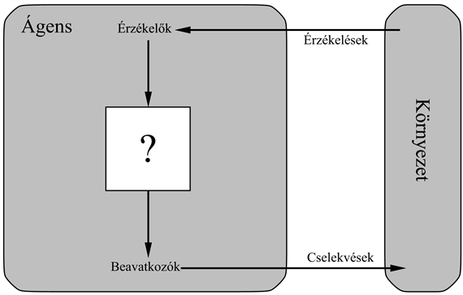
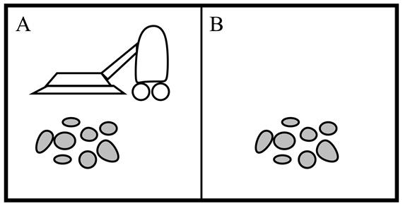
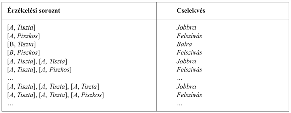

<?xml version="1.0" encoding="UTF-8" standalone="no"?>

<html xmlns="http://www.w3.org/1999/xhtml"><head><meta name="generator" content="DocBook XSL Stylesheets V1.76.1"/></head><body>

<h1 class="title"><a id="id519928"/>2. fejezet - Intelligens ágensek</h1>

<em>Ebben a fejezetben az ágensek természetét, legyen az tökéletes vagy sem, a környezetek különbözőségét és az ágenstípusok ezekből származó sokféleségét tárgyaljuk.</em>

Az 1. fejezet a <strong>racionális ágens</strong> (<strong>rational agent</strong>) fogalmát úgy vezette be, mint a mesterséges intelligencia tárgyalásának általunk választott központi módszerét. Ebben a fejezetben pontosítjuk ezt a koncepciót. Látni fogjuk, hogy a racionalitás koncepciója az ágensek széles körére alkalmazható mindenféle elképzelhető környezetben. Az a tervünk a könyvben, hogy ezt a koncepciót néhány olyan tervezési elv megfogalmazásához használjuk, amelyekkel sikeres ágenseket építhetünk – olyan rendszereket, melyek joggal hívhatók <strong>intelligens</strong>nek.

Ágensek, környezetek és a köztük lévő kapcsolatok vizsgálatával kezdünk. Annak megfigyelése, hogy egyes ágensek jobban viselkednek, mint mások, a racionális ágens ötletéhez vezet majd – olyan ágenshez, amelyik olyan jól viselkedik, amennyire csak lehet. Az, hogy mennyire viselkedhet jól egy ágens, a környezet természetén múlik; bizonyos környezetek sokkal nehezebbek, mint mások. A környezetek nagyjábóli csoportosításával megmutatjuk, hogy egy környezet tulajdonságai hogyan befolyásolják a környezetnek megfelelő ágensek tervezését. Bemutatunk számos egyszerű ágenstervezési „csontvázat”, melyeket a könyv hátralevő fejezeteiben tovább részletezünk.

<h1 class="title"><a id="id519875"/>Bevezetés</h1>

Egy <strong>ágens</strong> (<strong>agent</strong>) bármi lehet, amit úgy tekinthetünk, mint ami az <strong>érzékelői</strong> (<strong>sensors</strong>) segítségével érzékeli a <strong>környezet</strong>ét (<strong>environment</strong>), és <strong>beavatkozó</strong>i (<strong>actuator</strong>s) segítségével megváltoztatja azt. A 2.1. ábra ezt az egyszerű elképzelést szemlélteti. Az emberi ágensnek van szeme, füle és egyéb szervei az érzékelésre, és keze, lába, szája és egyéb testrészei a beavatkozásra. A robotágens kamerákat és infravörös távolsági keresőket használ érzékelőként, és különféle motorokat beavatkozóként. A szoftverágens billentyűleütéseket, fájltartalmakat és hálózati adatcsomagokat fogad érzékelőinek bemeneteként, és képernyőn történő kijelzéssel, fájlok írásával, hálózati csomagok küldésével avatkozik be a környezetébe. Azzal az általános feltételezéssel fogunk élni, hogy minden ágens képes saját akcióinak érzékelésére (de nem mindig látja azok hatását).

<a id="id519770"/>
<strong>2.1. ábra - Az ágensek környezetükkel érzékelőkön és beavatkozókon keresztül állnak kapcsolatban</strong>

<h3 class="title">Fontos</h3>
Az <strong>érzékelés</strong> (<strong>percept</strong>) fogalmat használjuk az ágens érzékelő bemeneteinek leírására egy tetszőleges pillanatban. Egy ágens <strong>érzékelési sorozat</strong>a (<strong>percept sequence</strong>) az ágens érzékeléseinek teljes története, minden, amit az ágens valaha is érzékelt. Általánosságban, <em>egy adott pillanatban egy ágens cselekvése az addig megfigyelt teljes érzékelési sorozatától függhet.</em> Ha az összes lehetséges érzékelési sorozathoz meg tudjuk határozni az ágens lehetséges cselekvéseit, akkor lényegében mindent elmondtunk az ágensről. Matematikailag megfogalmazva azt mondhatjuk, hogy az ágens viselkedését az <strong>ágensfüggvény</strong> (<strong>agent function</strong>) írja le, ami az adott érzékelési sorozatot egy cselekvésre képezi le.

Elképzelhetjük <em>táblázatos formában </em>az ágensfüggvényt, amely forma mindenféle ágenst leír; az ágensek többségére ez igen nagy táblázatot jelentene – valójában végtelen nagyot, hacsak nem korlátozzuk a figyelembe veendő érzékelési sorozatok hosszát. Ha adott egy ágens, amivel kísérletezhetünk, akkor elméletileg megalkothatjuk ezt a táblázatot az összes lehetséges érzékelési sorozat kipróbálásával és az ágens válaszul végrehajtott cselekvéseinek feljegyzésével.[<a id="id519683" href="#ftn.id519683" class="footnote">19</a>] Természetesen a táblázat az ágens <em>külső </em>jellemzése. Egy mesterséges ágens <em>belsejében </em>az ágensfüggvényt egy <strong>ágensprogram</strong> (<strong>agent program</strong>) valósítja meg. Fontos, hogy megkülönböztessük e két dolgot. Az ágensfüggvény egy absztrakt matematikai leírás, az ágensprogram egy konkrét implementáció, amely az ágens architektúráján működik.

Ezen ötletek illusztrálására egy igen egyszerű példát fogunk használni – a 2.2. ábrán látható porszívóvilágot. A világ annyira egyszerű, hogy mindent le tudunk írni, ami megtörténik, továbbá ez egy kitalált világ, így sokféle variációt kitalálhatunk. A világban csak két helyszín van: az <em>A</em> és <em>B</em> négyzetek. A porszívóágens észleli, hogy melyik négyzetben van, valamint azt, hogy van-e ott piszok, vagy nincs. Lehetséges akciói: mozoghat balra vagy jobbra, felszívhatja a port, valamint nem csinál semmit. Egy egyszerű ágensfüggvény a következő: ha az aktuális négyzet koszos, szívd fel a koszt, egyébként menj át a másik négyzetbe. Ezen ágensfüggvény táblázatának egy részlete a 2.3. ábrán látható. Egy, az ágensfüggvényt megvalósító egyszerű ágensprogramot a fejezet későbbi részében, a 2.8. ábrán mutatunk be.

<a id="id519652"/>
<strong>2.2. ábra - A porszívóvilág mindössze két helyszínnel</strong>

<a id="id519640"/>
<strong>2.3. ábra - A 2.2. ábrán szereplő porszívóvilág egy egyszerű ágensfüggvénye részleges táblázatos formában</strong>

<h3 class="title">Fontos</h3>
A 2.3. ábrára nézve láthatjuk, hogy sokféle porszívóvilág-beli ágens definiálható egyszerűen a jobb oldali oszlop különböző kitöltésével. Ezek után a nyilvánvaló kérdés a következő: <em>Mi a táblázat helyes kitöltésének módja?</em> Más szavakkal, mitől lesz egy ágens jó vagy rossz, intelligens vagy buta. Ezeket a kérdéseket a következő részben fogjuk megválaszolni.

Mielőtt lezárnánk ezt a részt, fontos megjegyeznünk, hogy az ágens fogalom bevezetésének a célja nem a világ ágensekre és nem ágensekre történő felosztása, hanem egy olyan eszköz megteremtése, amivel rendszereket elemezhetünk. Egy kézi számológép is tekinthető ágensnek, amely azt a cselekvést választja, hogy „4”-et ír a kijelzőjére, ha „2 +     2 =” érzékelési sorozatot kap, de egy ilyen felfogás aligha segít minket a számológép megértésében.

 

[<a id="ftn.id519683" href="#id519683" class="para">19</a>]  Amennyiben az ágens cselekvésének kiválasztásában a véletlennek is szerepe van, úgy minden sorozatot többször kellene kipróbálnunk, hogy az egyes cselekvések valószínűségeit meghatározhassuk. Látszólag úgy tűnhet, hogy véletlenszerűen cselekedni botorság, a későbbiekben azonban látni fogjuk, hogy ez lehet nagyon intelligens viselkedés is.

</body></html>
