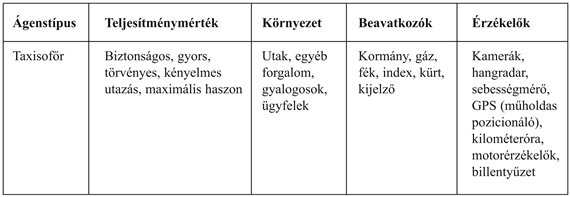
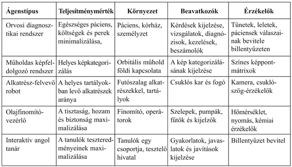
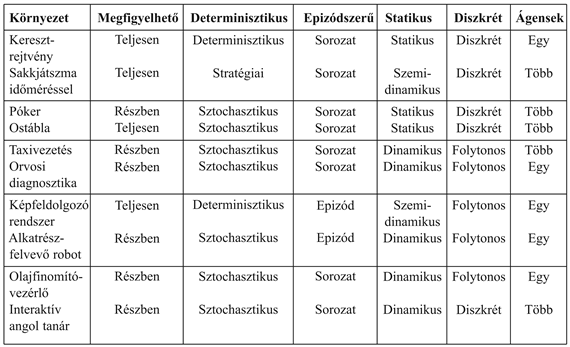

<?xml version="1.0" encoding="UTF-8" standalone="no"?>

<html xmlns="http://www.w3.org/1999/xhtml"><head><meta name="generator" content="DocBook XSL Stylesheets V1.76.1"/></head><body>

<h1 class="title"><a id="id502702"/>A Környezetek természete</h1>

Most, hogy már rendelkezünk a racionalitás definíciójával, már majdnem készen állunk arra, hogy racionális ágensek építéséről gondolkodjunk. Először azonban meg kell vizsgálnunk a <strong>feladatkörnyezetek</strong>et (<strong>task environment</strong>s), amelyek lényegében a „problémák”, amelyekre a racionális ágensek jelentik a „megoldásokat”. Először azt mutatjuk meg, hogyan kell a feladatkörnyezetet meghatározni, több példával illusztrálva a folyamatot. Ezek után megmutatjuk, hogy többféle feladatkörnyezet létezik. A környezet típusa közvetlenül befolyásolja az ágensprogram megfelelő tervezését.

<h2 class="title"><a id="id502718"/>A környezet meghatározása</h2>

Az egyszerű porszívóágens racionalitásának vizsgálatakor specifikálnunk kellett egy teljesítménymértéket, a környezetet és az ágens beavatkozóit és érzékelőit. Mindezeket a <strong>feladatkörnyezet</strong> (<strong>task environment</strong>) címszó alatt fogjuk egyesíteni. A betűszavakban gondolkodók számára ezt <strong>TKBÉ</strong> – <strong>Teljesítmény</strong>,<strong> Környezet</strong>,<strong> Beavatkozók</strong>,<strong> Ér</strong><strong>zékelők</strong> (<strong>Performance</strong>,<strong> Environment</strong>,<strong> Actuators</strong>,<strong> Sensors</strong>) leírásnak hívjuk. Egy ágens tervezése során az első lépésnek mindig a feladatkörnyezet lehető legteljesebb meghatározásának kell lennie.

<a id="id502782"/>
<strong>2.4. ábra - Egy automatizált taxi feladatkörnyezetének TKBÉ-leírása</strong>

A porszívóvilág egyszerű példa volt, vegyünk most egy bonyolultabbat: az automatizált taxisofőr példáját. Ezt a példát fogjuk a fejezet hátralevő részében használni. Ki kell emelnünk, mielőtt az olvasó megrémülne, hogy a teljesen automata taxisofőr jelenleg valamelyest túlmutat a létező technológia lehetőségein. (A <a class="xref" href="ch01s04.md#ID_60_oldal">„A mesterséges intelligencia jelenlegi helyzete”</a> található egy létező sofőr robot leírása, de az „Intelligent Transportation Systems” konferencia legutóbbi kiadványait is érdemes megnézni.) A teljes autóvezetési feladat rendkívül <em>nyitott végű</em>. Nincs határa a lehetségesen felbukkanó körülmények újszerű kombinációinak – egy másik ok arra, hogy ezt válasszuk vizsgálatunk tárgyául. A 2.4. ábra összefoglalja a taxi feladatkörnyezetének TKBÉ-leírását. A következőkben részletesen tárgyaljuk az egyes elemeket.

Elsőként: mi az a <strong>teljesítménymérték</strong>, amit az automata taxisofőrünk elé állítunk? Elvárt jellemzők a helyes célállomás elérése; az üzemanyag-fogyasztás és az elhasználódás minimalizálása; az út költségének és/vagy idejének minimalizálása; a közlekedési szabályok megszegésének és más vezetők megzavarásának minimalizálása; a biztonság és utaskényelem maximalizálása; a haszon maximalizálása. Nyilvánvalóan ezen célok egy része konfliktusban van egymással, kompromisszumokra lesz szükség.

A következő: mi a taxi vezetési <strong>környezet</strong>e? Minden taxisofőrnek több típusú úttal kell szembenéznie, a vidéki és városi utaktól egészen a tizenkét sávos autópályákig. Az utak más forgalommal, gyalogosokkal, kóbor állatokkal, útkarbantartással, rendőrautókkal, tócsákkal és gödrökkel is rendelkeznek. A taxinak a lehetséges és a jelenlegi utasokkal is kapcsolatban kell állnia. Van továbbá néhány opcionális lehetőség. Lehet, hogy a taxinak Dél-Kaliforniában kell üzemelnie, ahol a hó ritkán jelent problémát, vagy Alaszkában, ahol ritkán nem. Közlekedhet mindig az út jobb oldalán, vagy szeretnénk, hogy elég rugalmas legyen ahhoz, hogy a bal oldalon is vezessen abban az esetben, ha Nagy-Britanniában vagy Japánban akarjuk működtetni. Nyilvánvalóan minél korlátozottabb a környezet, annál egyszerűbb a tervezési probléma.

Az automata taxisofőr rendelkezésére álló <strong>beavatkozó</strong>k lényegében ugyanazok lesznek, amelyek egy emberi vezető számára adottak: a motor vezérlése a gázpedál segítségével, kormányzás és fékezés. Ezek mellett szükséges egy képernyő vagy beszédszintetizátor a kimenet megjelenítéséhez az utasok számára, és valószínűleg valamilyen mód arra, hogy más járművekkel kommunikálhasson, udvariasan vagy másképp.

A vezetési környezetben levő céljai eléréséhez a taxinak tudnia kell, hogy hol van, mi más van az úton, és hogy milyen gyorsan halad. Alapvető <strong>érzékelő</strong>i között lenni kell ezért egy vagy több vezérelhető tv-kamerának, sebességmérőnek és kilométerórának. A jármű helyes irányításához – különösen a kanyarokban – szüksége lesz gyorsulásmérőre, ezenkívül ismernie kell a jármű mechanikai állapotát, így szüksége lesz a szokásos motor- és elektromosrendszer-érzékelők rendszerére is. Lehetnek olyan műszerei is, amelyek nem érhetők el az átlagos emberi sofőrök számára: egy műholdas globális pozicionáló rendszer (GPS), amely megadja a pontos pozícióját egy elektronikus térképen, vagy infravörös- és hangradar-érzékelők más autótól és tárgyaktól való távolságok érzékelésére. Végül szüksége lesz egy mikrofonra vagy billentyűzetre, aminek a segítségével az utasok az úti céljukat megadhatják.

A 2.5. ábrán felvázoltuk az alapvető TKBÉ-elemeket számos további ágenstípusra. További példák a 2.5. feladatban jelennek meg. Egyes olvasóink számára meglepő lehet, hogy az ágenstípusok listájában olyan programokat is szerepeltetünk, amelyek a billentyűzet bemenetének és a karakteres képernyő kimenetének teljesen mesterséges környezetében működnek. „Igen”, mondhatja valaki, „ez nem egy valódi környezet, ugye?”. A tény az, hogy nem a „valódi” és a „mesterséges” környezetek közötti különbségtétel számít, hanem az ágens viselkedése, a környezet keltette érzékelési sorozat, valamint a teljesítménymérték közötti viszony komplexitása. Egyes „valódi” környezetek valójában igen egyszerűek. Például egy robot, amit a futószalagon érkező alkatrészek vizsgálatára terveztek, sok egyszerűsítő feltevéssel élhet: a világítás állandó, a futószalagon csak általa ismert alkatrészek vannak, és csak két cselekvés létezik (elfogad vagy elutasít).

<a id="id502832"/>
<strong>2.5. ábra - Példák ágenstípusokra és TKBÉ-leírásuk</strong>

Ezzel ellentétben bizonyos <strong>szoftverágens</strong>ek (vagy szoftverrobotok, azaz <strong>szoftbot</strong>ok) részletgazdag, korlátok nélküli környezetekben léteznek. Képzeljünk el egy szoftbotot, amelyik egy nagy utasszállító gép szimulátorával repül. A szimulátor egy részletgazdag, komplex környezet, amelyben más repülőgépekkel kapcsolatos és földi műveletek is vannak, és a szoftverágensnek valós időben kell választania az akciók széles választékából. Vagy képzeljünk el egy szoftbotot, amelyet internetes hírforrások figyelésére terveztek, és az érdekes híreket megmutatja az ügyfeleinek. A helyes működéshez szüksége lesz valamilyen természetes nyelv feldolgozási képességre, meg kell tanulnia, hogy melyik ügyfelét mi érdekli, és szüksége lesz a tervei dinamikus megváltoztatására – például amikor az egyik hírforráshoz megszűnik a kapcsolata vagy amikor egy új forrás létesül. Az internet egy olyan környezet, amelynek komplexitása versenyez a fizikai világéval, és amelynek lakói között sok mesterséges ágens van.

<h2 class="title"><a id="id502855"/>A környezetek tulajdonságai</h2>

Az MI-ben felmerülő feladatkörnyezetek választéka nyilvánvalóan hatalmas. Mindazonáltal meghatározhatunk viszonylag kevés számú dimenziót, amelyek mentén a feladatkörnyezeteket kategorizálhatjuk. Ezek a dimenziók nagymértékben meghatározzák a helyénvaló ágenstervezést és az ágensimplementációk alaptechnikáinak alkalmazhatóságát. Először felsoroljuk a dimenziókat, azután több feladatkörnyezetet elemzünk az elképzelések bemutatására. Az itt szereplő definíciók informálisak – a későbbi fejezetek sokkal pontosabban fogalmazzák meg a környezeteket, és mindegyik fajtára példákat mutatnak majd.

<ul class="itemizedlist"><li class="listitem">
<strong>Teljesen megfigyelhető</strong> (<strong>fully observable</strong>) vagy<strong> részlegesen megfigyelhető</strong> (<strong>partially observable</strong>).<strong> </strong>Ha az ágens szenzorai minden pillanatban hozzáférést nyújtanak a környezet teljes állapotához, akkor azt mondjuk, hogy a környezet teljesen megfigyelhető.[<a id="id502894" href="#ftn.id502894" class="footnote">22</a>] Egy környezet ténylegesen teljesen megfigyelhető, ha az érzékelők minden olyan aspektusát észlelik, amelyek a cselekvés kiválasztásához <em>relevánsak –</em> a relevancia pedig a teljesítménymértéktől függ. A teljesen megfigyelhető környezetek kényelmesek, mivel az ágensnek nem kell semmilyen belső állapotot nyilvántartania a környezet nyomon követéséhez. Egy környezet lehet részlegesen megfigyelhető a zajos és pontatlan szenzorok miatt, vagy mivel az állapot egyes részei egyszerűen nem szerepelnek a szenzorok adatai között – például egy helyi koszérzékelő szenzorral rendelkező porszívóágens nem tudja megmondani, van-e piszok más négyzetekben, és egy automata taxi nem láthatja, hogy más vezetők mit gondolnak.
</li><li class="listitem">
<strong>Determinisztikus</strong> (<strong>deterministic</strong>) vagy<strong> sztochasztikus</strong> (<strong>stochastic</strong>). Amennyiben a környezet következő állapotát jelenlegi állapota és az ágens által végrehajtott cselekvés teljesen meghatározza, akkor azt mondjuk, hogy a környezet determinisztikus, egyébként sztochasztikus. Teljesen megfigyelhető, determinisztikus környezetben az ágensnek elvben nem kell a bizonytalansággal törődnie. Amennyiben azonban a környezet részlegesen megfigyelhető, úgy sztochasztikusnak <em>tűnhet</em>. Különösen igaz ez, ha a környezet összetett, nehezen teszi lehetővé nem megfigyelhető aspektusainak követését. Így gyakran jobb az <em>ágens szemszögéből </em>determinisztikusnak vagy sztochasztikusnak tekinteni egy környezetet. A taxivezetés ebben az értelemben nyilvánvalóan sztochasztikus, mivel senki sem tudja megjósolni a forgalmat pontosan, továbbá egy motor minden figyelmeztetés nélkül lerobbanhat, és a kerekek váratlanul kidurranhatnak. A porszívóvilág, ahogy leírtuk, determinisztikus, de egyes variációk tartalmazhatnak sztochasztikus elemeket, például véletlenszerűen megjelenő piszkot vagy megbízhatatlan szívási mechanizmust (2.12. feladat). Ha a környezet más ágensek cselekvéseit leszámítva determinisztikus, akkor azt <strong>s</strong><strong>tratégiai</strong>nak (<strong>strategic</strong>) nevezzük.
</li><li class="listitem">
<strong>Epizódszerű</strong> (<strong>episodic</strong>) vagy<strong> sorozatszerű</strong>[<a id="id503042" href="#ftn.id503042" class="footnote">23</a>] (<strong>sequential</strong>). Epizódszerű környezetben az ágens tapasztalata elemi „epizódokra” bontható. Minden egyes epizód az ágens észleléseiből és egy cselekvéséből áll. Nagyon fontos, hogy a következő epizód nem függ az előzőben végrehajtott cselekvésektől. Epizódszerű környezetekben az egyes epizódokban az akció kiválasztása csak az aktuális epizódtól függ. Sok osztályozási feladat epizódszerű. Például az összeszerelő soron levő hibás alkatrészeket észlelő ágens minden egyes döntését az aktuális alkatrész alapján hozza, függetlenül a korábbi döntésektől, továbbá az aktuális döntés nem befolyásolja, hogy a következő alkatrész hibás lesz-e. Másrészt, sorozatszerű környezetekben az aktuális döntés befolyásolhat minden továbbit. A sakk és a taxivezetés sorozatszerű: a rövid távú akciók mindkét esetben hosszú távú következményekkel járhatnak. Az epizódszerű környezetek sokkal egyszerűbbek a sorozatszerűeknél, hiszen az ágensnek nem kell előre gondolkodnia.
</li><li class="listitem">
<strong>Statikus</strong> (<strong>static</strong>) vagy<strong> dinamikus</strong> (<strong>dynamic</strong>). Ha a környezet megváltozhat, amíg az ágens gondolkodik, akkor azt mondjuk, hogy a környezet az ágens számára dinamikus; egyébként statikus. A statikus környezetekkel egyszerű bánni, mivel az ágensnek nem kell állandóan a világot figyelnie, miközben dönt a cselekvés felől, és nem kell az idő múlásával sem törődnie. Másrészt, a dinamikus környezetek állandóan azt kérdezik az ágenstől, hogy mit akar tenni; ha még nem döntötte el, az annak számít, hogy úgy döntött, hogy nem tesz semmit. Ha a környezet nem változik az idő előrehaladtával, de az ágens teljesítménymértéke igen, akkor azt mondjuk, hogy a környezet <strong>szemidinamikus</strong> (<strong>semidynamic</strong>). A taxivezetés nyilvánvalóan dinamikus: a többi autó és a taxi továbbhalad, miközben a vezetési algoritmus azon bizonytalankodik, hogy mit is tegyen. Az órával játszott sakk szemidinamikus. A keresztrejtvények statikusak.
</li><li class="listitem">
<strong>Diszkrét</strong> (<strong>discrete</strong>) vagy<strong> folytonos</strong> (<strong>continuous</strong>). A diszkrét/folytonos felosztás alkalmazható a környezet <em>állapotára,</em> az <em>időkezelés</em> módjára, az ágens <em>észleléseire, </em>valamint <em>cselekvéseire</em>. Például egy diszkrét állapotú környezet, mint amilyen a sakkjáték, véges számú különálló állapottal rendelkezik. A sakkban szintén diszkrét az akciók és cselekvések halmaza. A taxivezetés folytonos állapotú és idejű probléma: a sebesség, a taxi és más járművek helye folytonos értékek egy tartományát járja végig a folytonos időben. A taxivezetés akciói szintén folytonosak (például kanyarodási szögek stb.). Szigorúan véve a digitális kameráktól érkező bemenet diszkrét, de tipikusan úgy kezeljük, mint amely folyamatosan változó mennyiségeket és helyeket reprezentál.
</li><li class="listitem">
<strong>Egyágenses</strong> (<strong>single agent</strong>) vagy<strong> többágenses</strong> (<strong>multiagent</strong>). Az egyágenses és többágenses környezetek közötti különbségtétel egyszerűnek tűnhet. Például a keresztrejtvényt megfejtő ágens önmagában nyilvánvalóan egyágenses környezetben van, míg egy sakkozó ágens egy kétágensesben. Vannak azonban kényes kérdések. Először is: leírtuk azt, hogy egy entitás hogyan tekinthető ágensnek, ugyanakkor nem magyaráztuk meg, mely entitások tekintendők ágensnek. Egy <em>A</em> ágensnek (például a taxisofőrnek) egy <em>B</em> objektumot (egy másik járművet) ágensnek kell tekintenie, vagy egyszerűen egy sztochasztikusan viselkedő dolognak, a tengerparti hullámokhoz vagy a szélben szálló falevelekhez hasonlatosan? A választás kulcsa az, hogy vajon <em>B</em> viselkedése legjobban egy <em>A</em> viselkedésétől függő teljesítménymérték maximalizálásával írható-e le. Például a sakkban a <em>B</em> ellenfél saját teljesítménymértékét próbálja maximalizálni, amely – a sakk szabályainak következtében – <em>A</em> teljesítménymértékét minimalizálja. Így a sakk egy <strong>versengő</strong> (<strong>competitive</strong>) többágenses környezet. Másrészről, a taxi vezetési környezetben az ütközések elkerülése az összes ágens teljesítménymértékét maximálja, így az részben <strong>kooperatív</strong> (<strong>cooperative</strong>) többágenses környezet. Emellett részben versengő is, hiszen például csak egy autó tud egy parkolóhelyet elfoglalni. A többágenses környezetekben felmerülő ágenstervezési problémák gyakran egészen mások, mint egyágenses környezetekben. Többágenses környezetekben például a <strong>kommunikáció</strong> (<strong>communication</strong>) gyakran racionális viselkedésként bukkan fel; egyes részlegesen megfigyelhető versengő környezetekben a <strong>sztochasztikus viselke</strong><strong>dés</strong> racionális, hiszen így elkerülhetők a megjósolhatóság csapdái.
</li></ul>

Ahogy várható, a legnehezebb a <em>részlegesen megfigyelhető, sztochasztikus, sorozatszerű, dinamikus, folytonos </em>és <em>többágenses </em>eset. Az is kiderül, hogy a valós helyzetek legtöbbje olyan bonyolult, hogy <em>valódi</em> determinisztikusságuk vitatott kérdés; gyakorlati okokból sztochasztikusként kezelendők. A taxivezetés mindezen szempontok szerint nehéz.

A 2.6. ábra ismerős környezetek tulajdonságait sorolja fel. Vegyük észre, hogy a válaszok nem mindig egyértelműek. Például a sakkot teljesen megfigyelhetőnek tüntettük fel; szigorúan véve ez hibás, mivel a rosálásra, menet közbeni ütésre és ismétléses döntetlenre vonatkozó egyes szabályok megkövetelik a játék menetével kapcsolatos adatok megjegyzését, amelyek a táblázat állapotának részeként nem figyelhetők meg. A megfigyelhetőség ezen kivételei persze csekélyek egy taxivezető, egy angol nyelvtanár vagy egy orvosi diagnosztikai rendszerhez képest.

A táblázatban bizonyos további válaszok a feladatkörnyezet definiálásától függnek. Az orvosi diagnosztikai feladatot egyágensesnek tüntettük fel, mivel a betegben zajló betegségi folyamat eredményesen nem modellezhető ágensként, de egy orvosi diagnosztikai rendszernek szükség esetén törődnie kell ellenszegülő betegekkel és szkeptikus munkatársakkal, így a környezetnek lehet többágenses aspektusa. Továbbá az orvosi diagnosztika epizódszerű, ha valaki a feladatot úgy tekinti, mint a tünetek listája alapján történő diagnózis kiválasztását; a probléma sorozatszerű, ha a feladat tartalmazhat egy vizsgálatsorozat-javaslatot, az eredmények kiértékelését a kezelés folyamán és így tovább. Továbbá sok környezet epizódszerű az ágensek egyéni akcióinál magasabb szinteken. Például egy sakktorna játszmák sorozatát tartalmazza, minden játék egy epizód, mivel (nagyjából) az ágens adott játszmabeli lépéseinek hozzájárulása az ágens teljesítményéhez nem függ a korábbi játszmákban választott lépéseitől. Másrészről, az egy játszmán belüli döntéshozatal biztosan sorozatszerű.

<a id="id503223"/>
<strong>2.6. ábra - Példák feladatkörnyezetekre és jellemzőik</strong>

A könyvhöz tartozó példaprogramtár <em>(aima.cs.berkeley.edu)</em> tartalmaz számos környezetimplementációt, egy általános célú környezetszimulátorral együtt, amely egy vagy több ágenst helyez el egy szimulált környezetben, megfigyeli a viselkedésüket az időben, és kiértékeli őket egy adott teljesítménymérték szerint. Ilyen kísérleteket gyakran nem egy, hanem több, egy <strong>környezetosztály</strong>ból (<strong>environment class</strong>) származó környezetre hajtanak végre. Például egy taxisofőr szimulált forgalomban történő értékelésére több szimulációt futtatnánk különböző forgalommal, világítással, és időjárási viszonyokkal. Ha az ágenst egyedi esetre terveztük, kihasználhatjuk az adott környezet speciális tulajdonságait, de nem találhatjuk meg a vezetés általában jó módját. Ezért a programtár tartalmaz egy <strong>környezetgenerátor</strong>t (<strong>environment generator</strong>) minden környezetosztályra, amelyik kiválaszt bizonyos környezeteket (bizonyos valószínűséggel) az ágens futtatására. Például a porszívó környezetgenerátor véletlenszerűen állítja be a piszok mintázatát és az ágens helyét. Ezek után az ágens átlagos teljesítményére vagyunk kíváncsiak az adott környezetosztályra nézve. Egy racionális ágens az adott környezetosztályra maximalizálja ezt az átlagos teljesítményt. A 2.7. és 2.12. közötti feladatok végigvisznek egy környezetosztály kialakításán és abban többféle ágens kiértékelésén.

 

[<a id="ftn.id502894" href="#id502894" class="para">22</a>]  A könyv első kiadása a <strong>hozzáférhető</strong>  (<strong>accessible</strong>) és a <strong>nem hozzáférhető</strong> (<strong>inaccessible</strong>) kifejezéseket használta a <strong>teljesen</strong> és a <strong>részlegesen megfigyelhető</strong> (<strong>fully </strong>és<strong> partially observable</strong>) helyett; a <strong>nemdeterminisztikus</strong> (<strong>nondeterministic</strong>) a <strong>sztochasztikus</strong> (<strong>stochastic</strong>) helyett, valamint a <strong>nem epizódszerű</strong> (<strong>nonepisodic</strong>) a <strong>sorozatszerű</strong> (<strong>sequential</strong>) kifejezés helyett szerepelt. Az új terminológia jobban illeszkedik az elterjedt gyakorlathoz.

[<a id="ftn.id503042" href="#id503042" class="para">23</a>]  A „sorozatszerű” (sequential) szót a számítástudományban a „párhuzamos” (parallel) ellentéteként is használják. A két jelentés alapvetően független egymástól.

</body></html>
