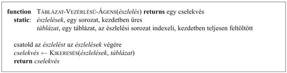
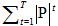
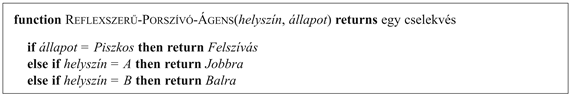
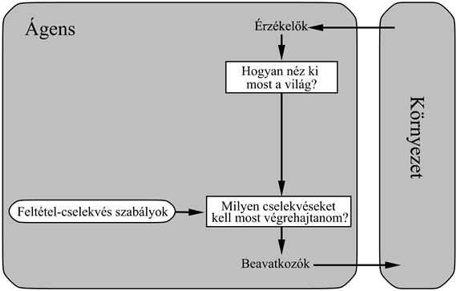
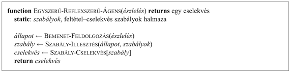
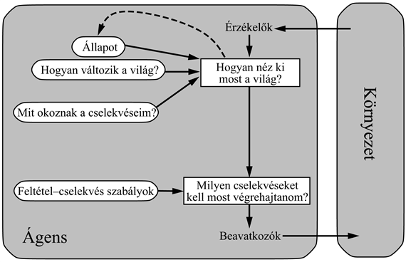
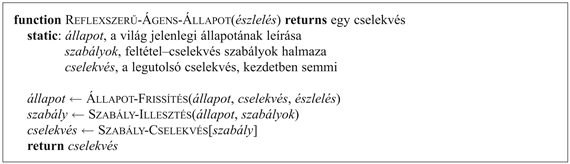
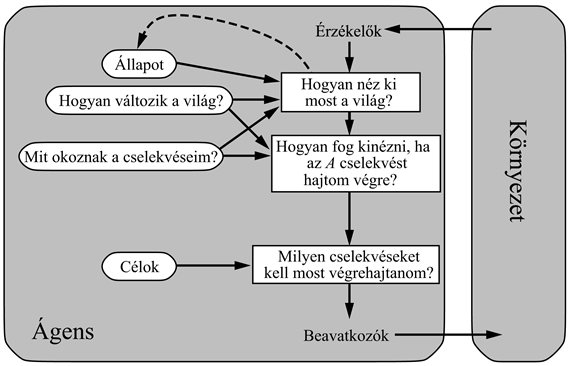
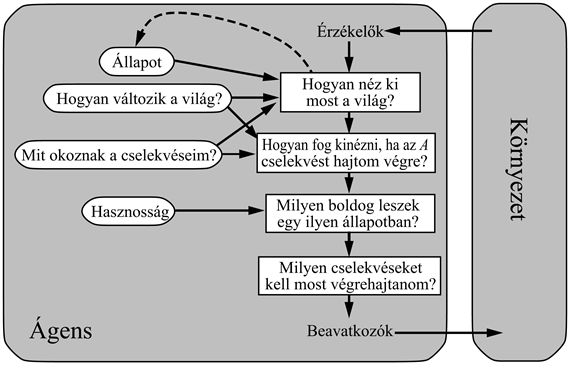
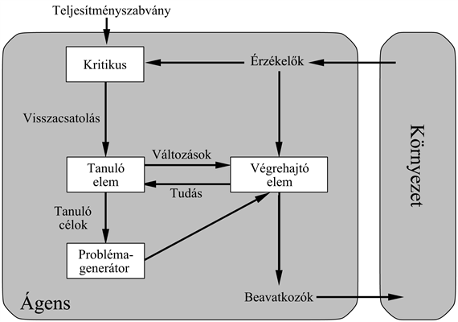

<?xml version="1.0" encoding="UTF-8" standalone="no"?>

<html xmlns="http://www.w3.org/1999/xhtml"><head><meta name="generator" content="DocBook XSL Stylesheets V1.76.1"/></head><body>

<h1 class="title"><a id="id503258"/>Az intelligens ágensek struktúrája</h1>

Az ágenseket eddig <em>viselkedésük </em>leírásán keresztül vizsgáltuk – azon cselekvés alapján, amelyet egy adott észlelési sorozat hatására végrehajtanak. Most neki kell esnünk a kemény diónak: hogyan működnek belül. A mesterséges intelligencia feladata az <strong>ágensprogram</strong> (<strong>agent program</strong>) megtervezése: egy függvényé, amely megvalósítja az észlelések és a cselekvések közötti leképezést. Feltételezzük, hogy ez a program valamiféle fizikai érzékelőkkel és beavatkozókkal ellátott számítóeszközön fog futni – ezt <strong>architektúrá</strong>nak (<strong>architecture</strong>) nevezzük:

<code class="code"><em>ágens = architektúra + program </em></code>

Nyilvánvalóan a kiválasztott programunknak olyannak kell lennie, ami megfelelő az architektúra számára. Ha a program például <em>Sétál</em> jellegű akciókat fog javasolni, akkor jobb, ha az architektúrának vannak lábai. Az architektúra lehet egyszerű számítógép, vagy lehet egy robotautó számos fedélzeti számítógéppel, kamerával és más érzékelőkkel. Általánosságban az architektúra a szenzoroktól érkező észleléseket elérhetővé teszi a program számára, futtatja a programot, és cselekvéseit létrejöttük pillanatában a beavatkozók felé továbbítja. E könyv túlnyomó része az ágensprogramok tervezéséről szól, bár a 24<em>.</em> és 25. fejezet kifejezetten az érzékelőkkel és a beavatkozókkal foglalkozik.

<h2 class="title"><a id="id503301"/>Ágensprogramok</h2>

A könyvben tervezett ágensprogramok mindannyian azonos vázzal rendelkeznek: bemenetként fogadják az aktuális észleléseket a szenzoroktól, és visszaküldenek egy cselekvést a beavatkozókhoz.[<a id="id503307" href="#ftn.id503307" class="footnote">24</a>] Vegyük észre a különbséget az ágensprogram, amely az aktuális észlelést veszi bemenetként, és az ágensfüggvény között, amely a teljes észlelési történetet fogadja. Az ágensprogram azért fogadja csak az aktuális észlelést bemenetként, mert csak ez érkezik a környezettől – ha az ágens cselekedetei a teljes észlelési sorozattól függnek, az ágensnek emlékeznie kell az észlelésekre.

Az ágensprogramot egy egyszerű pszeudokódú nyelv segítségével fogjuk leírni, amit a B) függelék definiál. (Az interneten elérhető kódtár valóságos programozási nyelveken írt megvalósításokat tartalmaz.) Például a 2.7. ábra egy egészen egyszerű ágenst mutat, amely nyomon követi az észlelési sorozatot, és felhasználja egy akciókat tartalmazó táblázat megcímzésére annak eldöntésére, hogy mit csináljon. A táblázat reprezentálja az ágensfüggvényt, amit az ágensprogram testesít meg. Ahhoz, hogy ily módon egy racionális ágenst építsünk, nekünk, mint tervezőknek, olyan táblázatot kell megalkotnunk, amely minden lehetséges észlelési sorozathoz a megfelelő cselekvést tartalmazza.

<a id="id503325"/>
<strong>2.7. ábra - A <code class="code">TÁBLÁZAT-VEZÉRLÉSŰ-ÁGENS</code> program minden egyes új észlelésre meghívódik, és minden alkalommal visszaad egy cselekvést. Saját adatstruktúrájában követi nyomon az észlelési sorozatot.</strong>

Példaértékű annak megfontolása, hogy az ágensek tervezésének táblázatvezérelt megközelítése miért van kudarcra ítélve. Legyen <em>P</em> a lehetséges észlelések halmaza és <em>T</em> az ágens élettartama (az általa vett észlelések teljes száma). A táblázatelemet fog tartalmazni. Vegyük példaként az automata taxit: az egyetlen kamerától érkező vizuális bemenet körülbelül 27 megabájt/másodperc sebességgel érkezik (30 kocka másodpercenként, 640 x 480 képpont 24 bit színinformációval). Ez alapján egyórányi vezetéshez olyan táblázatot kapunk, amely több mint 10250 000 000 000 bejegyzést tartalmaz. Még a sakkhoz tartozó táblázat is – amely a való világ egy kicsiny, jól viselkedő részlete – legalább 10150 bejegyzést tartalmazna. Ezen táblázatok ijesztő mérete (a megfigyelhető világegyetemben az atomok száma kevesebb mint 1080) azt jelenti, hogy (a) ebben az univerzumban egyetlen fizikai ágensnek sem lesz elég helye a táblázat tárolására, (b) a tervezőnek nem lenne elég ideje a táblázat elkészítéséhez, (c) egyetlen ágens sem lenne képes a táblázat helyes bejegyzéseit megtanulni saját tapasztalatából, és (d) még ha a környezet eléggé egyszerű is egy megvalósítható méretű táblázathoz, a tervezőnek még akkor sincs segítsége ahhoz, hogyan töltse ki a táblázat bejegyzéseit.

Mindezek ellenére, a <code class="code">TÁBLÁZAT-VEZÉRLÉSŰ-ÁGENS</code> <em>megteszi</em> azt, amit akarunk: megvalósítja a kívánt ágensfüggvényt. Az MI alapvető kihívása, hogy hogyan írjunk olyan programot, amely – a lehetőségek határain belül – nagyszámú táblázatbejegyzések helyett kisméretű programkóddal produkál racionális viselkedést. Sok példánk van arra, hogy ez más területeken megvalósítható: például az 1970-es évek előtt a mérnökök és az iskolás gyerekek által használt hatalmas négyzetgyöktáblázatokat ma már egy elektronikus kalkulátorokon futó ötsoros program váltotta fel, amely a Newton-módszert alkalmazza. A kérdés az, hogy megteheti-e az MI azt az általános intelligens viselkedésre, amit Newton tett meg a négyzetgyökökre? Abban hiszünk, hogy a válasz igen.

E fejezet hátralevő részében négy alapvető ágensprogramtípust vázolunk, amely megtestesíti a szinte minden intelligens rendszer mögött meghúzódó alapelveket:

<ul class="itemizedlist"><li class="listitem">
Egyszerű reflexszerű ágensek.
</li><li class="listitem">
Modellalapú reflexszerű ágensek.
</li><li class="listitem">
Célorientált ágensek.
</li><li class="listitem">
Hasznosságorientált ágensek.
</li></ul>

Ezek után általánosságban elmagyarázzuk, hogyan alakíthatjuk át ezeket <em>tanuló ágensekké</em>.

<h2 class="title"><a id="id503410"/>Egyszerű reflexszerű ágensek</h2>

A legegyszerűbb fajtájú ágens az <strong>egyszerű reflexszerű ágens</strong> (<strong>simple reflex agent</strong>). Ezek az ágensek az <em>aktuális</em> észlelés alapján választják ki a cselekvéseket, figyelmen kívül hagyva az észlelési történet többi részét. Például a porszívó ágens, amelynek ágensfüggvényét a 2.3. ábra táblázatos formában mutatja, egy egyszerű reflexszerű ágens, mivel döntései csak a jelenlegi helyszínen és azon alapulnak, hogy ott van-e piszok. A 2.8. ábra mutatja ezen ágens programját.

Vegyük észre, hogy az ágensprogram igen kicsi a megfelelő táblázathoz képest. A legnyilvánvalóbb méretcsökkentés az észlelési történet figyelmen kívül hagyásából következik, amely a lehetőségek számát 4T-ről 4-re csökkenti. Egy további, kisebb csökkenés abból a tényből fakad, hogy amikor az aktuális négyzet piszkos, az akció nem függ a helyszíntől.

<a id="id503438"/>
<strong>2.8. ábra - Egy egyszerű reflexszerű ágens programja a kétállapotú porszívókörnyezetben. A 2.3. ábrán megadott ágensfüggvényt valósítja meg.</strong>

Képzeljük magunkat az automata taxisofőr helyébe! Ha az előttünk haladó autó fékez, és a féklámpái kigyulladnak, akkor észre kell vennünk, és el kell kezdenünk fékezni. Más szavakkal, valamilyen feldolgozás zajlik a képi bemeneten, hogy megállapítsunk egy feltételt, amit az „előző autó fékez”-nek hívunk; azután ez kivált valamilyen kialakított kapcsolatot az ágens programjában a „kezdj fékezni” cselekvéshez. Ezt a kapcsolatot <strong>feltétel–cselekvés szabály</strong>nak (<strong>condition–action rule</strong>)[<a id="id503461" href="#ftn.id503461" class="footnote">25</a>] hívjuk, és

<code class="code"><em>ha </em>az-előző-autó-fékez <em>akkor</em> kezdj-fékezni</code>

formában írjuk. Az embereknek sok hasonló kapcsolatuk van, egy részük tanult válasz (ami a vezetést illeti), míg más részük feltétlen reflex (mint például a pislogás, amikor valami megközelíti a szemünket). A későbbiekben több különböző módot is látni fogunk arra, hogy ilyen kapcsolatok hogyan tanulhatók és valósíthatók meg.

A 2.8. ábra programja egy egyedi porszívókörnyezetre specifikus. Egy általánosabb és rugalmasabb megközelítés az, hogy először egy általános célú értelmezőt építünk feltétel–cselekvés szabályokra, majd szabályhalmazokat hozunk létre specifikus feladatkörnyezetek számára. A 2.9. ábra ezen általános program struktúráját adja meg sematikus formában, megmutatva, hogy a feltétel–cselekvés szabályok hogyan teszik lehetővé az ágens számára az észlelések és cselekvések összekötését. (Ne aggódjon, ha ez túl egyszerűnek tűnik: hamarosan sokkal érdekesebbé válik.) Az ágens döntési folyamatának aktuális belső állapotát négyszögekkel jelöljük, a folyamatban felhasznált háttértudás reprezentálására pedig oválisokat használunk. Az ágensprogram, amely szintén igen egyszerű, a 2.10. ábrán látható. A <code class="code">BEMENET-FELDOLGOZÁS </code>függvény a bemenetből állítja elő az aktuális állapot absztrakt leírását, a <code class="code">SZABÁLY-ILLESZTÉS</code> függvény pedig az első olyan szabályt adja vissza a szabályok halmazából, amely illeszkedik az adott állapot leírására. Vegyük észre, hogy a „szabályok” és az „illeszkedés” fogalmakkal történő leírás tisztán koncepcionális – egyedi megvalósítások akár egy logikai áramkört megvalósító logikai kapu halmazból is állhatnak.

<a id="id503521"/>
<strong>2.9. ábra - Egy egyszerű reflexszerű ágens sematikus diagramja</strong>

<h3 class="title">Fontos</h3>
Az egyszerű reflexszerű ágenseknek megvan az az értékelendő tulajdonsága, hogy egyszerűek, ugyanakkor igen korlátozott intelligenciájúnak bizonyulnak. A 2.10. ábrán látható ágens<em> csak akkor </em>fog működni, <em>ha a helyes döntés kizárólag az aktuális észlelés alapján meghozható – azaz akkor, ha a környezet teljesen megfigyelhető</em>. Már a megfigyelhetőség legkisebb hiánya is komoly problémát okozhat. Például a korábban bemutatott fékezési szabály feltételezi, hogy az <em>előző-autó-fékez</em> feltétel megállapítható az aktuális észlelésből – az aktuális videoképből – amennyiben az előző autónak középre szerelt féklámpája van. Sajnálatos módon, a régebbi modelleken különbözőképpen helyezkednek el a hátsó helyzetjelzők, a féklámpák és az indexlámpák, így egyetlen kép alapján nem mindig lehetséges azt megállapítani, hogy az autó fékez-e. Egy egyszerű reflexszerű ágens, amely egy ilyen autó mögött halad, vagy folyamatosan szükségtelenül fékezne, vagy ami még rosszabb, sosem fékezne.

<a id="id503545"/>
<strong>2.10. ábra - Egy egyszerű reflexszerű ágens. A jelenlegi szituációra (amit az észlelés határoz meg) illeszkedő feltételű szabály megkeresésével, majd a hozzá tartozó cselekvés végrehajtásával működik.</strong>

Hasonló problémát láthatunk felbukkanni a porszívóvilágban. Tegyük fel, hogy egy egyszerű reflexszerű ágenst megfosztunk a helyzetérzékelő szenzorától, és csak piszokérzékelője van. Egy ilyen ágensnek csak két észlelése van: [<em>Koszos</em>] és [<em>Tiszta</em>]. <em>Felszívhat </em>válaszul a [<em>Koszos</em>]-ra; de mit tegyen, ha [<em>Tiszta</em>] az észlelés? A <em>Balra</em> mozgás (mindörökre) sikertelen lesz, ha például az <em>A</em> négyzetben kezd, a <em>Jobbra</em> mozgás pedig (mindörökre) sikertelen, ha például a <em>B</em> négyzetben kezd. A végtelen ciklusok gyakran elkerülhetetlenek részlegesen megfigyelhető környezetben működő egyszerű reflexszerű ágensek számára.

Elképzelhető menekvés a végtelen ciklusokból, ha az ágens <strong>randomizál</strong>hatja (<strong>randomize</strong>) cselekvéseit. Például ha a porszívó ágens [<em>Tisztá</em>]-t észlel, feldobhat egy érmét a <em>Bal</em> és <em>Jobb</em> közötti választáshoz. Könnyű megmutatni, hogy az ágens el fogja érni a másik négyzetet átlagosan két lépésen belül. Ezután, ha a négyzet piszkos, feltakarítja, és a tisztítási feladat befejeződik. Ily módon egy randomizált egyszerű reflexszerű ágens túlteljesíthet egy determinisztikus egyszerű reflexszerű ágenst.

A 2.3. alfejezetben említettük, hogy a helyes formájú randomizált viselkedés lehet racionális bizonyos többágenses környezetekben. Egyágenses környezetekben a randomizáció általában <em>nem</em> racionális. Egy hasznos trükk, amely segítheti az egyszerű reflexszerű ágenst bizonyos szituációkban, de a legtöbb esetben ennél sokkal jobbat érhetünk el kifinomultabb determinisztrikus ágensekkel.

<h2 class="title"><a id="id503618"/>Modellalapú reflexszerű ágensek</h2>

A részleges megfigyelhetőség kezelésének leghatékonyabb módja, ha az ágens <em>nyomon követi a világ jelenleg nem látható részét</em>. Azaz, az ágensnek nyilván kell tartania valamiféle <strong>belső állapot</strong>ot (<strong>internal state</strong>), amely az észlelési történeten alapul, és így a jelenlegi állapot nem megfigyelt aspektusainak legalább egy részét tükrözi. A fékezési probléma esetében a belső állapot nem túlságosan terjedelmes – csak a kamerától származó előző képkocka, amely lehetővé teszi az ágens számára annak megállapítását, hogy a jármű két szélén levő két piros lámpa egyszerre gyullad és alszik-e ki. Más vezetési feladatokhoz, mint például a sávváltáshoz, az ágensnek nyomon kell követnie hol tartózkodik a többi autó, amennyiben nem látja mindegyiket egyszerre.

<a id="id503637"/>
<strong>2.11. ábra - Belső állapottal rendelkező reflexszerű ágens</strong>

<a id="id503647"/>
<strong>2.12. ábra - A modellalapú reflexszerű ágens. Nyomon követi a világ jelenlegi állapotát egy belső modellben. Ezek után a reflexszerű ágenshez hasonlóan választ egy cselekvést.</strong>

Ezen belső állapot frissítése az idő előrehaladtával kétféle tudás beépítését igényli az ágensprogramba. Először is szükségünk van olyan információra, hogy a világ hogyan alakul az ágenstől függetlenül – például egy előző autó általában közelebb lesz most, mint egy pillanattal azelőtt. Másodszor, szükségünk van valamilyen információra arról, hogy az ágens saját cselekvései hogyan változtatják meg a világot – például amikor az ágens a kormányt az óramutató járásának megfelelően tekeri, az autó jobbra fordul, vagy öt percig északnak tartó vezetés után egy autópályán általában körülbelül öt mérfölddel lesz északabbra, mint ahol öt perce volt. Ezt, a „világ működésének mikéntjéről” szóló tudást – akár egyszerű logikai áramkörökkel, akár teljes tudományos elméletekkel valósítjuk meg – a világ <strong>modell</strong>jének (<strong>model</strong>) hívjuk. Egy ilyen modellt használó ágenst pedig <strong>modellalapú ágens</strong>nek (<strong>model-based agent</strong>).

A 2.11. ábra szemlélteti a belső állapottal rendelkező reflexszerű ágens struktúráját, megmutatva azt, ahogyan a jelenlegi észlelés a régi belső állapottal kombinálódva létrehozza a jelenlegi állapot frissített leírását. Az ágensprogram a 2.12. ábrán látható. Az érdekes rész az <code class="code">ÁLLAPOT-FRISSÍTÉS</code> eljárás, amely a belső állapot leírásának létrehozásáért felelős. Az új észleléseknek az állapotról szóló tudás tükrében történő értelmezése mellett az ágensprogram nyomon követi a világ láthatatlan részeit a világ fejlődését leíró információ segítségével, az ágensprogramnak pedig azt is tudnia kell, hogy az ágens cselekvései milyen hatással lesznek a világ állapotára. Részletesebb példák a 10<em>.</em> és 17. fejezetben találhatók.

<h2 class="title"><a id="id503688"/>Célorientált ágensek</h2>

A környezet jelenlegi állapotának ismerete nem mindig elég annak eldöntéséhez, hogy mit tegyünk. Például egy kereszteződésben a taxi mehet egyenesen, de fordulhat jobbra vagy balra is. A helyes döntés attól függ, hogy a taxi hova szeretne eljutni. Más szavakkal, a jelenlegi állapot leírása mellett az ágensnek valamiféle <strong>cél</strong>- (<strong>goal</strong>) információval is rendelkeznie kell, amely leírja a kívánatos helyzeteket – például azt, hogy az utas jusson el a célállomásig. Az ágensprogram ezt összevetheti a lehetséges cselekvések eredményeiről szóló információkkal (ugyanazokkal, amelyeket a reflexszerű ágens esetében a belső állapot frissítésekor használt) annak érdekében, hogy a céljához vezető cselekvést meghatározza. A 2.13. ábra bemutatja a célorientált ágens felépítését.

<a id="id503703"/>
<strong>2.13. ábra - Egy modellalapú, célorientált ágens. Nyomon követi a világ állapotát és az elérendő célok halmazát is, és kiválaszt egy cselekvést, amely (végső soron) céljainak eléréséhez vezet.</strong>

Néha a célorientált cselekvés választás egyszerű, amikor a cél teljesülése azonnal egyetlen cselekvéssel elérhető. Máskor sokkal trükkösebb, amikor az ágensnek befordulások és visszakanyarodások sorozatát kell megfontolnia a cél eléréséhez. A <strong>keresés</strong> (<strong>search</strong>) (lásd 3–6. fejezet) és a <strong>tervkészítés</strong> (<strong>planning</strong>) (lásd 11–12. fejezet) a mesterséges intelligencia azon területei, amelyek az ágens céljait elérő cselekvéssorozat megtalálásával foglalkoznak.

Vegyük észre, hogy ez a fajta döntéshozatal alapjaiban különbözik az előzőkben ismertetett feltétel–cselekvés szabályoktól, ezek magukban foglalják a jövő figyelembevételét – mind a „Mi fog történni, ha ezt és ezt teszem?”, mind a „Boldoggá tesz ez majd engem?” kérdéseket. Reflexszerű ágensek tervezésében ezeket explicit módon nem használjuk, mivel a tervező különböző esetekre előre meghatározta a helyes cselekvést. A reflexszerű ágens fékez, ha féklámpát lát kigyulladni. Célorientált elméletben gondolkodhat úgy, hogyha az előző autó féklámpái égnek, akkor az le fog lassulni. Az alapján, ahogy a világ általában működik, az egyetlen cselekvés, amely eléri azt a célt, hogy ne koccanjon neki más autóknak, a fékezés.

Bár a célorientált ágens kevésbé tűnik hatékonynak, sokkal rugalmasabb, mivel a döntéseit alátámasztó tudás explicit módon megjelenik, és így módosítható. Ha elkezd esni az eső, frissítheti a tudását arról, hogy a fékek mennyire lesznek hatékonyak – ez automatikusan az összes releváns viselkedés olyan megváltozását eredményezi, hogy azok az új körülményhez igazodjanak. Reflexszerű ágensek esetében ugyanakkor, a feltétel–cselekvés szabályok nagy számát kellene átírnunk. Természetesen a célorientált ágens különböző úti célok elérésében is rugalmasabb. Egyszerűen egy új cél megadásával a célorientált ágenstől egy új viselkedés megjelenését kaphatjuk. A reflexszerű ágens „mikor fordulj” és „mikor menj egyenesen” szabályai csak egy cél esetében fognak működni: ki kell őket cserélni ahhoz, hogy egy új helyre menjen.

<h2 class="title"><a id="id503740"/>Hasznosságorientált ágensek</h2>

A környezetek többségében a célok önmagukban nem elegendőek jó minőségű viselkedés létrehozásához. Például többféle cselekvéssorozat vezet a taxi végállomásának – és így a céljának – eléréséhez, de némelyik gyorsabb, biztonságosabb, megbízhatóbb vagy olcsóbb, mint mások. A célok csak durva különbséget tesznek „boldog” és „boldogtalan” állapotok között, egy általánosabb teljesítménymérték ezzel szemben a világ állapotainak (vagy állapotsorozatainak) megfelelő összehasonlítását tehetné lehetővé, azt megadva, hogy pontosan mennyire tennék boldoggá az ágenst, ha elérné azokat. Mivel a „boldogság” nem hangzik túl tudományosan, ezért a szokásos terminológia azt mondja, hogy a világ egyik állapota előnyösebb egy másikhoz képest, ha nagyobb a <strong>hasznosság</strong>a (<strong>utility</strong>)[<a id="id503757" href="#ftn.id503757" class="footnote">26</a>] az ágens számára.

A <strong>hasznosságfüggvény</strong> (<strong>utility function</strong>) egy állapotot (vagy állapotok egy sorozatát) egy olyan valós számra képezi le, amelyik a hozzá rendelt boldogság fokát írja le. A hasznosságfüggvény teljes meghatározása kétféle olyan helyzetben tesz lehetővé racionális döntéseket, amikor a célok erre alkalmatlanok. Egyrészt, amikor egymásnak ellentmondó célok vannak, amelyeknek csak egy része érhető el (mint például a biztonságosság és a sebesség), akkor a hasznosságfüggvény meghatározza a helyes kompromisszumot. Másrészt, amikor több cél van, amelyek elérésére az ágens törekedhet, és egyikük sem érthető el teljes bizonyossággal, a hasznosság olyan módszert ad, amivel a siker valószínűsége a célok fontosságához mérhető.

A 16. fejezetben megmutatjuk, hogy minden racionális ágensnek úgy kell működnie, <em>mintha</em> rendelkezne hasznosságfüggvénnyel, amelynek várható értékét maximalizálni akarja. Egy ágens, amelynek van egy <em>explicit</em> hasznosságfüggvénye, ily módon racionális döntéseket hozhat, és ezt egy általános algoritmussal teheti meg, amely nem függ a maximalizálandó specifikus hasznosságfüggvénytől. Ezáltal a racionalitás „globális” definíciója – amely azon ágensfüggvényeket tekinti racionálisnak, amelyek a legnagyobb teljesítményt hozzák – átváltozik a racionáliságens-tervezés egy „helyi” kényszerévé, amely kifejezhető egy egyszerű programban.

A hasznosságalapú ágens struktúrája a 2.14. ábrán látható. Valódi hasznosságalapú ágens programok az V. részben szerepelnek, ahol olyan döntéshozó ágenseket tervezünk, amelyeknek a részlegesen megfigyelhető környezetekben elkerülhetetlen bizonytalanságot is kezelniük kell.

<h2 class="title"><a id="id503794"/>Tanuló ágensek</h2>

Leírtunk többféle módszert arra, hogy ágensprogramok hogyan választják ki cselekvéseiket. Nem magyaráztuk meg azonban eddig, hogy <em>hogyan jön létre </em>az ágensprogram. Híres korai cikkében Turing (Turing, 1950) azzal az ötlettel foglalkozik, hogy intelligens gépeit ténylegesen kézzel programozza. Megbecsüli, mennyi munkát vehet ez igénybe, és megállapítja, hogy „valamilyen eredményesebb módszer kívánatosnak látszik”. Az általa javasolt módszer az, hogy építsünk tanuló gépeket, majd tanítsuk ezeket. Az MI sok területén ez ma a javasolt módszer korszerű rendszerek építésére. A tanulásnak van egy másik előnye is, ahogy megállapítottuk korábban: lehetővé teszi az ágens számára, hogy kezdetben ismeretlen környezetben működjön, és kompetensebbé váljon, mint ahogy azt kezdeti tudása lehetővé tette volna. Ebben a fejezetben röviden bemutatjuk a tanuló ágensek főbb elveit. A könyv majdnem minden fejezetében rámutatunk a tanulás lehetőségeire és módszereire az egyes ágensfajtákban. A VI. rész merül el mélyebben a különféle tanulási algoritmusokban.

<a id="id503804"/>
<strong>2.14. ábra - Egy modellalapú, hasznosságalapú ágens. A világ modellje mellett egy hasznosságfüggvényt is alkalmaz, amely a világ állapotaihoz rendelt preferenciáit méri. Ezek után olyan cselekvést választ, amely a legjobb várható hasznossághoz vezet, amit az összes lehetséges végállapot előfordulási valószínűségével súlyozott átlagolásával számít ki.</strong>

Egy tanuló ágens négy koncepcionális komponensre bontható fel, ahogy azt a 2.15. ábra mutatja. A legfontosabb különbségtétel a javításokért felelős <strong>tanuló elem</strong> (<strong>learning element</strong>) és a külső cselekvések kiválasztásáért felelős <strong>végrehajtó elem</strong> (<strong>performance element</strong>) között van. A végrehajtó elem az, amit eddig a teljes ágensnek tekintettünk: ez végzi az észleléseket, és ez dönt a cselekvésekről. A tanuló elem a <strong>kritikus</strong>tól (<strong>critic</strong>) kapott, az ágens működéséről szóló visszajelzést használja annak megállapítására, hogy a végrehajtó elemet hogyan kell módosítani annak érdekében, hogy a jövőben jobban működjön az ágens.

A tanuló elem tervezése nagyrészt a végrehajtó elem tervezésétől függ. Amikor egy olyan ágenst próbálunk tervezni, amely megtanul egy bizonyos képességet, az első kérdés nem a „hogyan fogom én ezt megtanulni?”, hanem a „milyen teljesítményelemre lesz az ágensemnek szüksége ennek végrehajtásához, ha már megtanulta, hogyan kell?”. Ha adott egy megtervezett ágens, tanuló eljárások az ágens minden részének javításához készíthetők.

<a id="id503847"/>
<strong>2.15. ábra - Tanuló ágensek egy általános modellje</strong>

A kritikus megmondja a tanuló elemnek, hogy az ágens milyen jól működik egy rögzített teljesítményszabványhoz viszonyítva. A kritikus szükséges, hiszen az észlelések önmagukban nem jelzik az ágens sikerességét. Például egy sakk program fogadhat egy olyan észlelést, hogy mattot adott az ellenfelének, de szüksége van egy teljesítményszabványra, hogy tudja, ez egy jó dolog. Az észlelés önmagában nem mondja meg ezt. Fontos, hogy a teljesítményszabvány rögzített legyen. Koncepcionálisan tekinthető úgy, mintha az ágensen teljesen kívül lenne, mivel az ágens nem módosíthatja azt saját viselkedésének megjavítása érdekében.

A tanuló ágens utolsó komponense a <strong>problémagenerátor</strong> (<strong>problem generator</strong>). Ennek feladata, hogy olyan cselekvéseket javasoljon, amelyek új és informatív tapasztalatokhoz vezetnek. Az a helyzet, hogy ha a végrehajtó elem a saját feje után menne, akkor adott tudása alapján mindig a legjobb cselekvéseket választaná. De ha az ágens hajlandó egy kis felfedezésre, és rövid távon talán néhány szuboptimális cselekvésre, hosszú távon sokkal jobb cselekvéseket fedezhet fel. A problémagenerátor feladata, hogy ilyen felfedező cselekvéseket javasoljon. Ezt teszik a tudósok is, amikor kísérleteket végeznek. Galilei nem gondolta, hogy a pisai torony tetejéből köveket leejteni önmagában értékes dolog. Sem a köveket nem próbálta összetörni, sem a szerencsétlen arra járók agyát nem akarta „megváltoztatni”. Célja saját agyának megváltoztatása volt azáltal, hogy az objektumok mozgásának egy jobb elméletét ismerje fel.

Hogy az általános tervet konkrétabbá tegyük, térjünk vissza az automata taxi példájához. A végrehajtó elem tartalmazza mindazon tudást és eljárások halmazát, amelyek a taxivezetés cselekvéseinek kiválasztásához szükségesek. A taxi ezen végrehajtó elem segítségével megy ki az utakra és közlekedik. A kritikus megfigyeli a világot, és továbbadja az információt a tanuló elemnek. Például miután a taxi három forgalmi sávon keresztül egy gyors balkanyart vett, a kritikus megfigyeli a többi vezető által használt sokkoló nyelvezetet. Ebből a kísérletből a tanuló elem képes egy szabályt formálni, miszerint ez egy rossz cselekvés volt, és a végrehajtó elem módosul az új szabály beillesztésével. A problémagenerátor megfigyelheti a viselkedés bizonyos területeit, melyek javításra szorulnak, és kísérleteket javasol, mint például a fékek kipróbálását különböző útfelszíneken és különböző viszonyok között.

A tanuló elem módosíthatja az ágensdiagramokon (2.9., 2.11., 2.13. és 2.14. ábrák) „tudás” komponensek bármelyikét. A legegyszerűbb esetek magukban foglalják az észlelési szekvenciából történő direkt tanulást. Az egymást követő környezeti állapot párok megfigyelése lehetővé teszi az ágens számára annak megtanulását, hogy a „világ hogyan változik”, és cselekvései eredményeinek megfigyelése lehetővé teszi a „mit okoznak a cselekvéseim” megtanulását. Például ha a taxi vezetője adott erővel fékez, mikor a taxi nedves úton halad, akkor hamarosan tapasztalni fogja, ténylegesen mekkora lassulást ért el. Világos, hogy ez a két tanulási feladat sokkal nehezebb, ha a környezet csak részlegesen figyelhető meg.

Az előző bekezdésben szereplő tanulási formák nem igényelnek hozzáférést külső teljesítményszabványhoz – bizonyos értelemben a mérték univerzális: a kísérletekkel összhangban levő előrejelzések készítése. A helyzet némiképp bonyolultabb egy hasznosságalapú ágens számára, amelyik a hasznosságinformációt szeretné megtanulni. Például tegyük fel, hogy a taxisofőr ágens nem kap borravalót az utasoktól, akiket az út folyamán teljesen összerázott. A külső teljesítményszabványnak informálnia kell az ágenst, hogy a borravaló elvesztése egy negatív hozzájárulás az általános teljesítményéhez – ezek után az ágens megtanulhatja, hogy a hirtelen manőverek nem járulnak hozzá a hasznosságához. Bizonyos értelemben a teljesítményszabvány a beérkező észlelés egy részét elkülöníti <strong>jutalom</strong>ként (<strong>reward</strong>) (vagy <strong>büntetés</strong>ként – <strong>penalty</strong>), amely az ágens viselkedési minőségének direkt visszacsatolása. A rögzített teljesítményszabványok, mint például állatokban a fájdalom vagy éhség, ily módon értelmezhetők. Ezt a kérdést a 21. fejezetben tárgyaljuk.

Összegezve, az ágenseknek sokféle komponensük van, és ezen komponensek sokféleképpen reprezentálhatók az ágensprogramban, így úgy tűnik, sokféle tanulási módszer létezik. Van ugyanakkor egy egyesítő motívum. A tanulás az intelligens ágensekben összefoglalható úgy, mint egy folyamat, amely az ágens minden komponensét úgy módosítja, hogy az összhangba kerüljön a rendelkezésre álló visszacsatolt információval, ily módon növelve az ágens általános teljesítményét.

 

[<a id="ftn.id503307" href="#id503307" class="para">24</a>]  Vannak más lehetőségek is az ágensváz számára, például leírhatjuk az ágensprogramot <strong>korutin</strong>ok (<strong>coroutine</strong>s) formájában, amelyek a környezethez képest aszinkron módon futnak. Minden ilyen korutin rendelkezik egy bemeneti és egy kimeneti porttal, és egy olyan ciklust tartalmaz, amelyik beolvassa a bemeneti portról az észleléseket, és kiírja a cselekvéseket a kimeneti portra.

[<a id="ftn.id503461" href="#id503461" class="para">25</a>]  A kapcsolatot <strong>szituáció–cselekvés</strong> (<strong>situation–action rule</strong>),<strong> produkciós</strong> (<strong>production rule</strong>) vagy <strong>ha–akkor sza</strong><strong>bály</strong>nak (<strong>if–then rule</strong>) is nevezik.

[<a id="ftn.id503757" href="#id503757" class="para">26</a>]  A „hasznosság” szó itt a „hasznosság minősége” kifejezésre utal, nem az áram- vagy vízszolgáltatókra. (Az angol<em> utility </em>szó többes jelentésű, a szerző ezért magyarázza meg helyes értelmezését a lábjegyzetben.<em> – A ford.</em>)

</body></html>
