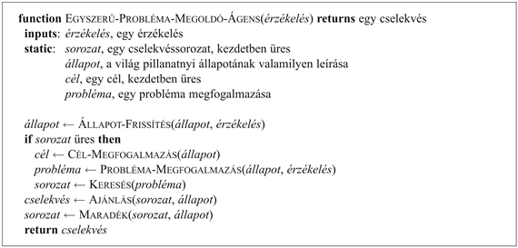
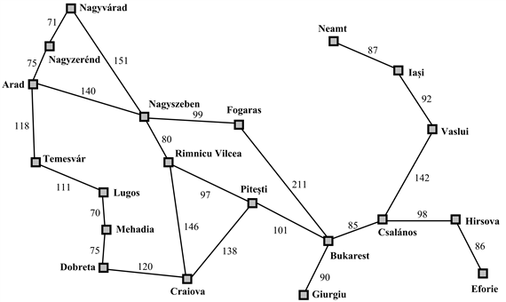

<?xml version="1.0" encoding="UTF-8" standalone="no"?>
<!DOCTYPE html PUBLIC "-//W3C//DTD XHTML 1.1//EN" "http://www.w3.org/TR/xhtml11/DTD/xhtml11.dtd">
<html xmlns="http://www.w3.org/1999/xhtml"><head><meta name="generator" content="DocBook XSL Stylesheets V1.76.1"/></head><body>

<h1 class="title"><a id="id504382"/>3. fejezet - Problémamegoldás kereséssel</h1>

<em>Ebben a fejezetben megnézzük, hogy egy ágens hogyan tudja megtalálni azt a cselekvéssorozatot, amely elvezet a célhoz, ha erre egyetlen egyedi cselekvés sem elegendő.</em>

A 2. fejezetben említett legegyszerűbb ágensek a reflexszerű ágensek voltak, amelyek cselekvései az állapotok és a cselekvések közötti közvetlen leképzésen alapulnak. Az ilyen ágensek nem képesek olyan környezetben tevékenykedni, ahol e leképzés tárolási igénye túl nagy lenne, vagy ahol a leképezés megtanulása túl sok időt venne igénybe. A célorientált ágensek azonban sikerrel járhatnak a jövőbeli cselekvéseknek és annak a számbavételével, hogy ezen cselekvések kimenetelei mennyire kívánatosak. 

Ebben a fejezetben a célorientált ágensek egyik típusát, a <strong>problémamegoldó ágens</strong>t<strong> (problem-solving agent)</strong> ismertetjük. A problémamegoldó ágensek úgy határozzák meg, mit is kell tenniük, hogy olyan cselekvéssorozatokat keresnek, amelyek a kívánt állapotokba vezetnek. Azzal kezdjük, hogy pontosan megfogalmazzuk a „problémát” és a „megoldását” felépítő alkotóelemeket, és számos példával illusztráljuk ezen definíciókat. Ezek után néhány általános rendeltetésű keresési algoritmust mutatunk be, amelyek e problémák megoldására alkalmasak, majd az egyes algoritmusok előnyeit összehasonlítjuk. Az algoritmusok <strong>nem informált</strong>ak (<strong>uninformed</strong>) abban az értelemben, hogy a probléma definícióján túlmenően más információval a problémáról nem rendelkeznek. A 4. fejezet <strong>informált</strong> (<strong>informed</strong>) keresési stratégiákat tárgyal, amelyek rendelkeznek valamilyen elképzeléssel arról, hogy a megoldást merrefelé is kell keresni.

Ebben a fejezetben az algoritmuselmélet területén használt fogalmakat alkalmazzuk. Az aszimptotikus komplexitás (azaz az <em>O</em>() jelölésmód) és az NP-teljesség fogalomkörében nem járatos olvasó számára az A)<em> </em>függelék nyújt bővebb információkat.

<h1 class="title"><a id="id504434"/>Problémamegoldó ágensek</h1>

Az intelligens ágensekről feltesszük, hogy a teljesítménymértéküket maximalizálják. Mint azt a 2. fejezetben láttuk, a feladat valamelyest leegyszerűsödik, ha az ágens egy <strong>cél</strong>t (<strong>goal</strong>) tud maga elé tűzni, és megpróbálja azt elérni. Először vizsgáljuk meg, hogy az ágens hogyan és miért teheti ezt meg.

Tegyük fel, hogy az ágensünk a romániai Arad városában tartózkodik, és országjáró túrája vége felé közeledik. Az ágens teljesítménymértéke számos tényezőt tartalmaz: például szépen le szeretne barnulni, tökéletesíteni szeretné a román nyelvtudását, látni szeretné az összes nevezetességet, élvezni az éjszakai életet (amilyen van), kerülni a másnaposságot stb. A döntési probléma igen bonyolult, sok kompromisszummal és útikönyvek gondos tanulmányozásával jár. Tételezzük most fel, hogy ágensünk egy Bukarestből érvényes, vissza nem váltható repülőjeggyel rendelkezik másnapra. Ebben a helyzetben értelmes <strong>cél</strong>nak (<strong>goal</strong>) tűnik, hogy eljusson Bukarestbe. Mindazon cselekvéseket további mérlegelés nélkül el lehet dobni, amelyekkel nem lehet időben Bukarestbe érni, amivel az ágens döntési problémája nagymértékben egyszerűsödik. A célok segítik megszervezni a viselkedést, mivel korlátozzák az ágens által elérendő dolgok számát. A pillanatnyi helyzeten és az ágens hasznosságmértékén alapuló <strong>célmegfogalmazás</strong> (<strong>goal formulation</strong>) a problémamegoldás első lépése. 

Célnak a világ állapotainak egy halmazát tekintjük, pontosabban azon állapotok halmazát, amelyekben a cél teljesül. Az ágens feladata megkeresni, hogy amely cselekvések sorozata juttatja el őt egy célállapotba. Mielőtt azonban ezt megtehetné, el kell döntenie, hogy milyen cselekvéseket és állapotokat vizsgáljon meg. Amennyiben olyan szintű cselekvésekkel kellene dolgoznia, mint például „a bal lábadat tedd előrébb fél méterrel” vagy „a kormánykereket hat fokkal tekerd balra”, az ágens még a parkolóból sem lenne képes kihajtani, nemhogy időben eljutni Bukarestbe, mivel az ilyen részletek szintjén a világban túl sok a bizonytalanság, és a megoldás túl  sok lépésből állna. A <strong>problémamegfogalmazás</strong> (<strong>problem formulation</strong>) az a folyamat, amely során eldöntjük, hogy amely cselekvéseket és állapotokat vegyünk figyelembe, ha egy cél adott. Ezt a folyamatot részletesebben is tárgyalni fogjuk. Egyelőre tételezzük fel, hogy az ágens az egyik nagyobb városból egy másik nagyobb városba való autózás szintjén szemléli a cselekvéseket. Ebből adódóan a figyelembe vett állapotok annak felelnek meg, hogy az ágens éppen egy adott városban van.[<a id="id504483" href="#ftn.id504483" class="footnote">27</a>]

Az ágensünk azt tűzte ki célul, hogy Bukarestbe megy, és azt fontolgatja, hogy Aradról hová menjen. Három út vezet ki Aradról: egy Nagyszeben felé, egy Temesvár felé és egy Nagyzerénd felé. Ezek egyike sem éri el közvetlenül a célt, így amennyiben ágensünk nem ismeri ki magát tökéletesen Romániában, nem fogja tudni, hogy melyik úton induljon el.[<a id="id504490" href="#ftn.id504490" class="footnote">28</a>] Más szóval az ágens nem fogja tudni eldönteni, hogy a lehetséges cselekvések közül melyik a legjobb, mert nincs elegendő információja a cselekvések hatására előálló állapotokról. Amennyiben az ágensnek nem áll rendelkezésére további tudás, akkor itt megakad. A legjobb amit tehet, hogy a cselekvésekből véletlenszerűen kiválaszt egyet.

<h3 class="title">Fontos</h3>
Tegyük fel azonban, hogy ágensünknek akár papíron, akár a fejében van egy Románia-térképe. A térkép jelentősége, hogy információt nyújthat az ágensnek azokról az állapotokról, ahova eljuthat, illetve a végrehajtható cselekvésekről. Az ágens ezen információt felhasználhatja egy hipotetikus utazás megtervezésére ezeken a városokon keresztül, hogy megtalálja a legjobb utat, amely végül elvezet Bukarestbe. Miután a térképen megtalált egy utat Aradról Bukarestbe, a célját el tudja érni, ha az utazás egyes állomásaihoz tartozó vezetési szakaszokat végrehajtja. Általánosságban: <em>amennyiben egy ágens előtt közvetlenül több ismeretlen értékű lehetőség áll, ki tudja választani, hogy mit tegyen, ha először megvizsgálja a különböző lehetséges cselekvéssorozatokat, amelyek ismert értékű állapotokba vezetnek, majd ezután kiválasztja a legjobbat</em>. 

Az ilyen sorozat előállítási folyamatát <strong>keresés</strong>nek (<strong>search</strong>) nevezzük. A keresési algoritmus bemenete egy probléma, kimenete pedig egy cselekvéssorozat formájában előálló <strong>megoldás</strong> (<strong>solution</strong>). Miután előállt egy megoldás, az abban szereplő cselekvéseket végre lehet hajtani. Ezt <strong>végrehajtás</strong>i (<strong>execution</strong>) fázisnak szokás nevezni. Így előállt egy egyszerű „fogalmazd meg, keresd meg, hajtsd végre” ágenstervezési séma. Az előállt sémát a 3.1. ábra mutatja. A cél és a megoldandó probléma megfogalmazása után az ágens egy keresési eljárást hív meg. Ezek után a megoldást használja cselekvései vezérlésére, azt teszi, amit a megoldás a következő lépésnek javasol – ez tipikusan a cselekvéssorozat első lépése –, és a végrehajtott lépést törli a cselekvéssorozatból. Miután a megoldást végrehajtotta, az ágens új célt keres.

<a id="id504535"/>
<strong>3.1. ábra - Egy egyszerű problémamegoldó ágens. Először a célt és a problémát fogalmazza meg, majd a problémát megoldó cselekvéssorozatot keres, végül a cselekvéseket egyenként végrehajtja. Amikor kész vele, egy másik célt fogalmaz meg, és az egészet újrakezdi. Jegyezzük meg, hogy a cselekvéssorozata végrehajtása alatt az ágens az érzékeléseivel nem foglalkozik. Feltételezi, hogy az általa megtalált megoldás mindig működőképes.</strong>

Először a problémamegfogalmazás folyamatát írjuk le, majd a fejezet további részeit a <code class="code">KERESÉS</code> függvény különböző változatainak ismertetésére fordítjuk. Ebben a fejezetben nem tárgyaljuk részletesen az <code class="code">ÁLLAPOT-FRISSÍTÉS</code> és a <code class="code">CÉL-MEGFOGALMAZÁS</code> függvényeket. 

Mielőtt a részletekbe belemerülnénk, egy pillanatra álljunk meg és nézzük meg, hogy a problémamegoldó ágens hogyan illik bele a 2. fejezetben tárgyalt ágensek és környezetek sokaságába. A 3.1. ábrán látható ágenstervezet feltételezi, hogy a környezet <strong>statikus</strong> (<strong>static</strong>), mivel a probléma megfogalmazása és megoldása semmilyen változásról nem vesz tudomást, amely esetleg a környezetben beáll. Az ágenstervezet azt is feltételezi, hogy a kezdeti állapot ismert. Ennek ismerete akkor a legkönnyebb, amikor a környezet <strong>megfigyelhető</strong> (<strong>observable</strong>). Az „alternatív cselekvések számontartása” tulajdonképpen azt tételezi fel, hogy a környezet <strong>diszkrét</strong> (<strong>discrete</strong>). Végül a legfontosabb: az ágenstervezet azt is feltételezi, hogy a környezet <strong>determinisztikus</strong> (<strong>deterministic</strong>). A problémamegoldások egyedi cselekvéssorozatok, így a váratlan eseményeket nem is tudják figyelembe venni. A megoldások végrehajtása ráadásul az érzékelésről nem is vesz tudomást! Annak az ágensnek, amely mondhatni csukott szemmel hajtja végre a terveit, eléggé biztosnak kell lennie a dolgában (szabályozáselméletben az ilyen rendszereket <strong>nyílt hurkú</strong>nak – <strong>open-loop</strong> – hívják, mert az érzékelések figyelmen kívül hagyása az ágens és a környezete közötti hurkot felbontja). E feltételezések azt jelentik, hogy a környezetek lehető legegyszerűbbikével foglalkozunk, és ez egyben indokolja azt is, hogy e fejezet miért a könyv elején található. A 3.6. alfejezet rövid bepillantást ad abba, hogy mi történik, amikor a megfigyelhetőség és a determinizmus feltételezéséről lemondunk. Ezt a témát sokkal mélyebben a 12. és a 17. fejezet tárgyalja.

<h2 class="title"><a id="id504608"/>Jól definiált problémák és megoldások</h2>

<a id="ID_100_101_oldal"/><a id="ID_100_oldal"/>
Egy <strong>probléma</strong> (<strong>problem</strong>) formális megragadásához az alábbi négy komponensre van szükség:

<ul class="itemizedlist"><li class="listitem">
A <strong>kiinduló állapot</strong> (<strong>initial state</strong>), amiből az ágens kezdi a cselekvéseit. A romániai ágensünk kezdeti állapotát például <em>Benn</em>(<em>Arad</em>)-ként lehetne leírni.
</li><li class="listitem">
Az ágens rendelkezésére álló lehetséges <strong>cselekvés</strong>ek (<strong>action</strong>s) halmaza. A leginkább használatos leírás[<a id="id504668" href="#ftn.id504668" class="footnote">29</a>] az <strong>állapotátmenet-függvény</strong>t (<strong>successor function</strong>) alkalmazza. Egy adott <em>x</em> állapot esetén az <code class="code">ÁLLAPOTÁTMENET-FV</code> (<em>x</em>) visszaadja a rendezett 〈<em>cselekvés, utódállapot</em>〉 párok halmazát, ahol minden cselekvés az <em>x</em> állapotban legális cselekvések egyike, és minden utódállapotot egy cselekvésnek az <em>x</em> állapotra való alkalmazásával nyerünk. A <em>Benn</em>(<em>Arad</em>) állapotban az állapotátmenet-függvény a romániai problémára a
</li></ul>

<code class="code">{〈<em>Menj</em>(<em>Nagyszeben</em>), <em>Benn</em>(<em>Nagyszeben</em>)〉, 〈<em>Menj</em>(<em>Temesvár</em>), <em>Benn</em>(<em>Temesvár</em>)〉, 〈<em>Menj</em>(<em>Nagyzerénd</em>), <em>Benn</em>(<em>Nagyzerénd</em>)〉}</code>

párokat adná vissza. 

A kezdeti állapot és az állapotátmenet-függvény együttesen implicit módon definiálják a probléma <strong>állapotter</strong>ét (<strong>state space</strong>): azon állapotok halmazát, amelyek a kiinduló állapotból elérhetők. Az állapottér egy gráfot alkot, amelynek csomópontjai az állapotok és a csomópontok közötti élek a cselekvések. (Románia 3.2. ábrán látható térképe állapottérként értelmezhető, ha minden útját kétirányú gépkocsi-vezetési cselekvésként fogjuk fel). Az állapottér egy <strong>út</strong>ja (<strong>path</strong>) az állapotok egy sorozata, amely állapotokat a cselekvések egy sorozata köt össze. 

<ul class="itemizedlist"><li class="listitem">
A <strong>célteszt</strong> (<strong>goal test</strong>), amely meghatározza, hogy egy adott állapot célállapot-e. Néha létezik a lehetséges célállapotok egy explicit halmaza, és a teszt egyszerűen megnézi, hogy az ágens elérte-e ezek egyikét. Romániában az ágens célja a {<em>Benn</em>(<em>Bukarest</em>)} szingleton. Néha a cél valamilyen absztrakt tulajdonsággal van definiálva, nem pedig explicit módon felsorolt állapothalmazzal. A sakkban például az úgynevezett „sakk-matt” állapot elérése a cél, amelyben az ellenfél királya az őt ért támadás elől nem tud elmenekülni.
</li><li class="listitem">
Egy <strong>útköltség</strong>- (<strong>path cost</strong>) függvény, amely minden úthoz hozzárendel egy költséget. A problémamegoldó ágens azt a költségfüggvényt fogja választani, amely a saját hatékonysági mértékének felel meg. A Bukarestbe siető ágens számára az idő a lényeg, így az útköltség lehetne például az út a km-ben kifejezett hossza. Ebben a fejezetben az út költségének az utat alkotó egyes cselekvések költségének összegét fogjuk tekinteni az út mentén. Az <em>x</em> állapotból az <em>y</em> állapotba vezető <em>cs</em> cselekvés <strong>lépésköltség</strong>e (<strong>step cost</strong>) legyen <em>lk</em>(<em>x</em>, <em>cs</em>, <em>y</em>). Romániában a lépésköltségeket a 3.2. ábra mutatja úttávolságok formájában. Feltételezzük, hogy a lépésköltségek nemnegatívak.[<a id="id544600" href="#ftn.id544600" class="footnote">30</a>]
</li></ul>

Az előbbi elemek definiálják a problémát és egy közös adatstruktúrába foghatók, amit a problémamegoldó algoritmus bemenetének tekintünk. A probléma <strong>megoldás</strong>a (<strong>solution</strong>) nem más, mint a kiinduló állapotból a célállapotba vezető út. A megoldás kvalitását az útköltségfüggvény méri, és egy <strong>optimális megoldás</strong>nak (<strong>optimal solution</strong>) a megoldások közt a legkisebb lesz az útköltsége.

<h2 class="title"><a id="id544625"/>A problémák megfogalmazása</h2>

<a id="ID_102_oldal"/>
Az előbbi részben a „hogyan jutunk el Bukarestbe” probléma olyan megfogalmazását javasoltuk, amely a kezdeti állapotból, az állapotátmenet-függvényből, a célállapottesztből és az útköltségből áll. Ez a megfogalmazás értelmesnek tűnik, a valós világ számos aspektusát mégis figyelmen kívül hagyja. Hasonlítsuk csak össze az általunk választott egyszerű állapotleírást, <em>Benn</em>(<em>Arad</em>), egy tényleges országjáró kirándulással, ahol a világ állapota rengeteg mindent tartalmazhat: kivel utazunk, mit közvetít a rádió, milyen tájat látunk az ablakon át, van-e közelben rendőr, milyen messze van a következő pihenőhely, milyen az út állapota, milyen az időjárás és sok-sok más. 

Ezeket a részleteket kihagytuk az állapotleírásokból, mert nem lényegesek a Bukarestbe vezető út megkeresésében. Egy reprezentációból a részletek eltávolítását <strong>absztrakció</strong>nak (<strong>abstraction</strong>) nevezzük.

Az állapotleírás absztrahálása mellett magukat a cselekvéseket is absztrahálni kell. Egy vezetési cselekvésnek számos hatása van. Amellett, hogy megváltoztatja a gépkocsi és utasai helyét, időbe telik, üzemanyagot  fogyaszt, szennyezi a levegőt és megváltoztatja az ágenst (azt mondják, hogy az utazás kiszélesíti a látókört). A mi megfogalmazásunkban csak a helyváltoztatást vesszük figyelembe. Van számos olyan cselekvés, amit teljesen elhagyunk: például a rádió bekapcsolását, az ablakon való kinézést, a lassítást, mert rendőr van a közelben stb. És persze a „fordítsd a kormányt balra 3 fokkal” szintű cselekvésekkel sem foglalkozunk.

Lehetünk-e pontosabbak a megfelelő absztrakciós szint meghatározásában? A megválasztott absztrakt állapotokra és cselekvésekre úgy gondolunk, hogy azok a részletes valós állapotok és cselekvések egész halmazaihoz tartoznak. Most tekintsük az absztrakt probléma egy megoldását: például az Aradról Nagyszebenbe, majd Rimnicu Vilceába, Pites¸tibe és Bukarestbe vezető utat. Ez az absztrakt megoldás rengeteg részletesebb útnak felel meg. Például Nagyszeben és Rimnicu Vilcea között vezethettünk bekapcsolt rádióval, majd az utazás további részére kikapcsolhattuk a rádiót. Az absztrakció <em>érvényes,</em> ha az absztrakt megoldást megoldássá fejthetjük ki egy részletesebb világban is. Elégséges feltétel az, hogy minden olyan részletes állapothoz, mint az „Aradon van”, létezik egy részletes út valamelyik olyan állapothoz, mint a „Nagyszebenben van” stb. Az absztrakció <em>hasznos,</em> ha a megoldásbeli cselekvések végrehajtása az eredeti problémánál egyszerűbb. Ebben az esetben ezek eléggé egyszerűek ahhoz, hogy egy átlagos gépkocsivezető ágens végre tudja azokat hajtani minden további keresés vagy tervkészítés nélkül. Így egy jó absztrakció megválasztása magában foglalja az érvényesség megőrzése mellett a lehető legtöbb részlet törlését, és annak biztosítását, hogy az absztrakt cselekvéseket könnyű legyen véghezvinni. Ha nem lenne meg a hasznos absztrakciók megalkotásának képessége, akkor az intelligens ágensek a valós világban teljesen hasznavehetetlenek lennének.

<a id="id544666"/>
<strong>3.2. ábra - Románia egy részének sematikus országúti térképe</strong>

 

[<a id="ftn.id504483" href="#id504483" class="para">27</a>]  Vegyük észre, hogy ezek az állapotok valójában a világ állapotaiból képezett nagy halmazoknak felelnek meg, mivel a világ állapotai a valóság minden aspektusát meghatározzák. Fontos észben tartani a problémamegoldás állapotai és a világ állapotai közötti különbséget.

[<a id="ftn.id504490" href="#id504490" class="para">28</a>]  Feltételezzük, hogy legtöbb olvasónk ugyanebben a cipőben jár, és könnyen át tudja érezni ágensünk tanácstalanságát. Ezúton elnézést kérünk a romániai olvasóktól, akik számára ezen pedagógiai eszköz nem jelent segítséget.

[<a id="ftn.id504668" href="#id504668" class="para">29</a>]  Egy alternatív megfogalmazás az <strong>operátor</strong>ok (<strong>operator</strong>s) egy halmaza, amelyeket egy állapotra alkalmazva lehet az utódállapotokat generálni.

[<a id="ftn.id544600" href="#id544600" class="para">30</a>]  A negatív költségek következményeivel a 3.17. feladatban foglalkozunk.

</body></html>
