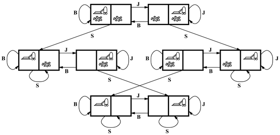
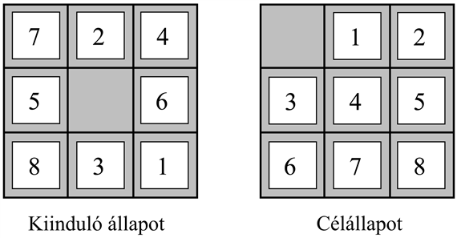
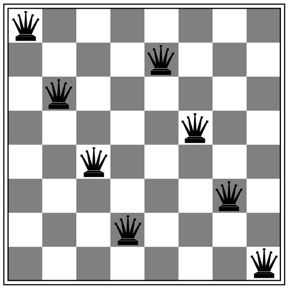

<?xml version="1.0" encoding="UTF-8" standalone="no"?>
<!DOCTYPE html PUBLIC "-//W3C//DTD XHTML 1.1//EN" "http://www.w3.org/TR/xhtml11/DTD/xhtml11.dtd">
<html xmlns="http://www.w3.org/1999/xhtml"><head><meta name="generator" content="DocBook XSL Stylesheets V1.76.1"/></head><body>

<h1 class="title"><a id="id544675"/>Példaproblémák</h1>

<a id="ID_103_oldal"/>
A problémamegoldó megközelítést rengeteg feladatkörben alkalmazták. Néhányat az alábbiakban sorolunk fel, megkülönböztetve az úgynevezett játék- és a valósvilág-beli problémákat. A <strong>játékproblémá</strong>k (<strong>toy problem</strong>s) rendeltetése, hogy segítségükkel a különféle problémamegoldó módszereket illusztrálni tudjuk vagy ki tudjuk próbálni. Az ilyen problémák egzakt tömör leírása megadható. Ez azt jelenti, hogy különböző kutatók így könnyűszerrel használhatják az algoritmusok hatékonysági összehasonlításához A <strong>valósvilág-beli problémá</strong>k (<strong>real-world problem</strong>s) azok, amelyek megoldása tényleg érdekes az emberek számára. Ezeknek nincs egyetlen általánosan elfogadott megfogalmazásuk, mi azonban megpróbáltuk érzékeltetni az általános megfogalmazásuk jellegét. 

<a id="id544704"/>
<strong>3.3. ábra - A porszívóvilág állapottere. Az élek cselekvéseket jelentenek: B = <em>Balra</em>, J = <em>Jobbra</em>, S = <em>Szív</em>.</strong>

<h2 class="title"><a id="id544725"/>Játékproblémák</h2>

<a id="ID_104_oldal"/><a id="ID_104_105_oldal"/>
Az első vizsgált példa a 2. fejezetben bevezetett <strong>porszívóvilág</strong> (<strong>vacuum world</strong>) (lásd 2.2. ábra). Ezt problémaként az alábbi módon definiálhatjuk:

<ul class="itemizedlist"><li class="listitem">
<strong>Állapot</strong>ok: az ágens két hely egyikében lehet. Mindegyik lehet piszkos, de lehet tiszta is. Így 2 × 22 = 8 lehetséges állapotról beszélhetünk.
</li><li class="listitem">
<strong>Kezdeti állapot</strong>: akármelyik állapot lehet kezdeti állapot.
</li><li class="listitem">
<strong>Állapotátmenet-függvény</strong>: a három (<em>Balra</em>, <em>Jobbra</em>, <em>Szív</em>) cselekvés alkalmazásából adódó legális állapotokat generálja. A teljes állapottér a 3.3. ábrán látható.
</li><li class="listitem">
<strong>Célteszt</strong>: ellenőrzi, hogy minden négyzet tiszta-e.
</li><li class="listitem">
<strong>Útköltség</strong>: minden lépés költsége 1, így az út költsége megegyezik az út lépéseinek a számával.
</li></ul>

A valós világgal összevetve e probléma jellemzői a diszkrét lokációk, a diszkrét kosz, a megbízható takarítás, valamint az, hogy takarítás után piszok soha nem keletkezik újra (a 3.6. alfejezetben ezeket a feltételezéseket feladjuk). Fontos megjegyezni, hogy az állapotot az ágens és a kosz helyzete együttesen határozza meg. Egy nagyobb, <em>n</em> helyű környezetben <em>n</em> 2n állapot van.

A 3.4. ábrán bemutatott <strong>8-as kirakójáték</strong> (<strong>8-puzzle</strong>) egy 3 × 3-as táblából, 8 számozott kockából és egy üres helyből áll. Az üres hely melletti kockát be lehet csúsztatni az üres helyre. A cél egy meghatározott állás, mint például az ábra jobb oldalán látható állás elérése. A probléma szokásos megfogalmazása a következő:

<ul class="itemizedlist"><li class="listitem">
<strong>Állapot</strong>ok: az állapotleírás meghatározza mind a nyolc kocka és az üres hely pozícióját a kilenc lehetséges pozíció egyikében. 
</li><li class="listitem">
<strong>Kezdeti állapot</strong>: akármelyik állás lehet kezdeti állapot. Figyeljük meg, hogy minden egyes célt pontosan az állapotok feléből lehet elérni (3.4. feladat).
</li><li class="listitem">
<strong>Állapotátmenet-függvény</strong>: a négy  cselekvés (üres hely megy <em>Balra</em>, <em>Jobbra</em>, <em>Fel</em>,<em> Le</em>) alkalmazásából adódó legális állapotokat generálja.
</li><li class="listitem">
<strong>Célteszt</strong>: ellenőrzi, hogy az állapot megegyezik-e a 3.4. ábrán mutatott célállapottal (más célkonfiguráció is lehetséges).
</li><li class="listitem">
<strong>Útköltség</strong>: minden lépés költsége 1, így az út költsége megegyezik az út lépéseinek a számával.
</li></ul>

<a id="id544890"/>
<strong>3.4. ábra - A 8-as kirakójáték egy tipikus feladványa</strong>

Milyen absztrakciókhoz folyamodtunk itt? A cselekvéseket a kezdeti és végállapotuk erejéig absztraháltuk, elmozdítás közben egy kocka közbülső helyzeteit figyelmen kívül hagytuk. Az olyan cselekvésektől is elvonatkoztattunk, mint a tábla megrázása, ha a kockák megakadtak, vagy a kockák késsel való kiszedése és visszahelyezése. Amit kaptunk, az a játék szabálykészlete, a manipulációk fizikai részleteitől eltekintve.

A kirakójáték a <strong>csúsztatós kirakójáték</strong>ok (<strong>sliding-block puzzle</strong>s) családjába tartozik, amelyeket gyakran új kereső algoritmusok tesztelésére alkalmaznak az MI-ben. Ez az általános osztály NP-teljes, így nem várható, hogy lényegesen jobb módszert lehet találni az itt és a következő bekezdésben leírt keresési algoritmusoknál. A 8-as kirakójátéknak 9!/2 = 181 440 elérhető állapota van, és így e játék könnyen megoldható. A 15-ös kirakójátéknak (a 4 × 4-es táblán) kb. 10 billió állapota van, és a legjobb algoritmusok a véletlenül generált eseteket optimálisan néhány milliszekundum alatt oldják meg. A 24-es játéknak (az 5 × 5-ös táblán) kb. 1025 állapota van, és a véletlenszerűen kiválasztott esetek optimális megoldása még mindig kemény dió a jelenlegi gépek és algoritmusok számára.

A <strong>8-királynő probléma</strong> (<strong>8-queens problem</strong>) célja, hogy 8 királynőt úgy helyezzünk el egy sakktáblán, hogy egyáltalán ne támadják egymást. (Egy királynő egy vele azonos sorban, oszlopban vagy átlóban lévő bábut támad.) A 3.5. ábra egy sikertelen megoldási kísérletet mutat: a jobb szélső oszlopban lévő királynőt támadja a bal felső sarokban lévő királynő.

<a id="id544930"/>
<strong>3.5. ábra - Egy majdnem jó megoldás a 8-királynő problémára. (A megoldás megkeresését az olvasóra bízzuk.)</strong>

<a id="ID_105_oldal"/>
Bár hatékony célalgoritmusok léteznek ezen probléma és a teljes <em>n-</em>királynő probléma megoldására, a királynőfeladat mindamellett érdekes tesztproblémája marad a keresési algoritmusoknak. Két fő megfogalmazása létezik. Az <strong>inkrementális megfogalmazá</strong><strong>s</strong>ban (<strong>incremental formulation</strong>) az operátorok az állapotleírást <em>bővítik</em>, az üres állapottól kezdve. A 8-királynő probléma esetén ez azt jelenti, hogy a királynőket egyenként helyezzük el a sakktáblán. A <strong>teljes állapot leírás</strong>ban (<strong>complete-state formulation</strong>) először felhelyezzük mind a 8 királynőt, majd mozgatjuk őket. Az útköltség mindkét esetben érdektelen számunkra, mert csak a végső állapot számít. A probléma első inkrementális megfogalmazása lehet a következő:

<ul class="itemizedlist"><li class="listitem">
<strong>Állapot</strong>ok: egy állapot a 0 … 8 királynő, tetszőleges elrendezése a táblán.
</li><li class="listitem">
<strong>Kezdeti állapot</strong>: a táblán nincs egy királynő sem.
</li><li class="listitem">
<strong>Állapotátmenet-függvény</strong>: helyezz egy új királynőt egy üres mezőre.
</li><li class="listitem">
<strong>Célteszt</strong>: 8 királynő a táblán és egyik sincs támadás alatt.
</li></ul>

Ebben a megfogalmazásban 64 × 63 × … 57 ≈ 1,8 × 1014 lehetséges vizsgálandó sorozatunk van. Sokkal ésszerűbb választás lenne, ha figyelembe vennénk azt a tényt, hogy egy már eleve támadt mezőre nincs értelme letenni egy királynőt:

<ul class="itemizedlist"><li class="listitem">
<strong>Állapot</strong>ok: <em>n</em> (0 ≤ <em>n</em> ≤ 8) királynő olyan elrendezése a táblán, hogy az <em>n</em> bal oldali oszlopban oszloponként egy található úgy, hogy nem támadják egymást.
</li><li class="listitem">
<strong>Állapotátmenet-függvény</strong>: helyezz egy királynőt a bal szélső, még üres oszlopba úgy, hogy azt ne támadja egyetlen királynő sem.
</li></ul>

Ez a megfogalmazás a 8-királynő probléma állapotterét 1,8 × 1014-ről 2057 méretű térré csökkenti, minekutána megoldást könnyű megtalálni. Másrészt 100 királynő a korábbi megfogalmazás 10400 állapothoz vezet, míg a javítottnál csak kb. 1052 állapotunk lesz (3.5. feladat). Ez óriási redukció, a javított eset azonban még mindig túl nagy az ebben a fejezetben ismertetett algoritmusok számára. A teljes állapot leírásról a 4. fejezetben olvashatunk, az 5. fejezet viszont egy olyan egyszerű algoritmust közöl, amellyel a millió királynőt számláló problémát is könnyen meg lehet oldani.

<h2 class="title"><a id="id545063"/>Valósvilág-beli problémák</h2>

Már korábban láttuk, hogy az <strong>útkeresési problémá</strong>t (<strong>route-finding problem</strong>) hogyan definiálhatjuk a megadott helyek és a közöttük lévő összeköttetések segítségével. Az útkereső algoritmusokat számos területen alkalmazzák. Használják például számítógép-hálózatokban útvonalkeresésre, katonai műveletek tervezésénél és légi útvonaltervező rendszerekben is. Általában nehéz az ilyen problémákat specifikálni. Nézzük meg a légi útvonaltervezési probléma egy egyszerűsített példáját:

<ul class="itemizedlist"><li class="listitem">
<strong>Állapot</strong>ok: minden állapotot egy hely (például egy repülőtér) és az aktuális időpont azonosít. 
</li><li class="listitem">
<strong>Kezdeti állapot</strong>: a probléma specifikálja.
</li><li class="listitem">
<strong>Állapotátmenet-függvény</strong>: azokat az állapotokat adja vissza, amelyek az aktuális repülőtérről valamely másikra olyan menetrendbeli járatok igénybevételével keletkeznek (esetleg tovább pontosítva, hogy mely osztályra és melyik konkrét ülésre vonatkozik az utazás), amelyek később indulnak, mint az aktuális időpont plusz a repülőtéri tranzit ideje.
</li><li class="listitem">
<strong>Célteszt</strong>: elértük-e a célállomást?
</li><li class="listitem">
<strong>Útköltség</strong>: függ a pénzügyi költségektől, várakozási időtől, repülési időtől, vámkezelési és útlevél-vizsgálati procedúráktól, az ülés minőségétől, a nap időszakától, a repülőgép típusától, az utaskedvezményektől stb.
</li></ul>

A kereskedelmi útvonaljavasló rendszerek a probléma valami hasonló megfogalmazását használják, sok további bonyolítással, hogy a repülőtársaságok bonyolult viteldíjstruktúráit kezelni tudják. Minden tapasztalt utas tudja azonban, hogy nem minden repülőút zajlik a tervek szerint. Egy igazán jó rendszernek eshetőségi tervekkel – például az alternatív járatokra történő tartalék helyfoglalásokkal – is tudnia kell foglalkozni, ameddig persze ezeket a költség és az eredeti terv összeomlásának a valószínűsége igazolja.

A <strong>körutazási problémá</strong>k (<strong>touring problem</strong>s) az útkeresési problémák rokonai egy fontos különbséggel. Tekintsük például azt a problémát, hogy „A 3.2. ábra minden egyes városába látogass el legalább egyszer úgy, hogy Bukarestből indulj, és az utat ott is fejezd be.” Az útkeresési problémához hasonlóan a cselekvés itt is két szomszédos város közötti utazásnak felel meg. De ebben a problémában az állapottér alapvetően más. Az ágens helye mellett minden egyes állapotban tárolni kell az <em>ágens által korábban meglátogatott városokat</em> is. Így a kiinduló állapot ebben az esetben a „Bukarestben vagyok, eddig meglátogattam {Bukarestet}” állapot lenne, míg egy tipikus közbenső állapot a „Vasluiban vagyok, eddig meglátogattam {Bukarestet, Csalánost, Vasluit}” állapot. A célteszt ellenőrizné, hogy az ágens Bukarestben van-e, és végiglátogatta-e mind a 20 várost.

Az <strong>utazó ügynök probléma</strong> (<strong>Travelling Salesperson Problem</strong> – <strong>TSP</strong>) egy körutazási probléma, amelyben minden várost pontosan egyszer kell meglátogatni. A cél a <em>legrövidebb</em> út megkeresése. A probléma NP-nehéz, de hatalmas erőfeszítések történtek a TSP-algoritmusok képességeinek javítására. Ezen algoritmusokat az utazó ügynökök útjainak megtervezése mellett nyomtatott áramkörök furatainak készítésénél a fúró automata mozgatásának megtervezésére, továbbá áruházak rakodógépeinek útvonaltervezésére is alkalmazták.

A <strong>VLSI elhelyezés</strong>i (<strong>VLSI layout</strong>) problémában komponensek és összeköttetések millióit egy chipen kell elhelyezni, a terület, az áramköri késleltetés és a szórt kapacitások minimalizálása és a gyártási kihozatal maximalizálása mellett. Az elhelyezési probléma a logikai tervezés fázisát követi, és általában két részből áll: <strong>cellaelrendezés</strong>ből (<strong>cell layout</strong>) és <strong>huzalozás</strong>ból (<strong>channel routing</strong>). A cellaelrendezés során az áramkör primitív komponenseit cellákba rendezik, amelyek mindegyike valamilyen jól definiált funkciót lát el. Minden egyes cellának rögzített nyomtatási képe (méret és alak) van, és adott számú összeköttetést igényel a többi cellához. A cél az, hogy az egyes cellákat úgy helyezzük el a chipen, hogy azok ne lapolódjanak át, és a cellák között legyen megfelelő hely az összekötő vezetékek számára. A huzalozás során minden egyes vezetéknek megfelelő vezetési útvonalat keresünk a cellák között. Ezek a keresési problémák hihetetlenül összetettek, de mindenképpen érdemes a megoldásukat megtalálni. A 4. fejezetben látni fogunk néhány algoritmust, amelyek képesek megoldani ezeket a problémákat.

A <strong>robotnavigáció</strong> (<strong>robot navigation</strong>) a korábban leírt útkeresési probléma általánosítása. Az utak diszkrét halmaza helyett a robot egy folytonos térben mozog (elvben) végtelen cselekvés- és állapothalmazzal. Egy egyszerű, sík felületen mozgó kör alakú robot esetén az állapot lényegében kétdimenziós. Amennyiben a robotnak karja és lába is van, akkor azokat is vezérelni kell, így a keresési tér sokdimenzióssá válik. Már a keresési tér végessé tételéhez is kifinomult technikákra van szükség. A 25. fejezetben megvizsgálunk néhány ilyen módszert. A probléma összetettsége mellett a valós robotoknak foglalkozniuk kell az érzékelőik által szolgáltatott jelek és a motorvezérlők hibáival is.

Összetett objektumok robotok általi <strong>automatikus összeszerelés</strong>ét (<strong>automatic assembly sequencing</strong>) először a <code class="code">FREDDY</code> robot mutatta be (Michie, 1972). Azóta lassú, de biztos előrehaladás tapasztalható ezen a területen. Ma már például villanymotorok automatikus összeszerelése gazdaságossági szempontból is kivitelezhető. Az összeszerelési feladatoknál a probléma az alkatrészek összeszerelési sorrendjének megkeresése. Amennyiben rossz szerelési sorrendet választunk, valamikor a későbbiek folyamán egy adott alkatrészt nem tudunk egy másik alkatrész kiszerelése nélkül beszerelni. Annak eldöntése, hogy az összeszerelési sorrend egy lépése megvalósítható-e vagy sem, a robotnavigációhoz hasonló összetett geometriai keresési probléma. Így az összeszerelési sorrend megtervezésében a költséges feladat egy kivitelezhető következő lépés megtervezése. Minden gyakorlati fontosságú algoritmusnak kerülnie kell az állapottér egy kis töredékén túlmenő feltárását. Egy másik fontos összeállítási probléma a <strong>fehérjetervezés</strong> (<strong>protein design</strong>), ahol a célkitűzés olyan aminosav-szekvencia megkeresése, amely valamilyen betegség gyógyítása szempontjából lényeges tulajdonságokkal rendelkezik és háromdimenziós fehérjévé formálható.

Az utóbbi időben egyre nagyobb a kereslet az <strong>interneten kereső</strong> (<strong>Internet search</strong><strong>ing</strong>) szoftverrobotok iránt, amelyek kérdésekre választ, kapcsolódó információkat, vagy kereskedelmi üzletek lehetőségét kutatják fel. A keresési technikák szempontjából ez igazán jó alkalmazás, mert eléggé nyilvánvaló, hogy az internethez egy gráfszerű kép rendelhető, ahol a csomópontok (weboldalak) linkekkel össze vannak kapcsolva. Az internetkeresés teljes leírását a 10. fejezetre hagyjuk.

</body></html>
