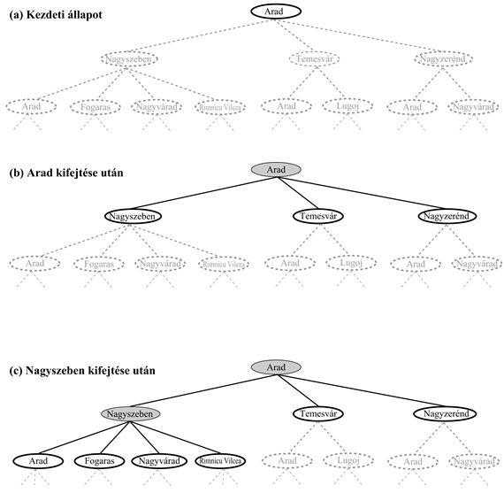
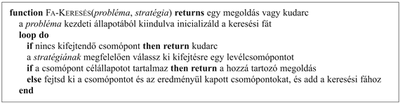
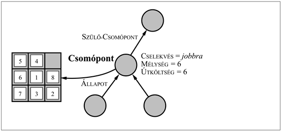
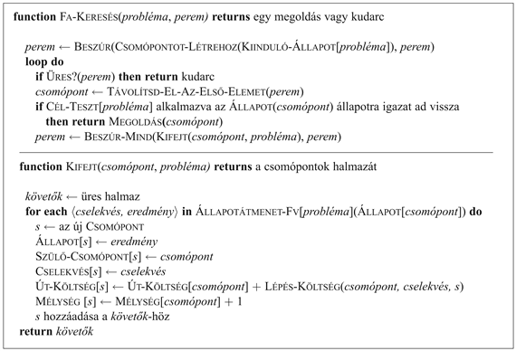

<?xml version="1.0" encoding="UTF-8" standalone="no"?>
<!DOCTYPE html PUBLIC "-//W3C//DTD XHTML 1.1//EN" "http://www.w3.org/TR/xhtml11/DTD/xhtml11.dtd">
<html xmlns="http://www.w3.org/1999/xhtml"><head><meta name="generator" content="DocBook XSL Stylesheets V1.76.1"/></head><body>

<h1 class="title"><a id="id545250"/>Megoldások keresése</h1>

Az előzőkben láttuk, hogyan kell egy problémát definiálni. A hátralévő lépés – a megoldás megkeresése – az állapottérben végrehajtott kereséssel történik. Ebben a részben olyan keresési technikákkal foglalkozunk, amelyek egy explicit <strong>keresési fá</strong>t (<strong>search tree</strong>) használnak, amelyet az állapotteret együttesen definiáló kezdeti állapotból és az állapotátmenet-függvényből generálnak. Általánosságban, ha egy állapotot több úton is elérhetünk, inkább keresési <em>gráfról,</em> mint keresési <em>fáról</em> beszélünk. Ezzel az igen fontos bonyolítással később a 3.5. alfejezetben foglalkozunk. 

<a id="id545273"/>
<strong>3.6. ábra - Az Arad és Bukarest közötti útkeresési probléma részleges keresési fái. A kifejtett csomópontokat árnyékoltuk, a legenerált, de még ki nem fejtett csomópontok vastagon keretezettek, a még le nem generált csomópontokat pedig halvány szaggatott vonalak jelzik.</strong>

A 3.6. ábrán láthatjuk az Arad és Bukarest közötti útkereső probléma keresési fájának egy kezdeti kifejtését. A keresési fa gyökere az a <strong>keresési csomópont</strong> (<strong>search node</strong>), amely a <em>Benn</em>(<em>Arad</em>) kezdeti állapotnak felel meg. Az első lépés annak ellenőrzése, hogy vajon ez célállapot-e. Nyilvánvalóan nem az, de fontos ellenőrizni, hogy meg tudjuk oldani az olyan beugrató problémákat is, mint amilyen például az „Aradról indulva jussunk el Aradra”. Mivel ez nem célállapot, egyéb állapotokat is meg kell vizsgálnunk. Ezt az aktuális állapot <strong>kifejtés</strong>ével (<strong>expanding</strong>) tesszük, azaz az állapotátmenet-függvénynek az aktuális állapotra történő alkalmazásával, amivel az állapotok egy új halmazát <strong>generáljuk</strong> (<strong>generating</strong>). Ebben az esetben három új állapotot kapunk: <em>Benn</em>(<em>Nagyszeben</em>), <em>Benn</em>(<em>Temesvár</em>) és <em>Benn</em>(<em>Nagyzerénd</em>). Most el kell döntenünk, hogy a három lehetőség közül melyik utat kövessük.

A keresés lényege a következő: egy lehetőséget kiválasztani, és a többit későbbre halasztani arra az eshetőségre, ha az első választás nem vezetne megoldásra. Tételezzük fel, hogy elsőnek Nagyszebent választjuk. Ellenőrizzük, hogy ez célállapot-e (nem az), majd kifejtjük, aminek hatására a <em>Benn</em>(<em>Arad</em>), <em>Benn</em>(<em>Fogaras</em>), <em>Benn</em>(<em>Nagyvárad</em>) és <em>Benn</em>(<em>RimnicuVilcea</em>) állapotokat kapjuk. Ezek után e négy közül bármelyiket választhatjuk, vagy akár vissza is mehetünk és választhatjuk Nagyzeréndet vagy Temesvárt. Folytatjuk a kiválasztást, a célállapot-ellenőrzést és a kifejtést, míg egy megoldást nem találunk, vagy amíg el nem fogynak a kifejtendő állapotok. A kifejtendő állapot kiválasztását a <strong>keresési stratégia</strong> (<strong>search strategy</strong>) határozza meg. Az általános fakereső algoritmus informális megfogalmazását a 3.7. ábra mutatja.

<a id="id545383"/>
<strong>3.7. ábra - Az általános fakeresési algoritmus informális leírása</strong>

Fontos megkülönböztetni az állapotteret és a keresési fát. Az útkeresési probléma esetében az állapottér csak 20 állapotból áll, minden egyes városhoz tartozik egy állapot. Ebben az állapottérben azonban végtelen sok út vezet, így a keresési fa végtelen sok csomópontból áll. Például az Arad–Nagyszeben, Arad–Nagyszeben–Arad, Arad– Nagyszeben–Arad–Nagyszeben három út az első három a végtelen számú útszekvenciából. (Egy jó keresési algoritmus nyilvánvalóan elkerüli az ilyen utak követését. A 3.5. alfejezetben megmutatjuk hogyan.)

A csomópontokat sokféle módon lehet reprezentálni, de mi feltételezzük, hogy egy csomópont egy öt komponensből álló adatszerkezet:

<ul class="itemizedlist"><li class="listitem">
<code class="code">ÁLLAPOT</code>: az állapottérnek a csomóponthoz tartozó állapota;
</li><li class="listitem">
<code class="code">SZÜLŐ-CSOMÓPONT</code>: a keresési fa azon csomópontja, amely a kérdéses csomópontot generálta;
</li><li class="listitem">
<code class="code">CSELEKVÉS</code>: a csomópont szülő-csomópontjára alkalmazott cselekvés;
</li><li class="listitem">
<code class="code">ÚT-KÖLTSÉG</code>: a kezdeti állapotból a kérdéses csomópontig vezető út általában <em>g</em>(<em>n</em>)-nel jelölt költsége, ahogy ezt a szülőmutatók jelzik;
</li><li class="listitem">
<code class="code"> MÉLYSÉG</code>: a kezdeti állapotból vezető út lépéseinek a száma.
</li></ul>

Fontos visszaidéznünk a csomópontok és az állapotok közti különbséget. A csomópont egy adatnyilvántartásra használt adatszerkezet, amit egy keresési fa leírására használunk. Egy állapot a világ egy konfigurációja. Így a csomópontok a <code class="code">SZÜLŐ-CSOMÓPONT</code> mutatók által definiált meghatározott úton találhatók, míg az állapotok nem. Továbbá könnyen előfordulhat, hogy két különböző csomópont egyazon állapotot tartalmaz, ha ezt az állapotot két különböző cselekvéssorozattal generálták le. A csomópont-adatstruktúrát a 3.8. ábra mutatja.

<a id="id545451"/>
<strong>3.8. ábra - A keresési fa alapvető építő adatstruktúrái a csomópontok. Minden csomópontnak van szülője, állapota és számos adminisztráló adatmezeje. A nyilak a gyerekektől a szülőkig mutatnak.</strong>

Valahogy nyilván kell tartanunk a legenerált, kifejtésre váró csomópontokat is – ezt a gyűjteményt, listát <strong>perem</strong>nek (<strong>fringe</strong>) nevezik. A perem minden eleme egy <strong>levélcsomópont</strong> (<strong>leaf node</strong>), azaz egy olyan csomópont, amelynek a fában nincsenek követői. A 3.6. ábrán a fák pereme a vastagon bekeretezett csomópontokból áll. A perem legegyszerűbb reprezentációja egy csomóponthalmaz lenne. A keresési stratéga ekkor olyan függvény lenne, amely a következő lépésben kifejtendő csomópontot ebből a halmazból választaná ki. Bár elvi szempontból ez nyilvánvaló megoldás, számításigény szempontjából drága lenne, mert a keresési stratégia függvénynek a halmaz minden egyes elemét végig kellene néznie, hogy ki tudja választani a legjobb csomópontot. Ezért a továbbiakban feltesszük, hogy a csomópontgyűjtemény egy <strong>várakozási sor</strong>ként (<strong>queue</strong>) van megvalósítva. A soron végezhető műveletek az alábbiak:

<ul class="itemizedlist"><li class="listitem">
<code class="code">SORT-LÉTREHOZ</code>(<em>elem, …</em>) létrehoz egy az adott elemeket tartalmazó sort.
</li><li class="listitem">
<code class="code">ÜRES?</code>(<em>sor</em>) csak akkor ad vissza igaz értéket, ha a sor üres. 
</li><li class="listitem">
<code class="code">ELSŐ-ELEM</code>(<em>sor</em>) visszaadja a sor első elemét.
</li><li class="listitem">
<code class="code">TÁVOLÍTSD-EL-AZ-ELSŐ-ELEMET</code>(<em>sor</em>) visszaadja az <code class="code">ELSŐ-ELEM</code>(<em>sor</em>)-t és ezt eltávolítja a sorból.
</li><li class="listitem">
<code class="code">BESZÚR</code>(<em>elem</em>, <em>sor</em>) egy elemet szúr be a sorba. 
</li><li class="listitem">
<code class="code">BESZÚR-MIND</code>(<em>elemek</em>, <em>sor</em>) egy elemhalmazt beszúr a sorba. 
</li></ul>

Ezen definíciók felhasználásával az általános fakeresési algoritmus egy formálisabb definícióját adhatjuk meg. Ezt a 3.9. ábra<em> </em>mutatja.

<a id="id545583"/>
<strong>3.9. ábra - Az általános fakeresési algoritmus. (Vegyük észre, hogy a <em>perem</em> argumentumnak egy üres sornak kell lennie, és a sor típusa befolyással lesz a keresés sorrendjére.) A <code class="code">MEGOLDÁS</code> függvény a szülőmutatók gyökérig való követésével kinyert cselekvéssorozatot adja vissza.</strong>

<h2 class="title"><a id="id545599"/>A problémamegoldó hatékonyság mérése</h2>

A problémamegoldó algoritmus kimenete vagy <em>kudarc,</em> vagy egy megoldás (egyes algoritmusok végtelen hurokba kerülhetnek és soha nem térnek vissza válasszal). Mi az algoritmusok hatékonyságát négyféle módon fogjuk értékelni:

<ul class="itemizedlist"><li class="listitem">
<strong>Teljesség</strong> (<strong>completeness</strong>): az algoritmus garantáltan megtalál egy megoldást, amennyiben létezik megoldás?
</li><li class="listitem">
<strong>Optimalitás</strong> (<strong>optimality</strong>): a stratégia megtalálja az optimális megoldást, ahogy azt a <a class="xref" href="ch03.md#ID_100_101_oldal">„Jól definiált problémák és megoldások”</a> részben definiáltuk?
</li><li class="listitem">
<strong>Időigény</strong> (<strong>time complexity</strong>): mennyi ideig tart egy megoldás megtalálása?
</li><li class="listitem">
<strong>Tárigény</strong> (<strong>space complexity</strong>): a keresés elvégzéséhez mennyi memóriára van szükség?
</li></ul>

Az idő- és tárigényről beszélve mindig a probléma nehézségének valamilyen mértékét tartjuk szem előtt. Az elméleti számítástudományban egy tipikus ilyen mérték az állapottér gráf nagysága, mivel a gráf a kereső program bemenetére adott explicit adatstruktúrának tekinthető (erre egy példa Románia térképe). Az MI-ben, ahol a gráfot implicit formában a kezdeti állapottal és az állapotátmenet-függvénnyel reprezentáljuk, és ahol a gráf sokszor végtelen, a komplexitást három tényezővel fejezzük ki. Ezek: <em>b</em> – az <strong>elágazási tényező</strong> (<strong>branching factor</strong>), vagyis a követők maximális száma minden csomópontban, <em>d</em> – a legsekélyebb célállapot mélysége és <em>m</em> – az állapottérben található utak maximális hossza.

Az időt gyakran a keresés közben generált[<a id="id545694" href="#ftn.id545694" class="footnote">31</a>] csomópontok számával, a tárat pedig a memóriában maximálisan tárolt csomópontok számával mérik.

A keresés hatékonyságának becslésénél gondolhatunk a <strong>keresési költség</strong>re (<strong>search cost</strong>), amely tipikusan az időigénytől függ, de tartalmazhat egy tárigényt jelző komponenst is; vagy használhatjuk a keresés <strong>összköltség</strong>ét (<strong>total cost</strong>), amely a megoldás útköltségét és a keresési költséget kapcsolja össze. Az Aradról Bukarestbe vezető útkeresési probléma esetén a keresési költség a keresés ideje, a megoldási költség pedig a teljes út hossza km-ben. Így amikor a teljes költséget akarjuk kiszámítani, kilométert és milliszekundumot kellene összeadnunk. Ez nem mindig egyszerű, mert nem létezik semmilyen „hivatalos váltószám” a kettő között, ennél a problémánál azonban értelmesnek tűnhet a kilométereket milliszekundumokra átszámítani a gépkocsi átlagsebességét használva (mert az ágensnek az idő a fontos). Ez lehetővé teszi, hogy az ágens megtalálja azt a kompromisszumot, amikor a legrövidebb út keresését célzó minden további számítás improduktívvá válik. A különböző javak közötti kompromisszum általános problémájára a 16. fejezetben még visszatérünk.

 

[<a id="ftn.id545694" href="#id545694" class="para">31</a>]  Egyes források ehelyett az időt a kifejtett csomópontok számával mérik. A két mérték legfeljebb egy <em>b</em> tényezőben tér el. Nekünk úgy tűnik, hogy a csomópontkifejtés végrehajtási ideje nő az adott kifejtésben generált csomópontok számával.

</body></html>
