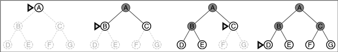
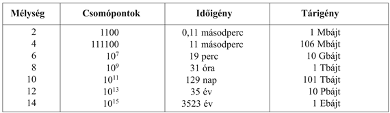
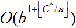
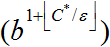
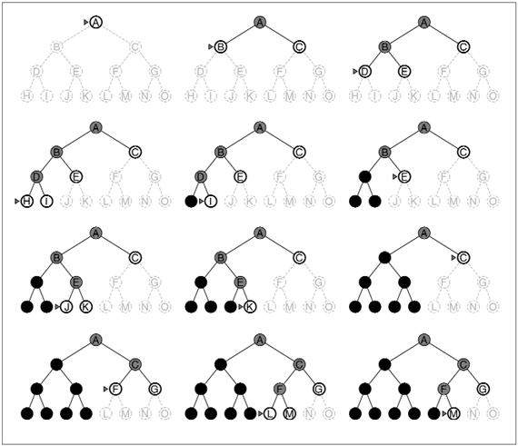
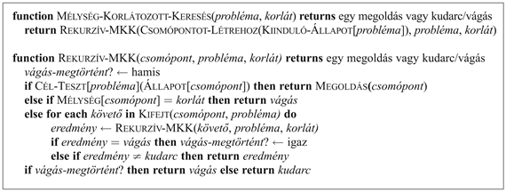
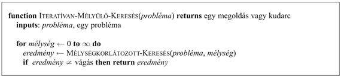
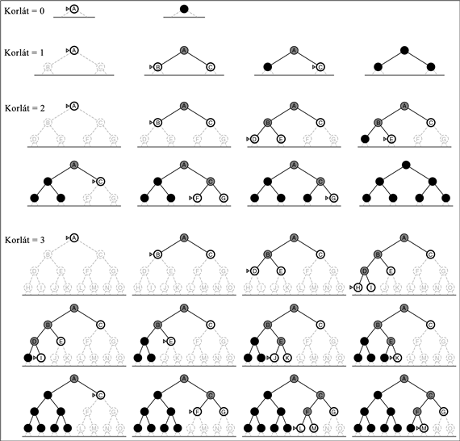
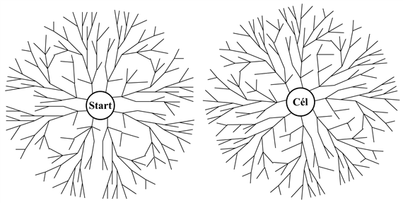
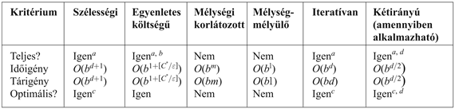

<?xml version="1.0" encoding="UTF-8" standalone="no"?>

<html xmlns="http://www.w3.org/1999/xhtml"><head><meta name="generator" content="DocBook XSL Stylesheets V1.76.1"/></head><body>

<h1 class="title"><a id="id545725"/>Nem informált keresés</h1>

Ez az alfejezet öt keresési stratégiát tárgyal, amelyek a <strong>nem informált</strong> (<strong>vak</strong>nak is nevezett)<strong> keresés</strong> (<strong>noninformed</strong> (<strong>blind</strong>) <strong>search</strong>) cím alá sorolhatók. A kifejezés azt jelenti, hogy ezen stratégiáknak semmilyen információjuk nincs az állapotokról a probléma definíciójában megadott információn kívül. Működésük során mást nem tehetnek, mint a következő állapotok generálása és a célállapot megkülönböztetése a nem célállapottól. Azokat a stratégiákat, amelyek tudják, hogy az egyik közbülső állapot „ígéretesebb”, mint egy másik közbülső állapot, <strong>informált keresés</strong>i (<strong>informed search</strong>) vagy <strong>heurisztikus keresés</strong>i (<strong>heuristic search</strong>) stratégiának nevezzük. Ezeket majd a 4. fejezet tárgyalja. A keresési stratégiákat a csomópontok kifejtési <em>sorrendje</em> különbözteti meg egymástól. 

<h2 class="title"><a id="id545783"/>Szélességi keresés</h2>

A <strong>szélességi keresés</strong> (<strong>breadth-first search</strong>) egy egyszerű keresési stratégia, ahol először a gyökércsomópontot fejtjük ki, majd a következő lépésben az összes a gyökércsomópontból generált csomópontot, majd <em>azok</em> követőit stb. Általánosságban a keresési stratégia minden adott mélységű csomópontot hamarabb fejt ki, mielőtt bármelyik, egy szinttel lejjebbi csomópontot kifejtené. 

A szélességi keresést meg lehet valósítani a <code class="code">FA-KERESÉS</code> algoritmussal egy olyan üres peremmel, amely egy először-be-először-ki (first-in-first-out – FIFO) sor, biztosítva ezzel, hogy a korábban meglátogatott csomópontokat az algoritmus korábban fejti ki. Más szóval a <code class="code">FA-KERESÉS</code> (<em>probléma</em>, FIFO-<code class="code">SOR</code> ()) meghívása szélességi keresést eredményez. A FIFO sor az összes újonnan legenerált követőt a sor végére teszi, magyarán a sekélyebb csomópontok korábban kerülnek kifejtésre, mint a mélyebben fekvők. A 3.10. ábra illusztrálja a keresés előrehaladását egy egyszerű bináris fa esetén.

<a id="id545819"/>
<strong>3.10. ábra - Szélességi keresés egy egyszerű bináris fában. Minden lépésnél a következő kifejtendő csomópontot egy marker jelzi.</strong>

A szélességi keresés elemzéséhez az előbbi részben tárgyalt négy jellemzőt fogjuk használni. Könnyű belátni, hogy ez a keresés <em>teljes</em>. Ha a legsekélyebb célcsomópont valamilyen véges <em>d</em> mélységben fekszik, a szélességi keresés eljut hozzá az összes nála sekélyebben fekvő csomópontot kifejtve (feltéve persze, hogy a <em>b</em> elágazási tényező véges). A <em>legsekélyebb</em> célcsomópont nem szükségképpen <em>optimális</em>. Pontosabban a szélességi keresés optimális, ha az útköltség a csomópont mélységének nem csökkenő függvénye (például ha minden cselekvésnek ugyanannyi a költsége). 

Eddig a szélességi keresésnek csak a jó tulajdonságait láttuk. Ahhoz, hogy megértsük miért nem mindig ezt a stratégiát választjuk, meg kell vizsgálnunk a keresés végrehajtásához szükséges idő és memória mennyiségét. Ehhez egy olyan hipotetikus állapotteret veszünk alapul, amelyben minden egyes állapotot kifejtve <em>b</em> új állapot keletkezik. A keresési fa gyökércsomópontja <em>b</em> csomópontot generál az első szinten, amelyek mindegyike újabb <em>b</em> csomópontot, összesen <em>b</em>2 csomópontot generál a második szinten. <em>Ezek </em>mindegyike újabb <em>b</em> csomópontot generál, összesen <em>b</em>3 csomópontot a harmadik szinten és így tovább. Tételezzük fel, hogy ezen probléma megoldása <em>d</em> mélységben található. Ekkor a legrosszabb esetben a <em>d-</em>edik szinten az utolsót kivéve (mert a célt magát nem fejtjük ki) a csomópontok mindegyikét ki kell fejtenünk, a (<em>d </em>+ 1)-edik szinten <em>bd</em>+1 <em>–</em> <em>b</em> csomópontot generálva. A generált csomópontok össz-száma így:

<code class="code"><em>b</em> + <em>b</em>2 + <em>b</em>3 + ... + <em>bd </em>+<em> </em>(<em>bd+</em>1<em>– b</em>) = <em>O</em>(<em>bd+</em>1)</code>

Minden legenerált csomópontot a memóriában el kell tárolni, mert vagy a perem eleme, vagy egy perembeli csomópont őse. A tárigény így az időigénnyel azonos (meg egy további csomópont a gyökér számára). 

Azok, akik járatosak a komplexitáselemzésben, kezdenek aggódni (vagy izgatottak lesznek, ha szeretik a kihívásokat), amikor exponenciális komplexitást látnak, mint amilyen például az <em>O</em>(<em>bd+</em>1). A 3.11. ábra megmutatja, hogy miért. Az ábra egy <em>b</em> = 10 elágazási tényezővel rendelkező szélességi keresést mutat a <em>d</em> megoldás mélység több értékére. A táblában feltételezzük, hogy másodpercenként 10 000 csomópontot generálunk, illetve egy csomópont tárolásához 1000 bájtra van szükség. Számos feladvány jellegű probléma felel meg ezeknek a feltételezéseknek (egy 100-as tényezővel ide vagy oda), ha azokat modern személyi számítógépeken futtatjuk.

<h3 class="title">Fontos</h3>
A 3.11. ábra alapján két tanulságot vonhatunk le. Először is a <em>szélességi keresés esetén a tárigény nagyobb problémát jelent az időigénynél.</em> A legtöbb ember, amennyiben érdekli a válasz egy fontos problémára, türelmesen ki tud várni 31 órát, hogy egy 8 mélységű keresés lefusson, de csak kevés számítógépnek van a kereséshez szükséges Tbájtnyi memóriája. Szerencsére léteznek ennél kevesebb memóriát igénylő keresési algoritmusok is.

<a id="id545989"/>
<strong>3.11. ábra - A szélességi keresés idő- és tárigénye. Az ábra adatai <em>b</em> = 10-es elágazási tényezőt, 10 000 csomópont/percet és 1000 bájt/csomópontot feltételeznek.</strong>

<h3 class="title">Fontos</h3>
A második tanulság, hogy az időigény még mindig fontos tényező. Ha a problémánk 12 mélységű, akkor (a feltételezéseink mellett) a szélességi keresésnek (vagy akármlyik nem informált keresési algoritmusnak) 35 évbe telne a megoldás megtalálása. Általánosságban <em>az exponenciális komplexitású keresési problémák közül csak a legkisebb problémapéldányok oldhatók meg.</em>

<h2 class="title"><a id="id546009"/>Egyenletes költségű keresés</h2>

A szélességi keresés optimális, ha minden lépés költsége azonos, mert mindig a <em>legsekélyebb</em> ki nem fejtett csomópontot fejti ki. Egyszerű általánosítással egy olyan algoritmust találhatunk ki, amely tetszőleges lépésköltség mellett optimális. Az <strong>egyenletes költségű keresés</strong> (<strong>uniform cost search</strong>) mindig a <em>legkisebb útköltségű</em> <em>n</em> csomópontot fejti ki először, nem pedig a legkisebb mélységű csomópontot. Egyszerűen belátható, hogy a szélességi keresés is egyenletes költségű keresés, amennyiben minden lépésköltség azonos.

Az egyenletes költségű keresés nem foglalkozik azzal, hogy <em>hány</em> lépésből áll egy bizonyos út, hanem csak az összköltségükkel törődik. Emiatt mindig végtelen hurokba kerül, ha egy csomópont kifejtése zérus költségű cselekvéshez és ugyanahhoz az állapothoz való visszatérést eredményez (például a <em>NoOp</em> cselekvés). A teljességet csak úgy garantálhatjuk, hogy minden lépés költsége egy kis pozitív<em> </em>e konstansnál nagyobb, vagy azzal egyenlő. Ez a feltétel egyben az <em>optimalitás</em> elégséges feltétele is. Ez azt jelenti, hogy egy út költsége az út mentén mindig növekszik. Ebből a tulajdonságból látszik, hogy az algoritmus a csomópontokat mindig a növekvő útköltség függvényében fejti ki. Azaz az első kifejtésre kiválasztott célcsomópont egyben az optimális megoldás is (emlékezzünk arra, hogy a <code class="code">FA-KERESÉS</code> a célállapottesztet csak a kifejtésre megválasztott csomópontokra alkalmazza). Javasoljuk, hogy próbálják ki az algoritmust, hogy a Bukarestbe vezető legrövidebb utat megtalálják. 

Az egyenletes költségű keresést nem a mélység, hanem az útköltség vezérli, így komplexitását a <em>b</em> és a <em>d</em> függvényében nehéz jellemezni. Helyette legyen <em>C</em>∗ az optimális megoldás költsége, és tételezzük fel, hogy minden cselekvés költsége legalább e. Az algoritmus idő- és tárigénye legrosszabb esetben, ami sokkal több lehet, mint <em>bd</em>. Ez azért lehetséges, mert az egyenletes költségű keresés képes (és sokszor ezt meg is teszi) a kis lépésekből álló nagy fákat felkutatni a nagy és feltehetően hasznos lépéseket tartalmazó utak előtt. Amikor minden lépés költsége ugyanannyi, az,  persze azonos <em>bd</em>-nel.

<h2 class="title"><a id="id546101"/>Mélységi keresés</h2>

<a id="ID_115_116_oldal"/>
A <strong>mélységi keresés</strong> (<strong>depth-first search</strong>) mindig a keresési fa aktuális peremében a <em>legmélyebben</em> fekvő csomópontot fejti ki. A keresés lefolyását a 3.12. ábra illusztrálja. A keresés azonnal a fa legmélyebb szintjére jut el, ahol a csomópontoknak már nincsenek követőik. Kifejtésüket követően kikerülnek a peremből és a keresés „visszalép” ahhoz a következő legmélyebben fekvő csomóponthoz, amelynek vannak még ki nem fejtett követői.

Ez a stratégia egy olyan <code class="code">FA-KERESÉS</code> függvénnyel implementálható, amelynek a sorbaállító függvénye az utolsónak-be-elsőnek-ki (last-in-first-out, LIFO), más néven verem. A mélységi keresést szokás a <code class="code">FA-KERESÉS</code> függvény alternatívájaként egy rekurzív függvénnyel is implementálni, amely a gyermekcsomópontokkal meghívja önmagát (mélységkorláttal dolgozó rekurzív mélységi keresés algoritmusát a 3.13. ábra mutatja).

A mélységi keresés nagyon szerény tárigényű. Csak egyetlen, a gyökércsomóponttól egy levélcsomópontig vezető utat kell tárolnia, kiegészítve az út minden egyes csomópontja melletti kifejtetlen csomópontokkal. Egy kifejtett csomópont el is hagyható a memóriából, feltéve, hogy az összes leszármazottja meg lett vizsgálva. Egy <em>b</em> elágazási tényezőjű és <em>m</em> maximális mélységű állapottér esetén a mélységi keresés tárigénye <em>bm </em>+<em> </em>1. A 3.11. ábra<em> </em>feltételezéseivel élve és feltételezve, hogy a célcsomópont mélységű csomópontoknak nincsenek követőik, azt találjuk, hogy például <em>d</em> = 12 mélység esetén a mélységi keresés 118 kbájtot igényelne a 10 Pbájttal szemben, ami tízmilliárdos redukciót jelent a tárigényben.

A mélységi keresés <strong>visszalépéses keresés</strong>nek (<strong>backtracking search</strong>) nevezett változata még kevesebb memóriát használ. A visszalépéses keresés az összes követő helyett egyidejűleg csak egy követőt generál. Minden részben kifejtett csomópont emlékszik, melyik követője jön a legközelebb. Ily módon csak <em>O</em>(<em>m</em>) memóriára van szükség, <em>O</em>(<em>bm</em>) helyett. A visszalépéses keresés még egy memória- (és idő-) spóroló trükkhöz folyamodik. Az ötlet a követő csomópont generálása az aktuális állapot <em>módosításával</em>, anélkül hogy az állapotot átmásolnánk. Ezzel a memóriaszükséglet egy állapotra és <em>O</em>(<em>m</em>) cselekvésre redukálódik. Ahhoz, hogy az ötlet működjön, amikor visszalépünk, hogy a következő követőt generáljuk, mindegyik módosítást vissza kell tudnunk csinálni. Nagy állapottérrel rendelkező problémák esetén, mint például robot-összeszerelés esetén, az ilyen módszerek lényegesek a sikerességhez.

A mélységi keresés hátrányos tulajdonsága, hogy egy rossz választással egy hosszú (akár végtelen) út mentén lefelé elakadhat, miközben például egy más döntés elvezetne a gyökérhez közeli megoldáshoz. A 3.12. ábrán például a mélységi keresés kifejti az egész bal oldali részfát, annak ellenére, hogy a <em>C</em> csomópont a megoldás. Ha a <em>J </em>csomópont szintén megoldás lenne, a mélységi keresés azt adná vissza megoldásul, következésképpen a mélységi keresés nem optimális. Ha a bal oldali részfa korlátlanul mély lenne és nem tartalmazna megoldást, a mélységi keresés soha nem állna meg, következésképpen a mélységi keresés nem teljes. A legrosszabb esetben a mélységi keresés a keresési fában az összes <em>O</em>(<em>bm</em>) csomópontot generálni fogja, ahol <em>m </em>a csomópontok maximális mélysége. Jegyezzük meg, hogy <em>m</em> sokkal nagyobb lehet, mint <em>d</em> (a legsekélyebb megoldás mélysége), és korlátlan fák esetén értéke végtelen.

<a id="id546227"/>
<strong>3.12. ábra - Mélységi keresés egy bináris keresési fában. A kifejtett csomópontok, amelyeknek a peremben nincsenek követőik, el is hagyhatók a memóriából. Ezeket feketével jelöltük meg. A 3-as mélységű csomópontokról feltételezzük, hogy nincsenek követőik, valamint azt is feltesszük, hogy <em>M</em> az egyetlen célcsomópont.</strong>

<h2 class="title"><a id="id546241"/>Mélységkorlátozott keresés</h2>

A végtelen fák problémáját a mélységi keresés azáltal küszöböli ki, hogy az utak maximális mélységére egy <em>ℓ</em> korlátot ad. Az <em>ℓ</em> mélységben lévő csomópontokat úgy kezeli, mintha nem is lennének követőik. A módszer neve a <strong>mélységkorlátozott keresés</strong>, <strong>MKK</strong> (<strong>depth-limited search</strong>, <strong>DLS</strong>). A mélységkorlát a végtelen út problémáját ugyan megoldja, de a nemteljesség egy újabb forrását hozza be, ha <em>ℓ</em> &lt; <em>d</em> -t választunk, azaz, ha a legsekélyebb célcsomópont a mélységkorláton túl van (ez nem is esélytelen, ha <em>d</em> eleve ismeretlen). A mélységkorlátozott keresés <em>ℓ</em> &gt; <em>d</em> választással sem lesz optimális. A keresés időigénye <em>O</em>(<em>bℓ</em>), tárigénye <em>O</em>(<em>bℓ</em>). A mélységi keresés egy olyan speciális mélységkorlátozott keresésének tekinthető, amelynek mélységkorlátja <em>ℓ</em> = ∞. 

A mélységi korlátot néha a probléma ismeretére lehet alapozni. Például Románia térképén 20 város található, így tudjuk, hogy ha létezik egy megoldás, az maximálisan 19 lépés hosszú lehet, így az <em>ℓ</em> = 19 egy lehetséges választás. Ha azonban a térképet tüzetesebben tanulmányoznánk, felfedeznénk, hogy minden város bármelyik másik városból legfeljebb 9 lépésben elérhető. Ez a szám, amit az állapottér <strong>átmérő</strong>jének (<strong>diameter</strong>) nevezünk, jobb mélységkorlátot ad, ami hatékonyabb mélységkorlátozott keresést eredményez. A legtöbb probléma esetén azonban mindaddig nem tudunk jó mélységkorlátot adni, amíg meg nem oldottuk a problémát.

A mélységkorlátozott keresést az általános fakeresési vagy a rekurzív mélységi keresési algoritmus egyszerű módosításával lehet implementálni. A 3.13. ábra mutatja a rekurzív mélységkorlátozott keresés pszeudokódját. Jegyezzük meg, hogy a mélységkorlátozott keresés kudarccal kétféle módon állhat le: a standard <em>kudarc</em> csomópont jelzi a megoldás hiányát, a <em>vágás</em> érték viszont jelzi a megoldás mélységkorláton belüli hiányát.

<a id="id546340"/>
<strong>3.13. ábra - A mélységkorlátozott keresés rekurzív implementációja</strong>

<h2 class="title"><a id="id546349"/>Iteratívan mélyülő mélységi keresés</h2>

<a id="ID_118_oldal"/>
Az <strong>iteratívan mélyülő keresés</strong> (<strong>iterative deepening search</strong>) – vagy iteratívan mélyülő mélységi keresés – egy általános stratégia, amit sokszor a mélységi kereséssel együtt alkalmaznak a legjobb mélységkorlát megtalálására. Az algoritmus képes erre, mert fokozatosan növeli a mélységkorlátot – legyen az először 0, majd 1, majd 2 stb. – amíg a célt meg nem találja. Ez akkor következik be, ha a mélységkorlát eléri a <em>d</em>-t, a legsekélyebben fekvő célcsomópont mélységét. Az algoritmust a 3.14. ábra mutatja. Az iteratívan mélyülő keresés ötvözi a szélességi és a mélységi keresés előnyös tulajdonságait. A mélységi kereséshez hasonlóan szerény, pontosabban <em>O</em>(<em>bd</em>) memóriaigénnyel rendelkezik. A szélességi kereséshez hasonlóan teljes, ha elágazási tényezője véges, és optimális, ha az útköltség a csomópontok mélységének nem csökkenő függvénye. A 3.15. ábra az <code class="code">ITERATÍVAN-MÉLYÜLŐ-KERESÉS</code> első négy iterációját mutatja egy bináris fán, ahol az algoritmus a megoldást a negyedik iterációban találja meg.

Az iteratívan mélyülő keresés tékozlónak tűnhet, mert felettébb sok állapotot többször is kifejt. Kiderül azonban, hogy a költségtöbblet nem lényeges. Ennek az az oka, hogy egy olyan keresési fában, ahol minden szinten ugyanaz (vagy közel ugyanaz) az elágazási tényező, majdnem az összes csomópont a legmélyebb szinten található, így nem túl sokat számít, hogy a magasabb szinteket többször is kifejtjük. Az iteratívan mélyülő keresésben a legmélyebb szinten (<em>d</em> mélység) található csomópontokat csak egyszer fejtjük ki, egy szinttel feljebb kétszer stb. egészen a gyökér gyerekeiig, amelyeket <em>d</em>-szer fejtünk ki. Így a kifejtett csomópontok össz-száma:

<code class="code"><em>Cs</em>(IMK) = (<em>d</em>)<em>b</em> + (<em>d </em>– 1)<em>b</em>2 + ... + (1)<em>bd</em></code>

amely <em>O</em>(<em>bd</em>) időkomplexitást eredményez. Összehasonlításul nézzük meg a szélességi keresés által generált csomópontok számát:

<code class="code"><em>Cs</em>(SZK) = <em>b</em> + <em>b</em>2 + ... + <em>bd </em>+<em> </em>(<em>bd</em>+1 – <em>b</em>)</code>

Vegyük észre, hogy a szélességi keresés <em>d </em>+ 1 mélységben is generál csomópontokat, az iteratívan mélyülő kereséssel ellentétben. Ennek eredménye, hogy az iteratívan mélyülő keresés a szélességi keresésnél <em>gyorsabb</em>, annak ellenére, hogy a csomópontokat többször fejti ki. Konkretizálva, például <em>b </em>= 10 és <em>d </em>= 5 esetén ezek a számok:

<code class="code"><em>Cs</em>(IMK) = 50 + 400 + 3000 + 20 000 + 100 000 = 123 450</code>

<code class="code"><em>Cs</em>(SZK) = 10 + 100 + 1000 + 10 000 + 100 000 + 999 990 = 1 111 100</code>

<h3 class="title">Fontos</h3>
<em>Általánosságban nagy keresési térrel rendelkező problémák esetén és ha a megoldás mélysége nem ismert, a nem informált módszerek köréből az iteratívan mélyülő keresés a javasolt.</em>

<a id="id546505"/>
<strong>3.14. ábra - Az iteratívan mélyülő keresési algoritmus mélységkorlátozott keresést alkalmaz ismételten, növekvő mélységkorláttal. Az algoritmus megáll, ha a megoldást megtalálja, vagy ha a mélységkorlátozott keresés kudarccal tér vissza, jelezve, hogy megoldás nem létezik.</strong>

<a id="id546515"/>
<strong>3.15. ábra - Az iteratívan mélyülő keresési algoritmus négy iterációja egy bináris fán</strong>

<a id="ID_119_oldal"/>
Az iteratívan mélyülő keresés a szélességi kereséssel abban rokon, hogy minden iterációban a csomópontok teljes rétegét megvizsgálja, mielőtt a következő rétegre térne rá. Hasznosnak látszik az egyenletes költségű keresés iteratív változatának kifejlesztése, amely örökölné ez utóbbi optimalitását, mellőzve annak a tárkövetelményeit. Az ötlet a növekvő útköltségkorlát használata a növekvő mélységkorlát helyett. Az eredményül kapott algoritmussal, amelynek neve <strong>iteratívan megnyúló keresés</strong> (<strong>iterative</strong><strong> lengthening search</strong>) a 3.11. feladat foglalkozik. Sajnos az derül ki, hogy az iteratívan megnyúló keresés overheadje tekintélyes az egyenletes költségű kereséshez képest.

<h2 class="title"><a id="id546544"/>Kétirányú keresés</h2>

A kétirányú keresés mögött az az ötlet húzódik, hogy egyszerre el lehet indítani egy keresést előrefelé a kiinduló állapotból, illetve hátrafelé a célállapotból, és a keresés akkor fejeződik be, ha a két keresés valahol találkozik (lásd 3.16. ábra). Az érv az, hogy <em>b</em><em>d</em>/2 + <em>b</em><em>d</em>/2<em> </em>sokkal kisebb, mint <em>bd</em>, illetve az ábrán szemlélve, hogy a két kisebb kör összterülete kisebb, mint annak a nagy körnek a területe, amelynek középpontja a kiinduló állapot, és amely a peremével a célállapotot eléri. 

<a id="id546575"/>
<strong>3.16. ábra - A kétirányú szélességi keresés sematikus ábrája. Az ábrán a két keresési irány majdnem találkozik, amikor a kiinduló csomópontból kinyúló egyik ág összeér egy a célcsomópontból kinyúló másik ággal.</strong>

A kétirányú keresést úgy implementálják, hogy az egyik vagy mindkét keresés egy csomópont kifejtése előtt megvizsgálja, hogy az nem része-e a másik keresési fa peremének. Ha igen, megvan a cél. Ha a probléma például <em>d</em> = <em>6 </em>megoldás mélységű, és mindegyik irányban a szélességi keresést futtatjuk csomópontonként, a két keresés a legrosszabb esetben akkor találkozik, ha mindegyik algoritmus a 3-as mélységben egy csomópont kivételével minden csomópontot kifejtett. A <em>b </em>=<em> </em>10 esetén ez 22 200 csomópont generálását jelenti a standard szélességi keresés által generált 1 111 111 csomóponthoz képest. Annak ellenőrzését, hogy egy csomópont a másik keresési fához tartozik-e, egy hash-táblával konstans időben meg lehet oldani. A kétirányú keresés időkomplexitása így <em>O</em>(<em>b</em><em>d</em>/2). Legalább az egyik keresési fát a memóriában kell tartani, hogy a tartozás ellenőrzése kivitelezhető legyen, a tárkomplexitás tehát szintén <em>O</em>(<em>b</em><em>d</em>/2). Ez a tárkomplexitás a kétirányú keresés legnagyobb gyengéje. Ha mindkét keresés szélességi keresés, az algoritmus teljes és optimális (egyenletes költség esetén). Más módszerek kombinációja vagy a teljesség, vagy az optimalitás, vagy mindkettő elvesztéséhez vezethet.

Az időkomplexitás mérséklése a kétirányú keresést igen vonzóvá teszi, de mit is jelent a célállapotból hátrafelé keresni? Ez nem is olyan egyszerű, mint amilyennek hangzik. Legyenek <em>x</em> csomópont <strong>elődcsomópont</strong>jai (<strong>predecessor</strong>s), az <em>Előd</em>(<em>x</em>)-ek azon csomópontok, amelyek mindegyikének <em>x</em> a követő csomópontja. A kétirányú keresés feltételezi, hogy egy <em>Előd</em>(<em>x</em>) hatékonyan számítható. Legegyszerűbb az az eset, amikor az összes cselekvés az állapottérben reverzíbilis, így <em>Előd</em>(<em>x</em>) = <em>Követő</em>(<em>x</em>). Más esetben azonban igen nagy ötletességre lehet szükség.

Nézzük most, hogy mit is jelent az, hogy „cél”, ha a célállapotból hátrafelé kell keresni. A 8-as kirakójáték és a romániai útkeresés esetén egyetlenegy célállapot létezik csak, így a hátrafelé keresés és az előrefelé keresés igen hasonlítanak egymásra. Amennyiben létezik a célállapotoknak egy <em>explicit</em> <em>listája,</em> mint például a 3.3. ábra két koszmentes célállapota, akkor megkonstruálhatunk egy olyan ál-célállapotot, amelynek közvetlen követői az aktuális célállapotok. Más módon, néhány redundáns csomópont-generálás elkerülhető azzal, hogy a célállapotok halmazát egyetlenegy célállapotnak tekintjük, amelynek minden elődje szintén egy állapothalmaz – konkrétan azon állapotok halmaza, amelyek követője a célállapothalmaz eleme (lásd még 3.6. alfejezet).

A kétirányú keresés szempontjából a legnehezebb eset, amikor a célállapottesztnél a feltehetően nagy célállapothalmazról csak implicit <em>leírás</em> áll rendelkezésünkre, például a sakkban az összes állapot, ami kielégíti a „matt” célt. A hátrafelé keresésnek az „<em>m</em>1 cselekvés révén a »matt« állapotba vezető összes állapot” tömör leírását kellene tudnia megkonstruálni, és hasonló módon folytatni. E leírásokat az előrefelé haladó keresés által generált állapotokkal kellene tesztelni. Ennek nincs általánosan hatékony módja.

<h2 class="title"><a id="id548334"/>A keresési stratégiák összehasonlítása</h2>

A 3.17. ábra a 3.4. alfejezetben megfogalmazott négy kiértékelési kritérium tükrében összehasonlítja a keresési stratégiákat.

<a id="id548340"/>
<strong>3.17. ábra - A keresési stratégiák értékelése. <em>b</em> az elágazási tényező, <em>d</em> a legsekélyebb megoldás mélysége, <em>m</em> a keresési fa maximális mélysége, <em>ℓ</em> a mélységkorlát. A felső indexszel jelzett kikötések a következők: a teljes, ha <em>b</em> véges; b teljes, ha a lépésköltség ≥ ε, pozitív ε-ra;  c optimális, ha a lépésköltségek mind azonosak; d ha mindkét irányban szélességi keresést használunk.</strong>

</body></html>
