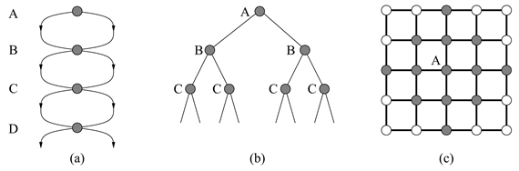
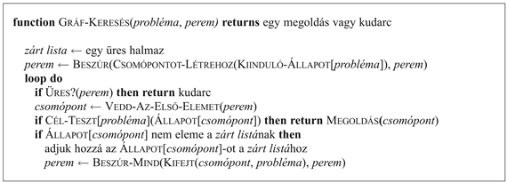

<?xml version="1.0" encoding="UTF-8" standalone="no"?>

<html xmlns="http://www.w3.org/1999/xhtml"><head><meta name="generator" content="DocBook XSL Stylesheets V1.76.1"/></head><body>

<h1 class="title"><a id="id548382"/>Az Ismételt állapotok elkerülése</h1>

<a id="ID_122_oldal"/>
Eddig figyelmen kívül hagytuk a keresés egyik legfontosabb megoldandó problémáját: a már korábban egy másik úton megtalált és kifejtett állapotok ismételt kifejtéséből adódó időpazarlást. Néhány probléma esetén ezen lehetőség soha nem merül fel, mert az állapottér egy fa, és minden állapotba csak egyetlen módon lehet eljutni. A 8-királynő probléma hatékony megfogalmazása – amikor minden új királynőt a bal szélső szabad oszlopba helyezzük – nagyrészt épp ennek köszönheti hatékonyságát, vagyis hogy minden egyes állapotba csak egyetlen úton lehet eljutni. Ha a 8-királynő problémát úgy fogalmazzuk meg, hogy egy királynőt báramelyik oszlopban el lehet helyezni, akkor az <em>n</em> királynőt tartalmazó minden állapotot <em>n</em>! különböző úton el lehet érni. 

Számos problémánál azonban elkerülhetetlenek a megismételt állapotok. Ezek közé tartozik az összes olyan probléma, amelyben az operátorok reverzíbilisek. Többek között ebbe a csoportba tartoznak az útkeresési problémák és a csúszó lapka fejtörő játékok. Az ezen problémákhoz tartozó keresési fák végtelenek, de ha a megismételt állapotok egy részét levágjuk, akkor a keresési fát véges méretűre vághatjuk, ezáltal a keresési fának csak az állapottér gráfot kifeszítő részét generálva. Szélsőséges esetben egy <em>d </em>+ 1 méretű állapottérből (lásd 3.18. (a) ábra)<em> </em>egy 2d levelű fa lesz (lásd 3.18. (b) ábra). Egy élethűbb példa a <strong>négyzetrács</strong> (<strong>rectangular grid</strong>) (lásd 3.18. (c) ábra). A rácsban minden állapotnak négy követője van. Az ismétlődő állapotokat tartalmazó fának így 4d levele van. Minden adott állapottól <em>d</em> lépésnyire azonban csak kb. 2<em>d</em>2 különböző állapot van. <em>d</em> = 20 esetén ez kb. egybillió csomópontot, de csak 800 különböző állapotot jelent.

Az ismétlődő állapotok tehát a megoldható problémákat megoldhatatlan problémákká alakítják, amennyiben az algoritmus nem képes ezeket az állapotokat detektálni. A detektálás általában azt jelenti, hogy az új kifejtendő csomópontot a már kifejtett csomópontokkal hasonlítjuk össze. Egyezés esetén az adott csomóponthoz az algoritmus két utat talált, és valamelyiket eldobhatja. 

<h3 class="title">Fontos</h3>
A mélységi keresés csak a gyökeret és az aktuális csomóponttal összekötő úton fekvő állapotokat tárolja. E csomópontoknak az aktuális csomóponttal való összehasonlítása lehetővé teszi a hurkok felismerését, amiket ezek után azonnal el lehet dobni. Ez meg is véd attól, hogy a hurkok révén véges állapotterekből ne keletkezzenek végtelen keresési fák. Sajnos azonban nem tud megvédeni a nem hurkos utak exponenciális megsokszorozódásától az olyan problémákban, mint amilyenek a 3.18. ábrán látható. Ezt elkerülni csak úgy lehet, hogy több csomópontot tartunk a memóriában. Az idő és a tárigény között egy alapvető kompromisszum létezik. <em>Az az algoritmus, amely elfelejti a történetét, kénytelen azt megismételni</em>.

Ha egy algoritmus minden meglátogatott állapotra emlékszik, akkor közvetlen módon fedezi fel az állapotteret. A <code class="code">FA-KERESÉS</code> algoritmust módosíthatjuk úgy, hogy egy <strong>zárt listá</strong>nak (<strong>closed list</strong>) nevezett adatszerkezetet tartalmazzon, amely minden kifejtett csomópontot tárol. (A még ki nem fejtett csomópontokból álló peremet néha <strong>nyitott listá</strong>nak [<strong>open list</strong>] nevezik.) Ha az aktuális állapot egybeesik a zárt listán lévő állapotok egyikével, akkor eldobható, ahelyett hogy a kifejtésével kellene foglalkozni. Az új algoritmus neve <code class="code">GRÁF-KERESÉS</code> (3.19. ábra). Az ismétlődő állapotokat tartalmazó problémák esetén a <code class="code">GRÁF-KERESÉS</code> sokkal hatékonyabb, mint a <code class="code">FA-KERESÉS</code>. Az algoritmus a legrosszabb esetre számított tár- és időkomplexitása arányos az állapottér méretével, ami sokkal kisebb lehet, mint <em>O</em>(<em>bd</em>). 

A gráfkeresés optimalitása már trükkös dolog. Korábban azt mondtuk, hogy egy ismételt állapot detektálásával az algoritmus két utat talált ugyanahhoz az állapothoz. A 3.19. ábrán látható <code class="code">GRÁF-KERESÉS</code> algoritmus mindig az <em>újonnan felfedezett</em> utat dobja el. Nyilvánvaló, hogy ha az újonnan felfedezett út rövidebb, mint az eredeti, a <code class="code">GRÁF-KERESÉS</code> elvéthet egy optimális megoldást. Szerencsére ki tudjuk mutatni (lásd 3.12. feladat), hogy az egyenletes költségű és a konstans lépésköltségű szélességi keresés esetén ez nem történhet meg. E két optimális fakeresési stratégia egyben optimális gráfkeresési stratégia is. Az iteratívan mélyülő keresés azonban mélységi kifejtést használ és könnyen kerülhet egy csomópont felé vezető szuboptimális útra, mielőtt megtalálná a hozzá vezető optimális utat. Az iteratívan mélyülő gráfkeresésnél tehát egy újonnan felfedezett útnál meg kell vizsgálni, hogy ez nem jobb-e, mint az eredeti. És ha igen, szükség lehet az adott csomópont követőinél a mélységek és az útköltségek revíziójára. 

<a id="id548508"/>
<strong>3.18. ábra - Egy exponenciálisan nagyobb keresési fát generáló állapottér. (a) Egy olyan állapottér, amelyben két lehetséges cselekvés vezethet A-ból B-be, kettő B-ből C-be és így tovább. Ez az állapottér <em>d</em>+1 állapotot tartalmaz, ahol <em>d</em> a maximális mélység. (b) Az (a) állapottér megfelelő keresési fája, 2d ággal, amely az állapotér 2d útjának felel meg. (c) Egy négyzetrács. A kezdeti (A) állapottól kétlépésnyire fekvő állapotokat szürke színnel jelöltük.</strong>

<a id="id548534"/>
<strong>3.19. ábra - Az általános gráfkereső algoritmus. A <em>zárt</em> halmazt egy hash-táblával lehet implementálni, hogy az ismételt állapotokat hatékonyan ellenőrizni tudjuk. Ez az algoritmus feltételezi, hogy az <em>s</em> állapothoz vezető első út a legolcsóbb (lásd szöveg).</strong>

Jegyezzük meg, hogy a zárt lista használata azt jelenti, hogy a mélységi és az iteratívan mélyülő keresés tárigénye már nem lineáris. Mivel a <code class="code">GRÁF-KERESÉS</code> algoritmus minden csomópontot a memóriában megtart, egyes keresési fajták kivitelezhetetlenek a memóriakorlátok miatt.

</body></html>
