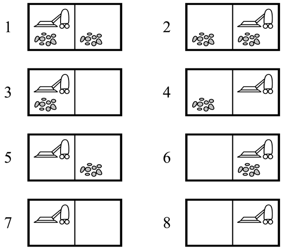
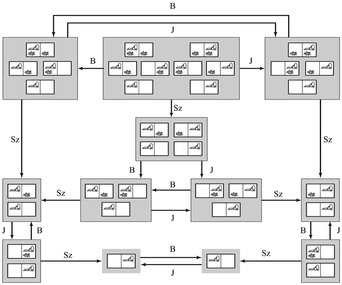

<?xml version="1.0" encoding="UTF-8" standalone="no"?>
<!DOCTYPE html PUBLIC "-//W3C//DTD XHTML 1.1//EN" "http://www.w3.org/TR/xhtml11/DTD/xhtml11.dtd">
<html xmlns="http://www.w3.org/1999/xhtml"><head><meta name="generator" content="DocBook XSL Stylesheets V1.76.1"/></head><body>

<h1 class="title"><a id="id548557"/>Keresés részleges információ mellett</h1>

A 3.3. alfejezetben azt tételeztük fel, hogy a környezet teljesen megfigyelhető és determinisztikus, valamint hogy az ágens tisztában van minden cselekvésének következményével. Ebből kifolyólag az ágens pontosan ki tudja számítani, hogy egy tetszőleges cselekvésszekvenciának milyen állapot az eredménye, és azt is tudja, hogy ő maga melyik állapotban van. Az érzékelései nem nyújtanak új információt az egyes cselekvések után. Mi történik, ha a cselekvésekről és az állapotokról alkotott tudás nem teljes? Azt találjuk, hogy a nemteljesség különböző formái három elkülönülő problématípushoz vezetnek:

<ol class="orderedlist"><li class="listitem">
<strong>Szenzor nélküli</strong> (<strong>sensorless</strong> vagy <strong>conformant</strong>) problémák: ha az ágensnek egyáltalán nincsenek szenzorai, akkor (a tudásának megfelelően) a több lehetséges kezdeti állapot egyikében lehet, és minden cselekvése a lehetséges követő állapotok egyikéhez vezethet.
</li><li class="listitem">
<strong>Eshetőségi</strong> (<strong>contingency</strong>) problémák: ha a környezet részben megfigyelhető, vagy ha a cselekvések bizonytalanok, akkor az ágens érzékszervei új információt nyújtanak minden cselekvés után. Minden lehetséges érzékelés egy eshetőséget határoz meg, amire az ágensnek terveznie kell. A problémát <strong>ellenfél problémá</strong>nak (<strong>adversarial</strong>) hívják, ha a bizonytalanságot egy másik ágens cselekvései okozzák.
</li><li class="listitem">
<strong>Felfedezéses</strong> (<strong>explorational</strong>) probléma: ha a környezet állapotai és cselekvései nem ismertek, az ágensnek külön cselekednie kell, hogy azokat felderíthesse. A felfedezéses problémákat az eshetőségi problémák szélsőséges változatának lehet tekinteni.
</li></ol>

Példaként a porszívóvilág környezetét vesszük. Emlékezzünk vissza, hogy az állapottér nyolc állapotból áll (lásd 3.20. ábra). Három cselekvés van – <em>Jobbra</em>, <em>Balra</em> és <em>Szív</em> –, és a cél az összes kosz felszedése (a 7. és 8. állapot). Ha a környezet megfigyelhető, determinisztikus és teljesen ismert, akkor a problémát triviálisan bármelyik ismertetett algoritmussal meg lehet oldani. Így például ha a kezdeti állapot az 5. állapot, akkor a [<em>Jobbra</em>, <em>Szív</em>] cselekvésszekvencia a 8. célállapotot éri el. A fejezet további részében e probléma szenzor nélküli és eshetőségi változatával foglalkozunk. A felfedezéses problémákat a 4.5. alfejezet, az ellenfélproblémákat a 6. fejezet tárgyalja.

<h2 class="title"><a id="id548641"/>Szenzor nélküli problémák</h2>

<a id="ID_124_oldal"/>
Tegyük fel, hogy a porszívóágens ismeri az összes cselekvésének a hatását, de szenzorokkal nem rendelkezik. Ekkor csak azt tudja, hogy kezdeti állapota az {1, 2, 3, 4, 5, 6, 7, 8} halmaz egyik eleme. Azt lehetne gondolni, hogy az ágens sorsa reménytelen, azonban ágensünk igen jól feltalálja magát. Mivel tudja, hogy cselekvései mire képesek, kiszámíthatja például, hogy a <em>Jobbra</em> cselekvés a {2, 4, 6, 8} állapotok egyikébe viszi, és a <em>Jobbra</em>, <em>Szív</em> cselekvéssorozat eredményeképpen a {4, 8} egyikében köt ki. Végül a <em>Jobbra</em>, <em>Szív</em>, <em>Balra</em>, <em>Szív</em> sorozat garantáltan eléri a 7. célállapotot, függetlenül a kezdeti állapottól. Azt mondjuk, hogy az ágens a világot a 7. állapotba <strong>bele</strong> tudja <strong>kényszerít</strong>eni (<strong>coerce</strong>), akkor is, amikor nem is tudja, honnan indult. Összegezve: ha a világ nem teljesen megfigyelhető, az ágensnek az egyedi állapotokkal szemben azon <em>állapothalmazokra</em> kell tudnia következtetni, amely halmazok állapotaiba eljuthat. Minden ilyen állapothalmazt egy <strong>hiedelmi állapot</strong>nak nevezünk (<strong>belief state</strong>), amely az ágens pillanatnyi hiedelmét fejezi ki, hogy ő maga vajon milyen fizikai állapotban lehet most. (A teljesen megfigyelhető környezetben minden hiedelmi állapot egyetlen fizikai állapotból áll.)

<a id="id548704"/>
<strong>3.20. ábra - A porszívóvilág nyolc lehetséges állapota</strong>

Ahhoz, hogy egy szenzor nélküli problémát megoldhassunk, a fizikai állapotok terében történő keresés helyett a hiedelmi állapotok terében kell keresni. A kezdeti állapot egy hiedelmi állapot, és minden cselekvés egy hiedelmi állapotból egy hiedelmi állapotba képez le. Egy cselekvést úgy kell alkalmazni egy hiedelmi állapotra, hogy a hozzá tartozó minden fizikai állapotra kell azt alkalmazni, és az eredmények unióját kell képezni. Egy út most több hiedelmi állapotot köt össze, a megoldás pedig egy olyan utat jelent, amely <em>csak</em> célállapotokból álló hiedelmi állapotba vezet. A 3.21. ábra mutatja a determinisztikus szenzor nélküli porszívóvilág hozzáférhető hiedelmi állapotterét. Csak 12 hozzáférhető hiedelmi állapot létezik, az egész hiedelmi állapottér azonban tartalmazza a fizikai állapotok minden lehetséges halmazát, azaz 28 = 256 hiedelmi állapotot. Általában, ha a fizikai állapottérnek <em>S</em> állapota van, a hiedelmi állapottér állapotainak száma 2S.

<a id="id548730"/>
<strong>3.21. ábra - A determinisztikus, szenzor nélküli porszívóvilág hiedelmi állapotterének hozzáférhető része. Minden árnyalt doboz egyetlenegy hiedelmi állapothoz tartozik. Minden pillanatban az ágens egy konkrét hiedelmi állapotban tartózkodik, azonban nem tudja, hogy melyik fizikai állapotban van. A kezdeti hiedelmi állapot (a teljes tudatlanság) legfelül középen helyezkedik el. A cselekvéseket a címkézett nyilak jelölik. Az önhurkokat a nagyobb áttekinthetőség érdekében az ábrából kihagytuk.</strong>

A szenzor nélküli problémák eddigi elemzésében determinisztikus cselekvéseket tételeztünk fel. Az elemzés lényegében érvényes marad, ha a környezet nemdeterminisztikus, azaz ha a cselekvéseknek néhány lehetséges kimenetele lehet. Ennek az az oka, hogy szenzorok nélkül az ágens nem képes megmondani, hogy milyen kimenetel történt valójában. A különböző lehetséges kimenetelek így pótlólagos fizikai állapotok a követő hiedelmi állapotban. Tételezzük fel például, hogy a környezetben Murphy-törvény uralkodik: a <em>Szív</em> cselekvés <em>néha</em> koszt is hagy a szőnyegen, <em>de csak akkor, ha ott előzetesen a kosznak nyoma sem volt</em>.[<a id="id548754" href="#ftn.id548754" class="footnote">32</a>] Ha a <em>Szív</em> cselekvést tehát a 4. fizikai állapotban alkalmazzuk (lásd 3.20. ábra), a két lehetséges kimenetel a 2. és a 4. állapot. A kezdeti {1, 2, 3, 4, 5, 6, 7, 8} hiedelemállapotra alkalmazva a <em>Szív</em> olyan hiedelemállapothoz vezet, ami a cselekvés eredményeinek uniója a nyolc fizikai állapotra. Kiszámítva, azt kapjuk, hogy az új hiedelmi állapot az {1, 2, 3, 4, 5, 6, 7, 8}. A <em>Szív</em> cselekvés a Murphy-törvény uralta világban egy szenzor nélküli ágens hiedelmi állapotát tehát nem változtatja meg! A probléma valójában megoldhatatlan (lásd 3.18. feladat). Ennek intuitív magyarázata az, hogy az ágens nem képes megmondani, hogy az aktuális mező koszos-e, ebből kifolyólag nem képes megmondani, hogy a <em>Szív</em> cselekvés takarítani fog-e, vagy még több koszt hagy maga után.

<h2 class="title"><a id="id548774"/>Eshetőségi problémák</h2>

Ha a környezet jellege olyan, hogy az ágens a cselekvéseit követően szerezhet új információt a szenzorai révén, <strong>eshetőségi problémá</strong>ról (<strong>contingency problem</strong>) beszélünk. Egy eshetőségi probléma megoldása sokszor egy <em>fa</em> alakját veszi fel, ahol egy-egy ágnak a kiválasztása azon múlik, hogy odáig az ágens milyen érzékelésekhez jutott. Tegyük fel, hogy az ágens a Murphy-törvény világában rendelkezik helyzetérzékelővel és lokális koszérzékelővel, nincs azonban olyan szenzora, amely képes lenne koszt detektálni más négyzeteken. Így a [<em>B</em>, <em>Kosz</em>] érzékelés azt jelenti, hogy az ágens az {1, 3} állapotok egyikében van. Az ágens most a [<em>Szív</em>, <em>Jobbra</em>, <em>Szív</em>] cselekvési szekvenciát fogalmazhatta meg. A szívó cselekvés az {5, 7} állapotok egyikébe viszi az ágenst, és jobbra elmozdulva az állapota a {6, 8} állapotok egyikére változik. A szívó cselekvés alkalmazása a 6. állapotban, a 8. állapotot – a célt – eredményezi. Ha azonban a szívó cselekvést a 8. állapotban alkalmazzuk, a 6. állapotba térünk vissza (a Murphy-törvény jóvoltából), amely esetben tervünk kudarcba fullad.

A hiedelmi teret a probléma e változatánál elemezve könnyen megállapíthatjuk, hogy semmilyen rögzített cselekvésszekvencia sem garantálja a probléma megoldását. De lesz megoldásunk, ha a cselekvések <em>szigorú sorrendjéről</em> lemondunk:

<code class="code">[Szív, Jobbra, <em>ha</em> [Jobbra, Kosz] <em>akkor</em> Szív]</code>

A megoldások terét így azzal a lehetőséggel bővítjük, hogy a cselekvéseket a végrehajtás alatt megjelenő eshetőségek alapján választjuk. A valós fizikai világ számos problémája eshetőségi probléma, hiszen pontos előrejelzés lehetetlen. Sok ember ezért tartja mindig nyitva a szemét séta és vezetés közben. 

Az eshetőségi problémák <em>néha</em> rögzített cselekvésszekvenciával is megoldhatók. Tekintsük például a<em> teljesen megfigyelhető</em> Murphy-törvény világot. Eshetőséggel állunk szemben, ha az ágens a <em>Szív</em> cselekvést egy üres négyzet felett hajtja végre, hiszen a kosz akkor vagy meg fog jelenni, vagy sem. Ameddig az ágens soha nem teszi ezt, eshetőségek fel sem merülnek, és minden kezdeti állapotból létezik egy rögzített megoldási szekvencia (lásd 3.18. feladat). 

Eshetőségi problémák esetén az algoritmusok az e fejezetben található standard keresési algoritmusoknál bonyolultabbak. Ezekkel a 12. fejezet foglalkozik. Az eshetőségi problémák egy kissé eltérő ágens tervezési sémát is támogatnak, amelyekben az ágens egy garantált terv megtalálása <em>előtt</em> is cselekedhet. Ez hasznos, mert ahelyett, hogy a végrehajtás során <em>előforduló</em> minden eshetőséget előre figyelembe venne, gyakran jobb elkezdeni a végrehajtást, és megnézni, hogy mely eshetőségek <em>következnek be </em>valójában. A járulékos információ megadása után az ágens folytathatja a probléma megoldását. A keresés és a végrehajtás ily módon történő <strong>összefésülés</strong>e (<strong>interleaving</strong>) a felderítéses problémák (lásd 4.5. alfejezet) vagy a játékok (6. fejezet) esetén is hasznos.

 

[<a id="ftn.id548754" href="#id548754" class="para">32</a>]  Feltételezzük, hogy már minden olvasó került hasonló helyzetbe, így át tudják érezni ágensünk frusztráltságát. Elnézést kérünk a modern háztartási gépek tulajdonosaitól, akiknek ez a pedagógiai példa nem jelent segítséget.

</body></html>
