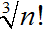
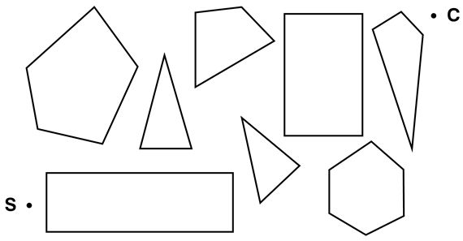

<?xml version="1.0" encoding="UTF-8" standalone="no"?>
<!DOCTYPE html PUBLIC "-//W3C//DTD XHTML 1.1//EN" "http://www.w3.org/TR/xhtml11/DTD/xhtml11.dtd">
<html xmlns="http://www.w3.org/1999/xhtml"><head><meta name="generator" content="DocBook XSL Stylesheets V1.76.1"/></head><body>

<h1 class="title"><a id="id548868"/>Összefoglalás</h1>

Ez a fejezet olyan módszereket ismertetett, amelyekkel az ágens a cselekvéseit választhatja meg determinisztikus, megfigyelhető, statikus és teljesen ismert környezetben. Ilyen esetekben az ágens olyan cselekvéssorozatokat konstruálhat, amelyekkel a céljait elérheti. Ezt a folyamatot <strong>keresés</strong>nek (<strong>search</strong>) nevezzük.

<ul class="itemizedlist"><li class="listitem">
A megoldás keresésének megkezdése előtt az ágensnek előbb meg kell fogalmaznia a <strong>cél</strong>t (<strong>goal</strong>), majd a célt fel kell használnia a <strong>probléma</strong> megfogalmazására.
</li><li class="listitem">
Egy <strong>probléma</strong> (<strong>problem</strong>) négy részből: a <strong>kiinduló állapot</strong>ból (<strong>initial state</strong>), egy <strong>cselekvés</strong>- (<strong>action</strong>) készletből, egy <strong>célteszt</strong>- (<strong>goal test</strong>) függvényből és egy <strong>útkölt</strong><strong>ség</strong>- (<strong>path cost</strong>) függvényből áll. A probléma környezetét az <strong>állapottér</strong> (<strong>state spac</strong><strong>e</strong>) írja le. Az állapottérben a kiinduló állapotból a célállapotba vezető <strong>út</strong> (<strong>path</strong>) a probléma egy<strong> megoldás</strong>a (<strong>solution</strong>).
</li><li class="listitem">
Egyetlen általános <code class="code">FA-KERESÉS</code> algoritmus felhasználható bármilyen probléma megoldására. Az algoritmus konkrét változatai eltérő stratégiákat valósítanak meg.
</li><li class="listitem">
A keresési algoritmusokat azok <strong>teljesség</strong>e (<strong>completeness</strong>), <strong>optimalitás</strong>a (<strong>optimality</strong>), <strong>időigény</strong>e (<strong>time complexity</strong>) és <strong>tárigény</strong>e (<strong>space complexity</strong>) alapján értékeljük. A komplexitást a probléma <em>b</em> elágazási tényezője és a legsekélyebben fekvő megoldás <em>d</em> mélysége határozza meg.
</li><li class="listitem">
A <strong>szélességi keresés</strong> (<strong>breadth-first search</strong>) először a legsekélyebben fekvő csomópontot fejti ki a keresési fában. Ez a keresés teljes, azonos költségű operátorok esetén optimális és <em>O</em>(<em>bd</em>) idő- és tárigénnyel rendelkezik. Tárigénye miatt a legtöbb esetben nem célszerű alkalmazni. Az <strong>egyenletes költségű keresés</strong> (<strong>uniform-cost search</strong>) hasonló a szélességi kereséshez, de először a legkisebb <em>g</em>(<em>n</em>) útköltségű csomópontot fejti ki. Teljes és optimális, ha minden lépés költsége valamilyen pozitív ε korlátnál nagyobb.
</li><li class="listitem">
A <strong>mélységi keresés</strong> (<strong>depth-first search</strong>) először a keresési fa legmélyebben fekvő csomópontját fejti ki. Se nem teljes, se nem optimális, és időigénye <em>O</em>(<em>bm</em>), tárigénye pedig <em>O</em>(<em>bm</em>), ahol <em>m</em> az állapottérbeli utak maximális mélysége.
</li><li class="listitem">
A <strong>mélységkorlátozott keresés</strong> (<strong>depth-limited search</strong>) egy korlátot ad a mélységi keresés keresési mélységére.
</li><li class="listitem">
Az <strong>iteratívan mélyülő keresés</strong> (<strong>iterative deepening search</strong>) a cél megtalálásáig egyre növekvő mélységkorláttal hívja meg a mélységkorlátozott keresést. Teljes és egységnyi lépésköltség esetén optimális, időigénye <em>O</em>(<em>bd</em>), tárigénye pedig <em>O</em>(<em>bd</em>).
</li><li class="listitem">
A <strong>kétirányú keresés</strong> (<strong>bidirectional search</strong>) radikálisan csökkentheti az időigényt, de nem mindig alkalmazható, és a tárigénye túl nagy lehet.
</li><li class="listitem">
Ha az állapotér inkább egy gráf, mint egy fa, kifizetődő lehet az ismétlődő állapotokat megvizsgálni. A <code class="code">GRÁF-KERESÉS</code> algoritmus az összes duplikált állapotot kiküszöböli.
</li><li class="listitem">
Ha a környezet csak részben megfigyelhető, az ágens a keresési algoritmust a <strong>hiedelmi állapot</strong>ok (<strong>belief state</strong>s) terében alkalmazhatja, vagyis olyan lehetséges állapotok terében, amelyekben az ágens tartózkodhat. Egyes esetekben egyetlen megoldási szekvencia konstruálható, más esetekben az ágensnek <strong>eshetőségi terv</strong>re (<strong>contingency plan</strong>) van szüksége, hogy a felmerülő ismeretlen helyzetekkel megbirkózzon.
</li></ul>

<h2 class="title"><a id="id549226"/>Irodalmi és történeti megjegyzések</h2>

Az ebben a fejezetben elemzett állapottér-keresési problémák többségének hosszú története van az irodalomban, és e problémák sokkal kevésbé triviálisak, mint azt első ránézésre gondolnánk. A 3.9. feladatban említett hittérítők és kannibálok problémáját Amarel elemezte részletesen (Amarel, 1968). A mesterséges intelligencia területén Simon és Newell (Simon és Newell, 1961), míg a számítástudomány és az operációkutatás területén Bellman és Dreyfus már korábban foglalkoztak e problémával (Bellman és Dreyfus, 1962). Az ilyen tanulmányok és Simon és Newell Logic Theoristra vonatkozó munkája (Simon és Newell, 1957), valamint a GPS (Simon és Newell, 1962) hatására váltak a keresési algoritmusok az 1960-as években az MI-kutatók fegyvertárának elsődleges eszközeivé, illetve ezek hatására vált a problémamegoldás kanonikus MI-feladattá. Sajnos eddig nagyon kevés történt a problémamegfogalmazás lépéseinek automatizálása irányában. A problémareprezentáció és -absztrakció frissebb tárgyalását Knoblock adta meg (Knoblock, 1990), beleértve olyan MI-programok leírását is, amelyek (részben) maguk végzik el ezeket a feladatokat. 

A 8-as kirakójáték a bonyolultabb 15-ös kirakójáték kisebb rokona, amit a híres amerikai játéktervező, Sam Loyd talált ki az 1870-es években (Loyd, 1959). A játék akkoriban gyorsan óriási, Rubik bűvös kockájához mérhető népszerűségre tett szert Amerikában. A matematikusok is felfigyeltek a problémára (Johnson és Story, 1879; Tait, 1880). Az <em>American Journal of Mathematics</em> szerkesztői megállapították: „A 15-ös kirakójáték az elmúlt hetekben teljesen lebilincselte az amerikai embereket – 10 emberből 9 nemre, korra és származásra való tekintet nélkül a játék bűvöletébe került. Ez azonban még nem hatott volna a szerkesztőkre olyan mértékben, hogy rávegye őket, erről a témáról cikkeket jelentessenek meg az <em>American Journal of Mathematics</em> folyóiratban, de figyelembe véve azt a tényt, hogy…” (itt a 15-ös kirakójáték által felvetett érdekes matematikai kérdések rövid taglalása következett). A 8-as játék esetén P. D. A. Schofield számítógép segítségével elvégezte a probléma kimerítő elemzését (Schofield, 1967). Ratner és Warmuth megmutatta, hogy a legrövidebb megoldás megkeresése a 15-ös játék <em>n </em>× <em>n</em>-es általánosításánál az NP-teljes problémák osztályába tartozik (Ratner és Warmuth, 1986).

A 8-királynő problémát először 1848-ban a <em>Schach</em> német sakkszaklapban névtelenül publikálták, később a problémát Max Bezzel nevéhez kapcsolták. A problémát 1850-ben újra publikálták, ami akkor felkeltette a kiváló matematikus, Karl Friedrich Gauss figyelmét, aki megkísérelte felsorolni az összes megoldást, azonban csak 72 megoldást talált meg. Az összes, 92 megoldást Nauck publikálta 1850-ben. A problémát Netto <em>n </em>királynő esetére általánosította (Netto, 1901), Abramson és Young pedig találtak egy <em>O</em>(<em>n</em>) algoritmust (Abramson és Young, 1989).

A fejezetben említett valósvilág-beli keresési problémák közül mindegyik komoly kutatási erőfeszítések tárgya volt. Az optimális repülőjárat megválasztásának módszereit általában bizalmasan kezelik, azonban Carl de Marcken kimutatta (magánközlés), hogy a repülőtársaságok által alkalmazott jegytarifák és egyéb korlátozások annyira összekuszálódtak, hogy az optimális járat megválasztása formálisan <em>eldönthetetlen</em>. Az elméleti számítástudományban standard kombinatorikus probléma az utazó ügynök problémája (TSP) (Lawler, 1985; Lawler és társai, 1992). A problémáról Karp bizonyította be, hogy NP-nehéz (Karp, 1972), azonban megoldására hatékony heurisztikus közelítő módszereket dolgoztak ki (Lin és Kernighan, 1973). Az euklideszi térben zajló TSP-re Arora dolgozta ki a teljesen polinomiális közelítő sémát (Arora, 1998). A VLSI-elrendezés módszereit Shahookar és Mazumder (Shahookar és Mazumder, 1991) tekintették át, számos optimalizációs cikk VLSI-újságokban jelent meg. Robotnavigálási és szerelési problémákkal a 25. fejezet foglalkozik.

A problémamegoldás nem informált keresési algoritmusai központi szerepet töltenek be a klasszikus számításelméletben (Horowitz és Sahni, 1978), az operációkutatásban (Dreyfus, 1969). Deo és Pang, továbbá Gallo és Pallottino egy frissebb áttekintést adnak erről a területről (Deo és Pang, 1984; Gallo és Pallottino, 1988). A szélességi keresést labirintusok megoldására Moore (Moore, 1959) fogalmazta meg. A <strong>dinamikus programozás</strong> (<strong>dynamic programming</strong>) módszere (Bellman és Dreyfus, 1962), amely szisztematikusan jegyzi meg az összes növekvő nagyságú részprobléma megoldását, egy gráfokon futó szélességi keresésnek tekinthető. A Dijkstra-féle kétpontos legrövidebb út algoritmus (Dijkstra, 1959) az egyenletes költségű keresés kiindulópontja. 

Az iteratívan mélyülő algoritmus egy változatát Slate és Atkin használta először a <code class="code">CHESS</code> 4.5 sakkprogramjában (Slate és Atkin, 1977), hogy a sakkórát hatékonyabban lehessen használni. De az ötletet gráfokban a legrövidebb út keresésére először Korf használta (Korf, 1985a). A Pohl bevezette kétirányú keresés (Pohl, 1969; 1971) bizonyos esetekben szintén igen hatékony lehet.

A részben megfigyelhető és a nemdeterminisztikus környezeteket a problémamegoldási megközelítésen belül nem tanulmányozták behatóan. A hiedelmi állapotok terében történő keresés bizonyos hatékonysági problémáival Genesereth és Nourbakhsh foglalkoztak (Genesereth és Nourbakhsh, 1993). Koenig és Simmons (Koenig és Simmons, 1998) az ismeretlen kezdeti pozícióból induló robotnavigálást tanulmányozták. Erdmann és Mason (Erdmann és Mason, 1988) pedig a szenzorok nélküli robot manipuláció problémáját vizsgálták a hiedelem állapottérbeli keresés folytonos változatát használva. Eshetőségi kereséssel a tervkészítés területen belül foglalkoztak (lásd 12. fejezet). A bizonytalan információt felhasználó tervkészítést és cselekvést a valószínűség-elmélet és döntéselmélet eszköztárával oldották meg (lásd 17. fejezet).

Nilsson könyvei a klasszikus keresési algoritmusokkal kapcsolatban hasznos információkat tartalmaznak (Nilsson, 1971; 1980). Korf egy átfogó, naprakészebb áttekintést ad a klasszikus keresési algoritmusokról (Korf, 1988). Az új keresési algoritmusokról – amelyek feltárása figyelemre méltó módon folytatódik – olyan folyóiratokban jelennek meg cikkek, mint például az <em>Artificial Intelligence</em>.

<h2 class="title"><a id="id549298"/>Feladatok</h2>

<strong>3.1.</strong>

Definiálja saját szavaival a következő fogalmakat: állapot, állapottér, keresési fa, keresési csomópont, cél, cselekvés, állapotátmenet-függvény és elágazási tényező.

<strong>3.2.</strong>

Magyarázza meg, hogy a problémamegfogalmazásnak miért kell a célmegfogalmazást követnie.

<strong>3.3.</strong>

Tegyük fel, hogy a <code class="code">LEGÁLIS-CSELEKVÉS</code>(<em>s</em>) azon cselekvések halmazát jelöli, amelyek legálisak az <em>s</em> állapotban, és az <code class="code">EREDMÉNY</code>(<em>a</em>, <em>s</em>) pedig azt az állapotot, ami az <em>s</em> állapotban a végrehajtott legális cselekvés eredménye. Definiálja az <code class="code">ÁLLAPOTÁTMENET-FV</code>-t a <code class="code">LEGÁLIS-CSELEKVÉS</code> és az <code class="code">EREDMÉNY</code> függvényében, és <em>megfordítva</em>.

<strong>3.4.</strong>

Mutassa meg, hogy a 8-as játék állapottere két diszjunkt részből áll, ahol egyik részhez tartozó állapotot semmilyen véges lépésszekvenciával sem lehet a másik részhez tartozó állapotba áttranszformálni. (<em>Segítség: </em>Berlekamp és társai, 1982). Dolgozzon ki egy eljárást, amely el tudja dönteni, hogy az állapot melyik részhez tartozik, és magyarázza meg, hogy ez miért hasznos, ha az állapotokat véletlen módon generáljuk.

<strong>3.5.</strong>

Gondolja át az <em>n</em>-királynő problémát a <a class="xref" href="ch03s02.md#ID_105_oldal">„Játékproblémák”</a> részben ismertetett „hatékony” inkrementális megfogalmazást felhasználva. Magyarázza meg, hogy az állapottér mérete miért lesz legalábbés becsülje meg azt a legnagyobb <em>n</em>-et, amire a kimerítő feltárás még elfogadható. (<em>Segítség</em>: számolja ki az elágazási tényező alsó korlátját figyelembe véve, hogy mekkora a királynő által támadható sakktáblahelyek maximális száma egy tetszőleges oszlopban.)

<strong>3.6.</strong>

Egy véges állapottér mindig véges keresési fához vezet-e? Mi a helyzet egy olyan véges állapottérrel, amely maga is egy fa? Meg tudja-e precízebben fogalmazni, hogy milyen állapottérfajták vezetnek mindig véges keresési fákhoz? Átvéve (Bender, 1996)-ből.

<strong>3.7.</strong>

Az alábbiak mindegyikéhez adja meg a kiinduló állapotot, a céltesztet, az állapotátmenet-függvényt és az útköltségfüggvényt. Válasszon meg egy olyan megfogalmazást, amely elegendően precíz, hogy azt implementálni lehessen.

<ol class="orderedlist"><li class="listitem">
Négy szín felhasználásával ki kell színeznie egy síkbeli térképet úgy, hogy minden szomszédos tartomány különböző színű legyen.
</li><li class="listitem">
Egy 1 m magas majom egy szobában tartózkodik, ahol van két 1 m magas láda (amelyeket egymásra lehet rakni, lehet mozgatni, és meg lehet mászni), és néhány banán lóg a 2,5 m magas mennyezetről. A majom el szeretné érni a banánt.
</li><li class="listitem">
Van egy olyan programja, amely „illegális input rekord” üzenetet ad, ha az input rekordok egy bizonyos állományát dolgozza fel. Ön tudja, hogy egy-egy rekord feldolgozása a többitől független. Szeretné az illegális rekordot megtalálni.
</li><li class="listitem">
Van három kancsója, egy 12 l-es, egy 8 l-es és egy 3 l-es és egy vízcsapja. A kancsókat megtöltheti, kiöntheti belőlük a vizet a földre, vagy az egyikből áttöltheti a vizet egy másikba. Pontosan 1 l vizet kell kimérnie.
</li></ol>

<strong>3.8.</strong>

Tekintsen egy olyan állapotteret, ahol a kezdő állapot az 1-es számú és az állapotátmenet-függvény az <em>n </em>sorszámú állapotra két állapottal, a 2<em>n</em> és a 2<em>n </em>+ 1 sorszámú állapotokkal tér vissza.

<ol class="orderedlist"><li class="listitem">
Rajzolja fel az állapottérnek az 1-es állapottól a 15-es állapotig terjedő részét.
</li><li class="listitem">
Tételezze fel, hogy a célállapot a 11-es. Listázza ki a csomópontok kifejtési sorrendjét szélességi, 3-as mélységkorláttal rendelkező mélységkorlátos és iteratívan mélyülő keresés esetén.
</li><li class="listitem">
Jó lenne-e a probléma megoldására a kétirányú keresés? Ha igen, magyarázza meg részletesen, hogyan fog ez működni.
</li><li class="listitem">
Mennyi a kétirányú keresés elágazási tényezője mindkét irányban?
</li><li class="listitem">
Vajon a (c) pontra adott válasz azt sugallja-e, hogy a problémának lehetséges olyan átfogalmazása, hogy az 1-es állapotból egy adott célállapothoz majdnem keresés nélkül el tudnánk jutni?
</li></ol>

<strong>3.9.</strong>

A hittérítők és kannibálok problémáját általában az alábbi módon szokás megadni. Három hittérítő és három kannibál egy folyó azonos oldalán tartózkodik. Rendelkeznek csónakkal, amely egy vagy két embert bír el. Találjuk meg annak a módját, hogy mindenkit a folyó másik oldalára átjuttassunk, arra ügyelve, hogy a hittérítők soha, sehol ne legyenek kisebbségben a kannibálokkal szemben. Ez a probléma híres az MI-ben, mert ez volt témája az első olyan publikációnak, ahol a problémamegfogalmazást analitikus szemszögből kísérelték meg (Amarel, 1968). 

<ol class="orderedlist"><li class="listitem">
Fogalmazza meg precízen a problémát. Csak azokat a megkülönböztetéseket tegye meg, amelyek a helyes megoldás érdekében szükségesek. Rajzolja fel a teljes állapottér diagramját.
</li><li class="listitem">
Implementálja és oldja meg optimális módon a problémát, megfelelő keresési algoritmust választva. Jó ötlet-e az ismétlődő állapotok ellenőrzése?
</li><li class="listitem">
Véleménye szerint miért nehéz e feladvány az emberek számára, annak ellenére, hogy az állapottér ilyen egyszerű?
</li></ol>

<strong>3.10.</strong>

Implementálja az állapotátmenet-függvény két változatát a 8-as játék számára. Az egyik az összes követőt egyszerre generálja a 8-as játék adatstruktúrájának másolásával és editálásával. A másik hívásakor, csak egy követőt generál, a szülő állapot közvetlen módosításával (és szükség esetén a módosítások visszaállításával). Írja meg az iteratívan mélyülő keresés olyan változatait, amelyek a függvény fenti változatait használják, és hasonlítsa össze a megoldások hatékonyságát. 

<strong>3.11.</strong>

A <a class="xref" href="ch03s04.md#ID_119_oldal">„Iteratívan mélyülő mélységi keresés”</a> részben az <strong>iteratívan megnyúló keresés</strong>t (<strong>iterative lengthening search</strong>) említettük, amely az egyenletes költségű keresés iteratív változata. Az ötlet az útköltségre vonatkozó növekvő korlát használata. Egy újonnan generált csomópontot eldobunk, ha az útköltsége a korlátnál nagyobb. A következő iterációban a korlátot az előző iterációban eldobott csomópontok közül a legkisebb útköltségre állítjuk be. 

<ol class="orderedlist"><li class="listitem">
Mutassa meg, hogy ez az algoritmus általános útköltségek esetén optimális.
</li><li class="listitem">
Tekintsen egy homogén fát <em>b</em> elágazási tényezővel, <em>d</em> megoldásmélységgel és egységnyi lépésköltséggel. Hány iterációra lesz szüksége az iteratívan megnyúló keresésnek?
</li><li class="listitem">
Most tekintsen egy olyan lépésköltséget, amit a [0, 1] folytonos tartományból sorsolnak, egy minimális pozitív ε költséggel. Hány iterációra lesz szükség a legrosszabb esetben?
</li><li class="listitem">
Implementálja az algoritmust és alkalmazza a 8-as játék és az utazó ügynök probléma konkrét eseteire. Hasonlítsa össze az algoritmus hatékonyságát az egyenletes költségű algoritmus hatékonyságával, és értelmezze az eredményeit.
</li></ol>

<strong>3.12.</strong>

Bizonyítsa be, hogy az egyenletes költségű keresés és a szélességi keresés konstans lépésköltség mellett optimálisak, ha azokat a <code class="code">GRÁF-KERESÉS</code> algoritmusával együtt alkalmazzuk. Mutasson egy olyan állapotteret változó lépésköltséggel, ahol a <code class="code">GRÁF-KERESÉS</code> algoritmus, iteratív mélyülést használva, csak egy szuboptimális megoldást talál.

<strong>3.13.</strong>

Adjon meg egy olyan keresési teret, amelyben az iteratívan mélyülő keresési algoritmus a mélységi keresésnél lényegesen rosszabb teljesítményt nyújt (például <em>O</em>(<em>n</em>2) az <em>O</em>(<em>n</em>)-nel szemben).

<strong>3.14.</strong>

Írjon egy olyan programot, amely bementként két weblap URL-jét kapja meg, és megoldásul megtalálja az azokat összekapcsoló hivatkozási utat (linkeket). Mi a megfelelő keresési stratégia? Jó ötlet-e a kétirányú keresés? Alkalmazható-e egy keresőgép az elődcsomópont függvény megvalósítására? 

<strong>3.15.</strong>

Gondolja végig egy sík két pontja közötti legrövidebb út megtalálásának a problémáját, ha a síkon konvex sokszög akadályok találhatók (lásd 3.22. ábra). Ez annak a problémának egy idealizált változata, amivel egy robotnak kell szembesülnie, amikor egy zsúfolt környezetben kell navigálnia. 

<a id="id549610"/>
<strong>3.22. ábra - Egy elrendezés sokszögakadályokkal</strong>

<ol class="orderedlist"><li class="listitem">
Tegyük fel, hogy az állapottér a sík összes (x, y) pozíciójából áll. Hány állapotról beszélhetünk ekkor? Hány út vezet a célig?
</li><li class="listitem">
Magyarázza el röviden, hogy egy sokszög csúcsát egy másikkal a síkban összekötő legrövidebb útnak miért kell olyan egyenes vonalszakaszokból állnia, amelyek az egyes sokszögek csúcsait kapcsolják össze? Adjon most egy jó állapottér definíciót. Milyen nagy ez a tér?
</li><li class="listitem">
Definiálja a keresési probléma implementálásához szükséges függvényeket, beleértve az állapotátmenet-függvényt, amely bemenetként egy csúcsot kap, és a belőle egyenes vonalban elérhető csúcsok halmazát adja vissza (ne felejtsük ki a szomszédos csúcsokat ugyanazon a sokszögön sem). Heurisztikus függvénynek az egyenes vonalbeli távolságot használja.
</li><li class="listitem">
Alkalmazzon a fejezetben ismertetett algoritmusok közül egyet vagy többet a tárgyterülethez tartozó problémák megoldására, és értékelje azok teljesítményét.
</li></ol>

<strong>3.16.</strong>

A 3.15. feladat navigációs problémáját a következőképpen transzformálja át egy környezetbe: 

<ul class="itemizedlist"><li class="listitem">
Az érzékelés az ágens által látható sokszögcsúcsok az ágenshez viszonyított helyzetének listája. Az érzékelés a robot pozícióját nem tartalmazza! A robotnak a saját pozícióját a térkép alapján kell megtanulnia. Azt is tételezzük fel ideiglenesen, hogy minden lokációnak eltérő a „panorámája”.
</li><li class="listitem">
Minden cselekvés egy a követendő egyenes utat leíró vektor lesz. Ha az úton nincsenek akadályok, a cselekvés sikeres. Egyébként a robot azon a ponton megáll, ahol az út az első akadályt metszi. Ha az ágens a zérus mozgás vektorát adja vissza és a célpozícióban van (ami rögzített és ismert), akkor a környezetnek teleportálnia kell az ágenst egy véletlen lokációba (de nem egy akadályon belülre).
</li><li class="listitem">
A hatékonysági mérték 1 pontot kér az ágenstől a megtett távolság minden egységtávjáért és 1000 ponttal díjazza  a cél mindenkori elérését.
</li></ul>

<ol class="orderedlist"><li class="listitem">
Implementálja ezt a környezetet és egy erre a környezetre vonatkozó problémamegoldó ágenst. Minden teleportálás után az ágensnek új célt kell megfogalmaznia, beleértve a saját pozíció felfedezését.
</li><li class="listitem">
Dokumentálja az ágens teljesítményét (kommentálja az ágens mozgását), és írjon egy jelentést az ágens 100 epizódra vonatkozó teljesítményéről.
</li><li class="listitem">
Módosítsa a környezetet úgy, hogy az ágens az esetek 30%-ban ne a szándékolt helyen találja magát (a helyet a látható sokszögcsúcsokból sorsoljuk, ha van ilyen egyáltalán, különben nincs mozgás). Ez a valós robot hibás mozgásának egy durva modellje. Módosítsa ágensét úgy, hogyha az ilyen hibát detektál, derítse ki, hol van, és készítsen tervet, hogy az eredeti pozícióba visszakerülhessen, ahonnan az eredeti tervét folytatja. Emlékezzen arra, hogy néha az eredeti pozícióba való visszatérés is kudarccal végződhet! Mutasson egy olyan ágenst, amely két egymás utáni hibás mozgással is sikeresen megbirkózik, és eléri a célt.
</li><li class="listitem">
Most két különböző visszaállítási sémával kísérletezzen egy hiba megtörténte után: (1) induljon az eredeti út legközelebb eső csúcsa felé, és (2) tervezze át az utat a cél felé az új pozícióból kiindulva. Hasonlítsa össze a három visszaállítási séma teljesítményét. Meg fogja-e változtatni az összehasonlítás eredményét a keresési költségek figyelembevétele?
</li><li class="listitem">
Most tételezze fel, hogy vannak lokációk azonos „panorámával” (tételezzük fel például, hogy a világ egy négyzetrács négyzetes akadályokkal). Milyen problémákkal kell most az ágensnek szembenéznie? Milyenek most a megoldások?
</li></ol>

<strong>3.17.</strong>

A <a class="xref" href="ch03.md#ID_100_oldal">„Jól definiált problémák és megoldások”</a> részben azt mondtuk, hogy nem tárgyaljuk a negatív útköltséggel rendelkező problémákat. Ennek a feladatnak a kapcsán részletesebben megvizsgáljuk a kérdést. 

<ol class="orderedlist"><li class="listitem">
Tegyük fel, hogy a cselekvéseknek tetszőlegesen nagy negatív költségük lehet. Magyarázza meg, hogy ez a lehetőség miért kényszerít minden optimális algoritmust a teljes állapottér felkutatására. 
</li><li class="listitem">
Segíteni fog-e, ha ragaszkodunk ahhoz, hogy a lépésköltség egy negatív c konstansnál nagyobb vagy azzal egyenlő legyen? Mind a fákra, mind a gráfokra gondoljon.
</li><li class="listitem">
Tételezzük fel, hogy cselekvések egy halmaza ciklust alkot úgy, hogy a halmaz cselekvéseit valamilyen sorrendben végrehajtva az állapot nem változik. Milyen következményekkel jár egy ilyen környezetben tevékenykedő ágens optimális viselkedésére, ha ezen cselekvések mindegyike negatív költségű?
</li><li class="listitem">
Könnyen el tudunk képzelni nagy negatív költségű operátorokat még az útkeresési probléma esetén is. Például néhány útszakasz olyan gyönyörű tájakon halad, hogy az idő és üzemanyag tekintetében messze túlszárnyalja a normál költségeket. Pontos megfogalmazásban magyarázza el, hogy az emberek miért nem kocsikáznak a végtelenségig a szép tájak körül, és hogyan lehetne az útkeresési problémához az állapotteret és az operátorokat definiálni, hogy a mesterséges ágens is el tudja kerülni a ciklusokat.
</li><li class="listitem">
Tud olyan valódi problémakört mondani, amelyben a lépések költsége ciklust okoz?
</li></ol>

<strong>3.18.</strong>

Gondoljon a Murphy-törvény uralma alatt álló kétlokációjú, szenzor nélküli porszívóvilágra. Rajzolja fel az {1, 2, 3, 4, 5, 6, 7, 8} kezdeti hiedelmi állapotból elérhető hiedelem-állapotteret, és magyarázza meg, hogy a probléma miért megoldhatatlan. Mutassa meg azt is, hogy ha a világ teljesen megfigyelhető, minden kezdeti állapotból létezik egy megoldási szekvencia.

<strong>3.19.</strong>

Tekintse a 2.2. ábrán látható porszívóvilágot. 

<ol class="orderedlist"><li class="listitem">
A fejezetben ismertetett algoritmusok közül amelyik lenne alkalmas e probléma megoldására? Szükséges-e, hogy az algoritmus ellenőrizze az ismételt állapotokat?
</li><li class="listitem">
A 3 × 3 világban alkalmazza a megválasztott algoritmust az optimális cselekvési szekvencia kiszámítására egy olyan kezdeti állapottal, ahol a felső három négyzet mindegyikében található piszok, és az ágens a középső négyzetben tartózkodik.
</li><li class="listitem">
Építsen kereső ágenst, és értékelje a teljesítményét egy olyan 3 × 3 porszívóvilág halmaz számára, ahol minden négyzetben 0,2 a kosz valószínűsége. A teljesítmény mérésénél mind az útköltséget, mind a keresési költséget vegye figyelembe, egy értelmes átszámítási tényezőt használva.
</li><li class="listitem">
Hasonlítsa össze az eddigi legjobb kereső ágens viselkedését egy olyan egyszerű, randomizált reflexszerű ágensével, amely koszt szív, ha azt megtalálja, különben véletlen módon mozog. 
</li><li class="listitem">
Értékelje, hogy mi történne, ha a világot n × n-re nagyítanánk. Hogyan változna a kereső és a reflexszerű ágens teljesítménye n növelésével?
</li></ol>

</body></html>
