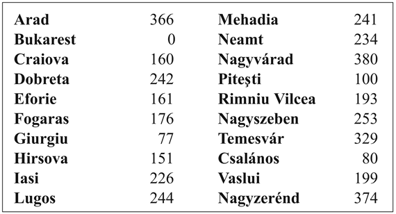
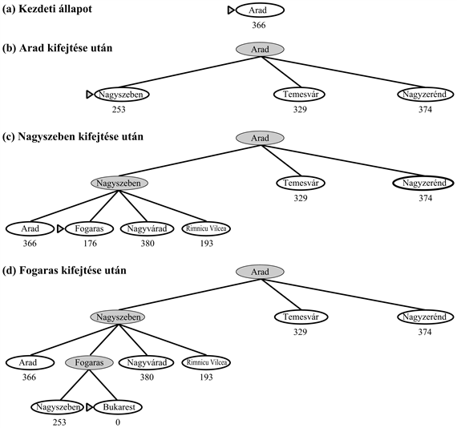
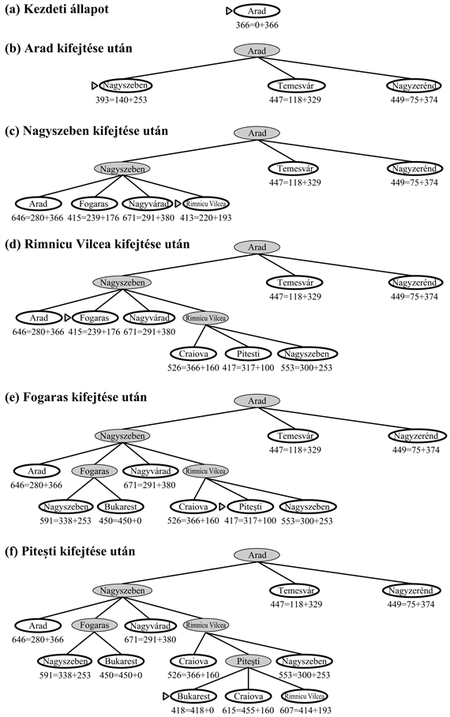
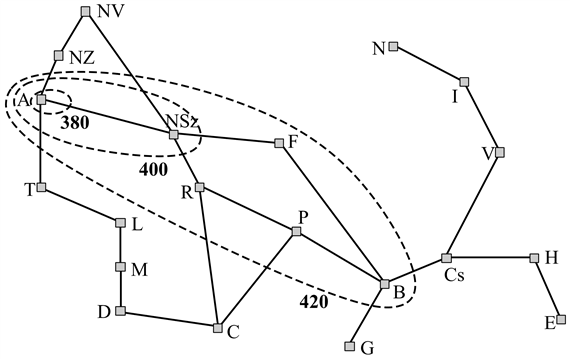
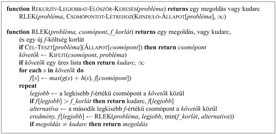

<?xml version="1.0" encoding="UTF-8" standalone="no"?>

<html xmlns="http://www.w3.org/1999/xhtml"><head><meta name="generator" content="DocBook XSL Stylesheets V1.76.1"/></head><body>

<h1 class="title"><a id="id549778"/>4. fejezet - Informált keresési és felfedező módszerek</h1>

<em>Ebben a fejezetben látni fogjuk, hogy az állapottérrel kapcsolatos információ segítségével az algoritmusok hogyan kerülhetik el a sötétben való tapogatózást.</em>

A 3. fejezetben láttuk, hogy a nem informált keresési stratégiák oly módon képesek problémák megoldásait megtalálni, hogy szisztematikusan új állapotokat generálnak és összehasonlítják azokat a célállapottal. Sajnos ezek a stratégiák a legtöbb esetben hihetetlenül rossz hatékonysággal dolgoznak. Ezen fejezet megmutatja, hogy egy – problémaspecifikus tudást alkalmazó – informált keresési stratégia hatékonyabban képes a megoldást megtalálni. A 4.1. alfejezet bemutatja a 3. fejezetben tanulmányozott algoritmusok informált változatait, a 4.2. alfejezet pedig elmagyarázza, hogy a szükséges problémaspecifikus információ hogyan szerezhető meg. A 4.3. és a 4.4. alfejezet olyan algoritmusokkal foglalkozik, amelyek az állapottérben tisztán <strong>lokális keresés</strong>t (<strong>local search</strong>) hajtanak végre, egy vagy több aktuális állapotot értékelve és módosítva ahelyett, hogy szisztematikusan tárnák fel az utat a kezdeti állapottól indulva. Ezek az algoritmusok olyan problémák esetén jók, ahol az útköltség közömbös, és az egyetlen, ami számít, hogy megtaláljuk-e a megoldást. A lokális keresési algoritmusok családjába a statisztikai fizika inspirálta módszerek (<strong>szimulált lehűtés</strong>, <strong>simulated annealing</strong>) és az evolúciós biológia sugallta módszerek (<strong>genetikus algoritmus</strong>ok, <strong>genetic algorithm</strong>s) is beletartoznak. A 4.5. alfejezet végül az <strong>online keresés</strong>sel (<strong>online search</strong>) foglalkozik, ahol az ágens egy teljesen ismeretlen állapottérrel találja magát szembe.

<h1 class="title"><a id="id549826"/>Informált (heurisztikus) keresési stratégiák</h1>

Ez a fejezet megmutatja, hogy az <strong>informált keresés</strong>i (<strong>informed search</strong>) stratégia – amely a probléma definícióján túlmenően problémaspecifikus tudást is felhasznál – hogyan képes hatékonyabban megtalálni a megoldást. 

Az általunk vizsgált általános megközelítést a <strong>legjobbat-először keresés</strong>nek (<strong>best-first search</strong>) nevezzük. A legjobbat-először keresés az általános <code class="code">FA-KERESÉS</code> vagy <code class="code">GRÁF-KERESÉS</code> algoritmusok olyan speciális esete, ahol egy csomópont kifejtésre való kiválasztása egy <em>f</em>(<em>n</em>) <strong>kiértékelő függvény</strong>től (<strong>evaluation function</strong>) függ. Hagyományosan a <em>legkisebb</em> értékű csomópontot választjuk kifejtésre, mert a kiértékelő függvény a céltól való távolságot méri. A legjobbat-először keresés az eddigi általános keresési eljárások keretein belül egy prioritási sor segítségével implementálható, ami egy olyan adatstruktúra, mely a peremet a növekvő <em>f</em>-értékek szerint rendezi.

A legjobbat-először keresés egy nagy múltú, azonban pontatlan elnevezés. Amenynyiben <em>valóban</em> képesek lennénk a legjobb csomópontot kifejteni, akkor egyáltalán nem kellene keresnünk, nyílegyenesen elmasíroznánk a célhoz. Ezzel szemben csak a kiértékelő függvény szerint legjobbnak <em>tűnő</em> csomópontot tudjuk kiválasztani. Ha kiértékelő függvényünk mindentudó, akkor a kiválasztott csomópont egyben a legjobb csomópont is. A valóságban azonban a kiértékelő függvény néha pontatlan, és félrevezetheti a keresést. Azonban a továbbiakban is ragaszkodni fogunk a legjobbat-először keresés elnevezéshez, mert a legjobbnak tűnőt először keresés egy kicsit furcsán hangzana.

A <code class="code">LEGJOBBAT-ELŐSZÖR-KERESÉS</code> algoritmus tulajdonképpen egy keresési algoritmus család, amelynek az elemeit az eltérő kiértékelő függvények[<a id="id549902" href="#ftn.id549902" class="footnote">33</a>] különböztetik meg. Ezeknek az algoritmusoknak a kulcseleme a <em>h</em>(<em>n</em>)-nel jelölt <strong>heurisztikus függvény</strong>[<a id="id549919" href="#ftn.id549919" class="footnote">34</a>] (<strong>heuristic</strong><strong> function</strong>):

<code class="code"><em>h</em>(<em>n</em>) = az <em>n</em> csomóponttól a célig vezető legolcsóbb út becsült útköltsége</code>

Például Romániában az Arad és Bukarest közötti legolcsóbb út költségét az Arad és Bukarest közötti légvonaltávolsággal meg lehetne becsülni.

A heurisztikus függvény a leginkább megszokott módja annak, hogy a problémára vonatkozó pótlólagos tudást a keresési algoritmusba be tudjuk injektálni. A heurisztikus függvényekkel részletesen a 4.2. alfejezetben foglalkozunk. Egyelőre tetszőleges, ám problémaspecifikus függvényeknek fogjuk őket tekinteni, egy kikötéssel: ha <em>n</em> egy célállapot, akkor <em>h</em>(<em>n</em>) = 0. A jelen fejezet hátralévő része két olyan utat mutat be, ahol a heurisztikus információt a keresés irányítására használjuk fel.

<h2 class="title"><a id="id549976"/>A mohó legjobbat-először keresés</h2>

A <strong>mohó legjobbat-először keresés</strong>[<a id="id549985" href="#ftn.id549985" class="footnote">35</a>] (<strong>greedy best-first search</strong>) azt a csomópontot fejti ki a következő lépésben, amelyiknek az állapotát a legközelebbinek ítéli a célállapothoz, abból kiindulva, hogy így gyorsan megtalálja a megoldást. A csomópontokat az algoritmus tehát az <em>f</em>(<em>n</em>) = <em>h</em>(<em>n</em>) heurisztikus függvénnyel értékeli ki.

Nézzük meg, hogy hogyan működik ez a romániai útkeresésnél a <strong>légvonalban mért távolság</strong>ot (<strong>straight-line distance</strong>) felhasználva, amit <em>hLMT</em>-vel fogunk jelölni. Ha a cél Bukarest, szükségünk lesz Bukarest légvonalbeli távolságaira, amelyeket a 4.1. ábra ad meg. Például <em>hLMT</em>(<em>Benn</em>(<em>Arad</em>)) = 366. Vegyük észre, hogy a <em>hLMT</em> értékeit magának a problémának a leírásából kiszámítani nem lehet. Továbbá egy kis tapasztalat is szükséges ahhoz, hogy rájöjjünk, hogy a <em>hLMT</em> az úton megtett tényleges távolsággal korrelál, és így számunkra hasznos heurisztika lehet.

<a id="id550078"/>
<strong>4.1. ábra - A <em>hLMT</em> értékei – a légvonalbeli távolságok Bukarestig</strong>

<a id="ID_138_139_oldal"/>
A 4.2. ábra egy Aradról Bukarestbe vezető út mohó legjobbat-először keresését mutatja, <em>hLMT</em>-t alkalmazva. Aradból az első kifejtett csomópont Nagyszeben, mert ez közelebb van Bukaresthez, mint Nagyzerénd vagy Temesvár. A következő kifejtendő csomópont pedig Fogaras, mert az van a legközelebb. Fogaras majd generálja Bukarestet, ami egyben a célállapot. Erre a konkrét problémára a <em>hLMT </em>-t alkalmazó mohó legjobbat-először keresés úgy talál megoldást, hogy soha sem fejt ki olyan csomópontot, ami nem a megoldási úton fekszik. Következésképpen minimális a keresési költsége. Azonban nem optimális: a Nagyszebenen és Fogarason keresztül Bukarestbe vezető út 32 kilométerrel hosszabb a Rimnicu Vilceán és Piteştin keresztül vezető útnál. Ebből látszik, hogy az algoritmus miért „mohó” – minden lépésben igyekszik annyira közel kerülni a célhoz, ahogy csak lehet.

<a id="id550110"/>
<strong>4.2. ábra - A mohó legjobbat-először keresés lépései Bukarest esetén a légvonalban mért távolságot (<em>hLMT</em>) alkalmazva. A csomópontok a saját <em>h</em>-értékeikkel vannak felcímkézve.</strong>

A <em>h</em>(<em>n</em>) minimalizálása érzékeny a hibás kezdő lépésekre. Tekintsük például azt az esetet, amikor Iaşiról Fogarasra akarunk eljutni. A heurisztika alapján Neamtot kellene először kifejteni, hiszen ez fekszik Fogarashoz a legközelebb, azonban ez zsákutca. A megoldás, hogy először elmegyünk Vasluira – egy olyan lépést teszünk, ami a heurisztika szerint a céltól távolabb visz – és aztán elmegyünk Csalánosra, Bukarestre, majd Fogarasra. Ebben az esetben a heurisztika szükségtelen csomópontok kifejtését eredményezi. Továbbá, ha nem ügyelünk arra, hogy felismerjük az ismétlődő állapotokat, akkor soha nem találjuk meg a megoldást – a keresés Neamt és Iaşi között fog oszcillálni.

A mohó legjobbat-először keresés a mélységi keresésre hasonlít abból a szempontból, hogy egyetlen út végigkövetését preferálja a célig, azonban zsákutcába jutva visszalép. Ugyanazokkal a problémákkal küszködik, mint a mélységi keresés – nem optimális és nem teljes (mert elindulhat egy végtelen úton és soha sem tér vissza újabb lehetőségeket kipróbálni). A mohó keresés legrosszabb esetre számított (worst-case) idő- és tárigénye <em>O</em>(<em>bm</em>), ahol <em>m</em> a keresési tér maximális mélysége. Jól megválasztott heurisztikus függvénnyel a komplexitás azonban jelentősen csökkenthető. A csökkenés mértéke az adott problémától és a heurisztikus függvény minőségétől függ.

<h2 class="title"><a id="id550154"/>A* keresés: a teljes becsült útköltség minimalizálása</h2>

A legjobbat-először keresés leginkább ismert változata az <strong>A* keresés</strong> (a kiejtése ’A csillag’). A csomópontokat úgy értékeli ki, hogy összekombinálja <em>g</em>(<em>n</em>) értékét – az aktuális csomópontig megtett út költsége – és <em>h</em>(<em>n</em>) értékét – vagyis az adott csomóponttól a célhoz vezető út költségének becslőjét:

<code class="code"><em>f</em>(<em>n</em>) = <em>g</em>(<em>n</em>) + <em>h</em>(<em>n</em>)</code>

Mivel <em>g</em>(<em>n</em>) megadja a kiinduló csomóponttól az <em>n</em> csomópontig számított útköltséget, és <em>h</em>(<em>n</em>) az <em>n</em> csomóponttól a célcsomópontba vezető legolcsóbb költségű út költségének becslője, így az alábbi összefüggést kapjuk:

<code class="code"><em>f</em>(<em>n</em>)<em> </em>=<em> </em>a legolcsóbb, az <em>n</em> csomóponton keresztül vezető megoldás becsült költsége.</code>

Így amennyiben a legolcsóbb megoldást keressük, ésszerű először a legkisebb <em>g</em>(<em>n</em>) + <em>h</em>(<em>n</em>) értékkel rendelkező csomópontot kifejteni. Ezen stratégia kellemes tulajdonsága, hogy ez a stratégia több mint ésszerű: amennyiben a <em>h</em> függvény eleget tesz bizonyos feltételeknek, az A* keresés teljes és optimális.

Az A* optimalitását könnyű elemezni, ha az algoritmust a <code class="code">FA-KERESÉS</code>-sel együtt alkalmazzuk. Ilyenkor A* optimális lesz, ha<em> h</em>(<em>n</em>) egy <strong>elfogadható heurisztika</strong> (<strong>admissible heuristic</strong>), azaz ha <em>h</em>(<em>n</em>) <em>soha nem becsüli felül</em> a cél eléréséhez szükséges költséget. Az elfogadható heurisztikák természetükből adódóan optimisták, mivel úgy gondolják, hogy a probléma megoldása kisebb költséggel jár, mint amekkora költséget a megoldás valójában igényel. Mivel <em>g</em>(<em>n</em>) az <em>n</em> csomópont elérésének pontos költsége, azonnali következményként adódik, hogy <em>f</em>(<em>n</em>) soha sem becsüli túl az <em>n</em> csomóponton keresztül vezető legjobb megoldás valódi költségét.
<a id="ID_140_oldal"/>
Az elfogadható heurisztikus függvények talán egyik legnyilvánvalóbb példája a Bukarestbe történő utazás során felhasznált <em>hLMT</em> légvonalban mért távolság. A légvonalban mért távolság elfogadható, mert bármely két pont között a legrövidebb távolság a légvonalban mért távolság, így a légvonalbeli táv soha nem becsülhet túl. A 4.3. ábra a Bukarestet kereső A* fakeresés előrehaladását mutatja. A <em>g </em>értékeket a 3.2. ábrán látható lépésköltségekből számítjuk ki, a <em>hLMT</em> értékei a 4.1. ábrán adottak. 

<h3 class="title">Fontos</h3>
Vegyük észre, hogy Bukarest először az (e) lépés peremében jelent meg, azonban kifejtésre nem került, mert Bukarest <em>f</em>-értéke (450) magasabb, mint Piteştié (417). Ezt úgy lehetne megmagyarázni, hogy <em>lehet</em>, hogy Piteştin keresztül létezik egy 417 költségű olcsó megoldás, így az algoritmus egy 450 költségű megoldást nem fog választani. Ebből a példából megalkothatjuk annak az általános bizonyítását, hogy a <code class="code">FA-KERESÉS</code>-t használó A* algoritmus <em>optimális, ha h</em>(<em>n</em>)<em> elfogadható</em>. Tegyük fel, hogy a peremen egy <em>G</em>2 szuboptimális célcsomópont jelenik meg, és az optimális megoldás költsége legyen C*. Így mivel G2 szuboptimális és h(G2) = 0 (ami minden célállapotra igaz), tudjuk, hogy:

<code class="code">f(G2) = g(G2) + h(G2) = g(G2) &gt; C*</code>

Gondoljunk most egy perembeli <em>n</em> csomópontra, amely a megoldási útvonalon fekszik (ilyennek mindig léteznie kell, ha a megoldás létezik). Ha <em>h</em>(<em>n</em>) nem becsüli túl a megoldáshoz vezető út folytatását, akkor tudjuk, hogy:

<code class="code">f(n) = g(n) + h(n) ≤ C*</code>

Kimutattuk tehát, hogy f(n) ≤ C* &lt; f(G2), így G2 nem kerül kifejtésre, és az A* egy optimális megoldással tér vissza.

A bizonyítás összeomlik, ha a <code class="code">FA-KERESÉS</code> helyett a 3.19. ábra szerinti <code class="code">GRÁF-KERESÉS</code> algoritmust használjuk. Az algoritmus visszatérhet szuboptimális megoldással, mert a <code class="code">GRÁF-KERESÉS</code> algoritmus elvetheti az ismétlődő állapothoz vezető optimális utat, ha az nem elsőnek került kiszámításra (lásd 4.4. feladat). A problémát kétféle módon lehet megoldani. Az első megoldás a <code class="code">GRÁF-KERESÉS</code> olyan kiterjesztése, hogy az az ugyanahhoz a csomóponthoz vezető két út közül a drágábbat fogja elvetni (lásd az értékelést a 3.5. alfejezetben). A pótlólagos adminisztrálás nem egyszerű, de az optimalitást garantálni fogja. A második megoldásnál azt kell biztosítani, hogy a bármelyik ismétlődő csomóponthoz vezető optimális út mindig az, amit az algoritmus elsőnek követ – mint ahogy ez az egyenletes költségű keresésénél volt. Ez a tulajdonság akkor áll fenn, ha a <em>h</em>(<em>n</em>) függvényre extra követelményeket fogalmazunk meg, megkövetelve annak <strong>konzisztenciá</strong>ját (<strong>consistency</strong>), másképpen <strong>monotonitás</strong>át (<strong>monotonicity</strong>). A <em>h</em>(<em>n</em>) heurisztikus függvény konzisztens, ha minden <em>n</em> csomópontra és annak egy tetszőleges <em>a</em> cselekvéssel generált minden <em>n</em>′ utódcsomópontjára az <em>n</em> csomóponttól elért cél becsült költsége nem kisebb, mint az <em>n′ </em>-be kerülés lépésköltsége és az <em>n′</em> csomóponttól elért cél becsült költsége:

<code class="code"><em>h</em>(<em>n</em>) ≤ <em>c</em>(<em>n</em>, <em>a</em>, <em>n′</em>) + <em>h</em>(<em>n</em>′)</code>

Ez az általános <strong>háromszög egyenlőtlenség</strong> (<strong>triangle inequality</strong>) egy formája, amely azt fejezi ki, hogy egy háromszög egy oldala sem lehet hosszabb, mint a két másik oldal összege. Itt a háromszöget az <em>n</em>, az <em>n</em>′ és az <em>n</em>-hez legközebbi cél határozza meg. Könnyű megmutatni (4.7. feladat), hogy minden konzisztens heurisztika egyben elfogadható is. 

<h3 class="title">Fontos</h3>
A konzisztencia legfontosabb következménye az, hogy: <em>a </em><code class="code">GRÁF-KERESÉS</code><em>-t használó A* algoritmus optimális, ha h</em>(<em>n</em>)<em> konzisztens</em>.

<a id="id552612"/>
<strong>4.3. ábra - Az A* keresés lépései Bukarest keresése során. A csomópontok az <em>f</em> = <em>g</em> + <em>h</em> értékekkel vannak felcímkézve. A <em>h</em>-értékek a Bukaresttől légvonalban mért távolságokat jelölik, melyeket a 4.1. ábrából vettünk át.</strong>

<a id="ID_142_oldal"/>
Bár a konzisztencia az elfogadhatóságnál szigorúbb követelmény, igazán nehéz olyan elfogadható heurisztikát találni, ami nem lenne egyben konzisztens. Az ebben a fejezetben tárgyalt összes elfogadható heurisztika mind konzisztens. Vegyük például a <em>hLMT</em>-t. Tudjuk, hogy az általános háromszög egyenlőtlenség teljesül, ha az oldalakat egyenes vonalú távolságokkal mérjük, és hogy az <em>n</em> és <em>n</em>′ közötti egyenesvonalú távolság <em>c</em>(<em>n</em>, <em>a</em>, <em>n</em>′)-nél nem nagyobb. A <em>hLMT</em> így egy konzisztens heurisztika.

<h3 class="title">Fontos</h3>
A konzisztencia egy másik fontos következménye az, hogy <em>ha h</em>(<em>n</em>)<em> konzisztens, akkor az f</em>(<em>n</em>)<em> értékek akármilyen út mentén nem csökkennek</em>. A bizonyítás bizonyos <em>a</em> mellett közvetlenül következik a konzisztencia definíciójából. Tegyük fel, hogy <em>n</em>′ az <em>n</em> utódja, ekkor: 

<code class="code"><em>g</em>(<em>n</em>′) = <em>g</em>(<em>n</em>) + <em>c</em>(<em>n</em>, <em>a</em>, <em>n</em>′)</code>

és

<code class="code"><em>f</em>(<em>n</em>′) = <em>g</em>(<em>n</em>′) + <em>h</em>(<em>n′</em>) = <em>g</em>(<em>n</em>) + <em>c</em>(<em>n</em>, <em>a</em>, <em>n</em>′) + <em>h</em>(<em>n′</em>) ≥ <em>g</em>(<em>n</em>) + <em>h</em>(<em>n</em>) = <em>f </em>(<em>n</em>)</code>

A <code class="code">GRÁF-KERESÉS</code>-t használó A* algoritmus által kifejtett csomópontok sorozata tehát <em>f</em>(<em>n</em>)-ben nem csökkenő. A kifejtésre választott első célcsomópont így egy optimális megoldás is egyben, mert minden utána következő csomópont legalább ilyen költséges lenne.

Ha az <em>f</em>-költségek sohasem csökkenek, bármilyen utat választunk, akkor az állapottérben <strong>határvonal</strong>akat (<strong>contour</strong>) húzhatunk be, hasonlóan egy topografikus térkép kontúrjaihoz. A 4.4. ábra erre mutat egy példát. A 400-zal felcímkézett határvonalon belül az összes csomópont <em>f</em>(<em>n</em>) értéke nem nagyobb 400-nál, és hasonló érvényes a többire is. Mivel az A* keresési algoritmus a legkisebb <em>f</em> értékkel rendelkező levélcsomópontot fejti ki először, láthatjuk, hogy az A* keresési algoritmus a gyökércsomópontból legyezőszerűen halad kifelé, növekvő <em>f</em> értékekhez tartozó koncentrikus sávokban hozzáadva a csomópontokat.

Az egyenletes költségű keresés esetén (A* keresés <em>h </em>= 0 mellett) a csomópontsávok a kiinduló csomópont köré húzott koncentrikus „köröket” alkotnak. Pontosabb heurisztikus függvény alkalmazásával a sávok a célállapot felé elnyúlnak, és keskenyebben fókuszálódnak az optimális út körül. Ha <em>C</em>* az optimális megoldási út költségét jelöli, akkor az alábbiakat jelenthetjük ki:

<ul class="itemizedlist"><li class="listitem">
Az A* keresési algoritmus kifejti az összes <em>f</em>(<em>n</em>)<em> </em>&lt;<em> C</em>*<em> </em>értékkel rendelkező csomópontot.
</li><li class="listitem">
Ezek után az A* keresési algoritmus egy célcsomópont kiválasztása előtt még kifejthet néhány csomópontot a „célhatárvonalon”, amelyekre <em>f</em>(<em>n</em>)<em> </em>=<em> C</em>*.
</li></ul>

Intuitíven nyilvánvaló, hogy az első megtalált megoldásnak optimális megoldásnak kell lennie, hiszen a következő határvonalakon az összes csomóponthoz nagyobb <em>f</em> költség, ebből adódóan nagyobb <em>g</em> költség tartozik (mivel minden célállapotra <em>h</em>(<em>n</em>)<em> </em>=<em> </em>0). Intuitíven az is nyilvánvaló, hogy az A* keresési algoritmus teljes. Ahogy egyre növekvő <em>f</em> értékű sávokat adunk a kereséshez, előbb-utóbb elérünk egy sávot, amelyhez tartozó <em>f</em> érték megegyezik egy célállapothoz vezető út költségével.[<a id="id552976" href="#ftn.id552976" class="footnote">36</a>]

<a id="id552990"/>
<strong>4.4. ábra - Románia térképe. Az ábra Arad mint kiinduló állapot esetén az <em>f</em> = 380, <em>f</em> = 400 és <em>f</em> = 420 értékekhez tartozó határvonalat mutatja. Egy adott határvonalon belüli csomópontokhoz a határvonal értékénél kisebb <em>f</em> költség tartozik.</strong>

Vegyük észre, hogy az A* nem fejt ki <em>f</em>(<em>n</em>) &gt;<em> C</em>* tulajdonságú csomópontokat. A 4.3. ábrán például Temesvár nem kerül kifejtésre annak ellenére, hogy ez a gyökérnek egy utódcsomópontja. Azt mondjuk, hogy a Temesvár alatti fát <strong>lenyestük</strong> (<strong>pruned</strong>). Mivel <em>hLMT</em> elfogadható, az algoritmus biztonságosan figyelmen kívül hagyhat egy ilyen fát, miközben az optimalitást garantálja. A nyesés gondolata – a lehetőségek eliminálása anélkül, hogy megvizsgálnánk azokat – igen fontos az MI sok területén. 

Egy végső észrevétel, az ilyen típusú – a gyökérből kiinduló utakat bővítő – optimális algoritmusok közül az A* keresési algoritmus bármely adott heurisztikus függvény mellett <strong>optimális hatékonyságú</strong> (<strong>optimally efficient</strong>). Ez azt jelenti, hogy egyetlen más optimális algoritmus sem fejt ki garantáltan kevesebb csomópontot, mint az A* (kivéve talán az <em>f</em>(<em>n</em>) = <em>C</em>* típusú csomópontok körét, ahol holtverseny alakulhat ki). Ez azért van, mert az összes olyan algoritmus, amelyik <em>nem</em> fejti ki az összes csomópontot, melyre <em>f</em>(<em>n</em>) &lt; <em>C</em>*, kockáztatja az optimális megoldás elkerülését.

Felettébb örömteli hír számunkra, hogy az A* keresési algoritmus teljes, optimális és az összes ilyen jellegű algoritmus között optimálisan hatékony. Sajnos ez azonban nem jelenti azt, hogy az A* algoritmus megoldja az összes kereséssel kapcsolatos problémánkat. A buktató a dologban az, hogy a legtöbb probléma esetén a csomópontok száma a keresési tér célhatárvonalon belüli részén a megoldás hosszának még mindig exponenciális függvénye. Bár az eredmény bizonyítása túlmutat ezen könyv keretein, megmutatható, hogy az exponenciális növekedéssel mindenképp szembe kell néznünk, kivéve, ha a heurisztikus függvényünk hibája legfeljebb az aktuális útköltség logaritmusával nő. Az exponenciálisnál lassabb növekedés feltétele matematikai megfogalmazásban:

<code class="code">|<em>h</em>(<em>n</em>)<em> – h*</em>(<em>n</em>)| ≤<em> O</em>(log <em>h*</em>(<em>n</em>))</code>

ahol <em>h*</em>(<em>n</em>) az <em>n</em> csomópontból a célcsomópontba való eljutás <em>valódi</em> költségét jelöli. Majdnem minden, a gyakorlatban használt heurisztikus függvény esetén a hiba legalább arányos az útköltséggel, és az ebből adódó exponenciális növekedéssel egyetlen számítógép sem tud megbirkózni. Ezért ahhoz ragaszkodni, hogy egy optimális megoldást találjunk, gyakran nem is praktikus. Használhatjuk az A* olyan változatát, amely a szuboptimális megoldásokat gyorsan megtalálja, vagy pedig dolgozhatunk pontosabb, de nem elfogadható heurisztikákkal. Egy jól megválasztott heurisztikus függvény ettől függetlenül a nem informált keresési algoritmusokhoz képest jelentős megtakarítást eredményezhet. A 4.2. alfejezetben megvizsgáljuk, hogy hogyan is lehet jó heurisztikus függvényt tervezni.

Az A* algoritmusnak azonban nem a szükséges számítási idő a nagy problémája. Mivel az összes legenerált csomópontot a memóriában tárolja (ahogy ezt az összes <code class="code">GRÁF-KERESÉS</code> algoritmus teszi), ezért az algoritmus általában lényegesen hamarabb felemészti a rendelkezésére álló memóriát, mintsem kifutna az időből. Ezért az A* sok nagyméretű problémához nem praktikus. A közelmúltban kifejlesztett algoritmusok a végrehajtási idő kismértékű növekedése mellett a memóriaproblémát megoldották, anélkül hogy feláldoznák az optimalitást vagy a teljességet. Ezekkel az algoritmusokkal fogunk most foglalkozni.

<h2 class="title"><a id="id553177"/>Memóriakorlátozott heurisztikus keresés</h2>

Az A* memóriaigényének mérséklésére a legegyszerűbb módszer az iteratívan mélyülő algoritmus adaptálása heurisztikus keresés környezetre. Ennek eredménye az <strong>iteratívan mélyülő A* algoritmus</strong> – <strong>IMA*</strong> – (<strong>iterative deepening A*</strong>, <strong>IDA*</strong>). Az IMA* és a közönséges iteratívan mélyülő algoritmus közötti fő különbség az, hogy a vágási mechanizmus nem a mélységen, hanem az <em>f </em>költségen (<em>g</em> + <em>h</em>) alapul. Ezáltal minden egyes iterációban a vágási érték az a legkisebb <em>f </em>költség, ami az előbbi iterációban használt vágási értéknél nagyobb. Az IMA* praktikus megoldás számos olyan probléma esetén, ahol egységnyi a lépésköltség és elkerüli a rendezett csomópontsor memóriában való tartásának jelentős overheadjét. Sajnos, az IMA* algoritmus a valós értékű költségektől ugyanúgy szenved, mint az egyenletes költségű keresés iteratív változata, amit a 3.11. feladatban írtunk le. Ebben a fejezetben megvizsgálunk a memóriakorlátozott algoritmusok köréből két frissebb ötletet – az RLEK-t és az MA*-t.

A <strong>rekurzív legjobbat-először keresés</strong>, az <strong>RLEK</strong> (<strong>recursive best-first search</strong>, <strong>RBFS</strong>) egy egyszerű rekurzív algoritmus, amely megkísérli a rendes legjobbat-először algoritmus működését mímelni, de csak lineáris tárat használva. Az algoritmust a 4.5. ábra<em> </em>mutatja. A struktúrája hasonlít a rekurzív mélységi keresésre, azonban ahelyett, hogy az algoritmus egy utat a végtelenségig folytatna az aktuális pálya mentén, figyeli az aktuális csomóponthoz az elődeitől vezető eddigi legjobb alternatív út <em>f</em>-értékét. Ha az aktuális csomópont ezt az értéket túlhaladja, a rekurzió az alternatív útra lép vissza. Ahogy a rekurzió visszalép, az RLEK minden csomópont <em>f</em>-értékét a pálya mentén a gyerekeinek legjobb <em>f</em>-értékével helyettesíti. Ily módon az RLEK emlékszik a legjobb levélértékre az elfelejtett alfában, és eldöntheti, vajon érdemes-e ezt a fát valamikor később újra kifejteni. A 4.6. ábra azt mutatja, hogy hogyan éri el Bukarestet az RLEK.

Az RLEK valamivel hatékonyabb, mint az IMA*, azonban még mindig túlságosan szenved a csomópontok túlzott újbóli generálása miatt. A 4.6. ábrán látható példában az RLEK először a Rimnicu Vilceán átmenő utat követi, majd „meggondolja magát” és Fogarassal kísérletezik, majd újra meggondolja magát. Ezek a meggondolások azért történnek meg, mert amikor az aktuális legjobb utat tovább fejtjük, nagy az esély arra, hogy az <em>f</em>-érték nőni fog – <em>h</em> általában kevésbé optimista a célhoz közeli csomópontok esetén. Amikor ez megtörténik, különösképpen nagy keresési terekben, a második legjobb út a legjobb úttá válhat, és a keresésnek vissza kell lépnie, hogy ezt az utat tudja követni. Minden meggondolás megfelel az IMA* egy-egy iterációjának és az elfelejtett csomópontok számos újbóli kifejtését teszi szükségessé, hogy a keresés képes legyen a legjobb utat visszaállítani, és azt egy csomóponttal meghosszabbítani.

<a id="id553298"/>
<strong>4.5. ábra - A rekurzív legjobbat-először keresés algoritmusa</strong>

Az A*-hoz hasonlóan az RLEK is optimális algoritmus, feltéve, hogy a <em>h</em>(<em>n</em>) heurisztikus függvény elfogadható. Tárkomplexitása <em>O</em>(<em>bd</em>), az időkomplexitását azonban nehezebb meghatározni. Ez függ a heurisztika pontosságától és attól is, mennyire gyakran változik a csomópontok kifejtése közben a legjobb út. Mind az IMA*, mind az RLEK elvileg ki vannak téve a gráfokban való kereséssel kapcsolatos exponenciális komplexitásnövekedésnek (lásd 3.5. alfejezet), tekintettel arra, hogy az ismétlődő állapotok jelenlétét csak az aktuális úton képesek ellenőrizni. Előfordulhat így, hogy ugyanazt az állapotot többször is kifejtik.

Az IMA*-nak és az RLEK-nek az a baja, hogy <em>túl kevés</em> memóriát használ. Az egyes iterációk között az IMA* egyetlen számot, az aktuális <em>f</em>-költség korlátot tárolja el. Az RLEK több információt tárol el a memóriában, azonban csak <em>O</em>(<em>bd</em>) memóriát használ. Még ha több memória is állna a rendelkezésére, az RLEK-nek nincs módja ezt kihasználni.

Ésszerűnek tűnik tehát az összes, rendelkezésre álló memóriát használni. Az erre képes két algoritmus az <strong>MA*</strong> (<strong>memóriakorlátozott A*</strong>) és az <strong>EMA*</strong> (<strong>egyszerűsí</strong><strong>tett MA*</strong>). Itt az EMA*-t írjuk le, ami – mitagadás – az egyszerűbb. Az EMA* az A* módjára halad a legjobb levelet kifejtve, amíg a memória be nem telik. Ezen a ponton a keresési fához új csomópontot hozzáadni nem képes, hacsak egy régit nem töröl ki. Az EMA* mindig a <em>legrosszabb</em> – a legmagasabb <em>f</em>-értékű – csomópontot hagyja ki. Majd, mint az RLEK, az elfelejtett csomópont értékét a szülőjéhez továbbítja. Ily módon egy elfelejtett részfa elődje tudja a részfa legjobb útjának az értékét. Ezzel az információval az EMA* csak akkor fejti ki újra a fát, ha kimutatta, hogy <em>minden más út</em> rosszabbnak tűnik, mint az elfelejtett út. Más szóval, ha az <em>n</em> csomópont minden utódját elfelejtjük, nem tudjuk, hogy <em>n</em>-ből merrefelé lehetne menni, tudni fogjuk azonban, hogy mennyire érdemes egyáltalán bárhová is menni az <em>n</em>-ből kiindulva.

<a id="id553430"/>
<strong>4.6. ábra - Az RLEK lépései, miközben a legrövidebb utat keresi Bukarest felé. A mindenkori rekurzív hívás <em>f</em>-korlát<em> </em>értéke a mindenkori aktuális csomópont felett látható. (a) A Rimnicu Vilceán át vezető utat az algoritmus addig követi, amíg az aktuális legjobb levél (Piteşti) értéke nem lesz rosszabb, mint a legjobb alternatív út értéke (Fogaras). (b) A rekurzió visszalép és az elfelejtett alfa legjobb levélértékét (417) Rimnicu Vilceánál feljegyezzük. Majd Fogaras kifejtése következik 450-nel, mint a legjobb levélértékkel. (c) A rekurzió visszalép. Az elfelejtett alfa legjobb levélértékét (450) Fogarasnál jegyezzük fel. Következik Rimnicu Vilcea kifejtése. Ezúttal, mivel a legjobb alternatív út (Temesváron keresztül) 447-be kerül, a kifejtés folytatódik Bukarest felé.</strong>

A teljes algoritmus túlságosan bonyolult, hogy itt írjunk róla,[<a id="id553450" href="#ftn.id553450" class="footnote">37</a>] azonban egy finom vonását érdemes megemlíteni. Azt mondtuk, hogy az EMA* a legjobb levelet fejti ki és a legrosszabb levelet felejti el. Mi van akkor, ha <em>minden</em> levélnek ugyanaz az <em>f</em>-értéke? Az algoritmus ekkor ugyanazt a csomópontot kifejtésre is, és elhagyásra is kiválaszthatná. Az EMA* ezt a problémát úgy oldja meg, hogy a kifejtésre a <em>legújabb</em> csomópontot választja, és a <em>legrégebbi</em> csomópontot törli. Ez a kettő ugyanaz a csomópont csak akkor lehet, ha csak egy levél van. Ebben az esetben az aktuális keresési fa egyetlen útból áll a gyökértől a levélig, ami kitölti a teljes memóriát. Ha a levél nem egy célcsomópont, akkor<em> még ha a célhoz vezető optimális úton fekszik is</em>, ez a cél az adott memóriával nem érhető el. Következésképpen a csomópontot ugyanúgy el lehet dobni, mintha nem is lenne követője.

Az EMA* teljes, ha van egyáltalán elérhető megoldás – azaz ha <em>D</em>, a legsekélyebb célcsomópont mélysége kevesebb, mint a memória nagysága (csomópontokban kifejezve). Optimális, ha van elérhető optimális megoldás, másképpen az algoritmus a legjobb elérhető megoldással tér vissza. Gyakorlatilag az EMA*-t messze a legjobb általánosan használatos algoritmusnak lehet tekinteni az optimális megoldások megkeresésére, különösképpen ha az állapottér egy gráf, a lépésköltség nem egyenletes, és a csomópontkifejtés drága a nyitott és zárt listák karbantartásának pótlólagos overheadjéhez képest. 

<h3 class="title">Fontos</h3>
Nagyon nehéz problémák esetén azonban az EMA* sokszor kénytelen folyamatosan oda-vissza kapcsolgatni a lehetséges megoldási utak között, amelyekből csak kevés fér be a memóriába (hasonló ez a diszkalapú memória lapozó rendszer <strong>vergődés</strong>i (<strong>thrashing</strong>) problémájára). Az ugyanazon csomópontok ismételt újrakifejtéséhez szükséges extra idő azt jelenti, hogy azok a problémák, amelyeket a végtelen memóriájú A* gyakorlatilag meg tudna oldani, az EMA* számára kezelhetetlenek. Ez azt jelenti, hogy <em>memóriakorlát a problémát a számítási idő szempontjából kezelhetetlenné teheti. </em>Bár a memória és az idő közötti kompromisszum magyarázatára nincs elmélet, úgy tűnik, hogy ettől a problémától megmenekülni nem lehet. Egyetlen kiút elvetni az optimalitás követelményét.

<h2 class="title"><a id="id553522"/>Tanuljunk, hogy jobban keressünk!</h2>

Az eddigiekben néhány rögzített stratégiát mutattunk be – szélességi, mohó legjobbat-először stb. keresés –, amelyeket számítógépes szakemberek terveztek. Meg tudná-e <em>tanulni</em> egy ágens, hogy jobban keressen? A válasz igen, és a módszer alapját egy fontos fogalom, a <strong>metaszintű állapottér</strong> (<strong>metalevel state space</strong>) adja. A metaszintű állapottér minden állapota az <strong>objektumszintű állapottér</strong>beli (<strong>object-level state space</strong>) – amilyen például Románia – keresőprogram egy belső (számítási) állapotának felel meg. Az A* algoritmus belső állapota például az aktuális keresési fa. A metaszintű állapottér minden cselekvése egy számítási lépés, amely a belső állapotot változtatja meg. Az A* esetén például minden számítási lépés kifejt egy levelet, és a követőit a fához adja hozzá. A 4.3. ábra, amely az egyre növekvő keresési fák sorozatát mutatja, értelmezhető lehetne úgy, hogy a metaszintű állapottérben egy utat mutat, ahol az út minden állapota egy objektumszintű keresési fa.

A 4.3. ábrán az út öt lépésből áll, Fogaras kifejtését is beleszámítva, ami nem volt valami hasznos. Nehezebb problémák esetén sok ilyen téves lépésre lehet számítani, és a <strong>metaszintű tanulási algoritmus</strong> (<strong>metalevel learning</strong>) ilyen tapasztalatokból tanulhat, hogy elkerülje a haszontalan részfák kifejtését. Az ilyen tanuláshoz alkalmas módszereket a 21. fejezetben tárgyaljuk. A tanulás célja a problémamegoldás <strong>totális költség</strong>ének (<strong>total cost</strong>) a minimalizálása, kompromisszumot kötve a számítási kiadások és az útköltség között.

 

[<a id="ftn.id549902" href="#id549902" class="para">33</a>]  A 4.3. feladatban azt kérjük Öntől, hogy mutassa ki, hogy ez a család néhány jól ismert nem informált keresést is tartalmaz.

[<a id="ftn.id549919" href="#id549919" class="para">34</a>]  A <em>h</em>(<em>n</em>) heurisztikus függvény bemenete ugyan egy <em>csomópont</em>, a függvény értéke azonban a csomóponthoz tartozó <em>állapottól</em> függ.

[<a id="ftn.id549985" href="#id549985" class="para">35</a>]  A könyv első kiadásában ennek <strong>mohó keresés</strong> (<strong>greedy search</strong>) volt a neve. Más szerzők ezt <strong>legjobbat-először </strong><strong>keresés</strong>nek (<strong>best-first search</strong>) nevezik. A második változat általunk választott általánosabb használata Pearlt (Pearl, 1984) követi.

[<a id="ftn.id552976" href="#id552976" class="para">36</a>]  A teljesség megkívánja, hogy a <em>C</em>* költségnél kisebb vagy azzal egyenlő költségű csomópontokból véges sok legyen. Ez a feltétel akkor lesz igaz, ha minden lépésköltség egy véges ε-nál nagyobb és <em>b</em> véges.

[<a id="ftn.id553450" href="#id553450" class="para">37</a>]  Az algoritmus vázlatos leírása a könyv első kiadásában megtalálható.

</body></html>
