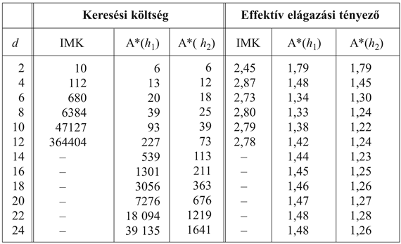

<?xml version="1.0" encoding="UTF-8" standalone="no"?>

<html xmlns="http://www.w3.org/1999/xhtml"><head><meta name="generator" content="DocBook XSL Stylesheets V1.76.1"/></head><body>

<h1 class="title"><a id="id553580"/>Heurisztikus függvények</h1>

Ebben a részben a 8-as kirakójátékhoz keresünk heurisztikus függvényeket, hogy rávilágítsunk a heurisztikus függvények általános természetére.

A 8-as kirakójáték a legrégebbi heurisztikus keresési feladatok egyike. Mint azt a 3.2. alfejezetben láttuk, a játék lényege, hogy a számozott lapkákat vízszintesen és függőlegesen az üres helyre tolva a kiindulóállásból a célállásba jussunk (lásd 4.7. ábra).

Egy átlagos megoldás véletlen módon generált 8-as kirakójáték példányok esetén kb. 22 lépésből áll. Az elágazási tényező nagyjából 3 (amikor az üres lapka középen van, akkor négy, amikor a sarokban van, akkor kettő, és amikor valamelyik szélső középső pozícióban van, akkor pedig három mozgatás lehetséges). Ebből adódóan egy 22 mélységig menő kimerítő keresés közelítőleg 322 ≈ 3,1 × 1010 állapotot vizsgálna meg. Az ismétlődő állapotok nyilvántartásával ezt a számot 170 000-ed részére le lehet csökkenteni, mert csak 9!/2 = 181 440 különböző elérhető elrendezés létezik (lásd 3.4. feladat). Ez egy kezelhető szám, azonban ugyanez a szám a 15-ös kirakójáték esetén már durván 1013, így a következő teendő egy jó heurisztika megkeresése. Amennyiben a legrövidebb megoldásokat akarjuk megtalálni A* bevetésével, olyan heurisztikus függvényre van szükségünk, ami soha sem becsüli túl a célállapot eléréséhez szükséges lépések számát. Az ilyen heurisztikák keresésének a 15-ös kirakójáték esetén nagy a múltja. Íme két lehetséges függvény:

<ul class="itemizedlist"><li class="listitem">
<em>h</em>1<em> = </em>a rossz helyen lévő lapkák száma. A 4.7. ábrán a 8 lapkából egyik sincs a helyén, így a kiinduló állapotban <em>h</em>1 = 8 lenne. <em>h</em>1 elfogadható heurisztikus függvény, mivel nyilvánvaló, hogy minden rossz helyen lévő lapkát legalább egyszer mozgatni kell.
</li><li class="listitem">
<em>h</em>2 = a lapkáknak a saját célhelyeiktől mért távolságaik összege. Mivel a lapkákat nem lehet átlók mentén mozgatni, az általunk kiszámított távolság a vízszintes és függőleges távolságok összege lesz. Ezt néha <strong>háztömb</strong>- (<strong>city block distance</strong>) vagy <strong>Manhattan-távolság</strong>nak (<strong>Manhattan distance</strong>) is szokás nevezni. <em>h</em>2 szintén elfogadható heurisztikus függvény, mivel minden egyes mozgatással egy lapkát csak egy lépéssel lehet közelebb vinni a célhoz. A kiinduló állapotban az 1–8 lapkákra számított Manhattan-távolság:
</li></ul>

<code class="code"><em>h</em>2 = 3 + 1 + 2 + 2 + 2 + 3 + 3 + 2 = 18</code>

Ahogy reméltük, egyik sem becsüli túl a megoldás igazi költségét, ami 26.

<a id="id553679"/>
<strong>4.7. ábra - A 8-as kirakójáték egy tipikus feladata. A megoldás 26 lépés hosszú.</strong>

<h2 class="title"><a id="id553688"/>A heurisztikus függvény pontosságának hatása a megoldás hatékonyságára</h2>

A heurisztikus függvény minősítésének egyik lehetséges módja a <em>b</em>* <strong>effektív elágazási tényező</strong> (<strong>effective branching factor</strong>) megadása. Amennyiben az A* algoritmus által kifejtett összes csomópont száma egy adott problémára <em>N</em>, és a megoldás mélysége <em>d</em>, akkor <em>b</em>* annak a <em>d</em> mélységű kiegyensúlyozott fának az elágazási tényezőjével egyezik meg, amely <em>N </em>+ 1 csomópontot tartalmazna. Ebből adódóan:

<code class="code"><em>N </em>+ 1 = 1 + <em>b</em>* + (<em>b</em>*)2 + … + (<em>b</em>*)d</code>

Például ha az A* algoritmus egy 5 mélységben fekvő megoldást 52 csomópont kifejtésével talál meg, akkor az effektív elágazási tényező 1,92. Az effektív elágazási tényező a problémaesetek függvényében változhat, megfelelően nehéz problémák esetén azonban általában nagyjából állandó. Így a <em>b</em>* kisszámú problémahalmazon végzett kísérleti mérése jó fogódzót adhat a heurisztikus függvény általánosságban vett használhatóságáról. Egy jól megtervezett heurisztikus függvény effektív elágazási tényezője 1 körüli érték, ami lehetővé teszi felettébb nagy problémák megoldását is. 

A <em>h</em>1 és a <em>h</em>2 heurisztikus függvények teszteléséhez véletlenszerűen generáltunk 1200 problémapéldányt, 2–24 mélységű megoldással (100-100 példányt minden páros szám esetére), és megoldottuk azokat a <em>h</em>1 és a <em>h</em>2 heurisztikus függvényeket alkalmazva az A* fakereső algoritmussal, illetve a nem informált iteratívan mélyülő keresési algoritmussal is. A 4.8. ábra minden egyes stratégiára megadja az átlagosan kifejtett csomópontok számát és az effektív elágazási tényezőt. Az eredmények azt mutatják, hogy <em>h</em>2<em> </em>jobb, mint <em>h</em>1, és hogy a nem informált keresés mindkettőnél sokkal rosszabb. A 14 hosszúságú megoldások esetén az A* <em>h</em>2-vel 30 000-szer hatékonyabb, mint a nem informált iteratívan mélyülő keresés.

<a id="id553832"/>
<strong>4.8. ábra - A keresési költség és az effektív elágazási tényező összehasonlítása <code class="code">ITERATÍVAN-MÉLYÜLŐ-KERESÉS</code> és A* esetén <em>h</em>1 és <em>h</em>2 használatával. Az adatokat különböző hosszúságú megoldásokra a 8-as kirakójáték 100 egyedét megoldva átlagolva kaptuk.</strong>

<a id="ID_150_oldal"/>
Feltehetjük magunknak a kérdést, hogy vajon a <em>h</em>2<em> </em>mindig jobb-e, mint a <em>h</em>1? A válasz: igen. A két heurisztikus függvény definíciójából jól látszik, hogy minden <em>n</em> csomópontra <em>h</em>2(<em>n</em>) ≥ <em>h</em>1(<em>n</em>). Azt mondjuk, hogy <em>h</em>2<em> </em><strong>dominál</strong>ja <em>h</em>1-et. A domináció közvetlenül átvihető a hatékonyságra: a <em>h</em>2-t használó A* algoritmus kevesebb csomópontot fog kifejteni, mint a <em>h</em>1-et használó (talán csak az <em>f</em>(<em>n</em>) = <em>C</em>* tulajdonságú néhány csomópontot kivéve). Ezt az alábbi egyszerű gondolatmenettel mutathatjuk meg. Idézzük fel a <a class="xref" href="ch04.md#ID_142_oldal">„A* keresés: a teljes becsült útköltség minimalizálása”</a> részben tett észrevételünket, miszerint minden csomópont kifejtésre kerül, amelyre <em>f</em>(<em>n</em>)<em> </em>&lt;<em> C</em>*. Ezzel egyenértékű az az állítás, mely szerint minden csomópont kifejtésre kerül, amelyre <em>h</em>(<em>n</em>)<em> </em>&lt;<em> C</em>*– <em>g</em>(<em>n</em>)<em>. </em>Mivel azonban <em>h</em>2 minden csomópontra legalább akkora, mint <em>h</em>1, így minden olyan csomópontot, amit kifejt a <em>h</em>2-t alkalmazó A* algoritmus, kifejti a <em>h</em>1-et alkalmazó A* algoritmus is, de <em>h</em>1 alkalmazása más csomópontok kifejtését is okozhatja. Ebből adódóan mindig jobb nagyobb értékeket adó heurisztikus függvényeket alkalmazni, amíg nem becsüljük túl a valódi költséget, és a heurisztika számítási ideje nem túlságosan nagy.

<h2 class="title"><a id="id554034"/>Elfogadható heurisztikus függvények kitalálása</h2>

Láttuk, hogy mind <em>h</em>1 (a nem a helyükön lévő lapkák száma), mind pedig <em>h</em>2 (Manhattan-távolság) egész jó heurisztikus függvények a 8-as kirakójáték problémájához, és hogy <em>h</em>2<em> </em>jobbnak bizonyult. De hogyan is állt elő a <em>h</em>2? Egy számítógép számára vajon lehetséges-e mechanikusan megalkotni ilyen heurisztikus függvényeket?

A <em>h</em>1 és <em>h</em>2 a 8-as kirakójátékban a fennmaradó út hosszát becsülik, azonban a játék <em>egyszerűsített</em> változatánál a tökéletesen pontos úthossz értékét adják meg. Ha a játék szabályait úgy módosítanánk, hogy egy lapka bárhová áthelyezhető legyen, nemcsak a szomszédos mezőkre, akkor <em>h</em>1 pontosan megadná a legrövidebb megoldáshoz vezető lépések számát. Hasonlóan, ha egy lapkát bármelyik szomszédos mezőre átmozgathatnánk, még akkor is, ha az adott mezőn már van egy másik lapka, akkor <em>h</em>2 megadná a legrövidebb megoldás pontos lépésszámát. 

<h3 class="title">Fontos</h3>
Az olyan problémát, amelyben az operátorokra kevesebb megkötést teszünk, mint az eredeti problémában, <strong>relaxált problémá</strong>nak (<strong>relaxed problem</strong>) nevezzük. <em>A relaxált probléma optimális megoldásának költsége egy elfogadható heurisztika az eredeti problémára. </em>A heurisztika elfogadható, mert az eredeti probléma optimális megoldása definíciószerűen megoldása a relaxált problémának is, és így legalább olyan költséges, mint a relaxált probléma optimális megoldása. Mivel a számított heurisztika a relaxált problémára egy pontos költség, teljesítenie kell a háromszög egyenlőtlenséget, és ebből kifolyólag <strong>konzisztens</strong> <a class="xref" href="ch04.md#ID_140_oldal">„A* keresés: a teljes becsült útköltség minimalizálása”</a> részben.

Amennyiben a probléma megfogalmazása formális nyelven adott, akkor a relaxált problémákat automatikusan is elő lehet állítani.[<a id="id554124" href="#ftn.id554124" class="footnote">38</a>] Például ha a 8-as kirakójáték operátorait az alábbi módon írjuk le:

Egy lapka az <em>A</em> mezőről a <em>B</em> mezőre mozgatható,

	ha <em>A</em> és <em>B</em> szomszédosak, és a <em>B</em> mező üres

egy vagy több feltétel törlésével három relaxált problémát hozhatunk létre:

<ol class="orderedlist"><li class="listitem">
Egy lapka az <em>A</em> mezőről a <em>B</em> mezőre mozgatható, ha <em>A</em> és <em>B</em> szomszédosak.
</li><li class="listitem">
Egy lapka az <em>A</em> mezőről a <em>B</em> mezőre mozgatható, ha a <em>B</em> mező üres.
</li><li class="listitem">
Egy lapka az <em>A</em> mezőről a <em>B</em> mezőre mozgatható.
</li></ol>

Az (a)-ból a <em>h</em>2 (Manhattan-távolság) vezethető le. A magyarázat az, hogy <em>h</em>2 helyes eredményt adna, ha minden lapkát sorra elmozgatnánk a saját célhelyére. A (b)-ből származtatott heurisztikával a 4.9. feladatban foglalkozunk. A (c)-ből a <em>h</em>1 (a nem a helyükön lévő lapkák száma) vezethető le, mert ez lenne a helyes eredmény, ha a lapkákat a célpozíciójukba egy lépésben el lehetne mozgatni. Vegyük észre, hogy lényeges, hogy e módszer által generált relaxált problémákat lényegében keresés nélkül meg lehet oldani, mert a relaxált szabályok a probléma 8 független részproblémává történő dekompozícióját teszik lehetővé. Ha a relaxált problémát nehéz megoldani, akkor a kapcsolatos heurisztikus értékek számítása drágának fog bizonyulni.[<a id="id554230" href="#ftn.id554230" class="footnote">39</a>]

Az <code class="code">ABSOLVER</code> nevű program a „relaxált probléma” módszer és más egyéb módszer alkalmazásával (Prieditis, 1993), képes a probléma definíciójából automatikusan heurisztikus függvényeket generálni. Az <code class="code">ABSOLVER</code> egy, az eddigieknél jobb heurisztikus függvényt hozott létre a 8-as kirakójáték megoldására, és ez a program találta meg az első használható heurisztikus függvényt a híres Rubik-kocka kirakásához.

Az új heurisztikus függvények előállításának egyik problémája, hogy felettébb nehéz felismerni a „nyilvánvalóan legjobb” heurisztikus függvényt. Ha egy problémához adottak a <em>h</em>1,<em> </em>...,<em> hm</em> elfogadható heurisztikus függvények, és egyik sem dominálja a többit, melyiket kell választanunk? Mint az majd kiderül, nem kell választanunk. Az alábbi formulával a lehető legjobbat kaphatjuk meg:

<code class="code"><em>h</em>(<em>n</em>) = max{<em>h</em>1(<em>n</em>), ..., <em>hm</em>(<em>n</em>)}</code>

Az így megkonstruált összetett heurisztikus függvény mindig azt a függvényt használja, amelyik az adott csomópontra a legpontosabb. Mivel az alkotóelemként felhasznált heurisztikus függvények mind elfogadhatók, ezért <em>h</em> is elfogadható. Ugyancsak könnyű bizonyítani, hogy <em>h</em> konzisztens. Továbbá <em>h</em> dominálja az összes, benne alkotóelemként felhasznált heurisztikus függvényt.

Elfogadható heurisztikus függvényeket származtathatunk az adott probléma <strong>részproblémá</strong>jának (<strong>subproblem</strong>) megoldási költségéből is. A 4.9. ábra például a 4.7. ábrán látható 8-as kirakójáték egy részproblémáját mutatja. A részprobléma lényege az 1, 2, 3 és 4 lapkák helyükre való mozgatása. Világos, hogy e részprobléma optimális megoldásának költsége a teljes probléma megoldásának költségét alulról korlátozza. Bizonyos esetekben ez a függvény a Manhattan-távolságnál sokkal pontosabb.

A <strong>mintaadatbázis</strong>ok (<strong>pattern database</strong>s) hátterében húzódó ötlet az, hogy tároljuk el az egyes részproblémaesetekhez tartozó pontos megoldási költségeket – ebben az esetben a négy lapka és az üres hely minden konfigurációjához (jegyezzük meg, hogy a másik négy lapka helye a részprobléma megoldása szempontjából közömbös, mozgásaik azonban a költségbe bele fognak számítani). A probléma teljes állapotához tartozó elfogadható <em>hAB</em> heurisztikus függvényt ezek után keresés közben úgy számítjuk ki, hogy a megfelelő részprobléma-konfigurációt az adatbázisból kikeressük. Maga az adatbázis úgy lett megtervezve, hogy a célállapottól visszafelé keresve minden új minta költségét feljegyeztük. Ennek a keresésnek a költsége a sok egymás után jövő problémaesetre kivetítve amortizálódik.

<a id="id554338"/>
<strong>4.9. ábra - A 4.7. ábrán látható 8-as kirakójáték eset egy részproblémája. A feladat az, hogy 1, 2, 3 és 4 lapkát a helyes pozíciókba juttassuk el, nem törődve azzal, hogy a többi lapkával mi fog történni.</strong>

Az 1-2-3-4 lapka megválasztása nyilván tetszőleges, az adatbázist az 5-6-7-8 és a 2-4-6-8 stb. lapkákra is meg tudnánk konstruálni. Minden adatbázis egy elfogadható heurisztikát szolgáltat, és ahogy korábban elmagyaráztuk, ezen heurisztikákat kombinálni lehet, maximális értékükkel számolva. Egy ilyen típusú kombinált heurisztika a Manhattan-távolságnál sokkal pontosabb. A 15-ös kirakójáték véletlenszerűen generált egyedeire a kifejtett csomópontok számát egy 1000-es tényezővel lehet csökkenteni.

El lehetne tűnődni azon, hogy az 1-2-3-4 és az 5-6-7-8 adatbázisokból kinyert heurisztikus függvényeket nem lehetne-e <em>összeadni,</em> mivel úgy tűnik, a két részproblémában nincs fedés. A válasz nemleges, mert egy adott állapotban az 1-2-3-4 és az 5-6-7-8 részproblémák megoldásai majdnem biztosan osztoznak közös lépéseken – igen valószínűtlen, hogy az 1-2-3-4 lapkákat a helyükre el lehet mozdítani, anélkül hogy az 5-6-7-8-hoz ne nyúlnánk hozzá, és <em>fordítva</em>. És mi lenne, ha ezeket a lépéseket nem is számolnák be? Azaz nem az 1-2-3-4 részprobléma teljes költségével számolnánk, hanem csak az 1-2-3-4 lapka lépéseit vennénk figyelembe. Könnyű ilyenkor rájönni, hogy a két költség összege még mindig a teljes probléma megoldási költségének egy alsó korlátja. Ez a <strong>diszjunkt mintaadatbázis</strong> (<strong>disjoint pattern database</strong>) hátterében húzódó ötlet. Az ilyen adatbázisok használatával lehetségessé válik a 15-ös kirakójátékot milliszekundumok alatt megoldani, a Manhattan-távolsághoz képest a generált csomópontok száma egy 10 000-es tényezővel kisebb. A 24-es kirakójáték esetén kb. egymilliós gyorsítást lehet elérni.

A diszjunkt mintaadatbázisok jól működnek a csúszólapka-játékok esetén, mert a problémát úgy lehet felbontani, hogy egy-egy lépés csak egy részproblémára van hatással, hiszen egyszerre csak egy lapkát mozgatunk. A Rubik-kocka problémára ilyen bontást elvégezni nem lehet, mert minden mozgás 8, 9 vagy 26 kockát érint. Nem tudjuk egyelőre, hogy az ilyen problémák számára a diszjunkt mintaadatbázisokat hogyan lehetne definiálni.

<h2 class="title"><a id="id554371"/>A heurisztikus függvény tanulása tapasztalatból</h2>

A <em>h</em>(<em>n</em>) heurisztikus függvénytől elvárjuk, hogy az <em>n</em> csomópontbeli állapottól kezdve becsülje a megoldás költségét. Hogyan lenne képes egy ágens egy ilyen függvény megalkotására? Egy megoldást az előbbi részben adtunk meg – ami nevezetesen egy olyan relaxált problémának a kitalálása, amihez egy optimális megoldást könnyű találni. Egy másik megoldás a tapasztalatból való tanulás. A „tapasztalaton” itt azt értjük, hogy nagyon sok 8-as kirakójátékot kell megoldani. A 8-as játék minden optimális megoldása egy példát jelent, amiből <em>h</em>(<em>n</em>) tanulható. Minden példa egy, a megoldási úton elhelyezkedő állapotból és az onnan számított valós megoldási költségből áll. Ilyen példák alapján <strong>induktív tanulási algoritmus</strong> (<strong>inductive learning</strong>) segítségével egy olyan <em>h</em>(<em>n</em>) függvényt konstruálhatunk, amely (szerencsével) képes megjósolni a megoldás költségét a keresés során felbukkanó más állapotok esetén is. Ennek módszertanát, legyenek ezek neurális hálók, döntési fák vagy más módszerek, a 18. fejezet mutatja be (a 21. fejezetben leírt megerősítéses tanulás szintén alkalmazható).

Az induktív tanulási módszerek akkor működnek a legjobban, ha nem az állapot nyers leírását, hanem inkább az állapot kiértékeléséhez releváns <strong>jellemző</strong>ket (<strong>feature</strong>) kapják bemenetként. A „nem a helyén lévő lapkák száma” jellemző segítség lehet, ha az aktuális állapotnak a céltól vett távolságát szeretnénk megjósolni. Hívjuk ezt a jellemzőt <em>x</em>1(<em>n</em>)-nek. Vehetnénk a 8-as kirakójáték 100 véletlenszerűen generált konfigurációját, és gyűjthetnénk statisztikákat a megoldás aktuális költségéről. Esetleg azt találnánk, hogy ha <em>x</em>1(<em>n</em>) értéke 5, akkor a megoldás átlagos költsége 14 és így tovább. Ilyen adatok birtokában <em>x</em>1(<em>n</em>) értékéből jósolni lehetne <em>h</em>(<em>n</em>) értékét. Persze több jellemzőt is lehetne használni. Egy másik jellemző, <em>x</em>2(<em>n</em>) lehetne például „azon szomszédos lapkapárok száma, melyek a célállapotban is szomszédosak”. Hogyan lehetne <em>x</em>1(<em>n</em>)-et és <em>x</em>2(<em>n</em>)-et összekombinálni <em>h</em>(<em>n</em>) jóslása érdekében? Egy szokásos ötlet a lineáris kombináció használata:

<code class="code"><em>h</em>(<em>n</em>) = <em>c</em>1<em>x</em>1(<em>n</em>) + <em>c</em>2<em>x</em>2(<em>n</em>)</code>

A <em>c</em>1 és <em>c</em>2 konstansokat módosítani lehet, hogy a megoldási költség aktuális adataira legjobban illeszkedjenek. Feltételezhetően <em>c</em>1-nek pozitívnak, <em>c</em>2-nek pedig negatívnak kellene lennie.

 

[<a id="ftn.id554124" href="#id554124" class="para">38</a>]  A 8<em>.</em> és a 11. fejezetben erre a feladatra alkalmas formális nyelveket írunk le. Manipulálható formális leírásokkal a relaxált problémák konstruálása automatizálható. Egyelőre természetes nyelvet használunk.

[<a id="ftn.id554230" href="#id554230" class="para">39</a>]  Vegyük észre, hogy a tökéletes heurisztikát könnyűszerrel megkaphatnánk, ha megengednénk <em>h</em>-nak a teljes szélességi keresés lefuttatását „stikában”. A heurisztikus függvény pontossága és számítási ideje között így kompromisszumot kell kötni.

</body></html>
