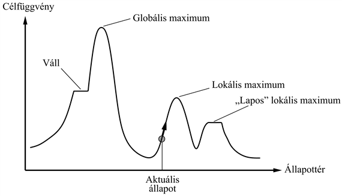
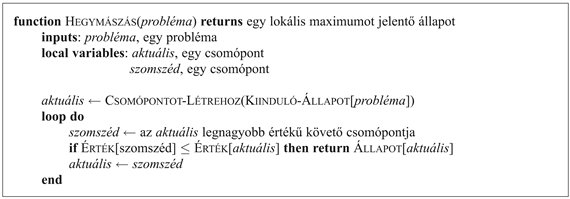
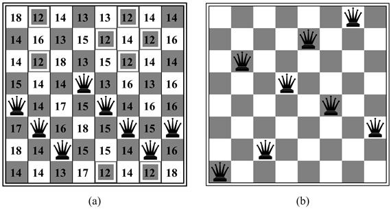
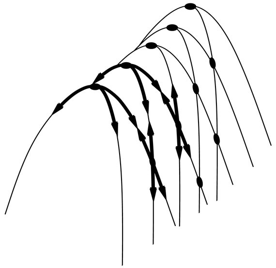
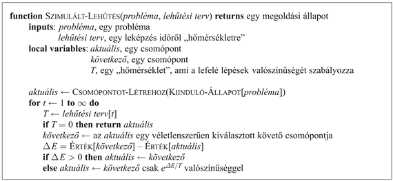
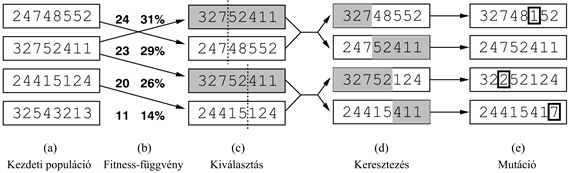
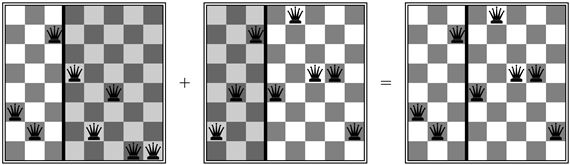
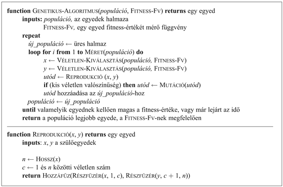

<?xml version="1.0" encoding="UTF-8" standalone="no"?>

<html xmlns="http://www.w3.org/1999/xhtml"><head><meta name="generator" content="DocBook XSL Stylesheets V1.76.1"/></head><body>

<h1 class="title"><a id="id554563"/>Lokális kereső algoritmusok és optimalizációs problémák</h1>

Az eddig látott keresési algoritmusokat arra tervezték, hogy a keresési tereket szisztematikusan tárják fel. A szisztematikusságot úgy érik el, hogy egy vagy több utat tartanak a memóriában, és azt is feljegyzik, hogy minden pontban az út mentén melyik alternatívát vizsgálták már meg, és melyiket nem. Amikor megtalálják a célt, a célhoz vezető <em>út</em> egyben a probléma <em>megoldását</em> is jelenti. 

Számos problémában azonban a célhoz vezető út érdektelen. A 8-királynő problémában például <a class="xref" href="ch03s02.md#ID_104_105_oldal">„Játékproblémák”</a> a királynők végleges konfigurációja számít, és nem az a sorrend, ahogy az újabb királynőket felhelyezzük. A problémák ezen osztályába olyan fontos problémák tartoznak, mint a VLSI-tervezés, a gyári gépelrendezés, a gyártási műveletek ütemezése, az automatikus programozás, a hírközlési hálózatok optimalizálása, a gépkocsiútvonal-tervezés és a portfóliómenedzsment.

Ha a célhoz vezető út nem számít, más algoritmusokra is gondolhatunk, amelyek az utakkal egyáltalán nem foglalkoznak. A <strong>lokális keresési algoritmus</strong>ok (<strong>local search</strong>) csak egy <strong>aktuális állapot</strong>ot (<strong>current state</strong>) vesznek figyelembe (a többszörös utak helyett) és általában csak ennek az állapotnak a szomszédjaira lépnek tovább. A keresés által követett utat tipikusan nem is tárolják el. Bár a lokális keresési algoritmusok nem szisztematikusak, két kulcsfontosságú előnyük van: (1) igen kevés – általában konstans mennyiségű – memóriát használnak, és (2) sokszor nagy vagy végtelen (folytonos) keresési térben elfogadható megoldást produkálnak ott, ahol a szisztematikus algoritmusok alkalmatlanok lennének. 

A cél megfogalmazásán túl, a lokális keresési algoritmusok a tisztán <strong>optimalizációs problémá</strong>k (<strong>optimization problem</strong>s) megoldásában is hasznosak, ahol a cél a legjobb állapot megtalálása egy <strong>célfüggvény</strong> (<strong>objective function</strong>) értelmében. Számos optimalizációs probléma nem felel meg a 3. fejezetben bevezetett „standard” keresési modellnek. Így például a természet előállít egy célfüggvényt – a szaporodási fitnesst – amit úgy tűnik, a darwini evolúció igyekszik optimalizálni, e probléma esetén nem beszélhetünk azonban sem „céltesztről”, sem „útköltségről”. 

A lokális keresés megértéséhez igen hasznosnak találjuk az <strong>állapottérfelszín</strong>t (<strong>state space landscape</strong>) (mint amilyen a 4.10. ábrán látszik). A felszínnek van „pontja” (amit az állapot definiál) és „magassága” (amit a heurisztikus vagy a célfüggvény értéke határoz meg). Ha a magasság a költséggel arányos, akkor a cél a legalacsonyabban fekvő völgyet – a <strong>globális minimum</strong>ot – megtalálni. Ha a magasság a célfüggvénynek felel meg, akkor a cél a legmagasabb csúcs – a <strong>globális maximum</strong> – megtalálása (az egyikről a másikra előjel váltásával könnyen áttérhetünk). A lokális keresés ezt a felületet vizsgálja. Egy <strong>teljes</strong> lokális keresés mindig talál megoldást, ha az egyáltalán létezik. Egy <strong>optimális</strong> algoritmus mindig megtalálja a globális minimumot vagy maximumot.

<a id="id554658"/>
<strong>4.10. ábra - Egy egydimenziós állapottérfelszín, ahol a magasság a célfüggvénynek felel meg. A cél a globális maximum megtalálása. A hegymászó keresés az aktuális állapotot módosítja a javulás irányában, ahogy ezt a nyíl is mutatja. A különböző topografikus jellemzőkkel a szövegben foglalkozunk.</strong>

<h2 class="title"><a id="id554668"/>Hegymászó keresés</h2>

<a id="ID_155_oldal"/>
A <strong>hegymászó keresési algoritmus</strong>t (<strong>hill-climbing</strong>) a 4.11. ábra mutatja. A keresés egyszerűen csak egy ciklus, ami mindig javuló értékek felé – azaz felfelé – lép. Az algoritmus megáll, amikor felér a csúcsra, ahol nincsenek már magasabb értékű szomszédjai. Az algoritmus nem tart nyilván keresési fát, ezért a csomópontot leíró adatszerkezetnek csak az állapotot és a célfüggvény értékét kell nyilvántartania. A hegymászó keresés nem néz előre az aktuális állapotot közvetlenül követő szomszédokon túl. Egy kicsit arra hasonlít, mintha a Mount Everest csúcsát szeretnénk megtalálni sűrű ködben és emlékezetkihagyásban szenvedve. 

<a id="id556952"/>
<strong>4.11. ábra - A hegymászó keresési algoritmus (a legmeredekebb emelkedő (steepest ascent) változat) a lokális keresés alapvető módszere. Minden lépésben az aktuális csomópontot a legjobb szomszédjával cseréli le, ami ebben a változatban a legmagasabb <code class="code">ÉRTÉK</code>-ű szomszédot jelenti. Ha azonban egy <em>h</em> heurisztikus költségbecslést alkalmazunk, ez akkor a legalacsonyabb <em>h</em>-jú szomszéd lenne.</strong>

A hegymászó keresés illusztrálására a <a class="xref" href="ch03s02.md#ID_104_oldal">„Játékproblémák”</a> bevezetett <strong>8-királynő problémá</strong>t (<strong>8-queens problem</strong>) fogjuk használni. A lokális keresési algoritmusok tipikusan a <strong>teljes állapot leírás</strong>sal (<strong>complete-state formulation</strong>) élnek, ahol minden állapotban a táblán 8 királynő helyezkedik el, oszloponként egy. Az állapotátmenet-függvény minden olyan lehetséges állapotot visszaad, amit úgy kapunk, hogy egy királynőt ugyanabban az oszlopban egy másik mezőre mozgatunk (így minden állapotnak 8 × 7 = 56 követője van). A <em>h</em> heurisztikus függvény a közvetlenül vagy közvetett módon egymást támadó királynőpárok száma. E függvény globális minimuma 0, ami csak a tökéletes megoldásban érhető el. A 4.12. (a) ábra egy <em>h</em> = 17 értékű állapotot mutat. Az ábra az összes követőnek az értékét is mutatja, ahol a legjobb követőé <em>h</em> = 12. Ha a legjobból több van, a hegymászó algoritmusok tipikusan véletlen módon sorsolnak belőlük egyet.

A hegymászó keresést néha <strong>mohó lokális keresés</strong>nek (<strong>greedy local search</strong>) is hívják, mert egy jó követő állapotot megragad, anélkül hogy megfontolná, merre lenne érdemes továbbmenni. Bár a mohóság a hét főbűn egyike, a mohó algoritmusok sokszor igen jól teljesítenek. A hegymászás gyakran igen gyorsan halad a megoldás felé, mert egy rossz állapoton általában nagyon könnyű javítani. Így például a 4.12. (a) ábrán látható állapotból indulva öt lépés elegendő, hogy elérjük a 4.12. (b) ábrán látható állapotot, melynek költsége <em>h</em> = 1, és amely igen közel van egy megoldáshoz. Sajnos a hegymászás gyakran megakad az alábbi problémák miatt:

<a id="id557034"/>
<strong>4.12. ábra - (a) A 8-királynő probléma <em>h</em> = 17 heurisztikus költségbecslésű állapota, ahol minden olyan követő állapot <em>h</em> értékét megadtuk, amikor a királynőt a saját oszlopában mozgatjuk. A legjobb lépéseket bejelöltük. (b) Egy lokális minimum a 8-királynő térben. Az állapot <em>h</em> értéke egységnyi, azonban minden követőnek magasabb a költsége.</strong>

<ul class="itemizedlist"><li class="listitem">
<strong>Lokális maximum</strong>ok: egy lokális maximum egy csúcs, amely minden szomszédjánál magasabb, de a globális maximumnál alacsonyabb. A hegymászó algoritmusok, ha egy lokális maximum közelébe érnek, kénytelenek a csúcs felé tartani, ott azonban nincs tovább, és megakadnak. Ezt a problémát sematikusan a 4.10. ábra mutatja. Konkrétabban, a 4.12. (b) ábra állapota egy tényleges lokális maximum (azaz egy lokális minimum a <em>h</em> költségre nézve), bármely királynő bármilyen lépése csak ront a helyzeten.
</li><li class="listitem">
<strong>Hegygerinc</strong>ek (<strong>ridge</strong>s): egy hegygerincet a 4.13. ábra mutat. A hegygerinc egy olyan lokális maximum sorozatot eredményez, ahol egy mohó algoritmusnak igen nehéz navigálnia. 
</li><li class="listitem">
<strong>Fennsík</strong> (<strong>plateaux</strong>): a fennsík az állapottérnek egy olyan területe, ahol a kiértékelő függvény gyakorlatilag lapos. Lehet ez egy lapos lokális maximum, amelyből nincs tovább felfelé, de lehet egy <strong>váll</strong> (<strong>shoulder</strong>), ahonnan még lehetséges az előrehaladás (lásd 4.10. ábra). Egy hegymászó keresés képtelen lehet arra, hogy egy fennsíkról megtalálja a kivezető utat.
</li></ul>

Az algoritmus minden esetben elér egy pontot, ahonnan már nem tud továbblépni. Egy véletűlen módon generált 8-királynő állapotból kiindulva a legmeredekebb emelkedő hegymászó algoritmus az esetek 86%-ában megakad, a problémaeseteknek csupán 14%-át oldja meg. Az algoritmus gyorsan dolgozik, átlagosan 4 lépést tesz, amikor sikerrel jár, és 3 lépést, amikor megakad. Ez egyáltalán nem is olyan rossz a 88 ≈ 17 millió állapotot tartalmazó állapottérben.

A 4.11. ábra algoritmusa megáll, ha fennsíkra ér, ahol a legjobb követőnek is ugyanaz az értéke, mint az aktuális állapotnak. Nem lenne-e jó ötlet mozgásban maradni – <strong>oldallépések</strong>et (<strong>sideways move</strong>) megengedve annak reményében, hogy a fennsík igazából egy váll, mint amilyent a 4.10. ábra mutat? A válasz általában igen, azonban óvatosan kell eljárnunk. Ha oldallépéseket mindig megengedünk, akkor ha felfelé haladás nincs, végtelen hurokba kerülünk minden olyan esetben, amikor az algoritmus olyan lapos lokális maximumot talál, amely nem váll. Gyakori megoldás az egymás után alkalmazott oldallépések számát korlátozni. A 8-királynő problémában például megengedünk 100 egymás utáni oldallépést. Ezzel a hegymászás által megoldott esetek arányát 14%-ról 94%-ra emelhetjük. A sikernek azonban ára van. Átlagosan 21 lépés hosszú minden sikerrel megoldott eset, és 64 lépés hosszú a kudarc.

<a id="id557126"/>
<strong>4.13. ábra - Annak illusztrálása, hogy a gerinc miért jelent nehézséget a hegymászó keresés számára. Az állapotok rácshálózata (sötét körök) rá van illesztve a balról jobbra emelkedő gerincre, egy olyan lokális maximum sorozatot eredményezve, ahol a maximumok nincsenek közvetlen módon egymással összekapcsolva. Minden egyes lokális maximumból az összes lehetséges cselekvés a lejtőn lefelé mutat.</strong>

A hegymászó algoritmus számos változatát fejlesztették ki. A <strong>sztochasztikus hegym</strong><strong>ászó keresés</strong> (<strong>stochastic hill climbing</strong>) a felfelé mutató irányokból véletlen módon választ. A választás valószínűsége a felfelé mutató irány meredekségével változhat. Az algoritmus általában a legmeredekebb emelkedő módszernél lassabban konvergál, egyes állapotfelszíneken azonban képes jobb megoldást találni. Az <strong>elsőnek-választott hegymászó algoritmus</strong> (<strong>first-choice hill climbing</strong>) sztochasztikus hegymászó keresést használ, a követőket véletlen módon addig generálva, amíg az az aktuális állapotnál nem lesz jobb. Ez jó stratégia, ha egy állapotnak sok (például több ezer) követője van. Ennek vizsgálatára invitál a 4.16. feladat.

Az eddig leírt hegymászó algoritmusok nem teljesek – sokszor kudarcot vallanak a cél megkeresésében, mert egy lokális maximumba beragadnak. A <strong>véletlen újraindítású hegymászás</strong> (<strong>random-restart hill-climbing</strong>) az ismert közmondás szerint jár el: „Ha nem megy elsőre, csináld újra.” Véletlenül generált kiinduló állapotokból[<a id="id557172" href="#ftn.id557172" class="footnote">40</a>] hegymászó keresést végez, amíg célba nem ér. Az algoritmus 1-hez tartó valószínűséggel teljes annál a triviális oknál fogva, hogy előbb-utóbb a célállapotot kezdőállapotként is fogja generálni. Ha minden hegymászó keresés <em>p</em> valószínűséggel sikeres, a véletlen újraindítások várható száma 1/<em>p</em>. A 8-királynő problémában, ha oldallépéseket nem engedünk meg, <em>p</em> ≈ 0,14, így a cél megtalálásához átlagosan 7 iterációra van szükség (6 kudarc és 1 siker). A várható lépésszám a sikeres iteráció költsége valamint (1 – <em>p</em>)/<em>p</em>-szerese a kudarc költségének, durván 22 lépés. Ha oldallépéseket is engedünk, átlagosan 1/0,94 ≈ 1,06 iterációra és (1 × 21) + (0,06/0,94) × 64 ≈ 25 lépésre van szükség. A 8-királynő probléma számára a véletlen újraindítású hegymászó keresés valóban hatékony. Még hárommillió királynő mellett is ez a megközelítés egy percen belül talál megoldást.[<a id="id557196" href="#ftn.id557196" class="footnote">41</a>]

A hegymászás sikere nagyban függ az állapottér „felszínének” alakjától: ha azon csak néhány lokális maximum és fennsík található, akkor a véletlen újraindítású hegymászó algoritmus gyorsan meg fog találni egy jó megoldást. Egy valódi problémához egy olyan felszín tartozik, ami leginkább egy sündisznócsaládhoz hasonlít egy sima padlón, ahol minden sündisznótüske csúcsát egy további miniatűr sündisznó lakja és így a <em>végtelenségig</em>. Ha a probléma NP-teljes, akkor minden bizonnyal exponenciálisan sok lokális maximummal rendelkezik, melyekben beragadhatunk. Ennek ellenére általában kisszámú újraindítás után már elfogadhatóan jó megoldást lehet találni.

<h2 class="title"><a id="id557207"/>Szimulált lehűtés</h2>

<a id="ID_158_oldal"/>
A hegymászó keresés, amely soha nem indul „lefelé a lejtőn” a kisebb értékű (vagy nagyobb költségű) állapotok felé, garantáltan nem teljes, mert egy lokális maximumban beragadhat. Ezzel ellentétben a tisztán véletlen vándorlás – azaz a követők halmazából egyenletesen véletlen módon sorsolt követőre való átlépés – teljes, de hihetetlenül nem hatékony. Értelmes dolognak tűnik a hegymászás és a véletlen vándorlás valamiféle ötvözése, hogy mind a teljességet, mind a hatékonyságot megtarthassuk. Egy ilyen algoritmus a <strong>szimulált lehűtés</strong> (<strong>simulated annealing</strong>). A kohászatban a <strong>lehűtés</strong> (<strong>annealing</strong>) a fémeket, illetve az üveget edző, keményítő folyamat, amikor azokat magas hőmérsékletre felmelegítjük, majd fokozatosan lehűtjük, lehetővé téve, hogy az anyag alacsony energiájú kristályos állapotba kerüljön. Hogy a szimulált lehűtést megértsük, a hegymászásról térjünk át a <strong>gradiens leereszkedés</strong>re (<strong>gradient descent</strong>) (azaz a költség minimalizálására), és képzeljük el, hogy az a feladatunk, hogy egy hepehupás asztalon egy pingponglabdát a legmélyebb szakadékba juttassunk. Ha a labdát gurulni hagyjuk, egy lokális minimumba kerül. Ha a felületet megrázzuk, a labdát kiugraszthatjuk a lokális minimumból. A trükk az, hogy olyan erősen kell megrázni a felületet, hogy a labda a lokális minimumból kikerüljön, de mégsem annyira erősen, hogy a labda a globális minimumból kiugorjon. A szimulált lehűtés olyan megoldás, hogy először erősen rázunk (azaz egy magas hőmérsékleten), majd fokozatosan csökkentjük a rázás intenzitását (vagyis csökkentjük a hőmérsékletet).

A szimulált lehűtés legbelső ciklusa (lásd 4.14. ábra) nagyon hasonlít a hegymászáshoz. A <em>legjobb</em> lépés megtétele helyett azonban egy <em>véletlen </em>lépést tesz. Ha a lépés javítja a helyzetet, akkor az mindig végrehajtásra kerül. Ellenkező esetben az algoritmus a lépést csak valamilyen 1-nél kisebb valószínűséggel teszi meg. A valószínűség exponenciálisan csökken a lépés „rosszaságával” – azzal a Δ<em>E</em> mennyiséggel, amivel a kiértékelő függvény értéke romlott. A valószínűség a <em>T</em> „hőmérséklet” csökkenésével is csökken. A „rossz” lépések az indulásnál <em>T</em> magasabb értékeinél valószínűbbek, <em>T</em> csökkenésével egyre valószínűtlenebbé válnak. Be lehet bizonyítani, hogy ha a <em>hűtési karakterisztika</em> <em>T</em> értékeit kellően lassan csökkenti, az algoritmus 1-hez tartó valószínűséggel a globális minimumban köt ki.

<a id="id557276"/>
<strong>4.14. ábra - A szimulált lehűtés keresési algoritmus. A hegymászó keresés egy olyan változata, ahol lefelé tartó lépések is megengedettek. A lefelé tartó lépéseket a lehűtési terv elején inkább, az idő múlásával egyre kevésbé fogadjuk el. A <em>lehűtési terv</em>, mint az eljárás bemenete, a <em>T</em> értékeit mint időfüggvényt adja meg.</strong>

A szimulált lehűtési algoritmust először elterjedten VLSI-elrendezési problémák megoldására használták a ’80-as évek elején. Azóta széles körben alkalmazzák ipari termelés ütemezésére és egyéb nagy volumenű optimalizációs feladatokra. A 4.16. feladat a szimulált lehűtési algoritmus és a véletlen újraindítású hegymászó algoritmus teljesítményének összehasonlítását kéri az <em>n</em>-királynő problémán.

<h2 class="title"><a id="id557298"/>Lokális nyaláb keresés</h2>

Mindössze egyetlen csomópontot tartani a memóriában eléggé extrém reagálásnak tűnik a memóriakorlát problémájára. A <strong>lokális nyaláb keresés</strong> (<strong>local beam search</strong>) algoritmus[<a id="id557314" href="#ftn.id557314" class="footnote">42</a>] nem egy, hanem <em>k</em> állapotot követ nyomon. Az algoritmus <em>k</em> véletlen módon generált állapottal indul. Minden lépésben a <em>k</em> állapot mindegyikének összes követőit kifejti. Ha ezek valamelyike egy cél, az algoritmus leáll. Egyébként a teljes listából kiválasztja a legjobb <em>k</em> követőt, és ezt az eljárást ismétli.

<h3 class="title">Fontos</h3>
Első látásra a <em>k</em> állapotú lokális nyaláb keresés nem tűnik másnak, mint a <em>k</em> véletlen újraindítás parallel futtatása a szekvenciális futtatás helyett. Valójában a két algoritmus igen különböző. A véletlen újraindítású algoritmusban minden keresési folyamat a többitől függetlenül fut le. <em>A lokális nyaláb keresési algoritmusban a </em>k<em> parallel keresési szál megosztja az információt</em>. Például ha az egyik állapot számos jó követőt generál, és a többi <em>k </em>– 1 mind rosszabbat, akkor az eredmény az, mintha az első állapot megüzenné a többinek: „Gyertek át ide, itt zöldebb a fű!” Az algoritmus gyorsan abbahagyja az eredménytelen kereséseket, és az erőforrásait oda viszi, ahol a legnagyobb előrehaladás érzékelhető.

A lokális nyaláb keresés a legegyszerűbb formájában a <em>k</em> állapot közötti változatosság hiányától szenvedhet. Az állapotok gyorsan koncentrálódhatnak a tér egy kicsi részében, amitől a keresés csak kevéssel lesz több, mint a hegymászó keresés egy drága változata. A problémát a <strong>sztochasztikus nyaláb keresés</strong> (<strong>stochastic beam search</strong>) segíti megoldani, ami analóg a sztochasztikus hegymászó kereséssel. A <em>k</em> legjobb követő megválasztása helyett az algoritmus a <em>k</em> követőt véletlen módon választja ki, ahol egy adott követő kiválasztásának valószínűsége az állapot értékének növekvő függvénye. A sztochasztikus nyalábkeresés egy kicsit hasonlít a természetes kiválasztódásra, ahol egy „állapot” (szervezet) „követői” (utódjai) a következő generációt az állapot „értéke” (fitness) alapján népesítik be.

<h2 class="title"><a id="id557390"/>Genetikus algoritmusok</h2>

A <strong>genetikus algoritmus</strong>, <strong>GA</strong> (<strong>genetic algorithm</strong>) a sztochasztikus nyaláb keresés egy olyan variánsa, ahol a követő állapotokat nem egy állapot módosításával, hanem <em>két</em> szülő állapot összekombinálásával állítjuk elő. A természetes kiválasztódás analógiája itt is ugyanaz, mint a sztochasztikus nyaláb keresés esetén, azzal a különbséggel, hogy most az utódlétrehozásnak a szexuális és nem az aszexuális mechanizmusáról van szó. 

A nyalábkereséshez hasonlóan, a GA is <em>k</em> véletlen módon generált állapottal indul, aminek <strong>populáció</strong> (<strong>population</strong>) a neve. Minden állapotot vagy <strong>egyed</strong>et (<strong>individual</strong>) egy véges ábécé fölött értelmezett füzér képvisel – leggyakrabban egy 0-ból és 1-ekből álló füzér. A 8-királynő állapotnak például a 8 királynő pozícióját kell specifikálnia, mindegyik egy 8 négyzetet tartalmazó oszlopban, így 8 × log28 = 24 bitre van szükség. Az állapotot 8 számjeggyel is lehetne jellemezni, melyek mindegyike az 1 − 8 tartományból való (később látni fogjuk, hogy a két kódolás viselkedése eltérő). A 4.15. (a) ábra egy olyan populációt mutat be, mely négy, a 8-királynő állapotait reprezentáló 8 számjegyes füzérből áll.

<a id="id557442"/>
<strong>4.15. ábra - A genetikus algoritmus. Az (a)-beli kezdeti populációt (b)-ben fitness-függvény alapján rangsoroljuk, aminek eredményét a (c)-ben látható reprodukáló párok adják. A létrehozott utódok a (d)-ben láthatók, melyekre még hat a mutáció (e).</strong>

Az állapotok következő generációjának az előállítása a 4.15. (a)–(e) ábrán követhető. A (b)-ben minden állapotot a kiértékelő függvény vagy (GA-terminológiában) a <strong>fitness-függvény</strong> (<strong>fitness function</strong>) alapján rangsoroljuk. Egy fitness-függvénynek a jobb állapotokra magasabb értékeket kell visszaadnia, így a 8-királynő problémában fitness-függvényként a <em>nemtámadó</em> királynőpárok számát használjuk. Ennek értéke egy megoldás esetén 28. A négy állapot értéke 24, 23, 20 és 11. A genetikus algoritmus e konkrét változatában a szaporodásra való kiválasztás valószínűsége a fitness-értékkel egyenesen arányos. A százalékos mennyiségeket a fitness-értékek mellett adjuk meg.

A (c)-ben két párt véletlenszerűen választunk ki reprodukcióra, a (b)-beli valószínűségeknek megfelelően. Figyeljük meg, hogy egy egyedet kétszer, egy másikat viszont egyszer sem választottunk ki.[<a id="id557470" href="#ftn.id557470" class="footnote">43</a>] Minden keresztezendő párnál egy <strong>keresztezés</strong>i (<strong>crossover</strong>) pontot választunk a füzérbeli pozíciók közül. A 4.15. ábrán a kereszteződési pontok az első párnál a harmadik számjegy után, a második párnál az ötödik számjegy után vannak.[<a id="id557495" href="#ftn.id557495" class="footnote">44</a>]

<a id="id557500"/>
<strong>4.16. ábra - A 4.15. (c) ábrán látható első két szülőnek és a 4.15. (d) ábrán látható két utódnak megfelelő 8-királynő állapotok. Az árnyalt oszlopok a kereszteződés során elvesznek, a nem árnyalt oszlopok megmaradnak.</strong>

A (d)-ben az utódok generálását látjuk, a szülő füzéreket a keresztezési pontoknál keresztezve. Az első pár első gyereke például az első szülőtől az első három számjegyét kapja és a másik szülőtől a többit. A második gyerek pedig az első három számjegyét a második szülőtől kapja és az első szülőtől a többit. Az ennél a reprodukciós lépésnél szereplő 8-királynő állapotokat a 4.16. ábra mutatja. A példa azt a tényt szemlélteti, hogy ha a két szülő állapot igen különböző, a keresztezés eredménye mindkét szülőtől igen távol eshet. Sokszor előfordul, hogy a keresési folyamat elején a populáció eléggé változatos, és a keresztezés (a szimulált lehűtéshez hasonlóan) nagy léptekkel halad előre, majd később, ha az egyedek többsége már igen hasonlít egymásra, kisebb lépések jönnek.

Végül az (e)-ben a füzér minden elemét valamilyen kis független valószínűséggel <strong>mutáció</strong>nak (<strong>mutation</strong>) vetjük alá. Az első, a harmadik és az ötödik utódban egy-egy számjegyet mutáltunk. A 8-királynő problémában ez annak felel meg, hogy egy királynőt véletlen módon kiválasztunk, és egy, az oszlopban szintén véletlen módon kiválasztott mezőre áthelyezünk. Az ezeket a lépéseket implementáló algoritmust a 4.17. ábra mutatja.

<a id="id557524"/>
<strong>4.17. ábra - Egy genetikus algoritmus. Ez az algoritmus ugyanaz, mint amelyet a 4.15. ábrán mutattunk, egy kivétellel. Ebben a jobban elterjedt változatban a két szülő reprodukciója nem két, hanem csak egy utódot hoz létre.</strong>

A sztochasztikus nyaláb kereséshez hasonlóan a genetikus algoritmus is kombinálja a hegymászó tendenciát, a véletlen feltárást és a parallel keresési szálak közötti információcserét. A genetikus algoritmus elsődleges előnye, ha ilyen egyáltalán létezik, a keresztezéstől származik. Matematikailag azonban kimutatható, hogy ha kezdetben a genetikus kód pozícióit véletlen sorrendben permutáljuk, a keresztezés semmilyen előnyt nem jelent. Intuitíve, az előny a keresztezés azon képességéből jön, hogy a keresztezés képes hasznos funkciókat teljesítő nagy betűblokkok kombinálására, melyek egymástól függetlenül alakultak ki, emelve ezzel a keresésnél a granuláltság szintjét. Az első három királynőt például a 2, 4 és 6 pozícióba helyezve (ahol nem támadják egymást), egy hasznos blokk alakul ki, amit más blokkokkal kombinálva egy megoldás nyerhető.

Ennek működését a genetikus algoritmusok elmélete a <strong>séma</strong> (<strong>schema</strong>) fogalommal magyarázza. A séma egy olyan részfüzér, amelyben bizonyos pozíciók nem specifikáltak. Így például a 246***** séma az összes olyan 8-királynő állapotot leírja, ahol az első három királynő a 2., 4. és 6. pozícióban van. A sémára illeszkedő füzérek, mint például a 24613578 füzér, a séma <strong>példány</strong>ai (<strong>instance</strong>s). Kimutatható, hogy ha egy séma példányainak átlagos fitness-értéke az átlag felett van, akkor idővel a populációban a sémához tartozó példányok száma nőni fog. Világos, hogy ez a hatás elenyésző lesz, ha a szomszédos biteknek semmi közük egymáshoz, mert kevés olyan tömör blokk lesz, ami konzisztens módon előnyt fog jelenteni. A genetikus algoritmus a legjobban akkor működik, ha a sémák a megoldás értelmes komponenseinek felelnek meg. Ha például a füzér egy antenna reprezentációja, akkor a sémák képviselhetik az antenna egyes komponenseit, például a reflektorokat és a deflektorokat. Egy jó komponensnek nagy valószínűséggel különböző konstrukciók sokaságában is jónak kell lennie. Ez azt sugallja, hogy a genetikus algoritmusok sikeres alkalmazása a reprezentáció gondos kialakítását igényli.

A gyakorlatban a genetikus algoritmusoknak nagy hatása volt az olyan optimalizációs problémákra, mint például az áramkör elrendezéstervezés és a gyártósor-ütemezés. Jelenleg nem világos, hogy a genetikus algoritmusok vonzereje a hatékonyságuk vagy az evolúció elméletében rejlő esztétikus eredetük eredménye. Sok munka van még hátra, hogy azokat a körülményeket azonosítsuk, amikor a genetikus algoritmusok igazán jól teljesítenek.

 

[<a id="ftn.id557172" href="#id557172" class="para">40</a>]  Véletlen állapotot generálni egy implicit módon specifikált állapottérben azonban önmagában is igen kemény probléma lehet.

[<a id="ftn.id557196" href="#id557196" class="para">41</a>]  Luby (Luby és társai, 1993) azt bizonyította be, hogy egyes esetekben az a legjobb, ha a véletlen keresést egy konkrét rögzített időtartam letelte után újraindítjuk, és ez sokkal hatékonyabb lehet annál, mintha mindegyik keresést a végtelenségig hagynánk folytatódni. Az oldallépések kitiltása vagy a számuk korlátozása ennek egy példája.

[<a id="ftn.id557314" href="#id557314" class="para">42</a>]  A lokális nyaláb keresés a <strong>nyalábkeresés</strong> (<strong>beam search</strong>) algoritmus egy adaptációja, ami viszont egy útalapú algoritmus.

[<a id="ftn.id557470" href="#id557470" class="para">43</a>]  Ennek a kiválasztási szabálynak számos változata van. Kimutatható, hogy a <strong>selejtezés</strong> (<strong>culling</strong>) módszere, ahol egy küszöb alá eső minden egyedet eldobunk, a véletlen változatnál gyorsabban konvergál (Baum és társai, 1995).

[<a id="ftn.id557495" href="#id557495" class="para">44</a>]  Itt számít a kódolás. Ha a 8 számjegyes kódolás helyett a 24 bites kódolást használjuk, a kereszteződési pontnak 2/3-ad esélye van, hogy egy számjegy belsejébe essen, ami ennek a számjegynek lényegében tetszőleges mutációját eredményezi.

</body></html>
