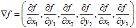
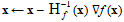

<?xml version="1.0" encoding="UTF-8" standalone="no"?>

<html xmlns="http://www.w3.org/1999/xhtml"><head><meta name="generator" content="DocBook XSL Stylesheets V1.76.1"/></head><body>

<h1 class="title"><a id="id557560"/>Lokális keresés folytonos terekben</h1>

A 2. fejezetben bemutattuk a diszkrét és a folytonos környezet közötti különbséget, arra is rámutatva, hogy a valósvilág-beli környezetek többsége folytonos. Az eddig leírt algoritmusok közül azonban egyik sem képes a folytonos állapottereket kezelni. Az állapotátmenet-függvény az esetek többségében végtelen számú állapottal térne vissza! Ez a részfejezet egy <em>nagyon rövid</em> bevezetőt ad néhány olyan lokális keresési technikához, melyek folytonos térben keresik az optimális megoldást. A téma irodalma óriási. Sok alaptechnika már a 17. században napvilágot látott, Newton és Leibniz kalkulusának kifejlődését[<a id="id557570" href="#ftn.id557570" class="footnote">45</a>] követően. E technikákhoz a könyvben több helyen fogunk folyamodni, beleértve a tanulásról, a látásról és a robotikáról szóló fejezeteket. Röviden, mindenhol, ahol a valós világgal foglalkozunk.

<h3 class="title">Fontos</h3>
<strong>Evolúció és keresés</strong>

Az <strong>evolúció</strong> elméletét Charles Darwin az <em>On the Origin of Species by Means of Natural Selection</em> c. művében (Darwin, 1859) dolgozta ki. A központi gondolat igen egyszerű: a reprodukcióban (<strong>mutáció</strong>ként ismert) eltérések fordulnak elő, és azokat a következő generációk nagyjából a reprodukciós fitnessre gyakorolt hatásuk arányában megtartják.

A darwini elméletet annak ismerete nélkül dolgozták ki, hogy a szervezetek tulajdonságai hogyan öröklődnek és módosulnak. E folyamatokat irányító valószínűségi törvényeket első ízben Gregor Mendel szerzetes azonosította (Mendel, 1866), aki borsóval kísérletezett, saját szavaival mesterséges megtermékenyítést alkalmazva. Sokkal később Watson és Crick feltárták a DNS-molekula szerkezetét és ábécéjét – AGTC (adenin, guanin, timin, citozin) – (Watson és Crick, 1953). A standard modellben a betűszekvenciában változás pontmutáció és „keresztezés” révén áll be (ahol az utód DNS-e a szülői DNS-ek hosszú részleteinek  kombinálásával jön létre).

A lokális keresési algoritmus analógiájáról írtunk már. A sztochasztikus nyaláb keresés és az evolúció közötti alapvető különbség a <em>szexuális</em> reprodukció használata, ahol az utódokat <em>több</em> egyedből hozzuk létre, és nem csak egyből. Az evolúció tényleges mechanizmusai azonban sokkal gazdagabbak, mint amit a genetikus algoritmus lehetővé tenne. A mutációhoz például az átfordítás, a duplikálás, a DNS nagy szegmenseinek a mozgatása is hozzátartozik. Egyes vírusok a DNS-t az egyik szervezetből veszik és egy másik szervezetbe beillesztik. Vannak átvihető gének is, amelyek nem tesznek mást, csak egy génállományon belül  többezerszer lemásolják magukat. Olyan gének is vannak, amelyek a potenciális reprodukciós partnereknél ezeket a géneket nem tartalmazó sejteket megmérgezik, növelve így a sokszorozódás esélyét. A legfontosabb tény, hogy <em>maguk a gének tartalmazzák annak a mechanizmusnak a kódját,</em> amely által a génállomány reprodukálódik, és egy szervezetté alakul át. A genetikus algoritmusokban ezek a mechanizmusok különálló programok részei, vagyis a manipulált füzérekben nem jelennek meg.

A darwini evolúció igencsak kis hatékonyságú mechanizmusnak tűnhet, hiszen vakon létrehozott kb. 1045 szervezetet, anélkül hogy a keresési heurisztikáin egy csöppet is javított volna. Darwin előtt 50 évvel a különben neves francia természettudós Jean Lamarck egy olyan evolúció elméletet javasolt (Lamarck, 1809), ahol egy szervezet az <em>élete során, adaptációja révén megszerzett tulajdonságokat</em> is képes az utódoknak átadni. Az ilyen mechanizmus hatékony lenne, de úgy tűnik, a természetben nem fordul elő. Sokkal később James Baldwin látszólag hasonló elmélettel állt elő (Baldwin, 1896), hogy a szervezet élete alatt megtanult viselkedés növelhetné az evolúció sebességét. Lamarck elméletével ellentétben a Baldwin-elmélet a darwini evolúcióval teljesen konzisztens, hiszen alapja egy szelekciós nyomás, amely olyan egyedekre hat, amelyek lokális optimumokat találtak a genetikus felépítésük által engedélyezett viselkedések között. A korszerű számítógépes szimulációk alátámasztják a „Baldwin-effektus” valós voltát, feltéve, hogy a „közönséges” evolúció olyan szervezeteket képes kialakítani, amelyeknél a belső hatékonysági mérték a saját tényleges fitness-értékükkel valahogy korrelál.

Kezdjük egy egyszerű példával. Tegyük fel, hogy valahol Romániában három új repülőteret szeretnénk létesíteni úgy, hogy a városoknak (lásd 3.2. ábra) a hozzájuk legközelebb eső repülőtérhez való távolságösszegük legyen minimális. Az állapotteret ekkor a repülőterek (<em>x</em>1, <em>y</em>1), (<em>x</em>2, <em>y</em>2) és (<em>x</em>3, <em>y</em>3) koordinátái definiálják. Ez egy <em>hatdimenziós</em> tér, azt is mondhatjuk, hogy az állapotokat hat <strong>változó</strong> (<strong>variable</strong>) definiálja (általánosságban az állapotokat a változók <em>n</em>-dimenziós <strong>x</strong> vektora definiálja). Ebben a térben való mozgás a térképen a repülőterek áthelyezésének felel meg. Az <em>f</em>(<em>x</em>1, <em>y</em>1, <em>x</em>2, <em>y</em>2, <em>x</em>3, <em>y</em>3) célfüggvényt, ha a legközelebbi városok már megvannak, bármely állapot esetére viszonylag könnyű kiszámítani, általánosságban azonban igen nehéz ezt leírni. 

A folytonosság problémái egyszerűen elkerülhetők, ha az egyes állapotok szomszédságát diszkretizáljuk. Egyszerre például csak egy repülőteret, csak <em>x</em> vagy <em>y</em> irányban egy rögzített ±δ lépéssel lehet áthelyezni. Ez 6 változó mellett, minden állapotban 12 követőt eredményez. Ehhez az előbb megismert bármelyik lokális keresési algoritmust alkalmazhatjuk. A sztochasztikus hegymászó keresést és a szimulált lehűtést közvetlenül, a tér diszkretizálása nélkül is alkalmazhatjuk. Ezek az algoritmusok a követőket véletlen módon választják ki, amelyek megvalósítása δ hosszúságú véletlen vektorok generálásával lehetséges.

Sok módszer található, melyek megkísérlik a felszín <strong>gradiens</strong>ét (<strong>gradient</strong>) felhasználni a maximum megtalálásához. A célfüggvény gradiense egy ∇<em>f</em> vektor, amely a legmeredekebb emelkedő nagyságát és irányát adja meg. Problémánk esetén:

Egyes esetekben a maximumot a ∇<em>f</em> = 0 egyenlet megoldásával találhatjuk meg (ezt megtehetnénk például akkor, ha csak egy repülőteret helyeznénk el; a megoldás az összes város koordinátáinak számtani közepe lesz). Sok esetben azonban ezt az egyenletet zárt alakban nem lehet megoldani. Három repülőtér esetén például a gradiens kifejezése attól függ, hogy az adott állapotban mely városok esnek legközelebb az egyes repülőterekhez. Ez azt jelenti, hogy a gradienst <em>lokálisan,</em> és nem <em>globálisan</em> tudjuk számítani. Ennek ellenére még mindig folyamodhatunk a legmeredekebb emelkedő hegymászáshoz a pillanatnyi állapotot az

<strong>x </strong>← <strong>x</strong> + α ∇(<strong>x</strong>)

képlettel frissítve, ahol α egy kis konstans. Más esetekben nem biztos, hogy a célfüggvény differenciálható formában áll a rendelkezésünkre – például a repülőterek helyeit egy konkrét esetben esetleg egy nagyméretű gazdasági szimulációs szoftvercsomag futtatásával határozhatjuk meg. Az ilyen esetekben az ún. <strong>empirikus gradiens</strong> (<strong>empirical gradient</strong>) meghatározásához folyamodhatunk, minden koordináta mentén egy kis pozitív és negatív változáshoz kiszámítva a választ. Az empirikus gradiens keresés ugyanaz, mint a legmeredekebb emelkedő hegymászás az állapottér diszkretizált változatában.

Az „α egy kis konstans” kifejezés mögött az α-t beállító módszerek óriási választéka rejlik. Az alapprobléma az, hogyha α túl kicsi, túlságosan sok lépésre van szükség. Ha α túl nagy, a keresés könnyűszerrel túllő a maximumon. A <strong>vonalkeresés</strong> (<strong>line search</strong>) módszere e problémát úgy kísérli megoldani, hogy a pillanatnyi gradiens irányát – általában α ismételt megduplázásával – meghosszabbítja, amíg <em>f</em> nem kezd újra csökkeni. Az a pont, ahol ez megtörténik, lesz az új aktuális állapot. 

Sok probléma esetén a legjobb algoritmus a jó öreg <strong>Newton–Raphson-módszer</strong> (Newton, 1671; Raphson, 1690). Ez a gyökhelykeresés, azaz a <em>g</em>(<em>x</em>) = 0 alakú egyenletek megoldásának általános módszere. Működésének alapja az <em>x</em> gyök új becslésének számítása a Newton-formula szerint:

<code class="code"><em>x </em>← <em>x </em>– <em>g</em>(<em>x</em>)/<em>g</em>′(<em>x</em>)</code>

<em>f</em> maximumának vagy minimumának megkereséséhez olyan <strong>x</strong>-et kell megkeresni, amire a <em>gradiens</em> nulla (azaz ∇<em>f </em>(<strong>x</strong>) = 0). A Newton-formula <em>g</em>(<em>x</em>)-e így ∇<em>f </em>(<strong>x</strong>) lesz, és a frissítési egyenlete az alábbi mátrixos formában 

írható fel, ahol <strong>H</strong><em>f</em> (<strong>x</strong>) a második deriváltak mátrixa (<strong>Hesse-mátrix</strong>), melynek <em>H</em><em>ij</em> elemeit a ∂2<em>f </em>/∂<em>xi</em>∂<em>x</em><em>j</em> második deriváltak adják meg. Mivel a második deriváltak mátrixának <em>n</em>2 eleme van, a Newton–Raphson-módszer sokdimenziós terekben drága lesz, ami számos közelítő módszer kifejlesztéséhez vezetett.

A lokális keresési módszerek számára a lokális maximumok, a gerincek és a fennsíkok folytonos terekben ugyanúgy gondot jelentenek, mint diszkrét terekben. A véletlen újraindítás és a szimulált lehűtés alkalmazható (itt is), és gyakran segít. A sokdimenziós folytonos terek azonban terebélyes helyek, ahol könnyű elveszni.

Az utolsó téma, amivel érdemes futó ismeretséget kötni a <strong>korlátozott optimalizálás</strong> (<strong>constrained optimization</strong>). Egy optimalizálási probléma korlátozott, ha a megoldásnak minden változójának értékeire nézve valamilyen kemény korlátozást kell teljesítenie. A repülőteres problémánkban korlátozhatjuk például a helyszíneket, hogy a repülőterek Románián belül és szárazföldön (nem tavak közepén) helyezkedjenek el. A korlátozott optimalizálás nehézségei a korlátozások és a célfüggvény természetén múlnak. A legismertebb kategóriát a <strong>lineáris programozás</strong>i (<strong>linear programming</strong>) problémák jelentik, ahol a korlátozások lineáris egyenlőtlenségek, amelyek egy <em>konvex</em> régiót képeznek, és ahol a célfüggvény szintén lineáris. A lineáris programozási problémákat változó számban polinomiális időben meg lehet oldani. Olyan problémákat is tanulmányoztak, ahol más típusú korlátozások és célfüggvények fordulnak elő. Ilyen problémák például a kvadratikus programozási feladat, a másodrendű kónikus programozási feladat stb.

 

[<a id="ftn.id557570" href="#id557570" class="para">45</a>]  A többváltozós kalkulus és a vektoraritmetika ismerete hasznos ennek a részfejezetnek az olvasásához.

</body></html>
