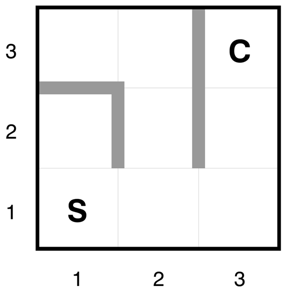
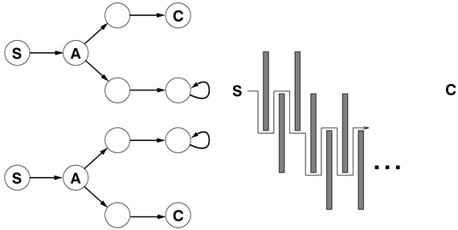
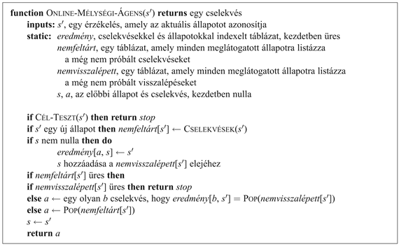
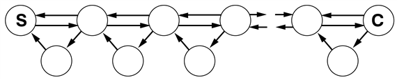
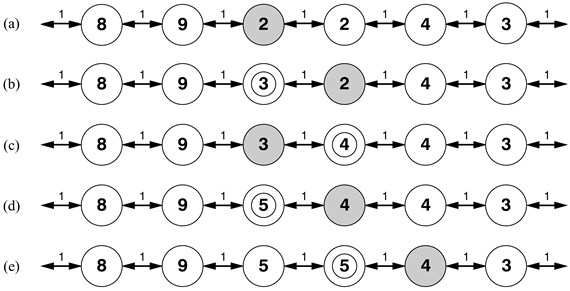
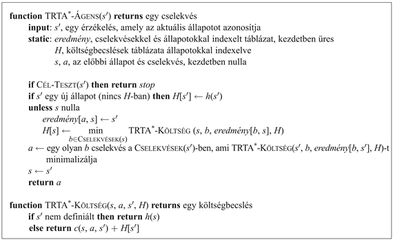

<?xml version="1.0" encoding="UTF-8" standalone="no"?>

<html xmlns="http://www.w3.org/1999/xhtml"><head><meta name="generator" content="DocBook XSL Stylesheets V1.76.1"/></head><body>

<h1 class="title"><a id="id557984"/>Online kereső ágensek és ismeretlen környezetek</h1>

Eddig olyan ágensekre összpontosítottunk, amelyek <strong>offline keresési</strong> (<strong>offline search</strong>) algoritmusokat használnak. Egy teljes megoldást számítanak ki mielőtt a valós világba beteszik a lábukat (lásd 3.1. ábra), majd a megoldást az érzékelések megvizsgálása nélkül végrehajtják. Ezzel ellentétben az <strong>online kereső </strong>(<strong>online search</strong>)[<a id="id558009" href="#ftn.id558009" class="footnote">46</a>] ágensek működésében a számítás és a végrehajtás <strong>átlapolódik</strong> (<strong>interleaving</strong>): először végrehajtanak egy cselekvést, majd megfigyelik a környezetüket és kiszámítják a következő cselekvést. Az online keresés jó ötlet a dinamikus és a szemidinamikus környezetekben – olyan környezetekben, ahol büntetik a semmittevést és a túlságosan hosszú számításokat. Az online keresés még jobb ötlet sztochasztikus környezetekben. Általánosságban egy offline keresésnek egy exponenciálisan nagy, minden lehetséges történést figyelembe vevő eshetőségi tervvel kellene előállnia, míg az online keresés csak az aktuálisan megtörténteket veszi figyelembe. Például ajánlatos, ha egy sakkozó ágens előbb megteszi az első lépést és csak ezután számítja ki a játszma teljes lefolyását.

Az online keresés szükségszerű ötlet a <strong>felfedezési problémá</strong>k (<strong>exploration problem</strong>s) esetén, ahol az állapotok és a cselekvések ismeretlenek az ágens számára. Egy ilyen tudatlan állapotban az ágensnek a cselekvéseit kísérletekként kell használnia, hogy megállapíthassa, mit tegyen a következő pillanatban, így a számítás és a cselekvés szükségszerűen átlapolódik.

Az online keresés kanonikus példája egy új épületben elhelyezett robot, melynek fel kell tárnia a környezetét, hogy felépíthesse azt a térképet, amit majd arra használ,  hogy <em>A</em>-tól <em>B</em>-ig eljusson. A labirintusból való menekülési módszerek – az ókori hősök elengedhetetlen képessége – szintén példái az online keresésnek. A térbeli feltárás azonban nem az egyedüli formája a feltárásnak. Gondoljunk egy újszülöttre: sok lehetséges cselekvéssel rendelkezik, de egyiknek sem tudja a hatását, és csak néhány közvetlenül elérhető állapotról van tudomása. Az, ahogy egy újszülött fokozatosan felfedezi, hogy hogyan működik a világ, részben egy online keresési folyamat.

<h2 class="title"><a id="id558046"/>Online keresési problémák</h2>

Egy online keresési problémát egy tisztán csak számítást végző folyamat helyett csak egy olyan ágens tud megoldani, amely a cselekvéseit végrehajtja. Feltételezzük, hogy az ágens csak az alábbiakat tudja:

<ul class="itemizedlist"><li class="listitem">
<code class="code">CSELEKVÉSEK</code> (<em>s</em>), amely az <em>s</em> állapotban engedélyezett cselekvések listáját adja vissza,
</li><li class="listitem">
A lépésköltség <em>c</em>(<em>s</em>, <em>a</em>, <em>s</em>′) függvény – jegyezzük meg, hogy ez nem használható addig, amíg az ágens nem tudja, hogy <em>s</em>′ az eredmény, és
</li><li class="listitem">
<code class="code">CÉL-TESZT</code> (<em>s</em>).
</li></ul>

Vegyük észre azt is, hogy az ágens <em>nem képes</em> egy állapot követőit másképpen elérni, mint úgy, hogy az adott állapotban az összes cselekvését kipróbálja. A 4.18. ábrán látható labirintusproblémában az ágens nem tudja, hogy a <em>Fel</em> cselekvés (1,1)-ből elvezeti őt az (1,2)-be, valamint ennek végeztével, hogy a <em>Le</em> cselekvés visszaviszi őt az (1,1)-be. Bizonyos alkalmazásokban a tudatlanság ezen szintje mérsékelhető – egy felfedező robot ismerheti a mozgási cselekvéseinek mechanizmusát, és csak az akadályok hollétéről nincs tudomása.

Feltételezzük, hogy az ágens mindig képes felismerni azt az állapotot, amiben már járt, és hogy a cselekvései determinisztikusak (e két feltételezéstől a 17. fejezetben eltekintünk). Végül az ágens hozzáférhet egy <em>h</em>(<em>s</em>) elfogadható heuriszitikus függvényhez, amely a pillanatnyi állapot és a célállapot távolságát becsüli. A 4.18. ábrán például az ágens tudhatja a célpozícióját, és képes lehet a Manhattan-távolsági heurisztika használatára.

Az ágens célja tipikusan az, hogy elérjen egy célállapotot, és eközben minimalizálja a költségeket (egy másik lehetséges cél egyszerűen az egész környezet feltárása). A költség az ágens által megtett tényleges út teljes költsége. Szokásos ezt a költséget azzal az útköltséggel összehasonlítani, amit az ágens követne, <em>ha az egész keresési teret előre ismerné</em> – azaz az aktuális legrövidebb úttal (vagy a legrövidebb teljes feltárással). Az online algoritmusok nyelvén ezt <strong>kompetitív arány</strong>nak (<strong>competitive ratio</strong>) nevezzük, és azt szeretnénk, ha ez a lehető legkisebb lenne.

Bár ez ésszerű követelménynek tűnik, könnyű belátni, hogy egyes esetekben a legjobb elérhető kompetitív arány a végtelen. Ha például bizonyos cselekvések irreverzíbilisek, az online keresés esetleg egy olyan zsákutcába kerülhet, ahonnan a célállapot nem elérhető. 

<a id="id558146"/>
<strong>4.18. ábra - Egy egyszerű labirintusprobléma. Az ágens <em>S</em>-nél kezd és <em>C</em>-t kell elérnie, a környezetéről azonban semmit sem tud.</strong>

<a id="id558162"/>
<strong>4.19. ábra - (a) Két olyan állapottér, amely az online kereső ágenst egy zsákutcába viheti. (b) Egy kétdimenziós környezet, amely arra késztetheti az online kereső ágenst, hogy a célhoz legkevésbé hatékony utat kövesse. Akármit is választ az ágens, az ellenség eltorlaszolja az útját egy másik hosszú, vékony fallal úgy, hogy a követett út sokkal hosszabb lesz, mint a legjobb lehetséges út.</strong>

<h3 class="title">Fontos</h3>
Lehet, hogy az „esetleg” megfogalmazást nem találja kellően meggyőzőnek – végül is létezhetne olyan algoritmus, amely feltárás közben a zsákutcákban nem köt ki. A kijelentésünk pontosabban megfogalmazva az, hogy <em>nincs olyan algoritmus, amely bármilyen állapottérben el tudná kerülni a zsákutcákat</em>. Nézzük meg közelebbről a 4.19. (a) ábra két zsákutcás állapotterét. Egy olyan online kereső algoritmus számára, amely az <em>S</em> és az <em>A</em> állapotokat már meglátogatta, a két állapottér <em>azonosnak</em> tűnik, tehát mindkettőben ugyanolyan döntéshez kell folyamodnia. Ez az <strong>ellenség érv</strong> (<strong>adversary argument</strong>) egy példája – el tudunk képzelni egy ellenséget, amely módosítja az állapotteret, miközben az ágens feltárja azt, és a célokat és a zsákutcákat tetszés szerint átrendezi. 

A zsákutcák a robotfeltárás igazi nehézségei – lépcsőházak, felhajtók, szakadékok és a természetes terep minden fajtája irreverzíbilis cselekvésekhez vezethetnek. Hogy előrehaladhassunk, egyszerűen feltételezzük, hogy az állapottér <strong>biztonságosan feltárható</strong> (<strong>safely explorable</strong>) – bizonyos célállapotok az összes elérhető állapotból elérhetők. A visszafordítható cselekvéseket tartalmazó állapottereket, mint amilyenek a labirintusok és a kirakójátékok, irányítatlan gráfoknak lehet tekinteni, és nyilván biztonságosan feltárhatók. 

Még a biztonságosan feltárható környezetekben sem biztosítható korlátozott kompetitív arány, ha léteznek benne korlátlan költségű utak. Ezt könnyű kimutatni irreverzíbilis cselekvéseket tartalmazó környezetekben, de igaz marad visszafordítható cselekvések esetén is, ahogy ezt a 4.19. (b) ábra mutatja. Emiatt általános, hogy az online algoritmusok hatékonyságát nem a legsekélyebben fekvő célállapot mélységével, hanem az egész állapottérrel jellemezzük.

<h2 class="title"><a id="id558214"/>Online kereső ágensek</h2>

Egy online kereső ágens minden cselekvés után érzékeli, hogy milyen állapotba került. Ebből az információból felépítheti környezetének térképét. Az aktuális térkép alapján eldönti, hogy legközelebb merre menjen. Ez az átlapolódó tervkészítés és végrehajtás azt jelenti, hogy az online kereső algoritmusok egészen mások, mint az előbb megismert offline algoritmusok. Az olyan offline algoritmusok, mint például az A* képesek egy csomópont követőit kiszámítani a tér egy részében, majd azonnal egy másik csomóponttal foglalkozni a tér egy másik részében, mert a csomópontkifejtés inkább szimulált, mint valódi cselekvéseket takar. Egy online algoritmus ezzel szemben csak azt a csomópontot fejtheti ki, amelyben fizikailag tartózkodik. Hogy a következő csomópont kifejtése érdekében a fa keresztül-kasul való végignézését elkerüljük, célszerűbbnek tűnik a csomópontokat <em>lokális</em> sorrendben kifejteni. Ezzel a tulajdonsággal éppen a mélységi keresés rendelkezik, mert (a visszalépést kivéve) a következő kifejtendő csomópont az előbb kifejtett csomópont gyereke.

<a id="id558224"/>
<strong>4.20. ábra - Egy mélységi feltárást használó online kereső ágens. Az ágens csak a kétirányú keresési terekben alkalmazható.</strong>

Egy online mélységi kereső ágenst a 4.20. ábra mutat. Ez az ágens a térképét egy <em>eredmény</em>[<em>a</em>, <em>s</em>] táblázatban tárolja, amely az <em>s</em> állapotban végrehajtott <em>a</em> cselekvés hatására előálló állapotot tartalmazza. Ha az aktuális állapotban marad még ki nem használt cselekvés, az ágens ezzel próbálkozik. A nehézség akkor áll be, ha az ágens egy állapotban már minden cselekvést kipróbált. Offline mélységi keresésnél ezt az állapotot a sorból egyszerűen elhagyjuk. Online keresésnél az ágensnek fizikailag kell visszalépnie. A mélységi keresésnél ez azt jelenti, hogy abba az állapotba kell visszakerülnie, amelyből az ágens legutóbb belépett a vizsgált állapotba. Ezt egy olyan táblázat karbantartásával lehet megoldani, amely minden állapot számára azokat az ősállapotokat listázza, melyekhez az ágens még nem lépett vissza. A keresés teljes, ha az ágens a viszszaléphető állapotokból kifut. 

Azt javasoljuk, hogy az olvasó kövesse végig az <code class="code">ONLINE-MÉLYSÉGI-ÁGENS</code> előrehaladását a 4.18. ábrán mutatott labirintus esetén. Könnyű észrevenni, hogy az ágens a térben minden csatlakozást legrosszabb esetben pontosan kétszer fog végigpásztázni. Feltárás esetében ez optimális eredmény. Egy cél megtalálása szempontjából azonban az ágens kompetitív aránya tetszőlegesen rossz lehet, ha egy hosszú túrára indul, holott a cél a kezdeti állapot közvetlen szomszédságában fekszik. Ezt a problémát az iteratívan mélyülő algoritmus online változata oldja meg. Egy homogén fát eredményező környezetben egy ilyen ágens kompetitív aránya egy kis konstans.

Az alkalmazott visszalépési módszer miatt az <code class="code">ONLINE-MÉLYSÉGI-ÁGENS</code> csak olyan terekben működik, ahol minden cselekvés visszafordítható. Az általános állapotterekhez egy kicsit bonyolultabb algoritmusok léteznek, azonban ezek egyike sem garantál korlátozott kompetitív arányt.

<h2 class="title"><a id="id558266"/>Online lokális keresés</h2>

A mélységi kereséshez hasonlóan a <strong>hegymászó keresés</strong>re (<strong>hill-climbing search</strong>) jellemző a csomópontkifejtés lokalitása. A tény az, hogy mivel a hegymászó keresés a memóriában csak egy aktuális állapotot tart, ez az algoritmus <em>már</em> egy online keresési algoritmus! A legegyszerűbb formájában azonban nemigen használatos, mert az ágenst a lokális maximumokban bennrekedve hagyja, ahonnan nincs hová mennie. Ráadásul a véletlen újraindítást sem lehet használni, mert az ágens nem képes magát egy új állapotba áthelyezni. 

A véletlen újraindítások helyett, a környezet feltárására a <strong>véletlen vándorlás</strong>t (<strong>random walk</strong>) használhatjuk. A véletlen vándorlás egyszerűen véletlen módon választ egy lehetséges cselekvést az aktuális állapotban. Elsőbbséget élvezhetnek az eddig még nem kipróbált cselekvések. Könnyű bebizonyítani, hogy a véletlen vándorlás <em>valamikor</em> megtalálja a célt, vagy feltárja a környezetet, feltéve, hogy a tér véges.[<a id="id558300" href="#ftn.id558300" class="footnote">47</a>] Másfelől a folyamat igen lassú lehet. A 4.21. ábra egy olyan környezetet mutat, ahol a véletlen vándorlásnak exponenciálisan sok lépésre van szüksége a cél megtalálásához, mert minden lépésnél a visszafelé haladás kétszer olyan valószínű, mint az előrehaladás. A példa persze kitalált, azonban sok olyan valós állapottér létezik, melynek topológiája ilyenfajta „csapdát” állít a véletlen vándorlás elé.

<a id="id558306"/>
<strong>4.21. ábra - Egy környezet, amelyben a véletlen vándorlásnak exponenciálisan sok lépésre lesz szüksége, hogy a célt megtalálja</strong>

Sokkal hatékonyabb megközelítés, ha a hegymászást nem véletlen működéssel, hanem <em>memóriával</em> látjuk el. Az alapötlet az, hogy a cél minden meglátogatott állapotból való elérési költségének egy <em>H</em>(<em>s</em>) „aktuális legjobb becslését” eltároljuk. <em>H</em>(<em>s</em>) a <em>h</em>(<em>s</em>) heurisztikus becslésből indul, és ahogy az ágens egyre több tapasztalatot gyűjt az állapottérben, értéke folyamatosan frissül. A 4.22. ábra egy egyszerű példát mutat egydimenziós állapottérre. Az (a)-ban úgy tűnik, az ágens egy lapos lokális minimumban, az árnyalt állapotban bennragadt. Ahelyett hogy ott maradna, ahol volt, az ágensnek követnie kellene azt az utat, ami a szomszédos állapotok aktuális költségbecslései alapján a célhoz vezető legjobb útnak néz ki. Annak becsült költsége, hogy a célt az <em>s′</em> szomszédon keresztül érjük el az <em>s</em>′ elérésének költsége, valamint a cél elérésének becsült költsége az <em>s</em>′ állapotból, azaz <em>c</em>(<em>s</em>, <em>a</em>, <em>s</em>′) + <em>H</em>(<em>s</em>′). A példában két cselekvés van, 1 + 9 és 1 + 2 becsült költségekkel, legcélszerűbbnek tűnik tehát jobbra menni. Most világos, hogy az árnyékolt állapot költségének becslésére a kettes érték túl optimista. Mivel a legjobb cselekvés költsége 1, és ez elvezet a céltól legalább kétlépésnyire lévő állapothoz, az árnyalt állapot legalább háromlépésnyire van a céltól. A <em>H</em> függvényt így ennek megfelelően frissíteni kell, ahogy a 4.22. (b) ábra mutatja. Ezt a folyamatot folytatva az ágens még kétszer mozdul el előre-hátra, a <em>H</em>-t frissítve és a lokális minimumot „laposítva”, amíg jobbra nem tud elmenekülni.

<a id="id558383"/>
<strong>4.22. ábra - A TRTA* öt iterációja egydimenziós állapottérben. Minden állapotot <em>H</em>(<em>s</em>)-sel, a cél elérésének aktuális becslésével, és minden élt a lépésköltséggel címkéztünk. Az árnyalt állapot az ágens helyét jelöli meg, és a frissített értékeket minden iterációban bekarikáztuk.</strong>

Ezt a sémát, aminek <strong>tanuló valós idejű A</strong><strong>*</strong> (<strong>TRTA*</strong>) a neve, a 4.23. ábrán látható ágens implementálja. Ez az ágens az <code class="code">ONLINE-MÉLYSÉGI-ÁGENS</code>-hez hasonlóan az <em>eredmény</em> táblázat felhasználásával környezetének egy térképét építi meg. Felfrissíti az éppen elhagyott állapot költségbecslését, és az aktuális költségbecslés szerint a „látszólag legjobb” cselekvést választja. Fontos részlet, hogy az <em>s</em> állapotban még ki nem próbált cselekvésekről mindig azt tételezi fel, hogy a lehető legkisebb <em>h</em>(<em>s</em>) költséggel közvetlenül a célhoz vezetnek. Ez a <strong>bizonytalanság melletti optimizmus</strong> (<strong>optimism under uncertainty</strong>) felbátorítja az ágenst, hogy új, feltehetően gyümölcsöző utakat tárjon fel.

Egy TRTA* ágens garantáltan megtalálja a célt akármilyen véges, biztonságosan feltárható környezetben. Az A*-gal ellentétben azonban nem teljes a végtelen állapotterekben – vannak olyan esetek, amikor az ágenst reménytelenül félre lehet vezetni. Egy <em>n</em> állapotból álló környezetet legrosszabb esetben <em>O</em>(<em>n</em>2) lépésben tár fel, de sokszor jóval hatékonyabb ennél. A TRTA* ágens a cselekvéskiválasztási és a frissítési szabályokkal különböző módon definiálható online ágensek nagy családjának egy partikuláris tagja. Ezzel a családdal, melyet eredetileg sztochasztikus környezetekhez találtak ki, a 21. fejezetben foglalkozunk.

<h2 class="title"><a id="id558473"/>Tanulás online keresés során</h2>

Az online kereső ágens kezdeti tudatlansága több lehetőséget teremt a tanulásra. Először az ágens a környezetének „térképét” – pontosabban minden állapotban minden cselekvés kimenetelét – tanulja meg egyszerűen regisztrálva a tapasztalatát. (Jegyezzük meg, hogy a determinisztikus környezet feltételezése azt jelenti, hogy egy-egy cselekvés esetén egy tapasztalás elég lesz.) Másodszor a lokálisan kereső ágensek lokális frissítési szabályok segítségével pontosabb értékbecslésekre tesznek szert minden állapot esetén, ahogy ez a <strong>TRTA*</strong>-nál történt. Látni fogjuk a 21. fejezetben, hogy ezek a frissítések előbb-utóbb minden állapot <em>egzakt</em> értékéhez fognak konvergálni, feltéve, hogy az ágens az állapotteret megfelelő módon tárja fel. Amikor az egzakt értékek már ismertek, az optimális döntések egyszerűen a legmagasabb értékű utódállapotba való átmenetekkel hozhatók meg – ilyenkor tehát a tiszta hegymászás az optimális stratégia. 

<a id="id558491"/>
<strong>4.23. ábra - A TRTA* ágens a cselekvéseit a környező állapotok értékei alapján választja ki, mely az állapotokat az állapottérben mozogva folyamatosan frissíti</strong>

Ha elfogadta a javaslatunkat, hogy az <code class="code">ONLINE-MÉLYSÉGI-ÁGENS</code> viselkedését kövesse nyomon a 4.18. ábrán bemutatott környezetben, észreveheti, hogy az ágens nem valami lángész. Így például, miután már látta, hogy a <em>Fel</em> cselekvés az (1,1)-ből az (1,2)-be visz, még mindig fogalma sincs, hogy a <em>Le</em> cselekvés az (1, 1)-be visz vissza, vagy hogy a <em>Fel</em> cselekvés a (2,1)-ből a (2,2)-be, a (2,2)-ből a (2,3)-ba stb. visz. Általánosságban azt szeretnénk, ha az ágensünk megtanulná, hogy a <em>Fel</em> növeli az <em>y</em> koordinátát, hacsak egy fal nincs útban, a <em>Le</em> a koordinátát csökkenti stb. Hogy ez megtörténhessen, két dologra van szükség. Először az ilyen általános szabályokhoz szükségünk van egy formális és manipulálható reprezentációra. Az információt egyelőre az állapotátmenet-függvény nevű fekete dobozba rejtettük. Ezzel a témával a III. rész foglalkozik. Másodszor szükségünk van egy algoritmusra, amely képes a megfelelő szabályokat az ágens által megtett konkrét megfigyelésekből konstruálni. Ezzel pedig a 18. fejezet foglalkozik.

 

[<a id="ftn.id558009" href="#id558009" class="para">46</a>]  Az „online” kifejezést sűrűn használják a számítógépes tudományokban olyan folyamatok megjelölésére, amelyek a bemeneti adatokat azok bejövetelekor dolgozzák fel, és nem várnak addig, amíg a teljes bemeneti adathalmaz hozzáférhetővé válik.

[<a id="ftn.id558300" href="#id558300" class="para">47</a>]  A végtelen eset sokkal trükkösebb. A véletlen vándorlás teljes egy- és kétdimenziós végtelen rácsban, de nem a háromdimenziósban! Ebben az utóbbi esetben annak a valószínűsége, hogy a vándorlás valamikorra a kiindulópontba visszatér, csak 0,3405 körüli. Egy általános bevezető: (Hughes, 1995).

</body></html>
