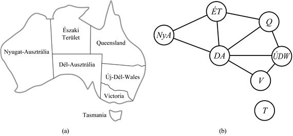

<?xml version="1.0" encoding="UTF-8" standalone="no"?>

<html xmlns="http://www.w3.org/1999/xhtml"><head><meta name="generator" content="DocBook XSL Stylesheets V1.76.1"/></head><body>

<h1 class="title"><a id="id561856"/>5. fejezet - Kényszerkielégítési problémák</h1>

<em>Ebben a fejezetben megmutatjuk azt, hogy ha az állapotokat nem egyszerűen kis fekete dobozoknak tekintjük, akkor új hatékony keresési módszerek egész sorához jutunk, valamint jobban megértjük a probléma struktúráját és komplexitását.</em>

A 3. és a 4. fejezetben azt az elképzelést jártuk körbe, hogy a problémákat <strong>állapottér</strong>beli kereséssel lehet megoldani. A tárgyterületre jellemző heurisztikák segítségével értékelhetjük ezeket az állapotokat és ellenőrizhetjük, hogy nem járunk-e célállapotban. A keresési algoritmus szempontjából azonban mindegyik állapot egy megkülönböztetés nélküli belső struktúrájú <strong>fekete doboz</strong> (<strong>black box</strong>). Az állapotokat egy tetszőleges adatstruktúra reprezentálja, amelyhez <em>a problémára jellemző</em> rutinokkal lehet hozzáférni: az állapotátmenet- és a heurisztikafüggvénnyel, valamint a célállapotteszttel.

A fejezetben a <strong>kényszerkielégítési problémá</strong>kkal (<strong>constraint satisfication prob</strong><strong>lem</strong>s) foglalkozunk, amikor az állapotok és a célteszt illeszkedik egy szabályos, strukturált és elég egyszerű <strong>reprezentáció</strong>hoz (lásd<em> </em>5.1. alfejezet). Az állapotstruktúra segítségével keresési algoritmusokat lehet definiálni, és nem <em>problémaspecifikus, </em>hanem<em> általános célú</em> heurisztikák használatával nagy problémák megoldása is lehetővé válik (lásd 5.2. és 5.3. alfejezet). Talán a legfontosabb azonban az, hogy a célteszt szabályos reprezentációja feltárja magának a problémának a struktúráját (lásd 5.4. alfejezet). Ez pedig módszereket ad a kezünkbe a probléma dekompozíciójára, és lehetővé teszi, hogy megértsük a probléma struktúrája és a megoldás nehézsége közötti szoros kapcsolatot.

<h1 class="title"><a id="id561915"/>Kényszerkielégítési problémák</h1>

A <strong>kényszerkielégítési problémá</strong>k (angol rövidítéssel <strong>CSP</strong>) formális definícióját <strong>változó</strong>k (<strong>variable</strong>s), <em>X</em>1, <em>X</em>2, …, <em>Xn</em>, és <strong>kényszer</strong>ek (<strong>constraint</strong>s), <em>C</em>1, <em>C</em>2, …, <em>Cm</em> halmazaival adhatjuk meg. Minden egyes <em>Xi </em>változó esetén adott a lehetséges <strong>érték</strong>ek egy nem-üres <em>Di </em><strong>t</strong><strong>artománya</strong>. Minden egyes <em>Ci </em>kényszer a változók valamely részhalmazára vonatkozik, és meghatározza a részhalmaz megengedett értékkombinációit. Egy problémaállapotot az definiál, hogy vagy néhány, vagy mindegyik változóhoz értékeket <strong>rendelünk hozzá</strong> {<em>Xi</em> = <em>vi</em>, <em>Xj</em> = <em>vj</em>, ...}. Egy hozzárendelést <strong>konzisztens</strong>nek (vagy megengedettnek) nevezünk, ha egyetlen kényszert sem sért meg. Teljes az a hozzárendelés, amelyben mindegyik változó szerepel, és egy teljes hozzárendelés a kényszerkielégítési problémának <strong>megoldása</strong>, ha mindegyik kényszert kielégíti. Néhány kényszerkielégítési probléma azt is igényli, hogy a megoldás egy <strong>célfüggvény</strong>t maximalizáljon.

Mit is jelent mindez? Tegyük fel, hogy Romániába beleunva Ausztrália térképét tanulmányozzuk, és a térképen az 5.1. (a) ábrán feltüntetett államokat és területeket látjuk, feladatunk pedig az, hogy vörössel, zölddel és kékkel minden egyes részt színezzünk ki úgy, hogy a szomszédos részeknek ne legyen azonos a színe. Ahhoz, hogy ezt kényszerkielégítési problémaként fogalmazhassuk meg, változókat kell bevezetnünk az egyes részekhez: <em>NyA</em>, <em>ÉT</em>, <em>Q</em>, <em>ÚDW</em>, <em>V</em>, <em>DA </em>és <em>T</em>. Mindegyik változó tartománya a {<em>vörös</em>, <em>zöld</em>, <em>kék</em>} halmaz. Kényszerek írják elő, hogy a szomszédos részek különböző színűek legyenek, például <em>NyA </em>és <em>ÉT</em> esetén a megengedhető kombinációk az alábbi párok lehetnek:

<code class="code">{(<em>vörös</em>, <em>zöld</em>), (<em>vörös</em>, <em>kék</em>), (<em>zöld</em>, <em>vörös</em>), (<em>zöld</em>, <em>kék</em>), (<em>kék</em>, <em>vörös</em>), (<em>kék</em>, <em>zöld</em>)} </code>

(A kényszert tömörebben is ki lehet fejezni a <em>NyA </em>≠<em> ÉT </em>egyenlőtlenséggel, feltéve persze, hogy a kényszermegoldó algoritmus valamiképpen ki tudja értékelni az ilyen kifejezéseket.) Sok lehetséges megoldás adódik, mint például az

<code class="code">{<em>NyA</em> = <em>vörös</em>, <em>ÉT </em>= <em>zöld</em>, <em>Q </em>= <em>vörös</em>, <em>ÚDW </em>= <em>zöld</em>, <em>V </em>= <em>vörös</em>, <em>DA </em>= <em>kék</em>, <em>T </em>= <em>vörös</em>}</code>

Gyakran hasznos lehet, ha felrajzoljuk a kényszerkielégítési probléma <strong>kényszergráf</strong>ját (<strong>constraint graph</strong>), amint az az 5.1. (b) ábrán is látható. A gráf csomópontjai a probléma változóinak, élei pedig a kényszereknek felelnek meg.

Sok előnnyel járhat, ha egy problémát kényszerkielégítési problémaként tekintünk. Az állapotok reprezentációja miatt a kényszerkielégítési problémák egy standard mintára illeszkednek (ez a minta a hozzárendelt értékekkel rendelkező változók halmaza), az állapotátmenet-függvényt és a célállapottesztet pedig az összes kényszerkielégítési problémára érvényes általános módon meg lehet írni. Sőt létrehozhatók hatékony, általános heurisztikák minden kiegészítő, tárgyterület-specifikus szakértelem nélkül. Végül pedig a kényszergráf struktúrájának segítségével lerövidíthető a megoldási folyamat, és ez néhány esetben exponenciálisan csökkenti a probléma komplexitását. A kényszerkielégítési probléma reprezentációja a legelső (és a legegyszerűbb) a könyv menete során bemutatott reprezentációs sémák sorában.

<a id="id562235"/>
<strong>5.1. ábra - (a) Ausztrália államai és területei. A térkép kiszínezése tekinthető kényszerkielégítési problémának is. A cél az, hogy minden egyes részhez olyan színt találjunk, amely nem azonos egy szomszédos rész színével sem. (b) A térképszínezési probléma kényszergráfként reprezentálva.</strong>

Könnyű észrevenni, hogy egy kényszerkielégítési problémára adható egy <strong>inkrementális megfogalmazás</strong> (<strong>incremental formulation</strong>), amely a kényszerkielégítési problémát szabályos keresési problémaként tekinti:

<ul class="itemizedlist"><li class="listitem">
<strong>Kiinduló állapot</strong> (<strong>initial state</strong>): az üres hozzárendelés {}, ahol egyik változónak sincs értéke.
</li><li class="listitem">
<strong>Állapotátmenet-függvény</strong> (<strong>successor function</strong>): bármelyik hozzárendelés nélküli változó értéket kaphat, amennyiben ez nem ütközik a korábbi értékadásokkal.
</li><li class="listitem">
<strong>Célteszt</strong> (<strong>goal test</strong>): az aktuális hozzárendelés teljes.
</li><li class="listitem">
Az <strong>út költsége</strong> (<strong>path cost</strong>): egy konstans költség (például 1) mindegyik lépésre.
</li></ul>

<h3 class="title">Fontos</h3>
Mindegyik megoldásnak egy teljes hozzárendelésnek kell lennie, tehát <em>n</em> változó esetén az <em>n</em>-edik mélységi szinten jelenik meg. A keresési fa pedig csak <em>n</em> mélységű. Emiatt a korlátkielégítési problémák esetén a mélységi keresési algoritmusok népszerűek (lásd 5.2. alfejezet). Az is igaz, hogy <em>a megoldáshoz vezető út nem lényeges.</em> Ezért használható a <strong>teljes állapotleírás</strong> (<strong>complete-state formulation</strong>) is, amelyben minden egyes állapot egy teljes változó-hozzárendelés, akár kielégíti a kényszereket, akár nem. Ebben a felírásban a lokális keresési eljárások is használhatók.

A kényszerkielégítési problémák legegyszerűbb esetében a változók <strong>diszkrét</strong>ek és <strong>véges tartományú</strong>ak. A térképszínezési problémák is ehhez az esethez tartoznak. A 3. fejezetben bemutatott 8-királynő problémát is felfoghatjuk véges tartományú kényszerkielégítési problémaként, ahol a <em>Q</em>1, …, <em>Q</em>8 változók a királynők 1, …, 8 oszlopokban betöltött pozícióit jelölik, és mindegyik változó tartománya {1, 2, 3, 4, 5, 6, 7, 8}. Amennyiben  maximum <em>d </em>a kényszerkielégítési probléma bármely változójához tartozó tartomány mérete, akkor a lehetséges teljes hozzárendelések száma <em>O</em>(<em>dn</em>), azaz a változók számának exponenciális függvénye. A véges tartományú kényszerkielégítési problémák közé tartoznak a Boole-problémák is, ahol a változók értéke vagy <em>igaz,</em> vagy <em>hamis</em>. A <strong>Boole kényszerkielégítési problémá</strong>k speciális esetként tartalmaznak néhány NP-teljes problémát, például a 3SAT-ot (lásd 7. fejezet). Legrosszabb esetben tehát nem lehetséges, hogy exponenciálisnál kevesebb idő alatt meg tudunk oldani egy véges tartományú kényszerkielégítési problémát. A legtöbb gyakorlati alkalmazásban azonban az általános célú CSP algoritmusok megbirkóznak a 3. fejezetben bemutatott általános célú keresési algoritmusokkal megoldhatóknál <em>több nagyságrenddel nagyobb </em>problémákkal is.

A diszkrét változók lehetnek <strong>végtelen tartományú</strong>ak is: például ilyen az egész számok halmaza vagy a füzérek halmaza. Például amikor egy építkezési munka naptárát ütemezzük, minden feladat kezdési ideje egy változó, amelyeknek lehetséges értékei az aktuális dátum napjait megadó egész számok. Végtelen tartományok esetén már nem lehet a kényszereket a megengedett értékkombinációk felsorolásával leírni. Ehelyett egy <strong>kényszernyelv</strong>et (<strong>constraint language</strong>) kell használni. Például ha <em>Munka</em>1 öt napig tart, és meg kell előznie <em>Munka</em>3-t, akkor kényszernyelvként az algebrai egyenlőtlenségek nyelvére van szükségünk, mint például <em>KezdMunka</em>1 + 5 ≤<em> KezdMunka</em>3. Továbbá az ilyen kényszereket többé már nem lehet megoldani az összes lehetséges hozzárendelés felsorolásával, mert végtelen sok van belőlük. Különleges megoldó algoritmusok (melyekre itt nem térünk ki) léteznek egész értékű változók<strong> lineáris kényszer</strong>eire, azaz olyan kényszerekre, mint a fenti, ahol mindegyik változó csak lineáris műveletekben jelenik meg. Megmutatható, hogy nem létezhet algoritmus egész értékű változók általános <strong>nemlineáris kényszer</strong>einek megoldására. Néhány esetben az egész értékű kényszerproblémák egyszerűen azzal visszavezethetők véges tartományúakra, hogy korlátozzuk az összes változó értékeit. Egy ütemezési problémában például egy felső korlátot szabhatunk az összes ütemezendő munka teljes hosszára.

A <strong>folytonos tartományú</strong> kényszerkielégítési problémák elég gyakoriak a valós alkalmazásokban, és az operációkutatáson belül is tanulmányozták ezeket a problémákat. Például a Hubble űrteleszkóp kísérleteinek ütemezése a megfigyelések nagyon pontos időzítését igényli, a megfigyelések és a manőverek kezdeti és befejezési időpontjai folytonos értékű változók és csillagászati, precedencia-, valamint teljesítménykényszerek sokasága vonatkozik rájuk. A folytonos tartományú kényszerkielégítési problémák legismertebb válfaja a <strong>lineáris programozás</strong>i problémák csoportja, ahol a kényszerek <em>konvex</em> tartományt alkotó lineáris egyenlőtlenségek. A lineáris programozási feladatokat meg lehet oldani a változók száma szerinti polinomiális időben. Más típusú kényszerekkel és célfüggvényekkel rendelkező problémákat is tanulmányoztak, például ilyennel foglalkozik a kvadratikus programozás, a másodrendű kónikus programozás és hasonló társaik.

Azon túl, hogy megvizsgálhatjuk a kényszerkielégítési problémákban megjelenő változók típusát, hasznos lehet a kényszerfajtákat is tanulmányozni. A legegyszerűbb fajta az <strong>unáris kényszer</strong> (<strong>unary constraint</strong>), amely egy változó értékére tesz megkötést. Elképzelhető például, hogy a délausztrálok élénken tiltakoznak a <em>zöld</em> szín ellen. A hivatkozott változó tartományának előfeldolgozásával mindegyik unáris kényszer kiküszöbölhető: ki kell venni a kényszert sértő összes értéket. A <strong>bináris kényszer</strong> (<strong>binary constraint</strong>) két változót köt össze. Például a <em>DA </em>≠ <em>ÚDW</em> egy bináris kényszer. A csak bináris kényszerekkel rendelkező kényszerkielégítési problémát binárisnak nevezzük, amit az 5.1. (b) ábrán láthatóhoz hasonló kényszergráffal lehet reprezentálni.

A magasabb rendű kényszerek három vagy több változóra vonatkoznak. Ennek egy ismerős példája a <strong>betűrejtvény</strong> (lásd 5.2. (a) ábra). A betűrejtvényben általában mindegyik betű különböző számot jelöl. Ez a megkötés az 5.2. (a) ábra betűrejtvénye esetén például a hatváltozós <em>MindKül</em>(<em>F</em>,<em>T</em>,<em>U</em>,<em>W</em>,<em>R</em>,<em>O</em>) kényszerrel adható meg. Egy másik megoldás lehet, ha a megkötést bináris kényszerek (mint például<em> F</em>≠<em>T</em>)<em> </em>gyűjteményével adjuk meg. A rejtvény négy oszlopában az összeadáskényszerek több változót is tartalmazhatnak, amelyek a következőképpen írhatók fel:

<code class="code"><em>O</em> + <em>O</em> = <em>R</em> + 10 · <em>X</em>1</code>

<code class="code"><em>X</em>1 + <em>W</em> + <em>W</em> = <em>U</em> + 10 · <em>X</em>2</code>

<code class="code"><em>X</em>2 + <em>T</em> + <em>T</em> = <em>O</em> + 10 · <em>X</em>3</code>

<code class="code"><em>X</em>3 = <em>F</em></code>

ahol <em>X</em>1, <em>X</em>2 és <em>X</em>3 a következő oszlopba átvitt számjegyet (0 vagy 1) reprezentáló <strong>segédváltozó</strong>k (<strong>auxiliary variable</strong>s). A magasabb rendű kényszereket egy <strong>kényszerhipergráf</strong>fal (<strong>constraint hyprergraph</strong>) lehet ábrázolni, amelynek egy példája az 5.2. (b) ábrán látható. Az éles szemű olvasónak feltűnhet, hogy a <em>MindKül </em>kényszer felbontható bináris kényszerekre: <em>F </em>≠<em> T</em>,<em> F </em>≠<em> U</em> stb. Az 5.11. feladat éppen annak bizonyítását kéri, hogy elegendő segédváltozó bevezetésével mindegyik magasabb rendű véges tartományú kényszer átírható bináris kényszerek halmazává. Ebből kiindulva ebben a fejezetben csak bináris kényszerekkel foglalkozunk.

Az eddig említett kényszerek mind <strong>abszolút kényszer</strong>ek voltak: egy kényszer megszegése kizár egy megoldásjelöltet. A valós alkalmazások során azonban sok kényszerkielégítési probléma tartalmaz <strong>preferenciakényszer</strong>eket, melyek jelzik, hogy mely megoldások preferáltak. Egy egyetemi órarend meghatározásakor például X professzor talán inkább reggel tanítana, míg Y professzor a délutáni órákat részesítené előnyben. Egy olyan órarend, amely szerint X professzornak délután kettőkor kellene tanítania, még megoldás lenne (persze csak ha X professzor éppenséggel nem a tanszékvezető), de ez nem lenne optimális megoldás. A preferenciakényszerek gyakran az egyedi változó-hozzárendelések költségeként ábrázolhatók: például ha X professzor egy délutáni időpontot kap, az két pontot ront az általános célfüggvényen, míg a reggeli óraidőpont csak egy pontba kerül. Így megfogalmazva a preferenciákkal kiegészített kényszerkielégítési problémák (útvonalalapú vagy lokális) optimalizációs keresési módszerekkel megoldhatók. Az ilyen kényszerkielégítési problémákkal a fejezetben többet nem foglalkozunk, de az irodalomjegyzékben megadunk néhány kiindulási pontként használható hivatkozást.

<a id="id562680"/>
<strong>5.2. ábra - (a) Egy betűrejtvény. Mindegyik betű különböző számjegyet jelöl, a rejtvény célja olyan számjegyeket helyettesíteni a betűk helyére, amelyekkel a kiadódó összeg aritmetikailag helyes lesz (azzal a külön megkötéssel, hogy nem kezdő nullák nem megengedettek). (b) A betűrejtvény kényszerhipergráfja a <em>MindKül</em> kényszer és az oszloponkénti összeadási kényszerek feltüntetésével. A kényszereket négyzet alakú dobozok jelölik. Minden doboz azzal a változóval van összekötve, amelyre a doboz által jelzett kényszer vonatkozik.</strong>

</body></html>
