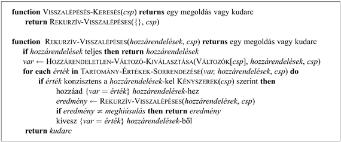
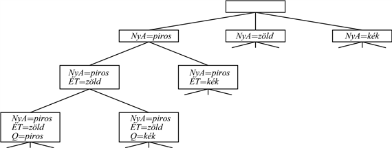
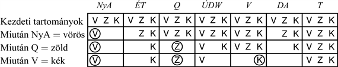
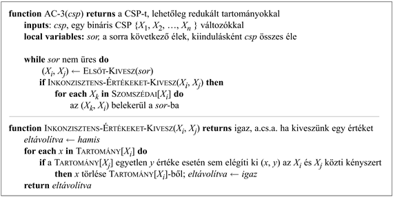

<?xml version="1.0" encoding="UTF-8" standalone="no"?>

<html xmlns="http://www.w3.org/1999/xhtml"><head><meta name="generator" content="DocBook XSL Stylesheets V1.76.1"/></head><body>

<h1 class="title"><a id="id562694"/>A visszalépéses keresés alkalmazása kényszerkielégítési problémákra</h1>

<a id="ID_187_oldal"/>
Az előző alfejezetben keresési problémaként fogalmaztuk meg a kényszerkielégítési problémákat. Ezt a megfogalmazást felhasználva a 3. és a 4. fejezetben bemutatott bármely keresési eljárással megoldhatók a kényszerkielégítési problémák. Tegyük fel, hogy alkalmazzuk a szélességi keresést az előző fejezetben megadott általános CSP-megfogalmazásra. Hamarosan valami szörnyűség tűnik fel: a fa tetején az elágazási tényező <em>nd</em>, mert a <em>d</em> érték bármelyike hozzárendelhető az <em>n</em> változó bármelyikéhez. A következő szinten az elágazási tényező (<em>n</em> – 1)<em>d</em> és így tovább az <em>n</em> szint során. Egy <em>n</em>!· <em>dn </em>levelű fát építünk fel, noha csupán <em>dn </em>lehetséges teljes hozzárendelés van!

<h3 class="title">Fontos</h3>
Látszólag racionális, valójában naiv problémamegfogalmazásunk elhanyagolta az összes kényszerkielégítési probléma egy döntő közös tulajdonságát: a<strong> kommutativitás</strong>t (<strong>commutativity</strong>). Egy probléma akkor kommutatív, ha a végeredmény szempontjából közömbös, hogy cselekvések egy adott sorozatát milyen sorrendben alkalmazzuk. Ilyenek a kényszerkielégítési problémák is, mert a változók hozzárendelése során a sorrendtől függetlenül ugyanazt a parciális hozzárendelést kapjuk. Ezért tehát<em> mindegyik kényszerkielégítési problémamegoldó a következő állapot generálásakor a keresési fa minden csomópontjában csak </em>egyetlen<em> változó lehetséges hozzárendeléseit veszi tekintetbe.</em> Az ausztráliai térképszínezési probléma keresési fájának gyökércsomópontjában választhatunk a <em>DA </em>=<em> vörös</em>, a<em> DA </em>=<em> zöld</em> és a <em>DA </em>=<em> kék </em>közül, de sohasem merül fel választási lehetőségként a <em>DA </em>=<em> vörös </em>vagy az <em>NyA </em>=<em> kék</em>. A levelek száma ezzel a megszorítással már a remélt <em>dn</em>.

<a id="id562804"/>
<strong>5.3. ábra - Egy egyszerű visszalépéses keresési algoritmus kényszerkielégítési problémákhoz. Az algoritmus a 3. fejezet rekurzív mélységi keresőjén alapul. A <code class="code">HOZZÁRENDELETLEN-VÁLTOZÓ-KIVÁLASZTÁSA</code> és a <code class="code">TARTOMÁNY-ÉRTÉKEK-SORRENDEZÉSE</code> függvények használhatók a szövegben bemutatott általános célú heurisztikák megvalósítására.</strong>

<a id="id562821"/>
<strong>5.4. ábra - Részlet a keresési fából, amelyet az egyszerű visszalépéses keresés generált az 5.1. ábrán bemutatott térképszínezési problémához</strong>

A <strong>visszalépéses keresés</strong> (<strong>backtracking search</strong>) kifejezést olyan mélységi keresésekre használjuk, melyek egyszerre csak egy változóhoz rendelnek értéket, és visszalépnek, ha már nincs megengedett hozzárendelési lehetőség. Az algoritmus az 5.3. ábrán látható. Vegyük észre, hogy az algoritmus lényegében a 115–116. oldalon leírt egyenkénti módszert használja az inkrementális következő állapot generálásra. Továbbá a következő állapot generálásakor kifejti az aktuális állapotot, nem pedig egyszerűen másolja. A kényszerkielégítési problémák szokásos reprezentációja miatt nincs szükség a <code class="code">VISSZALÉPÉSES-KERESÉS</code> algoritmus kiegészítésére tárgyterület-specifikus kezdeti állapottal, állapotátmenet-függvénnyel vagy célteszttel. Az 5.4. ábrán látható egy részlet az ausztráliai színezési problémához generált keresési fából (a változó-hozzárendelések sorrendje <em>NyA</em>,<em> ÉT</em>,<em> Q</em>,<em> </em>…).

Az egyszerű visszalépéses keresés a 3. fejezet terminológiája szerint nem informált algoritmus, tehát nem is várjuk el, hogy nagy problémák esetén is hatékony legyen. Az 5.5. ábra első oszlopában bemutatott néhány eredmény megerősíti várakozásainkat.

<a id="id562863"/>
<strong>5.5. ábra - Az egyes CSP-algoritmusok teljesítménye különböző problémák megoldásában. Az algoritmusok balról jobbra haladva a következők: egyszerű visszalépéses, MRV-heurisztikával bővített visszalépéses, előrenéző ellenőrzés, MRV-heurisztikával kiegészített előrenéző ellenőrzés és a minimális konfliktusok lokális keresése. Az egyes cellákban a probléma megoldása során elvégzett konzisztencia-ellenőrzések száma található (öt futtatás mediánértékéből meghatározva); figyeljünk fel arra, hogy a két jobb felső cella kivételével mindegyik érték ezrekben van megadva (ezt jelzi a K betű). Az első probléma az Amerikai Egyesült Államok 50 államát tartalmazó térkép négy színnel történő színezése. A többi probléma a (Bacchus és van Run, 1995)-ből származik (1. táblázat). A második probléma az <em>n</em>-királynő megoldásához szükséges ellenőrzések száma (<em>n</em> értékeire 2-től 50-ig összegezve). A harmadik az 5.13. feladatban is szereplő „zebrarejtvény”. A maradék kettő mesterséges véletlenszerűen generált problémák. (A min-konfliktusok algoritmus ezeken nem futott.) Az eredmények azt érzékeltetik, hogy az MRV-heurisztikával kombinált előrenéző ellenőrzés mindegyik probléma esetén jobban teljesít, mint a többi visszalépéses algoritmus, de nem minden esetben jobb a min-konfliktusokat használó helyi keresésnél.</strong>

A 4. fejezetben a nem informált keresési algoritmusok gyenge teljesítményét a probléma ismeretéből származó tárgyterület-specifikus heurisztika bevezetésével orvosoltuk. Az derül azonban ki, hogy a kényszerkielégítési problémák hatékonyan megoldhatók ilyen tárgyterület-specifikus tudás nélkül is. Olyan általános célú eljárások alakíthatók ki, amelyek az alábbi kérdéseket vizsgálják:

<ol class="orderedlist"><li class="listitem">
A következő lépésben melyik változóhoz rendeljünk értéket, és milyen sorrendben próbálkozzunk az értékekkel?
</li><li class="listitem">
Milyen következményei vannak a jelenlegi változó-hozzárendeléseknek a még hozzárendeletlen változók számára?
</li><li class="listitem">
Ha egy út sikertelennek bizonyul (azaz egy olyan állapothoz jutunk, ahol egy változónak nincs megengedhető értéke), a következő utak során el tudja-e kerülni a keresés ezt a hibát?
</li></ol>

A következő pontokban megpróbáljuk sorra megválaszolni ezeket a kérdéseket.

<h2 class="title"><a id="id562899"/>Változó- és értékrendezés</h2>

A visszalépéses algoritmus tartalmazza az alábbi sort:

<code class="code"><em>var</em> ← Hozzárendeletlen-Változó-Kiválasztás(Változók[<em>csp</em>], <em>hozzárendelések</em>, <em>csp</em>)</code>

Alapértelmezés szerint a <code class="code">HOZZÁRENDELETLEN-VÁLTOZÓ-KIVÁLASZTÁS</code> egyszerűen kiválasztja a <code class="code">VÁLTOZÓK</code>[<em>csp</em>] lista sorrendje szerinti következő hozzárendeletlen változót. A statikus változó-hozzárendelés ritkán vezet a leghatékonyabb kereséshez. Például miután kiválasztottuk az <em>NyA </em>=<em> vörös </em>és az <em>ÉT </em>=<em> zöld</em> hozzárendeléseket, csak egyetlen értéket rendelhetünk <em>DA</em>-hoz, tehát ésszerű lenne inkább a <em>DA </em>=<em> kék </em>hozzárendelést elvégezni, mintsem <em>Q</em> számára keresni értéket. Sőt miután <em>DA</em> értéket kapott, kényszerítve vagyunk <em>Q, ÚDW </em>és <em>V </em>értékeinek kiválasztásakor. Ezt az intuitív ötletet (a legkevesebb „megengedett” értékkel rendelkező változó kiválasztását) nevezik <strong>legkevesebb fennmaradó érték</strong> (<strong>minimum remaining values</strong>, <strong>MRV</strong>) heurisztikának. Nevezték már „legkorlátozottabb változó” vagy „meghiúsulást előre” heurisztikának is (az utóbbi névnek az a magyarázata, hogy azt a változót emeli ki, amelyik legvalószínűbben fog hamarosan hibához vezetni, ezáltal megnyesve a keresési fát). Ha van egy <em>X </em>változó, amelynek egyetlen megengedett értéke sincs, akkor az MRV-heurisztika ki fogja választani <em>X</em>-et, és azonnal kideríti a hibát, elkerülve ezzel a többi változó közötti értelmetlen keresgélést, ami mindig kudarcra vezet, amikor <em>X</em> végül is kiválasztódik. Az 5.5. ábra második, BT+MRV címkéjű oszlopa ennek a heurisztikának a teljesítményét mutatja. Az egyszerű visszalépéses keresésnél a teljesítmény a problémától függően mintegy 3…3000-szer jobb lehet. Vegyük észre, hogy a teljesítménymértékünk nem tartalmazza a heurisztikus értékek kiszámításának többletköltségét. A következő pontban bemutatunk egy módszert, amellyel kezelhetővé válik ez a költség.

Az MRV-heurisztika semmit sem segít abban, hogy melyik régiót válasszuk ki elsőként Ausztrália kiszínezésekor, mert a kiinduláskor mindegyik régiónak három megengedett színe van. Ebben az esetben segíthet a <strong>fokszám-heurisztika</strong> (<strong>degree heuristics</strong>). Ez azáltal kísérli meg a későbbi választások elágazási tényezőjét csökkenteni, hogy azt a változót választja ki, amely a legtöbbször szerepel a hozzárendeletlen változókra vonatkozó kényszerekben. Az 5.1. ábrán <em>DA</em> a legnagyobb fokszámú változó (fokszáma 5), az összes többi változó fokszáma 2 vagy 3, leszámítva <em>T</em>-t, amelyé nulla. Valójában, ha már egyszer <em>DA</em>-t kiválasztottuk, a fokszám-heurisztika alkalmazása a problémát egyetlen hibás lépés nélkül oldja meg: mindegyik választási pontnál bármelyik konzisztens színt is választjuk, mindenképpen visszalépés nélkül jutunk egy megoldáshoz. A legkevesebb fennmaradó érték heurisztika általában jobban irányít, de a patthelyzetek eldöntéséhez hasznos segítség lehet a fokszám-heurisztika.

Miután az algoritmus már kiválasztott egy változót, el kell döntenie, hogy milyen sorrendben vizsgálja meg ennek értékeit. Erre néha a <strong>legkevésbé-korlátozó-érték</strong> (<strong>least-constraining-value</strong>) heurisztika lehet hasznos. Ez a heurisztika előnyben részesíti azt az értéket, amely a legkevesebb választást zárja ki a kényszergráfban a szomszédos változóknál. Például tegyük fel, hogy az 5.1. ábra esetében már létrehoztuk az <em>NyA </em>=<em> vörös</em> és az <em>ÉT </em>=<em> zöld</em> parciális hozzárendelést, és most <em>Q</em> számára akarunk értéket találni. A kék rossz választás volna, mert ez kizárja <em>Q</em> szomszédjának, <em>DA</em>-nak utolsó megengedett értékét. A legkevésbé korlátozó heurisztika ezért a kékkel szemben a vöröset részesíti előnyben. Általában véve a heurisztika megpróbálja a későbbi változó-hozzárendelések számára a lehető legnagyobb szabadságot meghagyni. Természetesen ha egy probléma összes megoldását meg szeretnénk találni, és nem elégszünk meg csupán eggyel, akkor a sorrend közömbös, hiszen úgyis minden értéknek sorra kell kerülnie. Ugyanez igaz akkor is, ha a problémának nincsen megoldása.

<h2 class="title"><a id="id563063"/>Az információ terjesztése a kényszereken keresztül</h2>

A keresési algoritmusunk eddig csak akkor foglalkozott egy változóra vonatkozó kényszerrel, ha a változót a <code class="code">HOZZÁRENDELETLEN-VÁLTOZÓ-KIVÁLASZTÁS</code> kiválasztotta. De ha néhány kényszert a keresés folyamán korábban vagy akár még a keresés megkezdése előtt megvizsgálunk, akkor drasztikusan csökkenthető a keresési tér mérete.

<h3 class="title"><a id="id563073"/>Előrenéző ellenőrzés</h3>

A kényszerek keresés közbeni jobb felhasználásának egyik módszerét <strong>előrenéző ellenőrzés</strong>nek (<strong>forward checking</strong>) nevezzük. Az előrenéző ellenőrzési folyamat minden egyes alkalommal, amikor egy <em>X</em> változó értéket kap, minden, az <em>X</em>-hez kényszerrel kötött, hozzárendeletlen <em>Y</em>-t megvizsgál, és <em>Y </em>tartományából törli az <em>X</em> számára választott értékkel inkonzisztens értékeket. Az 5.6. ábra bemutatja az előrenéző ellenőrzéses keresés menetét a térképszínezési probléma során. Két fontos dolgot kell megemlítenünk ezzel a példával kapcsolatban. Először is vegyük észre, hogy miután elvégeztük az <em>NyA </em>=<em> vörös</em> és a <em>Q </em>=<em> zöld</em> hozzárendeléseket, <em>ÉT</em> és <em>DA </em>tartományai egyetlen elemre szűkültek, és azzal, hogy az <em>NyA</em>-ból és a <em>Q</em>-ból származó információt terjesztettük, teljesen megszüntettük az ezen változók szerinti elágazást. Az MRV-heurisztika, amely az előrenéző ellenőrzés nyilvánvaló partnere, automatikusan <em>DA</em>-t és <em>ÉT</em>-t választja következőnek. (Tulajdonképpen még hatékonyabb eljárássá tehetjük az előrenéző ellenőrzést, ha az MRV-heurisztika munkájához szükséges információt inkrementálisan számítjuk.) A másik dolog, amire érdemes felfigyelni, az az, hogy a <em>V </em>=<em> kék </em>hozzárendelés után <em>DA</em> tartománya üres lett. Ezért az előrenéző ellenőrzés megállapítja, hogy a {<em>NyA </em>=<em> vörös</em>,<em> Q </em>=<em>zöld</em>,<em> V </em>=<em> kék</em>} részleges hozzárendelés inkonzisztens a probléma kényszereivel, és az algoritmus azonnal visszalép.

<h3 class="title"><a id="id563175"/>A kényszerek terjesztése</h3>

Az előrenéző ellenőrzés ugyan sok inkonzisztenciát észrevesz, de nem mindet. Például nézzük csak az 5.6. ábra harmadik sorát. Az látható itt, hogy amikor <em>DA vörös</em> és <em>Q zöld</em>, mind <em>ÉT</em>-nek, mind <em>DA</em>-nak kéknek kell lennie. De ezek szomszédosak, és nem lehet azonos az értékük. Az előrenéző ellenőrzés nem veszi észre ezt az inkonzisztenciát, mert nem néz elég messze előre. A <strong>kényszer</strong>ek<strong> terjesztése</strong> (<strong>constraint propagation</strong>) általános kifejezés jelöli azt, ha az egyik változó kényszerének a többi változót érintő következményeit terjesztjük: esetünkben<em> NyA</em>-ról<em> Q</em>-ra és<em> ÉT</em>-ről<em> DA</em>-ra kell terjeszteni (ahogy ezt már az előrenéző ellenőrzés is megtette), majd az<em> ÉT</em> és<em> DA</em> közti kényszerre, hogy észrevehessük az inkonzisztenciát. Ezt pedig gyorsan szeretnénk tenni: semmi értelme a keresés méretét csökkenteni, ha több időt töltünk a kényszerek terjesztésével, mint az egyszerű kereséssel tennénk.

<a id="id563231"/>
<strong>5.6. ábra - A térképszínezés folyamata előrenéző ellenőrzéses keresés esetén. Az első hozzárendelés az <em>NyA</em> = <em>vörös,</em> majd az előrenéző ellenőrzés törli a <em>vörös</em> értéket a szomszédos <em>ÉT</em> és <em>DA</em> változók tartományaiból. A <em>Q </em>=<em> zöld</em> hozzárendelés után a <em>zöld</em> is kikerül az <em>ÉT</em>, <em>DA</em> és <em>ÚDW</em> változók tartományaiból. A <em>V </em>=<em> kék</em>-et követően a <em>kék</em> is törlődik a <em>DA</em> és <em>ÚDW</em> változók tartományaiból, és <em>DA</em> számára nem marad megengedett érték.</strong>

Az <strong>élkonzisztencia</strong> (<strong>arc consistency</strong>) alapul szolgálhat egy gyors, az előrenéző ellenőrzésnél lényegesen erősebb kényszerterjesztéshez. Az „él” itt a kényszergráf <em>irányított</em> éleit jelenti, amilyen például a <em>DA</em>-ból az <em>ÚDW</em>-be mutató él. Ha adott <em>DA</em> és <em>ÚDW</em> aktuális tartománya, akkor ez az él konzisztens, ha <em>DA</em> <em>mindegyik x</em> értékéhez található egy <em>x</em>-szel konzisztens <em>valamilyen y</em> érték <em>ÚDW</em>-ben. Az 5.6. ábra harmadik sorában <em>DA </em>és <em>ÚDW </em>pillanatnyi tartománya rendre a {<em>kék</em>}, illetve a {<em>vörös, kék</em>}. A <em>DA </em>= <em>kék </em>esetén található egy konzisztens hozzárendelés <em>ÚDW</em>-hez, nevezetesen az <em>ÚDW </em>= <em>vörös</em>; ezért a <em>DA</em>-ből <em>ÚDW</em>-be mutató él konzisztens. Viszont az <em>ÚDW</em>-ből a <em>DA</em>-ba mutató él nem konzisztens, mert az <em>ÚDW </em>= {<em>kék</em>} hozzárendelésnél a <em>DA</em>-hoz nem tudunk színt találni. Az él úgy tehető konzisztenssé, hogy az <em>ÚDW </em>tartományából töröljük a <em>kék </em>értéket.

A <em>DA</em>-ból <em>ÚT</em>-be mutató él mentén is alkalmazhatjuk a keresési folyamat ugyanazon fázisában az élkonzisztenciát. Az 5.6. ábra harmadik sora szerint mindkét változó értéktartománya {<em>kék</em>}. Ez azt eredményezi, hogy törölnünk kell a <em>kék</em>-et <em>DA </em>tartományából, amely ezzel kiürül. Az élkonzisztencia ellenőrzés tehát lehetővé teszi, hogy korábban észrevegyük az egyszerű előrenéző ellenőrzés által fel nem fedett inkonzisztenciát.

Az élkonzisztencia-ellenőrzés alkalmazható előfeldolgozó lépésként a keresés megkezdése előtt, vagy a keresési folyamat minden egyes hozzárendelését követő terjesztési lépésként (az előrenéző ellenőrzéshez hasonlóan). (Az utóbbi algoritmust <em>Élkonzisztencia fenntartásának</em> is, angol rövidítéssel MAC-nak nevezik.) Mindkét esetben addig kell <em>ismételve</em> alkalmazni a folyamatot, amíg nem marad inkonzisztencia. Erre azért van szükség, mert amikor egy élinkonzisztenciát eltávolítandó egy érték kikerül egy változó tartományából, az ehhez a változóhoz mutató éleknél új inkonzisztencia jöhet létre. Az AC-3, az élkonzisztencia teljes algoritmusa egy sort használ annak nyilvántartására, hogy mely élek inkonzisztenciáját kell még ellenőriznie (lásd 5.7. ábra). Minden egyes (<em>Xi</em>, <em>Xj</em>) élet sorban egyenként levesszük a tennivalók listájáról és ellenőrizzük; ha pedig <em>Xi </em>tartományának bármely változóját törölni kell, akkor minden <em>Xi </em>-be mutató (<em>Xk</em>, <em>Xi</em>) élet visszateszünk ellenőrzésre a sorba. Az élkonzisztencia-ellenőrzés komplexitása az alábbiak szerint vizsgálható: egy bináris kényszerkielégítési problémában legfeljebb <em>O</em>(<em>n</em>2) él van; minden egyes (<em>Xk</em>, <em>Xi</em>) él csak <em>d</em> alkalommal kerülhet napirendre, mert <em>Xi</em>-ben<em> </em>összesen <em>d</em> törölhető érték van; egy él konzisztenciájának ellenőrzése elvégezhető <em>O</em>(<em>d</em>2)<em> </em>időben; tehát a legrosszabb esetben vett teljes idő <em>O</em>(<em>n</em>2<em>d</em>3). Ez ugyan lényegesen költségesebb, mint az előretekintő ellenőrzés, de az extra költség általában kifizetődik.[<a id="id564501" href="#ftn.id564501" class="footnote">48</a>]
<a id="ID_193_oldal"/>
<a id="id564522"/>
<strong>5.7. ábra - Az AC-3 élkonzisztencia algoritmus. Az AC-3 alkalmazását követően vagy mindegyik él élkonzisztens, vagy néhány változó tartománya üres, azaz a kényszerkielégítési probléma nem hozható élkonzisztens alakra (tehát nem oldható meg). Az „AC-3” nevet az algoritmus kitalálója (Mackworth, 1977) vezette be, mert ezt az algoritmust mutatta be cikkében harmadikként.</strong>

Mivel a kényszerkielégítési problémák speciális esetként tartalmazzák a 3SAT-ot, ezért nem várhatjuk, hogy polinom idejű algoritmust találunk annak eldöntésére, hogy egy adott kényszerkielégítési probléma konzisztens-e. Ebből arra következtethetünk, hogy az élkonzisztencia nem tár fel minden lehetséges inkonzisztenciát. Például az 5.1. ábrán az {<em>NyA </em>=<em> vörös, ÚDW </em>=<em> vörös</em>} részleges hozzárendelés inkonzisztens, de az AC-3 nem találja meg. Definiálható a terjesztés erősebb formája is, amit <strong><em>k</em>-konzisztenciá</strong>nak (<strong><em>k-</em>consistency</strong>) nevezünk. Egy kényszerkielégítési probléma akkor <em>k</em>-konzisztens, ha bármely <em>k – </em>1<em> </em>változóból álló halmaz és ezen változók bármely konzisztens hozzárendelése esetén mindig lehet a <em>k</em>-adik változónak konzisztens értéket találni. Az 1-konzisztencia például azt jelenti, hogy mindegyik individuális változó önmagában véve is konzisztens; ezt <strong>csomópont-konzisztenciá</strong>nak (<strong>node consistency</strong>) is nevezik. A 2-konzisztencia ugyanaz, mint az élkonzisztencia. A 3-konzisztencia azt jelenti, hogy egymás melletti változók bármely párja mindig kiterjeszthető egy szomszédos változóra; ezt <strong>útvonal-konzisztenciá</strong>nak (<strong>path consistency</strong>) is nevezik.

Egy gráf <strong>erősen <em>k-</em>konzisztens </strong>akkor, ha <em>k</em>-konzisztens, valamint (<em>k – </em>1)-konzisztens, (<em>k – </em>2)-konzisztens és így tovább le egészen az 1-konzisztenciáig. Tegyük fel most, hogy van egy <em>n</em> csomópontból álló kényszerkielégítési problémánk, és tegyük erősen <em>n</em>-konzisztenssé (azaz <em>k</em>-konzisztenssé <em>k </em>=<em> n</em> esetében). Ekkor visszalépés nélkül megoldhatjuk a problémát. Először egy konzisztens értéket választunk <em>X</em>1 számára. Ezután garanciánk van arra, hogy tudunk <em>X</em>2 számára értéket választani, mert a gráf 2-konzisztens, <em>X</em>3 számára, mert a gráf 3-konzisztens és így tovább. Minden egyes <em>Xi </em>változó esetén csak <em>d</em> értéket kell ellenőriznünk a tartományból, hogy egy X1 ,..., <em>X</em><em>i</em>–1-gyel konzisztens értéket találjunk. Garanciánk van tehát arra, hogy <em>O</em>(<em>nd</em>) időben megoldást találunk. Persze semmit sem adnak ingyen: az <em>n</em>-konzisztenciát biztosító bármely algoritmus legrosszabb esetben <em>n</em>-ben exponenciális lesz.

Az <em>n</em>-konzisztencia és az élkonzisztencia között egy széles köztes mező húzódik: az erősebb konzisztencia-ellenőrzések futtatása tovább fog tartani, de több eredménnyel jár az elágazási tényező csökkentésében és az inkonzisztens részleges hozzárendelések felderítésében. Ki lehet számolni a legkisebb olyan <em>k</em> értéket, melyre a <em>k</em>-konzisztencia ellenőrzésének futtatása visszalépés nélküli problémamegoldást tesz lehetővé (lásd 5.4. alfejezet), de ez gyakran nem célszerű. A legmegfelelőbb konzisztencia-ellenőrzési szint kiválasztása valójában leginkább empirikus tudomány.

<h3 class="title"><a id="id564701"/>Speciális kényszerek kezelése</h3>

A kényszerek bizonyos típusai gyakran fordulnak elő a valós problémákban és speciális célú algoritmusokkal jóval hatékonyabban kezelhetők, mint az eddig leírt általános célú módszerekkel. Például a <em>MindKül</em> kényszer azt állítja, hogy a benne szereplő öszszes változóknak mind különböző értéket kell felvennie (ahogy a betűrejtvényes példában láttuk). A <em>MindKül</em> kényszer inkonzisztencia-ellenőrzésére egy egyszerű módszer az, hogy ha <em>m</em> változó szerepel a kényszerben, és ha ezeknek együttesen <em>n</em> különböző értéke lehet, akkor <em>m </em>&gt;<em> n </em>esetén a kényszert nem lehet kielégíteni.

Ez a következő egyszerű algoritmushoz vezet: először vegyünk ki a kényszerből minden változót, amelynek egyelemű tartománya van, és vegyük ki ezeknek a változóknak az értékeit a megmaradó változók tartományaiból. Ismételjük ezt a lépést mindaddig, amíg van ilyen változónk. Ha bármely ponton egy üres tartomány jön létre, vagy több változónk marad, mint értékünk a tartományban, akkor egy inkonzisztenciát derítettünk fel.

Ezt a módszert használhatjuk arra, hogy az 5.1. ábra {<em>NyA </em>=<em> vörös, ÚDW </em>=<em> vörös</em>} részleges hozzárendelésében észrevegyük az inkonzisztenciát. Figyeljünk fel arra, hogy a <em>DA</em>,<em> </em>az <em>ÚT </em>és a <em>Q </em>változók lényegében egy <em>MindKül</em> kényszerrel vannak összekötve, mert mindegyik párnak különböző színűnek kell lennie. Miután alkalmaztuk az AC-3-at a részleges hozzárendelésre, az egyes változók tartománya a {<em>zöld</em>, <em>kék</em>} tartományra szűkült le. Azaz három változónk van és csupán két színünk, tehát megszegtük a <em>MindKül</em> kényszert. Tehát a magasabb szintű kényszerekre alkalmazott egyszerű konzisztencia-ellenőrzések néha hatékonyabbak, mintha az ekvivalens bináris kényszerek halmazára vizsgáltuk volna az élkonzisztenciát.

A legfontosabb magasabb rendű kényszer talán az <strong>erőforráskényszer</strong> (<strong>resource constraint</strong>), amit néha <em>legfeljebb</em> kényszernek is neveznek. Jelölje például <em>PA</em>1, ..., <em>PA</em>4 rendre négy feladathoz hozzárendelt személyzet számát. Azt a kényszert, miszerint öszszesen nem lehet 10-nél több embernek feladatot adni, így írhatjuk fel: <em>legfeljebb</em>(10, <em>PA</em>1, <em>PA</em>2, <em>PA</em>3, <em>PA</em>4). Az inkonzisztenciát egyszerűen ki lehet mutatni az aktuális tartományok minimális értékeinek összegzésével: ha például mindegyik változó tartománya a {3, 4, 5, 6}, akkor a <em>legfeljebb </em>kényszert nem lehet kielégíteni. A konzisztenciát azáltal is érvényesíthetjük, hogy töröljük bármely tartomány maximális értékét, amely nem konzisztens az összes többi tartomány minimális értékével. Így ha példánkban mindegyik változónak {2, 3, 4, 5, 6} a tartománya, akkor az 5 és a 6 értékeket mindegyik tartományból törölni lehet.

A nagy erőforrás-korlátozott egész értékű problémáknál – ilyenek például az emberek ezreit és járművek százait mozgató logisztikai problémák – általában nem tehető meg az, hogy mindegyik változó tartományát egy nagy egészhalmazzal ábrázoljuk, majd ezt a halmazt a konzisztencia-ellenőrző módszerek segítségével fokozatosan csökkentjük. Ehelyett a tartományokat az alsó és a felső határaikkal ábrázoljuk, és határterjesztés segítségével kezeljük. Tegyük fel például, hogy két repülőjárat van, a 271-es és a 272-es, amelyekre a repülőgépek kapacitása rendre 165 és 385. A repülőjárat utasszámának kezdeti tartománya tehát

<code class="code"><em>Járat</em>271<em> </em>∈ [0, 165] és <em>Járat</em>272 ∈ [0, 385]</code>

Tegyük fel most, hogy van egy külön korlát, miszerint a két járatnak együtt 420 embert kell szállítania. <em>Járat</em>271<em> </em>+<em> Járat</em>272 ∈ [420, 420]. A határkényszereket terjesztve a tartományokat a következőkre csökkentjük:

<code class="code"><em>Járat</em>271<em> </em>∈ [35, 165] és <em>Járat</em>272 ∈ [225, 385]</code>

Akkor nevezünk egy kényszerkielégítési problémát határkonzisztensnek, ha minden <em>X</em> változóra ennek a változónak mind az alsó, mind a felső határértékére található minden <em>Y</em> változóhoz olyan érték, amely kielégíti az <em>X</em> és <em>Y</em> közti kényszereket. Ezt a fajta <strong>kényszerterjesztés</strong>t (<strong>bound propagation</strong>) széles körben használják a gyakorlati kényszerkielégítési problémák során.

<h2 class="title"><a id="id564903"/>Intelligens visszalépés: visszanézni</h2>

Az 5.3. ábra <code class="code">VISSZALÉPÉSES-KERESÉS</code> algoritmusa egy elég egyszerű intézkedést alkalmaz akkor, amikor egy keresési ág meghiúsul: visszalép az előző változóra, és megpróbál számára egy másik értéket találni. Ezt <strong>időrendi visszalépés</strong>nek (<strong>chronological backtracking</strong>) nevezik, mert a <em>legutolsó</em> döntési pontot keresi fel újra. Ebben az alrészben látni fogjuk, hogy adódik erre sokkal jobb módszer is.

Nézzük meg, mi történik, amikor az egyszerű visszalépéses algoritmust az 5.1. ábrán látható problémára alkalmazzuk rögzített változósorrenddel (<em>Q</em>,<em> ÚDW</em>,<em> V</em>,<em> T, DA</em>,<em> NyA</em>,<em> ÚT</em>). Tegyük fel, hogy már létrehoztuk a {<em>Q </em>=<em> vörös, ÚDW = zöld</em>,<em> V </em>=<em> kék</em>,<em> T </em>=<em> vörös</em>} hozzárendelést. Amikor a következő változóval, <em>DA</em>-val próbálkozunk, azt látjuk, hogy mindegyik érték sérti a kényszert. Visszalépünk <em>T</em>-re, és egy új színt keresünk Tasmania számára. Ez nyilvánvalóan butaság: Tasmania átszínezése nem oldja meg a Dél-Ausztráliával kapcsolatos problémát.

A visszalépéses megközelítés intelligens alkalmazása lenne, ha ahhoz a változóhalmazhoz mennénk vissza, amely a <em>meghiúsulást okozta</em>. Ezt a halmazt <strong>konfliktushalmaz</strong>nak (<strong>conflict set</strong>) nevezik; esetünkben a <em>DA</em>-hoz tartozó konfliktushalmaz a {<em>Q, ÚDW, V</em>}. Általános esetben egy <em>X</em> változó konfliktushalmaza a korábban értéket kapott változók egy halmaza, melyeket <em>X</em>-hez kényszerek kötnek. A <strong>visszaugrás </strong>(<strong>backjump</strong><strong>ing</strong>) a konfliktushalmaz-beli legutolsó változóhoz lép vissza; esetünkben a visszaugrás átugorná Tasmaniát, és <em>V</em> számára próbálna új értéket keresni. Ezt egyszerű implementálni a <code class="code">VISSZALÉPÉSES-KERESÉS</code> olyan módosításával, hogy az összegyűjtse a konfliktushalmazt, miközben hozzárendelhető értékeket keres. Ha nem talál ilyen értéket, akkor a konfliktushalmaz legutolsó elemét kell visszaadnia (a meghiúsulás jelzésével együtt).

Az éles szemű olvasónak feltűnhetett, hogy az előrenéző ellenőrzés a konfliktushalmazt minden külön munka nélkül előállíthatja: mindig amikor az előrenéző ellenőrzés <em>X</em> egy hozzárendelésén alapulva <em>Y</em> tartományából kitöröl egy elemet, <em>X</em>-et hozzá kell adnia <em>Y</em> konfliktushalmazához. Ezenkívül még minden esetben, amikor az utolsó értéket törli <em>Y</em> tartományából, az <em>Y</em> konfliktushalmazában szereplő változókat hozzá kell adnia <em>X</em> konfliktushalmazához. Ezek után mihelyt <em>Y</em>-hoz jutunk, már azonnal ismerni fogjuk, hogy hova lépjünk vissza, ha erre szükség van.

<h3 class="title">Fontos</h3>
A sasszemű olvasónak valami furcsaság is feltűnhetett: a visszaugrás akkor következik be, amikor egy tartomány minden értéke konfliktusban van az aktuális hozzárendelésekkel, de az előrenéző ellenőrzés felismeri ezt az eseményt, és megakadályozza, hogy valaha is ilyen csomóponthoz jussunk! Valóban, meg lehet mutatni, hogy <em>a visszaugrás által levágott minden ágat az előrenéző ellenőrzés is levágja</em>. Tehát az egyszerű visszaugrás redundáns az előrenéző ellenőrzés során, vagy pontosabban szólva, egy olyan keresésnél, amely erősebb konzisztencia-ellenőrzést, például MAC-ot használ.

Az előző bekezdés megfigyelése ellenére a visszaugrás mögötti ötlet továbbra is használható marad: lépjünk vissza a hiba helyére. A visszaugrás akkor veszi észre a kudarcot, amikor egy változó értéktartománya üressé válik, de sok esetben egy ág már sokkal korábban levágásra lett ítélve. Tekintsük ismét az {<em>NyA </em>=<em> vörös, ÚDW </em>=<em> vörös</em>} részleges hozzárendelést (amelyik, korábbi megjegyzéseink értelmében, inkonzisztens). Tegyük fel, hogy a <em>T </em>=<em> vörös</em>-t próbáljuk, majd az <em>ÚT</em>,<em> Q</em>,<em> V</em>,<em> DA-</em>kra alkalmazzunk<em> </em>hozzárendeléseket. Tudjuk, hogy az utóbbi négy változó esetén semmilyen hozzárendelés sem lesz jó, így végül <em>ÚT</em> próbálgatásánál kifogyunk az értékekből. A kérdés most az, hogy hova lépjünk vissza? A visszaugrás nem fog működni, mert <em>ÚT</em>-nek <em>igenis</em> van az előző hozzárendelésekkel konzisztens értéke: <em>ÚT</em> esetén nincsen teljes konfliktushalmaz a megelőző változók között, amely felelős lenne a kudarcért. Tudjuk azonban, hogy a négy változó, <em>ÚT</em>,<em> Q</em>,<em> V</em>,<em> </em>és <em>DA</em> <em>együttvéve</em> a megelőző változók egy halmaza miatt hiúsul meg, és ezek azok a változók, amelyek közvetlenül konfliktusban állnak a kérdéses néggyel. Ennek alapján <em>ÚT</em> konfliktushalmazának egy mélyebb megértéséhez jutottunk: a konfliktushalmaz a megelőző változók azon halmaza, ami <em>bármely következő változóval együtt</em> felelős <em>ÚT</em> konzisztens megoldásának kudarcáért. Esetünkben ez a halmaz az <em>NyA</em> és az <em>ÚDW</em>, tehát az algoritmusnak <em>ÚDW</em>-hez kell visszalépnie átugorva Tasmaniát. A konfliktushalmaz ilyen definíciójára támaszkodó visszaugrási algoritmust nevezzük <strong>konfliktusvezérelt visszaugrás</strong>nak (<strong>conflict-directed backjumping</strong>).

Magyarázatot kell most adnunk arra, hogy miként lehet kiszámítani ezeket az újfajta konfliktushalmazokat. A módszer valójában nagyon egyszerű. Egy keresési ág „terminálási” kudarca mindig azért következik be, mert egy változó tartománya kiürül, ennek a változónak pedig egy szokásos konfliktushalmaza van. Példánkban <em>DA</em> hiúsul meg, és konfliktushalmaza (mondjuk) az {<em>NyA</em>,<em> ÚT</em>,<em> Q</em>}. Visszaugrunk <em>Q</em>-ra, és <em>Q beépíti </em>saját közvetlen konfliktushalmazába (ami az {<em>ÚT</em>,<em> ÚDW</em>}) <em>DA</em> konfliktushalmazát (leszámítva persze <em>Q</em>-t magát), és így előáll az {<em>NyA</em>,<em> ÚT</em>,<em> ÚDW</em>} konfliktushalmaz. Azaz <em>Q</em>-tól számítva tovább már nincsen megoldás feltételezve {<em>NyA</em>,<em> ÚT</em>,<em> ÚDW</em>} korábbi hozzárendeléseit. Tehát visszalépünk <em>ÚT</em>-re, amelyik a legutóbbi ezek közül. <em>ÚT</em> felveszi {<em>NyA</em>,<em> ÚT</em>,<em> ÚDW</em>} – {<em>ÚT</em>}-t a saját közvetlen konfliktushalmazába, {<em>NyA</em>}-ba, és előáll az {<em>NyA</em>,<em> ÚDW</em>} konfliktushalmaz (ahogy az előző bekezdésben állítottuk). Foglaljuk össze az eddig mondottakat: jelölje <em>Xj</em> az aktuális változót és <em>conf</em>(<em>Xj</em>) a saját konfliktushalmazát. Ha <em>X</em><em>j</em> minden lehetséges értéke meghiúsul, ugorjunk vissza a <em>conf</em>(<em>Xj</em>)-beli legutolsó <em>Xi</em> értékre és legyen

<code class="code"><em>conf</em>(<em>Xi</em>) ← <em>conf</em>(<em>Xi</em>) ∪ <em>conf</em>(<em>Xj</em>) – {<em>Xi</em>}</code>

A konfliktusvezérelt visszaugrás a keresési fa megfelelő helyére visz vissza, de nem akadályozza meg, hogy ugyanazt a hibát elkövessük a fa egy másik ágán. A <strong>kényszertanulás</strong> (<strong>constraint learning</strong>) a konfliktusból kiemelt új kényszer megtanulásával módosítja a kényszerkielégítési problémát.

 

[<a id="ftn.id564501" href="#id564501" class="para">48</a>]  A Mohr és Henderson (Mohr és Henderson, 1986) bemutatta AC-4 algoritmus <em>O</em>(<em>n</em>2<em>d</em>2) alatt fut. (Lásd 5.10. feladat.)

</body></html>
