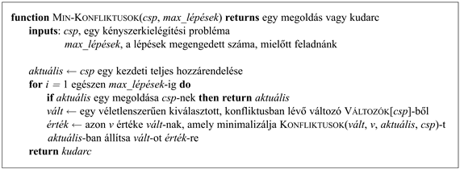
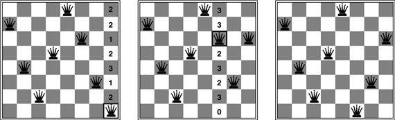

<?xml version="1.0" encoding="UTF-8" standalone="no"?>

<html xmlns="http://www.w3.org/1999/xhtml"><head><meta name="generator" content="DocBook XSL Stylesheets V1.76.1"/></head><body>

<h1 class="title"><a id="id565361"/>Lokális keresés kényszerkielégítési problémáknál</h1>

<a id="ID_197_oldal"/>
A lokális keresési algoritmusok (lásd 4.3. alfejezet) nagyon hatékonynak bizonyulnak sok kényszerkielégítési probléma megoldásában: a kiinduló állapot minden változóhoz értéket rendel, és az állapotátmenet-függvény működése során általában egyszerre csak egy változó értékét módosítja. A 8-királynő problémában például a kezdeti állapot lehet a 8 királynő véletlenszerű elhelyezése a 8 oszlopban, az állapotátmenet-függvény pedig kiemel egy királynőt, és megpróbálja a saját oszlopán belül máshova helyezni. Egy másik lehetőség lehetne, ha úgy indulnánk, hogy a 8 királynő mindegyikét egy külön oszlopba a nyolc sor permutációjával helyezzük el, és az  a következő állapotokat pedig két királynő sorának felcserélésével generálnánk.[<a id="id565369" href="#ftn.id565369" class="footnote">49</a>]Tulajdonképpen már láttunk egy példát lokális keresés alkalmazására egy CSP-probléma megoldásánál: ilyen volt a hegymászás alkalmazása a 8-királynő probléma megoldására <a class="xref" href="ch04s03.md#ID_155_oldal">„Hegymászó keresés”</a>. Egy másik alkalmazás a <code class="code">WALKSAT</code> <a class="xref" href="ch07s05.md#ID_278_oldal">„Lokális keresés algoritmus”</a> a kielégíthetőségi probléma megoldására, mely szintén egy speciális esete a kényszerkielégítési problémáknak.

Amikor egy változónak új értéket választunk, a legnyilvánvalóbban kínálkozó heurisztika annak az értéknek kiválasztása, amelyik a legkevesebb konfliktust eredményezi más változókkal. Ezt nevezik  <strong>min-konfliktusok</strong> (<strong>min-conflicts</strong>) heurisztikának. Az algoritmus az 5.8. ábrán látható, a 8-királynő problémára történő alkalmazását az 5.9. ábrán mutatjuk be, a kiértékelés eredménye pedig az 5.5. ábrán szerepel.

A min-konfliktusok heurisztika meglepően hatékony sok kényszerkielégítési probléma megoldásában, különösen amikor adott egy viszonylag jó kezdeti állapot. Teljesítményét az 5.5. ábra utolsó oszlopa mutatja. Meglepő módon az <em>n</em>-királynő probléma esetén a min-konfliktusok algoritmus futási ideje a kezdeti elhelyezéseket nem számítva nagyjából <em>független a probléma méretétől.</em> Akár a <em>millió</em>-királynő problémát is megoldja átlagosan ötven lépésben (a kezdeti értékadást követően). Ez a figyelemre méltó megfigyelés a kilencvenes években komoly kutatómunkához vezetett a lokális keresés, valamint a könnyű és nehéz problémák megkülönböztetése terén (ezzel a 7. fejezetben még foglalkozunk). Durván szólva az <em>n</em>-királynő azért könnyű a lokális keresés számára, mert a megoldások az állapottérben sűrűn helyezkednek el. A min-konfliktusok algoritmus nehéz problémák esetén is működik. Alkalmazták például a Hubble-űrtávcső megfigyeléseinek ütemezésére, és az egy hétre tervezett megfigyelések ütemezésének elkészítéséhez szükséges három hetet (!) körülbelül tíz percre rövidítette le.

<a id="id565415"/>
<strong>5.8. ábra - A <code class="code">MIN-KONFLIKTUSOK</code> algoritmus kényszerkielégítési problémák megoldására lokális kereséssel. A kezdeti állapotot véletlenszerűen választjuk ki, vagy egy mohó hozzárendelési folyamat segítségével, amely minden egyes sorra kerülő változónak egy minimális-konfliktus értéket választ. A <code class="code">KONFLIKTUSOK</code> függvény megszámolja az adott érték által megsértett kényszerek számát (adottnak tekintve az aktuális hozzárendelések fennmaradó részét).</strong>

A lokális keresés másik előnye az, hogy alkalmazható online elrendezésben is, amikor a probléma változik. Ez különösen fontos az ütemezési problémákban. Egy légitársaság heti ütemezése járatok ezreit és emberekhez rendelt feladatok tízezreit tartalmazhatja, de egy rossz időjárás az egyik repülőtéren lehetetlenné teheti az ütemezést. Ezt a lehető legkevesebb változtatással szeretnénk helyrehozni, amit a jelenlegi ütemezésből kiinduló lokális keresési algoritmussal végezhetünk el könnyen. Egy visszalépéses keresés a kényszerek egy új halmazával általában jóval több időbe telik, és olyan megoldást is találhat, amely jelentősen különbözik az aktuálistól.

<a id="id565434"/>
<strong>5.9. ábra - Egy kétlépéses megoldás a 8-királynő problémára a <code class="code">MIN-KONFLIKTUSOK</code> felhasználásával. Mindegyik fázisban egy királynőnek keresünk új oszlopot. A konfliktusok számát (esetünkben a támadó pozícióban lévő királynők számát) mindegyik négyzetben feltüntettük. Az algoritmus a királynőket a <code class="code">MIN-KONFLIKTUSOK</code> négyzetre viszi, véletlenszerűen törve fel ezzel a kötéseket.</strong>

 

[<a id="ftn.id565369" href="#id565369" class="para">49</a>]  A lokális keresés a célfüggvény bevezetésével könnyen kiterjeszthető egy kényszerkielégítési problémává. Ebben az esetben a hegymászásra és a szimulált lehűtésre használt összes technika alkalmazható a célfüggvény optimalizálására.

</body></html>
