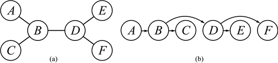
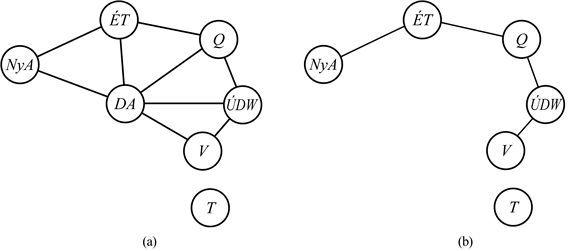
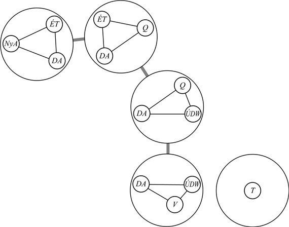

<?xml version="1.0" encoding="UTF-8" standalone="no"?>

<html xmlns="http://www.w3.org/1999/xhtml"><head><meta name="generator" content="DocBook XSL Stylesheets V1.76.1"/></head><body>

<h1 class="title"><a id="id565451"/>A problémák struktúrája</h1>

Ebben az alfejezetben azt vizsgáljuk meg, miként lehet a probléma <em>struktúráját,</em> ahogy azt a kényszergráf megmutatja, felhasználni a megoldások gyors keresésére. Az itt tárgyalt megközelítések java része nagyon általános és a kényszerkielégítési problémákon kívül más eseteknél is alkalmazható, például a valószínűségi következtetésnél. Végül is a részproblémákká történő dekompozíció az egyetlen mód, mellyel remélhetjük, hogy megbirkózhatunk a valósvilág-beli problémákkal. Ismét ránézve az 5.1. (b) ábrára, miközben a probléma struktúráját keressük, egy tény ötlik a szemünkbe ki: Tasmania nincs összeköttetésben a nagy szárazfölddel.[<a id="id565461" href="#ftn.id565461" class="footnote">50</a>] Napnál világosabb, hogy Tasmania színezése és a szárazföld színezése <strong>független részproblémá</strong>k (<strong>independent subproblem</strong>s): a szárazföld színezésének bármely megoldása és Tasmania színezésének bármely megoldása kombinálva egyben a teljes térkép színezésének is megoldása lesz. A függetlenségről könnyű megbizonyosodni a kényszergráf <strong>összefüggő komponens</strong>eit (<strong>connected component</strong>s) vizsgálva. Mindegyik komponens egy <em>CSPi</em> részproblémának felel meg. Ha az <em>Si</em> hozzárendelés egy megoldás a <em>CSPi</em> részproblémára, akkor az ∪<em>i Si </em>hozzárendelés megoldása lesz az ∪i <em>CSPi</em>-nek. Miért fontos ez? Gondoljunk bele a következőbe: tegyük fel, hogy minden egyes <em>CSPi</em>-nek <em>c</em> változója van az <em>n</em>-ből, ahol <em>c</em> konstans. Ekkor <em>n</em>/<em>c </em>részproblémánk van, amelyek mindegyike legfeljebb <em>dc </em>komplexitású. Tehát a teljes komplexitás <em>O</em>(<em>dcn</em>/<em>c</em>), ami lineáris <em>n</em>-ben, míg dekompozíció nélkül <em>O</em>(<em>dn</em>), ami exponenciális <em>n</em>-ben. Tegyük ezt még konkrétabbá: egy <em>n </em>=<em> </em>80-nal jellemzett Boole CSP-t négy részproblémává osztva (<em>c </em>= 20)<em> </em>a megoldás futási idejét a legrosszabb esetben is az univerzum élethosszáról a másodperc törtrészére rövidítjük le.

<h3 class="title">Fontos</h3>
A teljesen független részproblémák ínyencfalatok, de ritkák. A legtöbb esetben a kényszerkielégítési problémák részproblémái kapcsolatban vannak egymással. A legegyszerűbb eset az, amikor a kényszergráf egy <strong>fá</strong>t alkot: bármely két változót legfeljebb egy út köt össze. Az 5.10. (a) ábra egy sematikus példát mutat erre.[<a id="id565613" href="#ftn.id565613" class="footnote">51</a>] Meg fogjuk mutatni, hogy bármely <em>fastruktúrájú kényszerkielégítési probléma megoldható a változók száma szerinti lineáris időben.</em> Az algoritmusnak a következő lépései vannak:

<ol class="orderedlist"><li class="listitem">
Válasszuk ki bármelyik változót a fa gyökércsomópontjául, és rendezzük a többi változót a gyökértől a levelekig úgy, hogy mindegyik csomópontot a sorrendezésben megelőzzön a szülője (lásd 5.10. (b) ábra). Címkézzük ezeket a változókat sorban <em>X</em>1, …, <em>Xn</em>-nel. Most, a gyökércsomópontot leszámítva, mindegyik változónak pontosan egy szülője van.
</li><li class="listitem">
Alkalmazzuk az élkonzisztenciát (<em>Xi</em>,<em> Xj</em>)-re, ahol <em>Xi </em>szülője <em>Xj</em>-nek (<em>j</em> pedig fusson visszafelé <em>n</em>-től 2-ig), és szükség esetén vegyünk ki értékeket a <code class="code">TARTOMÁNY</code>[ <em>Xi</em>]-ből.
</li><li class="listitem">
Adjunk <em>Xj</em>-nek bármilyen, <em>Xi </em>hozzárendelt értékével konzisztens értéket ahol <em>Xi</em> szülője <em>Xj</em>-nek, és <em>j</em> 1-től <em>n</em>-ig halad.
</li></ol>

<a id="id565727"/>
<strong>5.10. ábra - (a) Egy faszerkezetű kényszerkielégítési probléma kényszergráfja. (b) Az <em>A</em> csomópont gyökérnek tekintésével konzisztens változók egy lineáris rendezése.</strong>

Két dolog érdemes említésre. Egyrészt a 2. lépés után a kényszerkielégítési probléma irány szerint élkonzisztens, tehát a 3. lépés hozzárendeléseiben nincsen szükség visszalépésre (lásd a <em>k</em>-konzisztencia tárgyalását a <a class="xref" href="ch05s02.md#ID_193_oldal">„A kényszerek terjesztése”</a> részben). Másrészt, miután a 2. lépésben fordított sorrendben alkalmaztuk az élkonzisztencia-ellenőrzéseket, elértük az algoritmussal, hogy a törölt értékek ne veszélyeztessék a már feldolgozott élek konzisztenciáját. A teljes algoritmus <em>O</em>(<em>nd</em>2)<em> </em>időben fut. 

Most, hogy fákra már van egy hatékony algoritmusunk, megvizsgálhatjuk, miként lehet az általánosabb kényszergráfokat valahogyan fákra <em>visszavezetni</em>. Alapvetően két mód van erre: az egyik a csomópontok eltávolításán, a másik a csomópontok összevonásán alapul.

Az első megközelítés úgy jár el, hogy néhány változónak értéket ad, a maradékok pedig fát fognak alkotni. Vegyük ismét az 5.11. (a) ábrán látható kényszergráfot az Ausztrália-példához. Ha törölni tudnánk Dél-Ausztráliát, akkor a gráf fává válhatna (ahogy az ábra (b) részén látható). Szerencsére meg tudjuk tenni ezt (a gráfban, nem a kontinensen) azzal, hogy <em>DA</em> értékét rögzítjük, és a többi változó tartományából töröljük azokat az értéket, melyek inkonzisztensek a <em>DA</em> számára választottal. 

Most tehát hogy mind <em>DA-</em>t, mind a rá vonatkozó kényszereket<em> </em>eltávolítottuk, a kényszerkielégítési probléma bármely megoldása konzisztens lesz a <em>DA</em> számára választott értékkel. (Ez bináris kényszerkielégítési problémák esetén működik; a helyzet jóval bonyolultabb magasabb rendű kényszerek esetén.) Tehát a keletkező fa a fenti algoritmussal megoldható, és így az egész problémát is megoldottuk. Általános esetben persze (nem úgy, mint a térképszínezésnél) a <em>DA</em> számára választott érték lehet rossz is, és ekkor egyesével végig kell próbálgatni őket. Az általános algoritmus az alábbi:

<ol class="orderedlist"><li class="listitem">
Válasszunk ki egy <em>S</em> részhalmazt a <code class="code">VÁLTOZÓK</code>[<em>csp</em>]-ből úgy, hogy a kényszergráf <em>S</em> eltávolítása után fa legyen. <em>S</em>-et <strong>ciklikusság-vágóhalmaz</strong>nak (<strong>cycle cutset</strong>) nevezzük.
</li><li class="listitem">
<em>S</em> minden egyes változójának minden egyes, az <em>S</em>-re vonatkozó összes kényszert kielégítő lehetséges hozzárendelésére:

<ol class="orderedlist"><li class="listitem">
vegyük ki a fennmaradó változók tartományaiból az <em>S</em> számára választott hozzárendeléssel inkonzisztens értékeket, és
</li><li class="listitem">
ha a fennmaradó kényszerkielégítési problémának van megoldása, akkor adjuk vissza ezt az <em>S</em> hozzárendelésével együtt.
</li></ol>
</li></ol>

Ha a ciklikusság-vágóhalmaz mérete <em>c</em>, akkor a teljes futási idő <em>O</em>(<em>dc</em> · (<em>n</em> – <em>c</em>)<em>d</em>2) lesz. Ha a gráf „közel fa”, akkor <em>c</em> kicsi lesz, a megtakarítás pedig tetemes a gondolkodás nélküli visszalépéses megoldáshoz képest. A legrosszabb esetben azonban <em>c</em> akár (<em>n</em> – 2) méretű is lehet. A <em>legkisebb</em> ciklikusság-vágóhalmaz megtalálása NP-nehéz probléma, de sok hatékony algoritmust ismerünk erre a feladatra. Az általános algoritmikus megközelítés a <strong>vágóhalmaz-kondicionálás</strong> (<strong>cutset conditioning</strong>); még találkozni fogunk ezzel a 14. fejezetben, ahol a valószínűségekről történő következtetésekhez használjuk.

<a id="id565915"/>
<strong>5.11. ábra - (a) Az 5.1. ábrán szereplő eredeti kényszergráf. (b) A kényszergráf <em>DA</em> eltávolítását követően.</strong>

A második megközelítés a kényszergráf több, egymással kapcsolatban lévő részproblémából álló <strong>fadekompozíció</strong> (<strong>tree decomposition</strong>) előállításán alapul. Mindegyik részproblémát függetlenül oldjuk meg, és a keletkező megoldásokat összekapcsoljuk. A legtöbb „oszd meg és uralkodj” típusú megközelítéshez hasonlóan ez is akkor működik, ha egyik részprobléma sem túl nagy. Egy fadekompozíciónak az alábbi követelményeket kell kielégítenie:

<ul class="itemizedlist"><li class="listitem">
Az eredeti probléma mindegyik változója szerepeljen a részproblémák legalább egyikében.
</li><li class="listitem">
Ha bármely két változót az eredeti problémában egy kényszer köt össze, akkor a részproblémák legalább egyikében együtt is elő kell fordulniuk (és természetesen a kényszernek is). 
</li><li class="listitem">
Ha egy változó a fa két részproblémájában is előfordul, akkor a változónak az ezeket a részproblémákat összekötő út minden részproblémájában is elő kell fordulnia.
</li></ul>

Az első két kikötés biztosítja, hogy az összes változó és kényszer előforduljon a dekompozícióban. A harmadik kikötés eléggé technikai ízűnek tűnik, de egyszerűen csak arról szól, hogy bármely adott változónak ugyanazzal az értékkel kell rendelkeznie az összes részproblémában, ahol előfordul – a részproblémákat a fában összekötő élek kényszerítik ezt ki. Például <em>DA</em> az 5.12. ábra mindegyik összekötött részproblémájában előfordul. Az olvasó az 5.11. ábra alapján igazolhatja, hogy van értelme ennek a dekompozíciónak.

Külön-külön megoldhatjuk az egyes részproblémákat, és ha bármelyiknek is nincs megoldása, akkor az egész problémának nincs. Ha az összes részproblémát meg tudjuk oldani, akkor a következők szerint megpróbálhatunk összeállítani egy globális megoldást. Először is tekintsünk minden egyes változót egy „megaváltozónak”, amelynek tartománya a részprobléma összes megoldásának halmaza. Például az 5.12. ábra bal szélső részproblémája az a térképszínezési probléma, amelynek három változója és – ezek szerint – hat megoldása van (ezek egyike az {<em>NyA </em>=<em> vörös</em>,<em> DA </em>=<em> kék</em>,<em> ÚT </em>= <em>zöld</em>}). Ezután a részproblémákat összekötő kényszereket meg tudjuk oldani a fákra adott fent bemutatott hatékony algoritmussal. A részproblémák közti kényszerek egyszerűen csak azért vannak, hogy a részproblémák megoldásai megegyezzenek az osztott változókban. Például, ha adott az {<em>NyA </em>=<em> vörös</em>,<em> DA </em>=<em> kék</em>,<em> ÚT </em>=<em> zöld</em>} megoldás az első részproblémára, akkor a következő részprobléma egyetlen konzisztens megoldása a {<em>DA </em>=<em> kék</em>,<em> ÚT </em>=<em> zöld</em>,<em> Q </em>=<em> vörös</em>} lehet.

<a id="id566029"/>
<strong>5.12. ábra - Az 5.11. ábra (a) részén szereplő kényszergráf egy fa dekompozíciója</strong>

<h3 class="title">Fontos</h3>
Egy adott kényszergráfnak több dekompozíciója is lehetséges; a dekompozíció kiválasztásakor az a cél, hogy a részproblémák a lehető legkisebbek legyenek. Egy gráf fadekompozíciójának <strong>faszélesség</strong>e (<strong>tree width</strong>) eggyel kisebb, mint a legnagyobb részprobléma mérete; magának a gráfnak a faszélessége pedig definíció szerint a legkisebb faszélesség az összes fadekompozíciója között. Ha egy gráfnak <em>w</em> a faszélessége, és adott a megfelelő fadekompozíció, akkor a problémát meg lehet oldani <em>O</em>(<em>ndw</em>+1) időben. Tehát <em>egy felülről korlátos faszélességű kényszergráffal rendelkező kényszerkielégítési probléma polinomiális időben megoldható</em>. Sajnálatos módon egy minimális faszélességű fadekompozíció megtalálása NP-nehéz probléma, de vannak olyan heurisztikus módszerek, amelyek jól működnek a gyakorlatban.

 

[<a id="ftn.id565461" href="#id565461" class="para">50</a>]  Egy nagyon gondos térképész vagy egy tasmaniai patrióta ellenvethetné, hogy Tasmaniát nem lehet ugyanolyan színnel színezni, mint a legközelebbi szárazföldi szomszédját, nehogy úgy tűnjön, <em>mintha</em> annak az államnak a része lenne.

[<a id="ftn.id565613" href="#id565613" class="para">51</a>]  Sajnos nagyon kevés olyan területe van a világnak (talán Celebesz ilyen), amelynek faszerkezetű térképe van. (Celebesz egy közelítőleg csillagstruktúrájú sziget Közép-Indonéziában – <em>A ford.</em>)

</body></html>
