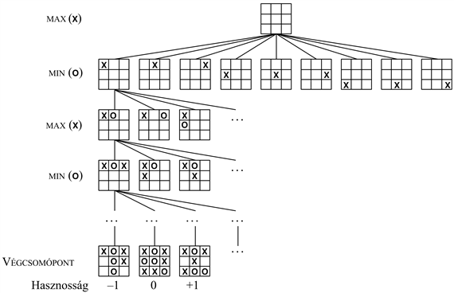
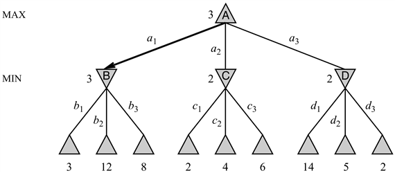
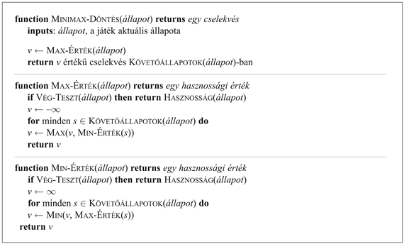
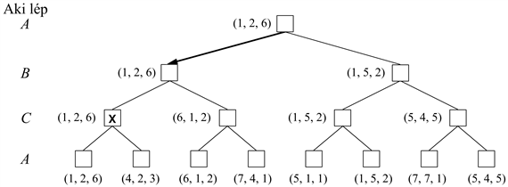

<?xml version="1.0" encoding="UTF-8" standalone="no"?>
<!DOCTYPE html PUBLIC "-//W3C//DTD XHTML 1.1//EN" "http://www.w3.org/TR/xhtml11/DTD/xhtml11.dtd">
<html xmlns="http://www.w3.org/1999/xhtml"><head><meta name="generator" content="DocBook XSL Stylesheets V1.76.1"/></head><body>

<h1 class="title"><a id="id569141"/>Optimális döntések kétszemélyes játékokban</h1>

A kétszemélyes játékokkal fogunk foglalkozni, ahol a két játékost – a hamarosan nyilvánvalóvá váló okból – <code class="code">MAX</code>-nak és <code class="code">MIN</code>-nek fogjuk hívni. <code class="code">MAX</code> lép először, majd a játékosok felváltva lépnek, amíg a játék véget nem ér. A játék végén a győztes játékos pontokat kap (vagy néha a vesztes kap büntetőpontokat). A játékot formálisan egyfajta keresési problémaként lehet definiálni az alábbi komponensekkel:

<ul class="itemizedlist"><li class="listitem">
A <strong>kiinduló állapot</strong> (<strong>initial state</strong>), ami magában foglalja a táblaállást, valamint azt, hogy ki fog lépni.
</li><li class="listitem">
Egy <strong>állapotátmenet-függvény</strong> (<strong>successor function</strong>), amely (<em>lépés</em>, <em>állapot</em>) párok listájával tér vissza, megadva a legális lépéseket és az azokból következő állapotokat.
</li><li class="listitem">
Egy <strong>végteszt</strong> (<strong>terminal test</strong>), ami meghatározza, hogy a játéknak mikor van vége. Azok az állapotok, ahol a játék befejeződött, a <strong>végállapot</strong>ok (<strong>terminal state</strong>s).
</li><li class="listitem">
Egy <strong>hasznosságfüggvény</strong> (<strong>utility function</strong>, amit <strong>nyereségfüggvény</strong>nek – <strong>payoff function</strong> – is neveznek) a játék végeredményéhez egy számértéket rendel. A sakkban a végeredmény győzelem, vereség vagy döntetlen lehet, amit a +1, –1 és 0 értékekkel ábrázolhatunk. Néhány játék ennél több végeredményre vezethet. Például az ostáblában a nyereség +192 és –192 között változhat. Ebben a fejezetben főleg a zérusösszegű játékokkal foglalkozunk, bár a nem zérusösszegű játékokat is megemlítjük.
</li></ul>

<a id="id569245"/>
<strong>6.1. ábra - A 3 × 3-as amőbajáték (részleges) keresési fája. A legfelső csomópont a kiinduló állapot. <code class="code">MAX</code> lép először, egy <code class="code">X</code>-et téve valamelyik üres négyzetbe. A keresési fa egy részét mutatjuk, <code class="code">MIN (O) </code> és <code class="code">MAX</code> váltakozó, egymást követő lépéseit megadva, amíg el nem érjük a végállapotokat, melyekhez a játék szabályai szerint lehet hasznossági értékeket hozzárendelni.</strong>

A kezdeti állapot és mindkét fél legális lépései a játék<strong> játékfá</strong>ját (<strong>game tree</strong>) definiálják. A 6.1. ábra a 3 × 3-as amőbajáték keresési fájának egy részét mutatja. Kezdeti állapotban <code class="code">MAX</code>-nak kilenc lehetséges lépése van. A játék során <code class="code">MAX</code> és <code class="code">MIN</code> felváltva tesznek <code class="code">X</code>-et illetve <code class="code">O</code>-t, míg egy végállapotnak megfelelő levélcsomópontba el nem jutnak, ahol az egyik játékosnak egy sorban, egy oszlopban vagy az egy átló mentén három <code class="code">O</code>-ja vagy <code class="code">X</code>-e lesz, vagy minden négyzet ki lesz töltve. Az egyes levélcsomópontok alatt található számok a végcsomópontnak a <code class="code">MAX</code> szempontjából mért hasznosságát jelölik. A nagy értékekről feltételezzük, hogy jók <code class="code">MAX</code> számára és rosszak <code class="code">MIN</code> számára (amiből a játékosok neve is ered). <code class="code">MAX</code> feladata, hogy a játékfát (és főleg a végállapotok hasznosságát) a legjobb lépés meghatározására használja fel.

<h2 class="title"><a id="id569321"/>Optimális stratégiák</h2>

Egy normális keresési problémánál, az optimális megoldás nem lenne más, mint a célállapothoz vezető lépések szekvenciája – azaz egy olyan végállapothoz vezető lépésszekvencia, amely a győzelmet jelenti. Egy játékban azonban <code class="code">MIN</code>-nek is van beleszólása a dologba. Ezért <code class="code">MAX</code>-nak egy olyan <strong>stratégiá</strong>t (<strong>strategy</strong>) kell találnia, amely meghatározza <code class="code">MAX</code> lépését a kezdeti állapotban, majd a <code class="code">MIN</code> lehetséges válaszaiból keletkező állapotokban, majd ismét <code class="code">MAX</code> lépéseit a <code class="code">MIN</code> erre vonatkozó lehetséges válaszaiból keletkező állapotokban és így tovább. Nagyjából azt lehet mondani, hogy egy optimális stratégia olyan kimenetelekhez vezet, amelyek legalább olyan jók, mintha bármilyen más stratégiával egy tévedhetetlen opponens ellen játszanánk. Először megmutatjuk, hogyan kell megkeresni az optimális stratégiát, bár ennek kiszámítására <code class="code">MAX</code>-nak általában nem lesz elegendő ideje az amőbánál bonyolultabb játékokban.

Még egy olyan egyszerű játék, mint az amőba is túl bonyolult ahhoz, hogy megmutassuk a teljes keresési fát, ezért áttérünk a 6.2. ábrán látható abszolút triviális játékra. <code class="code">MAX</code> lehetséges lépéseit <em>a</em>1-gyel, <em>a</em>2-vel és <em>a</em>3-mal címkéztük meg. Az <em>a</em>1-re <code class="code">MIN</code> lehetséges válaszait a <em>b</em>1, <em>b</em>2, <em>b</em>3 stb. jelölik. Ez a konkrét játék <code class="code">MAX</code> és <code class="code">MIN</code> egy-egy lépése után véget ér. (A játékok nyelvén azt mondjuk, hogy ez a fa egy lépés mély és két fél lépésből vagy <strong>lépésváltás</strong>ból (<strong>ply</strong>) áll.) A végcsomópontok hasznossága ebben a játékban 2 és 14 közé esik.

<a id="id569430"/>
<strong>6.2. ábra - Egy lépésváltásos játékfa. A Δ csomópontok <code class="code">MAX</code> lépéseit, míg a ∇ csomópontok <code class="code">MIN</code> lépéseit jelölik. A végcsomópontok a hasznossági függvénnyel számított hasznossági értékeket <code class="code">MAX</code> szemszögéből mutatják, míg a többi csomópontnál a minimax értékét jelöltük be. <code class="code">MAX</code> legjobb lépése a gyökérben <em>a</em>1, mert ez vezet a legmagasabb minimax értékű követőhöz. <code class="code">MIN</code> legjobb válasza <em>b</em>1, mert ez vezet a minimális minimax értékű követőhöz.</strong>

Adott játékfa mellett az optimális stratégia meghatározásához az egyes csomópontok <strong>minimax érték</strong>ét kell megvizsgálni, amit <code class="code">MINIMAX-ÉRTÉK</code> (<em>n</em>)-ként írunk le. Egy csomópont minimax értéke a csomópont hasznossága <code class="code">MAX</code> szemszögéből, feltéve, hogy innen kezdve egészen a játék befejezéséig <em>mindkét játékos optimálisan lép</em>. Egy végállapot minimax értéke természetesen a saját hasznossága. Továbbá, adott minimax értékek mellett, <code class="code">MAX</code> szeretne a maximális értékű, <code class="code">MIN</code> pedig a minimális értékű állapotba jutni. Rendelkezünk tehát az alábbi függvénnyel:

<table border="0"><colgroup><col width="11.1pt" class="col1"/><col width="192.9pt" class="col2"/><col width="170.3pt" class="col3"/></colgroup><tbody><tr><td colspan="3" style="text-align: justify" valign="top">
<code class="code">MINIMAX-ÉRTÉK</code> (<em>n</em>) =
</td></tr><tr><td style="text-align: justify" valign="top"> </td><td style="text-align: justify" valign="top">
<code class="code">HASZNOSSÁG</code> (<em>n</em>)
</td><td style="text-align: justify" valign="top">
ha <em>n</em> egy végállapot,
</td></tr><tr><td style="text-align: justify" valign="top"> </td><td style="text-align: justify" valign="top">
max<em>s</em>∈<em>Követők</em>(<em>n</em>) <code class="code">MINIMAX-ÉRTÉK</code>(<em>s</em>)
</td><td style="text-align: justify" valign="top">
ha <em>n</em> egy <code class="code">MAX</code> csomópont,
</td></tr><tr><td style="text-align: justify" valign="top"> </td><td style="text-align: justify" valign="top">
min<em>s</em>∈<em>Követők</em>(<em>n</em>) <code class="code">MINIMAX-ÉRTÉK</code>(<em>s</em>)
</td><td style="text-align: justify" valign="top">
ha <em>n</em> egy <code class="code">MIN</code> csomópont.
</td></tr></tbody></table>

Alkalmazzuk ezeket a definíciókat a 6.2. ábrán látható játékfára. Az ábra alján lévő célállapotokat már felcímkéztük hasznossági értékükkel. Az első, <em>B</em> címkéjű, <code class="code">MIN</code> csomópontnak három követője van 3, 12 és 8 értékkel, a <em>B</em> csomópont minimax értéke tehát 3. Hasonlóan a két másik <code class="code">MIN</code> csomópontnak 2 a minimax értéke. A gyökér egy <code class="code">MAX</code> csomópont; a követőinek minimax értékei 3, 2, és 2, így a gyökér minimax értéke 3. Azonosíthatjuk a gyökér <strong>minimax döntés</strong>ét (<strong>minimax decision</strong>) is. <code class="code">MAX</code> számára az <em>a</em>1 cselekvés az optimális választás, mert maximális értékű követőhöz vezet.

Ezen optimális játékdefiníció <code class="code">MAX</code> számára feltételezi, hogy <code class="code">MIN</code> is optimálisan játszik – hiszen a dolgok kimenetelét <code class="code">MAX</code> számára a legrosszabb esetre kivetítve maximalizálja. Mi van azonban, ha <code class="code">MIN</code> nem játszik optimálisan? Ekkor könnyű belátni (6.2. feladat), hogy <code class="code">MAX</code> még jobban jár. Szuboptimális ellenféllel szemben sok stratégia elképzelhető, amely az optimálisnál jobb, azonban ezek a stratégiák rosszabbnak fognak bizonyulni optimális ellenfelekkel szemben.

<h2 class="title"><a id="id569755"/>A minimax algoritmus</h2>

A <strong>minimax algoritmus</strong> (<strong>minimax algorithm</strong>) (6.3. ábra) az optimális döntést az aktuális állapotból számítja ki, felhasználva az egyes követő állapotok minimax értékeinek kiszámítására a definiáló egyenletekből közvetlenül származtatott, egyszerű rekurzív formulát. A rekurzió egészen a falevelekig folytatódik, majd a minimax értékeket a fa mentén <strong>visszafelé terjeszt</strong>jük (<strong>back-up</strong>), ahogy a rekurzió visszalép. A 6.2. ábrán például az algoritmus először rekurzív módon leereszkedik a három bal alsó csomóponthoz, a <code class="code">HASZNOSSÁG</code> függvénnyel kiszámítva, hogy az értékek rendre 3, 12, és 8. Majd az algoritmus előveszi ezen értékek minimumát, azaz 3-t, és ezt adja vissza, ahogy a <em>B</em> csomóponthoz visszatér. Hasonló procedúra eredményezi a további visszaadott értékeket: 2-t a <em>C</em> és 2-t a <em>D</em> csomópont számára. Végül vesszük a 3, 2 és 2 értékek maximumát, hogy a gyökér által visszaadott 3-as értéket megkaphassuk.

A minimax algoritmus a játékfa teljes mélységi feltárását végzi. Ha a fa maximális mélysége <em>m</em>, és minden csomópontban <em>b</em> legális lépés létezik, akkor a minimax algoritmus időkomplexitása <em>O</em>(<em>bm</em>). A tárkomplexitása <em>O</em>(<em>bm</em>) egy olyan algoritmus számára, amely az összes követőt egyszerre számítja ki, és <em>O</em>(<em>m</em>) egy olyan algoritmus esetében, amely a követőket egyenként generálja <a class="xref" href="ch03s04.md#ID_115_116_oldal">„Mélységi keresés”</a>. Valós játékok esetén ez az időkomplexitás az algoritmust teljesen haszontalanná teszi, az algoritmus azonban jó alap a játékok matematikai elemzéséhez és a gyakorlati szempontból alkalmasabb algoritmusokhoz.

<a id="id569832"/>
<strong>6.3. ábra - Egy algoritmus a minimax döntések kiszámítására. Az algoritmus a lehető legjobb lépéshez tartozó operátort adja vissza, vagyis ahhoz a lépéshez tartozó operátort, amelyik a legnagyobb hasznossági értékkel rendelkező eredményre vezet, feltételezve, hogy az ellenfél úgy játszik, hogy minimalizálja a hasznossági értéket. A <code class="code">MAX-ÉRTÉK</code> és <code class="code">MIN-ÉRTÉK</code> függvények végigmennek a teljes játékfán, le egészen a levélcsomópontokig, hogy meghatározzák a csomópont felfelé terjesztett értékét.</strong>

<h2 class="title"><a id="id569849"/>Optimális döntések többszemélyes játékokban</h2>

Számos elterjedt játékban több játékos is részt vehet, nem csupán kettő. Vizsgáljuk meg, hogy a minimax ötletet hogyan terjeszthetjük ki többszemélyes játékok esetére. Technikai szempontból a dolog egyszerű, azonban felmerül néhány érdekes koncepcionális kérdés.

Először is egy csomópontokhoz rendelt egyetlen értéket egy értékvektorral kell felváltani. Például egy háromszemélyes játékban, ahol három játékos, <em>A</em>, <em>B</em> és <em>C</em> vesz részt, minden csomóponttal egy 〈<em>vA</em>, <em>vB</em>, <em>vC</em>〉 vektort társítunk. Végállapotok esetén ez a vektor megadja az állapot hasznosságát minden játékos szemszögéből (kétszemélyes zérusösszegű játékokban a kételemű vektort egy értékre le lehet egyszerűsíteni, mert az értékek mindig ellentétesek). Ezt a kibővítést legjobb úgy implementálni, hogy a <code class="code">HASZNOSSÁG</code> függvény adja vissza a hasznosságok vektorát.

Most a nem terminális állapotokkal foglalkozunk. Nézzük meg a 6.4. ábrán látható játékfában az <em>X</em> jelzésű csomópontot. Ebben az állapotban a <em>C</em> játékos dönti el, hogy mit csináljon. Egyik választása a 〈<em>vA</em> = 1, <em>vB</em> = 2, <em>vC</em> = 6〉, míg a másik a 〈<em>vA</em> = 4, <em>vB</em> = 2, <em>vC</em> = 3〉 vektorokkal rendelkező végállapothoz vezet. Mivel 6 több, mint 3, <em>C</em>-nek az első lépést kellene választania. Ez azt jelenti, hogy ha a játék az <em>X</em> csomópontot eléri, a következő lépés a 〈<em>vA</em> = 1, <em>vB</em> = 2, <em>vC</em> = 6〉 hasznosságú végállapothoz fog vezetni. <em>X</em> visszaadott értéke így ez a vektor. Általánosságban egy <em>n</em> csomópont visszaadott értéke annak a követőnek a hasznosságvektora, amely követőnek az <em>n</em> csomópontnál választó játékos szempontjából legnagyobb az értéke.

<a id="id569972"/>
<strong>6.4. ábra - Három játékos (<em>A</em>, <em>B</em>, <em>C</em>) játékfája a három első fél lépés esetén. Minden csomópontot az összes játékos szemszegéből számított értékkel címkéztük meg. A legjobb lépést a gyökérnél jelöltük be.</strong>

Mindenki, aki olyan többszemélyes játékokat játszik, mint például a DiplomacyΤΜ, gyorsan meggyőződhet, hogy a kétszemélyes játéknál sokkal többről van itt szó. Többszemélyes játékban a játékosok között általában lehetségesek formális vagy informális <strong>szövetség</strong>ek (<strong>aliance</strong>s). A játék előrehaladtával szövetségek köttetnek és bontatnak fel.

Hogyan is kellene értelmezni egy ilyen viselkedést? Természetes következménye-e a szövetség az egyes játékosok optimális stratégiáinak egy többjátékos játékban? Úgy tűnik, hogy ez igaz lehet. Tegyük fel például, hogy <em>A</em> és <em>B</em> gyengén, míg <em>C</em> erősebben áll. Akkor néha optimális mind <em>A</em>, mind <em>B</em> számára, ha nem egymást, hanem <em>C</em>-t támadják meg, hogy az egyenként ne végezzen velük. Ily módon az együttműködés tisztán egoista viselkedésből is kialakulhat. Persze ahogy az együttes támadásnak kitett <em>C</em> gyengül, a szövetség értéke csökken, és vagy <em>A</em>, vagy <em>B</em> a megegyezést megszegheti. Egyes esetekben az explicit szövetségek az úgyis bekövetkezendő eseményeket rögzítik konkrét módon. Más esetekben szociális megbélyegzés jár a szövetség megszegéséért, így a játékosnak mérlegelnie kell a szövetség megszegésének rövid idejű előnyét és a szavahihetetlenként való megbélyegzés hosszú távú hátrányát. (Az ilyen bonyodalmakról többet a 17.6. alfejezetben.)

Ha a játék nem zérusösszegű, akkor együttműködés két játékos esetén is létrejöhet. Tegyük fel például, hogy létezik olyan végállapot, amelynek hasznossága 〈<em>vA</em> = 1000, <em>vB</em> = 1000〉, és 1000 mindkét játékos számára az elérendő legnagyobb hasznosság. A két játékos optimális stratégiája akkor az, hogy ennek az állapotnak az elérése érdekében mindent megtesznek – azaz a két játékos automatikusan kooperálni fog, hogy a kölcsönösen előnyös célt elérjék.

</body></html>
