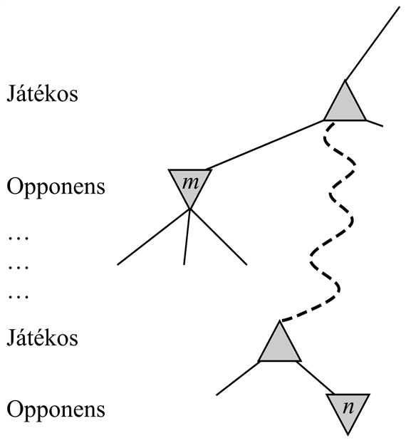
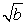
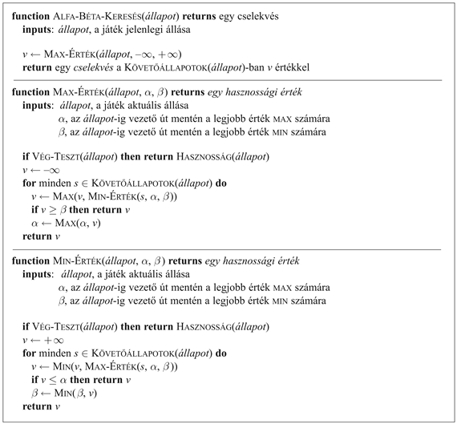

<?xml version="1.0" encoding="UTF-8" standalone="no"?>
<!DOCTYPE html PUBLIC "-//W3C//DTD XHTML 1.1//EN" "http://www.w3.org/TR/xhtml11/DTD/xhtml11.dtd">
<html xmlns="http://www.w3.org/1999/xhtml"><head><meta name="generator" content="DocBook XSL Stylesheets V1.76.1"/></head><body>

<h1 class="title"><a id="id570057"/>Alfa-béta nyesés</h1>

A minimax keresés problémája, hogy a játékban a megvizsgálandó állapotok száma exponenciális a lépések számában. A kitevőtől sajnos megszabadulni nem tudunk, ám lényegében megfelezhetjük. A trükk az, hogy lehetséges a korrekt minimax döntés kiszámítása anélkül, hogy a játékfában minden csomópontra rá kelljen nézni. Ehhez kölcsönözhetjük a 4. fejezetben megismert <strong>nyesés</strong> (<strong>prunning</strong>) gondolatát, és a játékfa nagyobb részét a megfontolásokból kihagyhatjuk. A konkrét vizsgált technika az <strong>alfa-béta nyesés</strong> (<strong>alpha-beta prunning</strong>). Ha ezt egy standard minimax fára alkalmazzuk, ugyanazt az eredményt adja vissza, mint a minimax, a döntésre hatással nem lévő ágakat azonban lenyesi.

Tekintsük ismét a 6.2. ábrán látható egylépésváltásos játékfát. Kövessük még egyszer az optimális döntés kiszámításának menetét, most azonban kísérjük figyelemmel, hogy mit is tudunk valójában a folyamat minden pontjában. A lépésekhez a 6.5. ábra ad magyarázatot. Az eredmény az, hogy meg tudjuk határozni a minimax döntést anélkül, hogy a két levélcsomópontot bármikor is megnéznénk.

A módszert értelmezhetjük másképpen is, mint a <code class="code">MINIMAX-ÉRTÉK</code> függvény egy egyszerűsítését. Legyen a <em>C</em> csomópontot a 6.5. ábrán látható, ki nem értékelt követő csomópontok értéke <em>x</em> és <em>y</em>, és legyen <em>z</em> a kettő minimuma. A gyökércsomópont értéke ekkor:

<code class="code">MINIMAX-ÉRTÉK</code> (<em>gyökér</em>) = max(min(3, 12, 8), min(2, <em>x</em>, <em>y</em>), min(14, 5, 2)

			   = max(3, min(2, <em>x</em>, <em>y</em>), 2)

			  = max(3, <em>z</em>, 2)		ahol <em>z</em> ≤ 2

			   = 3

Más szóval a gyökér értéke és így a minimax döntés <em>független</em> a lenyesett levelek <em>x</em> és <em>y</em> értékeitől.

<h3 class="title">Fontos</h3>
Az alfa-béta nyesést tetszőleges mélységű fákra lehet alkalmazni, és sokszor lehetséges, hogy levelek helyett teljes részfákat nyessünk le. Az általános elv az alábbi: tekintsünk egy olyan <em>n</em> csomópontot valahol a fa belsejében (lásd 6.6. ábra), hogy a Játékosnak lehetősége legyen e csomópontba lépni. Ha a Játékosnak van az <em>n</em> szülőcsomópontjánál vagy ettől feljebb bármelyik döntési pontban egy jobb választása, <em>m</em>, akkor <em>az n-t az aktuális játékban soha nem érjük el</em>. Ha az <em>n</em>-ről tehát (néhány követőjének megvizsgálásával) már eleget tudunk, hogy ehhez a konklúzióhoz jussunk, a csomópontot nyugodtan lenyeshetjük.

Emlékezzünk, hogy a minimax keresés mélységi keresés, egy adott időben tehát elegendő a fában egy egyedi út menti csomópontokkal foglalkozni. Az alfa-béta nyesés megnevezése két paramétertől származik, mely paraméterek az út mentén megjelenő visszaléptetett értékek korlátjaira vonatkoznak:

α = az út mentén tetszőleges döntési pontban a <code class="code">MAX</code><em> </em>számára eddig megtalált legjobb (azaz a legmagasabb értékű) választás értéke.

<em>β</em> = az út mentén tetszőleges döntési pontban a <code class="code">MIN</code><em> </em>számára eddig megtalált legjobb (azaz a legkisebb értékű) választás értéke.

<a id="id570199"/>
<strong>6.5. ábra - Az optimális döntés kiszámításának lépései a 6.2. ábrán látható játékfa esetén. Minden ponton a lehetséges értékek terjedelmét mutatjuk meg minden egyes csomópont számára. (a) A <em>B</em> csomópont alatt az első levélnek 3 az értéke. <em>B</em> tehát, ami egy <code class="code">MIN</code> csomópont, <em>legfeljebb</em> 3 értékű. (b) A <em>B</em> alatti második csomópontnak 12 az értéke. <code class="code">MIN</code> ezt a lépést elkerüli, így <em>B</em> értéke még mindig legfeljebb 3. (c) A <em>B</em> alatti harmadik levélnek 8 az értéke. <em>B</em> összes követőit láttuk már, <em>B</em> értéke tehát pontosan 3. Most azt következtethetjük ki, hogy a gyökér értéke <em>legalább</em> 3, mert <code class="code">MAX</code>-nak a gyökérben 3-as értékű választása van. (d) A <em>C</em> alatti első levélnek 2 az értéke. <em>C</em> tehát, ami egy <code class="code">MIN</code> csomópont, <em>legfeljebb</em> 2 értékű. De mi tudjuk már, hogy <em>B</em>-nek 3 az értéke, <code class="code">MAX</code> tehát <em>C</em>-t soha nem fogja választani. Azért nem is érdemes <em>C</em> további követőit megvizsgálni. Ez az alfa-béta nyesés egy példája. (e) A <em>D</em> alatti első levélnek 14 az értéke, így <em>D</em> értéke <em>legfeljebb</em> 14. Ez több mint <code class="code">MAX</code> legjobb alternatívája (azaz 3), meg kell vizsgálni ezért <em>D</em> követőit. Jegyezzük meg, hogy most a gyökér minden követője esetén rendelkezünk értékkorláttal, a gyökér értéke legfeljebb 14. (f) <em>D</em> második követőjének értéke 5, így tovább kell folytatnunk a vizsgálatot. A harmadik követő értéke 2, <em>D</em> értéke tehát pontosan 2. <code class="code">MAX</code> döntése a gyökérnél, hogy <em>B</em> felé kell lépni, 3-as értékkel.</strong>

Az alfa-béta keresés az α és a <em>β</em> értékeit munka közben frissíti, és a csomópontnál a megmaradó ágakat lenyesi (a rekurzív hívást terminálja), amint csak biztossá válik, hogy az aktuális csomópont értéke rosszabb lesz, mint az aktuális α és <em>β</em> érték, <code class="code">MAX</code>-ra, illetve <code class="code">MIN</code>-re. A teljes algoritmust a 6.7. ábra mutatja. Bátorítjuk az olvasót, hogy a 6.5. ábrán látható fára alkalmazva, kövesse végig az algoritmus működését.

Az alfa-béta nyesés hatékonysága erősen függ a követő csomópontok vizsgálatának sorrendjétől. Például a 6.5. (e) és (f) ábrán <em>D</em> egyetlen követőjét sem lehetne lenyesni, mert először a legrosszabb követőt (<code class="code">MIN</code> szemszögéből) generáltuk. Ha a harmadik követőt elsőnek generálnánk, a maradó kettőt le lehetne nyesni. Ez azt sugallja, hogy érdemes lenne először a legjobbnak tűnő csomópontokat megvizsgálni.

<a id="id570341"/>
<strong>6.6. ábra - Alfa-béta nyesés: általános eset. Ha <em>m</em> a Játékos számára jobb, mint <em>n</em>, akkor a játék során sosem fogunk elérni <em>n</em>-be.</strong>

Ha feltételezzük, hogy ez megtehető,[<a id="id570363" href="#ftn.id570363" class="footnote">56</a>] akkor az alfa-béta nyesésnek elég az <em>O</em>(<em>b</em><em>m</em>/2) csomópontot megvizsgálni, a legjobb lépés kiszámításához, a minimax <em>O</em>(<em>bm</em>) értékével szemben. Ez azt jelenti, hogy az effektív elágazási tényező<em> b</em> helyett  lesz – például a sakk esetében 35 helyett 6. Más szóval, az alfa-béta nyesés ugyanannyi idő alatt kétszer olyan messzire néz, mint a minimax. Ha a követő csomópontokat véletlen sorrendben vizsgálnánk a legjobbat-először helyett, a vizsgált csomópontok össz-száma <em>O</em>(<em>b</em>3<em>m</em>/4) lenne, mérsékelt értékű <em>b</em>-kre. A sakk esetében egy igen egyszerű rendezőfüggvény (mint például az, hogy először a leütésekkel, majd a támadásokkal, ezt követően az előrelépésekkel és végül a hátralépésekkel próbálkozunk) a legjobb esetre vonatkozó <em>O</em>(<em>b</em><em>m</em>/2) eredményt egy 2-es tényező erejéig közelíti meg. Dinamika hozzáadása a lépésrendező sémákhoz, mint például azokkal a lépésekkel próbálkozni először, amelyek legutóbb a legjobbnak bizonyultak, az elvi korláthoz egészen közel visz.

A 3. fejezetben megjegyeztük, hogy a keresési fában az ismétlődő állapotok a keresési költségekben exponenciális növekedéshez is vezethetnek. Játékokban gyakran előfordulnak ismétlődő állapotok a <strong>transzpozíció</strong>k (<strong>transposition</strong>s) – a lépési szekvenciának az ugyanahhoz az álláshoz vezető különböző permutációi – miatt. Ha például Fehér lépése <em>a</em>1, amire Fekete <em>b</em>1 lépéssel válaszolhat, és a tábla más részén van egy vele nem kapcsolatos <em>a</em>2 lépése, amire Fekete <em>b</em>2-vel válaszolhat, akkor az [<em>a</em>1, <em>b</em>1, <em>a</em>2, <em>b</em>2] és az [<em>a</em>1, <em>b</em>2, <em>a</em>2, <em>b</em>1] szekvenciák mind ugyanabban az állásban végződnek (ahogy ebben az állásban végződik az előbbi lépések minden <em>a</em>2-vel kezdődő permutációja). Érdemes ennek az állásnak a kiértékelését az első előforduláskor egy hash-táblában eltárolni, mert így a későbbi előfordulásoknál a kiszámítás megismétlését megspóroljuk.

Az előbb látott pozíciók hash-tábláját hagyományosan<strong> transzpozíciós táblá</strong>nak (<strong>trans</strong><strong>position table</strong>) hívják. Ez lényegében azonos a <code class="code">GRÁF-KERESÉS</code> <em>zárt</em> listájával <a class="xref" href="ch03s05.md#ID_122_oldal">„Az Ismételt állapotok elkerülése”</a>. A transzpozíciós tábla használata drámai hatású lehet és a sakkban néha az elérhető mélység megduplázásához vezet. Másrészt ha másodpercenként a csomópontok millióit értékeljük ki, nem praktikus ezeket <em>mind</em> a transzpozíciós táblában tartani. A legértékesebb csomópontok megválasztására különböző stratégiákat dolgoztak ki.

<a id="id570553"/>
<strong>6.7. ábra - Az alfa-béta keresési algoritmus. Ugyanazt a számítást hajtja végre, mint egy normál minimax algoritmus a 6.3. ábrán, kivéve két sort a <code class="code">MAX-ÉRTÉK</code> és a <code class="code">MIN-ÉRTÉK</code> hívásokban, ahol az α és a β értékeket kezeli (és adminisztrálja e paraméterek átadását).</strong>

 

[<a id="ftn.id570363" href="#id570363" class="para">56</a>]  Természetesen nem tökéletes módon, különben a sorbarendező-függvény segítségével egy hibátlan játékot tudnánk játszani.

</body></html>
