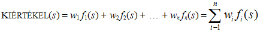
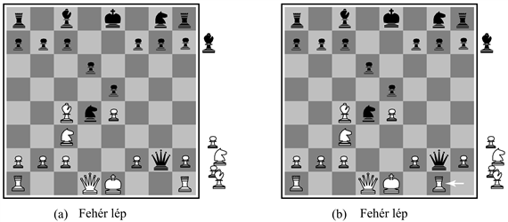
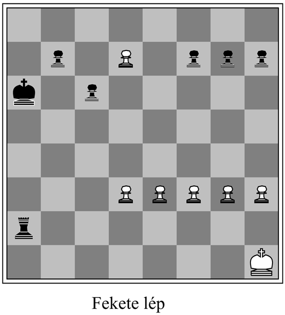

<?xml version="1.0" encoding="UTF-8" standalone="no"?>
<!DOCTYPE html PUBLIC "-//W3C//DTD XHTML 1.1//EN" "http://www.w3.org/TR/xhtml11/DTD/xhtml11.dtd">
<html xmlns="http://www.w3.org/1999/xhtml"><head><meta name="generator" content="DocBook XSL Stylesheets V1.76.1"/></head><body>

<h1 class="title"><a id="id570570"/>Nem tökéletes, valós idejű döntések</h1>

A minimax algoritmus a játék egész keresési terét állítja elő, az alfa-béta nyesés viszont lehetőséget ad annak nagy részét lenyesni. Az alfa-béta nyesésnek mégis a végállapotokig kell keresnie legalább a keresési tér egy részében. Ez a mélység általában nem praktikus, mert a lépéseket elfogadható idő alatt – tipikusan legfeljebb percek alatt – kell megtenni. Shannon az 1950-es <em>Programming a computer for playing chess</em> c. cikkében azt javasolta, hogy a programnak a keresést korábban kell abbahagynia, és a csomópontokra egy heurisztikus <strong>kiértékelő függvény</strong>t (<strong>evaluation function</strong>) kell alkalmaznia, a nem végállapotokat lényegében végállapotoknak tekintve. Más szóval a minimaxot vagy az alfa-bétát kétféle módon kellene módosítani: a hasznossági függvényt egy heurisztikus <code class="code">KIÉRTÉKEL</code> kiértékelő függvény helyettesíti, amely az állás hasznosságának egy becslését adja meg, valamint a célállapottesztet egy <strong>vágási teszt</strong> (<strong>cutoff test</strong>) váltja fel, amely eldönti, hogy <code class="code">KIÉRTÉKEL</code>-t kell-e alkalmazni.

<h2 class="title"><a id="id570606"/>Kiértékelő függvények</h2>

Egy kiértékelő függvény egy adott állásból kiindulva a játék várható hasznosságának <em>becslését</em> adja vissza, éppúgy, ahogy a 4. fejezet heurisztikus függvénye a céltól való távolság becslését adja. A becslés ötlete, amikor Shannon felvetette, nem számított újnak. A sakkozók (és természetesen más játékok szerelmesei) az évszázadok során kifejlesztettek olyan módszereket, amelyekkel mérlegelni tudták egy állás értékét, hiszen a keresés mennyiségének tekintetében az emberek még inkább korlátozottak, mint a számítógépes programok. Nyilvánvaló, hogy egy játékprogram teljesítménye függ az alkalmazott kiértékelő függvény minőségétől. Egy pontatlan függvény a programot olyan állásokhoz vezeti, amelyek valójában vesztes pozíciók. Milyen pontosan tudunk jó kiértékelő függvényeket tervezni?

Először is a kiértékelő függvénynek a <em>végállapotokat</em> ugyanúgy kellene sorba rendeznie, mint az igazi hasznosságfüggvénynek, máskülönben az azt használó ágens még akkor is szuboptimális lépéseket választhatna, ha történetesen a játék végéig előre látna mindent. Másodsorban a kiértékelő függvény kiértékelése nem tarthat túl sokáig! (A kiértékelő függvény szubrutinként meg tudná hívni a <code class="code">MINIMAX-DÖNTÉS</code>-t, és ki tudná számítani a pozíció pontos értékét, ez azonban az egész gyakorlat értelmét – az időmegtakarítást – megkérdőjelezné.) Harmadsorban a nem végállapotok tekintetében a kiértékelő függvénynek pontosan kell tükröznie a nyerés valódi esélyét.

El lehet merengeni a „nyerés esélye” kifejezésen. Végül is a sakk nem szerencsejáték, az aktuális állapotot biztosan tudjuk, és nincs a dologban kockavetés. Ha azonban egy nem végállapotban levágtuk a keresést, akkor az algoritmus szükségszerűen bizonytalan lesz annak valódi kimenetelében. Ezt a bizonytalanságot nem információs, hanem inkább számítási korlátok okozzák. Ha a kiértékelő függvény egy adott állapotban csak egy bizonyos mennyiségű számítást végezhet el, a legjobb, amit tehet, hogy kitalálja a végkimenetelt. 

Próbáljuk meg ezt az ötletet pontosan megfogalmazni. A kiértékelő függvények többsége az állapot különböző <strong>tulajdonság</strong>ait (<strong>feature</strong>s) kiszámítva dolgozik – a sakkban például ilyen a mindkét félnél lévő gyalogok száma. A tulajdonságok, egybevéve, az állapotok különböző <em>kategóriáit,</em> avagy <em>ekvivalenciaosztályait</em> definiálják: az egyes kategóriákhoz tartozó állapotok az összes tulajdonság szempontjából ugyanazt az értéket képviselik. Minden egyes kategória általánosságban tartalmazni fog olyan állapotokat, melyek győzelemhez vezetnek, olyanokat, amelyek döntetlent eredményeznek, és olyanokat, amelyek vereséggel végződnek. A kiértékelő függvény nem tudhatja, hogy melyik állapot melyik, azonban visszatérhet egyetlen olyan értékkel, amely tükrözi az egyes kimenetelekhez tartozó állapotok <em>arányát</em>. Tegyük fel például, hogy a tapasztalatunk azt sugallja, hogy a kategóriához tartozó állapotok 72%-a vezet győzelemhez (+1 hasznosság), 20%-a vesztéshez (–1 hasznosság) és 8%-a döntetlenhez (0 hasznosság). Akkor a kategóriához tartozó állapotok értelmes értékelése a súlyozott átlag vagy a <strong>várható érték</strong> (<strong>expected value</strong>): (+1 × 0,72) + (–1 × 0,20) + (0 × 0,08) = 0,52. Elvben a várható értéket minden kategóriára meg lehetne határozni, ami egy tetszőleges állapot esetén is működő kiértékelő függvényhez vezetne. A végállapotokhoz hasonlóan, a kiértékelő függvénynek nem kell tényleges várható értékeket visszaadnia, amíg az állapotok <em>sorba rendezése</em> ugyanaz.

A gyakorlatban az ilyen elemzés túl sok kategóriát és így túl sok tapasztalatot kíván ahhoz, hogy a győzelem valószínűségét megállapítsuk. A kiértékelő függvények többsége ehelyett az egyes tulajdonságokból adódó numerikus értékeket külön számítja, majd a végleges értéket ezek <em>kombinációjaként</em> határozza meg. A kezdőknek szánt sakk-könyvek például egy közelítő <strong>pontérték</strong>et (<strong>material value</strong>) rendelnek minden egyes bábuhoz: minden gyalog 1 pontot, egy huszár vagy egy futó 3 pontot, egy bástya 5 pontot, míg egy vezér 9 pontot ér. Más jellemzők, mint például egy „jó gyalogstruktúra” és a „király biztonsága” érhetnek mondjuk egy fél gyalogot. Az állás kiértékeléséhez ezeket az értékeket egyszerűen összeadjuk. Egy gyaloggal ekvivalens biztonságos előny a győzelem lényeges valószínűségét adja, három gyaloggal ekvivalens biztonságos előny majdnem biztos győzelemhez vezet, ahogy ezt a 6.8. (a) ábra mutatja. Az ilyen típusú kiértékelő függvényt a matematikában <strong>súlyozott lineáris függvény</strong>nek (<strong>weighted linear function</strong>) nevezik, mert kifejezhető az alábbi alakban:

ahol a <em>w</em>-k a súlyok és az <em>f</em>-ek az adott táblaállás jellemzői. Sakk esetében az <em>fi</em>-k a táblán levő egyes bábufajták számát jelölhetik és a <em>wi</em>-k a bábukhoz rendelt pontértékek (gyalog 1, futó 3 stb.) lehetnek. 

A tulajdonságértékek összeadása értelmes dolognak tűnik, azonban ezzel valójában egy igen erős feltételezéssel élünk: t. i. hogy az egyes tulajdonságok hozzájárulásai más tulajdonságok értékeitől <em>függetlenek</em>. A 3-as érték hozzárendelése a futóhoz figyelmen kívül hagyja például azt, hogy a végjátékban, amikor sok tér áll rendelkezésre a manőverezéshez, a futó erősebb. Ezért a jelenlegi sakk- és más játékokat játszó programok a tulajdonságok <em>nemlineáris</em> kombinációit is használják. Egy futópár egy kicsit értékesebb lehet például, mint egy futó értékének kétszerese, és egy futó a végjátékban értékesebb, mint a nyitásnál.

<a id="id570728"/>
<strong>6.8. ábra - Két, kissé eltérő sakktáblaállás. (a) Feketének egy huszár és két gyalog előnye van, és a játékot megnyeri. (b) Fekete veszít, miután Fehér a vezérét leüti.</strong>

Az éles elméjű olvasó észreveszi, hogy a tulajdonságok és a súlyok a sakk szabályainak<em> nem</em> részei! Ezek az emberi sakkjátszás évszázados tapasztalataiból származnak. Lineáris kiértékelő képletet alkalmazva a tulajdonságok és a súlyok az állapotoknak az értékeik szerinti igazi sorrendezésük legjobb közelítését adják meg. A tapasztalat különösképpen azt sugallja, hogy az egy pontnál nagyobb biztonságos anyagi előny valószínűleg győzelemhez vezet, ha minden más tényező azonos. Hárompontos előny elegendő a majdnem biztos győzelemhez. Olyan játékokban, ahol ilyen tapasztalatra szert tenni nem lehet, a kiértékelő függvény súlyértékeit a 18. fejezetben leírt gépi tanulási technikákkal lehet becsülni. Biztató, hogy e technikák sakkra történő alkalmazása tényleg azt támasztja alá, hogy egy futó kb. három gyalogot ér.

<h2 class="title"><a id="id570744"/>A keresés levágása</h2>

Következő lépés az <code class="code">ALFA-BÉTA-KERESÉS</code> olyan módosítása, hogy az algoritmus meghívja a heurisztikus <code class="code">KIÉRTÉKEL</code> függvényt, amikor a keresést le kell vágni. Az implementációt tekintve a 6.7. ábrának a <code class="code">VÉG-TESZT</code>-et tartalmazó két sorát az alábbi sorra cseréljük:

<strong>if</strong> <code class="code">LEVÁGÁS-TESZT</code> (<em>állapot</em>, <em>mélység</em>) <strong>then return</strong> <code class="code">KIÉRTÉKEL</code> (<em>állapot</em>)

Meg kell oldani annak az adminisztrálását is, hogy az aktuális <em>mélység</em> inkrementálisan változzék minden rekurzív hívás alkalmából. A legkézenfekvőbb megközelítés a keresés vezérlésére, ha a kereséshez rögzített mélységkorlátot rendelünk, hogy a <code class="code">LEVÁGÁS-TESZT</code> (<em>állapot</em>, <em>mélység</em>) <em>igaz</em>zal térjen vissza egy <em>d</em>-nél nagyobb <em>mélységre</em> (<em>igaz</em>zal kell visszatérnie minden végállapot esetében is, ahogy azt a <code class="code">VÉG-TESZT</code> tette). A <em>d</em> mélységet úgy választják meg, hogy a felhasznált idő ne haladja meg a játék szabályai által megengedett időt. 

Egy kicsit robusztusabb megközelítést kapunk, ha a 3. fejezetben definiált iteratívan mélyülő algoritmust alkalmazzuk. Ha a program kifut az időből, akkor a legmélyebb, befejezett keresés által kiválasztott lépést adja vissza. Az ilyen megközelítések azonban hibákhoz vezethetnek a kiértékelő függvény közelítő jellege miatt. Tekintsük ismét a sakkban a pontelőnyön alapuló kiértékelő függvényt. Tegyük fel, hogy a program a mélységkorlátig keres, és a 6.8. (b)<em> </em>ábra<em> </em>táblaállásába jut, ahol Feketének huszár és két gyalog előnye van. A program a heurisztikus érték alapján ezt az állapotot Fekete számára valószínű győzelemnek fogja minősíteni. Fehér következő lépésében azonban leüti a fekete vezért, kárpótlás nélkül. Az állás így valójában Fehér számára jelent győzelmet, viszont hogy ezt belássuk, egy további lépésváltásig előre kellene nézni. 

Nyilvánvalóan egy kifinomultabb levágási tesztre van szükség. A kiértékelő függvényt csak az <strong>egyensúlyi </strong>(<strong>quiescent</strong>) táblaállásokra szabad alkalmazni, vagyis olyan állásokra, amelyek értéke a közeljövőben nem változik meg radikálisan. A sakkban például az olyan táblaállások, amelyeknél tisztet lehet leütni, egy csak a pontértéket figyelembe vevő kiértékelő függvény esetén nem tekinthetők egyensúlyi állásnak. A nem egyensúlyi táblaállásokat tovább ki lehet fejteni, amíg egyensúlyi állásokat nem érünk el. Ezt a többletkeresést <strong>egyensúlyi keresés</strong>nek (<strong>quiescence search</strong>) nevezzük. Ezt a keresést néha csak bizonyos típusú lépésekre korlátozzák, mint például a táblaállás bizonytalanságait gyorsan feloldó bábuleütésekre.

A <strong>horizontproblémá</strong>t (<strong>horizont problem</strong>) nehezebb megszüntetni. A probléma akkor jelentkezik, amikor a program az ellenfél egy olyan következő lépésével kerül szembe, ami komoly károkat okoz, és egyben elkerülhetetlen. Tekintsük a 6.9. ábra sakkjátszmáját. Fekete egy kicsit erősebb pontértékű, ha azonban Fehér a hetedik sorról a nyolcadikba tudja juttatni a gyalogját, akkor vezérré változik, és Fehér könnyen megnyeri a játszmát. Fekete ezt 14 lépésváltással elodázhatja, ha bástyával sakkot ad, de a fehér gyalog elkerülhetetlenül vezérré fog változni. A rögzített mélységű keresések problémája, hogy ezek azt gondolják, hogy ilyen elodázó lépésekkel el lehet kerülni a vezérré változtató lépést. Azt mondjuk, hogy az elodázó lépések a vezér váltását „a horizonton túlra kitolják”, egy olyan helyre, ahol ezt nem lehet észrevenni. 

<a id="id570871"/>
<strong>6.9. ábra - A horizonthatás. A fekete bástyával adott sorozatos sakk a „horizonton túlra” kényszeríti az elkerülhetetlen vezérré változtató lépést, és ezt a táblaállást enyhén előnyös állásként tünteti fel Fekete számára, holott Fehér számára ez egy biztos nyerő állás.</strong>

Mivel a hardverek fejlődése mélyebb kereséshez vezet, azt várjuk, hogy a horizontprobléma kevésbé lesz gyakori, a nagyon hosszú késleltető lépésszekvenciák igen ritkák. A <strong>szinguláris kiterjesztés</strong> (<strong>singular extension</strong>) használata szintén hatásos a horizontprobléma elkerülésében, lényeges keresési költségtöbblet nélkül. A szinguláris kiterjesztés egy olyan lépés, amely „lényegesen jobb”, mint az állás minden más lépése. A szinguláris kiterjesztés keresése lényeges többletköltség nélkül a normális mélységkorláton túl is mehet, mert elágazási tényezője egységnyi. (Az egyensúlyi keresést a szinguláris kiterjesztés egy változatának lehet tekinteni.) A 6.9. ábrán a szinguláris kiterjesztés a lehetséges vezérlépést meg fogja találni, feltéve, hogy Fekete sakkot adó és Fehér védekező lépéseit „nyilvánvalóan jobb”-nak azonosítja a többi alternatívához képest.

Eddig a keresés egy adott szinten történő levágásáról és az eredményt igazoltan nem befolyásoló alfa-béta nyesésről beszéltünk. De <strong>előrenyesés</strong>t (<strong>forward prunning</strong>) is alkalmazhatunk, ahol egy adott csomópontban egyes lépéseket minden további elemzés nélkül azonnal lenyesünk. A sakkozók többsége egy adott állásnál nyilván csak néhány lépést vesz figyelembe (legalább tudatosan). Sajnos ez a megközelítés veszélyes lehet, mert nincs garancia arra, hogy nem fogjuk a legjobb lépést lenyesni. Ez katasztrofális lehet, ha a gyökér közelében történik, mert a program sokszor néhány „nyilvánvaló” lépést el fog nézni. Az előrenyesést speciális helyzetekben biztonságosan lehet alkalmazni – például amikor a két lépés szimmetrikus, vagy más szempontból ekvivalens, elegendő csak az egyiket figyelembe venni –, vagy olyan csomópontoknál, amelyek a keresési fában mélyen találhatók.

Az itt leírt technikák kombinált alkalmazásával egy elfogadható szinten sakkozó (vagy más játékot játszó) programot kaphatunk. Tegyük fel, hogy a sakk esetére implementáltunk egy kiértékelő függvényt, egy értelmes kereséslevágást egyensúlyi kereséssel és egy nagy transzpozíciós táblát. Tegyük fel azt is, hogy hónapokig tartó munkás bitfaragással, a legújabb PC-n tudunk generálni és kiértékelni másodpercenként kb. egymillió csomópontot, ami kb. 200 millió csomópont megvizsgálását teszi lehetővé lépésenként a standard időkorlátok mellett (3 perc lépésenként). A sakk elágazási tényezője átlagosan kb. 35. Mivel 355 kb. 50 millióval egyenlő, a minimax keresést alkalmazva így csak öt lépésváltásig tudnánk előrenézni. Bár egy ilyen program nem hasznavehetetlen, egy átlagos emberi játékos, aki esetenként hat vagy nyolc lépésváltásig tud előrenézni, könnyűszerrel bolondot tudna belőle csinálni. Az alfa-béta nyeséssel kb. 10 lépésváltást kapunk, ami a játék mesteri színvonalának felel meg. A 6.7. alfejezet további nyesési technikákat ír le, amikkel az effektív keresési mélység durván 14 lépésváltásig kiterjeszthető. A nagymesteri minősítéshez egy lényegesen finomított kiértékelő függvény kellene továbbá az optimális megnyitások és a végjátékok nagy adatbázisa. És az sem ártana, ha lenne egy szuperszámítógépünk, amin a programot futtatnánk.

</body></html>
