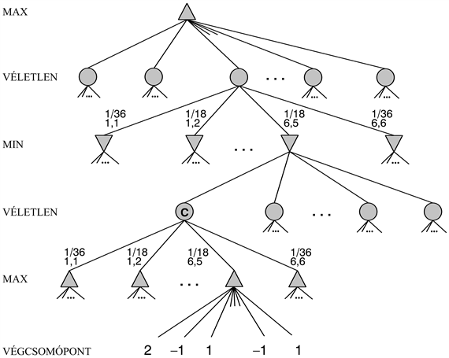
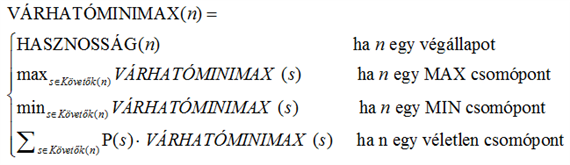
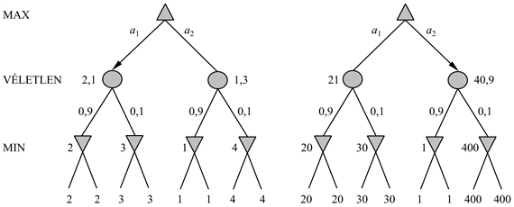

<?xml version="1.0" encoding="UTF-8" standalone="no"?>
<!DOCTYPE html PUBLIC "-//W3C//DTD XHTML 1.1//EN" "http://www.w3.org/TR/xhtml11/DTD/xhtml11.dtd">
<html xmlns="http://www.w3.org/1999/xhtml"><head><meta name="generator" content="DocBook XSL Stylesheets V1.76.1"/></head><body>

<h1 class="title"><a id="id574290"/>Véletlen elemet is tartalmazó játékok</h1>

A valós életben számos olyan megjósolhatatlan külső eseménnyel van dolgunk, ami miatt előre nem látható helyzetbe kerülünk. Sok játék ezt a megjósolhatatlanságot egy véletlen elem, mint például a kockadobás, bevezetésével veszi figyelembe. Ily módon egy lépéssel közelebb visznek bennünket a valósághoz, és megéri megvizsgálni, hogy ez milyen hatással van a döntési folyamatra.

Az ostábla tipikusan olyan játék, amely ötvözi a szerencsét és a tudást. A játékosok a lépések előtt kockát dobnak, amivel meghatározzák az adott játékos számára megengedett lépéseket. A 6.10. ábra ostáblaállásánál Fehér egy 6-ost és egy 5-öst dobott, és négy lehetséges lépés közül választhat.

<a id="id574298"/>
<strong>6.10. ábra - Egy tipikus ostáblaállás. A játék lényege, hogy az egyik fél összes bábuját eltávolítsuk a tábláról. Fehér az óramutató járásával egyező irányban halad a 25-ös felé, míg Fekete az óramutató járásával ellentétes irányban, a 0 felé halad. Egy bábuval bármelyik helyre lehet lépni, kivéve azokat a helyeket, ahol az ellenfélnek már legalább két bábuja található. Ha egy olyan helyre lépünk, ahol az ellenfélnek egy bábuja található, akkor azt a bábut elfogtuk, és a lépkedést az elejéről kell újrakezdenie. Ennél a táblaállásnál Fehér épp most dobott 6–5-öt, és négy megengedett lépés közül választhat: (5–10,5–11), (5–11,19–24), (5–10,10–16) és (5–11,11–16).</strong>

<a id="id574308"/>
<strong>6.11. ábra - Egy ostáblaállás sematikus játékfája</strong>

Habár Fehér tudja, hogy számára melyek a megengedett lépések, azt nem tudja, hogy Fekete milyen számokat fog dobni, így nem tudhatja, hogy melyek lesznek Fekete megengedett lépései. Ez azt jelenti, hogy Fehér nem tud egy 3 × 3-as amőbánál látott teljes játékfához hasonlót elkészíteni. Az ostábla esetén a játékfának a <code class="code">MAX</code> és <code class="code">MIN</code> csomópontok mellett tartalmaznia kell <strong>véletlen csomópont</strong>okat <strong>(chance node</strong>s) is. A 6.11. ábrán a véletlen csomópontokat körök jelölik. A véletlen csomópontokból kiinduló ágak a lehetséges kockadobásokat jelölik. Minden ág a dobott értékkel és előfordulásának valószínűségével van felcímkézve. Két kockával történő dobásnál harminchatféle eredményt kaphatunk. Ezek a dobások mind azonos valószínűségűek, mivel azonban a 6–5 megegyezik az 5–6-tal, így csak 21 különböző dobás létezik. A hat dupla (1–1-től egészen 6–6-ig) 1/36-od valószínűséggel, míg a többi 15 különböző dobás 1/18-ad valószínűséggel fordul elő.

A következő lépés annak megértése, hogyan kell helyes döntéseket hozni. Nyilvánvalóan továbbra is azt a lépést szeretnénk kiválasztani, ami a legjobb álláshoz vezet. A lehetséges állások azonban most nem rendelkeznek egy jól meghatározott minimax értékkel. Ehelyett csak egy átlagos vagy <strong>várható érték</strong>et (<strong>expected value</strong>) tudunk kiszámítani, ahol az átlagolást az összes lehetséges kockadobásra végezzük el. Ezzel a determinisztikus játékok <strong>minimax érték</strong>ét (<strong>minimax value</strong>) a véletlen csomópontokat tartalmazó játékok <strong>várhatóminimax érték</strong>ére (<strong>expectiminimax value</strong>) általánosítottuk. A végállapotok és a <code class="code">MAX</code> és <code class="code">MIN</code> állapotok (ahol a kockadobás eredménye ismert) ugyanúgy viselkednek, mint eddig. A véletlen csomópontok kiértékeléséhez az összes lehetséges kockadobás figyelembevételével számított súlyozott átlagot kell venni, vagyis:

ahol a véletlen <em>n</em> csomópont állapotátmenet-függvénye az <em>n</em> állapotot egyszerűen módosítja az összes kockadobás eredményezte <em>s</em> követő állapot értékével és a dobás <em>P</em>(<em>s</em>) valószínűségével. Ezt az eljárást rekurzívan alkalmazhatjuk a gyökérig, ugyanúgy, mint a minimax esetén. Az algoritmus részleteit feladatnak hagyjuk meg az olvasónak.

<h2 class="title"><a id="id574402"/>Az állás kiértékelése véletlen csomópontokat tartalmazó játékok esetén</h2>

Hasonlóan a minimaxhoz, a várhatóminimax esetén is alkalmazhatjuk a nyilvánvaló közelítést, vagyis valamilyen ponton levághatjuk a keresést, és a levelekre egy kiértékelő függvényt alkalmazhatunk. Úgy gondolhatnánk, hogy egy olyan játék esetén, mint az ostábla, a kiértékelő függvény elvben semmiben sem tér el a sakknál alkalmazott kiértékelő függvényektől, melyeknek most is magasabb pontot kell adniuk a jobb állásokra. Valójában azonban a véletlen csomópontok jelenléte azt jelenti, hogy sokkal körültekintőbbnek kell lennünk abban a tekintetben, hogy a kiértékelő függvény értékei mit jelentenek. A 6<em>.</em>12. ábra mutatja a problémát: ha a kiértékelő függvény a levelekhez az [1, 2, 3, 4] értékeket rendeli hozzá, az <em>A</em>1 lépés lesz a legjobb, az [1, 20, 30, 400] értékekkel az <em>A</em>2 lesz a legjobb. Ebből adódóan egy program teljesen másként viselkedik, ha átskálázzuk a kiértékelő függvény értékeket! Kiderül, hogy ha el akarjuk kerülni ezt az érzékenységet, akkor a kiértékelő függvény az egy adott állásból való győzelem valószínűségének (vagy általánosabban az állás várható hasznosságának) csak egy <em>pozitív lineáris transzformációja</em> lehet. Ez a bizonytalanságot is tartalmazó helyzetek fontos és általános tulajdonsága. A 16. fejezetben<em> </em>tovább foglalkozunk ezzel a kérdéssel.

<h2 class="title"><a id="id574431"/>A várhatóminimax komplexitása</h2>

Ha a program előre tudná a játék folyamán a későbbiekben előforduló összes kockadobás eredményét, akkor egy kockadobást is tartalmazó játék megoldása ugyanolyan lenne, mint egy kockadobást nem tartalmazó játéké, amit a minimax <em>O</em>(<em>bm</em>)<em> </em>idő alatt tesz meg. Mivel a várhatóminimax figyelembe veszi az összes lehetséges kockadobás-sorozat eredményét is, annak időigénye <em>O</em>(<em>bmnm</em>) lesz, ahol <em>n</em> a különböző dobások számát jelöli.

<a id="id574467"/>
<strong>6.12. ábra - A levélértékeken végrehajtott sorrendőrző transzformáció megváltoztatja a legjobb lépést</strong>

Még ha a fa mélységkorlátja egy kis értékű <em>d</em> is<em>,</em> a minimaxhoz képesti többletköltség miatt irreális túl messzire előrenézni a véletlen játékok többségénél. Ostáblánál <em>n</em> értéke 21, <em>b</em> pedig általában 20 körüli értéket vesz fel, de bizonyos helyzetekben akár 4000 is lehet, a dupla kockadobásoknál. Valószínűleg csak három lépésváltást tudunk kezelni.

A problémáról másféleképp is gondolkodhatunk: az alfa-béta algoritmus előnye, hogy figyelmen kívül hagyja azokat a későbbi fejleményeket, amelyek a legjobb játék során egyszerűen nem következnek be. Így a valószínű előfordulásokra koncentrál. A kockát használó játékok esetén <em>nem léteznek </em>valószínű lépéssorozatok, mivel adott lépések megtételéhez először a kockának kell a megfelelő oldalára esnie, hogy ezek a lépések egyáltalán megengedhetők legyenek. Ez egy általános probléma minden olyan esetben, amikor a bizonytalanság is képbe kerül: a lehetőségek óriási mértékben megsokszorozódnak, és értelmetlenné válik részletes cselekvési terveket kidolgozni, mert a világ valószínűleg nem ezek szerint fog viselkedni.

Kétségtelen, hogy az olvasónak már eszébe jutott, hogy valami alfa-béta nyeséshez hasonló dolgot a véletlen csomópontokat tartalmazó játékfákra is alkalmazni lehetne. Kiderül, hogy ez valóban lehetséges. A <code class="code">MAX</code> és a <code class="code">MIN</code> csomópontok elemzése változatlan, de egy kis leleményességgel a véletlen csomópontokat is nyeshetjük. Tekintsük a 6.11. ábra <em>C</em> véletlen csomópontját, és nézzük meg, mi történik az értékével, amikor a gyermekeit vizsgáljuk és kiértékeljük. Kérdés, hogy lehetséges-e <em>C</em> értékére egy felső korlátot találni, még mielőtt az összes gyermekét megvizsgálnánk? (Idézzük vissza, hogy az alfa-béta nyesésnek pontosan erre van szüksége ahhoz, hogy egy csomópontot és az abból kiinduló részfát lenyeshesse.) Ez első pillantásra lehetetlennek tűnhet, mivel a <em>C</em> értéke a gyermekei értékének az <em>átlaga,</em> és amíg nem láttuk az összes kockadobás eredményét, addig ez az átlag akármi is lehet, mivel a meg nem vizsgált gyermekek akármilyen értéket felvehetnek. Ha azonban a hasznosságfüggvény lehetséges értékeit korlátok közé szorítjuk, akkor korlátokat kaphatunk az átlagra is. Például ha azt mondjuk, hogy a hasznosságértékek +3 és –3 között lehetnek, akkor a levélcsomópontok értékei már korlátosak, és a véletlen csomópont értékére az összes gyermekének megvizsgálása nélkül is <em>adhatunk </em>felső korlátot. 
<a id="ID_228_oldal"/>

<h2 class="title"><a id="id574530"/>Kártyajátékok</h2>

A kártyajátékok sok szempontból érdekesek, nem csupán a szerencsejáték-jellegük miatt. A játékok óriási választékából azokra fogunk összpontosítani, ahol a kártyákat a játék elején véletlen módon osztják szét, és ahol mindegyik játékos által kapott leosztás más játékosok számára nem megfigyelhető. Ilyen játék a bridzs, a whistjáték, a hearts[<a id="id574536" href="#ftn.id574536" class="footnote">57</a>] és a póker néhány formája. 

Az első pillantásra úgy tűnhet, hogy a kártyajátékok pont olyanak, mint a kockadobásos játékok. A kártyákat véletlenül osztjuk szét, és ez meghatározza a játékosok lehetséges lépéseit. Itt azonban az összes kocka a legelején gördül le! Ezt a hasonlatot próbáljuk továbbvinni. Ki fog derülni, hogy ez a gyakorlatban igen hasznos lesz. Mellesleg hibás is, igen érdekes okok miatt.

Képzeljük el, hogy két játékos, <code class="code">MAX</code> és <code class="code">MIN</code>, négykártyás kétkezes bridzset gyakorol, ahol minden kézleosztás látható. A leosztások az alábbiak, és <code class="code">MAX</code> hív elsőnek:

<code class="code">MAX</code>: ♥ 6 ♦ 6 ♣ 9 8		<code class="code">MIN</code>: ♥ 4 ♠ 2 ♣ 10 5

Tegyük fel, hogy <code class="code">MAX</code> ♣ 9-et játszik. <code class="code">MIN</code>-nek szint kell játszania, tehát ♣ 10-et vagy ♣ 5-öt. <code class="code">MIN</code> ♣ 10-et játszik és elviszi az ütést. Most <code class="code">MIN</code> következik és ♠ 2-vel indul. <code class="code">MAX</code>-nak nincs pikkje (és így az ütést elvinni nem tudja), következésképpen valamelyik kártyáját le kell játszania. Nyilvánvaló választás a ♦ 6, mert a két másik győztes kártya. Most függetlenül attól, hogy <code class="code">MIN</code> mivel indul a következő ütésben, <code class="code">MAX</code> az utolsó két ütést elviszi, és a játék két-két ütés szinten döntetlen lesz. Könnyű megmutatni a minimax megfelelő változatával (lásd 6.12.<em> </em>feladat), hogy <code class="code">MAX</code> ♣ 9-es indulása valójában egy optimális választás.

Módosítsuk most <code class="code">MIN</code> leosztását, ♥ 4-et ♦ 4-re cserélve:

<code class="code">MAX</code>: ♥ 6 ♦ 6 ♣ 9 8		<code class="code">MIN</code>: ♦ 4 ♠ 2 ♣ 10 5

A két eset tökéletesen szimmetrikus: a játék lefolyása azonos lesz, kivéve, hogy a második ütésnél <code class="code">MAX</code> a ♥ 6-ot fogja megjátszani. A játék ugyanúgy döntetlen lesz két-két ütéssel, és a ♣ 9 optimális döntés lesz most is.

Egyelőre minden jónak tűnik. Most rejtsük el <code class="code">MIN</code> kártyáinak egyikét: <code class="code">MAX</code> tudja, hogy <code class="code">MIN</code>-nek vagy az egyik (♥ 4-gyel), vagy a másik (♦ 4-gyel) leosztása van, de fogalma sincs melyik. <code class="code">MAX</code> a következőképpen érvel:

<em>A ♣ 9-es indulás optimális választás <code class="code">MIN</code> első leosztásával szemben és hasonlóan a második leosztásával szemben is, így most is optimálisnak kell lennie, mert tudomásom szerint <code class="code">MIN</code>-nél a két leosztás valamelyike van.</em>

Amit <code class="code">MAX</code> használ, azt általánosságban a „jövőbe látás szerinti átlagolásnak” nevezhetnénk. Az ötlet a cselekvés értékelése nem látott kártyák mellett oly módon, hogy először kiszámítunk minimax értékeket minden lehetséges leosztás esetére, majd várható értéket számítunk a leosztásokra nézve, azok valószínűségét felhasználva.

Ha azt gondolja, hogy ez egy értelmes stratégia (vagy ha nincs véleménye, mert nem érti a bridzset), tekintse a következő történetet:

<ol class="orderedlist"><li class="listitem">
nap: Az <em>A</em> út egy halom aranyhoz vezet. A <em>B</em> út egy elágazáshoz vezet. Ha az elágazásnál balra fordul, egy ékszerhegyet talál, ha az elágazásnál jobbra fordul, elüti egy busz.
</li><li class="listitem">
nap: Az <em>A</em> út egy halom aranyhoz vezet. A <em>B</em> út egy elágazáshoz vezet. Ha az elágazásnál jobbra fordul, egy ékszerhegyet talál, ha az elágazásnál balra fordul, elüti egy busz.
</li><li class="listitem">
nap: Az <em>A</em> út egy halom aranyhoz vezet. A <em>B</em> út egy elágazáshoz vezet. Ha jól választ, egy ékszerhalmot talál, ha rosszul, elüti egy busz.
</li></ol>

Nyilvánvaló, nem buta döntés, ha az első két napon a <em>B</em> utat választjuk. Nincs olyan épelméjű személy azonban, aki a harmadik napon is maradna <em>B</em>-nél. Mégis pontosan ez az, amit a jövőbe látás szerinti átlagolás sugall. A <em>B</em> út az 1. nap és a 2. nap helyzetekben optimális, következésképpen optimális a 3. nap szituációban is, hiszen az első két eset egyike fog előfordulni. Térjünk vissza a kártyajátékunkhoz: miután <code class="code">MAX</code> ♣ 9-et hív, <code class="code">MIN</code> ♣ 10-zel győz. <code class="code">MIN</code> ♠ 2-vel indul, mint korábban, és most <code class="code">MAX</code> ott van az elágazásnál bármiféle eligazítás nélkül. Ha <code class="code">MAX</code> a ♥ 6-ot játszotta meg, és <code class="code">MIN</code>-nek van még ♥ 4-e, ♥ 4 lesz a győztes, és <code class="code">MAX</code> a játékot elveszíti. Hasonlóan, ha <code class="code">MAX</code> a ♦ 6-ot játszotta meg, és <code class="code">MIN</code>-nek van még ♦ 4-e, <code class="code">MAX</code> szintén veszteni fog. A ♣ 9 első ízben való hívása tehát olyan helyzethez vezet, ahol <code class="code">MAX</code>-nak 50%-os esélye van a vesztésre (sokkal jobb lenne, ha a ♥ 6-ot vagy a ♦ 6-ot hívná elsőnek, döntetlent biztosítva).

A leszűrendő lecke az, hogy amikor hiányos az információ, meg kell fontolni, hogy <em>milyen információval fogunk rendelkezni </em>a játék minden pillanatában. <code class="code">MAX</code> algoritmusával az a probléma, hogy feltételezi, hogy minden lehetséges leosztásnál a játék úgy folytatódik, mintha <em>minden kártya látható lenne</em>. Ahogy a példánk mutatja, ez olyan cselekvésre készteti <code class="code">MAX</code>-ot, mintha minden <em>jövőbeli</em> bizonytalanság feloldódna, ha eljön az ideje. <code class="code">MAX</code> algoritmusa sem fog soha <em>információgyűjtéshez</em> folyamodni (vagy a partner informálásához), mert egy-egy leosztáson belül erre nincs szüksége. Az olyan játékoknál, mint a bridzs, gyakran értelmes dolog olyan kártyával indulni, amely segíti kideríteni az ellenség leosztását, vagy a partnerünket a saját leosztásunkról informálja. Ilyen viselkedést automatikusan generálhatunk a nem tökéletes információjú játékokra kifejlesztett optimális algoritmussal. Az ilyen algoritmus nem a világállapotok terében (kártyaleosztások), hanem a <strong>hiedelmi állapot</strong>ok terében (<strong>belief state</strong>s) (hiedelmek, hogy kinek milyen kártyája van, milyen valószínűséggel) keres. Az algoritmust a 17. fejezetben tudjuk majd megfelelően elmagyarázni, miután felépítettük a szükséges valószínűségi apparátust. Abban a fejezetben azzal a nagyon fontos szemponttal is fogunk foglalkozni, hogy a nem tökéletes információjú játékokban az a legjobb, ha minél kevesebb információt adunk ki az ellenségnek, és ennek legjobb módszere, ha <em>nem megjósolható</em> módon cselekszünk. Ez az oka annak, hogy az étteremellenőrök véletlen módon választják meg az ellenőrzések időpontját.

 

[<a id="ftn.id574536" href="#id574536" class="para">57</a>]  Az Angol–magyar Nagyszótár sem segít – ezeknek a játékoknak nincs a mai magyar nyelvben használatos nevük. (<em>A ford.</em>)

</body></html>
