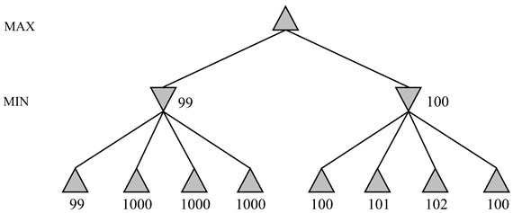

<?xml version="1.0" encoding="UTF-8" standalone="no"?>

<html xmlns="http://www.w3.org/1999/xhtml"><head><meta name="generator" content="DocBook XSL Stylesheets V1.76.1"/></head><body>

<h1 class="title"><a id="id574930"/>Értékelés</h1>

Mivel a játékokban az optimális döntés kiszámítása a legtöbb esetben kezelhetetlen, ezért az összes algoritmusnak valamilyen feltételezéssel és közelítéssel kell élnie. A minimax algoritmuson, kiértékelő függvényeken és az alfa-béta algoritmuson alapuló standard megközelítés csak egy lehetséges megoldás. Valószínűleg a standard megközelítés azért emelkedik ki a versenyjátékokra alkalmazott többi módszer közül, mert korán vetették fel és intenzíven fejlesztették. A terület néhány szakértője úgy gondolja, hogy a játékok épp ezért váltak el az MI fő irányvonalától, mert a standard megközelítés már nem hagy elegendő teret ahhoz, hogy új betekintést nyerjünk a döntéshozatal általános kérdéseibe. Ebben a részben az alternatív megközelítésekre fogunk rápillantani.

Először tekintsük a minimax algoritmust. A minimax optimális módszert ad egy lépés kiválasztásához egy adott keresési fából, <em>feltéve, hogy a levélcsomópontok kiértékelései tökéletesen pontosak.</em> A valóságban azonban a kiértékelések az állás értékének durva becslői, és úgy vehetjük, hogy nagy hibával rendelkeznek. A 6.13. ábra egy olyan egylépésváltásos játékfát mutat, amire a minimax alkalmatlannak tűnik. A minimax a jobb oldali ágat javasolja, holott nagyon valószínű, hogy a bal oldali ág valódi értékei nagyobbak. A minimax azon a feltételezésen alapul, hogy a 100-as, a 101-es, a 102-es és a 100-as címkét viselő csomópontok <em>mindegyike</em> <em>valóban</em> jobb, mint a 99-es címkét viselő csomópont. Az a tény azonban, hogy a 99-es címkéjű csomópontnak 1000-es címkéjű testvérei vannak, azt sugallja, hogy a csomópont valódi értéke valójában magasabb. Ezen probléma kezelésének egyik lehetséges módja, ha a kiértékelés egy, a lehetséges értékek feletti <em>valószínűség-elosztást</em> ad vissza. Ekkor standard statisztikai módszerekkel ki lehet számítani a szülő értékének valószínűség-eloszlását. Sajnos a testvércsomópontok értékei általában erősen korreláltak, ezért ez költséges számítás lehet, mert olyan részletes ismeretre van szükség, amit általában nehéz beszerezni.

<a id="id574953"/>
<strong>6.13. ábra - Egy olyan egylépésváltásos játékfa, amire a minimax alkalmatlannak tűnik</strong>

A következőkben tekintsük a fát generáló kereső algoritmust. Az algoritmustervező célja, hogy olyan algoritmust adjon meg, ami megfelelő idő alatt lefut, és jó lépést választ. Az alfa-béta algoritmus legszembetűnőbb problémája, hogy nem arra tervezték, hogy egyszerűen kiválasszon egy jó lépést, hanem arra, hogy értékkorlátokat számítson ki az összes megengedett lépés értékére. Hogy lássuk, ez a többletinformáció miért szükségtelen, tekintsünk egy állást, ahol egyetlen megengedett lépés létezik. Ettől függetlenül az alfa-béta keresés egy hatalmas és teljesen haszontalan keresési fát generál és értékel ki. Természetesen beiktathatunk egy tesztet az algoritmusba, de ezzel csak elrejtjük a problémát – az alfa-béta algoritmus által elvégzett számítások nagy része egyáltalán nem releváns. Az az eset, amikor csak egyetlen megengedett lépés létezik, nem sokban tér el attól az esettől, amikor néhány megengedett lépés létezik, ami közül egy jó, a többi pedig nyilvánvalóan katasztrofális. Egy ilyen „egyértelműen favorit helyzetben” szerencsésebb lenne egy kis keresés után gyors döntésre jutni, mintsem az időt fecsérelni, amit később egy problémásabb helyzetben esetleg hasznosabban fel lehetne használni. Ez elvezet a <em>csomópontkifejtés</em> <em>hasznosságának</em> gondolatához. Egy jó keresési algoritmusnak nagy hasznosságú csomópontot kell kiválasztania kifejtésre, vagyis olyat, ami valószínűleg egy lényegesen jobb lépés felfedezéséhez vezet. Ha nincs olyan csomópontkifejtés, aminek a hasznossága nagyobb, mint a kifejtésének (időre vonatkoztatott) költsége, akkor az algoritmusnak be kell fejeznie a keresést, és lépnie kell. Vegyük észre, hogy ez nemcsak az egyértelmű favorithelyzetekre működik, hanem a <em>szimmetrikus</em> lépésekre is, ahol bármennyi keresést is végeznénk, egyik lépés sem mutatkozna jobbnak.

Azt a fajta következtetést, amikor megmondjuk, hogy milyen számításokat kell végrehajtani, <strong>metakövetkeztetés</strong>nek (<strong>metareasoning</strong>) nevezik (következtetés a következtetésről). Ez nemcsak a játékokra vonatkozik, hanem mindenfajta következtetésre is. Minden számítást azért végzünk el, hogy jobb döntéseket hozhassunk. Mindegyiknek van valamilyen költsége, és mindegyik valamilyen valószínűséggel bizonyos javulást eredményezhet a döntés minőségében. Az alfa-béta algoritmus a lehető legegyszerűbb metakövetkeztetést foglalja magában: olyan tételt, miszerint a fa bizonyos ágait veszteség nélkül figyelmen kívül lehet hagyni. Ennél sokkal jobbat is lehet tenni. A 16. fejezetben megnézzük, hogy ezeket a gondolatokat hogyan lehet pontossá és megvalósíthatóvá tenni.

Végezetül ismét vizsgáljuk meg magának a keresésnek a természetét. A heurisztikus keresés és a játékok algoritmusai úgy működnek, hogy a kiinduló állapotból induló konkrét állapotsorozatokat generálnak, majd alkalmaznak egy kiértékelő függvényt. 

Az emberek nem így játszanak. A sakkban gyakran van egy konkrét célunk – például le akarjuk ütni az ellenfél vezérét –, és ezt a célt használhatjuk arra, hogy a cél elérése érdekében <em>szelektíven</em> megfelelő terveket generáljunk. Ez a fajta <strong>célvezérelt k</strong><strong>övetkeztetés</strong> (<strong>goal-directed reasoning</strong>) vagy <strong>tervkészítés</strong> (<strong>planning</strong>) néha teljesen eltünteti a kombinatorikus keresést (lásd IV. rész). David Wilkins <code class="code">PARADISE</code> programja (Wilkins, 1980) az egyetlen olyan program, amely sikeresen alkalmazta a célvezérelt következtetést a sakkra: néhány 18 lépésből álló kombinációt igénylő sakkfeladványt is képes volt megoldani. Ez idáig azonban még nem látjuk tisztán, hogyan kellene a két algoritmustípust egyetlen robusztus és hatékony rendszerbe <em>ötvözni,</em> bár a Bridge BaronTM jelenthet egy, a helyes irányban tett lépést. Egy ilyen teljesen integrált rendszer jelentős eredménynek számítana nemcsak a játékkutatás területén, hanem általánosságban véve az MI-kutatás területén is, mert egy általános intelligens ágens számára megfelelő alapot is tudna nyújtani.

</body></html>
