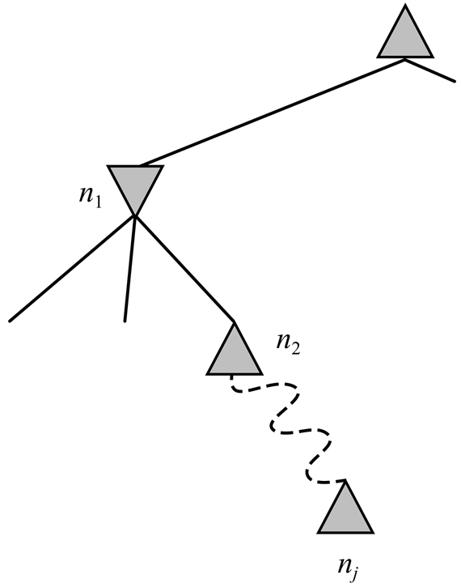

<?xml version="1.0" encoding="UTF-8" standalone="no"?>
<!DOCTYPE html PUBLIC "-//W3C//DTD XHTML 1.1//EN" "http://www.w3.org/TR/xhtml11/DTD/xhtml11.dtd">
<html xmlns="http://www.w3.org/1999/xhtml"><head><meta name="generator" content="DocBook XSL Stylesheets V1.76.1"/></head><body>

<h1 class="title"><a id="id575030"/>Összefoglalás</h1>

A játékok sokaságát néztük meg, hogy megértsük, mit is jelent optimálisan és a gyakorlatban is jól játszani. A legfontosabb gondolatokat az alábbiakban foglalhatjuk össze:

<ul class="itemizedlist"><li class="listitem">
Egy játékot a <strong>kiinduló állapot</strong>tal (<strong>initial state</strong>) (a táblaállással), mindegyik állapotban a <strong>legális cselekvés</strong>ekkel (<strong>action</strong>s), egy <strong>végteszt</strong>tel (<strong>terminal test</strong>) (ami megmondja, hogy mikor ért véget a játék) és egy <strong>hasznossági függvénny</strong>el (<strong>utility function</strong>) (ami megmondja, hogy ki és mennyivel nyert) lehet megadni.
</li><li class="listitem">
<strong>Tökéletes információ</strong>val (<strong>perfect information</strong>) rendelkező kétszemélyes zérusösszegű játékoknál a <strong>minimax algoritmus</strong> a teljes játékfa mélységi felsorolásával meg tudja határozni a játékos legjobb lépését.
</li><li class="listitem">
Az <strong>alfa-béta algoritmus</strong> ugyanazt a számítást végzi el, mint a minimax algoritmus, azonban jóval hatékonyabb, mivel lenyesi a keresési fa azon ágait, amiről be tudja bizonyítani, hogy a végső eredmény szempontjából irrelevánsak.
</li><li class="listitem">
A teljes játékfa általában nem kezelhető (még az alfa-béta algoritmussal sem), ezért a keresést valahol abba kell hagynunk, és egy <strong>kiértékelő függvény</strong>t (<strong>evaluation function</strong>) kell alkalmaznunk, ami az adott állapot hasznosságának becslőjét adja.
</li><li class="listitem">
A véletlen elemet is tartalmazó játékokat a minimax algoritmus olyan kiterjesztésével lehet kezelni, amely a <strong>véletlen csomópont</strong>okat (<strong>chance node</strong>) úgy értékeli ki, hogy az egyes hasznosságokat a gyermekcsomópontok valószínűségével súlyozva veszi az összes gyermekcsomópontjának az átlagos hasznosságát.
</li><li class="listitem">
A <strong>nem tökéletes információjú játék</strong>ok (<strong>imperfect information</strong>), mint például a bridzs, optimális lejátszása mindegyik játékostól az aktuális és a jövőbeli <strong>hiedelmi állapot</strong>aira (<strong>belief state</strong>s) vonatkozó következtetést igényli. Egy egyszerű közelítés kapható, ha átlagoljuk egy cselekvés értékét a hiányos információ minden lehetséges konfigurációjára.
</li><li class="listitem">
A programok egyenlő ellenfelek, vagy akár meg is verik a legjobb emberi játékosokat dámajátékban, Othellóban és ostáblajátékban, és igen közel állnak ehhez a bridzsben. Egy program legyőzte egy kirakatmérkőzésen az emberi sakkvilágbajnokot. A góban a programok még amatőr szinten játszanak.
</li></ul>

<h2 class="title"><a id="id575168"/>Irodalmi és történeti megjegyzések</h2>

A mechanikus játékok korai történetére számos csalás rányomta a bélyegét. Ezek közül a legnevezetesebb Kempelen Farkas báró 1769-ben kiállított „Törökje”, egy feltételezett sakkautomata, amely Napóleont is megverte, mielőtt kiderült, hogy a szekrénye  valójában egy törpe növésű emberi sakkmestert rejtett (Levitt, 2000). A Török 1769-től 1854-ig játszott. Úgy tűnik, Charles Babbage (aki a Török hatása alatt állt) volt az első, aki 1846-ban számítógépes sakk és dámajáték megvalósíthatóságának első komoly elemzését adta (Morrison és Morrison, 1961). Tervezett egy 3 × 3-as amőbát játszó célgépet is, amit soha sem épített meg. Az első igazi játékgépet 1890 táján egy spanyol mérnök, Leonardo Torres y Quevedo tervezte és építette meg. A „KRK” a sakkvégjátékra specializált gép volt (király és bástya a király ellen) és képes volt bármilyen kiinduló állásból mattot adni. 

A minimax algoritmust sokszor Ernst Zermelo, a modern halmazelmélet atyja 1912-es cikkéhez vezetik vissza. A cikk sajnálatos módon tartalmaz hibákat, és a minimaxot nem írja le helyesen. A játékelmélet komoly alapjait a nagy hatású <em>Theory of Games and Economic Behavior </em>c. munkában Neumann és Morgenstern (Neumann és Morgenstern, 1944) fektették le, kimutatva azt is, hogy egyes játékokban <em>szükség</em> van randomizált (avagy nem megjósolható) stratégiákra. (További információért lásd 17. fejezet.)

A korai számítógépes korszak számos prominens személyét kíváncsivá tette a számítógépes sakk lehetősége. Konrad Zuse – aki elsőként tervezett programozható számítógépet – igen részletes ötleteket dolgozott ki arra, hogy ezt hogyan lehetne megvalósítani (Zuse, 1945). Norbert Wiener nagy befolyású <em>Cybernetics </em>c. könyve (Wiener, 1948) tartalmazta egy számítógépes sakkprogram működésének egy lehetséges vázlatát, a minimax keresést, a mélységi levágást és a kiértékelő függvényt is beleértve. Claude Shannon a modern számítógépes játékok elvi alapjait sokkal részletesebben fejtette ki, mint Wiener (Shannon, 1950). Shannon bevezette az egyensúlyi állás fogalmát, és néhány ötletet vázolt fel a szelektív (nem kimerítő) játékfakeresésre vonatkozólag. Slater és az ugyanabban a kötetben a cikkére reflektáló szerzők szintén megvizsgálták a számítógépes sakkozás lehetőségeit (Slater, 1950). I. J. Good Shannontól függetlenül kidolgozta az egyensúlyi állás fogalmát (Good, 1950).

1951-ben Alan Turing írta meg az első valódi számítógépes programot, ami képes volt egy teljes sakkjátszmát lejátszani (Turing és társai, 1953). Valójában azonban Turing programja sohasem futott számítógépen, kézi szimulációval tesztelték egy nagyon gyenge emberi sakkjátékos ellen, aki legyőzte a programot. Időközben D. G. Prinz megírt és valóban futtatott is egy programot (Prinz, 1952), ami sakkfeladványokat oldott meg, bár nem játszott teljes játszmát. Alex Bernstein írta az első olyan sakkprogramot, amely egy teljes standard sakkjátszmát játszott (Bernstein és Roberts, 1958; Bernstein és társai, 1958).[<a id="id575192" href="#ftn.id575192" class="footnote">58</a>]

Az alfa-béta keresés alapötletét John McCarthy dolgozta ki 1956-ban, habár nem publikálta. Az NSS-sakkprogram az alfa-béta algoritmus egy leegyszerűsített változatát használta, ez volt az első sakkprogram, ami ezt alkalmazta (Newell és társai, 1958). Nilsson szerint Arthur Samuel dámaprogramja (Samuel, 1959; 1967) szintén alfa-béta algoritmust használt, habár maga Samuel ezt nem említi a rendszerről publikált beszámolóiban (Nilsson, 1971). Az 1960-as évek elején jelentek meg az alfa-béta algoritmust ismertető cikkek (Hart és Edwards, 1961; Brudno, 1963; Slagle, 1963b). Az alfa-béta algoritmus egy teljes implementációját Slagle írta le egy cikkben (Slagle és Dixon, 1969), ami a kalah[<a id="id575199" href="#ftn.id575199" class="footnote">59</a>] játékot játszó játékprogram működését ismertette. A John McCarthy egyik diákja által írt „Kotok–McCarthy” sakkprogram (Kotok, 1962) is az alfa-béta algoritmust használta. Knuth ismerteti az alfa-béta algoritmus történetét (Knuth és Moore, 1975), megadja az algoritmus teljességének a bizonyítását és elvégzi az időigény elemzését. Knuth és Moore elemzése az alfa-béta keresésnek a követők véletlen sorba rendezésével O((<em>b</em>/log<em>b</em>)d) aszimptotikus komplexitást mutatott ki, ami lehangoló eredmény, mert a <em>b</em>/log<em>b</em> effektív elágazási tényező magánál a <em>b</em>-nél nem sokkal jobb. Később jöttek rá, hogy az aszimptotikus képlet csak a <em>b</em> &gt; 1000 igaz, és az aktuális játékokra található elágazási tényezőkre a gyakran idézett O(<em>b</em>3<em>d</em>/4) érvényes. Pearl megmutatta (Pearl, 1982b), hogy az alfa-béta algoritmus aszimptotikusan optimális az összes rögzített mélységű játékfa-keresési algoritmus között.

Az első két sakkprogram, ami egymás ellen játszott, a Kotok–McCarthy-program és a Moszkvai Elméleti és Kísérleti Fizika Intézet által megírt „ITEP” program (Adelson-Velsky és társai, 1970) volt az 1960-as évek közepén. Ezt az interkontinentális mérkőzést távírón játszották le. A küzdelem 1967-ben az ITEP-program 3:1 arányú győzelmével ért véget. A MacHack 6 volt az első olyan sakkprogram, ami sikeresen játszott emberek ellen (Greenblatt és társai, 1967). 1400-as Élő-pontszáma jóval több volt, mint a kezdők 1000-es Élő-pontja, azonban így is igen messze volt a 2800 vagy több Élő-ponttól, ami szükséges lett volna, hogy Herb Simon 1957-es jóslata teljesüljön, miszerint 10 éven belül a számítógépes sakkprogramok lesznek a sakkvilágbajnokok (Simon és Newell, 1958).

Az 1970-es első ACM Észak-Amerikai Számítógépes Sakkbajnoksággal a sakkprogramok versengése komollyá vált. A korai 1970-es évek programjai igen bonyolultak voltak, számos trükköt vetettek be, hogy a keresés bizonyos ágait levágják, elfogadható lépéseket generáljanak stb. Az első Számítógépes Sakkvilágbajnokságot 1974-ben Stockholmban rendezték. Ezt az első világbajnokságot a Kaissa (Adelson-Velsky és társai, 1975), egy másik ITEP-program nyerte meg. Kaissa egy egyszerűbb megközelítésen alapult és kimerítő alfa-béta keresést használt egyensúlyi kereséssel vegyítve. A megközelítés felsőbbrendűségét igazolta a <code class="code">CHESS</code> 4.6 győzelme az 1977-es Számítógépes Sakkvilágbajnokságon. A <code class="code">CHESS</code> 4.6 lépésenként 400 000 állást elemzett és 1900 Élő-pontot ért el.

Greenblatt MacHack 6-osának egy későbbi változata volt az első olyan sakkprogram, amely már kifejezetten a sakkra tervezett célhardveren futott (Moussouris és társai, 1979), de a Belle (Condon és Thompson, 1982) volt az első olyan program, ami a célhardvernek köszönhetően jelentős sikereket ért el. A Belle lépésgeneráló és állásértékelő hardvere lehetővé tette, hogy lépésenként néhány millió állást is elemezzen. A Belle 2250 Élő-pontot ért el, és az első mesteri fokozat szintű program lett. A <code class="code">HITECH</code> rendszer egy speciális rendeltetésű számítógép volt, amit Hans Berliner, a korábbi levelező sakkvilágbajnok és egy CMU-beli diákja, Carl Ebeling tervezett, hogy a kiértékelő függvények gyors számítását tegyék lehetővé (Ebeling, 1987; Berliner és Ebeling, 1989). A <code class="code">HITECH</code> észak-amerikai sakkbajnok lett 1985-ben, és 1987-ben az első olyan program volt, amely egy emberi nagymestert is legyőzött. A CMU-n szintén kifejlesztett Deep Thought (Hsu és társai, 1990) a tiszta keresés sebességét tovább fokozta. 2551 Élő-pontot ért el és a Deep Blue előfutára lett. Az 1980-ban alapított Fredkin-díj 5000 dollárt ajánlott fel annak a sakkprogramnak, amelyik elsőként éri el a mesterfokozatot, és 10 000 dollárt ajánlott fel annak a sakkprogramnak, amely elsőként éri el a USCF (Amerikai Egyesült Államok Sakkszövetsége) 2500-as Élő-pontot (ez a nagymesteri szinthez közeli érték), és 100 000 dollárt ajánlott fel azon sakkprogramnak, amelyik elsőként legyőz egy emberi sakkvilágbajnokot. Az 5000 dolláros díjat 1993-ban a Belle, a 10 000 dolláros díjat 1989-ban a Deep Thought, majd a 100 000 dolláros díjat 1997-ben a Deep Blue nyerte el a Kaszparov felett aratott győzelemért. Fontos emlékezni, hogy a Deep Blue sikerét mind az algoritmikus javítások, mind a hardver biztosította (Hsu, 1999; Campbell és társai, 2002). Az olyan technikák, mint a nulla lépés heurisztika (Beal, 1990) a keresésben igen szelektív programokhoz vezettek. Az utolsó három Számítógépes Sakkvilágbajnokságot 1992-ben, 1995-ben és 1999-ben a standard PC-n futó programok nyerték meg. Egy korszerű sakkprogramnak talán a legrészletesebb leírását Ernst Heinz adja meg (Heinz, 2000), amelynek <code class="code">DARKTHOUGHT</code> programja volt a legmagasabb pontszámú nem kereskedelmi program az 1999-es világbajnokságon.

Kísérletek történtek arra, hogy a „standard megközelítés” 6.7. alfejezetben leírt problémáit leküzdjék. Az első szelektív kereső algoritmus, elméleti igénnyel, valószínűleg a B* algoritmus (Berliner, 1979) volt, ami megkísérli, hogy a játékfa csomópontjainak az értékeire egyetlen becsült érték helyett intervallumkorlátokat adjon. A levélcsomópontok kifejtése annak érdekében történik, hogy a legfelső szintű korlátokat finomítsuk, amíg egy „nyilván legjobb” lépést nem találunk. Palay az alfa-béta algoritmus becsült értékei, illetve a B* algoritmus intervallumai helyett valószínűség-eloszlásokat használ (Palay, 1985). David McAllester konspirációs szám keresési algoritmusa azokat a levélcsomópontokat fejti ki, amelyek, ha megváltoznának az értékeik, előidéznék, hogy az algoritmus a gyökérnél új lépést válasszon (David McAllester, 1988). Az MGSS* (Russell és Wefald, 1989) a 16. fejezet fejlett döntéselméleti technikáit használja minden levélcsomópont kifejtésének értékbecslésére a gyökérszintű döntés minőségében tapasztalt várható javulás függvényében. Ez a program az Othellóban képes volt jobb eredményeket elérni, mint az alfa-béta algoritmus, annak ellenére, hogy egy nagyságrenddel kevesebb csomópontot vizsgált meg. Az MGSS* megközelítés elvben alkalmas a következtetés bármilyen formájának vezérlésére.

Az alfa-béta keresés több szempontból a mélységi áglenyeső megfelelője két játékos esetén, amit az egyedi ágens esetében az A* dominál. Az SSS* algoritmus (Stockman, 1979) egy kétszemélyes A*-nak tekinthető, és azonos döntés eléréséhez soha nem fejt ki több csomópontot, mint az alfa-béta algoritmus. Eredeti formájában az SSS* memóriaigénye és a sorba állítás számítási overheadje miatt nem praktikus, azonban az RLEK algoritmusból kifejlesztettek egy lineáris tárkomplexitású változatot (Korf és Chickering, 1996). Plat az SSS*-ja egy új megközelítést dolgozott ki (Plat és társai, 1996) az alfa-béta keresés és a transzpozíciós táblák együtteseként, és megmutatta, hogy az eredeti algoritmus problémáit hogyan kell elkerülni, végül MTD(<em>f</em>) néven egy új változatot fejlesztett ki, amit sok kiemelkedő teljesítményű programba építettek be.

D. F. Beal és Dana Nau a minimax közelítő kiértékelésekre történő alkalmazásoknál jelentkező gyengeségeit tanulmányozták (Beal, 1980; Dana Nau, 1980; 1983). Kimutatták, hogy a levélértékeknek a fában való eloszlására bizonyos függetlenségi feltételezésekkel élve, a minimax algoritmus <em>kevésbé</em> megbízható becsléseket ad a gyökérre, mintha a kiértékelő függvényeket közvetlenül, mindenféle keresés nélkül alkalmaznánk. Pearl <em>Heuristics </em>c. könyve (Pearl, 1984) ezt a látszólagos paradoxont részben megmagyarázza és számos játékalgoritmust elemez. Baum és Smith (Baum és Smith, 1997) a minimax egy valószínűség-alapú helyettesítését javasolja, és azt mutatja ki, hogy ez bizonyos játékokban jobb döntésekhez vezet. A keresés különféle szinteken való levágásából és a kiértékelő függvény alkalmazásából adódó hatások elmélete még mindig szegényes. 

A várhatóminimax algoritmust Donald Michie vetette fel (Michie, 1966), habár az közvetlenül következik Neumann és Morgenstern játékfa-kiértékelési elméletéből. Bruce Ballard az alfa-béta nyesést kiterjesztette a véletlen csomópontokat is tartalmazó fákra (Bruce Ballard, 1983). Az első sikeres ostáblaprogram a BKG volt (Berliner, 1977; 1980b). Csak 1 mélységig keresett és bonyolult, manuálisan összeállított kiértékelő függvényt használt. Ez volt az első számítógépes program, ami képes volt legyőzni egy emberi világbajnokot az ismert klasszikus táblajátékok egyikében (Berliner, 1980a), habár Berliner elsőként ismerte el, hogy ez csak egy rövid, bemutató mérkőzés volt (nem egy világbajnoki mérkőzés), és hogy a BKG nagyon szerencsés „kézzel” dobott a kockával. Gerry Tesauro kutatásai, először a <code class="code">NEUROGAMMON</code> (Tesauro, 1989), majd a TD-<code class="code">GAMMON</code> (Tesauro, 1995) programokkal, azt mutatták, hogy sokkal jobb eredmény érhető el a megerősítéses tanulással (amely területtel a 21. fejezetben foglalkozunk).

A dáma, és nem a sakk volt az első olyan klasszikus játék, amire egy valóban számítógépen futó program képes volt végigjátszani egy teljes játszmát. Christopher Strachey írta az első működőképes dámajátékprogramot (Strachey, 1952). Schaeffer (Schaeffer, 1997) nagyon olvasmányosan leírja a Chinook – a világbajnok dámajátékprogram – fejlesztéstörténetét az összes műhelytitkával együtt.

Az első góprogramokat valamivel a dáma- és a sakkprogramok után fejlesztették ki (Lefkovitz, 1960, Remus, 1962), és lassabban fejlődtek a dáma- és a sakkprogramoknál. Ryder tiszta keresésalapú megközelítést használt (Ryder, 1971) a szelektív nyesési módszerek egész palettájával, hogy le tudja győzni a hatalmas elágazási tényezőből adódó problémát. Zobrist feltétel-cselekvés szabályokat használt elfogadható lépések generálására, ha a játékban ismert alakzatok jelentek meg (Zobrist, 1970). Reitman és Wilcox jó eredménnyel kombinálta a szabályokat és a keresést (Reitman és Wilcox, 1979), a legtöbb modern program követte ezt a hibrid megközelítést. A számítógépes gó jelenlegi állását Müller (Müller, 2002) foglalja össze, és tömérdek hivatkozást is közöl. Anshelevich (Anshelevich, 2000) hasonló módszereket a <code class="code">HEX</code> játékra alkalmaz. A friss fejleményekről a Számítógépes Go Szövetség által kiadott <em>Computer Go Newsletter</em> számol be.

A számítógépes játékokról több fórumon jelennek meg cikkek. A felettébb félrevezető nevű konferenciakiadvány, a <em>Heuristic Programming in Artificial Intelligence </em>számol be a Számítógépes Sakkolimpiákról, amely rendezvények a játékok egész sorára terjednek ki. A játékprogramok kutatásáról fontos cikkeket publikáltak számos szerkesztett cikkgyűjteményben (Levy, 1988a; Levy, 1988a; Marsland és Schaeffer, 1990). Az 1977-ben alapított Nemzetközi Számítógépes Sakkszövetség (International Computer Chess Association, ICCA) negyedévenként adja ki az <em>ICGA</em> <em>Journal</em>t (korábban <em>ICCA Journal</em>). (Clarke, 1977) óta fontos cikkek jelentek meg az <em>Advances in Computer Chess </em>antológiasorozatban. Az <em>Artificial Intelligence</em> folyóirat 134. kötete (<em>Artificial Intelligence</em>, 2002) leírásokat tartalmaz a legfejlettebb sakk, Othello, Hex, shogi, gó, ostábla, póker, Scrabble™ és más játékprogramokról. 

<h2 class="title"><a id="id575376"/>Feladatok</h2>

<a id="ID_241_oldal"/>
<strong>6.1.</strong>

Ez a feladat a játékok alapvető elveit a 3 × 3-as amőbán (körök és ikszek) keresztül gyakoroltatja be. <em>Xn</em> azon sorok, oszlopok vagy átlók számát jelöli, ahol pontosan <em>n</em> db <em>X</em>, míg egyetlen <em>O</em> sem található. Hasonlóan, <em>On </em>azon sorok, oszlopok vagy átlók számát jelöli, ahol pontosan <em>n</em> db <em>O</em>, míg egyetlen <em>X</em> sem található. A hasznosságfüggvény +1-et rendel minden olyan álláshoz, ahol <em>X</em>3 = 1, és –1-et rendel minden olyan álláshoz, ahol <em>O</em>3 = 1. Az összes többi végállás hasznossága 0. A nem végállapotok esetén az alábbi módon definiált lineáris kiértékelő függvényt fogjuk használni:

<code class="code"><em>	Kiértékel</em>(<em>s</em>) = 3<em>X</em>2(<em>s</em>) + <em>X</em>1(<em>s</em>) – (3<em>O</em>2(<em>s</em>) + <em>O</em>1(<em>s</em>))</code>

<ol class="orderedlist"><li class="listitem">
Körülbelül hány különböző 3 × 3-as amőbajátszmát lehet lejátszani?
</li><li class="listitem">
Üres táblából kiindulva, a szimmetriát is figyelembe véve, 2-es mélységig (vagyis egy <em>X</em> és egy <em>O</em> a táblán) mutassa meg a teljes játékfát. 
</li><li class="listitem">
A fában 2-es mélységben tüntesse fel az összes álláskiértékelést.
</li><li class="listitem">
A fában az 1-es és a 0-s mélységben levő állásokhoz a minimax algoritmust felhasználva tüntesse fel a felfelé terjesztett értékeket, és használja fel azokat a legjobb kezdő lépés meghatározásához.
</li><li class="listitem">
Karikázza be a 2-es szinten levő azon csomópontokat, amelyeket az alfa-béta nyesés alkalmazása esetén az algoritmus <em>nem</em> értékelne ki, feltételezve, hogy a csomópontokat az algoritmus <em>az alfa-béta nyeséshez optimális sorrendben generálja.</em>
</li></ol>

<strong>6.2.</strong>

Bizonyítsa be az alábbi állítást: minden játékfa esetén a <code class="code">MAX</code> által kapott hasznosság, amikor <code class="code">MAX</code> a minimax döntést használva játszik egy szuboptimális <code class="code">MIN</code>-nel szemben, sohasem lesz alacsonyabb, mint az a hasznosság, ami akkor ér el, ha egy optimális <code class="code">MIN</code>-nel szemben játszana. Ki tud találni egy olyan játékfát, ahol <code class="code">MAX</code> egy szuboptimális stratégiával egy <em>szuboptimális</em> <code class="code">MIN</code>-nel szemben még jobban teljesítene?

<strong>6.3.</strong>

Tekintse a 6.14. ábrán látott kétszemélyes játékot.

<ol class="orderedlist"><li class="listitem">
Rajzolja fel a teljes játékfát az alábbi konvenciót alkalmazva:
</li></ol>

<ul class="itemizedlist"><li class="listitem">
minden állapotot (<em>SA</em>, <em>SB</em>) formában írja fel, ahol <em>SA</em> és <em>SB</em> a zsetonok helyzete.
</li><li class="listitem">
minden végállapotot egy négyzetbe, a játékértékét pedig egy körbe írja be.
</li><li class="listitem">
a <em>hurokállapotokat</em> (azon állapotok, amelyek már megjelentek a gyökérig vezető út mentén) dupla négyzetekbe írja be. Mivel nem világos, hogy az ilyen állapotok értéke mennyi, jelölje be mindegyiket egy körbe írt „?”-lel.

<ol class="orderedlist"><li class="listitem">
Most mindegyik csomóponthoz írja be a visszaterjesztett minimax értékét (szintén egy körbe írva). Magyarázza meg, hogy a „?” értékeket hogyan kezelte, és miért?
</li><li class="listitem">
Magyarázza meg, hogy a standard minimax ebben a játékfában miért fulladna kudarcba, és röviden vázolja fel, hogy a (b) kérdésre adott válaszra támaszkodva hogyan lenne képes az algoritmust megjavítani. Képes-e a módosított algoritmus megadni az optimális döntéseket az összes hurkokat tartalmazó játékban?
</li><li class="listitem">
Ez a 4-négyzetes játék <em>n</em> négyzet esetére általánosítható, minden <em>n</em> &gt; 2-re. Bizonyítsa be, hogy <em>A</em> győz, ha <em>n</em> páros, és veszít, ha <em>n</em> páratlan.
</li></ol>
</li></ul>

<a id="id575653"/>
<strong>6.14. ábra - Egy egyszerű játék kiinduló állása. Az <em>A</em> játékos indul elsőnek. Mindkét játékos felváltva lép és a zsetonját a szomszédos szabad helyre helyezheti, mindkét irányban. Ha a szomszédos mező foglalt, akkor a játékos az ellenfél felett átugorhat a következő szabad helyre, ha van ilyen. (Például ha <em>A</em> a 3-n és <em>B</em> a 2-n van, akkor <em>A</em> visszaléphet 1-re.) A játéknak vége, ha az egyik játékos eléri a tábla ellentétes végét. Ha az <em>A</em> játékos elsőnek éri el a 4-et, a játék értéke +1, ha <em>B</em> játékos éri el elsőnek az 1-et, a játék értéke az <em>A</em> számára –1.</strong>

<strong>6.4.</strong>

Implementáljon lépésgenerátort és kiértékelő függvényt az alábbi játékok közül néhányat: kalah, Othello, dáma, sakk. Az implementációt használva tervezzen egy általános alfa-béta játékágenst. Hasonlítsa össze a keresési mélység növelésének, a lépéssorrendezés tökéletesítésének és a kiértékelő függvény tökéletesítésének a hatását. Milyen közel esik az Ön effektív elágazási tényezője a tökéletes lépéssorrendezés ideális esetéhez? 

<strong>6.5.</strong>

Állítsa elő az alfa-béta nyesés helyességének formális bizonyítását. Ehhez tekintse a 6.15. ábrán bemutatott<em> </em>helyzetet. A kérdés az, hogy az algoritmus lenyesse-e az <em>nj </em>csomópontot, ami egy max-csomópont és az <em>n</em>1 leszármazottja. Az alapötlet, hogy akkor és csak akkor nyessük le, ha <em>n</em>1 minimax értéke igazolhatóan független <em>nj</em> értékétől.

<ol class="orderedlist"><li class="listitem">
<em>n</em>1 értékét az alábbi képlet adja meg:
</li></ol>

<code class="code">		<em>n</em>1 = min(<em>n</em>2, <em>n</em>21, …, <em>n</em>2<em>b</em>2)</code>

Adjon egy hasonló kifejezést <em>n</em>2-re, és <em>n</em>1-re, <em>nj</em>-t felhasználva.

<ol class="orderedlist"><li class="listitem">
Legyen <em>li</em> az <em>ni </em>csomóponttól balra levő, ismert minimax értékű, <em>i</em> mélységben található csomópontok minimális (maximális) csomópontértéke. Hasonlóan, legyen <em>ri</em> az <em>ni </em>csomóponttól jobbra levő, még ki nem fejtett, <em>i</em> mélységben található csomópontok minimális (maximális) csomópontértéke. Az <em>n</em>1-re előbb meghatározott kifejezést írja át <em>li </em>és <em>ri </em>értékekkel kifejezve.
</li><li class="listitem">
Most fogalmazza át a kifejezést, hogy megmutassa, ahhoz, hogy <em>nj</em> befolyásolja <em>n</em>1-et, <em>nj-</em>nek meg kell haladnia bizonyos, az <em>li</em> értékekből meghatározott korlátot.
</li></ol>

<a id="id575887"/>
<strong>6.15. ábra - Az a helyzet, amikor az algoritmus eldönti, hogy lenyesheti-e az <em>nj</em> csomópontot</strong>

<ol class="orderedlist"><li class="listitem">
Az eljárást ismételje meg arra az esetre, amikor az <em>nj</em> egy min-csomópont.
</li></ol>

<strong>6.6.</strong>

Implementálja a véletlen csomópontokat tartalmazó játékfák lenyesésére alkalmas várhatóminimax és *-alfa-béta algoritmust, amit Ballard (Ballard, 1983) ír le. Próbálja ki azokat az algoritmusokat olyan játékokon, mint az ostábla, és mérje meg a *-alfa-béta nyesési hatékonyságát. 

<strong>6.7.</strong>

Bizonyítsa be, hogy a levélcsomóponti értékek pozitív lineáris transzformációja (azaz egy transzformáció <em>x</em>-től <em>ax </em>+ <em>b</em>-ig, ahol <em>a</em> &gt; 0), nincs befolyással a lépések választékára a játékfában, akkor sem, ha léteznek benne véletlen csomópontok.

<strong>6.8.</strong>

Tekintse az alábbi eljárást a lépések megválasztására a véletlen csomópontot is tartalmazó játékokban:

<ul class="itemizedlist"><li class="listitem">
Generáljon egy megfelelő számú (mondjuk 50) kockadobásból álló sorozatot egy megfelelő (mondjuk 8) mélységig.
</li><li class="listitem">
Ismert kockadobások esetén a játékfa determinisztikussá válik. Minden egyes kockadobás-sorozatra oldja meg az eredményül kapott determinisztikus játékfát az alfa-béta algoritmussal.
</li><li class="listitem">
Az eredményeket használja fel az egyes lépések értékének megbecslésére, és válassza ki a legjobb lépést.
</li></ul>

Helyesen fog működni ez az eljárás? Miért (nem)?

<strong>6.9.</strong>

Írjon és implementáljon egy <em>valós idejű,</em> <em>többszemélyes</em> játszókörnyezetet, ahol az idő a környezeti állapot része, és a játékosok rögzített időszeleteket kapnak.

<strong>6.10.</strong>

Adja meg és/vagy implementálja az alábbi játékok egyikére vagy akár többre is az állapotleírást, lépésgenerálást és a kiértékelő függvényt: Monopoly, Játék a betűkkel, bridzs (egy konkrét licitet feltételezve) és póker (válassza meg a kedvenc változatát).

<strong>6.11.</strong>

Gondosan tekintse át a 6.10. feladat minden egyes játékában a véletlen események és a részleges információk összefüggéseit.

<ol class="orderedlist"><li class="listitem">
Melyikre lesz jó a standard várhatóminimax modell? Implementálja az algoritmust és futtassa le a játékágensében a játékkörnyezet szükséges módosításaival. 
</li><li class="listitem">
Melyekre lenne jó a 6.8. feladatban leírt séma?
</li><li class="listitem">
Vitassa meg, hogyan kellene kezelni azt a tényt, hogy egyes játékokban a játékosok nem rendelkeznek ugyanazzal az információval az aktuális állapotról. 
</li></ol>

<strong>6.12.</strong>

A minimax algoritmus feltételezi, hogy a játékosak felváltva lépnek, az olyan kártyajátékokban azonban, mint a whist vagy a bridzs, mindig a leütés győztese indul a következőnek.

<ol class="orderedlist"><li class="listitem">
Módosítsa algoritmusát, hogy e játékokra is megfelelően működjön. Feltételezheti, hogy rendelkezésére áll a <code class="code">GYŐZTES</code> (<em>leütés</em>) függvény, amely azt adja vissza, hogy az adott leütést mely kártya nyerte meg. 
</li><li class="listitem">
Rajzolja fel a <a class="xref" href="ch06s05.md#ID_228_oldal">„A várhatóminimax komplexitása”</a> részben látható első leosztásra a játékfát.
</li></ol>

<strong>6.13.</strong>

A Chinook dámaprogram kiterjedten használja a végjáték adatbázisokat, amelyek pontos értéket adnak a játék utolsó hat lépésében előálló összes álláshoz. Hogyan lehet egy ilyen adatbázist hatékonyan legenerálni?

<strong>6.14.</strong>

Vitassa meg, hogyan alkalmazható a játékok standard megközelítése az olyan játékokra, mint például a tenisz, a póló és a krikett, amelyeket folytonos, fizikai állapottérben játszanak.

<strong>6.15.</strong>

Írja le, hogy a minimax és az alfa-béta hogyan változik kétszemélyes, nem zérusösszegű játékok esetén, ahol minden játékosnak külön kiértékelő függvénye van. Feltételezheti, hogy mindegyik játékos mások kiértékelő függvényeit ismeri. Ha a két véghasznosság értékére nincs korlát, lehetséges-e valamelyik csomópont számára, hogy az alfa-béta lenyesi?

<strong>6.16.</strong>

Tegyük fel, hogy egy olyan sakkprogrammal rendelkezik, amely képes egymillió csomópontot kiértékelni másodpercenként. Válassza a játékállás egy tömör reprezentációját a transzpozíciós tábla számára. Kb. mennyi állást képes eltárolni memóriában, az 500 Mbájt nagyságú táblában? Elég lesz-e ez a lépésenként allokált 3 perces kereséshez? Hány táblakiolvasást képes megvalósítani egy álláskiértékelés ideje alatt? Most tételezze fel, hogy a transzpozíciós tábla nagyobb, és nem fér el a memóriában. Hány kiértékelést lehetne megvalósítani egy diszkhozzáférés ideje alatt, standard diszkhardver mellett?

 

[<a id="ftn.id575192" href="#id575192" class="para">58</a>]  Newell (Newell és társai, 1958) egy orosz BESM programot említ, amely lehet, hogy Bernstein programját megelőzte.

[<a id="ftn.id575199" href="#id575199" class="para">59</a>]  A kalah egy afrikai eredetű kétszemélyes játék, amelyben kavicsokat (gyémántokat) kell átrakosgatni csészék között. Több számítógépes változata is létezik, l. például: <em>http:</em>//<em>ceman.ecn.purdue.edu/~ee373/kalah.md.</em> (<em>A ford.</em>)

</body></html>
