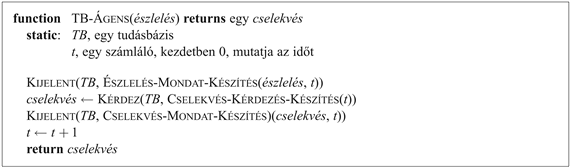

<?xml version="1.0" encoding="UTF-8" standalone="no"?>
<!DOCTYPE html PUBLIC "-//W3C//DTD XHTML 1.1//EN" "http://www.w3.org/TR/xhtml11/DTD/xhtml11.dtd">
<html xmlns="http://www.w3.org/1999/xhtml"><head><meta name="generator" content="DocBook XSL Stylesheets V1.76.1"/></head><body>

<h1 class="title"><a id="id576079"/>7. fejezet - Logikai ágensek</h1>

<em>Ebben a fejezetben olyan ágenseket tervezünk, amelyek képesek reprezentációkat kialakítani a világról, következtetési folyamatot alkalmaznak a világ új reprezentációjának a származtatására, és felhasználják az új reprezentációt a teendők kikövetkeztetésére.</em>

Ez a fejezet tudásbázisú ágenseket mutat be. A fogalmak, amelyeket itt tárgyalunk – a tudás <em>reprezentációja</em> és a tudás alkalmazását lehetővé tevő <em>következtetési</em> folyamatok – központi témái a mesterséges intelligencia minden területének.

Az emberek, úgy tűnik, ismernek a világról számos dolgot, és következtetéseket végeznek. A tudás és a következtetés fontos a mesterséges ágenseknek is, mert sikeres viselkedést tesz lehetővé, amelyet nagyon nehéz volna másképpen elérni. Láthattuk, hogy a problémamegoldó ágens számára cselekvéseinek ismerete lehetővé teszi, hogy komplex környezetekben jól teljesítsen. A reflexív ágens csak a vakszerencse segítségével tudta megtalálni az utat Aradról Bukarestbe. A problémamegoldó ágens tudása azonban igen specifikus és rugalmatlan. Egy sakkprogram ki tudja számítani egy király helyes lépéseit, de nincsen semmilyen értelmezhető ismerete arról, hogy egy figura egyidejűleg nem lehet két különböző mezőn. A tudásbázisú ágens képes kihasználni a nagyon általános formában leírt tudást, újra és újra összegyűjtve ennek elemeit úgy, hogy az számos célra megfelelő legyen. Gyakran ez a folyamat nagyon messzire kerül a pillanatnyi igénytől, például amikor egy matematikus egy tételt bizonyít, vagy amikor egy csillagász a Föld várható élettartamát számítja.

A tudás és a következtetés alapvető szerepet játszanak a <em>részben megfigyelhető</em> környezetek kezelésénél is. A tudásbázisú ágens képes összekombinálni az általános tudást a pillanatnyi érzetekkel, hogy kikövetkeztesse a pillanatnyi állapot rejtett aspektusait, mielőtt cselekvést választ. Ilyen például, amikor egy orvos diagnosztizál egy beteget, azaz kikövetkeztet egy közvetlenül nem megfigyelhető betegségállapotot, mielőtt meghatározná a kezelés módját. A tudás egy része, amelyet az orvos használ, könyvekből vagy tanároktól megtanult szabályok formájában áll rendelkezésre, más része pedig asszociációs minták formájában van, amelyeket lehet, hogy az orvos nem is tud tudatosan leírni. Ha ezek is az orvos fejében vannak, akkor tudásnak számítanak.

A természetes nyelv megértése szintén igényli, hogy rejtett állapotokra következtessünk, nevezetesen, hogy a beszélő szándékát megismerjük. Amikor azt halljuk, hogy „János egy gyémántot látott az ablakon keresztül, és szeretné (azt) megkapni”, akkor tudjuk, hogy az „azt” a gyémántra vonatkozik, és nem az ablakra. Ilyenkor, talán nem is tudatosan, a relatív értékekről meglévő ismereteink segítségével következtetünk. Hasonlóan, amikor azt halljuk, hogy „János kidobott egy követ az ablakon keresztül, és betörte (azt)”, akkor tudjuk, hogy az „azt” az ablakra vonatkozik. A következtetés lehetővé teszi számunkra, hogy megbirkózzunk a kijelentések virtuálisan végtelen változatosságával, hétköznapi tudásunk egy véges halmazát felhasználva.

Az utolsó érvünk a tudásbázisú ágensek tanulmányozása mellett e rendszerek rugalmassága. Képesek explicit célok formájában megadott új feladatokat elfogadni, egy új környezetről kapott vagy megtanult új ismeretek révén kompetenssé válni, és frissítve a tudásuk releváns részét képesek alkalmazkodni a környezet változásához.

A 7.1. alfejezetben az ágens általános tervezésével kezdünk. A 7.2. alfejezet egy egyszerű új környezetet, a wumpus világot mutatja be, amelyben illusztrálni fogjuk a tudásbázisú ágens működését a technikai részletek ismertetése nélkül. Ezután a 7.3. alfejezetben elmagyarázzuk a <strong>logika</strong> (<strong>logic</strong>) általános elveit. A könyv III. részében végig a logika lesz az elsődleges eszköz a tudás reprezentálására. A logikai ágensek tudása mindig határozott, minden kijelentés vagy igaz, vagy hamis a világban, habár az ágens lehet agnosztikus néhány kijelentéssel kapcsolatban.

A logika jelentős pedagógiai előnye, hogy egy tudásbázisú ágens egyszerű reprezentációs formáját jelenti, viszont van néhány komoly korlátja is. A helyzet az, hogy az emberek vagy más ágensek által részlegesen megfigyelhető környezetekben végzett következtetések jelentős része függ <em>bizonytalan</em> tudás felhasználásától. A logika nem tudja ezt a bizonytalanságot jól reprezentálni, ezért az V. részben a valószínűséget tárgyaljuk, amely már képes erre. A VI. és VII. részben számos reprezentációt tárgyalunk, köztük néhány folytonos matematikán alapulót, mint a Gauss-görbék keverését, neurális hálózatokat és más reprezentációkat.

A 7.4. alfejezet bemutat egy egyszerű logikát, az <strong>ítéletkalkulus</strong>t (<strong>propositional logic</strong>). Miközben ez lényegesen kevésbé kifejező, mint az <strong>elsőrendű logika</strong> (<strong>first-order logic</strong>) (8. fejezet), az ítéletkalkulus lehetőséget ad arra, hogy illusztráljuk a logika minden alapvető fogalmát. Létezik egy jól megtervezett technológia az ítéletkalkuluson történő következtetésre, amelyet a 7.5. és 7.6. alfejezetben írunk le. Végül a 7.7. alfejezet összekombinálja a logikai ágensek fogalmát az ítéletkalkulus technológiájával, hogy egyszerűbb ágenseket építsünk a wumpus világ számára. Azonosítjuk majd az ítéletkalkulus bizonyos hiányosságait, amelyek még hatékonyabb logikák fejlesztését fogják motiválni a következő fejezetekben.

<h1 class="title"><a id="id576148"/>A tudásbázisú ágens</h1>

Egy tudásbázisú ágens központi eleme a <strong>tudásbázis</strong>a (<strong>knowledge base</strong>). Egyszerűen fogalmazva, a tudásbázis <strong>mondat</strong>ok (<strong>sentence</strong>s) halmaza. (Itt a „mondatot” technikai fogalomként használjuk. A fogalom kapcsolatban van az angol, a magyar vagy más természetes nyelvek mondataival, de nem azonos velük.) A mondatokat egy nyelv segítségével fejezzük ki, amelyet <strong>tudásreprezentációs nyelv</strong>nek (<strong>knowledge representation language</strong>) nevezünk, és a világról szóló állításokat fogalmazunk meg vele.

Új mondatoknak a tudásbázishoz való hozzáadására, illetve a tudás lekérdezésére valamilyen eljárásra van szükségünk. Ezeknek a feladatoknak a tipikus elnevezése a <code class="code">KIJELENT</code>, illetve a <code class="code">KÉRDEZ</code>. Mindkét feladat tartalmazhat <strong>következtetés</strong>t (<strong>inference</strong>), azaz új mondatok levezetését régiekből. A <strong>logikai ágens</strong>eknél (<strong>logical agent</strong>s), amelyekkel ebben a fejezetben foglalkozunk, a következtetéssel szemben az alapvető követelmény, hogy amikor valaki <code class="code">KÉRDEZ</code> egy kérdést a tudásbázisról, akkor a válasznak következnie kell azokból a mondatokból, amit korábban a tudásbázishoz hozzáadtunk (pontosabban <code class="code">KIJELENT</code>-ettünk). Később a fejezetben még pontosabban leírjuk az igen fontos „következik” fogalom jelentését. Most egyelőre ez jelentsen csak annyit, hogy a következtetési folyamat során nem csak úgy egyszerűen keletkeznek dolgok.

A 7.1. ábra egy tudásbázisú ágens programjának vázát mutatja. Mint ahogy az összes ágensünk, ez is észlel valamit bemenetként, és egy cselekvést ad vissza válaszként. Az ágens fenntart egy tudásbázist, <em>TB</em>-t, amely kezdetben bizonyos <strong>háttértudás</strong>t (<strong>background knowledge</strong>) tartalmazhat. Ha az ágensprogramot meghívják, az három dolgot tesz. Először <code class="code">KIJELENT</code>-i a tudásbázisnak, hogy mit észlelt. Másodszor <code class="code">KÉRDEZ</code>-i a tudásbázist, hogy milyen cselekvést kell végrehajtania. A lekérdezés megválaszolásának folyamatában egyre bővülő következtetést lehet végezni a világ pillanatnyi állapotáról, a lehetséges cselekvéssorozatok eredményéről és így tovább. Harmadszor az ágens rögzíti a kiválasztott cselekvést a <code class="code">KIJELENT</code> felhasználásával, és végrehajtja a cselekvést. A második <code class="code">KIJELENT</code> azért szükséges, hogy a tudásbázissal tudassuk, hogy a feltételezett <em>cselekvés</em> végrehajtása megtörtént.

<a id="id576256"/>
<strong>7.1. ábra - Egy általános tudásbázisú ágens</strong>

A reprezentációs nyelv részletei három függvényben vannak elrejtve, amelyek az érzékelők és beavatkozók, az alapreprezentáció, valamint a következtető rendszer közötti kapcsolatot valósítják meg. Az <code class="code">ÉSZLELÉS-MONDAT-KÉSZÍTÉS</code> eljárás egy olyan mondatot konstruál, amelyik megállapítja, hogy az ágens egy adott pillanatban észlelte az érzékelt dolgot. A <code class="code">CSELEKVÉS-KÉRDEZÉS-KÉSZÍTÉS</code> az időt felhasználva bemeneti adatként, visszatér egy mondattal, amely alkalmas arra, hogy megkérdezzük, milyen cselekvés szükséges ebben a pillanatban. Végül a <code class="code">CSELEKVÉS-MONDAT-KÉSZÍTÉS</code> egy olyan mondatot hoz létre, amely megállapítja, hogy a kiválasztott cselekvés végrehajtása megtörtént. A következtetési mechanizmus részletei a <code class="code">KIJELENT</code> és a <code class="code">KÉRDEZ</code> eljárások belsejében vannak elrejtve. A későbbi fejezetekben ezeket a részleteket is bemutatjuk.

A 7.1. ábra ágense egészen hasonlónak tűnik, mint a 2. fejezetben bemutatott belső állapottal rendelkező ágens. Azonban a <code class="code">KIJELENT</code> és a <code class="code">KÉRDEZ</code> eljárások definíciója miatt a tudásbázisú ágens nem egy tetszőleges, cselekvéseket meghatározó program. Meghatározható egy leírással a <strong>tudásszint</strong>en (<strong>knowledge level</strong>), ahol csak azt kell megfogalmaznunk, hogy mit tudjon és milyen céljai legyenek az ágensnek, hogy rögzíthessük a viselkedését. Például egy automata taxi számára a cél lehet egy utas elszállítása Marin megyébe, és a taxi ismerheti, hogy ez San Franciscónál van, és a Golden Gate híd az egyetlen, amelyen keresztül oda el lehet jutni. Ezután feltételezhetjük, hogy átmegy a Golden Gate hídon, <em>mivel tudja, hogy el fogja érni a célját</em>. Vegyük észre, hogy ez az elemzés független attól, hogy a taxi hogyan is működik az <strong>implementációs szint</strong>en (<strong>implementation level</strong>). Nem számít, hogy a földrajzi elhelyezkedéssel kapcsolatos tudása láncolt listákkal vagy pixeltérképekkel van megvalósítva, vagy hogy vajon a következtetést regiszterekben tárolt szimbólumok listáinak manipulálásával vagy neuronhálókban zajos jelek továbbküldésével végzi el.
<a id="ID_250_251.oldal"/>
<h3 class="title">Fontos</h3>
Említettük a fejezet bevezetőjében, hogy <em>egy tudásbázisú ágens megalkotható úgy, hogy </em><code class="code">KIJELENT</code><em>-jük számára, hogy mit szükséges tudnia</em>. Az ágens inicializáló programja a tervező környezetről lévő tudását leíró mondatok egyenkénti átadásával építhető fel, még mielőtt az ágens elkezdené érzékelni a környezetét. Rendkívül leegyszerűsíti az ágens létrehozásának problémáját, ha olyan reprezentációs nyelvet tervezünk, amellyel egyszerű lesz ennek a tudásnak mondatokban való megfogalmazása. A rendszerépítésnek ezt a megközelítési módját <strong>deklaratív</strong> (<strong>declarative</strong>) módszernek nevezzük. Ezzel szemben a <strong>procedurális</strong> (<strong>procedural</strong>) megközelítés közvetlenül a program kódjában rögzíti a kívánt viselkedést, amivel minimalizálja az explicit reprezentáció és a következtetés szerepét, és így lényegesen hatékonyabb rendszer jöhet létre. Mind a kétféle ágensre látunk majd példát a 7.7. alfejezetben. Az 1970-es és 1980-as években a két megközelítés támogatói parázs vitákat folytattak. Mi mára felismertük, hogy egy sikeres ágens tervezésekor kombinálni kell a deklaratív és a procedurális elemeket. 

Amellett hogy <code class="code">KIJELENT</code>-hetjük az ágensnek, hogy mit kell tudnia, adhatunk is számára egy olyan mechanizmust, amely képessé teszi őt, hogy saját maga megtanulja ezt. Ez a mechanizmus, amit a 18. fejezetben tárgyalunk, általános, a környezetre vonatkozó tudást hoz létre érzetek sorozatának felhasználásával. Ezt a tudást bele lehet illeszteni az ágens tudásbázisába, és felhasználható a döntések meghozatalakor. Ily módon az ágens teljesen autonómmá válhat.

Ezek a képességek – a reprezentáció, a következtetés és a tanulás – mind a logika elméletének és technológiájának több évszázados fejlődésén alapulnak. Mielőtt azonban az elméletet és a technológiát elmagyaráznánk, létrehozunk egy egyszerű világot, amelyet majd felhasználunk ezek illusztrálásához. 

</body></html>
