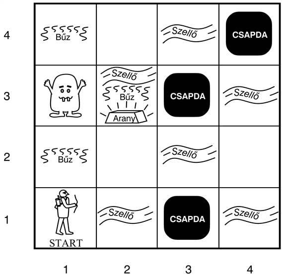
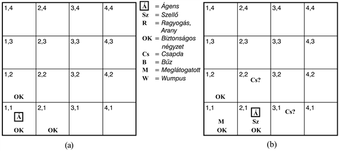
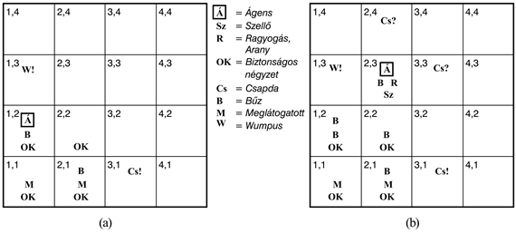

<?xml version="1.0" encoding="UTF-8" standalone="no"?>
<!DOCTYPE html PUBLIC "-//W3C//DTD XHTML 1.1//EN" "http://www.w3.org/TR/xhtml11/DTD/xhtml11.dtd">
<html xmlns="http://www.w3.org/1999/xhtml"><head><meta name="generator" content="DocBook XSL Stylesheets V1.76.1"/></head><body>

<h1 class="title"><a id="id576362"/>A wumpus világ </h1>

A <strong>wumpus világ</strong> (<strong>wumpus world</strong>) egy barlang, amely szobákból és az ezeket összekötő átjárókból áll. A wumpus egy szörnyeteg, aki mindenkit megesz, ha a szobájába lép, a barlangban lapul valahol. Az ágens le tudja lőni a wumpust, de csak egyetlen nyila van ehhez. Néhány szoba feneketlen csapdát tartalmaz, amely mindenkit csapdába ejt, aki belép a szobába (kivéve a wumpust, aki túl nagy ahhoz, hogy beleessen). A wumpus környezetében az egyetlen csábító lehetőség, hogy egy halom aranyat lehet találni. Habár a wumpus világ meglehetősen unalmas a modern számítógépes játékokhoz képest, azonban a játék kiváló tesztkörnyezet az intelligens ágensek számára. Michael Genesereth volt az első, aki javasolta ennek a környezetnek az alkalmazását. 

Egy példa wumpus világ látható a 7.2. ábrán. A példakörnyezet pontos definícióját, ahogy a 2. fejezetben javasoltuk, a TKCSÉ-leírással adjuk meg: 

<ul class="itemizedlist"><li class="listitem">
<strong>Teljesítménymérték:</strong> +1000 az arany felvétele, –1000 a csapdába esés vagy ha a wumpus felfal, –1 minden végrehajtott cselekvés, –10 a nyíl használata.
</li></ul>

<a id="id576391"/>
<strong>7.2. ábra - Egy tipikus wumpus világ. Az ágens a bal alsó sarokban van.</strong>

<ul class="itemizedlist"><li class="listitem">
	<strong>Környezet:</strong> Egy szobákból álló 4 × 4-es háló. Az ágens mindig az [1, 1]-gyel jelölt négyzetből indul, arccal jobbra nézve. Az arany és a wumpus elhelyezkedése véletlenszerűen, a kiinduló négyzeten kívüli négyzetek közül egyenletes eloszlás szerint van megválasztva. Ezen kívül még bármely, a kiinduló négyzeten kívüli négyzet 0,2 valószínűséggel lehet csapda. 
</li><li class="listitem">
	<strong>Cselekvések:</strong> Az ágens mozoghat előre, fordulhat balra 90°-kal, vagy fordulhat jobbra 90°-kal. Az ágens szörnyűséges halált hal, ha belép egy négyzetbe, ahol csapda van vagy egy élő wumpus található. (Biztonságos, habár meglehetősen rossz illatú egy olyan négyzetbe belépni, amelyben egy halott wumpus van.) Az előrelépésnek nincs hatása, ha egy fal van az ágens előtt. A <em>Megragad</em> cselekvést lehet arra használni, hogy az ágens felvegyen egy tárgyat, amely vele azonos szobában van. A <em>Lövés</em> cselekvést lehet használni egy nyílnak abban az irányban történő kilövésére, amerre az ágens éppen áll. A nyíl addig repül, amíg el nem találja (és egyben meg nem öli) a wumpust, vagy falnak nem ütközik. Az ágensnek csak egy nyila van, így csak egy <em>Lövés</em> cselekvésnek van hatása.
</li><li class="listitem">
<strong>Érzékelők:</strong> Az ágensnek öt érzékelője van, mindegyik egyetlen bitnyi információt ad:

<ul class="itemizedlist"><li class="listitem">
<ul class="itemizedlist"><li class="listitem">
A wumpust tartalmazó négyzetben és a közvetlenül (nem átlósan) szomszédos négyzetekben az ágens bűzt érez.
</li></ul>
</li><li class="listitem">
A csapdával közvetlenül szomszédos négyzetekben az ágens szellőt érzékel.
</li><li class="listitem">
A négyzetben, ahol az arany található, az ágens csillogást érzékel.
</li><li class="listitem">
Ha az ágens falnak megy, akkor ütést érzékel.

<ul class="itemizedlist"><li class="listitem">
Ha a wumpust megölték, akkor egy elkeseredett sikolyt hallat, amit a barlangban bárhol hallani lehet.
</li></ul>
</li></ul>
</li></ul>

Az érzeteket az ágens egy öt szimbólumot tartalmazó lista formájában kapja meg; például ha bűz és szellő van egy négyzetben, de nincs ütés, csillogás vagy sikoly, akkor az ágens egy [<em>Bűz</em>,<em> Szellő</em>,<em> Nincs</em>,<em> Nincs</em>,<em> Nincs</em>] érzetet kap.

A 7.1. feladatban definiálni kell egy wumpus környezetet a 2. fejezetben megadott különböző dimenziók mentén. Az alapvető nehézség az ágens számára, hogy kezdetben semmit sem tud a környezet konfigurációjáról. Úgy tűnik, hogy logikai következtetésre van szüksége az ágensnek ahhoz, hogy felülkerekedhessen a tudatlanság okozta hátrányon. A wumpus világok legtöbb példányában az ágens számára lehetséges az arany biztonságos megszerzése. Néhány környezetben azonban az ágensnek választania kell, hogy hazamegy-e üres kézzel, vagy kockázatot vállal, ami vagy az aranyhoz vagy a halálhoz vezet. És a környezetek 21%-a teljesen tisztességtelen (mivel az arany egy csapdában van vagy csapdákkal körülvett mezőben).

Nézzünk meg egy tudásbázisú wumpus ágenst, hogy hogyan fedezi fel a 7.2. ábrán látható környezetet. Az ágens kezdeti tudásbázisa a környezetet leíró, az előzőkben felsorolt szabályokat tartalmazza. Nevezetesen tudja, hogy az [1, 1 ]-ben tartózkodik és hogy az [1, 1] biztonságos hely. Látni fogjuk, hogy hogyan bővül az ágens tudása, amint új érzékelések érkeznek és cselekvések történnek.

Az első érzékelés a [<em>Nincs</em>, <em>Nincs</em>,<em> Nincs</em>,<em> Nincs</em>,<em> Nincs</em>], amiből az ágens arra tud következtetni, hogy a szomszédos négyzetek biztonságosak. A 7.3. (a) ábra mutatja az ágens tudásának állapotát ezen a ponton. Az ábrán a tudásbázis néhány mondatát soroljuk fel, betűket használva a megfelelő négyzetekben, mint az Sz (szellő) és az <em>OK</em> (biztonságos, nincs se csapda, se wumpus). A 7.2. ábra ezzel szemben magát a világot írja le.

Abból a tényből, hogy nem volt se bűz, se szellő az [1, 1]-ben, az ágens kikövetkeztetheti, hogy az [1, 2] és [2, 1] négyzetek veszélytelenek. Ennek jelzésére a megfelelő négyzetekbe <em>OK</em>-t írunk. Egy óvatos ágens csak olyan négyzetbe lép, amelyről tudja, hogy <em>OK</em>. Feltételezzük, hogy az ágens úgy dönt, hogy a [2, 1]-be megy, előállítva a 7.3. (b) ábrán látható helyzetet.

Az ágens detektálja a szellőt a [2, 1]-ben, tehát egy csapdának kell lennie valamelyik szomszédos négyzetben. A csapda nem lehet az [1, 1]-ben a játék szabályai szerint, így csapdának kell lennie a [2, 2]-ben vagy a [3, 1]-ben vagy mindkettőben. A <em>Cs</em>? jelölés egy lehetséges csapdát jelez a mezőkben a 7.3. (b) ábrán. Ezen a ponton csak egy olyan ismert négyzet van, ami <em>OK</em>, és amit még nem látogatott meg. Így a megfontolt ágens visszafordul, visszamegy az [1, 1]-be és az [1, 2]-be halad tovább.

<a id="id579089"/>
<strong>7.3. ábra - Az ágens első lépése a wumpus világban. (a) A kezdeti helyzet a [<em>Nincs</em>, <em>Nincs</em>, <em>Nincs</em>, <em>Nincs</em>, <em>Nincs</em>] érzékelése után. (b) Az első lépés után, érzékelve a [<em>Nincs</em>, <em>Szellő</em>, <em>Nincs</em>, <em>Nincs</em>, <em>Nincs</em>]-et.</strong>

Az új érzet az [1, 2, ]-ben a [<em>Bűz</em>,<em> Nincs</em>,<em> Nincs</em>,<em> Nincs, Nincs</em>], ami a 7.4. (a) ábrán látható helyzetet eredményezi. A bűz az [1, 2]-ben azt jelenti, hogy a wumpusnak a közelben kell lennie. De a wumpus a játék szabályai szerint nem lehet az [1, 1]-ben és nem lehet a [2, 2]-ben sem (mert akkor az ágens érezte volna a bűzt, amikor a [2, 1]-ben járt). Így az ágens kikövetkeztetheti, hogy a wumpus az [1, 3]-ban van. A <em>W</em>! jelölés ezt mutatja. Még érdekesebb, hogy a <em>Szellő</em> érzet hiánya az [1, 2]-ben azt jelenti, hogy nincs csapda a [2, 2]-ben. De mi már kikövetkeztettük, hogy vagy a [2, 2]-ben, vagy a [3,1]-ben van egy csapda, ami tehát azt jelenti, hogy a csapdának a [3, 1]-ben kell lennie. Ez egy viszonylag nehéz következtetés, mivel különböző időpontokban és különböző helyeken gyűjtött tudást használ fel, és egy érzet hiányára támaszkodva végez el egy fontos lépést. Ez a következtetés meghaladja a legtöbb állat képességeit, de tipikusan jellemzi azt a fajta következtetést, amit egy logikai ágens végez.

Az ágens így bebizonyította maga számára, hogy nincs se csapda, se wumpus a [2, 2]-ben, így a mozgás ebbe a négyzetbe <em>OK</em>. Nem mutatjuk be az ágens tudását a [2, 2]-ben, csak feltételezzük, hogy fordul és átlép a [2, 3]-ba, ami a 7.4. (b) ábrán látható. A [2, 3]-ban az ágens detektálja a csillogást, így megragadja az aranyat, és ezzel véget ér a játék.

<a id="id579167"/>
<strong>7.4. ábra - Két későbbi helyzet az ágens előrehaladása során. (a) A harmadik lépést követően, miután [<em>Bűz</em>,<em> Nincs</em>,<em> Nincs</em>,<em> Nincs</em>,<em> Nincs</em>]-et érzékelt. (b) Az ötödik lépés és a [<em>Bűz</em>,<em> Szellő</em>,<em> Csillogás</em>,<em> Nincs</em>,<em> Nincs</em>] érzékelése után</strong>

<h3 class="title">Fontos</h3>
<em>Bármely esetben, amikor az ágens következtetéseket von le a rendelkezésre álló információkból, a következmény garantáltan helyes lesz, ha a rendelkezésre álló információk helyesek</em>. Ez alapvető jellegzetessége a logikai következtetéseknek. A fejezet hátralevő részében megmutatjuk, hogyan építhetünk olyan logikai ágenseket, amelyek képesek reprezentálni a szükséges információkat, és következtetéseket vonnak le, ahogy azt az eddigi fejezetekben leírtuk.

</body></html>
