<?xml version="1.0" encoding="UTF-8" standalone="no"?>

<html xmlns="http://www.w3.org/1999/xhtml"><head><meta name="generator" content="DocBook XSL Stylesheets V1.76.1"/></head><body>

<h1 class="title"><a id="id579218"/>A logika</h1>

Ez az alfejezet áttekintést nyújt a logikai reprezentáció és következtetés alapvető fogalmairól. A logika bármely speciális formájára vonatkozó technikai részletek bemutatását a következő fejezetre halasztjuk. Ehelyett egyszerű példákat fogunk használni a wumpus világból vagy ismerős aritmetikai területekről. Azért választjuk ezt az igen rendhagyó megközelítést, mivel a logika fogalmai messze általánosabbak és szebbek, mint azt általában feltételezik.

A 7.1. fejezetben említettük, hogy a tudásbázis mondatokból áll. Ezeket a mondatokat a reprezentációs nyelv <strong>szintaxis</strong>a (<strong>syntax</strong>) szerint fejezzük ki, amely specifikálja az összes jól formált, nyelvtanilag helyes mondatot. A szintaxis fogalma elég tiszta a szokásos aritmetikai műveleteknél: „<em>x </em>+<em> y </em>=<em> </em>4” egy jól formált mondat, míg az „<em>x</em>2<em>y </em>+ =” nem az. A logikai nyelvek szintaxisait (és a matematikáét is egyébként) rendszerint cikkek és könyvek írása céljából tervezték. A szó szoros értelmében tucatjai léteznek a különböző szintaxisoknak, néhány tele görög betűkkel és egzotikus matematikai szimbólumokkal, néhány inkább vizuálisan követhető, nyilakat és buborékokat tartalmazó diagramokból áll. Minden esetben azonban, az ágens tudásbázisában a mondatok az ágensnek magának vagy az ágens egy részének valódi fizikai konfigurációi. A következtetés ezeknek a konfigurációknak a létrehozását vagy manipulálását fogja jelenteni.

A logikának a nyelv <strong>szemantiká</strong>ját (<strong>semantics</strong>) is definiálnia kell. Egyszerűen fogalmazva a szemantika a mondatok „jelentéséről” szól. A logikában a definíció pontosabb. A nyelv szemantikája definiálja minden mondat <strong>igazság</strong>át (<strong>truth</strong>) minden egyes <strong>lehetséges világ</strong>ra (<strong>possible world</strong>) vonatkozóan. Például egy szokásos aritmetikához választott szemantika meghatározza, hogy az „<em>x </em>+<em> y </em>=<em> </em>4” mondat igaz abban a világban, ahol <em>x</em> értéke 2 és <em>y</em> értéke 2, de hamis abban a világban, ahol <em>x</em> értéke 1 és <em>y</em> értéke is 1.[<a id="id579312" href="#ftn.id579312" class="footnote">60</a>] A standard logikákban minden mondat vagy igaz, vagy hamis minden lehetséges világban, és nem lehet „valahol az igaz és hamis között”[<a id="id579318" href="#ftn.id579318" class="footnote">61</a>].

Amikor szükséges, hogy pontosak legyünk, a <strong>modell</strong> (<strong>model</strong>) kifejezést fogjuk használni a „lehetséges világ” helyén. (Szintén használni fogjuk az „<em>m</em> modellje <em>α</em>-nak” kifejezést, ami azt jelenti, hogy az <em>α</em> mondat igaz az <em>m</em> modellben.) Miután a lehetséges világokat úgy képzelhetjük el, mint (potenciálisan) valós környezeteket, amelyekben az ágens ott lehet vagy nem lehet ott, a modellek olyan matematikai absztrakciók, amelyek csak rögzítik az igazság vagy hamisság értékét minden releváns mondatnak. Például, tegyük fel, hogy <em>x</em> és <em>y</em> a férfiak és nők száma, akik egy kártyaasztal körül ülnek és bridzset játszanak, és az <em>x </em>+<em> y </em>=<em> </em>4 mondat igaz, amikor négyen vannak összesen. Formálisan, a lehetséges modellek nem mások, mint minden lehetséges hozzárendelés az <em>x</em> és <em>y</em> változókhoz. Minden ilyen hozzárendelés bármely olyan aritmetikai mondat igazságát rögzíti, amely az <em>x</em> és <em>y</em> változókat tartalmazza.

Most, hogy van egy képünk az igazság fogalmáról, tudunk beszélni a logikai következtetésről. Ennek része a mondatok közötti logikai <strong>vonzat</strong> (<strong>entailment</strong>) reláció, annak kifejezése, hogy egy mondat logikusan következik egy másik mondatból. Matematikai jelöléssel ezt így írjuk:

<code class="code">α ⊨ β</code>

aminek jelentése, hogy az <em>α </em>mondat maga után vonzza a <em>β</em> mondatot. A vonzat formális definíciója a következő: <em>α </em>⊨ <em>β</em> akkor és csakis akkor, ha minden modellben, amelyben <em>α</em> igaz, <em>β</em> szintén igaz. Közvetlenebbül azt mondhatjuk, hogy <em>β</em> igazságát „tartalmazza” <em>α</em> igazsága. A vonzat reláció ismerős az aritmetikából is, örömmel vehetjük észre, hogy az <em>x </em>+<em> y </em>=<em> </em>4 mondat maga után vonzza a 4 =<em> x </em>+<em> y</em> mondatot. Nyilvánvaló, hogy bármely modellben, ahol<em> x </em>+<em> y </em>=<em> </em>4<em>, </em>mint például az a modell, amelyben <em>x</em> és <em>y</em> is 2 értékű, a 4 =<em> x </em>+<em> y</em> is fenn áll. Hamarosan látni fogjuk, hogy a tudásbázist tekinthetjük egy kijelentésnek, és gyakran beszélhetünk arról, hogy egy tudásbázis maga után vonz egy mondatot. 

Alkalmazhatunk hasonló elemzést az előző részben bemutatott wumpus világbeli következtetési példára is. Tekintsük a 7.3. (b) ábrán látható szituációt: az ágens nem észlelt semmit az [1, 1]-ben és szellőt észlelt a [2, 1]-ben. Ezek az érzetek, kombinálva az ágensnek a wumpus világ szabályaira vonatkozó tudásával (<a class="xref" href="ch07.md#ID_250_251.oldal">„A tudásbázisú ágens”</a> részben található TKCSÉ-leírás), alkotja a <em>TB</em>-t. Az ágenst (más dolgok mellett) az érdekli, hogy vajon a szomszédos [1, 2], [2, 2], [3, 1] négyzetek tartalmaznak-e csapdát. Bármelyik a három négyzet közül tartalmazhat vagy éppen nem tartalmaz csapdát, így a példa esetében 23 = 8 lehetséges modell létezik. Ezt mutatja a 7.5. ábra.[<a id="id579501" href="#ftn.id579501" class="footnote">62</a>]

A <em>TB</em> hamis azokban a modellekben, amelyek ellentmondanak annak, amit az ágens tud. Például a <em>TB</em> hamis minden modellben, ahol az [1, 2] tartalmaz csapdát, mivel nincs szellő az [1, 1]-ben. Valójában csak három olyan modell van, amelyben a TB igaz, ezeket a 7.5. ábra a modellek egy részhalmazaként mutatja. Most tekintsünk két lehetséges következményt:

<code class="code"><em>α</em>1 = „Nincs csapda az [1, 2]-ben”</code>

<code class="code"><em>α</em>2 = „Nincs csapda a [2, 2]-ben”</code>

A 7.5. ábrán megjelöltük az <em>α</em> 1 és <em>α</em> 2 modelleket. Szemrevételezve megállapíthatjuk a következőt:

minden olyan modellben, ahol a <em>TB</em> igaz, ott <em>α</em>1 is igaz.

Így <em>TB</em> ⊭<em> α</em>1, és nincs csapda az [1, 2]-ben. Azt is láthatjuk, hogy:

néhány modell, amelyben a <em>TB</em> igaz, az <em>α</em>2 hamis. 

Így <em>TB </em>⊭<em> α</em>2 és az ágens nem tudja kikövetkeztetni, hogy nincs csapda a [2, 2]-ben. (És azt sem tudja kikövetkeztetni, hogy van csapda a [2, 2]-ben.)[<a id="id579596" href="#ftn.id579596" class="footnote">63</a>]

Az előző példa nem csak illusztrálja a maga után vonzást, hanem megmutatja, hogy a vonzat definícióját fel lehet használni a következmények levezetésére, azaz, hogy <strong>logikai következtetés</strong>t (<strong>logical inference</strong>) végezzünk. A 7.5. ábrán illusztrált következtetési algoritmust <strong>modellellenőrzés</strong>nek (<strong>model checking</strong>) hívjuk, mivel számba vesz minden lehetséges modellt annak megvizsgálására, hogy <em>α</em> igaz-e minden modellben, amelyben a <em>TB</em> igaz.

<a id="id579629"/>
<strong>7.5. ábra - Lehetséges modelljei a csapda jelenlétének az [1, 2], [2, 2] és [3, 1]-ben, ha adott a megfigyelés, hogy az [1, 1]-ben semmi és a [2, 1]-ben szellő érezhető. (a) A tudásbázis és α1(nincs csapda[1, 2]-ben) modelljei. (b) A tudásbázis és <em>α</em>2(nincs csapda[2, 2]-ben) modelljei.</strong>

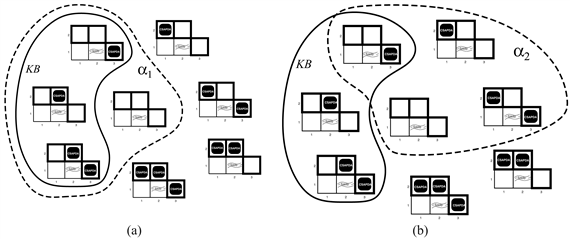

A vonzat és a bizonyítás megértésében segíthet, ha a <em>TB</em> összes következményeit egy szénakazalnak, az <em>α</em>-t pedig egy gombostűnek képzeljük el. A vonzat olyan, mintha a gombostű benne volna a kazalban; a bizonyítás pedig nem más, mint megpróbálni megtalálni ezt a tűt. Ez a különbségtétel formálisan a következő megfogalmazásban ölt testet: ha egy <em>i</em> következtetési algoritmus képes levezetni <em>α</em>-t a <em>TB</em>-ből, akkor írhatjuk, hogy

<code class="code"><em>TB</em> ⊦<em>iα</em></code>

amely kimondva: „<em>α</em> az <em>i</em> által levezethető <em>TB</em>-ből” vagy „<em>i</em> levezeti <em>α</em>-t a <em>TB</em>-ből”.

Egy következtetési eljárást, amely csak vonzat mondatokat vezet le, <strong>helyes</strong>nek (<strong>sound</strong>) vagy <strong>igazságtartó</strong>nak (<strong>truth-preserving</strong>) nevezzük. A helyesség egy igencsak kívánatos tulajdonság. Egy nem helyes következtetési eljárás kitalál olyan dolgokat ahogy előrehalad, olyan tűk megtalálását jelenti be, amelyek nem is léteznek. Egyszerű belátni, hogy a modellellenőrzés, ha alkalmazható,[<a id="id579721" href="#ftn.id579721" class="footnote">64</a>] akkor helyes eljárás. 

A <strong>teljesség</strong> (<strong>completeness</strong>) tulajdonság szintén kívánatos: egy következtetési eljárás teljes, ha képes levezetni minden vonzatmondatot. Valódi szénakazlak esetében, amelyek véges méretűek, nyilvánvalónak tűnik, hogy szisztematikus kutatással mindig eldönthető, hogy a tű a kazalban van-e. Sok tudásbázis esetében azonban a konzekvenciák szénakazlának mérete végtelen, és így a teljesség egy fontos kérdéssé válik.[<a id="id579753" href="#ftn.id579753" class="footnote">65</a>] Szerencsére léteznek teljes következtetési eljárások a logikához, amelyek megfelelően kifejezők ahhoz, hogy számos tudásbázist kezeljenek.

<h3 class="title">Fontos</h3>
Egy olyan következtetési folyamatot írtunk le, amelynek következményei bármely világban garantáltan igazak, ahol a premisszák is igazak. Nevezetesen, <em>ha a </em>TB<em> igaz a valódi világban, akkor bármely, a </em>TB<em>-ből helyes következtetési eljárással levezetett α mondat szintén igaz a valódi világban</em>. Így, míg a következtetési folyamat a „szintaxison” működik – belső fizikai konfigurációkon, mint például regiszterek bitjein vagy az agy elektromos jelzéseinek mintáin –, addig a folyamat megfelel valódi világ viszonyainak. Ennek megfelelően a valódi világ néhány aspektusa lesz az eset,[<a id="id579773" href="#ftn.id579773" class="footnote">66</a>] mivel a valódi világ bizonyos más aspektusai jelenleg képezik az esetet. Ezt a megfeleltetést a világ és a reprezentáció között mutatja a 7.6. ábra.

<a id="id579782"/>
<strong>7.6. ábra - A mondatok az ágens fizikai konfigurációi, és a következtetés az a folyamat, amely új fizikai konfigurációkat hoz létre régiekből. A logikai következtetésnek biztosítania kell, hogy az új konfigurációk olyan aspektusait reprezentálják a világnak, amelyek ténylegesen is következnek azokból az aspektusokból, amelyeket a régi konfigurációk reprezentálnak.</strong>

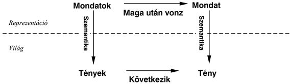

<h3 class="title">Fontos</h3>
Az utolsó kérdés, amivel foglalkoznunk kell a logikai ágensek tárgyalásánál, a <strong>megalapozottság</strong> (<strong>grounding</strong>) kérdése, ami nem más, mint a kapcsolat, ha egyáltalán létezik ilyen, a logikai következtetési folyamat és a valódi környezet között, amelyben az ágens létezik. Nevezetesen <em>hogyan tudhatjuk meg, hogy a TB igaz-e a valódi világban?</em> (Ezután a <em>TB</em> már csak „szintaxis” az ágens fejében.) Ez egy filozófiai kérdés, amelyről sok-sok könyvet írtak (lásd 26. fejezet). Egy egyszerű válasz az, hogy az ágens érzékelői létesítik a kapcsolatot. Például a mi wumpus világbeli ágensünknek van egy szagló érzékelője. Az ágensprogram létrehoz egy megfelelő mondatot mindig, ha van illat. Így bármikor, ha ez a mondat a tudásbázisban van, ez igaz a valódi világban is. Ezáltal az érzetmondatok jelentését és igazságát az őket létrehozó érzékelő és mondatkonstruáló folyamatok határozzák meg. És mi a teendő az ágens tudásának egyéb részeivel, mint az a meggyőződése, hogy a wumpus rossz illatot terjeszt a szomszédos négyzetekben? Ez nem egy közvetlen reprezentációja egy egyedi érzetnek, hanem egy általános szabály, például érzékelési tapasztalatokból levezetve, de nem azonos magával a tapasztalatnak a kijelentésével. Az ilyen általános szabályokat a <strong>t</strong><strong>anulás</strong>nak (<strong>learning</strong>) nevezett mondatkonstruáló folyamat hozza létre, ami a VI. résznek a tárgya. A tanulás nem tévedhetetlen. Lehet, hogy az eset az, hogy a wumpusok mindig rossz illatot árasztanak, <em>kivéve szökőévekben február 29-én,</em> amikor egyébként megfürödnek. Így lehet, hogy a <em>TB</em> nem igaz a valódi világban, de jó tanuló eljárásokkal van ok az optimizmusra.

7.4. Az ítéletkalkulus: egy nagyon egyszerű logika
<a id="ID_258_oldal"/>
Most egy nagyon egyszerű logikát, az <strong>ítéletkalkulus</strong>t (<strong>propositional logic</strong>) mutatjuk be.[<a id="id579851" href="#ftn.id579851" class="footnote">67</a>] Áttekintjük az ítéletkalkulus szintaxisát, majd a szemantikáját – annak a módját, ahogy a mondatok igazságát meghatározzuk. Azután megnézzük a maga után vonzást – a relációt egy adott mondat és azon mondat között, amelyik az előbbiből következik –, és megnézzük, hogy hogyan vezet ez egy egyszerű logikai következtetés algoritmushoz. Mindez természetesen a wumpus világban fog lejátszódni. 

<h2 class="title"><a id="id579869"/>Szintaxis</h2>

<a id="ID_259_oldal"/>
Az ítéletkalkulus <strong>szintaxis</strong>a meghatározza a lehetséges mondatokat. Az <strong>atomi mondat</strong>ok (<strong>atomic sentence</strong>s) – oszthatatlan szintaktikai elemek – egyetlen <strong>ítéletszimbólum</strong>ból (<strong>proposition symbol</strong>) állnak. Minden ilyen szimbólum egy kijelentés, ami igaz vagy hamis lehet. Nagybetűs neveket fogunk használni a szimbólumok jelölésére: <em>P</em>,<em> Q</em>,<em> R</em> és így tovább. A nevek tetszőlegesek, de gyakran úgy választjuk őket, hogy a nevek bizonyos jelentéssel is rendelkezzenek. Például használhatjuk a <em>W</em>1,3-t annak az állításnak a kifejezésére, hogy a wumpus az [1, 3]-ban van. (Ne felejtsük el, hogy a <em>W</em>1,3 <em>atomi,</em> így a <em>W</em>, az 1 és a 3 nem jelentéssel bíró részei a szimbólumnak.) Létezik két ítéletszimbólum, amelyeknek rögzített az értelmezése: az <em>Igaz</em> egy mindig igaz állítás, és a <em>Hamis</em> egy mindig hamis állítás.

<strong>Összetett mondat</strong>ok (<strong>complex sentence</strong>s) létrehozhatók egyszerűbb mondatokból logikai <strong>összekötőjel</strong>ek (<strong>logical connective</strong>s) felhasználásával. Öt elterjedten használt összekötőjel van:

¬	(nem). Egy mondatot, mint a ¬<em>W</em>1,3<em>-</em>t, <strong>negáció</strong>nak (<strong>negation</strong>) nevezünk. Egy <strong>literál</strong> (<strong>literal</strong>) vagy egy atomi mondat (egy pozitív literál), vagy egy negált atomi mondat (egy negatív literál). 

∧	(és). Egy mondatot, amelynek fő kötőszava a ∧, mint például a <em>W</em>1,3 ∧ <em>C</em>1,3 <strong>konjunkció</strong>-nak (<strong>conjunction</strong>) nevezünk; ennek részei a <strong>konjunkt</strong>ok (<strong>conjunct</strong>s). (Az ∧ jel hasonlít egy A-ra, az angol <em>And</em> (és) szóból.)

∨	(vagy). Egy mondat, amely használja a ∨ összekötőjelet, mint a<em> </em>(<em>W</em>1,3 ∧ <em>C</em>1,3) ∨ <em>W</em>2,2 egy <strong>diszjunkció</strong> (<strong>disjunction</strong>), méghozzá a (<em>W</em>1,3 ∧ <em>C</em>1,3) és a <em>W</em>2,2 <strong>diszjunkt</strong>oknak (<strong>disjunct</strong>s) a diszjunkciója. (Történelmileg a ∨ jel a latin <em>vel</em> kifejezésből származik, ami „vagy”-ot jelent. A legtöbb ember számára könnyebb megjegyezni úgy, mint egy fejjel lefelé álló <em>és</em> jelet, vagy a magyar olvasók számára, mint a <em>vagy</em> szó első betűjét.)

⇒(implikáció). Egy mondatot, mint amilyen a (<em>W</em>1,3 ∧ <em>C</em>1,3)  ⇒ ¬<em>W</em>2,2 <strong>implikáció</strong>nak (<strong>implication</strong>) (vagy feltételes mondatnak) nevezünk. Ennek <strong>premisszá</strong>ja (<strong>premise</strong>) vagy <strong>előzmény</strong>e (<strong>antecedent</strong>) a (<em>W</em>1,3 ∧ <em>C</em>1,3), <strong>konklúzió</strong>ja (<strong>conclusion</strong>) vagy <strong>következmény</strong>e (<strong>consequent</strong>) pedig a ¬<em>W</em>2,2 implikáció <strong>szabály</strong>ként (<strong>rule</strong>) vagy <strong>ha–akkor</strong> (<strong>if–then</strong>) állításként is ismert. Az implikációt más könyvekben időnként a ⊃ vagy a → szimbólumokkal jelölik.

⇔ (akkor és csakis akkor). A <em>W</em>1,3 ⇔¬<em>W</em>2,2 mondat egy <strong>ekvivalencia</strong> (<strong>biconditional</strong>).

A 7.7. ábra mutatja az ítéletkalkulus formális nyelvtanát; ha nem ismeri a BNF jelölésrendszert, akkor nézze meg az <a class="xref" href="apb.md#ID_1112_oldal">„B1. Nyelvek definiálása Backus–Naur-Formában (BNF)”</a> részt<em>.</em>

<a id="id580237"/>
<strong>7.7. ábra - Ítéletkalkulus-beli mondatok BNF (Backus–Naur-forma) nyelvtana</strong>

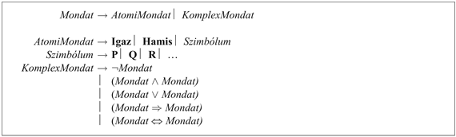

Vegyük észre, hogy a nyelvtan nagyon szigorú a zárójelezésnél: minden mondatot, amelyet bináris összekötőjellel hozunk létre, zárójelek közé kell tenni. Ez biztosítja, hogy a szintaxis teljesen egyértelmű. Ez azt is jelenti például, hogy ((<em>A</em> ∧ <em>B</em>) ⇒ <em>C</em>)-t kell írjunk <em>A</em> ∧ <em>B</em> ⇒ <em>C</em> helyett. Az olvashatóság javítása céljából gyakran elhagyjuk a zárójeleket, megbízva ehelyett az összekötőjeleknek egy precedencia-sorrendjében. Ez hasonló az aritmetikában alkalmazott precedenciához – például az <em>ab </em>+<em> c</em>-t ((<em>ab</em>)<em> </em>+ <em>c</em>)<em>-</em>nek olvassuk, és nem <em>a</em>(<em>b</em> + <em>c</em>)<em>-</em>nek, mert a szorzásnak magasabb a precedenciája, mint az összeadásnak. Az ítéletkalkulus precedencia-sorrendje (a legmagasabbtól a legalacsonyabb felé: ¬, ∧, ∨, ⇒ és ⇔. Így a mondat:

<code class="code">¬<em>P</em> ∨ <em>Q</em> ∧ <em>R</em> ⇒ <em>S</em></code>

ekvivalens a következő mondattal:

<code class="code">((¬<em>P</em>) ∨ (<em>Q</em> ∧ <em>R</em>)) ⇒ <em>S</em></code>

A precedencia nem oldja fel a többértelműséget az olyan mondatoknál, mint az <em>A</em> ∧ <em>B</em> ∧ <em>C</em>, amelyet olvashatunk ((<em>A</em> ∧ <em>B)</em> ∧ <em>C</em>)-ként vagy (<em>A</em> ∧ (<em>B</em> ∧ <em>C</em>))-nek. Mivel a mondatnak ez a két olvasása ugyanazt jelenti a következő részben definiálandó szemantika szerint, az olyan mondatok, mint az <em>A</em> ∧ <em>B</em> ∧ <em>C</em> megengedettek. Szintén megengedjük az <em>A</em> ∨ <em>B</em> ∨ <em>C</em> és az <em>A </em>⇔ <em>B </em>⇔<em>C</em> mondatokat. Olyan mondatok, mint az <em>A</em> ⇒ <em>B</em> ⇒ <em>C</em> nem megengedettek, mert a két olvasásnak különböző jelentései vannak, ebben az esetben ragaszkodunk a zárójelhez. Végül, néha használni fogunk szögletes zárójelet az egyszerű zárójel helyett, ami a mondatot áttekinthetőbbé teszi majd.

<h2 class="title"><a id="id580422"/>Szemantika</h2>

Most, hogy specifikáltuk az ítéletkalkulus szintaxisát, definiáljuk a szemantikáját is. A szemantika definiálja a szabályokat, amivel meghatározható a mondat igazsága egy bizonyos modellben. Az ítéletkalkulusban a modell egyszerűen az igazságértéket – <em>igaz</em> vagy <em>hamis –</em> rögzíti minden ítéletszimbólumra. Például ha a tudásbázis mondatai a <em>C</em>1,2,<em> C</em>2,2 és <em>C</em>3,1 ítéletszimbólumokat használják fel, akkor egy lehetséges modell:

<code class="code"><em>m</em>1 ={<em>C</em>1,2 =<em> hamis</em>,<em> C</em>2,2<em> </em>=<em> hamis</em>,<em> C</em>3,1 =<em> igaz</em>}</code>

Három ítéletszimbólum esetén 23 = 8 lehetséges modell van – pontosan azok, amelyek a 7.5. ábrán vannak feltüntetve. Vegyük észre azonban, hogy miután elköteleztük magunkat egy szintaxis mellett, a modellek tisztán matematikai objektumokká váltak, amelyeknek nem feltétlenül van kapcsolatuk a wumpus világgal. A <em>C</em>1,2 csak egy szimbólum, jelentheti azt, hogy „csapda van az [1, 2]-ben” vagy azt, hogy „Párizsban vagyok ma és holnap”.

Az ítéletkalkulus szemantikájának meg kell határoznia, hogyan számítsuk ki bármely mondat igazságértékét egy adott modellben. Ez rekurzívan történik. Minden mondat atomi mondatokból és az ötféle összekötőjelből lett létrehozva, így meg kell határoznunk, hogy hogyan számítsuk ki az atomi mondatok igazságát, és meg kell határoznunk azt is, hogy hogyan számítsuk ki az igazságát az egyes összekötőjelek felhasználásával formált összetett mondatnak. Az atomi mondatok esete egyszerű:

<ul class="itemizedlist"><li class="listitem">
<em>Igaz</em> minden modellben igaz, és <em>Hamis</em> ha minden modellben hamis.
</li><li class="listitem">
	Minden más ítéletszimbólumnak az igazságértékét közvetlenül a modellben kell meghatározni. Például a korábban megadott <em>m</em>1 modellben a <em>C</em>1,2 hamis.
</li></ul>

Összetett mondatokra olyan szabályaink vannak, mint

<ul class="itemizedlist"><li class="listitem">
	Bármely <em>s</em> mondatra és bármely <em>m</em> modellre, a ¬<em>s</em> mondat az <em>m</em>-ben akkor és csakis akkor igaz, ha <em>s</em> hamis <em>m</em>-ben.
</li></ul>

Az ilyen szabályok visszavezetik az összetett mondatok igazságának eldöntését egyszerűbb mondatokra. Minden összekötőjelre vonatkozó szabály összefoglalható egy <strong>igazságtáblá</strong>ban (<strong>truth table</strong>), amely meghatározza egy összetett mondat igazságértékét a mondat komponenseinek minden lehetséges igazságérték hozzárendeléseihez. Az öt logikai összekötőjel igazságtábláját mutatja a 7.8. ábra. Ilyen táblák felhasználásával bármely <em>s</em> mondat igazságértéke egy <em>m</em> modellre vonatkozóan kiszámolható rekurzív kiértékelések egyszerű folyamatával. Például a ¬<em>C</em>1,2 ∧ (<em>C</em>2,2 ∨ <em>C</em>3,1) mondatot kiértékelve <em>m</em>1-ben <em>igaz</em> ∧ (<em>hamis </em>∨ <em>igaz</em>) = <em>igaz</em> ∧ <em>igaz </em>=<em> igaz</em> értéket kapunk. A 7.3. feladat azt kéri, hogy írjon egy <code class="code">IK-IGAZ? </code> (<em>s</em>,<em>m</em>) algoritmust, amely kiszámítja az <em>s</em> ítéletkalkulus mondatnak az igazságértékét egy <em>m</em> modellben.

Korábban azt mondtuk, hogy a tudásbázist mondatok halmaza alkotja. Most láthatjuk, hogy egy logikai tudásbázis ilyen mondatok konjunkciója. Tehát ha egy üres <em>TB</em>-vel kezdünk, és végrehajtjuk a <code class="code">KIJELENT</code>(<em>TB</em>, <em>S</em>1), ..., <code class="code">KIJELENT</code> (<em>TB</em>, <em>Sn</em>) műveleteket, akkor a <em>TB</em> = <em>S</em>1 ∧ …∧ <em>Sn </em>áll elő. Ez azt jelenti, hogy tudásbázisokat és mondatokat egymással felcserélhetően használhatunk.

Az „és”, „vagy” és „nem” igazságtáblái eltérnek attól, amit a természetes nyelvi jelentésük alapján gondolnánk. A lehetséges félreértés legszembetűnőbb pontja, hogy a <em>P </em>∨ <em>Q</em> kifejezés igaz akkor is, ha mind <em>P</em>, mind <em>Q</em> is igaz. Létezik másik összekötőjel is, a „kizáró vagy”-nak nevezett jel (röviden<em> xor</em>), amely hamisat ad, ha mindkét diszjunkt igaz.[<a id="id580725" href="#ftn.id580725" class="footnote">68</a>] Nincs általános egyetértés az „exkluzív vagy” szimbólumát illetően; két jelölés is ismert: 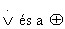

<a id="id580742"/>
<strong>7.8. ábra - Az öt logikai összekötőjel igazságtáblája. Amikor a táblát használjuk például a<em> P </em>∨<em> Q</em> értékének számítására, ha <em>P</em> igaz és <em>Q</em> hamis, akkor először megkeressük azt a sort, amelyben <em>P</em> <em>igaz</em> és <em>Q</em> <em>hamis</em> (a harmadik sor). Ezután a sorban megkeressük a <em>P </em>∨<em> Q</em> alatti oszlopot, hogy megtaláljuk az eredményt: <em>igaz</em>. Tekinthetjük a táblázat úgy is, hogy minden sor egy modell, és az egyes oszlopbeli elemek az adott sorban azt mondják meg, hogy a megfelelő mondat igaz-e az adott modellben.</strong>

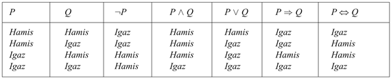

Az implikáció (⇒) igazságtáblája rejtélyesnek tűnhet első látásra, mivel nem teljesen illeszkedik ösztönös megértésünkhöz, hogy „<em>P</em> implikálja <em>Q</em>-t” vagy „ha <em>P,</em> akkor <em>Q</em>”. Az ítéletkalkulus nem kíván semmilyen ok-okozati relációt vagy relevanciát <em>P </em>és <em>Q</em> között. A mondat: „az a tény, hogy 5 páratlan implikálja, hogy Tokió Japán fővárosa” az ítéletkalkulusnak egy igaz mondata (a normális interpretáció szerint), még akkor is, ha ez határozottan furcsa mondatnak tűnik. Egy másik esete a félreértéseknek, hogy bármely implikáció igaz, ha az előzménye hamis. Például az „az az állítás, hogy 5 páros szám, implikálja, hogy Samu okos” mondat igaz, függetlenül attól, hogy Samu okos-e. Ez bizarrnak tűnik, de elfogadható, ha a „<em>P </em>⇒ <em>Q</em>”-t úgy értelmezzük, hogy „ha <em>P</em> igaz, akkor azt állítom, hogy <em>Q</em> is igaz. Egyébként nem állítok semmit”. Az egyetlen eset, amikor ez a mondat <em>hamis</em>, ha <em>P</em> <em>igaz</em>, de <em>Q</em> <em>hamis</em>.

A <em>P</em> ⇔ <em>Q </em>ekvivalencia igazságtáblája azt mutatja, hogy akkor igaz, ha mind <em>P</em> ⇒ <em>Q </em>és<em> Q </em>⇒ <em>P</em> igaz. Ezt gyakran úgy írjuk le, hogy „<em>P</em> akkor és csakis akkor, ha <em>Q</em>” vagy matematikában szokták jelölni „<em>P</em> aa <em>Q</em>”-nak. A wumpus világ szabályait legjobban az ⇔ használatával tudjuk felírni. Például, egy négyzet szellős, ha a szomszédos, ha a szomszédos négyzetben csapda van, és egy négyzet csakis akkor szellős négyzetben csapda van. Így ekvivalenciákra van szükségünk, mint a 

<code class="code"><em>S</em>1,1<em> </em>⇔ (<em>C</em>1,2<em> </em>∨ <em>C</em>2,1)</code>

ahol <em>S</em>1,1<em> </em>jelenti, hogy szellő van az [1, 1]-ben. Vegyük észre, hogy az egyirányú implikáció

<code class="code"><em>S</em>1,1 ⇒ (<em>C</em>1,2<em> </em>∨ <em>C</em>2,1)</code>

igaz a wumpus világban, de nem teljes. Nem szabályozza azokat a modelleket, amelyekben <em>S</em>1,1<em> </em>hamis és <em>C</em>1,2 igaz, amivel megszegnénk a wumpus világ szabályait. Egy másik mód ennek érzékeltetésére, hogy az implikáció igényli a csapda jelenlétét, ha szellő van, miközben az ekvivalencia szintén megkívánja a csapda hiányát, ha nincs szellő. 

<h2 class="title"><a id="id580963"/>Egy egyszerű tudásbázis</h2>

Most, hogy definiáltuk az ítéletkalkulus szemantikáját, létre tudunk hozni egy tudásbázist a wumpus világ számára. Az egyszerűség kedvéért csak a csapdákkal fogunk törődni, a wumpust magát feladatként az olvasóra hagyjuk. A tudás, amelyet most leírunk, elégséges ahhoz, hogy elvégezzük a 7.3. alfejezetben nem formálisan már elvégzett következtetést. 

Először meg kell választanunk a szótárunkat az ítéletszimbólumaink megnevezéséhez. Minden <em>i</em>, <em>j</em>-re: 

<ul class="itemizedlist"><li class="listitem">
Legyen <em>C</em><em>i</em>,<em>j</em> igaz, ha csapda van [<em>i</em>,<em> j</em>]-ben.
</li><li class="listitem">
Legyen <em>S</em><em>i</em>,<em>j</em> igaz, ha szellő van [<em>i</em>,<em> j</em>]-ben.
</li></ul>

A tudásbázis tartalmazza a következő mondatokat (mindegyiket felcímkézzük a kényelem kedvéért):

<ul class="itemizedlist"><li class="listitem">
Nincs csapda az [1, 1]-ben:
</li></ul>

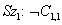

<ul class="itemizedlist"><li class="listitem">
Egy négyzet akkor és csakis akkor szellős, ha csapda van a szomszédos négyzetben. Ezt minden négyzetre vonatkozóan ki kell jelenteni, mi most csak a releváns négyzeteket tekintjük:
</li></ul>

<code class="code"><em>Sz</em>2: <em>S</em>1,1<em> </em>⇔ (<em>C</em>1,2 ∨ <em>C</em>2,1)</code>

<code class="code"><em>Sz</em>3: S2,1 ⇔ (<em>C</em>1,1 ∨ <em>C</em>2,2 ∨ <em>C</em>3,1)</code>

<ul class="itemizedlist"><li class="listitem">
Az eddigi mondatok minden wumpus világban igazak. Most hozzáadjuk a szellő érzetet az első két meglátogatott négyzetre abban a specifikus világban, ahol az ágens jelenleg tartózkodik, ami elvezet a 7.3. (b) ábrán látott szituációhoz.
</li></ul>

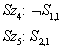

A tudásbázis most <em>Sz</em>1-től <em>Sz</em>5-ig tartalmaz mondatokat. Tekinthetjük ezt úgy is, mint egyetlen mondatot – az <em>Sz</em>1 ∧ <em>Sz</em>2 ∧ <em>Sz</em>3 ∧ <em>Sz</em>4 ∧ <em>Sz</em>5 konjunkciót –, mivel ez azt is kijelenti egyben, hogy minden egyes mondat is igaz.

<h2 class="title"><a id="id581174"/>Következtetés</h2>

Emlékezzünk, hogy a logikai következtetés célja, hogy eldöntsük, hogy <em>TB</em> ⊨ <em>α</em> bizonyos <em>α </em>mondatokra. Például, hogy a tudásbázis maga után vonzza-e a <em>C</em>2,2<em> </em>állítást. Az első algoritmusunk a következtetésre a vonzat definíciójának közvetlen megvalósítása lesz: vegyük sorba a modelleket, és ellenőrizzük, hogy <em>α</em>  igaz-e minden modellben, amelyben a <em>TB</em> igaz. Az ítéletlogikában a modellek az <em>igaz</em> és <em>hamis</em> értékek hozzárendelései minden egyes ítéletszimbólumhoz. Visszatérve a mi wumpus világbeli példánkhoz, a releváns ítéletszimbólumok az <em>S</em>1,1,<em> S</em>1,2,<em> C</em>1,1,<em> C</em>1,2,<em> C</em>2,1,<em> C</em>2,2,<em> C</em>3,1. A 7 szimbólum 27 = 128 lehetséges modellt jelent, háromban ezek közül a <em>TB</em> igaz (7.9. ábra). Ebben a három modellben 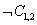   igaz, így nincsen csapda az [1, 2]-ben. Viszont a <em>C</em>2,2 a három modellből kettőben igaz és egyben hamis, így még nem tudjuk megmondani, hogy van-e csapda [2, 2]-ben. 

A 7.9. ábra precízebb formában megismétli a 7.5. ábrán illusztrált következtetést. A 7.10. ábra egy általános algoritmust mutat a maga után vonzás eldöntésére az ítéletkalkulusban. Mint a <code class="code">VISSZALÉPÉSES-KERESÉS</code> algoritmus a <a class="xref" href="ch03s04.md#ID_115_116_oldal">„Mélységi keresés”</a> részben, az <code class="code">IT-VONZAT</code>? egy rekurzív felsorolást végez a változó hozzárendelések véges terén. Az algoritmus <strong>helyes</strong>, mivel közvetlenül a vonzat definícióját valósítja meg, és teljes, mivel bármely <em>TB</em>-on és <em>α</em>  mondaton működik, és mindig sikeresen véget ér, hiszen véges számú modellt kell megvizsgálni. 

<a id="id582486"/>
<strong>7.9. ábra - A tudásbázis alapján épített igazságtábla látható az ábrán. A <em>TB</em> igaz, ha Sz1-től és Sz5-ig igaz, amely a 128 sorból csak 3-ban fordul elő. Mind a 3 sorban C1,2 hamis, tehát nincsen csapda az [1, 2]-ben. Viszont lehet, hogy van csapda [2, 2]-ben (bár lehet, hogy nincs).</strong>

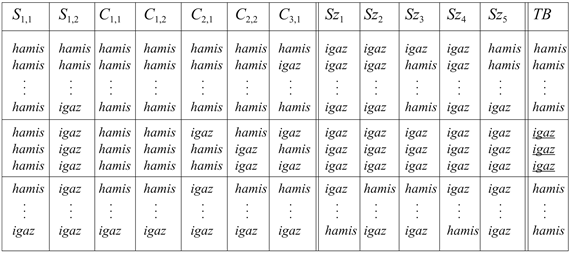

<a id="id582510"/>
<strong>7.10. ábra - Egy igazságtábla felsoroló algoritmus ítéletkalkulus állítás vonzatának eldöntésére. Az IT az igazságtáblát jelöli. A <code class="code">IK-IGAZ</code>? igazat ad vissza, ha a mondatot tartalmazza a modell. A <em>modell</em> változó reprezentál egy részleges modellt, egy hozzárendelést a változók egy részéhez. A <code class="code">KIEGÉSZÍT</code> (<em>P</em>, <em>igaz</em>, <em>modell</em>) függvény egy új részleges modellt ad vissza, amelyben <em>P</em> értéke igaz.</strong>

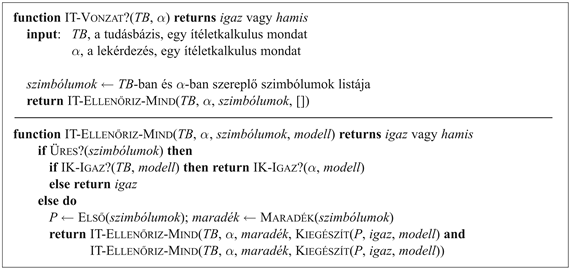

<h3 class="title">Fontos</h3>
Természetesen a „véges számosság” nem mindig jelenti a „néhányat”. Ha a <em>TB</em> és az <em>α</em> mondat összesen <em>n</em> szimbólumot tartalmaz, akkor 2n modell létezik. Így az algoritmus időigénye <em>O</em>(2n). (A tárigénye csak <em>O</em>(<em>n</em>), mivel a felsorolás mélységi jellegű.) A fejezet későbbi részében fogunk látni olyan algoritmusokat, amelyek sokkal hatékonyabbak a gyakorlatban. Sajnos <em>minden ismert, az ítéletlogikára vonatkozó következtetési algoritmusnak a legrosszabb esetre vonatkozó komplexitása exponenciálisan függ a bemenetek számától</em>. Nem remélhetjük, hogy ennél hatékonyabbak is lehetnénk, mivel az ítéletlogikában a maga után vonzás co-NP-teljes (lásd A) függelék).

<h2 class="title"><a id="id582583"/>Ekvivalencia, érvényesség és kielégíthetőség</h2>

Mielőtt belemerülnénk a logikai következtetés részleteinek tárgyalásába, szükségünk van néhány további, a vonzattal kapcsolatos fogalomra. Mint a vonzat, ezek a fogalmak is a logika minden formájára alkalmazhatók, de legjobban egy konkrét logikán – mint amilyen az ítéletkalkulus – lehet illusztrálni őket.

Az első fogalom a <strong>logikai ekvivalencia</strong> (<strong>logical equivalence</strong>): két mondat, az <em>α</em> és a <em>β</em> mondatok logikailag ekvivalensek, ha ezek a mondatok a modellek ugyanazon halmazán igazak. Ezt úgy jelöljük, hogy <em>α</em> ⇔ <em>β</em>. Például (igazságtáblákat használva) könnyen megmutathatjuk, hogy <em>P</em> ∧ <em>Q</em> és <em>Q</em> ∧ <em>P</em> logikailag ekvivalensek; további ekvivalenciák láthatók a 7.11. ábrán. Az ekvivalenciák nagyon hasonló szerepet játszanak a logikában, mint az aritmetikai identitások a közönséges matematikában. Az ekvivalencia alternatív definíciója a következő: bármely <strong>két</strong> <em>α</em>, <em>β</em>  mondatra, 

<code class="code"><em>α </em>≡<em> β</em>  akkor és csakis akkor, ha <em>α </em>⊨ <em>β </em>és <em>β </em>⊨ <em>α</em></code>

(Emlékeztetőül, a ⊨ a maga után vonzást jelöli.) 

A második fogalom, amelyre szükségünk lesz az <strong>érvényesség</strong> (<strong>validity</strong>). Egy mondat érvényes, ha igaz <em>minden</em> modellben. Például a 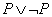 mondat érvényes. Az érvényes mondatokat <strong>tautológiá</strong>knak (<strong>tautologies</strong>) is szokták nevezni, ezek szükségszerűen igazak és így feleslegesek. Mivel az <em>Igaz</em> mondat igaz minden modellben, minden érvényes mondat logikailag ekvivalens az <em>Igaz</em> mondattal.

<a id="id582710"/>
<strong>7.11. ábra - Standard logikai ekvivalenciák. Az <em>α</em>, <em>β</em>, <em>γ</em> szimbólumok tetszőleges ítéletkalkulus mondatokat jelölnek.</strong>

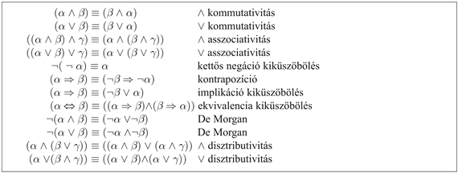

<h3 class="title">Fontos</h3>
Mire jók akkor az érvényes mondatok? A vonzatokra vonatkozó definíciónk alapján levezethetjük a <strong>dedukcióelmélet</strong>et (<strong>deduction theorem</strong>), amelyet már az ókori görögök is ismertek:

<code class="code"><em>Bármely α és β</em> <em>mondatra α </em>⊨ <em>β</em>  <em>akkor és csakis akkor, ha az </em>(<em>α </em>⇒ <em>β</em>) <em>mondat érvényes.</em></code>

(A 7.4. feladatban ennek a bizonyítását kérjük.) A 7.10. ábrán látható következtetési algoritmust úgy tekinthetjük, mint a (<em>TB</em> ⇒ <em>α</em>) érvényességének ellenőrzését. Másik oldalról nézve viszont minden érvényes implikáció leír egy legitim következtetést.

Az utolsó fogalom, amelyre szükségünk lesz a <strong>kielégíthetőség</strong> (<strong>satisfiability</strong>). Egy mondat kielégíthető, ha igaz <em>néhány</em> modellben. Például a korábban bemutatott tudásbázis, az (<em>Sz</em>1 ∧ <em>Sz</em>2 ∧ <em>Sz</em>3 ∧ <em>Sz</em>4 ∧ <em>Sz</em>5), kielégíthető, mert van három olyan modell, amelyben igaz, ahogy ezt a 7.9. ábrán megmutattuk. Ha egy <em>α</em> mondat igaz az <em>m</em> modellben, akkor azt mondjuk, hogy <em>m</em> <strong>kielégíti</strong> (<strong>satisfies</strong>) <em>α</em>-t, vagy <em>m</em> egy <strong>modell</strong>je <em>α</em>-nak. A kielégíthetőség ellenőrizhető úgy, hogy a lehetséges modelleket felsoroljuk mindaddig, amíg nem találunk egyet, amely kielégíti a mondatot. A mondatok kielégíthetőségének meghatározása az ítéletlogikában az első olyan probléma volt, amelyről bebizonyították, hogy NP-teljes.

Számos probléma a számítástechnikában valójában kielégíthetőségi probléma. Például a kényszerkielégítési problémák az 5. fejezetben alapvetően arra kérdeznek rá, hogy a kényszerek kielégíthetők-e néhány hozzárendeléssel. Megfelelő transzformációk után a keresési problémák szintén megoldhatók a kielégíthetőség ellenőrzésével. Az érvényesség és a kielégíthetőség természetesen kapcsolatban vannak: <em>α</em> érvényes akkor és csakis akkor, ha 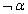 nem kielégíthető; és fordítva, α akkor és csakis akkor kielégíthető, ha  nem érvényes. A következő hasznos eredményt is ismerjük:

<code class="code"><em>α </em>⊨ <em>β</em> <em>akkor és csakis akkor, ha az </em>(<em>α</em> ∧ ¬<em> β</em>)<em> nem kielégíthető</em></code>

<h3 class="title">Fontos</h3>
A <em>β</em>  mondat bizonyítása <em>α</em>  alapján, az (<em>α</em> ∧ ¬<em>β</em>) kielégíthetetlenségének ellenőrzésével, pontosan megfelel a szokásos matematikai bizonyítási technikának a <em>redukcio ad absurdumnak</em> (szó szerint „redukció egy abszurd dologra”). Szokták ezt <strong>megcá</strong><strong>folás</strong> (<strong>refutation</strong>) általi bizonyításnak is nevezni vagy bizonyítás <strong>ellentmondás</strong> (<strong>contradiction</strong>) által. Feltételezzük, hogy a <em>β</em> mondat hamis, és megmutatjuk, hogy ez a feltételezés ellentmondásra vezet az ismert <em>α</em> axiómákkal. Ez az ellentmondás pontosan azt jelenti, mint amikor azt mondjuk, hogy az (<em>α</em> ∧ <em>¬β</em>) mondat kielégíthetetlen.

 

[<a id="ftn.id579312" href="#id579312" class="para">60</a>]  Az olvasó minden bizonnyal észrevette a hasonlóságot a mondatok igazságának fogalma és az 5. fejezetben bemutatott kényszerek kielégítésének fogalma között. Ez nem véletlen, a kényszernyelvek valójában logikák, és a kényszerproblémák megoldása a logikai következtetés egy formája.

[<a id="ftn.id579318" href="#id579318" class="para">61</a>]  A <strong>fuzzy logika</strong> (<strong>fuzzy logics</strong>), amelyet a 14. fejezetben mutatunk be, megengedi az igazság fokának kezelését.

[<a id="ftn.id579501" href="#id579501" class="para">62</a>]  Habár az ábra a modelleket, mint egy részleges wumpus világot mutatja, ezek valójában nem mások, mint az igaz és hamis értékek hozzárendelései a „csapda van az [1, 2]-ben” mondathoz. A modellek, matematikai értelemben, nem igénylik, hogy szörnyűséges illatú wumpusok legyenek benne.

[<a id="ftn.id579596" href="#id579596" class="para">63</a>]  Az ágens ki tudja számolni, hogy mekkora a valószínűsége annak, hogy van csapda a [2, 2]-ben. A 13. fejezet fogja megmutatni azt, hogy hogyan.

[<a id="ftn.id579721" href="#id579721" class="para">64</a>]  A modellellenőrzés működik, ha a modellek tere véges, mint például egy rögzített méretű wumpus világ esetében. Az aritmetika esetében ezzel szemben a modellek tere végtelen, még akkor is, ha korlátozzuk magunkat az egész számokra, mivel végtelen számú <em>x</em>, <em>y</em> értékpár létezik az <em>x</em> + <em>y</em> = 4 egyenlethez.

[<a id="ftn.id579753" href="#id579753" class="para">65</a>]  Hasonlítsuk össze a 3. fejezet végtelen keresési tereinek esetével, ahol látható, hogy a mélységi keresés nem teljes.

[<a id="ftn.id579773" href="#id579773" class="para">66</a>]  Mint azt Wittgenstein (1922) írta híres művében, a <em>Tractatus</em>ban: „A világ mindaz, aminek az esete fennáll.”

[<a id="ftn.id579851" href="#id579851" class="para">67</a>]  Az ítéletkalkulust<strong> Boole-logiká</strong>nak (<strong>Boolean logic</strong>) is nevezzük, a logikával foglalkozó George Boole (1815–1864) után.

[<a id="ftn.id580725" href="#id580725" class="para">68</a>]  A latinnak létezik külön szava az „exkluzív vagy” kifejezésére, ez az<em> aut</em>.

</body></html>
