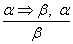
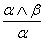
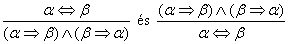
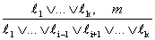
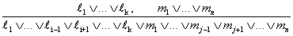
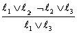
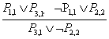
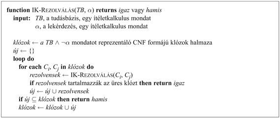
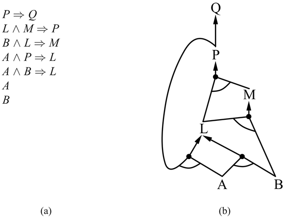

<?xml version="1.0" encoding="UTF-8" standalone="no"?>
<!DOCTYPE html PUBLIC "-//W3C//DTD XHTML 1.1//EN" "http://www.w3.org/TR/xhtml11/DTD/xhtml11.dtd">
<html xmlns="http://www.w3.org/1999/xhtml"><head><meta name="generator" content="DocBook XSL Stylesheets V1.76.1"/></head><body>

<h1 class="title"><a id="id582971"/>Az ítéletkalkulus következtetési mintái</h1>

<a id="ID_265_oldal"/>
Ez az alfejezet végigveszi a következtetés standard mintáit, amelyek alkalmazhatók arra, hogy következmények láncolatait vezethessük le, amelyek elvezetnek a kívánt célhoz. Ezeket a következtetési mintákat <strong>következtetési szabály</strong>oknak (<strong>inference rules</strong>) hívjuk. A legjobban ismert szabály a <strong>Modus Ponens</strong> és a következőképpen írható le:

A jelölés azt jelenti, hogy ha bármikor adott egy <em>α ⇒ β</em> formájú mondat és adott egy <em>α</em>, akkor a <em>β</em> mondat ebből következik. Például a (<em>WumpusElőrefelé</em> ∧ <em>WumpusÉl</em>) ⇒ <em>Lövés </em>és a<em> </em>(<em>WumpusElőrefelé</em> ∧ <em>WumpusÉl</em>) adott, akkor a <em>Lövés</em> kikövetkeztethető.

Egy másik hasznos következtetési szabály az <strong>És-kiküszöbölés</strong> (<strong>And-Elimination</strong>), ami azt mondja ki, hogy egy konjunkcióból bármely konjunkt kikövetkeztethető:

Például abból, hogy (<em>WumpusElőrefelé</em> ∧ <em>WumpusÉl</em>) a <em>WumpusÉl</em> kikövetkeztethető.

Tekintettel az <em>α</em> és β<em> </em>lehetséges igazságértékeire, könnyen megmutatható, hogy a Modus Ponens és az És-kiküszöbölés helyes egyszer és mindenkorra. Ezek a szabályok felhasználhatók bármely konkrét esetben, ahol alkalmazhatók, helyes következtetéseket eredményezve anélkül, hogy fel kellett volna sorolnunk a modelleket.

A 7.11. ábrán található összes logikai ekvivalencia használható következtetési szabályként. Például az ekvivalencia kiküszöbölés két következtetési szabályt eredményez:

Nem minden következtetési szabály működik mindkét irányban, mint ezek. Például nem futtathatjuk a Modus Ponenst ellenkező irányban, hogy megkapjuk <em>α </em>⇒<em> β</em>-t és <em>α</em>-t a <em>β</em>-ból.

Nézzük meg, hogyan használhatjuk ezeket a következtetési szabályokat és ekvivalenciákat a wumpus világban. Az <em>Sz</em>1, ..., <em>Sz</em>5 szabályokból álló tudásbázisból indulunk ki, és megmutatjuk, hogy hogyan bizonyíthatjuk a ¬<em>C</em>1,2-t azaz, hogy nincs csapda az [1, 2]-ben. Először alkalmazzuk az ekvivalencia kiküszöbölést <em>Sz</em>2-re, és így kapjuk, hogy 

<code class="code"><em>Sz</em>6: (<em>S</em>1,1<em> </em>⇒<em> </em>(<em>C</em>1,2 ∨ <em>C</em>2,1)) ∧ ((<em>C</em>1,2 ∨ <em>C</em>2,1) ⇒ <em>S</em>1,1)<em> </em></code>

Ezután alkalmazzuk az És-kiküszöbölést az <em>Sz</em>6-ra, és így kapjuk, hogy

<code class="code"><em>Sz</em>7: ((<em>C</em>1,2 ∨ <em>C</em>2,1) ⇒ <em>S</em>1,1) </code>

A kontrapozíció logikai ekvivalenciát alkalmazva:

<code class="code"><em>Sz</em>8: (¬<em>S</em>1,1 ⇒ ¬(<em>C</em>1,2 ∨ <em>C</em>2,1))</code>

Most alkalmazhatjuk a Modus Ponenst az <em>Sz</em>8-ra és az <em>Sz</em>4 érzetre (például a ←<em>S</em>1,1) és így kapjuk: 

<code class="code"><em>Sz</em>9: ¬(<em>C</em>1,2 ∨ <em>C</em>2,1) </code>

Végül alkalmazzuk a De Morgan-szabályt, amely a konklúziót adja:

<code class="code"><em>Sz</em>10: ¬<em>C</em>1,2 ∧ ¬<em>C</em>2,1 </code>

Tehát sem az [1, 2], sem a [2, 1] négyzet nem tartalmaz csapdát. 

Az előző levezetést – következtetési szabályok egy sorozatát – <strong>bizonyítás</strong>nak (<strong>proof</strong>) nevezzük. A bizonyítás megtalálása pontosan olyan, mint megoldást találni egy keresési problémára. Valójában ha a következtetési szabályok összes lehetséges alkalmazásának generálására egy új állapotátmenet-függvényt definiálnánk, akkor minden, a 3. és 4. fejezetbeli kereső algoritmust felhasználhatnánk a bizonyítás megtalálására. A bizonyítás keresése tehát egy alternatívája a modellek felsorolásának. A keresés haladhat előrefelé a kezdeti tudásbázisból kiindulva, alkalmazva a következtetési szabályokat a célmondat levezetéséhez, vagy mehet visszafelé a célmondatból, megpróbálva megtalálni a következtetési szabályoknak olyan láncolatát, amely a kiindulási tudásbázisra alkalmazható szabályokból indul. A fejezetben később bemutatunk két olyan algoritmuscsaládot, amelyek ezeket a technikákat használják. 
<a id="ID_267_oldal"/>
<h3 class="title">Fontos</h3>
Az a tény, hogy a következtetés az ítéletlogikában NP-teljes, azt sugallja, hogy a legrosszabb esetet tekintve a bizonyítások keresése sem hatékonyabb a modellek felsorolásánál. Számos gyakorlati esetben azonban, <em>α bizonyítás megtalálása sokkal hatékonyabb lehet, egyszerűen azért, mert képes figyelmen kívül hagyni az irreleváns állításokat, függetlenül attól, hogy hány van belőlük</em>. Például az előző bizonyítás, amely elvezetett a ¬<em>C</em>1,2 ∧ ¬<em>C</em>2,1 mondathoz, nem említi az <em>S</em>2,1, <em>C</em>1,1, <em>C</em>2,2 vagy a <em>C</em>1,2 állításokat. Ezeket azért lehet figyelmen kívül hagyni, mert a <em>C</em>1,2 célállítás csak az <em>Sz</em>2-ben jelenik meg, az <em>Sz</em>2-ben szereplő egyéb állítások pedig csak az <em>Sz</em>2-ben és az <em>Sz</em>4-ben, így az <em>Sz</em>1, <em>Sz</em>3 és <em>Sz</em>5 szabályoknak nincs kihatásuk a bizonyításra. Ugyanez maradna a helyzet, ha még millió szabályt hozzáadnánk a tudásbázishoz, miközben az igazságtábla algoritmust ezzel ellentétben elárasztaná a modellek exponenciális robbanása. 

A logikai rendszereknek ez a tulajdonsága valójában egy sokkal alapvetőbb jellegzetességükből, a <strong>monotonitás</strong>ból (<strong>monotonicity</strong>) következik. A monotonitás azt mondja ki, hogy a vonzatmondatok halmaza csak bővülhet, ha a tudásbázishoz információt adunk hozzá.[<a id="id583439" href="#ftn.id583439" class="footnote">69</a>] 

<code class="code">ha 	<em>TB </em>⊨<em> α	</em>    akkor      <em>TB </em>∧<em> β </em>⊨<em> α</em></code>

Például feltételezzük azt, hogy a tudásbázis tartalmaz egy új <em>β</em>  állítást, amely azt mondja ki, hogy pontosan 8 csapda van a világban. Ez a tudás segítheti az ágenst további konklúziók levezetésében, de nem teheti érvénytelenné egyik korábban kikövetkeztetett <em>α</em> konklúziót sem – így azt a konklúziót sem, hogy nincsen csapda az [1, 2]-ben. A monotonitás azt jelenti, hogy a következtetési szabályok bármikor alkalmazhatók, ha a megfelelő premisszák megtalálhatók a tudásbázisban – a szabály konklúziójának következnie kell, <em>függetlenül attól, hogy mi más is van még a tudásbázisban</em>.

<h2 class="title"><a id="id583489"/>Rezolúció</h2>

<a id="ID_268_oldal"/>
Megmutattuk, hogy az eddig ismertetett következtetési szabályok helyesek, de nem tárgyaltuk az ezeket használó következtetési algoritmusok <em>teljességének</em> kérdését. A keresési algoritmusok, mint az iteratívan mélyülő keresés <a class="xref" href="ch03s04.md#ID_118_oldal">„Iteratívan mélyülő mélységi keresés”</a> részben teljesek abban az értelemben, hogy meg fogják találni az elérendő célt. Ha azonban a rendelkezésre álló szabályok hiányosak, akkor a cél nem érhető el – nem létezik olyan bizonyítás, amely csak ezeket a szabályokat használja. Például ha kivennénk az ekvivalencia kiküszöbölés szabályt, az előző fejezetbeli bizonyítás nem futna végig. Ez a fejezet egyetlen következtetési szabályt mutat be, a <strong>rezolúció</strong>t (<strong>resolution</strong>), amelynek alkalmazása, párosítva bármelyik teljes keresési módszerrel, egy teljes következtetési algoritmust eredményez. 

Először a rezolúciós szabály egy egyszerű változatát fogjuk használni a wumpus világban. Nézzük meg a 7.4. (a) ábrához vezető lépéseket: az ágens visszafordul a [2,  1]-ből az [1,  1]-be, és innen megy az [1, 2]-be, ahol szellőt érez, de bűzt nem. A következő tényeket adjuk hozzá a tudásbázishoz:

<code class="code"><em>Sz</em>11: ¬<em>S</em>1,2</code>

<code class="code"><em>Sz</em>12: <em>S</em>1,2 ⇔ (<em>C</em>1,1 ∨ <em>C</em>2,2 ∨ <em>C</em>1,3) </code>

Ugyanazzal a folyamattal, amely az <em>Sz</em>10-hez vezetett korábban, most le tudjuk vezetni, hogy nincs csapda a [2, 2]-ben és az [1,  3]-ban (emlékezzünk, hogy már tudjuk, hogy az [1, 1] csapdamentes):

<code class="code"><em>Sz</em>13: ¬<em>C</em>2,2</code>

<code class="code"><em>Sz</em>14: ¬<em>C</em>1,3</code>

Az <em>Sz</em>3-ra is alkalmazhatjuk az ekvivalencia kiküszöbölést, amelyet egy Modus Ponens követ az <em>Sz</em>5-re, hogy megkapjuk azt a tényt, hogy csapda van az [1, 1], a [2,  2] vagy a [3, 1] négyzetekben:

<code class="code"><em>Sz</em>15: <em>C</em>1,1 ∨ <em>C</em>2,2 ∨ <em>C</em>3,1 </code>

Most következik a rezolúció szabály első alkalmazása: a ¬<em>C</em>2,2<em> </em>literál az <em>Sz</em>13-ban <em>rezolvál</em> a <em>C</em>2,2<em> </em>literállal az <em>Sz</em>15-ben, amely ezt adja:

<code class="code"><em>Sz</em>16: <em>C</em>1,1 ∨ <em>C</em>3,1 </code>

Magyarul, ha van egy csapda az [1, 1], [2, 2], [3, 1] négyzetek egyikében, és ez a csapda nem a [2, 2]-ben van, akkor ez az [1, 1]-ben vagy a [3, 1]-ben van. Hasonlóan a ¬<em>C</em>1,1 literál az <em>Sz</em>1-ben rezolvál a <em>C</em>1,1<em> </em>literállal az <em>Sz</em>16-ban, amiből adódik:

<code class="code"><em>Sz</em>17: <em>C</em>3,1 </code>

Tehát, ha van egy csapda az [1, 1]-ben vagy a [3, 1]-ben, és ez a csapda nem az [1, 1]-ben van, akkor ez a [3, 1]-ben van. Ez az utolsó két következtetési lépés példa az <strong>egységrezolúció</strong> (<strong>unit resolution</strong>) következtetési szabályra,

ahol <em>ℓ</em> egy literál, <em>ℓi</em> és <em>m</em> pedig <strong>kiegészítő literál</strong>ok (<strong>complementary literal</strong>s) (például az egyik negáltja a másiknak). Tehát az egységrezolúció vesz egy <strong>klóz</strong>t (<strong>clause</strong>) – literálok diszjunkcióját – meg egy literált, és létrehoz egy új klózt. Vegyük észre, hogy egy egyedi literált tekinthetünk egy literál diszjunkciójának, amit szoktak <strong>egységklóz</strong>nak (<strong>un</strong><strong>it clause</strong>) is nevezni.

Az egységrezolúció szabálya általánosítható teljes <strong>rezolúció</strong>s (<strong>resolution</strong>) szabállyá,

ahol <em>ℓi</em> és <em>mj</em> kiegészítő literálok. Ha csak kettő hosszúságú klózokkal foglalkozunk, akkor ezt írhatjuk:

Azaz a rezolúció vesz két klózt, és létrehoz egy új klózt, amely tartalmaz minden literált az eredeti két klózból, kivéve a kiegészítő literálokat. Például:

Van még egy technikai aspektusa a rezolúciós szabálynak: az eredményklóznak minden literálnak csak egy példányát kell tartalmaznia.[<a id="id583860" href="#ftn.id583860" class="footnote">70</a>] A literálok többszörös példányainak kivonását <strong>faktorálás</strong> (<strong>factoring</strong>) hívják. Például ha rezolváljuk az (<em>A </em>∨ <em>B</em>)-t a (<em>A </em>∨ ¬<em>B</em>)-vel, akkor (<em>A </em>∨ <em>A</em>)-t kapunk, amelyet redukálhatunk egyszerűen <em>A</em>-ra.

A rezolúciós szabály <em>helyes</em>sége egyszerűen belátható, ha megvizsgáljuk az <em>li</em> literált. Ha <em>li</em> igaz, akkor <em>mj </em>hamis, és így <em>m</em>1 ∨…∨ <em>m</em><em>j</em>–l ∨ <em>m</em><em>j</em>+l ∨…∨ <em>mn</em>-nek igaznak kell lennie, mert <em>m</em>1<em> </em>∨…∨ <em>mn</em> adott. Ha <em>ℓi</em> hamis, akkor <em>ℓ</em>1 ∨…∨ <em>ℓ</em><em>i</em>–l ∨ <em>ℓ</em><em>i</em>+l ∨…∨ <em>ℓk</em> igaz kell, hogy legyen, mivel <em>ℓi </em>∨…∨ <em>ℓk  </em>adott. Így <em>ℓi</em> akár igaz, akár hamis, az egyik vagy a másik konklúzió áll, pontosan úgy, ahogy a szabály ezt kimondja.

<h3 class="title">Fontos</h3>
Ami még meglepőbb a rezolúciós szabállyal kapcsolatban, hogy a rezolúció alapjául szolgál <em>teljes</em> következtetési algoritmusok egy családjának. <em>Bármely teljes keresési algoritmus, a rezolúciós szabályt alkalmazva, az ítéletlogikában képes levezetni bármilyen konklúziót, amely vonzata a tudásbázisnak. </em>Egy figyelmeztetés: a rezolúció csak egy speciális értelemben teljes. Ha adott, hogy <em>A</em> igaz, akkor nem tudjuk a rezolúciót arra használni, hogy levezessük az <em>A </em>∨ <em>B</em> konzekvenciát. Azonban tudjuk arra használni a rezolúciót, hogy megválaszoljuk azt a kérdést, hogy <em>A </em>∨ <em>B</em> igaz-e. Ezt <strong>megcáfolási teljesség</strong>nek (<strong>refutation completeness</strong>) nevezik, ami azt jelenti, hogy a rezolúció mindig használható arra, hogy megerősítsünk vagy megcáfoljunk egy mondatot, de nem alkalmazható az igaz mondatok felsorolására. A következő két alfejezet azt magyarázza el, hogy a rezolúció hogyan oldja ezt meg.

<h3 class="title"><a id="id584064"/>Konjunktív normál forma</h3>

<a id="ID_269_oldal"/>
<h3 class="title">Fontos</h3>
A rezolúciós szabály csak literálok diszjunkcióira alkalmazható, így úgy tűnhet, hogy ez csak olyan tudásbázis és lekérdezés esetében érdekes, amelyek ilyen diszjunkciókat tartalmaznak. Akkor hogyan vezet ez egy teljes következtetési eljáráshoz az egész ítéletkalkulus számára? A válasz az, hogy <em>minden ítéletkalkulus mondat logikailag ekvivalens literálok diszjunkcióinak konjunkcióival. </em>Egy mondatot, amelyet literálok diszjunkcióinak konjunkcióival fejezünk ki, <strong>konjunktív normál formá</strong>júnak (<strong>conjunctive normal form</strong>) vagy <strong>CNF</strong> formájúnak nevezünk. A későbbiekben az is hasznos lesz, ha ennek egy korlátosabb családját, a <strong><em>k</em>-CNF</strong> mondatokat tekintjük. Egy mondat a <em>k</em>-CNF-be tartozik, ha pontosan <em>k</em> literál van a klózokban.

<code class="code"> (<em>ℓ</em> l, l ∨…∨ <em>ℓ</em> 1, <em>k</em>) ∧…∧ (<em> ℓ</em><em> n</em>, l ∨…∨ <em>ℓ</em><em> n</em>, <em>k</em>)</code>

Ki fog derülni, hogy minden mondat transzformálható 3-CNF mondattá úgy, hogy azonos marad a modellek halmaza. 

Ahelyett hogy bizonyítanánk ezeket a kijelentéseket (lásd 7.10. feladat), leírunk egy egyszerű konvertáló eljárást. Az eljárást az <em>Sz</em>2 szabály, az <em>S</em>1,1 ⇔ (<em>C</em>1,2 ∨ <em>C</em>2,1) mondat CNF-re konvertálásával illusztráljuk. A lépések a következők:

<ol class="orderedlist"><li class="listitem">
Küszöböljük ki a ⇔ összekötőjelet, helyettesítve az <em>α</em> ⇔ <em>β</em>-t (<em>α </em>⇒ <em>β</em>) ∧ (<em>β</em>⇒ <em>α</em>)-vel:
</li></ol>

<code class="code">	(<em>S</em>1,1 ⇒ (<em>C</em>1,2 ∨ <em>C</em>2,1)) ∧ ((<em>C</em>1,2 ∨ <em>C</em>2,1) ⇒ <em>S</em>1,1)</code>

<ol class="orderedlist"><li class="listitem">
Kiküszöböljük az ⇒ összekötőjelet, kicserélve  α⇒ <em>β</em>t ¬α  ∨ <em>β</em>-ra:
</li></ol>

<code class="code">	(¬<em>S</em>1,1 ∨ <em>C</em>1,2 ∨ <em>C</em>2,1) ∧ (¬ (<em>C</em>1,2 ∨ <em>C</em>2,1) ∨ <em>S</em>1,1)</code>

<ol class="orderedlist"><li class="listitem">
A CNF megkívánja, hogy a ¬ csak literálokra vonatkozzon, így most „a-t beljebb mozgatjuk” a következő 7.11. ábrán felírt ekvivalenciák ismételt alkalmazásával:
</li></ol>

<code class="code">	¬(¬<em>α</em>) ≡ <em>β </em>   		kettős negáció kiküszöbölés</code>

<code class="code">	¬(<em>α </em>∧ <em>β</em>)  ≡ (¬<em>α </em> ∨ ¬<em>β</em>)	De Morgan</code>

<code class="code">	¬(<em>α</em> ∨ <em>β</em>) ≡ (¬<em>α</em> ∧ ¬<em>β </em>)	De Morgan</code>

A példában csak az utolsó szabály alkalmazására van szükségünk:

<code class="code">	(¬ <em>S</em>1,1 ∨ <em>C</em>1,2 ∨ <em>C</em>2,1) ∧ ((¬<em>C</em>1,2 ∧ ¬<em>C</em>2,1) ∨ <em>S</em>1,1)</code>

<ol class="orderedlist"><li class="listitem">
Most van egy mondatunk, amelyben egymásba ágyazott ∧ és ∨ operátorok vannak alkalmazva a literálokra. A 7.11. ábrán bevezetett disztributivitás szabályt alkalmazzuk a ∨ operátorokra az ∧ felett mindenhol, ahol lehetséges.
</li></ol>

<code class="code">	(¬<em>S</em>1,1 ∨ <em>C</em>1,2 ∨ <em>C</em>2,1) ∧ (¬<em>C</em>1,2 ∨ <em>S</em>1,1) ∧ (¬<em>C</em>2,1 ∨ <em>S</em>1,1)</code>

Az eredeti mondat most már CNF-ben van, három klóz konjunkciójaként. Bár sokkal nehezebb olvasni ezt a formát, de használható a rezolúciós eljárás bemeneteként.

<h3 class="title"><a id="id584455"/>A rezolúció algoritmus </h3>

A rezolúción alapuló következtetési eljárások az ellentmondásokra vezető bizonyítások elvén működnek, ahogy azt a 7.4. alfejezet végén tárgyaltuk. Tehát annak megmutatásához, hogy ΤΒ ⊨<em> α</em>, azt mutatjuk meg, hogy a (<em>TB</em> ∧ ¬<em>α</em>) kielégíthetetlen. Ezt az ellentmondás bizonyításával végezzük el. 

A rezolúció algoritmust mutatja a 7.12. ábra. Először a (<em>TB</em> ∧ ¬<em>α</em>)-t konvertáljuk CNF formára. Majd a rezolúciós szabályt alkalmazzuk a létrejövő klózokra. Minden egyes párt, amely kiegészítő literálokat tartalmaz, rezolválunk, hogy egy új klózt hozzunk létre, amelyet hozzáadunk a halmazhoz, ha még nem volt jelen. A folyamat addig folytatódik, amíg a következő két dolog közül valamelyik meg nem történik:

<ul class="itemizedlist"><li class="listitem">
nincs több új klóz, amit hozzá lehet adni, ilyen esetben <em>α</em> nem vonzza maga után <em>β</em>-t.
</li><li class="listitem">
	a rezolúció alkalmazása egy <em>üres</em> klózra vezet, amely esetben <em>α</em> -nak vonzata <em>β</em> .
</li></ul>

Az üres klóz – egy diszjunkt nélküli diszjunkció – ekvivalens a <em>Hamis</em> értékkel, mert a diszjunkció akkor igaz csak, ha legalább az egyik diszjunkt igaz. ∨gy is beláthatjuk, hogy az üres klóz ellentmondást reprezentál, hogy megfigyeljük azt, hogy az üres klóz két kiegészítő egységklóz, mint amilyen az <em>S</em> és ¬<em>S</em>, rezolválásából származik. 

<a id="id584528"/>
<strong>7.12. ábra - Egy egyszerű rezolúciós algoritmus az ítéletkalkulushoz. Az IK-<code class="code">REZOLVÁLÁS</code> a két bemenetként megkapott állítás rezolválásából származó összes lehetséges klóz halmazát adja vissza.</strong>

Alkalmazzuk a rezolúciós eljárást egy nagyon egyszerű következtetésre a wumpus világban. Amikor az ágens az [1,1]-ben van, akkor nincs szellő, tehát nincs csapda a szomszédos négyzetekben. Az ennek megfelelő tudásbázis:

<code class="code"><em>TB </em>=<em> Sz</em>2 ∧ <em>Sz</em>4 = (<em>S</em>1,1 ⇔ (<em>C</em>1,2 ∨ <em>C</em>2,1)) ∧ ¬<em>S</em>1,1</code>

és mi bizonyítani szeretnénk <em>α</em>-t, ami mondjuk ¬<em>C</em>1,2. Amikor konvertáljuk a (<em>TB </em>∧ ¬α)-t CNF formára, akkor a 7.13. ábra felső részén látható klózokat kapjuk. Az ábra második sora mutatja az összes klózt, amit az első sor párjainak rezolválásából kaptunk. És akkor, amikor a <em>C</em>1,2-t rezolváljuk ¬<em>C</em>1,2-vel megkapjuk az üres klózt, amit egy kis négyzet jelöl. A 7.13. ábra megvizsgálása azt mutatja, hogy számos rezolúciós lépés felesleges. Például az <em>S</em>1,1 ∨ ¬<em>S</em>1,1 ∨ <em>C</em>1,2 ekvivalens az <em>Igaz </em>∨ <em>C</em>1,2-vel, ami ekvivalens az <em>Igaz</em>zal. Levezetni, hogy az <em>Igaz</em> az igaz, nem igazán hasznos. Így bármely olyan klóz, amelyben két kiegészítő klóz szerepel, figyelmen kívül hagyható.

<a id="id586104"/>
<strong>7.12. ábra - Az <code class="code">IK-REZOLÚCIÓ</code> algoritmus részleges alkalmazása egy egyszerű wumpus világbeli következtetésre. A felső sor első négy klóza alapján származtatjuk a ¬<em>P</em>1,2-t.</strong>

<h3 class="title"><a id="id586123"/>A rezolúció teljessége</h3>

Hogy befejezzük a rezolúció tárgyalását, most megmutatjuk, hogy az <code class="code">IK-REZOLÚCIÓ</code> algoritmus teljes. Ahhoz, hogy ezt megtehessük, hasznos bevezetni az <em>S</em> klózok halmazának <strong>rezolúciós lezárt</strong>ját (<strong>resolution closure</strong>), <em>RC</em>(<em>S</em>)-t, ami az összes olyan klóz halmaza, amely levezethető a rezolúció ismételt alkalmazásaival az <em>S</em> halmazbeli elemekből és ezek leszármazottaiból. Az <code class="code">IK-REZOLÚCIÓ</code> a rezolúciós lezárás halmaz elemeit sorolja fel a <em>klózok</em> változóban. Könnyű belátni, hogy <em>RC</em>(<em>S</em>)-nek végesnek kell lennie, mert véges sok különböző klózt lehetséges konstruálni az <em>P</em>1, …,<em> Pk</em> szimbólumokból, amelyek elemei <em>S</em>-nek. (Vegyük észre, hogy ez nem volna igaz a faktorálási lépés nélkül, amely megszünteti a literálok többszöröződését.) Így az <code class="code">IK-REZOLÚCIÓ</code> mindig terminálódik.
<a id="ID_272_oldal"/>
Az ítéletlogikában a rezolúció teljességi tételét <strong>alap rezolúciós tétel</strong>nek (<strong>ground resolution theorem</strong>) nevezzük. 

Ha klózok egy halmaza kielégíthetetlen, akkor ezeknek a klózoknak a rezolúciós lezártja tartalmazza az üres klózt.

A tételt az ellentétjének demonstrálásával bizonyítjuk: ha az <em>RC</em>(<em>S</em>) lezártja nem tartalmaz üres halmazt, akkor <em>S</em> kielégíthető. Valójában egy modellt konstruálunk <em>S</em>-nek a megfelelő <em>P</em>1, …, <em>Pk</em> igazság értékekkel. A konstrukciós eljárás a következő: 

Minden <em>i-</em>re 1-től <em>k</em>-ig,

<ul class="itemizedlist"><li class="listitem">
Ha létezik egy klóz <em>RC</em>(<em>S</em>)-ben, amely tartalmazza a ¬<em>Pi</em> literált úgy, hogy minden más literál hamis a választott <em>P</em>1, …, <em>P</em><em>i</em>–1 hozzárendelés szerint, akkor rendeljünk <em>hamis</em> értéket <em>Pi</em>-hez.
</li><li class="listitem">
	Egyébként rendeljünk <em>igaz</em> értéket <em>Pi</em>-hez.
</li></ul>

Az maradt hátra, hogy megmutassuk, hogy ez a <em>P</em>1, …, <em>Pk</em> hozzárendelés modellje <em>S</em>-nek, feltéve, hogy <em>RC</em>(<em>S</em>) zárt a rezolúcióra, és nem tartalmazza az üres klózt. Ennek bizonyítását meghagyjuk feladatnak.

<h2 class="title"><a id="id586333"/>Előre- és hátrafelé láncolás</h2>

<a id="ID_273_oldal"/>
A rezolúciót a teljesség tulajdonsága igen fontos következtetési módszerré teszi. Számos gyakorlati esetben azonban, a rezolúció teljes erejére nincs szükség. A valósvilág-beli tudásbázisok gyakran a klózoknak csak egy, <strong>Horn-klóz</strong>nak (<strong>Horn claus</strong>e) nevezett korlátosabb fajtáját tartalmazzák. A Horn-klóz literálok olyan diszjunkciója, amelyek közül legfeljebb egy pozitív. Például a (¬<em>P</em>1,1 ∨ ¬<em>Szellő </em>∨ <em>S</em>1,1) klóz, ahol <em>P</em>1,1<em> </em>jelenti, hogy az ágens pozíciója az [1, 1], egy Horn-klóz, míg az (<em>S</em>1,1 ∨ <em>C</em>1,2 ∨ <em>C</em>2,1)<em> </em>nem az. 

A korlátozás, hogy csak egy pozitív literál lehet, egy kissé önkényesnek és érdektelennek tűnhet, de valójában nagyon fontos, három ok miatt is:

<ol class="orderedlist"><li class="listitem">
Minden Horn-klóz felírható egy implikációként is, amelynek premisszája pozitív literálok konjunkciója, és konklúziója egyetlen pozitív literál (lásd 7.12. feladat). Például a (<em>P</em>1,1 ∨ <em>Szellő </em>∨<em> S</em>1,1) Horn-klóz átírható a (<em>P</em>1,1<em> </em>∧ <em>Szellő</em>) ⇒ <em>S</em>1,1  implikációra. Ebben az utóbbi formájában sokkal könnyebb olvasni a mondatot: azt mondja ki, hogyha az ágens az [1, 1]-ben van, és szellő érzékelhető ott, akkor az [1, 1] szellős. Számos területen az emberek számára könnyű a tudást ilyen mondatok formájában olvasni és leírni.

A Horn-klózokat, mint amilyen az előbbi, vagyis amelyben <em>pontosan</em> egy pozitív literál van, <strong>határozott klóz</strong>oknak (<strong>definite clause</strong>s) nevezik. A pozitív literál a <strong>fej</strong> (<strong>head</strong>), míg a negatív literálok alkotják a klóz <strong>test</strong>ét (<strong>body</strong>). Egy negatív literálok nélküli határozott klóz egyszerűen kijelent egy adott állítást, amit gyakran <strong>tény</strong>nek (<strong>fact</strong>) neveznek. A határozott klózok formálják a <strong>logikai programozás</strong> (<strong>logic programming</strong>) alapját, amelyet a 9. fejezetben tárgyalunk. Egy pozitív literálok nélküli Horn-klóz felírható, mint egy olyan implikáció, amelynek a konklúziója a <em>Hamis</em> literál. Például a (¬<em>W</em>1,1 ∨ ¬<em>W</em>1,2) klóz – a wumpus nem lehet mind az [1, 1], mind az [1, 2] mezőben, ekvivalens a <em>W</em>1,1 ∧ <em>W</em>1,2 ⇒<em> Hamis</em> mondattal. Az ilyen mondatokat <strong>integritás kényszer</strong>eknek (<strong>integrity constraint</strong>s) nevezzük az adatbázis-kezelés területén, ahol adathibák jelzésére használják. A következőkben bemutatásra kerülő algoritmusokban az egyszerűség kedvéért feltételezzük, hogy a tudásbázis csak határozott klózokat tartalmaz, és nincsenek benne integritáskényszerek. Azt mondjuk, hogy ezek a tudásbázisok Horn-formában vannak.
</li><li class="listitem">
A Horn-klózokon történő következtetés történhet az <strong>előrefelé láncolás</strong> (<strong>forward chaining</strong>) vagy a<strong> hátrafelé láncolás</strong> (<strong>backward chaining</strong>) algoritmusokkal, amelyeket a következőkben elmagyarázunk. Mindkét algoritmus igen természetes, a következtetési lépések nyilvánvalóak és egyszerűen követhetőek az emberek számára. 
</li><li class="listitem">
A maga után vonzás kérdésének eldöntéséhez szükséges idő lineárisan függ a tudásbázis méretétől.
</li></ol>

<a id="id586568"/>
<strong>7.14. ábra - Előrefelé láncolás algoritmus az ítéletkalkulus számára. Az <em>agenda</em> tartalmazza azokat a  szimbólumokat, amelyek ismerten igazak, de még nem „dolgozták fel” őket. A <em>számol</em> tábla követi, hogy az egyes implikációknak hány premisszája ismeretlen. Ha az agendáról egy új <em>p</em> szimbólumot feldolgozunk, minden olyan implikáció számlálója csökken eggyel, amelynek premisszájában <em>p</em> megjelenik. (Ez megoldható konstans időben, ha a <em>TB</em> megfelelően indexelt.) Ha a számláló eléri a nullát, azaz az implikáció minden premisszája ismert, akkor az implikáció konklúzióját hozzá lehet adni az agendához. Végül szükségünk van arra, hogy kövessük melyik szimbólumot dolgoztuk már fel; egy kikövetkeztetett szimbólumot nem kell hozzáadni az agendához, ha azt már korábban sikeresen feldolgoztuk. Így elkerülhető a redundáns munka, és megakadályozza a végtelen ciklusok kialakulását, amelyet olyan implikációk okozhatnak, mint a <em>P</em> ⇒ <em>Q</em> és <em>Q</em> ⇒ <em>P</em>.</strong>

Ez az utolsó tény egy kellemes meglepetés. Azt jelenti, hogy a logikai következtetés nagyon olcsó számos, a gyakorlatban előforduló ítéletkalkulus tudásbázis esetében. 
<a id="ID_274_oldal"/>
Az <code class="code">IK-EL-VONZAT? </code> (<em>TB</em>,<em> q</em>) előrefelé láncolási algoritmus meghatározza, hogy egy <em>q</em> ítéletkalkulus szimbólum – a lekérdezés – vonzata-e egy Horn-klózokat tartalmazó tudásbázisnak. Az algoritmus a tudásbázisban található ismert tényekből (pozitív literálok) indul ki. Ha egy implikáció minden premisszája ismert, akkor a konklúzióját hozzáadjuk az ismert tények halmazához. Például, ha ismert a <em>P</em>1,1, és a<em> Szellő</em> és a (<em>P</em>1,1<em> </em>∧ <em>Szellő</em>) ⇒<em> S</em>1,1 a tudásbázisban van, akkor <em>S</em>1,1-t hozzáadhatjuk ehhez. Ez a folyamat folytatódik, amíg vagy a <em>q</em> lekérdezést hozzá tudjuk adni az ismert tények halmazához, vagy már nem tudunk további következtetést végezni. A részletes algoritmust a 7.14. ábra mutatja, a legfontosabb tulajdonság, amire emlékeznünk kell, hogy ez lineáris időben fut.

Az algoritmust a legjobban úgy érthetjük meg, ha megnézünk egy példát és egy hozzá tartozó ábrát. A 7.15. (a) ábra egy egyszerű Horn-klózokból álló tudásbázist mutat be, amely az <em>A</em> és <em>B</em> ismert tényeket tartalmazza. A 7.15. (b) ábra ugyanezt a tudásbázist egy <strong>ÉS-VAGY gráf</strong>ként (<strong>AND-OR graph</strong>) ábrázolja. Az ÉS-VAGY gráfokban a konjunkciókat ívekkel összefogott kapcsolatok – minden egyes kapcsolatot bizonyítani kell – jelölik, míg a diszjunkciókat ívek nélkül összefutó kapcsolatok – elég valamelyik kapcsolatot bizonyítani – jelölik. Könnyű áttekinteni, hogyan is működik az előrefelé láncolás a gráfon. Az ismert levelek (itt <em>A</em> és <em>B</em>) adottak, és a következtetés addig halad felfelé a gráfon, amíg lehetséges. Bárhol megjelenik egy konjunkció a folyamatban, a továbbterjesztés megáll addig, amíg az összes konjunkt ismertté nem válik, majd ezután halad tovább. Javasoljuk az olvasónak, hogy vegye át részletesen a példát. 

<a id="id586698"/>
<strong>7.15. ábra - (a) Egyszerű Horn-klózokból álló tudásbázis. (b) Ugyanez a tudásbázis ÉS-VAGY gráfként.</strong>

<h3 class="title">Fontos</h3>
Könnyű belátni, hogy az előrefelé láncolás <strong>helyes</strong>: minden következtetés valójában a Modus Ponens egy alkalmazása. Az előrefelé láncolás <strong>teljes</strong> is: minden vonzat atomi mondatot vezet le. A legegyszerűbben úgy érthetjük meg ezt, ha a <em>kikövetkeztetett</em> állapot tábla végső állapotát tekintjük (miután az algoritmus elért egy <strong>fix pont</strong>ot (<strong>fixed point</strong>), ahol már újabb következtetés nem lehetséges). A tábla <em>igaz</em> értéket tartalmaz minden, a folyamat során kikövetkeztetett szimbólumra, és<em> hamis</em> értéket a többi szimbólumra. A táblát úgy tekinthetjük, mint egy logikai modellt, ráadásul <em>minden határozott klóz az eredeti TB-ben igaz ebben a modellben</em>. Ennek belátására feltételezzükaz ellenkezőjét, nevezetesen, hogy valamely <em>a</em>1 ∧ … ∧ <em>ak</em> ⇒ <em>β</em> klóz hamis a modellben. Ez azt jelenti, hogy <em>a</em>1 ∧ … ∧ <em>ak</em>-nak igaznak, míg <em>β</em>-nek hamisnak kell lennie a modellben. Ez viszont ellentmond annak a feltételezésünknek, hogy az algoritmus elérte a fix pontot! Így levonhatjuk azt a következtetést, hogy a kikövetkeztetett atomi mondatok halmaza a fix pontban az eredeti <em>TB</em> egy modelljét definiálja. Ezenkívül, bármely <em>q</em> atomi mondatnak, amely vonzata a <em>TB</em>-nek, igaznak kell lennie ennek minden modelljében, így ebben az említett modellben is. Ennélfogva az algoritmusnak ki kell következtetnie minden <em>q</em> vonzat mondatot.

Az előrefelé láncolás egy példája az általános <strong>adatvezérelt</strong>nek (<strong>data-driven</strong>) nevezett következtetési elvnek, amely olyan következtetéseket jelent, ahol a figyelem fókusza kezdetben az ismert adatokon van. Ez a megközelítés alkalmazható az ágenseknél a bejövő érzetekből történő következtetések levezetésére, gyakran anélkül is, hogy valamilyen kérdés lebegne a szemünk előtt. Például a wumpus ágens <code class="code">KIJELENT</code>-heti az érzeteit a tudásbázisnak, felhasználva egy inkrementális előrefelé következtető algoritmust, amelyben új tényeket lehet felvenni egy előjegyzési listára, hogy további következtetés inicializálódjon. A mindennapi életben, jelentős számban fordul elő adatvezérelt következtetés, amikor új információk érkeznek. Például ha bent vagyok a szobában és hallom, hogy elkezd esni, akkor felmerülhet bennem, hogy a tervezett kirándulás elmarad. Ugyanakkor az valószínűleg nem fog megfordulni a fejemben, hogy a szomszéd kertjében a legnagyobb rózsa tizenhetedik szirma nedves lesz. Az emberek óvatos kontroll alatt tartják az előrefelé láncolást, nehogy elárasszák őket az irreleváns következmények.

A visszafelé láncolás algoritmus, ahogy azt a neve is sugallja, visszafelé működik a lekérdezésből indulva. Ha a <em>q</em> lekérdezésről tudjuk, hogy igaz, akkor nem szükséges további munka. Egyébként az algoritmus megtalál minden olyan implikációt a tudásbázisban, amelynek a következménye <em>q</em>. Ha valamelyik ilyen implikációnak az összes premisszáját be lehet bizonyítani (visszafelé láncolással), akkor <em>q</em> igaz. Amikor a 7.15. ábrán a <em>Q</em> lekérdezésre alkalmazzuk a módszert, akkor ez az ábrán követve vissza, lefelé működik, addig, amíg el nem éri az ismert tények halmazát, ami a bizonyítás alapja. A részletes algoritmust meghagyjuk feladatnak, és mint az előrefelé láncolásnál, egy hatékony implementáció itt is lineáris időben működik. 

A visszafelé láncolás a <strong>célorientált következtetés</strong> (<strong>goal-oriented reasoning</strong>) egy formája. Hasznos-e megválaszolni olyan kérdéseket, mint hogy „Mit tegyek most?”, vagy hogy „Hol vannak a kulcsaim?”. Gyakran a visszafelé láncolás költsége <em>sokkal kisebb,</em> mint a tudásbázis méretétől lineárisan függő költség, mert a folyamat csak releváns tényeket érint. Általánosságban, egy ágensnek meg kell osztania a munkát az előrefelé és hátrafelé láncolás között, korlátozva az előrefelé következtetés alkalmazását azokra a tényekre, amelyek valószínűleg relevánsak azon lekérdezésekhez, amelyeket az ágens visszafelé láncolással fog megoldani. 

 

[<a id="ftn.id583439" href="#id583439" class="para">69</a>]  A <strong>nemmonoton logiká</strong>k (<strong>nonmonotonic logic</strong>s), amelyek megszegik a monotonitás tulajdonságot, az emberi érvelésnek azt a szokványos tulajdonságát jelenítik meg, amikor valaki meggondolja magát. Ezeket a 10.7. alfejezetben tárgyaljuk.

[<a id="ftn.id583860" href="#id583860" class="para">70</a>]  Ha a klózt literálok halmazának tekintjük, akkor ezt a korlátozást automatikusan figyelembe vettük. A halmaz jelölést alkalmazva a klózokra a rezolúciós szabály sokkal tisztább lesz egy újabb jelölés bevezetésének árán.

</body></html>
