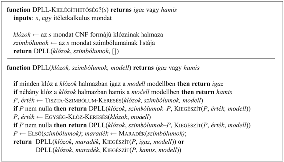
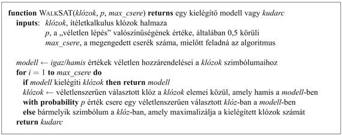
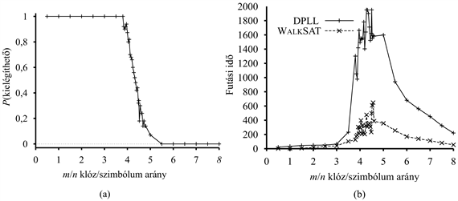

<?xml version="1.0" encoding="UTF-8" standalone="no"?>
<!DOCTYPE html PUBLIC "-//W3C//DTD XHTML 1.1//EN" "http://www.w3.org/TR/xhtml11/DTD/xhtml11.dtd">
<html xmlns="http://www.w3.org/1999/xhtml"><head><meta name="generator" content="DocBook XSL Stylesheets V1.76.1"/></head><body>

<h1 class="title"><a id="id586840"/>Hatékony ítéletkalkulus következtetés</h1>

Ebben a szakaszban az ítéletkalkulus következtetés két hatékony családját írjuk le, amelyek a modellellenőrzésen alapulnak: az egyik megközelítés a visszalépéses keresésen alapul, a másik a hegymászó keresésen. Ezek az algoritmusok az ítéletkalkulus „technológiájának” részei. Ez a szakasz átlapozható a fejezet első olvasásakor. 

Az algoritmusok, amelyeket leírunk, a kielégíthetőséget ellenőrzik. Már megfigyeltük a kapcsolatot egy logikai mondatot kielégítő modell megtalálása és egy kényszerkielégítési probléma megoldásának megtalálása között, így talán nem meglepő, hogy a két algoritmus család igen hasonlít az 5.2. alfejezetben bemutatott visszalépéses algoritmusokra és az 5.3. alfejezet lokális keresési algoritmusaira. Ezek az algoritmusok azonban rendkívül fontosak saját maguk jogán is, mert számos kombinatorikai probléma a számítástechnikában visszavezethető egy ítéletkalkulus mondat kielégíthetőségének ellenőrzésére. A kielégíthetőségi algoritmusok terén elért bármilyen haladás általánosságban is óriási hatással van a képességeinkre a komplexitás kezelésében.

<h2 class="title"><a id="id586850"/>Egy teljes visszalépéses algoritmus</h2>

Az első algoritmus, amit megnézünk Martin Davis és Hilary Putnam (1960) jelentős konferenciacikke alapján, az úgynevezett <strong>Davis–Putnam-algoritmus</strong>. Ez az algoritmus valójában egy változata annak, amelyet Davis, Logemann és Loveland (1962) publikált, így DPLL-nek fogjuk hívni szerzőik neveinek kezdőbetűi alapján. A DPLL bemenetként egy konjunktív normál formájú mondatot vesz – a klózok egy halmazát. Mint a <code class="code">VISSSZALÉPÉSES-KERESÉS</code> vagy az <code class="code">IK-VONZAT</code>?, ez is alapvetően rekurzív, mélységi felsorolását végzi a lehetséges modelleknek. Az algoritmus három továbbfejlesztést tartalmaz az <code class="code">IK-VONZAT</code>? egyszerű sémájához képest:

<ul class="itemizedlist"><li class="listitem">
<em>Korai leállás:</em> Az algoritmus észreveszi, ha egy mondat már biztos igaz vagy hamis, még részben elkészült modell alapján is. Egy klóz igaz, ha <em>bármelyik</em> literál igaz, még akkor is, ha a többi literálnak még nincs igazság értéke. Ennélfogva a mondatot mint egészet igaznak ítélhetjük, még mielőtt a modell teljes volna. Például az (<em>A</em> ∨ <em>B</em>) ∧ (<em>A</em> ∨ <em>C</em>) igaz, ha <em>A</em> igaz, függetlenül <em>B</em> és <em>C</em> értékétől. Hasonlóan, egy mondat hamis, ha <em>bármelyik</em> klóz hamis, ami akkor fordul elő, ha ennek a klóznak minden literálja hamis. Ismételten, ez a modell teljessé válásánál sokkal korábban is előfordulhat. A korai leállás a keresési tér egész részfáinak átvizsgálását kerüli el.
</li><li class="listitem">
<em>Tiszta szimbólum heurisztika:</em> Egy <strong>tiszta szimbólum</strong> (<strong>pure symbol</strong>) egy olyan szimbólum, amely mindig ugyanolyan „előjellel” szerepel minden klózban. Például a következő három mondatban, (<em>A </em>∨ ¬<em>B</em>), (¬<em>B </em>∨ ¬<em>C</em>) és az <em>A</em> szimbólum tiszta, mivel csak a pozitív literálja jelenik meg, a <em>B</em> tiszta, mivel csak a negatív literálja jelenik meg, és <em>C</em> nem tiszta. Könnyű belátni, hogyha egy mondatnak van modellje, akkor létezik tiszta szimbólumokat tartalmazó modellje is, amelyben a tiszta szimbólumok értéke úgy van megválasztva, hogy literáljai <em>igazak</em> legyenek, hiszen így egyetlen klózt sem teszünk hamissá. Vegyük észre, hogy egy szimbólum tisztaság tulajdonságának meghatározásakor az algoritmus figyelmen kívül hagyhatja azokat a klózokat, amelyekről már tudjuk, hogy igazak a modell eddigi konstruálása alapján. Például ha a modellünk tartalmazza a <em>B </em>= <em>hamis</em> hozzárendelést, akkor a (¬<em>B </em>∨ ¬<em>C</em>) klóz már igaz, és <em>C</em> tisztává válik, mert csak a (<em>C</em> ∨ <em>A</em>)-ban jelenik meg.
</li><li class="listitem">
<em>Egységklóz heurisztika:</em> Az <strong>egységklóz</strong>t már definiáltuk korábban, mint egy olyan klózt, amelynek egy literálja van. A DPLL esetében, ez azokat a klózokat is jelenti, hogy egy kivételével minden literál <em>hamis</em> értéket kapott a modellben. Például ha a modell tartalmazza a <em>B</em> = <em>hamis</em> hozzárendelést, akkor a (<em>B</em> ∨ ¬<em>C</em>) egység klózzá válik, mivel ekvivalens a (<em>Hamis</em> ∨ ¬<em>C</em>)-vel, azaz a ¬<em>C</em>-vel. Természetesen ahhoz, hogy ez a klóz igaz legyen, <em>C</em>-nek <em>hamis</em> értéket kell adni. Az egységklóz heurisztika elvégzi ezeket a hozzárendeléseket, mielőtt elágazna a maradékon. Egy fontos konzekvenciája ennek a heurisztikának, hogy bármely, már a tudásbázisban található literálra vonatkozó (cáfolat általi) bizonyítási kísérlet azonnal sikeres lesz (7.16. feladat). Vegyük észre azt is, hogy értéket adva egy egységklózhoz újabb egységklózt hozhatunk létre. Például amikor <em>C</em>-nek <em>hamis</em> értéket adunk, akkor a (<em>C </em>∨ <em>A</em>) egységklózzá válik, ami az igaz <em>A</em>-hoz való hozzárendelését eredményezi. Ezt az „egymást követő” kikényszerített hozzárendelések sorozatát <strong>egységterjesztés</strong>nek (<strong>unit propagation</strong>) nevezik. Hasonlít a folyamat a Horn-klózokkal történő előrefelé láncolásra, és valóban, abban az esetben ha a CNF formájú kifejezés csak Horn-klózokat tartalmaz, akkor a DPLL lényegében lemásolja az előrefelé láncolást (lásd 7.17. feladat).
</li></ul>

<a id="id587066"/>
<strong>7.16. ábra - A DPLL algoritmus ítéletkalkulus mondatok kielégíthetőségének ellenőrzése. A <code class="code">TISZTA-SZIMBÓLUM-KERESÉS</code> és az <code class="code">EGYSÉG-KLÓZ-KERESÉS </code>eljárásokat a szövegben elmagyaráztuk; mindkettő egy szimbólummal vagy nullával tér vissza, és a szimbólumhoz hozzárendelendő igazságértékkel. Mint az <code class="code">IT-VONZAT</code>? eljárás, ez is részleges modelleken dolgozik.</strong>

A DPLL algoritmust mutatja a 7.16. ábra. Az ábrán a lényeges elemeket tartalmazó vázat adtuk meg, ami bemutatja magát a keresési folyamatot. Nem szerepel az adatstruktúra leírása, amelyet fenn kell tartani, hogy a keresési lépéseket hatékonyan lehessen elvégezni, sem azoknak a trükköknek a leírása, amelyeket a teljesítmény fokozása céljából az alapalgoritmushoz hozzá lehet adni: klóztanulás, változó választási heurisztika és a véletlenszerű újraindítások technikája. Ha ezeket is beépítjük az algoritmusba, akkor a DPLL az egyik leggyorsabb kielégíthetőségi algoritmus, antikvitása ellenére is. A <code class="code">CHAFF</code> implementáció millió változós hardververifikációs problémák megoldására szolgált.

<h2 class="title"><a id="id587092"/>Lokális keresés algoritmus</h2>

<a id="ID_278_oldal"/>
Számos lokális keresés algoritmust láttunk már a könyvben, beleértve a <code class="code">HEGYMÁSZÓ</code> algoritmust <a class="xref" href="ch04s03.md#ID_155_oldal">„Hegymászó keresés”</a> részben és a <code class="code">SZIMULÁLT-LEHŰTÉS</code>-t <a class="xref" href="ch04s03.md#ID_158_oldal">„Szimulált lehűtés”</a> részben. Ezek az algoritmusok alkalmazhatók közvetlenül is kielégíthetőségi problémákra, feltéve, hogy megfelelő kiértékelő függvényt választunk. Mivel a cél egy olyan hozzárendelés megtalálása, amely kielégít minden klózt, megfelel számunkra egy olyan kiértékelő függvény választása, amely a kielégítetlen klózok számát számolja. Valóban, ez pontosan az a mérték, amit a <code class="code">MIN-KONFLIKTUS</code> algoritmus használt kényszerkielégítési problémáknál <a class="xref" href="ch05s03.md#ID_197_oldal">„Lokális keresés kényszerkielégítési problémáknál”</a> részben. Minden ilyen algoritmus a teljes hozzárendelések terében végez lépéseket, cserélgetve egy-egy lépésben egy-egy szimbólum igazságértékét. A tér rendszerint számos lokális minimumot tartalmaz, amelyekből a meneküléshez a véletlenszerű lépések különféle formái szükségesek. Az utóbbi években nagyon sokat foglalkoztak azzal a kérdéssel, hogy hogyan lehet egy jó egyensúlyt találni a mohóság és a véletlenszerűség között.

Az egyik legegyszerűbb és leghatékonyabb algoritmus, amely ezen munkák között felbukkant a <code class="code">WALKSAT</code> (7.17. ábra). Minden iterációban az algoritmus vesz egy kielégítetlen klózt és egy szimbólumot a klózból, amelynek értékét ellenkezőre cseréli. Az értéket cserélő szimbólum kiválasztása a következő két módszer közül – véletlenszerűen választva – az egyikkel történik: (1) a „min-konfliktus” lépés, amely minimalizálja a kielégítetlen klózokat az új állapotban, és a (2) „véletlen-bejárás”, amely véletlenszerűen választja a szimbólumot.

<a id="id587131"/>
<strong>7.17. ábra - A <code class="code">WALKSAT</code> algoritmus, kielégíthetőségének ellenőrzése véletlenszerűen cserélgetetett változó értékekkel. Számos változata ismert az algoritmusnak.</strong>

Működik-e egyáltalán a <code class="code">WALKSAT</code>? Az egyértelmű, hogy ha visszaad egy modellt, akkor a bemeneti mondat valóban kielégíthető. Mi van akkor, ha <em>kudarccal</em> tér vissza? Sajnos ebben az esetben nem tudjuk megmondani, hogy a mondat kielégíthetetlen vagy az algoritmus számára több időt kellene hagyni a keresésre. Megpróbálhatjuk beállítani a <em>max_csere</em> értékét végtelenre. Erre az esetre könnyű megmutatni, hogy a <code class="code">WALKSAT</code> végül vissza fog adni egy modellt (ha létezik ilyen), feltéve, hogy a <em>p</em> valószínűségre igaz a <em>p</em> &gt; 0. Ez azért van így, mert mindig létezik egy olyan cserélési sorozat, amely elvezet egy kielégítő hozzárendeléshez, és előbb-utóbb a véletlen bejárás lépések elő fogják állítani ezt a sorozatot. Persze ha a <em>max_csere</em> végtelen, és a mondat kielégíthetetlen, akkor az algoritmus soha nem fog leállni!

Ezek az eredmények azt sugallják, hogy a lokális keresési algoritmusok, mint a <code class="code">WALKSAT</code>, akkor a leginkább hasznosak, ha feltételezhetjük, hogy létezik megoldás – mint például a 3. és 5. fejezetben tárgyalt problémáknak általában van megoldásuk. Viszont a lokális keresés nem képes detektálni a <em>kielégíthetetlenséget,</em> amely szükséges a maga után vonzás kérdésének az eldöntéséhez. Például egy lokális keresést alkalmazó ágens nem tudja <em>megbízhatóan </em>bizonyítani, hogy egy négyzet biztonságos a wumpus világban. Ehelyett azt tudja mondani, hogy „Egy órája gondolkodom a kérdésen, és nem tudtam olyan lehetséges világot találni, amiben a négyzet nem biztonságos.” Ha a lokális keresés algoritmus általában igazán gyors egy modell megtalálásában, ha létezik ilyen, akkor az ágenst tekinthetjük igazolhatónak, feltételezve, hogy a kudarc a kielégíthetetlenséget jelzi. Ez természetesen nem azonos egy bizonyítással, és az ágensnek kétszer is meg kell gondolnia, mielőtt erre bízza az életét. 

<h2 class="title"><a id="id587186"/>Nehéz kielégíthetőségi problémák</h2>

Most megnézzük, hogyan is teljesít a DPLL és a <code class="code">WALKSAT</code> a gyakorlatban. Minket elsősorban a <em>nehéz</em> problémák érdekelnek, mert a <em>könnyű</em> problémák megoldhatóak bármely régi algoritmussal is. Az 5. fejezetben láttunk néhány meglepő felfedezést bizonyosfajta problémákkal kapcsolatban. Például az <em>n</em>-királynő probléma – amely igen kemény feladat volt a visszalépéses keresés számára – triviálisan egyszerűnek bizonyult az olyan lokális keresési módszerek számára, mint például a min-konfliktus. Ennek az az oka, hogy a megoldások nagyon sűrűn oszlanak el a hozzárendelések terében, és bármely kezdeti hozzárendeléshez garantáltan találhatunk egy megoldást a közelben. Tehát az <em>n</em>-királynő könnyű probléma, mert <strong>alulhatározott</strong> (<strong>underconstrained</strong>). 

Amikor konjunktív normál formában levő kielégíthetőségi problémákat tekintünk, alulhatározott probléma az, amelyben viszonylag kevés a változókat korlátozó klóz szerepel. Például itt van egy véletlenszerűen létrehozott[<a id="id587223" href="#ftn.id587223" class="footnote">71</a>] 3-CNF mondat öt szimbólummal és öt klózzal:

<code class="code">(¬<em>D</em> ∨ ¬<em>B</em> ∨ <em>C</em>) ∧ (<em>B</em> ∨ ¬<em>A</em> ∨ ¬<em>C</em>) ∧ (¬<em>C</em> ∨ ¬<em>B</em> ∨ <em>E</em>) ∧ (<em>E</em> ∨ ¬<em>D</em> ∨ <em>B</em>) ∧ (<em>B</em> ∨ <em>E</em> ∨ ¬<em>C</em>)</code>

A 32 lehetséges hozzárendelésből 16 modellje a mondatnak, így átlagosan csak két véletlenszerű találgatásra van szükség egy modell megtalálásához. 

Akkor melyek a nehéz problémák? Feltételezhető, hogyha <em>növeljük</em> a klózok számát, miközben a szimbólumok számát rögzítve tartjuk, a problémát erősebben határozottá tesszük, és a megoldás megtalálása egyre nehezebbé válik. Legyen <em>m</em> a klózok száma és <em>n</em> a szimbólumok száma. A 7.18. (a) ábra mutatja annak a valószínűségét, hogy egy véletlenszerűen választott 3-CNF mondat kielégíthető-e a klóz/szimbólum arány (<em>m</em>/<em>n</em>) függvényében rögzített <em>n </em>= 50 mellett. Ahogy vártuk, kis <em>m</em>/<em>n</em> aránynál a valószínűség közel van 1-hez, és nagy <em>m</em>/<em>n</em> aránynál közel van a 0-hoz. A valószínűség viszonylag élesen esik le az <em>m</em>/<em>n</em> =<em> </em>4,3 értéknél. Azok a CNF mondatok, amelyek közel vannak ehhez a <strong>kritikus pont</strong>hoz (<strong>critical point</strong>), „alig kielégíthetőnek” vagy „alig kielégíthetetlennek” jellemezhetők. Ez volna az, ahol a nehéz problémák vannak?

A 7.18. (b) ábra mutatja a DPLL és a <code class="code">WALKSAT</code> futási időit ennek a pontnak a környezetében, csak a kielégíthető problémákat véve figyelembe. Három dolog tiszta: először is, a kritikus pont körüli problémák <em>sokkal</em> nehezebbek, mint a többi probléma. Másodszor, a DPLL igen hatékony még a legnehezebb problémákra is – átlagosan néhány ezer lépést tesz, összehasonlítva az igazságtábla felsorolás 250 ≈ 1015 számú lépésigényével. Harmadszor, a <code class="code">WALKSAT</code> a teljes tartományban sokkal gyorsabb, mint a DPLL.

Természetesen ezek az eredmények csak a véletlenszerűen generált problémákra vonatkoznak. A valós problémáknak nem feltétlenül hasonló a struktúrájuk – a pozitív és negatív állítások aránya, a klózok közti kapcsolatok sűrűsége, és egyéb más vonatkozások – mint a véletlen problémáknak. Mégis, a gyakorlatban a <code class="code">WALKSAT</code> és az ehhez kapcsolódó, hasonló algoritmusok nagyon jók valós problémák megoldásában is – gyakran ugyanolyan jók, mint az adott feladatra készített legjobb speciális célú algoritmus. Több ezer szimbólumot és milliónyi klózt tartalmazó problémákat megoldókkal szokás kezelni, mint amilyen a <code class="code">CHAFF</code>. Ezek a megfigyelések azt sugallják, hogy a min-konfliktus és a véletlen bejárás algoritmusok valamilyen kombinációja <em>általános célú</em> képességet biztosít a legtöbb szituáció elemzéséhez, ahol kombinatorikai következtetés szükséges. 

<a id="id587383"/>
<strong>7.18. ábra - (a) A grafikon a klóz/szimbólum arány függvényében annak valószínűségét mutatja, hogy <em>n</em> = 50 mondat közül véletlenszerűen választott 3-CNF mondat kielégíthető-e. (b) A grafikon a DPLL és a <code class="code">WALKSAT</code> algoritmusok futási időinek középértékét mutatja 100 <em>kielégíthető</em> 3-CNF mondaton <em>n</em> = 50 mellett, a kritikus<em> m</em>/<em>n</em> arány melletti szűk sávban.</strong>

 

[<a id="ftn.id587223" href="#id587223" class="para">71</a>]  Minden klóz három véletlenszerűen kiválasztott szimbólumot tartalmaz, amelyek 50% valószínűséggel negáltak.

</body></html>
