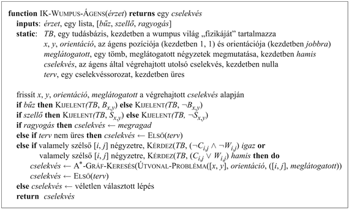
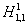
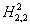
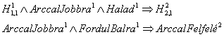
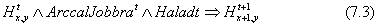
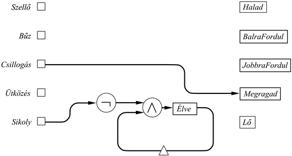
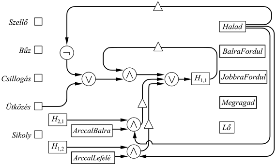
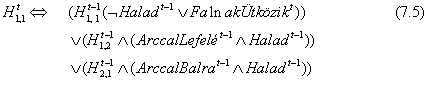
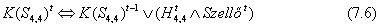

<?xml version="1.0" encoding="UTF-8" standalone="no"?>
<!DOCTYPE html PUBLIC "-//W3C//DTD XHTML 1.1//EN" "http://www.w3.org/TR/xhtml11/DTD/xhtml11.dtd">
<html xmlns="http://www.w3.org/1999/xhtml"><head><meta name="generator" content="DocBook XSL Stylesheets V1.76.1"/></head><body>

<h1 class="title"><a id="id587415"/>Ítéletlogikát alkalmazó ágensek</h1>

Ebben a szakaszban, összeszedünk mindent, amit eddig tanultunk, hogy olyan ágenseket  konstruáljunk, amelyek az ítéletlogika felhasználásával működnek. Kétfajta ágenst fogunk megvizsgálni: olyat, amely következtetési algoritmust és egy tudásbázist használ, mint a 7.1. ábra általános tudásbázisú ágense, és olyat, amely a logikai kifejezések kiértékelését közvetlenül, áramköröket alkalmazva végzi. Mindkétfajta ágenst a wumpus világban fogjuk demonstrálni, és látni fogjuk, hogy mindkettő komoly hátrányoktól szenved.

<h2 class="title"><a id="id587422"/>Csapdák és wumpusok megtalálása logikai következtetés felhasználásával</h2>

Kezdjünk egy ágenssel, amely képes logikusan érvelni a csapdák és wumpusok helyével és a biztonságos négyzetekkel kapcsolatban. A feladat megoldása a tudásbázis felírásával kezdődik, amely reprezentálja a wumpus világ „fizikáját”. Az ágens tudja, hogy az [1, 1] nem tartalmaz se csapdát, se wumpust, azaz ¬<em>C</em>1,1 és ¬<em>W</em>1,1. Az ágens minden [<em>x</em>, <em>y</em>] négyzetre ismer egy mondatot, ami azt jelenti ki, hogy a szellő honnan ered:

<code class="code"><em>S</em><em>x</em>,<em>y</em> ⇔ (<em>C</em><em>x</em>,<em>y</em>+1 ∨ <em>C</em><em>x</em>,<em>y</em>–1 ∨ <em>C</em><em>x</em>+1,<em>y</em><em> </em>∨ <em>C</em><em>x</em>–1,<em>y</em>)	(7.1)</code>

Az ágens minden [<em>x</em>,<em> y</em>] négyzetre ismer egy mondatot, ami azt jelenti ki, hogy a bűz hogyan ered:

<code class="code"><em>B</em><em>x</em>,<em>y</em> ⇔ (<em>W</em><em>x</em>,<em>y</em>+1 ∨ <em>W</em><em>x</em>,<em>y</em>–1 ∨ <em>W</em><em>x</em>+1,<em>y</em> ∨ <em>W</em><em>x</em>–1,<em>y</em>)	(7.2)</code>

Végül tudja, hogy pontosan egy wumpus van. Ezt két részben fejezzük ki. Először ki kell jelentenünk, hogy <em>legalább</em> egy wumpus van:

<code class="code"><em>W</em>1,1 ∨ <em>W</em>1,2 ∨…∨ <em>W</em>4,3 ∨ <em>W</em>4,4</code>

Ezután azt kell mondanunk, hogy <em>legfeljebb</em> egy wumpus van. Az egyik lehetséges módja ennek, hogy minden két mezőre kijelentjük, hogy a két mező egyikének wumpusmentesnek kell lennie. Ha <em>n</em> négyzet van, akkor <em>n</em>(<em>n</em> – 1)/2 mondatot kapunk, olyanokat mint a ¬<em>W</em>1,1 ∨ ¬<em>W</em>1,2. Egy 4 × 4-es világ esetében, így összesen 64 különböző szimbólumot tartalmazó 155 mondattal kezdünk.

Az ágensprogram, amelyet a 7.19. ábra mutat, <code class="code">KIJELENTI</code> a tudásbázisnak az összes szellő és bűz érzetet. (Ezenkívül frissíti néhány hagyományos változójának értékét is, amelyek azt őrzik, hogy az ágens merre van most és merre járt korábban – erre később még visszatérünk). Ezután a program kiválasztja, hogy melyik cellát nézze meg a peremen lévők közül – olyan négyzetek közül, amelyek szomszédosak valamelyik meglátogatottal. Egy peremen lévő [<em>x</em>, <em>y</em>] cella <em>bizonyíthatóan biztonságos</em>, ha a (¬<em>C</em><em>i</em>,<em>j</em><em> </em>∧ ¬<em>W</em><em>i</em>,<em>j</em>) mondat vonzata a tudásbázisnak. A „második legjobb dolog”, ha egy cella <em>lehetséges, hogy biztonságos</em>, amikor az ágens nem tudja bizonyítani, hogy ott egy csapda vagy egy wumpus <em>van</em> – azaz, hogy a (<em>C</em><em>i</em>,<em>j</em><em> </em>∨ <em>W</em><em>i</em>,<em>j</em>) <em>nem</em> vonzat.

A <code class="code">KÉRDEZ</code> eljárásban levő maga után vonzás számítása implementálható a fejezetben korábban bemutatott a módszerek közül bármelyikkel. Az IT-<code class="code">VONZAT</code>? (7.10. ábra) nyilván nem praktikus, mivel fel kellene sorolni a 264 sort. A DPLL (7.16. ábra) néhány milliszekundum alatt végrehajtja a kívánt következtetést, leginkább az egység-propagáció heurisztikának köszönhetően. A <code class="code">WALKSAT</code> szintén használható, a teljesség hiányából származó gyengeségeivel. A wumpus világokban, a modell megtalálásának kudarca, 10 000 cserét feltételezve, praktikusan megfelel a kielégíthetetlenségnek, így nem valószínű, hogy hiba fordulhatna elő a teljesség hiánya miatt. 

<a id="id587733"/>
<strong>7.19. ábra - (Egy wumpusvilág-beli ágens programja, amely ítéletkalkulust használ a csapdák, a wumpusok és a biztonságos négyzetek azonosítására. Az <code class="code">ÚTVONAL-PROBLÉMA</code> szubrutin létrehoz egy keresési problémát, aminek megoldása egy cselekvéssorozat, amely elvezet az [<em>x</em>, <em>y</em>] négyzetből az [<em>i</em>, <em>j</em>]-be, és csak korábban már látogatott négyzeteken vezet keresztül.</strong>

Az <code class="code">IK-WUMPUS-ÁGENS</code> igen jól működik kisméretű wumpus világban. Azonban mégis van valami erősen nem megnyugtató az ágens tudásbázisával kapcsolatban. A <em>TB</em> tartalmazza a fizikai leírást a (7.1) és (7.2) alakú egyenletek formájában <em>minden egyes négyzetre</em>. Minél nagyobb a környezet, annál nagyobb kezdeti tudásbázisra van szükség. Sokkal inkább azt szeretnénk, hogy csak két mondatunk lenne, amelyek kimondják, hogy hogyan is keletkezhet a szellő vagy a bűz <em>bármely</em> kockában. Ez mát túl van az ítéletkalkulus kifejezési képességén. A következő fejezetben látni fogunk egy nagyobb kifejezőerővel rendelkező logikai nyelvet, amelyben egyszerű lesz ilyen mondatot kijelenteni. 

<h2 class="title"><a id="id587779"/>A hely és az irány nyomkövetése</h2>

<a id="ID_283_oldal"/>
A 7.19. ábra ágensprogramja „csal”, mert a helyzetének nyomkövetését a tudásbázison <em>kívül</em> oldja meg, ahelyett hogy logikai következtetést végezne.[<a id="id587792" href="#ftn.id587792" class="footnote">72</a>] Hogy „helyesen” oldjuk meg a nyomkövetést, szükségünk lesz az elhelyezkedéssel kapcsolatos állításokra. Első hallásra hajlamosak lehetünk felvenni egy <em>H</em>1,1<em> </em>szimbólumot, ami azt reprezentálná, hogy az ágens az [1, 1]-ben van. Így a kezdeti tudásbázis ilyen mondatokat tartalmazhatna:

<code class="code"><em>H</em>1,1 ∧ <em>ArccalJobbra </em>∧<em> Halad</em> ⇒<em> H</em>2,1  </code>

Azonnal láthatjuk, hogy ez nem fog működni. Ha az ágens kiindul az [1, 1]-ből arccal jobbra és halad abban az irányban, akkor a tudásbázisból következni fog a <em>H</em>1,1 (az eredeti elhelyezkedés) és a <em>H</em>2,1 (az új elhelyezkedés). Mégsem lehet azonban mindkét állítás igaz! A probléma az, hogy az elhelyezkedés állításoknak két különböző időpontra kell vonatkozniuk. Szükségünk van egy  szimbólumra, ami azt jelentené, hogy az ágens az [1, 1]-ben van az 1 időpontban, és egy  szimbólumra, ami azt, hogy az ágens a [2, 1]-ben van a 2 időpontban és így tovább. Az irány és az cselekvés állításoknak szintén függeniük kell az időtől. Így a helyes mondatok:

és így tovább. Az látható, hogy igen ügyesnek kell lennünk egy teljes és helyes tudásbázis felépítéséhez, hogy mindent nyomon kövessünk a wumpus világban; ennek teljes tárgyalását elhalasztjuk a 10. fejezetig. A lényeg, amire itt rá akartunk mutatni, hogy a kezdeti tudásbázis tartalmazni fog olyan mondatokat, mint az előző két példa, minden <em>t</em> időpontra és minden helyre is. Ami azt jelenti, hogy minden <em>t</em> időpontra és [<em>x</em>,<em>y</em>] helyre a tudásbázis tartalmaz egy következő formájú mondatot:

Még akkor is, ha felső korlátot szabunk a megengedett lépések számának – 100-at talán – mondatok tízezreihez jutunk. Ugyanez a probléma merül fel, ha minden időlépéshez is hozzáadunk mondatokat, „ahogy szükséges”. A klózoknak ez az elburjánzása olvashatatlanná teszi számunkra a tudásbázist, de a gyors ítéletkalkulus megoldók még így is könnyen tudják kezelni a 4 × 4-es wumpus világot (korlátaikat a 100 × 100-as méret körül érik el). Az áramkörre alapuló ágens, amit a következő alfejezet mutat be, részleges megoldást kínál a klózok elburjánzásának problémájára, de a teljes megoldásra várnunk kell, míg nem alkalmazzuk az elsőrendű logikát majd a 8. fejezetben. 

<h2 class="title"><a id="id587902"/>Az áramkörön alapuló ágens</h2>

Az <strong>áramkörön alapuló ágens</strong> (<strong>circuit-based agent</strong>) a reflexív ágens egy állapottal rendelkező speciális fajtája, mint ahogy ezt a 2. fejezetben definiáltuk. Az érzetek egy <strong>sorrendi áramkör</strong> (<strong>sequential circuit</strong>) bemenetei, amely sorrendi áramkör egy <strong>kapu</strong>kból (<strong>gate</strong>s) álló hálózatból, amelyek mindegyike egy logikai kapcsolatot valósít meg, és <strong>regiszter</strong>ekből (<strong>register</strong>s) épül fel, amelyek mindegyike az egyes állítások igazságértékeit tárolja. Az áramkör kimenetei olyan regiszterek, melyek cselekvéseknek felelnek meg – például a <em>Megragad</em> kimenet <em>igaz</em>-ra van állítva, ha az ágens meg akar ragadni valamit. Ha a <em>Csillogás</em> bemenetet közvetlenül összekötjük a <em>Megragad</em> kimenettel, akkor az ágens meg fogja ragadni a célt bármikor, ha látja (lásd 7.20. ábra).

<a id="id587964"/>
<strong>7.20. ábra - Egy áramköralapú, wumpusvilág-beli ágens egy része, a bemeneteket és a kimeneteket mutatva, az arany megragadását megvalósító áramkör, és az áramkör, amely meghatározza, hogy a wumpus él-e. A regisztereket négyzet jelöli, és a késleltetőket kis háromszögek mutatják.</strong>

Az áramköröket az <strong>adatfolyam</strong>ok (<strong>dataflow</strong>) mintájára értékeljük ki, minden időlépésben beállítjuk a bemenetet, és a jeleket végigterjesztjük a hálózaton. Ha egy kapunak minden bemenete rendelkezésre áll, létrehoz egy kimenetet. Ez a folyamat közeli kapcsolatban van az előrefelé láncolással és az ÉS-VAGY gráfokkal, mint amilyen a 7.15. (b) ábrán látható. 

Az előző szakaszban azt állítottuk, hogy az áramkörön alapuló ágens az időt kielégítőbb módon kezeli, mint az ítéletkalkulus következtetés alapú ágens. Ez azért lehet így, mert egy regiszterben tárolt változó értéke adja meg a megfelelő ítéletkalkulus szimbólumnak az igazságértékét a <em>pillanatnyi t időpontban,</em> ahelyett hogy másolatok léteznének minden egyes időlépéshez. Például lehetne egy <em>Élve</em> regiszterünk, amelynek <em>igaz</em> értéket kell tartalmaznia, ha a wumpus életben van, és <em>hamis-</em>at, ha halott. Ez a regiszter az <em>Élvet </em>ítéletkalkulus szimbólumnak felel meg, így minden egyes időpillanatban egy különböző ítéletállításra vonatkozik.<em> </em>Az ágens belső állapotai – például a memóriája – megőrizhetőek a regiszterek kimenetének egy <strong>késleltető sor</strong>on (<strong>delay line</strong>) keresztül történő viszszacsatolásával. Ez a regiszter az <em>előző</em> lépéshez tartozó értéket szolgáltatja. A 7.20. ábra egy példát mutat. Az <em>Élve</em> értékét a <em>Sikoly</em> negáltjának és az <em>Élve </em>késleltetett értékének a konjunkciója adja. Állításokban megfogalmazva ez a hálózat az <em>Élve</em> fogalomra megvalósítja a következő ekvivalenciát: 

<code class="code"><em>Élvet </em>⇔ ¬<em>Sikolyt </em>∧ <em>Élvet</em>–1	(7.4)</code>

amely mondat azt mondja ki, hogy a wumpus a <em>t</em> időpontban akkor és csakis akkor él, ha nem észleltünk sikolyt a <em>t</em> időpillanatban (egy <em>t – </em>1 időpontbeli sikoly alapján) <em>és</em> élt a <em>t – </em>1<em> </em>időpillanatban. Feltételezzük, hogy az áramkörben az <em>Élve</em> regiszter <em>igazra</em> van inicializálva. Így az <em>Élve</em> igaz marad mindaddig, amíg nincs egy sikoly, amikor is hamissá válik és a későbbiekben hamis marad. Ez pont az, amit mi akarunk.

<a id="id588100"/>
<strong>7.21. ábra - Egy áramkör, amely meghatározza, hogy az ágens az [1, 1]-ben van-e. Minden pozíció és orientáció regiszterhez egy hasonló áramkör csatlakozik.</strong>

Az ágens helyzete nagyon hasonló módon kezelhető, mint a wumpus halála. Szükségünk van egy <em>H</em>x,y<em> </em>regiszterre minden <em>x</em>-hez és <em>y</em>-hoz, és ennek az értéke <em>igaz</em> kell, hogy legyen, amikor az ágens az [<em>x</em>,<em> y</em>]-ban van. Az áramkör, amelyik beállítja <em>H</em><em>x</em>,<em>y</em><em> </em>értékét azonban sokkal bonyolultabb, mint az <em>Élve</em> áramköre. Például az ágens az [1, 1]-ben van a <em>t</em> időpontban, ha (a) az ott volt a <em>t – </em>1-ben és vagy nem haladt semerre, vagy megpróbálta, de falnak ütközött; vagy (b) az [1, 2]-ben volt arccal lefelé és haladt előrefelé; vagy (c) a [2, 1]-ben volt arccal balra és haladt előre:

A <em>H</em>1,1<em> </em>hálózata a 7.21. ábrán látható. Minden elhelyezkedés regiszterhez egy hasonló áramkör tartozik. A 7.13. (b) feladatban azt kérjük, hogy készítsen áramkört az irányra vonatkozó állításokhoz. 

A 7.20. és 7.21. ábrákon levő áramkörök fenntartják az <em>Élve</em> és a <em>H</em><em>x</em>,<em>y</em> igazságértékét minden időpillanatban. Egy ilyen áramkör által reprezentált állítások szokatlanok azonban abban az értelemben, hogy <em>a helyes igazságértékeiket minden pillanatban meg tudjuk határozni</em>. Tekintsük az előző helyett az <em>S</em>4,4<em> </em>állítást: a [4, 4] négyzet szellős. Habár az állításnak az igazságértéke rögzítve van valamilyen értéken, az ágens nem ismerheti az igazságértéket mindaddig, amíg meg nem látogatja a [4, 4] mezőt (vagy ki nem következteti, hogy van egy szomszédos csapda). Az ítéletlogikát és az elsőrendű logikát igaz, hamis és ismeretlen értékű állítások automatikus reprezentálására tervezték, de az áramköröket nem: az <em>S</em>4,4<em> </em>regiszternek tartalmaznia kell <em>valamely</em> értéket, vagy <em>igaz</em> vagy <em>hamis</em> értéket, még mielőtt az igazságot feltárják. A regiszterbeli érték lehet helytelen, és ez helytelen irányba is vezetheti az ágenst. Más szavakkal, szükségünk volna háromféle lehetséges állapot reprezentálására (<em>S</em>4,4<em> </em>ismerten igaz, ismerten hamis vagy nem ismert), és csak egy bitünk van arra, hogy megoldjuk ezt. 

A megoldás erre a problémára az, hogy használjunk két bitet egy helyett. Az <em>S</em>4,4-et reprezentálja két regiszter, amelyeket <em>K</em>(<em>S</em>4,4)-nek és <em>K</em>(¬<em>S</em>4,4)-nek nevezünk, ahol <em>K</em> jelöli azt, hogy „ismert”. (Emlékezzünk, hogy ezek még mindig csak összetett nevekkel rendelkező szimbólumok, még akkor is, ha strukturált kifejezésnek tűnnek!) Ha mind <em>K</em>(<em>S</em>4,4) és <em>K</em>(¬<em>S</em>4,4) hamis, akkor ez azt jelenti, hogy az <em>S</em>4,4<em> </em>igazságértéke nem ismert. (Ha mindkettő igaz, akkor hiba van a tudásbázisban!) Ebben a reprezentációban bármikor is használnánk az <em>S</em>4,4-et a hálózat valamely részében, a <em>K</em>(<em>S</em>4,4)-et használjuk helyette; és bármikor használnánk az ¬<em>S</em>4,4-et, akkor a <em>K</em>(¬<em>S</em>4,4)-et használjuk. Általánosságban, minden potenciális határozatlan állítást két <strong>tudásállítás</strong>sal (<strong>knowledge prop</strong><strong>osition</strong>s) reprezentálunk, kijelentve, hogy a vonatkozó állítás ismerten igaz vagy ismerten hamis.

Hamarosan látni fogunk egy példát arra, hogyan kell alkalmaznunk a tudásállításokat. Először is, szükségünk van annak kidolgozására, hogy hogyan határozzuk meg maguknak a tudásállításoknak az igazságértékét. Vegyük észre, hogy miközben az <em>S</em>4,4-nek rögzített igazságértéke volt, a <em>K</em>(<em>S</em>4,4) és <em>K</em>(¬<em>S</em>4,4)<em> változik,</em> miközben az ágens egyre többet tud meg a világról. Például a <em>K</em>(<em>S</em>4,4)<em> </em>hamis értékről indul, és igazzá válik, amint az <em>S</em>4,4-ről meghatározható, hogy igaz – azaz, amikor az ágens a [4, 4]-be lép, és detektálja a szellőt. Majd igaz marad ezután. Így megállapítható, hogy

Hasonló egyenlet írható fel <em>K</em>(¬<em>S</em>4,4)<em>t-</em>re is. 

Most, hogy az ágensnek van már ismerete a szellős négyzetekről, foglalkozhat a csapdákkal is. Egy csapda hiánya az adott négyzetben akkor és csakis akkor határozható meg, ha valamelyik szomszédos négyzetéről ismert, hogy nem szellős. Például ha létezik

<code class="code"><em>K</em>(¬<em>C</em>4,4)<em>t </em>⇔ <em>K</em>(¬<em>S</em>3,4)<em>t </em>∨<em> K</em>(¬<em>S</em>4,3)t	(7.7)</code>

Egy csapda adott négyzetben való <em>jelenlétének</em> a meghatározása sokkal nehezebb – szellőnek kell lennie egy szomszédos négyzetben, de olyan szellőnek, amely nem egy másik csapda miatt keletkezett:

<code class="code"><em>K</em>(<em>C</em>4,4)t ⇔    (<em>K</em>(<em>S</em>3,4)<em>t </em>∧ <em>K</em>(¬<em>C</em>2,4)t ∧ <em>K</em>(¬<em>C</em>3,3)t)	(7.8)</code>

<code class="code">           ∨    (<em>K</em>(<em>S</em>4,3)<em>t </em>∧ <em>K</em>(¬<em>C</em>4,2)t ∧ <em>K</em>(¬<em>C</em>3,3)t)</code>

<h3 class="title">Fontos</h3>
Miközben egy kicsit zavaros a csapdák jelenlétének és hiányának bizonyítása az áramkörök használata esetében, az áramkör <em>konstans számú kaput használ minden egyes négyzethez</em>. Ez a tulajdonság alapvetően fontos ahhoz, hogy olyan áramkörön alapuló ágenst építsünk, amelynek bonyolultsága kezelhető módon nő a probléma méretével. Ez valójában magának a wumpus világnak a jellemzője; azt mondjuk, hogy egy környezet <strong>lokalitás</strong> (<strong>locality</strong>) tulajdonságot mutat fel, ha igaz, hogy bármelyik vizsgálandó állítás igazságának meghatározásához csak egy konstans számú másik állítás megvizsgálása szükséges. A lokalitás tulajdonság nagyon érzékeny a környezet pontos „fizikájára”. Például az aknakereső tárgyterület (7.11. feladat) nemlokális, mert az akna egy adott négyzetbeli létezésének eldöntése igényelheti, hogy akármilyen távol levő négyzetet is megnézzünk. Nemlokális tárgyterületekre az áramkörre alapuló ágens alkalmazás nem mindig praktikus. 

Van egy másik probléma is, amely mellett eddig óvatosan elmentünk: a <strong>hurokmentesség</strong> (<strong>acyclicity</strong>) kérdése. Az áramkört hurokmentesnek tekintjük, ha minden olyan ág, amely egy regiszter kimenetét visszacsatolja a bemenetére, tartalmaz legalább egy közbülső késleltető elemet. Megköveteljük, hogy minden áramkör hurokmentes legyen, mivel a hurkokat tartalmazó áramkörök, mint fizikai eszközök, nem működnek! Az ilyen áramkör instabil oszcillációba kerülhet határozatlan értékeket eredményezve. Példaként a hurkot tartalmazó áramkörökre, tekintsük a (7.6) egyenletnek a következő kibővítését:

<code class="code"><em>K</em>(<em>S</em>4,4)<em>t </em>⇔ <em>K</em>(<em>S</em>4,4)<em>t</em>–1 ∨ (<em>H</em>4,4<em>t </em>∧ <em>Szellőt</em>) ∨ <em>K</em>(<em>C</em>3,4)<em>t </em>∨<em> K</em>(<em>C</em>4,3)t	(7.9)</code>

A hozzáadott diszjunktok, a <em>K</em>(<em>C</em>3,4)t és a<em> K</em>(<em>C</em>4,3)t lehetővé teszik az ágens számára, hogy a szellő jelenlétét meghatározza a szomszédos négyzetekben levő csapdák jelenlétéből, ami teljesen ésszerűnek tűnik. Így viszont sajnos a szellő tulajdonság függ a szomszédos csapdáktól, és a csapdák függenek a szomszédos négyzetek szellő tulajdonságától, ahogy azt a (7.8) egyenlet leírja. Ezáltal a teljes áramkör tartalmazna hurkot.

A nehézség nem az, hogy a (7.9) egyenlet <em>nem helyes</em>. A probléma inkább az, hogy az egyenletek által reprezentált függőségek összekapcsolása nem oldható fel az igazságértékek propagálásának egyszerű mechanizmusával a vizsgált logikai áramkörökben. A (7.6) egyenletet alkalmazó hurokmentes verzió, amely a szellősséget a közvetlen megfigyelésekből határozza meg, <em>nem teljes</em> abban az értelemben, hogy bizonyos pontokon az áramköralapú ágens kevesebbet tud, mint a teljes következtetési eljárást alkalmazó következtetésalapú ágens. Például ha van szellő az [1, 1]-ben, a következtetésalapú ágens képes arra a megállapításra jutni, hogy van egy szellő a [2, 2]-ben, míg a (7.6) egyenletet használó, hurokmentes áramkörre alapuló ágens erre nem képes. Lehetséges építeni egy teljes áramkört – végül is, szekvenciális áramkörök képesek emulálni bármilyen digitális számítógépet –, de ez jelentősen bonyolultabb volna. 

<h2 class="title"><a id="id590741"/>Összehasonlítás</h2>

A következtetésalapú és az áramkörön alapuló ágensek a deklaratív és procedurális megközelítés szélsőséges esetei az ágens tervezésében. Számos szempont szerint összehasonlíthatjuk őket:

<ul class="itemizedlist"><li class="listitem">
<em>Tömörség.</em> Az áramkörön alapuló ágensnek, ellentétben a következtetésalapú ágenssel, nincs szüksége a „tudásának” önálló másolataira minden időlépésben. Ehelyett, mindig csak a pillanatnyi és a megelőző időlépésre hivatkozik. A „fizika” leírásához mindkét ágensnek szüksége van minden egyes négyzetre vonatkozó másolatokra (mondatok vagy áramkörök formájában), és így nem könnyű nagyobb környezeteket leírni. Azokban a környezetekben, ahol számos objektum összetett kapcsolatait kell leírni, a kijelentések száma eláraszt bármilyen ítéletkalkulus ágenst. Ezek a környezetek már igénylik az elsőrendű logika kifejezőerejét (lásd 8. fejezet). Mindkét típusú ítéletkalkulus ágens rosszul alkalmazható egy biztonságos négyzettel szomszédos helyre vezető útvonal megtalálásának kifejezésére vagy megoldására. (Emiatt az <code class="code">IK-WUMPUS-ÁGENS</code> keresési algoritmusokat alkalmaz.)
</li><li class="listitem">
<em>Számítási hatékonyság. A legrosszabb esetben a következtetés időigénye exponenciálisan függ a szimbólumok számától,</em> míg az áramkör futtatása az áramkör méretétől lineárisan függő időt igényel (vagy a <em>mélységtől</em> lineárisan függő időt, ha fizikai eszközként megvalósítjuk). Láthattuk azonban, hogy a<em> gyakorlatban</em> a DPLL igen gyorsan elvégezte a szükséges következtetéseket.[<a id="id590777" href="#ftn.id590777" class="footnote">73</a>]
</li><li class="listitem">
<em>Teljesség.</em> Azt sugalltuk korábban, hogy az áramköralapú ágens lehet, hogy nem teljes a ciklusmentességgel kapcsolatos korlátozás miatt. A teljesség hiányának okai azonban még alapvetőbbek. Először is, emlékezzünk, hogy az áramkör a méretével lineárisan arányos időben oldja meg a feladatot. Ez azt jelenti, hogy bizonyos környezetek esetében egy teljes áramkörnek (egy olyannak, amely minden meghatározható állításhoz kiszámítja az igazságértéket) exponenciálisan nagyobbnak kell lennie, mint a következtetésalapú ágens tudásbázisának. Egyébként lenne módszerünk arra, hogy hogyan oldjuk meg az ítéletkalkulus vonzat problémáját kisebb mint exponenciális idő alatt, ami nagyon valószínűtlen. A második érv az ágens belső állapotainak a jellege. A következtetésalapú ágens emlékezik minden érzetre, és implicit vagy explicit módon ismer minden mondatot, ami az érzetekből és a kezdeti adatbázisból következik. Például ha adott <em>S</em>1,1 és ismeri a <em>C</em>1,2 ∨ <em>C</em>2,1<em> </em>állítást, abból <em>S</em>2,2<em> </em>következik. Ezzel szemben az áramköralapú ágens elfelejt minden korábbi érzetet és csak a regiszterekben tárolt egyedi állításokra emlékszik. Ekképpen az első érzet után a <em>C</em>1,2<em> </em>vagy a <em>C</em>2,1<em> önmagában</em> ismeretlen marad, és így semmilyen következtetés nem vonható le <em>S</em>2,2-re vonatkozóan. 
</li><li class="listitem">
<em>A létrehozás egyszerűsége.</em> Ez egy nagyon fontos kérdés, amelyet nehéz pontosan megítélni. A könyv szerzője számára a „fizika” leírása bizonyára sokkal egyszerűbb deklaratív úton, miközben kisméretű, hurokmentes, majdnem teljes áramkörök tervezése a csapdák megtalálására igen nehéznek bizonyult. 
</li></ul>

Összefoglalva, úgy tűnik, hogy létezik kompromisszum a számítási hatékonyság, a tömörség, a teljesség és a könnyű létrehozás között. Ha az érzetek és a cselekvések közötti kapcsolat egyszerű – mint a <em>Ragyogás</em> vagy a <em>Megragad</em> közötti kapcsolat esetében – az áramkör optimálisnak tűnik. Ennél bonyolultabb kapcsolatok esetében a deklaratív megközelítés jobb lehet. Egy olyan területen, mint a sakk például, a deklaratív szabályok tömörek és könnyen kódolhatók (legalábbis az elsőrendű logikában), de a tábla állapotaiból a lépéseket közvetlenül számító hálózat elképzelhetetlenül hatalmas lenne. 

Eltérő dolgokat látunk ezekkel a megközelítésekkel kapcsolatban az állatok világában. Az egyszerű idegrendszerrel rendelkező kisebb állatok valószínűleg hálózatalapúak, míg a magasabb rendű állatok úgy tűnik, hogy explicit reprezentációkon következtetéseket végeznek. Ez lényegesen bonyolultabb ágensfunkciók számítását teszi lehetővé számukra. Az emberek szintén rendelkeznek áramkörökkel, amelyek a reflexeket valósítják meg, és talán képesek <strong>lefordít</strong>ani (<strong>compile</strong>) deklaratív ismereteket áramkörökké, amikor bizonyos következtetések rutinná válnak. Ily módon egy <strong>hibrid ágens</strong> (<strong>hybrid agent</strong>) tervezése (lásd 2. fejezet) lehet a legjobb mindkét világ számára.

 

[<a id="ftn.id587792" href="#id587792" class="para">72</a>]  A figyelmes olvasó észreveszi, hogy ez megengedte számunkra azt, hogy ügyeskedjünk a nyers érzet, mint a Szellő, és a helyspecifikus állítás, mint az <em>S</em>1,1, közötti kapcsolattal.

[<a id="ftn.id590777" href="#id590777" class="para">73</a>]  Valójában minden olyan következtetés, amely megvalósítható egy áramkörrel, megoldható lineáris időben a DPLL-lel. Ez azért van így, mert egy áramkör kiértékelése hasonlít az előrefelé láncoláshoz, amely emulálható DPLL-lel az egység propagáció szabály alkalmazásával.

</body></html>
