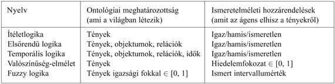

<?xml version="1.0" encoding="UTF-8" standalone="no"?>

<html xmlns="http://www.w3.org/1999/xhtml"><head><meta name="generator" content="DocBook XSL Stylesheets V1.76.1"/></head><body>

<h1 class="title"><a id="id592156"/>8. fejezet - Elsőrendű logika</h1>

<em>Ebben a fejezeteben a világ objektumait és ezek kapcsolatait vizsgáljuk meg, és megpróbálunk érvelni ezek felhasználásával.</em>

A 7. fejezetben megmutattuk, hogy egy tudásbázisú ágens hogyan képes reprezentálni az őt körülvevő világot, és hogyan vezeti le a végrehajtandó cselekvéseket. Reprezentációs nyelvként az ítéletkalkulust alkalmaztuk, mert ez elégséges volt a logika és a tudásbázisú ágensek alapvető tulajdonságainak leírásához. Sajnos az ítéletkalkulus nyelvezete túlságosan korlátos ahhoz, hogy összetett környezetekről szerzett tudást megfelelő módon reprezentáljon. Ebben a fejezetben az <strong>elsőrendű logiká</strong>t[<a id="id592171" href="#ftn.id592171" class="footnote">74</a>] (<strong>first-order logic</strong>) vizsgáljuk, amelynek kifejezőereje elégséges ahhoz, hogy a józan ésszel felfogható tudásunk nagy részét reprezentálja. Ezenkívül az elsőrendű logika sok más reprezentációs nyelvet magában foglal, vagy alapját képezi, és hosszú évtizedek óta vizsgálatok tárgya. A 8.1. alfejezetben a reprezentációs nyelvek általános bemutatásával kezdünk; a 8.2. alfejezetben az elsőrendű logika szintaxisát és szemantikáját tárgyaljuk; a 8.3. és 8.4. alfejezet leírja az elsőrendű logika használatát egyszerű reprezentációk esetén.

<h1 class="title"><a id="id592192"/>Még egyszer a reprezentációról</h1>

Ebben az alfejezetben a reprezentációs nyelvek természetét vizsgáljuk. Megállapításaink be fogják mutatni az elsőrendű logika fejlesztésének szükségességét, ami egy lényegesen nagyobb kifejezőerővel rendelkező nyelv, mint a 7. fejezetben bemutatott ítéletkalkulus. Megnézzük majd, hogy az ítéletkalkulus és másfajta nyelvek mire képesek, és mire nem. A kérdést itt csak felületesen tárgyaljuk, néhány bekezdésbe sűrítve évszázadok gondolatait, kísérletezéseit és kudarcait.

A programnyelvek – mint például a C++, a Java vagy a Lisp – a használatban lévő formális nyelvek messze legnagyobb csoportját alkotják. A programok önmagukban, szó szerinti értelemben, csak számítási folyamatokat reprezentálnak. A programokon belüli adatstruktúrák tényeket reprezentálhatnak; például egy program használhatja a 4 × 4-es négyzetrács-elrendezést a wumpus világ elemeinek reprezentálásához. Így tehát az a programnyelvi állítás, hogy <em>Világ</em>[2, 2] ← <em>Csapda </em>viszonylag természetes módja annak a kijelentésnek, hogy van egy csapda a [2,  2] négyzetben. (Az ilyesfajta reprezentációkat <em>ad hoc</em> jellegűnek vélhetjük; az adatbázisrendszereket pontosan azért fejlesztették ki, hogy általánosabb, tárgyterület-független módját biztosítsák a tények tárolásának és visszakeresésének.) A programnyelvek hiányossága, hogy nem rendelkeznek általános mechanizmussal arra, hogy tényeket más tényekből levezessenek; az adatstruktúra minden frissítése egy tárgyterület-specifikus eljárás segítségével történik, amelynek részleteit a programozó vezeti le a tárgyterületről meglévő ismereti alapján. Ez a <strong>procedurális</strong> (<strong>procedural</strong>) megközelítés szembeállítható az ítéletkalkulus <strong>deklaratív</strong> (<strong>declarative</strong>) természetével, amelyben a tudás és az interferencia különálló fogalmak, a következtetés pedig teljes mértékben tárgyterületfüggetlen.

A programok adatstruktúráinak (és így az adatbázisoknak is) a másik hátránya annak a képességnek a hiánya, hogy egyszerűen lehessen kijelenteni például azt, hogy „Van egy lyuk a [2, 2]-ben vagy a [3, 1]-ben”, vagy azt, hogy „Ha a wumpus az [1, 1]-ben van, akkor nincs a [2, 2]-ben”. A programok egyetlen értéket tudnak tárolni minden változóhoz, néhány rendszer lehetővé teszi azt is, hogy az érték „ismeretlen” legyen, de hiányzik belőlük a részinformációk kezeléséhez szükséges kifejezőerő.

Az ítéletkalkulus egy deklaratív nyelv, mivel szemantikája mondatok és a lehetséges világok közötti igazságrelációkon alapul. Elégséges a kifejezőereje ahhoz is, hogy részinformációkat kezeljen, diszjunkciók vagy negációk használatával. Az ítéletkalkulusnak ezeken kívül egy harmadik tulajdonsága is van, ami kívánatos a reprezentációs nyelvek esetében, nevezetesen a <strong>kompozíciós képesség</strong> (<strong>compositionality</strong>). Egy kompozíciós nyelvnél a mondat jelentése a mondatrészek jelentésének a függvénye. Például, a „<em>B</em>1,4 ∧ <em>B</em>1,2” kapcsolatban van a „<em>B</em>1,4” és a „<em>B</em>1,2”<em> </em>jelentésével. Nagyon furcsa lenne, ha a „<em>B</em>1,4”<em> </em>azt jelentené, hogy az [1, 4]-es négyzet büdös, és a „<em>B</em>1,2” azt jelentené, hogy az [1, 2]-es négyzet büdös, de a „<em>B</em>1,4 ∧ <em>B</em>1,2” már azt jelentené, hogy Franciaország és Lengyelország döntetlent játszott a múlt heti jégkorong-selejtező mérkőzésen. Egyértelmű tehát, hogy a kompozíciós képesség hiánya nagyban megnehezíti a következtető rendszerek működését.

Mint azt a 7. fejezetben láttuk, az ítéletkalkulusnak nincs elégséges kifejezőereje egy sok objektumos környezet <em>tömör </em>leírásához. Például kénytelenek voltunk minden egyes négyzetnél önálló szabályt írni a csapdákra és a szellőkre:

<code class="code"><em>S</em>1,1 ⇔ (<em>C</em>1,2 ∨ <em>C</em>2,1)</code>

Magyarul, ezzel szemben, eléggé egyszerűnek tűnik egyszer s mindenkorra kijelenteni, hogy „A lyukas négyzetek mellett lévők szellősek.” A természetes nyelvek szintaxisa és szemantikája lehetővé teszik a környezet tömör és összefogott leírását.

Első látásra úgy tűnik, hogy a természetes nyelvek (mint az angol vagy a magyar) valóban nagyon kifejezők. Képesek voltunk csaknem a teljes könyvet természetes nyelven megírni, és csak alkalmanként kellett áttérnünk más nyelvekre (beleértve a logikát, a matematikát és a diagramok nyelvét). Nagy múltú hagyomány a nyelvészetben és a nyelvek filozófiájában, hogy a természetes nyelvet elsősorban deklaratív tudásreprezentációs nyelvnek tekintjük, és megpróbáljuk rögzíteni ennek formális szemantikáját. Ha egy ilyen kutatás sikeres lenne, nagy előrelépést jelenthetne a mesterséges intelligencia számára, mert egy természetes nyelvet (vagy annak valamilyen származékát) használhatnánk a tudásreprezentációhoz vagy a következtető rendszerekben.

A modern megközelítés szerint a természetes nyelv kissé más célt szolgál, nevezetesen a nyelv a <strong>kommunikáció</strong> (<strong>communication</strong>), és nem annyira a tiszta reprezentáció eszköze. Amikor egy beszélő rámutat valamire, és azt mondja: „Nézd!” a hallgató megtudja azt, hogy mondjuk, Superman végre megjelent a háztetők felett. Mégsem szeretnénk azt kijelenteni, hogy a „Nézd!” mondatban benne foglaltatik ez a tény is. A mondat jelentése mind magától a mondattól, mind attól a <strong>szövegkörnyezet</strong>től (<strong>context</strong>) függ, amelyben a mondat elhangzott. Nyilvánvalóan nem várható, hogy csupán a „Nézd!” mondatot az adatbázisban tárolva visszaadható ennek a jelentése a szövegkörnyezet ismerete nélkül – amiből az a kérdés következik, hogy hogyan tudjuk magát a szövegkörnyezetet reprezentálni. A természetes nyelvekből is hiányzik a kompozíciós képesség – egy olyan mondat jelentése, mint az „És akkor meglátta”, függhet az előtte álló és az utána következő mondatok által alkotott szövegkörnyezettől. Végül pedig a természetes nyelvek egyik gyenge pontja a <strong>többértelműség</strong> (<strong>ambiguity</strong>), ami nehézségeket okozhatna a következtetésben. Amint azt Pinker megállapítja (Pinker, 1995): „Mikor az emberek az <em>égre</em> gondolnak, bizonyára nem zavarja meg őket, hogy vajon az égboltról van-e szó, vagy valamiről, ami lángol – és ha egy szó két gondolatot is megjeleníthet, akkor a gondolatok nem feleltethetők meg szavaknak.”

Azt a megközelítést követjük, hogy építünk az ítéletkalkulus alapjaira felhasználva, hogy ez egy deklaratív, kompozíciós szemantika, ami független a szövegkörnyezettől, és egyértelmű. Majd ezekre az alapokra egy még kifejezőbb logikát építünk azáltal, hogy felhasználunk a természetes nyelveknél alkalmazott reprezentációs megoldásokat, miközben igyekszünk elkerülni ennek a hátrányait. A természetes nyelv szintaxisát vizsgálva a legegyszerűbben azonosítható összetevők a főnevek és a főnévi kifejezések, amelyek <strong>objektum</strong>okra (<strong>object</strong>s) utalnak (négyzetek, lyukak, wumpusok), valamint az igék és az igei kifejezés, amelyek az objektumok között fennálló <strong>reláció</strong>kra (<strong>relation</strong>s) utalnak (szellős, szomszédos, kilő). Ezeknek a relációknak egy része <strong>függvény</strong> (<strong>function</strong>) – azaz olyan relációk, amelyeknek csak egyetlen „értékük” van egy adott „bemenethez”. Könnyen találhatunk példákat objektumokra, relációkra és függvényekre:

<ul class="itemizedlist"><li class="listitem">
Objektumok: emberek, házak, számok, elméletek, Ronald McDonald, színek, baseballmeccs, háborúk, évszázadok…
</li><li class="listitem">
Relációk: lehetnek unáris relációk vagy <strong>tulajdonság</strong>ok (<strong>properties</strong>), úgymint piros, kerek, színlelt, elsőrendű, többemeletes…, vagy általánosabb <em>n-</em>elemű relációk, úgymint testvére, nagyobb, belsejében, része, színe, utána történt, birtokol, kettő között van…
</li><li class="listitem">
Függvények: apja, legjobb barátja, harmadik hivatali ideje, eggyel több mint, kezdete…
</li></ul>

Valójában minden állítás elképzelhető úgy, mint ami objektumokra, relációkra és függvényekre vonatkozik. Íme néhány példa:

<ul class="itemizedlist"><li class="listitem">
„Egy plusz kettő egyenlő hárommal.”
</li></ul>

Objektumok: egy, kettő, három, egy meg kettő; Reláció: egyenlő; Függvény: plusz. („Egy plusz kettő a neve annak az objektumnak, amelyet úgy kapunk, hogy a „plusz” függvényt alkalmazzuk az „egy” és „kettő” objektumokra. A három egy másik neve ugyanennek az objektumnak.)

<ul class="itemizedlist"><li class="listitem">
„A wumpus helyével szomszédos négyzetek büdösek.”
</li></ul>

Objektumok: wumpus, négyzetek; Tulajdonság: büdös; Reláció: szomszédos.

<ul class="itemizedlist"><li class="listitem">
„A gonosz János király uralkodott Angliában 1200-ban.”
</li></ul>

Objektumok: János, Anglia, 1200; Reláció: uralkodott; Tulajdonságok: gonosz, király.

Az <strong>elsőrendű logika</strong> (<strong>first order logic</strong>) nyelvezete, amelynek a szintaxisát és szemantikáját a következő alfejezetben adjuk meg, objektumok és relációk köré épül. Az elsőrendű logika azért olyan fontos a matematika, a filozófia és a mesterséges intelligencia számára, mert ezeket a területeket – amelyek valójában az emberi lét mindennapjait írják le – tekinthetjük úgy, mint amelyek objektumokkal és a köztük lévő relációkkal dolgoznak. Az elsőrendű logika ezenkívül tényeket közölhet az univerzum <em>néhány </em>vagy <em>összes </em>objektumáról. Ez lehetővé teszi, hogy általános szabályokat vagy törvényszerűségeket tudjunk megfogalmazni, mint például azt az állítást, hogy „A wumpus helyével szomszédos négyzetek büdösek.”

Az elsődleges különbség az ítéletlogika és az elsőrendű logika között az egyes nyelvek <strong>ontológiai meghatározottság</strong>ában (<strong>ontological commitment</strong>) rejlik, abban, hogy mit feltételez a nyelv a <em>valóság </em>természetéről.

<code class="code"><em>A gondolat nyelve</em></code>

<code class="code">A filozófusok és a pszichológusok sokat töprengtek azon, hogy az emberek és más élőlények hogyan jelenítik meg a tudást. Egyértelmű, hogy a természetes nyelv fejlődése fontos szerepet játszott abban, hogy az emberekben kifejlődött ez a képesség. Másrészt, számos pszichológiai eredmény azt sugallja, hogy az emberek nem alkalmazzák közvetlenül a nyelvet a belső reprezentációkhoz. Például a két mondat közül melyikkel kezdtük a 8.1. alfejezetet?</code>

<code class="code">„Amelyben a világ objektumait és ezek kapcsolatait vizsgáljuk meg…”</code>

<code class="code">„Ebben az alfejezetben a reprezentációs nyelvek természetét vizsgáljuk…”</code>

<code class="code">Wanner (1974) úgy találta, hogy a kísérlet alanyai véletlenszerűen – körülbelül 50%-os gyakorisággal – jól választottak, de inkább az elolvasott szöveg tartalmára emlékeztek, több mint 90%-os biztonsággal. Ez azt sugallja, hogy az emberek a szavakat úgy dolgozzák fel, hogy egy nem verbális reprezentációra alakítják át, amit <em>emlékezet</em>nek (<em>memory</em>) nevezünk.</code>

<code class="code">   Továbbra is nagyon érdekes kérdés, hogy mi a pontos mechanizmusa annak, ahogyan a nyelv lehetővé teszi és formálja a gondolatok reprezentációját az emberekben. A híres <em>Sapir–Whorf-</em><em>hipotézis</em> szerint az általunk beszélt nyelv nagymértékben befolyásolja gondolkodásunk és döntéseink mikéntjét, különösen abban, ahogy kategóriarendszereket állítunk fel, amelyet felhasználva aztán felosztjuk a világot különböző fajta objektumokra. Whorf szerint (Whorf, 1956), azáltal, hogy az eszkimóknak számos szavuk van a hóra, másképpen is érzékelik a havat, mint más nyelvek beszélői. Néhány nyelvész vitatja ennek az állításnak a tényszerűségét – Pullum úgy érvel (Pullum, 1991), hogy az inuitoknak, a yupiknak és más rokon nyelvet beszélőknek ugyanannyi szavuk van a hóval rokonítható fogalmakra, mint az angoloknak – vannak azonban olyanok is, akik támogatják az állítást (Fortescue, 1984). Vitathatatlanul igaznak tűnik, hogy az olyan embercsoportok, amelyeknek több ismeretük van a világnak egy bizonyos részéről, sokkal részletesebb szókinccsel rendelkeznek erre a részre vonatkozóan – például a gyakorló rovarszakértők az általunk <em>bogaraknak </em>nevezett lényeket fajok százezreire osztják fel, és sokról ezek közül személyes ismeretekkel rendelkeznek. (Az evolúciós biológus J. B. S. Haldane meg is állapította, hogy a Teremtő „Bogarak iránti mértéktelen szeretete” különös.) Mi több, a tapasztalt síelőknek rengeteg szavuk van a hóra – porhó, latyak, tört krumpli, aludttej, kukorica, cukor, aszfalt, kordbársony, pehely, trutymó és így tovább –, és ezek olyan különbségeket mutatnak, amelyek ismeretlenek egy kívülálló számára. Az ok-okozati viszony iránya azonban ismeretlen – kérdés, hogy a síelők csak azért ismerik fel a különbségeket, mert megtanulják a szavakat, vagy a különbségek keletkeznek először a személyes tapasztalat alapján, és ezeket címkézik fel aztán a közösségben már ismert fogalmakkal. Ez a kérdés különösen a gyermekek fejlődésének tanulmányozása szempontjából fontos. Egyelőre kevés ismeretünk van arról, hogy milyen mértékben fonódik egymásba a nyelvtanulás és a gondolkodás elsajátítása. Például egy olyan fogalom nevének ismerete, mint például az <em>agglegény</em>,<em> </em>megkönnyíti-e bonyolultabb, erre épülő fogalmak előállítását és használatát, amelyek tartalmazzák ezt a nevet – <em>partiképes agglegény?</em></code>

Az ítéletlogika feltételezi például, hogy a definiált tények fennállnak vagy nem állnak fenn a világban. Minden ténynek két állapota lehet: igaz vagy hamis.[<a id="id593756" href="#ftn.id593756" class="footnote">75</a>] Az elsőrendű logika bonyolultabb feltételezésekre épít, nevezetesen, hogy a világ objektumokból épül fel, amelyek között relációk léteznek, amelyek vagy fennállnak, vagy nem. A speciális célú logikák további ontológiai hozzárendeléseket tesznek; például a <strong>temporális logika</strong> (<strong>temporal logic</strong>) feltételezi, hogy a tények csak bizonyos <em>időben </em>állnak fenn, és hogy ezek az idők – amelyek lehetnek időpontok és időtartamok is – rendezhetők. Így ezek a speciális célú logikák az objektumok egy bizonyos fajtájához (és az azokhoz tartozó axiómákhoz) „első osztályú” státust rendelnek a logikán belül, ahelyett hogy egyszerűen meghatároznák őket a tudásbázison belül. A <strong>magasabb rendű logika</strong> (<strong>higher-order logic</strong>) úgy tekint az elsőrendű logikában relációknak és függvényeknek nevezettekre, mintha azok maguk is objektumok lennének. Ez lehetővé teszi, hogy <em>minden </em>relációról állításokat alkossunk – például arra, ha valaki azt szeretné meghatározni, mit jelent, hogy egy reláció tranzitív. Eltérően más speciális célú logikáktól a magasabb rendű logika egyértelműen nagyobb kifejezőerővel rendelkezik, mint az elsőrendű logika, abban az értelemben, hogy néhány magasabb rendű logikai állítás nem írható le véges számú elsőrendű logikai állítással.

Egy logika jellemezhető még az <strong>ismeretelméleti megállapítás</strong>aival (<strong>epistemological commitment</strong>s) is – az egyes tényekhez megengedett tudásállapotokkal. Mind az ítéletkalkulusban, mind az elsőrendű logikában egy állítás egy tényt reprezentál, és az ágens vagy elhiszi, hogy az állítás igaz, vagy hamisnak véli, vagy nincs róla véleménye. Ezekben a logikákban tehát a tudásnak három lehetséges állapota van, bármely állítást is tekintjük. Ezzel szemben azok a rendszerek, amelyek a <strong>valószínűség-elmélet</strong>et (<strong>probability theory</strong>) használják, tartalmazhatnak egy <em>hiedelemfokozatot</em>, ami a 0-tól (teljes hitetlenség) az 1-ig tart (teljes elfogadás).[<a id="id593834" href="#ftn.id593834" class="footnote">76</a>] Például, egy valószínűsíthető wumpusvilágbeli ágens hiheti, hogy a wumpus az [1, 3]-ban van, 0,75-ös valószínűséggel. Az öt különböző logikai rendszer ontológiai és ismeretelméleti megállapításait a 8.1. táblázatban foglaltuk össze.

<a id="id593840"/>
<strong>8.1. ábra - Formális nyelvek, valamint azok ontológiai és ismeretelméleti hozzárendelései</strong>

A következő alfejezetben elkezdjük az elsőrendű logika részletes tárgyalását. Ahogy egy fizikát tanuló diáknak valamilyen szinten rendelkeznie kell matematikai ismeretekkel, a mesterséges intelligenciát tanulmányozóknak is el kell sajátítaniuk bizonyos jártasságot a logikai jelölési rendszerek használatában. Másrészt az is nagyon fontos, hogy <em>ne</em> bonyolódjunk bele a logikai jelölési rendszerek sajátosságaiba – hiszen számos különböző változat létezik. A lényeges az, hogy tudatában legyünk annak, hogy a nyelv miként könnyíti meg tömör reprezentációk létrehozását, és hogy a szemantika miként vezet el helyes következtetési folyamatokhoz.

 

[<a id="ftn.id592171" href="#id592171" class="para">74</a>]  <strong>Elsőrendű predikátumkalkulus</strong>nak (<strong>first-order predicate calculus</strong>) is szokták nevezni, és néha ERPK-nak rövidítik.

[<a id="ftn.id593756" href="#id593756" class="para">75</a>]  Ezzel szemben a <strong>fuzzy logiká</strong>ban (<strong>fuzzy logic</strong>) definiált az <strong>igazság foka</strong> (<strong>degree of truth</strong>), ami egy 0 és 1 közötti érték. Például az a mondat, hogy „Bécs egy nagy város” a mi világunkban csak 0,6 fokig lehet igaz.

[<a id="ftn.id593834" href="#id593834" class="para">76</a>]  Fontos, hogy ne keverjük össze a valószínűség-számításban alkalmazott hiedelemfokozatot a fuzzy logikában reprezentált igazsági fokozattal. Létezik néhány olyan bizonytalanságot kezelő rendszer, amely megenged határozatlanságot (a hiedelem fokát) az igazsági fokozatokkal kapcsolatban.

</body></html>
