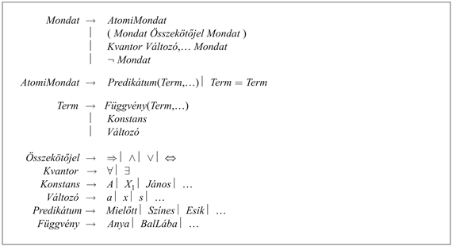

<?xml version="1.0" encoding="UTF-8" standalone="no"?>

<html xmlns="http://www.w3.org/1999/xhtml"><head><meta name="generator" content="DocBook XSL Stylesheets V1.76.1"/></head><body>

<h1 class="title"><a id="id593856"/>Az elsőrendű logika szintaxisa és szemantikája</h1>

Az alfejezetet azzal kezdjük, hogy pontosabban meghatározzuk azt a módot, amellyel az elsőrendű logikában előforduló lehetséges világok leírják az objektumokra és relációkra tett ontológiai megállapításokat. Ezután bemutatjuk a nyelv különböző elemeit, és ahogyan haladunk, megmagyarázzuk ezek szemantikáját.

<h2 class="title"><a id="id593862"/>Az elsőrendű logika modelljei</h2>

Emlékezzünk arra a 7. fejezetből, hogy a logikai nyelvek modelljei azok a formális struktúrák, amelyek a vizsgálat tárgyát képező lehetséges világokat alkotják. Az ítéletkalkulus modelljei csupán az ítéletszimbólumok igazságértékeinek halmazai. Az elsőrendű logika modelljei ennél érdekesebbek. Először is, ezek tartalmaznak objektumokat! A modell <strong>tárgyterület</strong>e (<strong>domain</strong>) azoknak az objektumoknak a halmaza, amelyeket a tárgyterület tartalmaz; ezeket az objektumokat szoktuk a <strong>tárgyterület eleme</strong>inek (<strong>domain element</strong>s)<strong> </strong>nevezni. A 8.2. ábra bemutat egy modellt öt objektummal: Oroszlánszívű Richárd, Anglia királya 1189-től 1199-ig; öccse, gonosz János király, aki 1199-től 1215-ig uralkodott; Richárd és János bal lába; végül egy korona.

A modellben található objektumok többféle relációban lehetnek egymással. A 8.2. ábrán Richárd és János testvérek. Formálisan, egy reláció csak egymással kapcsolatban lévő objektumok <strong><em>n</em>-es</strong>einek (<strong>tuple</strong>) halmaza. (Egy <em>n</em>-es az objektumok egy rögzített sorrendben felsorolt gyűjteménye, amely objektumokat a 〈〉 zárójelpár vesz körbe.) Így tehát ebben a modellben a testvérreláció a következő halmaz:

<code class="code">{〈Oroszlánszívű Richárd, János király〉, 〈János király, Oroszlánszívű Richárd〉}(8.1)</code>

(Itt magyarul neveztük meg az objektumokat, de képzeletben be lehetne helyettesíteni a neveket például képekkel is.) A korona János király fején van, tehát a „fején” relációhoz csak egy <em>n</em>-es tartozik 〈a korona, János király〉.

A „testvér” és a „fején” relációk bináris relációk – ez azt jelenti, hogy két objektum között állítanak fel kapcsolatot. A modell ezenkívül egyelemű, unáris relációkat vagy tulajdonságokat is tartalmaz: A „személy” tulajdonság egyaránt igaz Richárdra és Jánosra; a „király” tulajdonság csak Jánosra igaz (feltehetően azért, mert Richárd ekkor már halott volt); míg a „korona” tulajdonság csak a koronára igaz.

<a id="id593923"/>
<strong>8.2. ábra - Egy öt objektumot – két bináris relációt, három egyelemű relációt (címkékkel jelezve az objektumokon) és egy egyargumentumú függvényt, bal láb – tartalmazó modell</strong>

A kapcsolatok egyes típusai leginkább függvényeknek tekinthetők, ahol egy adott objektumnak pontosan csak egy másik objektummal kell ilyen kapcsolatban lennie. Például minden egyes személynek egy bal lába van, tehát a modellben található egy „bal láb” függvény, ami a következő leképezéseket teszi lehetővé:

<code class="code">〈Oroszlánszívű Richárd〉 ⟶ Richárd bal lába</code>

<code class="code">〈János király〉 ⟶ János bal lába						(8.2)</code>

Pontosabban megfogalmazva, az elsőrendű logika modelljei <strong>totális függvény</strong>eket (<strong>total function</strong>s)<strong> </strong>kívánnak meg, ami azt jelenti, hogy minden bemeneti <em>n</em>-eshez tartoznia kell egy értéknek. Így tehát a koronához tartoznia kell egy bal lábnak, és ennek így kell lennie minden bal láb esetében. Létezik erre a problémára egy technikai megoldás, amely egy hozzáadott „láthatatlan” objektumot vezet be: egy bal lábat rendel mindenhez, amelynek nincs bal lába, beleértve önmagát is. Szerencsére, amíg valaki nem tesz kijelentéseket a bal lábakról vagy olyan dolgokról, amelyeknek nincs bal lábuk, ezeknek a technikai problémáknak nincs jelentőségük.

<h2 class="title"><a id="id593964"/>Szimbólumok és interpretációk</h2>

Most pedig nézzük a nyelv szintaxisát. A türelmetlen olvasó teljes leírást talál az elsőrendű logika formális nyelvtanáról a 8.3. ábrán.

Az elsőrendű logika alapvető szintaktikai elemei az objektumokat, relációkat és függvényeket megjelenítő szimbólumok. A szimbólumoknak tehát három típusa létezik: <strong>konstansszimbólum</strong>ok (<strong>constant symbol</strong>s), amelyek az objektumokat jelölik; <strong>predikátumszimbólum</strong>ok (<strong>predicate symbol</strong>s), amelyek a relációkat jelenítik meg; és a <strong>f</strong><strong>üggvényszimbólum</strong>ok (<strong>function symbol</strong>s), amelyekkel függvényekre hivatkozhatunk. Azt a konvenciót fogjuk követni, hogy a szimbólumok mind nagybetűvel kezdődnek. Például használhatjuk a <em>Richárd </em>és <em>János</em> konstansszimbólumokat;<em> a Testvér</em>,<em> Fején</em>,<em> Személy</em>,<em> Király </em>és <em>Korona</em> predikátumszimbólumokat, valamint a <em>BalLáb</em> függvényszimbólumot<em>. </em>Úgy, mint az ítéletszimbólumoknál, a nevek megválasztása itt is teljes mértékben a felhasználóra van bízva. Minden egyes predikátum- és függvényszimbólum együtt jár egy <strong>számosság</strong>gal (<strong>arity</strong>), ami behatárolja a paraméterek számát.
<a id="ID_304_oldal"/>
<a id="id594049"/>
<strong>8.3. ábra - Az elsőrendű logika (egyenlőséggel kiegészített) szintaxisa Backus–Naur-forma jelöléseivel. (Lásd az <a class="xref" href="apb.md#ID_1112_oldal">„B1. Nyelvek definiálása Backus–Naur-Formában (BNF)”</a> részben, ha ez a jelölés ismeretlen.) A szintaxis szigorú a zárójelezés tekintetében; a zárójelekről és az operátori elsőbbségről a <a class="xref" href="ch07s03.md#ID_259_oldal">„Szintaxis”</a> részben szereplő megjegyzések ugyanúgy vonatkoznak az elsőrendű logikára is.</strong>

A szemantika a mondatokat a modellekhez kapcsolja, és képesnek kell lennie az igazság meghatározására. Hogy ez megtörténjen, szükségünk van egy <strong>interpretáció</strong>ra, amely pontosan megjelöli, hogy mely objektumok, relációk és függvények felelnek meg a konstans-, predikátum- és függvényszimbólumoknak. Egy lehetséges interpretáció – amit <strong>szándékolt interpretáció</strong>nak (<strong>intended interpretation</strong>) nevezünk – a mi esetünkben a következő:

<ul class="itemizedlist"><li class="listitem">
<em>Richárd </em>Oroszlánszívű Richárdra, míg <em>János </em>a gonosz János királyra vonatkozik.
</li><li class="listitem">
A<em> Testvér </em>a testvéri kapcsolatra vonatkozik, ami a (8.1) egyenletben megadott <em>n</em>-es halmazban látható; a<em> Fején </em>arra a „fején” relációra vonatkozik, ami a korona és János király között áll fenn; a <em>Személy</em>,<em> Király </em>és <em>Korona </em>pedig arra az objektumhalmazra vonatkoznak, amelyek személyek, királyok és koronák.
</li><li class="listitem">
A <em>BalLáb </em>azt a „bal láb” függvényt jelenti, aminek a leképezését a (8.2) egyenletben adtuk meg.
</li></ul>

Sok más lehetséges interpretáció is létezik, ami ezeknek a szimbólumoknak a modellhez való kapcsolatát írja le. Például egy lehetséges interpretációban <em>Richárd</em> jelenti a koronát és <em>János</em> a János király bal lábát. A modell öt objektumot tartalmaz, így 25 lehetséges interpretáció adható meg csak a <em>Richárd </em>és a <em>János </em>konstansszimbólumokhoz.

Figyeljük meg, hogy nem minden objektumnak van arra szüksége, hogy elnevezzék – például a szándékolt interpretáció nem nevezi meg a koronát vagy a lábakat. Az is lehetséges, hogy egy objektumnak több neve legyen; létezik olyan interpretáció, amelyben a <em>Richárd </em>és a <em>János </em>is a koronára vonatkozik. Ha ez a lehetőség zavaró, emlékezzünk arra, hogy az ítéletlogikában teljességgel elfogadható egy olyan modell, amelyben a <em>Felhős </em>és a <em>Napos </em>egyaránt igaz. A tudásbázis feladata az, hogy kizárja azokat a modelleket, amelyek ellentmondásban vannak ismereteinkkel.

Bármely mondat igazságát egy modell és a mondat szimbólumainak az interpretációja határozza meg. Így tehát a vonzat, az érvényesség és más jellemzők az <em>összes lehetséges modell </em>és az <em>összes lehetséges interpretáció </em>termjeinek felhasználásával vannak meghatározva. Fontos megjegyezni, hogy a tárgyterület elemek száma minden egyes modellben korlátlan lehet – a tárgyterület elemei például lehetnek egész vagy valós számok. Ebből következően, a lehetséges modellek száma korlátlan, mint ahogy az interpretációk száma is. A maga után vonzásnak az összes lehetséges modell felsorolásával történő vizsgálata, ami az ítéletlogikában működik, nem lehetséges az elsőrendű logikában. Még ha az objektumok száma korlátos is, a kombinációk száma nagyon nagy lehet. A példánkban szereplő objektumokkal hozzávetőlegesen 1025 a kombinációk száma, egy öt objektummal rendelkező tárgyterületben (lásd 8.5. feladat).

<h2 class="title"><a id="id594178"/>Termek</h2>

Egy <strong>term</strong> (<strong>term</strong>) egy objektumra vonatkozó logikai kifejezés. A konstansszimbólumok tehát termek, de nem mindig kényelmes önálló szimbólumot alkalmazni minden egyes objektum megnevezésénél. Magyarul inkább a „János király bal lába” kifejezést használjuk, mintsem nevet adjunk a lábának. Ezért használunk függvényszimbólumokat: a konstansszimbólumok használata helyett inkább a <em>BalLáb</em>(<em>János</em>)<em>-</em>t alkalmazzuk. Általános esetben egy összetett term egy függvényszimbólumból áll, amelyet a függvényszimbólum argumentumainak zárójelezett listája követ. Fontos megjegyezni, hogy egy összetett term nem más, mint egy bonyolult formájú név, és nem egy „értéket visszaadó szubrutin hívás”. Nem egy <em>BalLáb </em>szubrutinról van szó, amely bemenetként megkap egy személyt, és visszaad egy lábat. Tudunk következtetni a bal lábakkal kapcsolatban (pl. kiindulva az általános szabályból, hogy mindenkinek van egy bal lába, és ebből levezethető, hogy Jánosnak is lennie kell) anélkül, hogy valaha is megadnánk a <em>BalLáb </em>definícióját. Ez is olyasmi, amit nem tehetünk meg a programozási nyelvek szubrutinjaival.[<a id="id594211" href="#ftn.id594211" class="footnote">77</a>]

A termek formális szemantikája nyilvánvaló. Tekintsük az <em>f</em>(<em>t</em>1, …, <em>tn</em>)<em> </em>termet. Az <em>f</em> függvényszimbólum a modellben található valamely függvényre (nevezzük <em>F</em>-nek) vonatkozik; az argumentum termek a tárgyterületben fellelhető objektumokra vonatkoznak (nevezzük őket <em>d</em>1, …, <em>dn</em>-nek); és a term egészében arra az objektumra vonatkozik, ami a <em>d</em>1, …, <em>dn</em>-re alkalmazott <em>F </em>függvény értéke. Például tételezzük fel, hogy ha a <em>BalLáb </em>függvényszimbólum a (8.2) egyenletben mutatott függvényre vonatkozik, és a <em>János </em>vonatkozik János királyra, akkor a <em>BalLáb</em>(<em>János</em>)<em> </em>János király bal lábát jelöli. Ezen a módon az interpretáció rögzíti minden termnek a referenciáit.

<h2 class="title"><a id="id594314"/>Atomi mondatok</h2>

Most, hogy vannak objektumokra vonatkozó termeink és relációkra vonatkozó predikátumszimbólumaink, összerakhatjuk őket, hogy tényeket kifejező <strong>atomi mondat</strong>okat (<strong>atomic sentence</strong>s) állítsunk elő. Egy atomi mondatot egy predikátumszimbólum és az azt követő zárójelezett listában található termek listája alkot. Például a

<code class="code"><em>Testvér</em>(<em>Richárd</em>,<em> János</em>)</code>

azt jelenti egy korábban megadott szándékolt interpretáció szerint, hogy Oroszlánszívű Richárd testvére János királynak.[<a id="id594346" href="#ftn.id594346" class="footnote">78</a>] Az atomi mondatoknak is lehetnek összetett termek az argumentumai. Így tehát a

<code class="code"><em>Házas</em>(<em>Apja</em>(<em>Richárd</em>), <em>Anyja</em>(<em>János</em>))</code>

azt jelenti, hogy Oroszlánszívű Richárd apja feleségül vette János király anyját (ismét csak egy alkalmas interpretációban). 

<h3 class="title">Fontos</h3>
<em>Egy atomi mondat <strong>igaz</strong> (<strong>true</strong>)</em> <em>egy adott modellben, egy adott interpretáció mellett, ha a reláció, amire a predikátumszimbólum vonatkozik, fennáll az argumentumok által jelölt objektumok között.</em>

<h2 class="title"><a id="id594414"/>Összetett mondatok</h2>

Összetett mondatok létrehozásához használhatunk <strong>logikai összekötőjel</strong>eket (<strong>logical connective</strong>s) úgy, mint az ítéletkalkulusban. A logikai kötőszavakkal formált mondatok szemantikája azonos az ítéletkalkulusban látott szemantikával. Íme négy mondat, amelyek igazak a 8.2. ábra modelljében, a szándékolt interpretációnk szerint. 

<code class="code">¬<em>Testvér</em>(<em>BalLáb</em>(<em>Richárd</em>), <em>János</em>)</code>

<code class="code"><em>Testvér</em>(<em>Richárd</em>, <em>János</em>) ∧ <em>Testvér</em>(<em>János</em>, <em>Richárd</em>)</code>

<code class="code"><em>Király</em>(<em>Richárd</em>) ∨ <em>Király</em>(<em>János</em>)</code>

<code class="code">¬<em>Király</em>(<em>Richárd</em>) ⇒ <em>Király</em>(<em>János</em>)</code>

<h2 class="title"><a id="id594506"/>Kvantorok</h2>

Ha egyszer létrehoztunk egy objektumokat is tartalmazó logikát, természetes, hogy objektumok egész gyűjteményeire vonatkozó tulajdonságokat is ki akarunk fejezni anélkül, hogy az objektumokat nevük felhasználásával fel kellene sorolni. Ezt a <strong>kvantor</strong>ok (<strong>quantifier</strong>s) alkalmazása teszi lehetővé. Az elsőrendű logika két standard kvantort tartalmaz, amelyeket <em>univerzális </em>és <em>egzisztenciális </em>kvantoroknak nevezünk.

<h2 class="title"><a id="id594529"/>Univerzális kvantor (∀)</h2>

Emlékezzünk vissza arra, hogy a 7. fejezetben milyen nehézségeink voltak általános szabályok ítéletlogikában történő megfogalmazásával. Az olyan szabályok, mint az „A wumpus mellett található négyzetek büdösek” vagy a „Minden király személy” adják meg a savát-borsát az elsőrendű logikának. Az első szabállyal a 8.3. alfejezetben fogunk foglalkozni. A második szabály, „Minden király személy”, az elsőrendű logikában így írható le:

<code class="code">∀<em>x Király</em>(<em>x</em>)<em> </em>⇒ <em>Személy</em>(<em>x</em>)</code>

A ∀-t általában „Minden …re”-nek olvassuk ki. A mondat tehát azt jelenti: „Minden <em>x</em>-re, ha <em>x</em> egy király, akkor <em>x </em>egy személy.” Az <em>x </em>szimbólum neve <strong>változó</strong> (<strong>variable</strong>). A konvenció alapján a változókat kisbetűvel írjuk. Egy változó önmagában egy term, és mint olyan, szerepelhet egy függvény argumentumaként – például: <em>BalLáb</em>(<em>x</em>).<em> </em>Egy változó nélküli termet <strong>alapterm</strong>nek (<strong>ground term</strong>) nevezünk.

Egyszerűen a ∀<em>x P</em> mondat, ahol a <em>P</em> egy tetszőleges logikai kifejezés, azt mondja ki, hogy a <em>P</em> igaz minden <em>x </em>objektumra. Pontosabban, ∀<em>x P</em> igaz egy adott modellre az interpretáción belül, ha <em>P</em> igaz minden lehetséges <strong>kiterjesztett interpretáció</strong>ban (<strong>extended interpretation</strong>s), amelyet az adott interpretáció felhasználásával hozunk létre, ahol minden egyes kiterjesztett interpretáció meghatároz egy tárgyterületelemet, amire az <em>x </em>vonatkozik.

Ez bonyolultnak hangzik, de valójában csak egy óvatos módja annak, hogy megállapítsuk az univerzális kvantorok intuitív jelentését. Tekintsük a 8.2. ábrát és a hozzá tartozó szándékolt interpretációt. Ötféle módon tudjuk kiterjeszteni az interpretációt:

<code class="code"><em>x</em> ⟶ Oroszlánszívű Richárd</code>

<code class="code"><em>x</em> ⟶<em> </em>János király</code>

<code class="code"><em>x</em> ⟶<em> </em>Richárd bal lába</code>

<code class="code"><em>x</em> ⟶<em> </em>János bal lába</code>

<code class="code"><em>x</em> ⟶<em> </em>a korona</code>

A ∀<em>x Király</em>(<em>x</em>)<em> </em>⇒<em> Személy</em>(<em>x</em>)<em> </em>univerzális kvantort alkalmazó mondat igaz az eredeti interpretációban, ha a <em>Király</em>(<em>x</em>)<em> </em>⇒ <em>Személy</em>(<em>x</em>)<em> </em>mondat igaz mind az öt kiterjesztett interpretációra. Eszerint az univerzális kvantorral ellátott mondat egyenértékű a következő öt mondattal:

<code class="code">Oroszlánszívű Richárd egy király ⇒<em> </em>Oroszlánszívű Richárd egy személy</code>

<code class="code">János király egy király ⇒<em> </em>János király egy személy</code>

<code class="code">Richárd bal lába egy király ⇒<em> </em>Richárd bal lába egy személy</code>

<code class="code">János bal lába egy király ⇒<em> </em>János bal lába egy személy</code>

<code class="code">A korona egy király ⇒<em> </em>a korona egy személy</code>

Nézzük meg alaposan ezt az állításhalmazt. Mivel a mi modellünkben János király az egyetlen király, a második mondat kijelenti, hogy ő egy személy, ahogy azt reméltük is. De mi a helyzet a többi négy mondattal, amelyek azért szerepelnek, hogy állításokat fogalmazzanak meg lábakról és koronákról? Része ez annak a jelentésnek, hogy „Minden király személy”? Valójában, a többi négy állítás is igaz a modellben, de egyáltalán nem állítanak semmit a lábak, koronák vagy akár Richárd személyes tulajdonságairól. Ez azért van, mert ezen objektumok egyike sem király. Ha megnézzük a (⇒) összekötőjel igazságtábláját (7.8. ábra), láthatjuk, hogy az implikáció igaz, amikor a premisszája hamis – <em>tekintet nélkül </em>a konklúzió igazságtartalmára. Így tehát az univerzális kvantorral ellátott mondat kijelentése egyenértékű azzal, hogy egyedi implikációk teljes listáját definiáljuk. Végül is egy szabály konklúzióját adjuk meg azokra az objektumokra, amelyek premisszája igaz, de nem mondunk egyáltalán semmit azokról az egyedekről, akikre nézve a premissza hamis. Így az implikáció igazságtáblájának sorai tökéletesnek bizonyulnak univerzális kvantorokat tartalmazó általános szabályok megírásához.

Gyakori hiba, amelyet még figyelmes olvasók is elkövetnek, akik pedig már többször is elolvasták ezt a bekezdést, hogy konjunkciót használnak implikáció helyett. A

<code class="code">∀<em>x Király</em>(<em>x</em>) ∧ <em>Személy</em>(<em>x</em>)</code>

mondat egyenértékű lenne azzal az állítással, hogy

Oroszlánszívű Richárd egy király ∧<em> </em>Oroszlánszívű Richárd egy személy

János király egy király ∧<em> </em>János király egy személy

Richárd bal lába egy király ∧<em> </em>Richárd bal lába egy személy

és így tovább. Nyilvánvaló, hogy ez nem azt jelenti, mint amit szeretnénk elérni.

<h2 class="title"><a id="id594829"/>Egzisztenciális kvantor (∃)</h2>

Az univerzális kvantor állításokat fogalmaz meg minden objektumról. Hasonlóan, az egzisztenciális kvantor felhasználásához állításokat tehetünk az univerzum<em> néhány </em>objektumáról anélkül, hogy megneveznénk azokat. Azt az állítást tehát, hogy János királynak koronája van, így is leírhatjuk:

<code class="code">∃<em>x  Korona</em>(<em>x</em>) ∧<em> Fején</em>(<em>x</em>,<em> János</em>)</code>

Az ∃<em>x </em>kiolvasása „Létezik egy olyan <em>x</em>…” vagy „Néhány <em>x</em>-re…” .

Érthetően fogalmazva, az ∃<em>x P </em>mondat azt jelenti, hogy a <em>P</em> legalább egy <em>x</em> objektumra igaz. Pontosabban az ∃<em>x P</em> igaz egy adott modellben, egy adott interpretáción belül, ha a <em>P</em> igaz <em>legalább egy </em>kiterjesztett interpretációban, amely az <em>x</em>-et a tartomány egy eleméhez rendeli. A mi példánkban ez azt jelenti, hogy a következő állítások közül legalább egy igaz:

Oroszlánszívű Richárd egy korona ∧<em> </em>Oroszlánszívű Richárd János fején van

János király egy korona ∧<em> </em>János király János fején van

Richárd bal lába egy korona ∧<em> </em>Richárd bal lába János fején van

János bal lába egy korona ∧<em> </em>János bal lába János fején van

A korona egy korona ∧<em> </em>a korona János fején van

Az ötödik állítás igaz a modellben, így az eredeti egzisztenciális kvantorral ellátott mondat igaz a modellben. Vegyük észre, hogy definíciónk szerint a mondat igaz lenne egy olyan modellben is, ahol János király két koronát visel. Ez teljes mértékben konzisztens az eredeti mondattal, miszerint „János királynak korona van a fején.”[<a id="id594937" href="#ftn.id594937" class="footnote">79</a>]

Mint ahogy természetesnek tűnik az ⇒ használata összekötőjelnek a ∀ használatakor, az ∧ az a természetes összekötőjel, amit az ∃-vel használunk. Az ∧<em> </em>használata fő összekötőjelként az ∀-val túlságosan is erős állításokhoz vezetett az előző alfejezetben tárgyalt példában; a ⇒ használata az ∃-vel igazából nagyon gyenge állításhoz vezet:

<code class="code">∃<em>x  Korona</em>(<em>x</em>) ⇒ <em>Fején</em>(<em>x</em>, <em>János</em>)</code>

A felszínen ez a mondatunk elfogadható átírásának tűnik. A szemantikát alkalmazva látjuk, hogy a mondat azt jelenti ki, hogy a következő állítások legalább egyike igaz:

Oroszlánszívű Richárd egy korona ⇒ Oroszlánszívű Richárd János fején van

János király egy korona ⇒ János király János fején van

Richárd bal lába egy korona ⇒ Richárd bal lába János fején van

és így tovább. Mármost, egy implikáció akkor igaz, ha a premissza és a konklúzió egyaránt igaz, <em>vagy ha a premisszája hamis. </em>Tehát ha Oroszlánszívű Richárd nem egy korona, akkor az első állítás igaz, és az egzisztenciális kvantort kielégítettük. Így tehát egy egzisztenciális kvantort tartalmazó implikációs mondat igaz bármely olyan modellben, amely tartalmaz egy olyan objektumot, amelyre az implikáció premisszája hamis; következésképpen az ilyen mondatok valójában nem túl sokat mondanak.

<h2 class="title"><a id="id594988"/>Egymásba ágyazott kvantorok</h2>

Gyakran szükségünk van még összetettebb mondatok kifejezésére, amelyek több kvantort is használnak. A legegyszerűbb eset az, amikor a kvantorok azonos típusúak. Például „A fivérek testvérek” mondat leírható úgy, hogy:

<code class="code">∀<em>x </em> ∀<em>y  Fivér</em>(<em>x</em>,<em> y</em>) ⇒ <em>Testvér</em>(<em>x</em>,<em> y</em>)</code>

Az egymást követő azonos típusú kvantorokat írhatjuk úgy is, hogy egy kvantort alkalmazunk az összes változóra. Például hogy azt állítsuk, a testvérség egy szimmetrikus kapcsolat, ezt írhatjuk:

<code class="code">∀<em>x</em>,<em> y  Testvér</em>(<em>x</em>,<em> y</em>)<em> </em>⇔ <em>Testvér</em>(<em>y</em>, <em>x</em>)</code>

Más esetekben kevert jelöléssel van dolgunk. A „mindenki szeret valakit” azt jelenti, hogy minden személyhez tartozik valaki, akit a személy szeret:

<code class="code">∀<em>x </em> ∃<em>y  Szeret</em>(<em>x</em>,<em> y</em>)</code>

Másrészt, hogy azt állítsuk: „Van valaki, akit mindenki szeret”, ezt írjuk:

<code class="code">∃<em>y </em> ∀<em>x  Szeret</em>(<em>x</em>,<em> y</em>)</code>

A kvantorok sorrendje tehát nagyon fontos. Még világosabbá válik, ha zárójeleket is alkalmazunk. A ∀<em>x </em>(∃<em>y Szeret</em>(<em>x</em>, <em>y</em>))<em> </em>azt jelenti, hogy <em>mindenkinek </em>van egy bizonyos tulajdonsága, nevezetesen, az a tulajdonság, hogy mindenki szeret valakit. Másrészt, a ∃<em>x </em>(∀<em>y  Szeret</em>(<em>x</em>,<em> y</em>)) azt jelenti, hogy a világban <em>valakinek </em>van egy bizonyos tulajdonsága, méghozzá az, hogy mindenki szereti őt.

Zavart okozhat, ha két kvantort használunk ugyanazzal a változó névvel. Tekintsük a következő mondatot:

<code class="code">∀<em>x  </em>[<em>Korona</em>(<em>x</em>) ∨<em> </em>(∃<em>x  Fivér</em>(<em>Richárd</em>,<em> x</em>))]</code>

Itt az <em>x </em>a <em>Fivér</em>(<em>Richárd</em>, <em>x</em>)<em>-</em>ben <em>egzisztenciális </em>kvantorral van ellátva. Az a szabály, hogy a változó ahhoz a legbelső kvantorhoz tartozik, ami a változót megemlíti, és utána a változó nem tárgya semmilyen kvantor alárendelésnek.[<a id="id595196" href="#ftn.id595196" class="footnote">80</a>]

A másik módja a megoldásnak: ∃<em>x  Fivér</em>(<em>Richárd</em>, <em>x</em>),<em> </em>ahol ez egy Richárdról szóló mondat (hogy neki van egy fivére), és nem pedig az <em>x</em>-ről. Így tehát annak nem lesz hatása, ha kívül elé teszünk egy ∀<em>x</em>-et. Éppen így írhattuk volna azt is, hogy ∃<em>z Fivér</em>(<em>Richárd</em>, <em>z</em>).<em> </em>Mivel ez tévesztés forrása lehet, ezért mindig különböző változókat fogunk használni.

<h2 class="title"><a id="id595262"/>Az ∀ és az ∃ kapcsolata</h2>

A két kvantor valójában szoros kapcsolatban áll egymással a negáción keresztül. Ha valaki azt mondja, hogy mindenki utálja a paszternákot, akkor egyúttal azt is mondja, hogy nem létezik olyan valaki, aki szereti azt, és fordítva:

<code class="code">∀<em>x  </em>¬<em>Szereti</em>(<em>x</em>,<em> Paszternák</em>)<em> </em>egyenértékű azzal, hogy ¬∃<em>x  Szereti</em>(<em>x</em>,<em> Paszternák</em>)</code>

Egy lépéssel tovább is mehetünk. A „Mindenki szereti a fagylaltot” mondat azt jelenti, hogy nincs olyan, aki ne szeretné a fagylaltot:

<code class="code">∀<em>x  Szereti</em>(<em>x</em>, <em>Fagylalt</em>)<em> </em>egyenértékű azzal, hogy ¬∃<em>x  Szereti</em>(<em>x</em>, <em>Fagylalt</em>)</code>

Mivel az ∀ igazából egy konjunkció minden univerzumbeli objektum felett, az ∃ pedig egy diszjunkció ugyanezen objektumok felett, ezért nem meglepő, hogy eleget tesznek a De Morgan-szabályoknak. A kvantorral és a kvantor nélkül álló mondatokra vonatkozó De Morgan-szabályok a következők:

<table border="0"><colgroup><col width="238.7pt" class="col1"/><col width="238.7pt" class="col2"/></colgroup><tbody><tr><td style="text-align: left" valign="top">
<code class="code">∀<em>x</em>  ¬<em>P </em>≡ ¬∃<em>x</em>  <em>P</em></code>
</td><td style="text-align: left" valign="top">
<code class="code">¬Π ∧ ¬<em>Q </em>≡ ¬(<em>P </em>∨<em> Q</em>)</code>
</td></tr><tr><td style="text-align: left" valign="top">
<code class="code">¬∀<em>x </em> <em>P</em>  ≡ ∃<em>x</em>  ¬<em>P</em></code>
</td><td style="text-align: left" valign="top">
<code class="code">¬(<em>P</em> ∧ <em>Q</em>) ≡ ¬<em>P </em>∨ ¬<em>Q</em></code>
</td></tr><tr><td style="text-align: left" valign="top">
<code class="code">∀<em>x</em>  <em>P    </em>≡ ¬∃<em>x</em>  ¬<em>P</em></code>
</td><td style="text-align: left" valign="top">
<code class="code"><em>P</em> ∧<em>Q </em>≡ ¬(¬<em>P </em>∨ ¬<em>Q</em>)</code>
</td></tr><tr><td style="text-align: left" valign="top">
<code class="code">∃ <em>x</em> <em>P </em>≡ ¬∀<em>x</em>  ¬<em>P</em></code>
</td><td valign="top">
<code class="code"><em>P</em> ∨ <em>Q </em>≡ ¬(¬<em>P </em>∧ ¬<em>Q</em>)</code>
</td></tr></tbody></table>

<code class="code"/>

Így valójában nincs szükségünk egyszerre mind az ∀-ra, mind az ∃-re, mint ahogy nincs szükség egyszerre mind az ∧-ra és az ∨-ra sem. Mégis, mivel az olvashatóság fontosabb, mint a takarékosság, használni fogjuk mindkét kvantort.

<h2 class="title"><a id="id595560"/>Egyenlőség</h2>

Az elsőrendű logika a predikátumok és termek korábban leírt használatán kívül még egy lehetőséget nyújt atomi mondatok készítésére. Alkalmazhatjuk az <strong>egyenlőségszimbólum</strong>ot (<strong>equality symbol</strong>) állítások készítésére is annak kifejezésére, hogy két term ugyanarra az objektumra vonatkozik. Például az

<code class="code"><em>Apja</em>(<em>János</em>)<em> </em>=<em> Henrik</em></code>

azt mondja ki, hogy az <em>Apja</em>(<em>János</em>) által hivatkozott objektum és a <em>Henrik </em>által hivatkozott objektum azonos. Mivel az interpretáció rögzíti bármely term referenciáit, egy egyenlőségi állítás igazságának megállapításához elegendő azt látni, hogy a két term referenciái ugyanazok az objektumok.

Az egyenlőségszimbólumot használhatjuk arra, hogy tényeket állapítsunk meg egy adott függvényről, ahogy ezt megtettük az imént az <em>Apja </em>szimbólummal. Alkalmazhatjuk az egyenlőségszimbólumot negációval is, annak a kifejezésére, hogy két term nem ugyanaz az objektum. Ha azt akarjuk állítani, hogy Richárdnak legalább két fivére van, ezt írjuk:

<code class="code">∃<em>x</em>,<em>y  Fivér</em>(<em>x</em>, <em>Richárd</em>) ∧<em> Fivér</em>(<em>y</em>,<em> Richárd</em>)<em> </em>∧ ¬(<em>x</em> = <em>y</em>)</code>

Annak a mondatnak, hogy

<code class="code">∃<em>x</em>,<em>y  Fivér</em>(<em>x</em>,<em> Richárd</em>) ∧<em> Fivér</em>(<em>y</em>, <em>Richárd</em>)</code>

nem ugyanaz a szándékolt jelentése. Ez a mondat például igaz a 8.2. ábrán látható modellre, ahol Richárdnak csak egy fivére van. Hogy ezt megértsük, figyeljük meg azt a kiterjesztett interpretációt, ahol mind az <em>x</em>,<em> </em>mind az <em>y </em>János királyhoz van rendelve. A ¬(<em>x </em>=<em> y</em>)<em> </em>viszont már nem eleme a modellnek. Az <em>x </em>≠ <em>y</em>-t néha rövidítésként használjuk a ¬(<em>x </em>=<em> y</em>)<em> </em>kifejezésére.

 

[<a id="ftn.id594211" href="#id594211" class="para">77</a>]  A <strong>λ-kifejezés</strong>ek (<strong>λ</strong><strong> -expression</strong>s) hasznos jelölést biztosítanak, amelyek az új függvényszimbólumokat futási időben hozzák létre. Például a függvény, amely négyzetre emeli a számokat, leírható úgy, hogy (λ <em>x </em> <em>x</em> × <em>x</em>), és alkalmazható az argumentumokra, akár bármely más függvényszimbólum. Egy λ -kifejezést úgy is meghatározhatunk és használhatunk, mint egy predikátumszimbólumot (lásd 22. fejezet). A Lambda operátor a Lispben pontosan ugyanezt a szerepet játssza. Vegyük észre, hogy a λ használata ilyen módon nem növeli meg az elsőrendű logika formális kifejezőerejét, mert az a mondat, ami tartalmaz egy λ -kifejezést, átírható úgy, hogy hozzácsatoljuk a paramétereket, ami egy ugyanolyan mondatot eredményez.

[<a id="ftn.id594346" href="#id594346" class="para">78</a>]  Rendszerint követjük az argumentumok rendezésének konvencióját, amely szerint a <em>P</em>(<em>x</em>,<em>y</em>)-t úgy értelmezzük, hogy az „<em>x</em> az <em>y</em>-nak a <em>P</em>-je”. 

[<a id="ftn.id594937" href="#id594937" class="para">79</a>]  Létezik az egzisztenciális kvantornak egy variánsa, amelyet ∃1-gyel vagy ∃!-lel jelölünk, és ami azt jelenti, hogy „Létezik pontosan egy…”. Ugyanez a jelentés kifejezhető egyenlőségállításokkal is, mint azt a 8.2. alfejezetben bemutattuk.

[<a id="ftn.id595196" href="#id595196" class="para">80</a>]  Az azonos változónevet használó kvantorok interferenciára való képessége teszi lehetővé a kiterjesztett interpretációk kissé barokkos mechanizmusát a kvantorral ellátott mondatok szemantikájában. Az intuitíve legegyértelműbb megközelítése az objektumok helyettesítésének az <em>x</em> minden előfordulásánál nem működik a példánkban, mert az <em>x</em>-et a <em>Fivér</em>(<em>Richárd</em>, <em>x</em>)-ben „foglyul ejtené” a behelyettesítés. A kiterjesztett interpretációk ezt pontosabban oldják meg, mert a belső kvantor hozzákapcsolása az <em>x</em> termhez kioltja a külső kvantor hatását.

</body></html>
