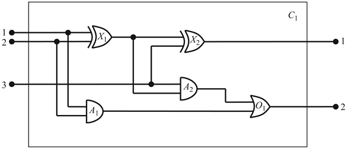

<?xml version="1.0" encoding="UTF-8" standalone="no"?>

<html xmlns="http://www.w3.org/1999/xhtml"><head><meta name="generator" content="DocBook XSL Stylesheets V1.76.1"/></head><body>

<h1 class="title"><a id="id600711"/>Tudástervezés az elsőrendű logikában</h1>

A megelőző alfejezet bemutatta az elsőrendű logika használatát a tudás reprezentálására három egyszerű tárgyterületben. Ez az alfejezet a tudásbázis felépítésének általános folyamatát írja le – egy folyamatot, amit <strong>tudástervezés</strong>nek (<strong>knowledge engineering</strong>) nevezünk. A tudásmérnök egy olyan személy, aki egy bizonyos tárgyterületet vizsgál, megismeri, hogy mely koncepciók fontosak abban a tárgyterületben, és megalkot egy formális reprezentációt a tárgyterületben található objektumokra és relációkra. A tudástervezés folyamatát az elektronikus áramkör tárgyterületében fogjuk illusztrálni, amely már valószínűleg ismerős, így koncentrálhatunk az ezzel járó reprezentációs problémákra. Az általunk alkalmazott megközelítés <em>speciális célú </em>tudásbázisok kialakításához megfelelő, amelyek tárgyterülete alaposan körülhatárolt, és amelyek lekérdezéseinek az egész sorozatát előre ismerjük. Általános<em> célú </em>tudásbázisokat, amelyeket arra használunk, hogy lekérdezéseket tegyenek lehetővé az emberi tudás teljes területére vonatkozóan, a 10. fejezetben tárgyaljuk majd meg.

<h2 class="title"><a id="id600734"/>A tudástervezés folyamata</h2>

A tudástervezési projektek különbözők tárgyukat, tárgykörüket és nehézségüket tekintve, de minden ilyen projekt tartalmazza a következő lépéseket:

<ol class="orderedlist"><li class="listitem">
<em>A feladat beazonosítása. </em>A tudásmérnöknek fel kell vázolnia a kérdések sorát, amelyekkel a tudásbázis foglalkozni fog, és a tényeknek azokat a csoportjait, amelyek minden egyes problémaspecifikus példányban megtalálhatók lesznek. El kell döntenie például, hogy a wumpus tudásbázisnak képesnek kell-e lennie a cselekvések kiválasztására, vagy hogy csak az várható el, hogy a környezet elemeivel kapcsolatos kérdéseket válaszolja meg. Tudnia kell, hogy az érzékelőktől származó tények leírják-e a jelenlegi helyzetet. A feladat határozza meg, hogy mely tudást kell tárolni, hogy a problémapéldányokban a válaszokat megadhassuk az adott esetre vonatkozóan. Ez a lépés analóg az ágensek tervezésénél látott TKBÉ-folyamattal, amelyről a 2. fejezetben írtunk.
</li><li class="listitem">
<em>A releváns tudás összegyűjtése.</em> A tudásmérnök vagy már szakértője a tárgyterületnek, vagy együtt kell működnie igazi szakértőkkel, hogy megismerje az ő tudásukat – ezt a folyamatot <strong>tudásmegszerzés</strong>nek (<strong>knowledge acquisition</strong>) nevezzük. Ezen a szinten a tudást formálisan nem reprezentáljuk. A cél az, hogy megértsük a tudásbázis tárgykörét, amit a feladat határol be, és meg kell érteni azt is, hogy a tárgyterület hogyan működik a gyakorlatban.
</li></ol>

	A wumpus világban, amelyet mesterségesen létrehozott szabályrendszer határoz meg, könnyű az idevonatkozó tudásbázist azonosítani. (Vegyük észre azonban, hogy a szomszédosság definíciója nem volt explicit megadva a wumpus világ szabályaiban.) A valódi tárgyterületekben a relevancia problémája meglehetősen bonyolult lehet – például egy VLSI tervező szimulációs rendszernek figyelembe kell vennie a szórt kapacitásokat és a felületi hatásokat.

<ol class="orderedlist"><li class="listitem">
<em>Meg kell határozni a predikátumok, függvények és konstansok szótárát. </em>Ez azt jelenti, hogy a fontos tárgyterület szintű koncepciókat le kell fordítani logikai szintű nevekre. Ez számos, a megközelítés <em>jellegét</em> tárgyaló kérdést érint. Hasonlóan, mint a programozási stílusnak, ennek is jelentős hatása lehet a projekt végső sikerére. Például ilyen kérdés, hogy a csapdákat vajon objektumok jelenítsék-e meg vagy egy a négyzetekre vonatkozó unáris predikátum? Az ágens iránya függvény legyen-e vagy predikátum? A wumpus helyzete az időtől függjön-e? Mihelyt a választás megtörtént, az eredmény egy szótár, amit a tárgyterület <strong>ontológiá</strong>jának (<strong>ontology</strong>) nevezzünk. Az <em>ontológia </em>fogalma egy olyan elméletet takar, ami a létezés természetét írja le. Meghatározza, hogy milyen dolgok léteznek, de nem határozza meg a rájuk jellemző tulajdonságokat, sem a köztük fennálló kapcsolatokat.
</li><li class="listitem">
<em>A tárgyterületről szóló általános tudás kódolása. </em>A tudásmérnök leírja a szótár öszszes termjéhez tartozó axiómákat. Ez lerögzíti (amennyire lehetséges) a termek jelentését, és lehetővé teszi a szakértő számára a tartalom ellenőrzését. Ez a lépés gyakran feltárja a félreértelmezéseket vagy a hiányosságokat a szótárban, amelyeket a 3. lépéshez újra és újra visszatérve, iteratív eljárással javíthatunk.
</li><li class="listitem">
<em>Az adott probléma példány leírásának kódolása. </em>Ha az ontológia jól átgondolt, ez a lépés már könnyű lesz. Egyszerű atomi mondatokat kell az ontológiában már leírt fogalmak példányaira megfogalmazni. Egy logikai ágens számára a problémapéldányokat az érzékelők biztosítják, amikor a „különálló” tudásbázist kiegészítik mondatokkal ugyanúgy, ahogy a hagyományos programoknak bemeneti adatokat adunk meg.
</li><li class="listitem">
<em>Lekérdezéseket fogalmazunk meg a következtetési folyamat számára és válaszokat vezetünk le. </em>Itt kapjuk meg az eddigi munkánk jutalmát: működtethetjük a következtetési folyamatot az axiómákon és a problémaspecifikus tényeken, hogy megkapjuk a minket érdeklő tényeket.
</li><li class="listitem">
<em>Szűrjük ki a hibákat a tudásbázisból. </em>Sajnos az első próbálkozásra a kérdésekre kapott válaszok nagyon ritkán lesznek helyesek. Pontosabban, a válaszok helyesek lesznek <em>a megadott tudásbázis szempontjából, </em>feltételezve, hogy a következtetési folyamat megfelelő, de a válaszok nem azok lesznek, amiket a felhasználó vár. Például ha hiányzik egy axióma, akkor bizonyos kérdések megválaszolhatatlanok lesznek a tudásbázis alapján. Ilyenkor egy hibajavítási folyamatra van szükség. A hiányzó vagy túl gyenge axiómák könnyen megtalálhatók úgy, hogy felfedezzük azokat a helyeket, ahol a következtetés lánca váratlanul megszakad. Például ha a tudásbázis tartalmazza az egyik, csapdákra vonatkozó diagnosztikus axiómát,
</li></ol>

<code class="code">∀<em>s  Szellős</em>(<em>s</em>)<em> </em>⇒ ∃<em>r  Szomszédos</em>(<em>r</em>, <em>s</em>)<em> </em>∧ <em>Csapda</em>(<em>r</em>)</code>

	de nem tartalmazza a másikat, akkor az ágens soha nem lesz képes bizonyítani a csapdák <em>hiányát. </em>A helytelen axiómák azonosíthatók, mivel ezek hamis állítások a világról. Például az a mondat, hogy:

<code class="code">∀<em>x  LábakSzáma</em>(<em>x</em>, 4)<em> </em>⇒<em> Emlős</em>(<em>x</em>)</code>

	hamis a hüllőkre, kétéltűekre vagy ami még fontosabb, az asztalokra nézve. 

<h3 class="title">Fontos</h3>
<em>Ennek a mondatnak a hamissága a tudásbázis többi részétől függetlenül meghatározható. </em>Ezzel szemben egy tipikus programhiba ilyen:

<code class="code">eltolás = pozíció + 1</code>

Nem lehet ez alapján megmondani, hogy a mondat helyes-e anélkül, hogy megnéznénk a program többi részét. Például azt, hogy az eltolás-t a jelenlegi pozícióra vonatkozóan használjuk-e, vagy arra, amely eggyel a jelenlegi pozíció mögött van, vagy arra, hogy a pozíció<em> </em>értéke megváltozott egy másik állítás által, és így az eltolás-t is meg kell változtatni.

Hogy jobban megértsük ezt a hétlépéses folyamatot, alkalmazzuk most egy kiterjesztett példára – az elektronikus áramkörök tárgyterületére.

<h2 class="title"><a id="id600908"/>Az elektronikus áramkörök tárgyterülete[<a id="id600911" href="#ftn.id600911" class="footnote">84</a>]</h2>

Létrehozunk egy ontológiát és egy tudásbázist, amelynek felhasználásával képesek leszünk következtetéseket végezni olyan típusú digitális áramkörökről, mint amilyet a 8.4. ábra mutat. A tudástervezés hétlépéses folyamatát fogjuk követni.

<h2 class="title"><a id="id600923"/>A feladat meghatározása</h2>

Számos következtetési feladatot lehet a digitális áramkörökkel kapcsolatban elvégezni. A legmagasabb szinten az áramkör funkcionalitását vizsgálhatjuk. Például szabályosan ad-e össze a 8.4. ábrán látható áramkör? Ha minden bemenet magas, akkor mi az <em>A</em>2 kapu kimenetének állapota? Az áramkör szerkezetéről feltett kérdések is érdekesek. Például melyek azok a kapuk, amelyek az első bemeneti ponthoz vannak kapcsolva? Tartalmaz-e az áramkör visszacsatolásokat? Ebben az alfejezetben ezeket a feladatokat vizsgáljuk meg. Léteznek az elemzésnek részletesebb szintjei is, például amelyek az időzítés késleltetésével, az áramkör területével, áramfogyasztásával, működtetési költségeivel és így tovább kapcsolatosak. Minden egyes ilyen szint vizsgálata további ismereteket igényel.

<h2 class="title"><a id="id600935"/>A releváns tudás összegyűjtése</h2>

Mit tudunk a digitális áramkörökről? A céljainknak megfelelően azt, hogy vezetékekből és kapukból állnak. A jelek a vezetékeken keresztül áramlanak a kapuk bemeneti termináljához, és minden kapu egy jelet hoz létre a kimeneti terminálon, ami aztán egy másik vezetéken áramlik. Ahhoz, hogy meghatározzuk, melyek is ezek a jelek, ismernünk kell, hogy a kapuk hogyan alakítják át bemeneti jeleiket. Négyféle kaput használunk: az AND, az OR és a XOR kapuknak két bemenetük van, míg a NOT kapuknak csak egy. Minden kapunak egy kimenete van. Az áramköröknek, hasonlóan a kapukhoz, bemeneteik és kimeneteik is vannak.

Ahhoz, hogy következtetéseket végezhessünk a funkcionalitásról és az összeköttetésekről, nem szükséges magukról a vezetékekről vagy ezek útvonalairól, két vezeték találkozásánál levő kereszteződéseiről tudást megfogalmazni. Csak a be- és kimenetek közötti összeköttetések számítanak – tehát csak azt kell kimondani, hogy egy kimenet össze van-e kapcsolva egy másik bemenettel, anélkül hogy meg kellene említeni a vezetékeket, amik valójában összekötik őket. A tárgyterületnek sok más tényezője van, ami a mi vizsgálatunkban nem releváns. Ilyen például a különböző elemek mérete, formája, színe vagy ára.

<a id="id600944"/>
<strong>8.4. ábra - Egy <em>C</em>1-es digitális áramkör, amelynek az a célja, hogy egy egybites teljes összeadást végezzen. Az első két bemenet az a két bit, amit össze kell adni, míg a harmadik bemenet az átvitel. Az első kimenet az összeg, míg a második kimenet az átvitel a következő összeadó felé. Az áramkör két XOR, két AND és egy OR kaput tartalmaz.</strong>

Ha a célunk valami más lenne, és nem a kapuszintű tervezés helyességének ellenőrzése, akkor az ontológiánk is más lenne. Például ha az érdekelne minket, hogyan lehetne a hibákat a hibás áramkörökben megtalálni, akkor valószínűleg jó ötlet lenne a vezetékekkel is foglalkozni az ontológiában, mivel egy hibás vezeték meghamisíthatja a rajta keresztülhaladó jelet. Az időzítési hibák megtalálásához a kapuk késleltetésével kapcsolatos fogalmakat kellene leírni. Ha az érdekelne minket, hogy hogyan lehet egy nyereséges terméket tervezni, akkor az áramkörök költségének és sebességének a piacon jelen lévő egyéb termékekkel történő összehasonlíthatósága lenne fontos.

<h2 class="title"><a id="id600963"/>A szótár meghatározása</h2>

Tudjuk, hogy áramkörökről, be- és kimenetekről, jelekről és kapukról akarunk beszélni. A következő lépés az ezeket reprezentáló függvények, predikátumok és konstansok kiválasztása. Az egyes kaputípusoktól fogunk indulni, és végül eljutunk az áramkörökig.

Először is meg kell tudnunk különböztetni egy kaput a többi kaputól. Ezt úgy érjük el, hogy konstansokat használunk a kapuk megnevezésére: <em>X</em>1,<em> X</em>2<em> </em>és így tovább. Habár minden kapu a maga egyedi módján kapcsolódik az áramkörhöz, a <em>viselkedése</em> – vagyis az a mód, ahogyan átalakítja a bemeneti jeleket kimeneti jelekké – csakis a <em>típusától </em>függ. Egy kapu típusának jelölésére[<a id="id600994" href="#ftn.id600994" class="footnote">85</a>] egy függvényt használhatunk. Például írhatjuk, hogy <em>Típus</em>(<em>X</em>1)<em> </em>=<em> XOR. </em>Ez hozzárendeli az <em>XOR</em> konstanst egy bizonyos kaputípushoz. A többi konstans nevei: <em>OR</em>, <em>AND</em> és <em>NOT</em> lesznek. A <em>Típus </em>függvény nem az egyetlen lehetséges módja annak, hogy kódoljuk az ontológiai megkülönböztetést. Használhattunk volna egy bináris predikátumot is, mint a <em>Típus</em>(<em>X</em>1, <em>XOR</em>),<em> </em>vagy több egyargumentumú predikátumot, mint például az <em>XOR</em>(<em>X</em>1)<em>. </em>Ezeknek a megoldásoknak bármelyike jól működne, de a <em>Típus </em>függvény választásával kiküszöböltük, hogy szükség legyen egy olyan axiómára, amely azt mondja ki, hogy minden egyes kapunak csak egyetlen típusa lehet.

Ezután megvizsgáljuk a végpontokat (be- és kimeneteket). Egy kapunak vagy áramkörnek egy vagy több bemenete, és egy vagy több kimenete lehet. Mindegyiket elnevezhetnénk egyszerűen egy konstanssal, mint ahogy azt a kapukkal tettük. Így az <em>X</em>1 kapunak olyan végpontjai lennének, mint az <em>X</em>1<em>Be</em>1, az<em> X</em>1<em>Be</em>2<em> </em>és az <em>X</em>1<em>Ki</em>1<em>. </em>A hosszú, összetett elnevezéseket azonban célszerű kerülni. Az, hogy valamit <em>X</em>1<em>Be</em>1-nek nevezünk, nem jelenti azt, hogy ez az <em>X</em>1 első bemenete; még ekkor is hozzá kell tennünk valamit egy explicit állítást használva. Valószínűleg szerencsésebb egy függvénnyel leírni egy kaput, hasonlóan mint, ahogy János király bal lábát elneveztük <em>BalLáb</em>(<em>János</em>)-nak. Így tehát jelöljük az <em>X</em>1<em> </em>kapu első bemenetét úgy, hogy: <em>Be</em>(1, <em>X</em>1)<em>. </em>Egy hasonló <em>Ki</em> függvényt használunk a kimenetekre.

A kapuk közötti összeköttetést reprezentálhatjuk az <em>Összekapcsolt </em>predikátummal, ami két végpontot vesz argumentumként, például így: <em>Összekapcsolt</em>(<em>Ki</em>(1, <em>X</em>1),<em> Be</em>(1, <em>X</em>2)).

Végül, ismernünk kell, hogy egy jel magas vagy alacsony állapotban van-e. Erre egy lehetőség egy <em>On</em> bináris predikátum használata, és akkor igaz, ha a jel egy végponton magas értékű. Ez azonban egy kissé megnehezíti az olyan kérdések feltevését, mint például: „Mik a lehetséges értékei a <em>C</em>1 áramkör kimenetein lévő jeleknek?” Ezért be fogunk vezetni objektumokként két „jelértéket”, az 1-et és a 0-t, valamint egy <em>Jel </em>függvényt, aminek egy végpont az argumentuma, és ami kijelöli ennek a végpontnak a jelértékét.

<h2 class="title"><a id="id601223"/>A tárgyterülettel kapcsolatos általános tudás kódolása</h2>

Az egyik jele annak, hogy megfelelő ontológiát használunk az, hogy kevés olyan általános szabály van, amit később a példányokra specifikussá kellene tennünk. A helyes szótár jellemzője az, hogy minden egyes szabályt világosan és tömören meg tudunk fogalmazni. A mi példánkban csak hét egyszerű szabályra van szükségünk, hogy leírjunk mindent, amit tudnunk kell az áramkörökről.

<ol class="orderedlist"><li class="listitem">
Ha két végpont össze van kapcsolva, akkor ugyanaz lesz a jelértékük:
</li></ol>

<code class="code">∀<em>t</em>1, <em>t</em>2<em>  Összekapcsolt</em>(<em>t</em>1, <em>t</em>2)<em> </em>⇒<em> Jel</em>(<em>t</em>1)<em> </em>=<em> Jel</em>(<em>t</em>2)</code>

<ol class="orderedlist"><li class="listitem">
A jel minden végpontnál vagy 1, vagy 0 (de soha nem mindkettő):
</li></ol>

<code class="code">∀<em>t</em>1<em>  Jel</em>(<em>t</em>)<em> </em>= 1 ∨ <em>Jel</em>(<em>t</em>)<em> </em>=<em> </em>0</code>

<code class="code">1 ≠ 0</code>

<ol class="orderedlist"><li class="listitem">
Az Összekapcsolt egy felcserélhető (kommutatív) predikátum:
</li></ol>

<code class="code">∀<em>t</em>1, <em>t</em>2<em>  Összekapcsolt</em>(<em>t</em>1, <em>t</em>2)<em> </em>⇔<em> Összekapcsolt</em>(<em>t</em>1, <em>t</em>2)</code>

<ol class="orderedlist"><li class="listitem">
Egy OR kapu kimenete akkor és csak akkor 1, ha bármelyik bemenete 1:
</li></ol>

<code class="code">∀<em>g  Típus</em>(<em>g</em>)<em> </em>= <em>OR</em> ⇒</code>

<code class="code"><em>      Jel</em>(<em>Ki</em>(1, <em>g</em>))<em> </em>=<em> </em>1 ⇔ ∃<em>n  Jel</em>(<em>Be</em>(<em>n</em>, <em>g</em>))<em> </em>=<em> </em>1</code>

<ol class="orderedlist"><li class="listitem">
Egy AND kapu kimenete akkor és csakis akkor 0, ha bármelyik bemenete 0:
</li></ol>

<code class="code">∀<em>g  Típus</em>(<em>g</em>)<em> </em>= <em>AND</em> ⇒</code>

<code class="code"><em>      Jel</em>(<em>Ki</em>(1, <em>g</em>))<em> </em>= 0 ⇔ ∃<em>n  Jel</em>(<em>Be</em>(<em>n</em>, <em>g</em>))<em> </em>= 0</code>

<ol class="orderedlist"><li class="listitem">
Egy XOR kapu kimenete akkor és csakis akkor 1, ha a bemenetei különbözők:
</li></ol>

<code class="code">∀<em>g  Típus</em>(<em>g</em>)<em> </em>= <em>XOR</em> ⇒</code>

<code class="code"><em>      Jel</em>(<em>Ki</em>(1, <em>g</em>))<em> </em>= 1 ⇔ <em>Jel</em>(<em>Be</em>(1, <em>g</em>) ≠ <em>Jel</em>(<em>Be</em>(2, <em>g</em>))</code>

<ol class="orderedlist"><li class="listitem">
Egy NOT kapu kimenete különbözik a bemenetétől:
</li></ol>

<code class="code">∀<em>g  </em>(<em>Típus</em>(<em>g</em>) = <em>NOT</em>) ⇒ <em>Jel</em>(<em>Ki</em>(1, <em>g</em>)) ≠ <em>Jel</em>(<em>Be</em>(1, <em>g</em>))</code>

<h2 class="title"><a id="id601638"/>A problémaspecifikus példányok kódolása</h2>

A 8.4. ábrán bemutatott áramkör neve <em>C</em>1<em> </em>és az itt következő leírással adjuk meg. Először kategorizáljuk a kapukat:

<code class="code"><em>Típus</em>(<em>X</em>1)<em> </em>= <em>XOR</em>	<em>Típus</em>(<em>X</em>2) = <em>XOR</em></code>

<code class="code"><em>Típus</em>(<em>A</em>1)<em> </em>= <em>AND</em>	<em>Típus</em>(<em>A</em>2)<em> </em>= <em>AND</em></code>

<code class="code"><em>Típus</em>(<em>O</em>1)<em> </em>= <em>OR</em></code>

Ezután leírjuk a köztük fennálló kapcsolatokat:

<code class="code"><em>Összekapcsolt</em>(<em>Ki</em>(1, <em>X</em>1), <em>Be</em>(1, <em>X</em>2))<em>	Összekapcsolt</em>(<em>Be</em>(1, <em>C</em>1),<em> Be</em>(1, <em>X</em>1))</code>

<code class="code"><em>Összekapcsolt</em>(<em>Ki</em>(1, <em>X</em>1),<em> Be</em>(2, <em>A</em>2))<em>	Összekapcsolt</em>(<em>Be</em>(1, <em>C</em>1),<em> Be</em>(1, <em>A</em>1))</code>

<code class="code"><em>Összekapcsolt</em>(<em>Ki</em>(1,<em> A</em>2),<em> Be</em>(1, <em>O</em>1))<em>	Összekapcsolt</em>(<em>Be</em>(2,<em> C</em>1),<em> Be</em>(2, <em>X</em>1))</code>

<code class="code"><em>Összekapcsolt</em>(<em>Ki</em>(1,<em> A</em>1),<em> Be</em>(2, <em>O</em>1))<em>	Összekapcsolt</em>(<em>Be</em>(2,<em> C</em>1),<em> Be</em>(2,<em> A</em>1))</code>

<code class="code"><em>Összekapcsolt</em>(<em>Ki</em>(1, <em>X</em>2),<em> Ki</em>(1,<em> C</em>1))<em>	Összekapcsolt</em>(<em>Be</em>(3,<em> C</em>1),<em> Be</em>(2, <em>X</em>2))</code>

<code class="code"><em>Összekapcsolt</em>(<em>Ki</em>(1, <em>O</em>1),<em> Ki</em>(2, <em>C</em>1))<em>	Összekapcsolt</em>(<em>Be</em>(3,<em> C</em>1),<em> Be</em>(1, <em>A</em>2))</code>

<h2 class="title"><a id="id602027"/>Lekérdezések megfogalmazása a következtetési eljárás felé</h2>

Milyen bemeneti kombinációk esetében lenne a <em>C</em>1<em> </em>első kimenete (az összegelem) 0 és a <em>C</em>1 második kimenete (a maradék elem) 1?

<code class="code">∃<em>i</em>1, <em>i</em>2, <em>i</em>3  <em>Jel</em>(<em>Be</em>(1, <em>C</em>1))<em> </em>= <em>i</em>1 ∧<em> Jel</em>(<em>Be</em>(2, <em>C</em>1))<em> </em>= <em>i</em>2 ∧ <em>Jel</em>(<em>Be</em>(3, <em>C</em>1)) = <em>i</em>3</code>

<code class="code">	∧ <em>Jel</em>(<em>Ki</em>(1, <em>C</em>1))<em> </em>= 0 ∧ <em>Jel</em>(<em>Ki</em>(2, <em>C</em>1))<em> </em>= 1</code>

A válaszok az <em>i</em>1,<em> i</em>2 és <em>i</em>3 változók behelyettesítései úgy, hogy a keletkezett mondat következzen a tudásbázisból. Három ilyen behelyettesítés létezik:

<code class="code">{<em>i</em>1/1, <em>i</em>2/1, <em>i</em>3/0}       {<em>i</em>1/1, <em>i</em>2/0, <em>i</em>3/1}       {<em>i</em>1/0, <em>i</em>2/1, <em>i</em>3/1}</code>

Melyek a az összeadó áramkör összes végpontjának lehetséges értékhalmazai?

<code class="code">∃<em>i</em>1,<em> i</em>2,<em> i</em>3,<em> o</em>1,<em> o</em>2  <em>Jel</em>(<em>Be</em>(1, <em>C</em>1)) = <em>i</em>1 ∧ <em>Jel</em>(<em>Be</em>(2, <em>C</em>1)) = <em>i</em>2</code>

<code class="code">	∧<em> Jel</em>(<em>Be</em>(3, <em>C</em>1)) = <em>i</em>3 ∧ <em>Jel</em>(<em>Ki</em>(1, <em>C</em>1)) = <em>o</em>1 ∧ <em>Jel</em>(<em>Ki</em>(2, <em>C</em>1)) = <em>o</em>2</code>

Ez az utolsó lekérdezés egy teljes bemenet-kimenet táblázatot ad meg az eszközre, amelyet aztán ellenőrizhetünk, hogy valóban helyesen adja-e össze a bemeneteket. Ez egy egyszerű példa az <strong>áramkör ellenőrzésé</strong>re (<strong>circuit verification</strong>). Az áramkör bemutatott definícióját nagyobb digitális rendszerek építésére is felhasználhatjuk, amelyekre aztán ugyanez a fajta ellenőrzési folyamat alkalmazható (lásd 8.17. feladat). Sok tárgyterület kezelhető egy ehhez hasonló strukturált tudásbázis-fejlesztéssel, amelyekben összetettebb koncepciókat határozunk meg egyszerűbb koncepciókra építve.

<h2 class="title"><a id="id602393"/>Hibák kiszűrése a tudásbázisból</h2>

Sokféleképpen perturbálhatjuk a tudásbázist, hogy meglássuk, milyen fajta hibás viselkedések fordulhatnak elő. Például tételezzük fel, hogy kihagyjuk az 1 ≠ 0[<a id="id602400" href="#ftn.id602400" class="footnote">86</a>] állítást. A rendszer ebben a pillanatban már nem lesz képes semmilyen kimenetet sem produkálni az áramkörben, kivéve, ha a bemenet a 000 vagy az 110. Rábukkanhatunk a problémára, ha minden egyes kapu kimenetére rákérdezünk. Például, megkérdezhetjük:

<code class="code">∃<em>i</em>1, <em>i</em>2, <em>o</em>  <em>Jel</em>(<em>Be</em>(1, <em>C</em>1)) = <em>i</em>1 ∧ <em>Jel</em>(<em>Be</em>(2, <em>C</em>1)) = <em>i</em>2 ∧ <em>Jel</em>(<em>Ki</em>(1, <em>X</em>1))</code>

ami felfedi, hogy az <em>X</em>1-nél nem ismerjük a kimenetet az 10 és a 01 bemenetek esetén. Ezután megnézzük az XOR kapu axiómáit az <em>X</em>1-re alkalmazva:

<code class="code"><em>Jel</em>(<em>Ki</em>(1,<em> X</em>1))<em> </em>=<em> </em>1 ⇔ <em>Jel</em>(<em>Be</em>(1, <em>X</em>1))<em> </em>≠ <em>Jel</em>(<em>Be</em>(2,<em> X</em>1))</code>

Ha tudjuk, hogy a bemenetek, mondjuk, 1 és 0 voltak, akkor ezt lerövidíthetjük így:

<code class="code"><em>Jel</em>(<em>Ki</em>(1,<em> X</em>1))<em> </em>=<em> </em>1 ⇔ 1 ≠ 0</code>

Most már látható, hogy mi a probléma oka: a rendszer nem képes kikövetkeztetni azt, hogy <em>Jel</em>(<em>Ki</em>(1,<em> X</em>1)) = 1, így meg kell neki mondanunk, hogy 1 ≠ 0.

 

[<a id="ftn.id600911" href="#id600911" class="para">84</a>]  Ez az alfejezet a digitális áramkörök meglehetősen sajátos bemutatására vállalkozik. Miközben nem javasoljuk, hogy valaki ez alapján ismerkedjen meg a digitális áramkörökkel, és esetleg az itt bemutatottak alapján próbáljon digitális áramköröket tervezni, az itt leírtak mindenképpen érdekes nézőpontot tükröznek, és érdekes kísérletet jelentenek arra, hogy az elsőrendű logika fogalomkészletével mutassák be a digitális áramköröket. (<em>A szerk.</em>)

[<a id="ftn.id600994" href="#id600994" class="para">85</a>]  Vegyük észre, hogy megfelelő betűkkel kezdődő neveket használtunk – <em>A</em>1, <em>X</em>1 és így tovább – pusztán azért, hogy könnyebben olvashatóvá tegyük a példát. A tudásbázisnak még így is tartalmaznia kell a kapuk típusára vonatkozó információkat.

[<a id="ftn.id602400" href="#id602400" class="para">86</a>]  Ez a fajta kihagyás eléggé gyakori, mert az emberek általában feltételezik, hogy a különböző nevek különböző dolgokat takarnak. A logikai programozási rendszerek, amelyeket bővebben a 9. fejezetben mutatunk be, szintén megteszik ezt a feltételezést.

</body></html>
