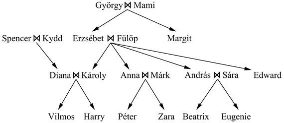
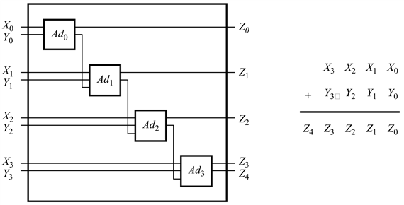

<?xml version="1.0" encoding="UTF-8" standalone="no"?>

<html xmlns="http://www.w3.org/1999/xhtml"><head><meta name="generator" content="DocBook XSL Stylesheets V1.76.1"/></head><body>

<h1 class="title"><a id="id603330"/>Összefoglalás</h1>

Ebben a fejezetben megmutattuk, hogy hogyan használható az <strong>elsőrendű logika</strong> (<strong>first-order logic</strong>) egy tudásalapú ágens reprezentációs nyelveként. A legfontosabb megállapítások a következők:

<ul class="itemizedlist"><li class="listitem">
A tudásreprezentációs nyelveknek deklaratívnak, kompozíciósnak, kifejezőnek, a szövegkörnyezettől függetlennek és egyértelműnek kell lenniük.
</li><li class="listitem">
A logikák különböznek <strong>ontológiai</strong> és <strong>episztemológiai megállapítás</strong>aikban. Amíg az ítéletlogika megállapításai csak tények létezésére vonatkoznak, addig az elsőrendű logika az objektumok és a relációk létezését is felhasználhatja, így nagyobb kifejezőerővel rendelkezik.
</li><li class="listitem">
Egy <strong>lehetséges világ</strong>ot vagy <strong>modell</strong>t az elsőrendű logikában objektumok egy halmaza definiál, a köztük lévő relációk és a rájuk alkalmazható függvények által.
</li><li class="listitem">
A <strong>konstansszimbólum</strong>ok (<strong>constant symbol</strong>s) objektumokat neveznek meg, a <strong>predikátumszimbólum</strong>ok (<strong>predicate symbol</strong>s) relációkat, míg a <strong>függvényszimbólum</strong>ok (<strong>function symbol</strong>s) függvényeket. Egy interpretáció megadja a leképezést a szimbólumok és a modell között. Az <strong>összetett term</strong>ek (<strong>complex term</strong>s) függvényszimbólumokat rendelnek hozzá a termekhez, hogy nevet adjanak egy objektumnak. Ha megadunk egy interpretációt és egy modellt, a mondat igazságtartalmát meghatároztuk.
</li><li class="listitem">
Egy <strong>atomi mondat</strong> (<strong>atomic sentence</strong>) egy vagy több termre alkalmazott predikátumból áll. A mondat csak akkor igaz, ha a predikátum által megnevezett reláció fennáll a termek által megnevezett objektumok között. Az <strong>összetett mondat</strong>ok (<strong>complex sentence</strong>s) – az ítéletlogikához hasonló módon – összekötőjeleket használnak, a <strong>kvantor</strong>ok (<strong>quantifier</strong>s) használata pedig lehetővé teszi általános szabályok megfogalmazását is.
</li><li class="listitem">
Egy tudásbázis építése az elsőrendű logikában a tárgyterület alapos elemzését igényli, valamint egy szótár megválasztását és a kívánt következtetések eléréséhez szükséges axiómák kódolását.
</li></ul>

<h2 class="title"><a id="id603459"/>Irodalmi és történeti megjegyzések</h2>

Habár már Arisztotelész logikája képes volt objektumok feletti általánosítások kezelésére, az igazi elsőrendű logika keletkezését Gottlob Frege <em>Begriffschrift</em> (Fogalmak írása vagy Fogalmi jelölés; Frege, 1879) c. művének megjelenésétől, a kvantorok bevezetésétől számíthatjuk. A Frege-féle képesség a kvantorok egymásba ágyazása jelentős előrelépést jelentett, de az általa alkalmazott jelölésrendszer igen körülményes volt. Az elsőrendű logika jelenlegi jelölésrendszere alapvetően Giuseppe Peanótól származik (Peano, 1889), a szemantika azonban megegyezik a Frege által bemutatottal. Eléggé különös, hogy Peano axiómái nagyrészt Grassmann-nak (Grassmann, 1861) és Dedekindnek (Dedekind, 1888) voltak köszönhetők.

Az elsőrendű logika fejlődésének fontos akadálya volt az egyváltozós predikátumok előtérbe helyezése, illetve a többváltozós predikátumok kizárása. Az egyváltozós predikátumokhoz való ragaszkodás általánosan jellemző volt a logikai rendszerekre Arisztotelésztől Boole-ig. A logikai relációk első rendszerezett leírását Augustus De Morgan adta (De Morgan, 1864). De Morgan a következő példával mutatta be az arisztotelészi logikával nem kezelhető következtetéseket: „Minden ló állat; ezért a ló feje egy állat feje”. Ez a következtetés nem valósítható meg az arisztotelészi rendszerrel, mert bármely, a következtetésben alkalmazható szabálynak először az „<em>x</em> a feje <em>y</em>-nak” két predikátumot tartalmazó mondatot kell elemeznie. A relációk logikáját alaposan tanulmányozta Charles Sanders Peirce (Peirce, 1870), aki Frege-től függetlenül, néhány évvel később szintén kifejlesztette az elsőrendű logikát (Peirce, 1883).

Leopold Löwenheim adta meg a modellelmélet rendszerezett leírását az elsőrendű logika számára (Löwenheim, 1915). Cikke az egyenlőségszimbólumot már a logika szerves részének tekinti. Löwenheim eredményeit Thoralf Skolem fejlesztette tovább (Skolem, 1920). Alfred Tarski a halmazelméletet felhasználva megadta az igazság és a modellelméleti kielégíthetőség explicit definícióját (Tarski, 1935, 1956).

Elsősorban McCarthy érdeme az elsőrendű logika alkalmazása az MI-rendszerek eszközeként (McCarthy, 1958). A logikán alapuló MI-rendszerek fejlődésében jelentős előrelépést jelentett Robinson rezolúciós algoritmusa (Robinson, 1965), ami egy komplett elsőrendű logikai következtetési folyamat. A rezolúciót a 9. fejezetben fogjuk tárgyalni. A logikai megközelítés alapjaival a Stanfordon sok eredményt értek el. Cordell Green kifejlesztett egy elsőrendű logikai következtetési rendszert, a QA3-at (Green, 1969a, 1969b), amely ahhoz vezetett, hogy először kíséreltek meg létrehozni egy logikai robotot a Stanford Research Institute-ban (Fikes és Nilsson, 1971). Az elsőrendű logikát Zohar Manna és Richard Waldinger alkalmazta a programokban való következtetésre (Manna és Waldinger, 1971), majd később Michael Genesereth az áramkörökhöz (Genesereth, 1984). Európában a logikai programozást – az elsőrendű következtetés korlátozott változatát – fejlesztették ki a nyelvészeti elemzésekhez (Colmerauer és társai, 1973) és általános deklaratív rendszerekhez (Kowalski, 1974). A számítógépes logikával Edinburgh-ban sikeresen foglalkoztak, az LCF (Számítási Funkciók Logikája) projekten keresztül (Gordon és társai, 1979). Ezeket a fejlesztéseket a 9. és 10. fejezetben követjük nyomon.

Számos színvonalas, az elsőrendű logika korszerű bevezetését adó írás ismert. Ezek közül Quine műve az egyik legjobban áttekinthető (Quine, 1982). Enderton írása inkább matematikai megközelítést követ (Enderton, 1972). Bell és Machover erősen formális leírást készített az elsőrendű logikáról, és ezzel együtt számos bonyolult, a logika tárgyterületébe tartozó témáról (Bell és Machover, 1977). Manna és Waldinger a számítástechnika oldaláról közelítő, jól olvasható bevezetést készített (Manna és Waldinger, 1985). Gallier az elsőrendű logika rendkívül precíz matematikai bemutatását adta meg, együtt a logika automatikus következtetésre történő alkalmazásának részletes tárgyalásával (Gallier, 1986). A <em>Logical Foundations of Artificial Intelligence </em>(A mesterséges intelligencia logikai alapjai)<em> </em>(Genesereth és Nilsson, 1987) c. könyv a logika alapos bemutatásán kívül az érzeteket és cselekvéseket kezelő logikai ágensek első rendszerezett bevezetését nyújtja.

<h2 class="title"><a id="id603492"/>Feladatok</h2>

<strong>8.1.</strong>

Egy logikai tudásbázis a világot mondatokkal reprezentálja határozott struktúra nélkül. Egy <strong>analóg</strong> (<strong>analog</strong>) reprezentáció viszont strukturált, ahol a leírás struktúrája közvetlenül megfelel a reprezentált dolog struktúrájának. Tekintsük egy ország autótérképét mint az országról ismert tények egy részének analóg reprezentációját. A térkép kétdimenziós felépítése megfelel a terület kétdimenziós felszínének.

<ol class="orderedlist"><li class="listitem">
Adjon öt példát a térképnyelv <em>szimbólumaira</em>.
</li><li class="listitem">
<em>Explicit</em> mondatnak nevezzük az olyan mondatot, amelyet a reprezentáció létrehozója közvetlenül leír. Az <em>implicit</em> mondatok az explicit mondatokból keletkeznek az analóg reprezentáció tulajdonságai szerint. Adjon három példát a térképnyelv <em>implicit</em> és <em>explicit</em> mondataira.
</li><li class="listitem">
Adjon az ország fizikai struktúráját leíró tényekre három olyan példát, amely nem reprezentálható a térképnyelvvel.
</li><li class="listitem">
Adjon két példát olyan tényekre, amelyek egyszerűbben kifejezhetők a térképnyelvvel, mint az elsőrendű logikával.
</li><li class="listitem">
Adjon még két példát analóg reprezentációkra. Melyek az előnyei és a hátrányai ezeknek a nyelveknek?
</li></ol>

<strong>8.2.</strong>

Tekintsünk egy tudásbázist, amely csak két kijelentést tartalmaz: <em>P</em>(<em>a</em>)<em> </em>és <em>P</em>(<em>b</em>)<em>. </em>Ebből a tudásbázisból következik-e az ∀<em>x P</em>(<em>x</em>)? Magyarázza meg válaszát modellek segítségével.

<strong>8.3.</strong>

Érvényes-e a következő mondat: ∃<em>x</em>, <em>y  x</em> = <em>y</em>? Magyarázza meg.

<strong>8.4.</strong>

Írjon le egy olyan logikai mondatot, hogy minden olyan világban, ahol ez a mondat igaz, pontosan csak egy objektum legyen.

<strong>8.5.</strong>

Tekintsünk egy szimbólumszótárat, amely tartalmaz egy <em>c </em>konstansszimbólumot, <em>pk </em>predikátumszimbólumokat minden egyes <em>k</em> értékre és függvényszimbólumokat minden egyes <em>k</em> értékhez, ahol 1 ≤ <em>k</em> ≤ <em>A</em>. A tárgyterület méretét rögzítsük <em>D</em>-ben. Bármely adott interpretációmodell-kombinációban minden egyes predikátum vagy függvény hozzá van rendelve az ugyanazon értékhez tartozó relációhoz vagy függvényhez. Feltételezhetjük, hogy a modellben szereplő függvények lehetővé teszik, hogy néhány bemenetnek ne legyen értéke a függvény számára (vagyis, hogy az érték a láthatatlan objektum). Vezessen le egy formulát a lehetséges interpretációmodell-kombinációk számának megállapítására a <em>D </em>elemet tartalmazó tárgyterületben. Ne riassza meg, ha el kell távolítania a felesleges kombinációkat.

<strong>8.6.</strong>

Reprezentálja a következő mondatokat az elsőrendű logikában úgy, hogy egy következetes szótárt használ (amelyet előzőleg definiálnia kell):

<ol class="orderedlist"><li class="listitem">
Néhány diák felvette a franciát 2001 tavaszi félévében.
</li><li class="listitem">
Minden diák, aki felveszi a franciát, átmegy a vizsgán.
</li><li class="listitem">
Csak egy diák vette fel a görögöt 2001 tavaszi félévében.
</li><li class="listitem">
A görögben elért legmagasabb pontszám mindig magasabb a franciában elért legmagasabbnál.
</li><li class="listitem">
Minden személy okos, aki biztosítást köt.
</li><li class="listitem">
Senki nem köt drága biztosítást.
</li><li class="listitem">
Van egy ügynök, aki csak azokkal köt biztosítást, akiknek még nincs kötvényük.
</li><li class="listitem">
Van egy borbély, aki minden férfit megborotvál a városban, aki nem borotválkozik.
</li><li class="listitem">
Az a személy, aki az Egyesült Királyságban születik, és akinek mindkét szülője brit állampolgár vagy ottani lakos, születésénél fogva brit állampolgár.
</li><li class="listitem">
Az a személy, aki az Egyesült Királyságon kívül születik, és egyik szülője született brit állampolgár, az származása alapján brit állampolgár.
</li><li class="listitem">
A politikusok bármikor bolonddá tehetnek néhány embert, és minden embert bolonddá tehetnek egy kis időre, de nem tehetnek bolonddá mindenkit örökre.
</li></ol>

<strong>8.7.</strong>

Reprezentálja a „Minden német azonos nyelvet beszél” mondatot predikátumkalkulusban. Használja a <em>Beszél</em>(<em>x</em>, <em>l</em>) predikátumot, amely jelentse azt, hogy <em>x</em> az <em>l</em> nyelvet beszéli.

<strong>8.8.</strong>

Milyen axiómára van szükségünk, hogy ezt a tény kikövetkeztessük: <em>Nő</em>(<em>Laura</em>),<em> </em>ha adottak a tények: <em>Férfi</em>(<em>Jim</em>)<em> </em>és <em>Házastársak</em>(<em>Jim</em>,<em> Laura</em>)?

<strong>8.9.</strong>

Írjon egy általános tény- és axiómahalmazt, hogy reprezentálja a következő állítást: „Wellington hallott Napóleon haláláról”; és hogy helyesen megválaszolhassuk a kérdést: „Hallott Napóleon Wellington haláláról?”.

<strong>8.10.</strong>

Írja át a 7.5. alfejezetben bemutatott ítéletlogikai wumpus világ tényeit elsőrendű logikába. Mennyivel tömörebb ez a változat?

<strong>8.11.</strong>

Készítsen axiómákat, amelyek leírják a következő predikátumokat: <em>Unokája</em>, <em>Dédnagyapja</em>, <em>Fivére</em>, <em>Húga</em>, <em>Lánya</em>, <em>Fia</em>, <em>Nagynénje</em>, <em>Nagybátyja</em>, <em>Sógornője</em>, <em>Sógora</em>, <em>Unokatestvére</em>.

Írja le a 8.5. ábrán látható családfa tényeit. Használjon logikai következtető rendszert, és minden leírt mondat legyen a következtető rendszer számára <code class="code">KIJELENT</code>-ve, és <code class="code">KÉRDEZ</code>-ze meg, hogy ki Erzsébet unokája, ki Diana unokabátyja és kik Zara dédszülei.

<strong>8.12.</strong>

Írjon le egy mondatot, amely azt állítja, hogy a + egy kommutatív funkció. Következik ez a mondat Peano axiómáiból? Ha igen, magyarázza meg, hogy miért, ha nem, adjon meg egy modellt, amelyben az axiómák igazak, az Ön mondata pedig hamis.

<strong>8.13.</strong>

Magyarázza meg, mi a hibás az ∈ halmaz tagság predikátum következő javasolt definíciójával:

<code class="code">∀<em>x</em>,<em> s</em>  <em>x</em> ∈ {<em>x</em>∣<em>s</em>}</code>

<code class="code">∀<em>x</em>, <em>s</em>  <em>x</em> ∈ <em>s</em> ⇒ ∀<em>y </em> <em>x</em>  ∈  {<em>y</em>∣<em>s</em>}</code>

<strong>8.14.</strong>

A halmazaxiómákat példaként használva, készítsen axiómákat a listák tárgyterületére, amelyek tartalmazzák a korábban a fejezetben említett összes konstanst, függvényt és predikátumot.

<strong>8.15.</strong>

Magyarázza meg, hogy mi a hiba a következő ajánlott definícióban a szomszédos négyzetekre a wumpus világban:

<code class="code">∀<em>x</em>, <em>s</em>  <em>Szomszédos</em>([<em>x</em>, <em>y</em>], [<em>x</em> + 1, <em>y</em>]) ∧ <em>Szomszédos</em>([<em>x</em>, <em>y</em>], [<em>x</em>, <em>y</em> + 1])</code>

<a id="id603968"/>
<strong>8.5. ábra - Egy tipikus családfa. Az „=” szimbólum a házastársakat köti össze, a nyilak a gyerekekre mutatnak.</strong>

<strong>8.16.</strong>

Írja meg a wumpus helyzetének meghatározásához szükséges axiómákat a <em>Wumpus </em>konstansszimbólum és a <em>Be</em>(<em>Wumpus</em>, <em>Helyzet</em>)<em> </em>bináris predikátum felhasználásával. Ne felejtse el, hogy csak egy wumpus van.

<strong>8.17.</strong>

Bővítse ki a 8.4. alfejezetben leírt szótárt úgy, hogy definiálja az összeadást az <em>n</em>-bites bináris számokra. Ezután kódolja a 8.6. ábrán látható négybites összeadó leírását, és tegye fel azokat a kérdéseket, amelyek szükségesek ahhoz, hogy igazoljuk összeadó-helyességét.

<strong>8.18.</strong>

A fejezetben az áramkör reprezentálása részletesebb a szükségesnél, ha csak az áramkör működése érdekel minket. Egy egyszerűbb formula bármely <em>m </em>bemenetű, <em>n </em>kimenetű kaput vagy áramkört leír, egy <em>m </em>+<em> n </em>argumentumos predikátum használatával, úgy, hogy a predikátum pontosan akkor igaz, amikor a bemenet és a kimenet konzisztens. Például, a NOT-kapukat így írjuk le: <em>NOT</em>(<em>i</em>, <em>o</em>),<em> </em>amelynél a <em>NOT</em>(0, 1)-et és a <em>NOT</em>(1, 0)-át ismerjük. A kapuk összeállítása a kapupredikátumok összekötésével van definiálva, amelyben a közös változók direkt összeköttetéseket jeleznek. Például egy NAND áramkört összeállíthatunk <em>AND</em>-ekből és <em>NOT</em>-okból:

<code class="code">∀<em>i</em>1,<em> i</em>2,<em> oa</em>,<em> o  NAND</em>(<em>i</em>1,<em> i</em>2,<em> o</em>)<em> </em>⇐<em> AND</em>(<em>i</em>1,<em> i</em>2,<em> o</em>)<em> </em>∧ <em>NOT</em>(<em>oa</em>,<em> o</em>)</code>

Ezt a reprezentációt felhasználva definiálja a 8.4. ábrán látható egybites összeadót és a 8.6. ábra négybites összeadóját, és magyarázza meg, milyen lekérdezéseket használna, hogy igazolja a megoldásokat. Milyen fajta lekérdezéseket <em>nem</em> fogad el ez a reprezentáció, amelyeket pedig a 8.4. alfejezetben lévő reprezentáció elfogadott?

<a id="id604154"/>
<strong>8.6. ábra - Egy négybites összeadó</strong>

8.19.

Kérjen útlevéligénylő lapot az Ön saját országába, nevezze meg azokat a szabályokat, amelyek az igénylés jogosultságát meghatározzák, és fordítsa le az elsőrendű logika nyelvére a 8.4. alfejezetben felvázolt lépéseket követve.

</body></html>
