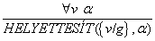
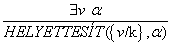

<?xml version="1.0" encoding="UTF-8" standalone="no"?>
<!DOCTYPE html PUBLIC "-//W3C//DTD XHTML 1.1//EN" "http://www.w3.org/TR/xhtml11/DTD/xhtml11.dtd">
<html xmlns="http://www.w3.org/1999/xhtml"><head><meta name="generator" content="DocBook XSL Stylesheets V1.76.1"/></head><body>

<h1 class="title"><a id="id604168"/>9. fejezet - Következtetés elsőrendű logikában</h1>

<em>Ebben a fejezetben definiálunk egy olyan hatékony következtetési mechanizmust, amelyik képes megválaszolni az elsőrendű logikában feltett kérdéseket.</em>

A 7. fejezetben meghatároztuk a <strong>következtetés</strong> (<strong>inference</strong>) fogalmát, és bemutattuk, hogy hogyan érhető el helyes és teljes következtetés az ítéletlogikában. Ebben a fejezetben kiterjesztjük ezeket az eredményeket, hogy olyan algoritmusokat kapjunk, amelyek bármely, az elsőrendű logikában feltehető kérdésre válaszolni tudnak. Ez jelentős eredmény, mivel az elsőrendű logikával többé-kevésbé mindent kifejezhetünk, ha elég alaposan végezzük a feladatot.

A 9.1. alfejezet következtetési szabályokat vezet be a kvantorokra, és megmutatja, hogy hogyan lehet – jóllehet nagy erőfeszítések árán – az elsőrendű logikai következtetést ítéletlogikai következtetésre redukálni. A 9.2. alfejezet leírja az <strong>egyesítés</strong> (<strong>uni</strong><strong>fication</strong>) ötletét, bemutatva, hogy az egyesítés felhasználásával, hogyan alkothatunk következtetési szabályokat, amelyek közvetlenül az elsőrendű logikai mondatokra alkalmazhatók. Ezután a 9.3. alfejezetben megvizsgáljuk az elsőrendű logikai algoritmusok három nagy családját: az <strong>előrefelé láncolás</strong>t (<strong>forward chaining</strong>) és ennek alkalmazását a <strong>deduktív adatbázis</strong>okban (<strong>deductive database</strong>s) és a <strong>produkciós rendszer</strong>ekben (<strong>production system</strong>s). A <strong>hátrafelé láncolás</strong>t (<strong>backward chaining</strong>) és a <strong>logikai programozás</strong>t (<strong>logic programming</strong>) alkalmazó rendszereket a 9.4. alfejezetben tárgyaljuk; míg a rezolúció alapú <strong>tételbizonyító</strong> (<strong>theorem-proving</strong>) rendszereket a 9.5. alfejezet ismerteti. Általánosságban mindig a leghatékonyabb, az adott feladatban reprezentálandó tényeket és axiómákat kezelni képes módszert próbáljuk használni. A teljesen általános, a tetszőleges elsőrendű logikai mondatokon alkalmazható rezolúciós következtetés általában kevésbé hatékony, mint a bizonyos típusú mondatokon alkalmazható előre- vagy hátrafelé láncolást használó megoldások.

<h1 class="title"><a id="id604262"/>Ítéletlogikai következtetés kontra elsőrendű logikai következtetés </h1>

Ez és a következő alfejezet bemutatja azokat a gondolatokat, amelyeken a modern logikai következtetési rendszerek alapulnak. Néhány egyszerű következtetési szabállyal kezdjük, amelyeket kvantorral ellátott mondatokhoz alkalmazhatunk, hogy a segítségükkel kvantorok nélküli mondatokhoz juthassunk. Ezek a szabályok természetes módon elvezetnek minket ahhoz a gondolathoz, hogy az <em>elsőrendű </em>következtetés megvalósítható azáltal, hogy a tudásbázist <em>ítéletlogikává</em> alakítjuk át, és a már általunk ismert <em>ítéletlogikai </em>következtetést használjuk. A következő alfejezet rámutat egy kézenfekvő egyszerűsítésre, amellyel olyan következtetési módszerekhez juthatunk, amelyek közvetlenül képesek az elsőrendű mondatok felhasználására.

<h2 class="title"><a id="id604278"/>Kvantorokra vonatkozó következtetési szabályok </h2>

Kezdjük az univerzális kvantorok vizsgálatával. Tételezzük fel, hogy a tudásbázisunk tartalmazza a standard hagyományos axiómákat, amelyek szerint minden mohó király gonosz:

<code class="code">∀<em>x Király</em>(<em>x</em>) ∧ <em>Mohó</em>(<em>x</em>) ⇒ <em>Gonosz</em>(<em>x</em>)</code>

Ebből lehetségesnek tűnik kikövetkeztetni a következő mondatokat:

<code class="code"><em>Király</em>(<em>János</em>) ∧ <em>Mohó</em>(<em>János</em>) ⇒ <em>Gonosz</em>(<em>János</em>)</code>

<code class="code"><em>Király</em>(<em>Richárd</em>) ∧ <em>Mohó</em>(<em>Richárd</em>) ⇒ <em>Gonosz</em>(<em>Richárd</em>)</code>

<code class="code"><em>Király</em>(<em>Apja</em>(<em>János</em>)) ∧ <em>Mohó</em>(<em>Apja</em>(<em>János</em>)) ⇒ <em>Gonosz</em>(<em>Apja</em>(<em>János</em>))</code>

<code class="code">...</code>

Az <strong>univerzális példányosítás</strong> (<strong>Universal Instantiation</strong>, <strong>UI</strong>) szabálya kimondja, hogy az adott változó bármely <strong>alapterm</strong>mel (<strong>ground term</strong>) (változók nélküli termmel) való helyettesítésével elérhető mondatokat kikövetkeztethetjük.[<a id="id604426" href="#ftn.id604426" class="footnote">87</a>] Ahhoz, hogy formálisan le tudjuk írni a következtetési szabályokat, a 8.3. alfejezetben bevezetett <strong>helyettesítés</strong> (<strong>substitution</strong>) fogalmát használjuk. A <code class="code">HELYETTESÍT</code> (<em>θ</em>, <em>α</em>) fogja jelölni annak az eredményét, hogy egy<em> θ </em>behelyettesítést alkalmazunk az <em>α </em>mondathoz. Ekkor a szabály így írható le:

bármely <em>v </em>változóra és <em>g </em>alaptermre. Például a korábban megadott három mondatot megkaphatjuk a következő helyettesítésekkel {<em>x/János</em>}, {<em>x/Richárd</em>} és {<em>x/Apjα</em>(<em>János</em>)}.

Az ennek megfelelő <strong>egzisztenciális példányosítás</strong>i (<strong>Existential Instantiation</strong>) szabály az egzisztenciális kvantorra egy kicsivel komplikáltabb. Minden <em>α</em> mondatra, <em>v </em>változóra és olyan <em>k </em>konstans szimbólumra, amely sehol máshol nem jelenik meg a tudásbázisban:

Például abból a mondatból, hogy:

<code class="code">∃<em>x Korona</em>(<em>x</em>)<em> </em>∧<em> Fején</em>(<em>x</em>,<em> János</em>)</code>

kikövetkeztethetjük ezt a mondatot:

<code class="code"><em>Korona</em>(<em>C</em>1)<em> </em>∧<em> Fején</em>(<em>C</em>1,<em> János</em>)</code>

feltéve, ha a <em>C</em>1<em> </em>nem jelenik meg sehol máshol a tudásbázisban. Alapjában véve az egzisztenciális mondat azt mondja ki, hogy van valamely objektum, amely eleget tesz egy feltételnek, és a példányosítás folyamata csak névvel látja el ezt az objektumot. Ez a név viszont már nem tartozhat más objektumhoz. Egy szép példát találunk a matematikában: tételezzük fel, hogy tudjuk, létezik olyan szám, amely egy kicsit kisebb, mint 2,71828, és eleget tesz annak az egyenletnek, hogy: <em>d</em>(<em>xy</em>)/<em>dy </em>=<em> xy </em>az <em>x</em>-re. Adhatunk nevet ennek a számnak, mint például <em>e</em>,<em> </em>de hiba lenne olyan nevet adni, amely már egy létező objektumhoz tartozik, mint például a Π. A logikában ezt az új nevet <strong>Skolem-konstans</strong>nak (<strong>Skolem constant</strong>) nevezzük. Az egzisztenciális példányosítás egy speciális esete egy általánosabb folyamatnak, amelyet <strong>skolemizáció</strong>nak (<strong>skolemization</strong>) nevezünk, és amelyet a 9.5. alfejezetben mutatunk be.

Amellett hogy az egzisztenciális példányosítás bonyolultabb, mint az univerzális példányosítás, kissé különböző szerepet is játszik a következtetésben. Míg az univerzális példányosítást többször is alkalmazhatjuk, hogy sok különböző eredményhez jussunk, az egzisztenciális példányosítást csak egyszer végezhetjük el, majd az egzisztenciális kvantorral ellátott mondattól megszabadulhatunk. Például amint hozzáadtuk a tudásbázishoz a <em>Meggyilkol</em>(<em>Gyilkos</em>,<em> Áldozat</em>)<em> </em>mondatot,<em> </em>már nincs szükségünk a ∃<em>x Meggyilkol</em>(<em>x</em>,<em> Áldozat</em>)<em> </em>mondatra<em>. </em>Pontosabban megfogalmazva, az új tudásbázis logikailag nem ekvivalens a régivel, de tekinthetjük úgy, hogy a <strong>következtetés szempontjából ekvivalens</strong> (<strong>inferentially equivalent</strong>), azaz pontosan akkor kielégíthető, amikor az eredeti tudásbázis is kielégíthető.

<h2 class="title"><a id="id604692"/>Redukálás ítéletlogikára</h2>

Ha egyszer vannak szabályaink arra, hogy kvantorral ellátott mondatokból hogyan következtethetünk kvantor nélküli mondatokra, akkor vissza tudjuk vezetni az elsőrendű következtetést az ítéletlogikai következtetésre. Ebben az alfejezetben áttekintjük ennek a módszernek a legfontosabb elemeit; a részletekről a 9.5. alfejezetben<em> </em>fogunk szólni. 

Az első gondolat az, hogy éppen úgy, ahogyan egy egzisztenciális kvantorral ellátott mondatot felcserélhetünk a mondat egy példányával, egy univerzális kvantorral ellátott mondatot is felcserélhetünk a mondat <em>összes lehetséges </em>példányosításainak halmazával. Például tételezzük fel, hogy a tudásbázisunk mindössze a következő mondatokat tartalmazza:

<code class="code">∀<em>x Király</em>(<em>x</em>) ∧ <em>Mohó</em>(<em>x</em>)<em> </em>⇒<em> Gonosz</em>(<em>x</em>)</code>

<code class="code"><em>Király</em>(<em>János</em>)<em>							</em>(9.1)</code>

<code class="code"><em>Mohó</em>(<em>János</em>)</code>

<code class="code"><em>Fivér</em>(<em>Richárd</em>, <em>János</em>)<em> </em></code>

Ekkor alkalmazzuk az univerzális páldányosítást az első mondatra úgy, hogy az összes lehetséges alapterm-helyettesítést felhasználjuk a tudásbázisszótárból, ami ebben az esetben az {<em>x/János</em>} és az {<em>x/Richárd</em>}. Így ezt kapjuk:

<code class="code"><em>Király</em>(<em>János</em>)<em> </em>∧<em> Mohó</em>(<em>János</em>)<em> </em>⇒<em> Gonosz</em>(<em>János</em>)</code>

<code class="code"><em>Király</em>(<em>Richárd</em>)<em> </em>∧<em> Mohó</em>(<em>Richárd</em>)<em> </em>⇒<em> Gonosz</em>(<em>Richárd</em>)</code>

és megválhatunk az univerzális kvantorral ellátott mondattól. Mármost, a tudásbázist alapvetően ítéletkalkulus-belinek tekinthetjük, ha az alap atomi mondatokat, mint a <em>Király</em>(<em>János</em>),<em> Mohó</em>(<em>János</em>)<em> </em>stb., ítéletlogikai szimbólumoknak tekintjük. Így tehát a 7. fejezetben bemutatott bármely teljes ítéletlogikai algoritmust alkalmazhatjuk, hogy olyan következtetéshez juthassunk, mint a <em>Gonosz</em>(<em>János</em>)<em>.</em>

Ez a technika az <strong>ítéletlogikai állításokra való visszavezetés</strong> (<strong>propositionalization</strong>), amelyet teljesen általánossá tehetünk, mint azt a 9.5. alfejezetben be is fogjuk mutatni. Ez azt jelenti, hogy minden elsőrendű tudásbázis és lekérdezés átalakítható ítéletlogikai mondatokra úgy, hogy a tudásbázis vonzatai nem változnak. Így tehát van egy teljes következtetési folyamatunk vonzatok levezetésére. Vagy talán mégsem? Van egy probléma: amikor a tudásbázis tartalmaz függvényszimbólumot, a lehetséges alaptermek helyettesítéseinek halmaza végtelen! Például ha a tudásbázis megemlíti az <em>Apja </em>szimbólumot, akkor végtelen számú egymásba ágyazott termeket hozhatunk létre, mint például az <em>Apja</em>(<em>Apja</em>(<em>Apja</em>(<em>János</em>))).<em> </em>Az ítéletlogikai algoritmusainknak tehát nehézségeik lesznek a végtelen nagyságú mondathalmazokkal.

Szerencsére ismert egy Jacques Herbrandnak köszönhető híres tétel az előbbi problémára (Herbrand, 1930), ami azt mondja ki, hogy ha egy mondat következik az eredeti, elsőrendű tudásbázisból, akkor létezik olyan bizonyítás, amely csak egy véges méretű részhalmazt használ fel az ítéletkalkulus-belire átalakított tudásbázisból. Mivel bármely ilyen részhalmazban az alaptermeknek van egy maximális beágyazási mélysége, meg lehet találni a részhalmazt úgy, hogy először generáljuk az összes példányt a konstans szimbólumokhoz (<em>Richárd </em>és <em>János</em>), azután az összes 1-es mélységű termet (<em>Apja</em>(<em>Richárd</em>)<em> </em>és <em>Apja</em>(<em>János</em>)),<em> </em>majd az összes 2-es mélységű termet, és így tovább mindaddig, amíg képesek leszünk megalkotni a vonzatmondat ítéletlogikai bizonyítását. 

<h3 class="title">Fontos</h3>
Felvázoltuk az elsőrendű következtetés egy megközelítését  az ítéletlogikai állításokra való visszavezetés révén, amely <strong>teljes</strong> (<strong>complete</strong>) – tehát bármely következményként kapott mondatot bizonyítani tudunk. Ez jelentős eredmény, ha figyelembe vesszük, hogy a lehetséges modellek száma végtelen. Másrészt viszont nem tudhatjuk, hogy a mondat <em>vonzat-e,</em> amíg a bizonyítás nincs kész<em>. </em>Mi történik, ha <em>α mondat nem vonzata a TB-nek?</em> Meg tudjuk-e ezt állapítani? Nos, ahogy ez majd kiderül, az elsőrendű logika esetében erre a kérdésre a válasz nemleges. A bizonyítási eljárás tovább folytatódik, egyre mélyebben beágyazott termeket generálva, és nem tudhatjuk, hogy a folyamat egy végtelen ciklusba kerül, vagy hamarosan megleljük a bizonyítást. Ez nagyon hasonló a Turing gépek leállási problémájához. Alan Turing és Alonzo Church egymástól függetlenül és eltérő módon bizonyították be ennek a kérdésnek az eldönthetetlenségére vonatkozó tételt (Turing, 1936; Church, 1936). <em>Az elsőrendű logikában a maga után vonzás kérdése <strong>félig eldönthető</strong> </em>(<em><strong>semidecidable</strong></em>)<em>, ami azt jelenti, hogy létezik olyan algoritmus, amely igent mond minden vonzatmondatra, de nem létezik olyan algoritmus, amely emellett képes nemet mondani a nem levezethető mondatokra.</em> 

 

[<a id="ftn.id604426" href="#id604426" class="para">87</a>]  Ne keverjük össze ezeket a helyettesítéseket a kiterjesztett interpretációkkal, amelyeket a kvantorok szemantikájának a meghatározására használtunk. A helyettesítés egy változót cserél le egy termre (egy szintaktikai elemre), hogy új mondatot hozzon létre, ezzel szemben egy interpretáció hozzárendel egy változót egy objektumhoz a tárgyterületben.

</body></html>
