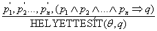
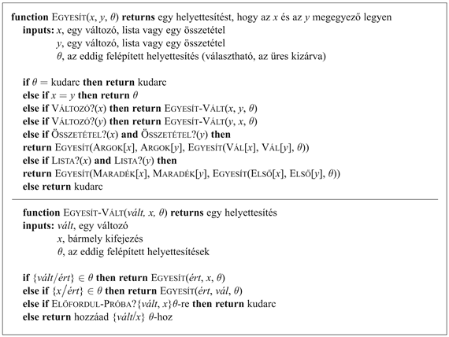
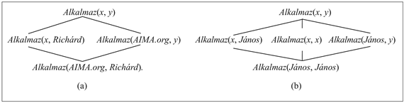

<?xml version="1.0" encoding="UTF-8" standalone="no"?>

<html xmlns="http://www.w3.org/1999/xhtml"><head><meta name="generator" content="DocBook XSL Stylesheets V1.76.1"/></head><body>

<h1 class="title"><a id="id604985"/>Egyesítés és kiemelés</h1>

Az előző alfejezet bemutatta az elsőrendű következtetésnek azt az értelmezését, amely az 1960-as évekig létezett. Az éles szemű olvasók (és bizonyára a hatvanas évek elejének logikával foglalkozó kutatói) észrevehették, hogy az ítéletlogikai megközelítés nem nagyon hatékony. Például ha megnézzük a <em>Gonosz</em>(<em>x</em>)<em> </em>lekérdezést<em> </em>és az ehhez tartozó tudásbázist a (9.1) egyenletben, feleslegesnek tűnik olyan mondatok generálása, mint a <em>Király</em>(<em>Richárd</em>) ∧ <em>Mohó</em>(<em>Richárd</em>) ⇒ <em>Gonosz</em>(<em>Richárd</em>)<em>. </em>Valójában a <em>Gonosz</em>(<em>János</em>)<em> </em>mondatra vonatkozó következtetés bárki számára teljesen nyilvánvaló a következő mondatok alapján: <em> </em>

<code class="code">∀<em>x Király</em>(<em>x</em>) ∧ <em>Mohó</em>(<em>x</em>) ⇒ <em>Gonosz</em>(<em>x</em>)</code>

<code class="code"><em>Király</em>(<em>János</em>)</code>

<code class="code"><em>Mohó</em>(<em>János</em>)</code>

Most megmutatjuk, hogyan tehetjük ezt a számítógép számára is egyértelművé.

<h2 class="title"><a id="id605091"/>Egy elsőrendű következtetési szabály</h2>

Az a következtetés, hogy János gonosz a következőképpen megy végbe: találjon egy <em>x</em>-et, amelyre igaz, hogy <em>x</em> egy király és <em>x </em>mohó, majd következtesse ki, hogy <em>x </em>gonosz. Általánosabban, ha van valamely <em>θ </em>helyettesítés, amely az implikáció premisszáját megegyezővé teszi a tudásbázisban már létező mondatokkal, akkor a <em>θ </em>helyettesítés elvégzése után az implikációkövetkezmény részét hozzáadhatjuk a tudásbázishoz. Ebben az esetben az {<em>x</em>/<em>János</em>} helyettesítés eléri ezt a célt.

Tulajdonképpen több feladatot is elvégeztethetünk a következtetés ezen lépésével. Tételezzük fel, hogy a <em>Mohó</em>(<em>János</em>)<em> </em>mondat ismerete<em> </em>helyett csak azt tudjuk, hogy <em>mindenki </em>mohó:

<code class="code">∀<em>y Mohó</em>(<em>y</em>)<em>							</em>(9.2)</code>

Ebben az esetben is szeretnénk azt a következtetést levonni, hogy <em>Gonosz</em>(<em>János</em>)<em>, </em>mivel tudjuk, hogy János egy király (ez adott), és hogy János mohó (mert mindenki mohó). Egy megfelelő helyettesítés megtalálására van szükségünk ennek elvégzéséhez, mind az implikációs mondatban, mind az ehhez illesztendő mondatokban található változókra. Ebben az esetben az {<em>x</em>/<em>János</em>,<em> y</em>/<em>János</em>} helyettesítés alkalmazása az implikáció <em>Király</em>(<em>x</em>)<em> </em>és <em>Mohó</em>(<em>x</em>) premisszáihoz és a <em>Király</em>(<em>János</em>)<em> </em>és <em>Mohó</em>(<em>y</em>)<em> </em>tudásbázis mondatokhoz létrehozza az azonosságot. Így tehát ki tudjuk következtetni az implikáció konklúzióját.

Ez a következtetés elvégezhető egyetlen következtetési szabály alkalmazásával, amelyet <strong>általánosított Modus Ponens</strong>nek (<strong>Generalized Modus Ponens</strong>) nevezünk: a <em>pi</em>, <em>p</em>′i és <em>q</em> atomi mondatokra, amelyekre létezik olyan <em>θ</em> helyettesítés, hogy <code class="code">HELYETTESÍT</code> (<em>θ</em>, <em>p</em>′i) = <code class="code">HELYETTESÍT</code> (<em>θ</em>, <em>pi</em>) minden <em>i</em>-re, akkor:

A szabály <em>n </em>+<em> </em>1 premisszát tartalmaz: <em>n</em> számú <em>p</em>′i  atomi mondatot és egy implikációt. A konklúzió a <em>q</em> konzekvenciára történő helyettesítés alkalmazásának az eredménye. A mi példánkra ezt így alkalmazhatjuk:

<code class="code"><em>p′</em>1 – <em>Király</em>(<em>János</em>)<em>		p</em>1<em> – Király</em>(<em>x</em>)</code>

<code class="code"><em>p′</em>2 – <em>Mohó</em>(<em>y</em>)<em>		</em>	<em>p</em>2<em> – Mohó </em>(<em>x</em>)</code>

<code class="code"><em>θ</em> – {<em>x</em>/<em>János</em>,<em> y</em>/<em>János</em>}		<em>q – Gonosz</em>(<em>x</em>)</code>

<code class="code">Helyettesít(<em>θ</em>, <em>q</em>)<em> </em>– <em>Gonosz</em>(<em>János</em>)</code>

Könnyű megmutatni, hogy az általánosított Modus Ponens helyes következtetési szabály. Először is, megfigyelhetjük, hogy bármely <em>p </em>mondatra (amelyeknek változóiról feltételezzük, hogy univerzális kvantorokkal vannak ellátva) és bármely <em>θ </em>helyettesítésre:

<code class="code"><em>p </em>⊭  Helyettesít(<em>θ</em>,<em> p</em>)</code>

Ez hasonlóan igazolható, mint az univerzális példányosítás szabály, és alkalmazható olyan <em>θ-</em>ra, amely kielégíti az általánosított Modus Ponens szabály feltételeit. Így tehát, a <em>p</em>1′,…, <em>pn</em>′<em> </em>-ből következtethetjük, hogy:

<code class="code">Helyettesít(<em>θ</em>,<em> p′</em>1)<em> </em>∧ <em>…</em> ∧ Helyettesít(<em>θ</em>,<em> p′n</em>)</code>

és a <em>p</em>1<em> </em>∧<em> … </em>∧ <em>pn</em> ⇒ <em>q </em>implikációból ezt következtethetjük, hogy:

<code class="code">Helyettesít(<em>θ</em>,<em> p</em>1) ∧ … ∧ Helyettesít(<em>θ</em>,<em> pn</em>) ⇒ Helyettesít(<em>θ</em>,<em> q</em>)</code>

Mivel a <em>θ </em>az általánosított Modus Ponensben úgy van definiálva, hogy: <code class="code">HELYETTESÍT</code> (<em>θ</em>,<em> pi</em>′)<em> </em>= <code class="code">HELYETTESÍT</code> (<em>θ</em>,<em> pi</em>) minden <em>i</em>-re; ebből kifolyólag a két mondatból az első pontosan illeszkedik a másodiknak a premisszájához. Így tehát a <code class="code">HELYETTESÍT</code> (<em>θ</em>,<em> q</em>)<em> </em>következik a Modus Ponensből.

Az általánosított Modus Ponens egy <strong>kiemelt</strong> (<strong>lifted</strong>) változata a Modus Ponensnek – átemeli a Modus Ponenst az ítéletlogikából az elsőrendű logikába. Látni fogjuk a fejezet későbbi részében, hogy kifejleszthetjük az előrefelé láncolás, a hátrafelé láncolás és a 7. fejezetben bemutatott rezolúciós algoritmusok kiemelt változatait is. A kiemelt következtetési szabályok legfontosabb előnye az ítéletlogikára történő átalakítással szemben az, hogy csak azokat a helyettesítéseket hajtják végre, amelyek bizonyos következtetések végrehajtását teszik lehetővé. Egy potenciális korlát az, hogy egy bizonyos szempontból az Általánosított Modus Ponens kevésbé általános, mint a Modus Ponens (lásd <a class="xref" href="ch07s04.md#ID_265_oldal">„Az ítéletkalkulus következtetési mintái”</a> részben): a Modus Ponens bármely <em>α </em> mondatot megenged az implikáció bal oldalán, ezzel szemben az Általánosított Modus Ponens speciális formátumot kíván meg erre a mondatra. Csak abban az értelemben nevezhető általánosítottnak, hogy tetszőleges számú <em>pi</em>′-re alkalmazható.

<h2 class="title"><a id="id606848"/>Egyesítés</h2>

A kiemelt következtetési szabályok olyan helyettesítések megtalálását igénylik, amelyek a különböző logikai kifejezéseket látszólag azonossá teszik. Ezt a folyamatot <strong>egyesítési lépés</strong>nek (<strong>unification</strong>) nevezzük, ami kulcsfontosságú eleme minden elsőrendű következtetési algoritmusnak. Az <code class="code">EGYESÍT</code> algoritmus vesz két mondatot, és visszaad egy rájuk vonatkozó <strong>egyesítés</strong>t (<strong>unifier</strong>), ha létezik ilyen: 

<code class="code">Egyesít(<em>p</em>, <em>q</em>) = <em>θ,</em> ahol Helyettesít(<em>θ</em>, <em>p</em>) = Helyettesít(<em>θ</em>, <em>q</em>)</code>

Nézzünk meg néhány példát arra, hogy az <code class="code">EGYESÍT</code>-nek hogyan kell viselkednie. Tételezzük fel, hogy van egy <em>Ismer</em>(<em>János</em>,<em> x</em>)<em> </em>lekérdezésünk:<em> </em>kit ismer János? Erre a kérdésre néhány választ úgy találhatunk, hogy megkeressük az összes mondatot a tudásbázisban, amely egyesíthető az <em>Ismer</em>(<em>János</em>,<em> x</em>)-szel. Itt vannak az egyesítési eredmények négy különböző, a tudásbázisban előforduló mondatra.

<code class="code">Egyesít(<em>Ismer</em>(<em>János</em>, <em>x</em>), <em>Ismer</em>(<em>János</em>, <em>Júlia</em>)) = {<em>x</em>/<em>Júlia</em>}</code>

<code class="code">Egyesít(<em>Ismer</em>(<em>János</em>, <em>x</em>), <em>Ismer</em>(<em>y</em>, <em>Lajos</em>)) = {<em>x</em>/<em>Lajos</em>, <em>y/János</em>}</code>

<code class="code">Egyesít(<em>Ismer</em>(<em>János</em>, <em>x</em>), <em>Ismer</em>(<em>y</em>, <em>Anyja</em>(<em>y</em>))) = {<em>y</em>/<em>János</em>, <em>x</em>/<em>Anyja</em>(<em>János</em>)}</code>

<code class="code">Egyesít(<em>Ismer</em>(<em>János</em>, <em>x</em>), <em>Ismer</em>(<em>x</em>, <em>Erzsébet</em>)) = <em>sikertelen</em></code>

Az utolsó egyesítés sikertelen, mert az <em>x </em>nem tudja a <em>János </em>és az <em>Erzsébet </em>értékeit egyszerre felvenni. Emlékezzünk arra, hogy az <em>Ismer</em>(<em>x</em>, <em>Erzsébet</em>) azt jelenti, hogy: „Mindenki ismeri Erzsébetet”, így képesnek <em>kellene </em>lennünk azt kikövetkeztetni, hogy János ismeri Erzsébetet. A probléma abból származik, hogy a két mondat történetesen ugyanazt a változónevet, az <em>x</em>-et használja. A problémát úgy kerülhetjük el, hogy az egyesítendő mondatokban <strong>átnevezzük a változókat</strong> (<strong>standardizing apart</strong>) úgy, hogy elkerüljük a nevek egybeeséseit. Például átnevezhetjük az <em>x</em>-et az <em>Ismer</em>(<em>x</em>, <em>Erzsébet</em>)-ben például <em>z</em>17-re (egy tetszőleges új változónévre) anélkül, hogy a jelentését megváltoztatnánk. Most már működik az egyesítésünk:

<code class="code">Egyesít(<em>Ismer</em>(<em>János</em>,<em> x</em>),<em> Ismer</em>(<em>z</em>17,<em> Erzsébet</em>))<em> </em>=<em> </em>{<em>x</em>/<em>Erzsébet</em>,<em> z</em>17/<em>János</em>}</code>

A 9.7. feladat tovább vizsgálja az átnevezés szükségességének problémáját.

<a id="id607199"/>
<strong>9.1. ábra - Az egyesítési algoritmus. Az algoritmus összehasonlítja a bemenetek felépítését elemről elemre. A <em>θ</em> helyettesítés, amely az <code class="code">EGYESÍTÉS</code> argumentuma, útközben épül fel, és arra használjuk, hogy meggyőződjünk arról, hogy a későbbi összehasonlítások konzisztensek lesznek az általunk előzőleg létrehozott lekötésekkel. Egy összetett kifejezésben, mint például az <em>F</em>(<em>A</em>,<em> B</em>), a <code class="code">VÁL</code> függvény kiveszi az <em>F</em> függvényszimbólumot, és az <code class="code">ARGOK</code> függvény kiveszi az (<em>A</em>,<em> B</em>) argumentumlistát.</strong>

Még egy további nehézségen kell túljutni. Azt mondtuk, hogy az <code class="code">EGYESÍT</code> olyan helyettesítéseket ad vissza, amelyek a két argumentumot látszólag azonossá teszi. Azonban több különböző ilyen egyesítés létezhet. Például az <code class="code">EGYESÍT</code> (<em>Ismer</em>(<em>János</em>,<em> x</em>), <em>Ismer</em>(<em>y</em>,<em> z</em>))<em> </em>visszaadhatja azt is, hogy: {<em>y</em>/<em>János, x</em>/<em>z</em>}, vagy azt is, hogy: {<em>y</em>/<em>János</em>,<em> x</em>/<em>János</em>,<em> z</em>/<em>János</em>}. Az első egyesítési lépés azt eredményezi, hogy: <em>Ismer</em>(<em>János</em>,<em> z</em>), ezzel szemben a második azt adja, hogy: <em>Ismer</em>(<em>János</em>,<em> János</em>)<em>. </em>A második eredményt megkaphatjuk az elsőből is egy további helyettesítés hozzáadásával: {<em>z</em>/<em>János</em>}. Láthatjuk, hogy az első egyesítés <em>általánosabb,</em> mint a második, mert kevesebb korlátozást ad meg a változók értékeire. Azt állapíthatjuk meg, hogy minden egyesítendő kifejezéspárra létezik egy <strong>legáltalánosabb egyesítés</strong> (<strong>most general unifier</strong>), amely egyedi a változók átnevezésében. Ebben az esetben ez: {<em>y</em>/<em>János</em>, <em>x</em>/<em>z</em>}.

A legáltalánosabb egyesítések kiszámításához a 9.1. ábrán láthatunk egy algoritmust. Az eljárás igen egyszerű: egy rekurzív algoritmussal egymással párhuzamosan tárjuk fel a két kifejezést, felépítve az egyesítést, kivéve akkor, ha a struktúrákban a két megfelelő elem nem illeszkedik. Van egy drága lépés: amikor egy változót kell egy komplex termhez illesztünk, meg kell vizsgálni, hogy a változó előfordul-e a termben; ha igen, akkor az illesztés sikertelen, mert nem tudunk konzisztens egyesítést megalkotni. Ez a lépés az úgynevezett <strong>előfordulási próba</strong> (<strong>occur check</strong>), amely az algoritmus komplexitását az egyesítendő kifejezés méretével négyzetesen növekvővé teszi. Néhány rendszer, beleértve az összes logikai programozási rendszert, egyszerűen kihagyja az előfordulási próbát, és ennek eredményeként a következtetésük nem helyes. Más rendszerek időben lineáris komplexitású, ennél összetettebb algoritmusokat használnak.

<h2 class="title"><a id="id607385"/>Tárolás és visszakeresés</h2>

A <code class="code">KIJELENT</code> és a <code class="code">KÉRDEZ</code> függvények, amelyek szerepe, hogy informálják és lekérdezzék a tudásbázist, két egyszerűbb függvényt, a <code class="code">TÁROL</code> és a <code class="code">BETÖLT</code> függvényeket használják fel. A <code class="code">TÁROL</code> (<em>s</em>) eltárol egy <em>s </em>mondatot a tudásbázisban, míg a <code class="code">BETÖLT</code> (<em>q</em>) visszaadja az összes egyesítést, amelyet a <em>q </em>lekérdezés felhasználásával lehet létesíteni a tudásbázis illeszthető mondataival. A probléma, amivel illusztráltuk az egyesítést – az összes olyan tény megtalálása, amely egyesíthető az <em>Ismer</em>(<em>János</em>,<em> x</em>)-szel – a <code class="code">BETÖLT</code> egyik példája.

A <code class="code">TÁROL</code> és a <code class="code">BETÖLT</code> megvalósításának legegyszerűbb módja, hogy a tudásbázisban az összes tényt egyetlen hosszú listán tároljuk, és egy <em>q</em> lekérdezés megválaszolásakor meghívjuk az <code class="code">EGYESÍT</code> (<em>q</em>,<em> s</em>)-t minden <em>s</em> mondatra a listán. Ez az eljárás nem hatékony, de működik, és egyelőre elég a fejezet további részének megértéséhez. Az alfejezet hátralévő része áttekinti azokat az eljárásokat, amelyekkel a visszakeresést hatékonyabbá tehetjük, így ezt első olvasásra átugorhatjuk.

A <code class="code">BETÖLT</code> függvényt azzal tehetjük hatékonyabbá, hogy biztosítjuk, hogy az egyesítési lépést csak olyan mondatokkal kíséreljük meg, amelyeknél van egyáltalán<em> </em>esély az egyesítésre. Például nincs értelme, hogy megpróbáljuk az egyesítést az <em>Ismer</em>(<em>János</em>,<em> x</em>)-re és a <em>Fivér</em>(<em>Richárd</em>,<em> János</em>)-re. Elkerülhetjük az ilyen egyesítési lépéseket, ha <strong>indexel</strong>jük (<strong>indexing</strong>) a tényeket a tudásbázisban. Egy egyszerű séma, amit <strong>predikátum i</strong><strong>ndexelés</strong>nek (<strong>predicate indexing</strong>) nevezünk, beteszi az összes <em>Ismer </em>tényt egy verembe és az összes <em>Fivér </em>tényt egy másikba. A vermek egy hash-táblában[<a id="id607532" href="#ftn.id607532" class="footnote">88</a>] tárolhatók, hogy hatékonyan elérhessük őket.

A predikátumok indexelése hasznos, ha sok predikátumszimbólum van, de csak kevés állítás az egyes szimbólumokhoz. Néhány alkalmazásban azonban sok mondat tartozik egy adott predikátumszimbólumhoz. Például tételezzük fel, hogy az adóhatóságok nyomon akarják követni, hogy ki alkalmaz kit, és ezeket a kapcsolatokat egy <em>Alkalmaz</em>(<em>x</em>,<em> y</em>)<em> </em>predikátum használatával írjuk le. Ez egy igen nagy verem lenne, akár munkaadók millióival és alkalmazottak tízmillióival. Egy olyan kérdés megválaszolása, mint az <em>Alkalmaz</em>(<em>x</em>,<em> Richárd</em>),<em> </em>a predikátumok indexelésével az egész verem átböngészését igényelné.

Egy ilyen lekérdezés esetében segítene, ha a tényeket mind a predikátummal, mind a második argumentummal indexelnénk, például úgy, hogy egy kombinált hash-tábla kulcsot használunk. A kulcsot egyszerűen előállíthatjuk a lekérdezésből, és pontosan visszakereshetjük közvetlenül azokat a tényeket, amelyek egyesíthetők a lekérdezéssel. Más lekérdezésekhez, mint amilyen az <em>Alkalmaz</em>(<em>AIMA.org</em>,<em> y</em>),<em> </em>szükségünk van arra, hogy a tényeket a predikátum és az első argumentum kombinálásával indexeljük. Így aztán a tényeket tárolhatjuk többszörös indexkulcsok alatt, azonnal hozzáférhetővé téve minden, a ténnyel egyesíthető lekérdezés számára.

Ha adott egy tárolandó mondat, akkor létre lehet hozni az indexeket az <em>összes lehetséges </em>vele egyesíthető lekérdezéshez. Arra a tényre, hogy <em>Alkalmaz</em>(<em>AIMA.org</em>,<em> Richárd</em>), ezek a lekérdezések:

<code class="code"><em>Alkalmaz</em>(<em>AIMA.org</em>,<em> Richárd</em>)<em>	</em>Az AIMA.org alkalmazza Richárdot?</code>

<code class="code"><em>Alkalmaz</em>(<em>x</em>,<em> Richárd</em>)<em>		</em>Ki alkalmazza Richárdot?</code>

<code class="code"><em>Alkalmaz</em>(<em>AIMA.org</em>,<em> y</em>)<em>		</em>Kit alkalmaz az AIMA.org?</code>

<code class="code"><em>Alkalmaz</em>(<em>x</em>, <em>y</em>)<em>			</em>Ki alkalmaz kit?</code>

Ezek a lekérdezések egy <strong>bennfoglalási háló</strong>t (<strong>subsumption lattice</strong>) alkotnak, amint az a 9.2. (a) ábrán látható. A hálónak van néhány érdekes tulajdonsága. Például a háló bármely csomópontjának a gyereke a szülőjéből egy egyszerű behelyettesítéssel megkapható, és a „legmagasabb” közös leszármazottja bármely két csomópontnak a legáltalánosabb egyesítőjük használatával érhető el. A háló részeiből bármely alaptény szisztematikusan létrehozható (9.5. feladat). Egy ismétlődő konstansokkal rendelkező mondatnak egy kissé más hálója van, ezt a 9.2. (b) ábrán láthatjuk. A függvényszimbólumok és a változók az eltárolandó mondatokban még érdekesebb hálófelépítéseket tesznek szükségessé.

<a id="id607685"/>
<strong>9.2. ábra - (a) A bennfoglalási háló, amelynek a legalacsonyabb csomópontja ez a mondat: <em>Alkalmaz(AIMA.org</em>,<em> Richárd)</em>. (b) A bennfoglalási háló arra a mondatra, hogy: <em>Alkalmaz(János</em>,<em> János)</em>.</strong>

A séma, amelyet leírtunk, nagyon jól működik, amikor a háló csak kisszámú csomópontot tartalmaz. Egy <em>n </em>argumentumú predikátumra a háló <em>O</em>(2n)<em> </em>csomópontot tartalmaz. Ha a függvényszimbólumok használata megengedett, akkor a csomópontok száma szintén exponenciális a tárolandó mondat termjeinek függvényében. Ez rendkívül nagy számú indexet eredményezhet. Egy ponton az indexelés elveszti előnyeit az összes index tárolásának és fenntartásának problémája miatt. Ez ellen egy rögzített stratégia bevezetésével próbálhatunk védekezni úgy, hogy csak azokon a kulcsokon tartunk fenn indexeket, amelyek predikátumokból és az egyes argumentumokból állnak. Egy másik megoldás, hogy egy adaptív tervet használunk, amely mindig olyan indexeket hoz létre, amelyek megfelelnek az aktuális lekérdezéstípus igényeinek. A legtöbb MI-rendszerben a tárolni kívánt tények száma elég kicsi ahhoz, hogy a hatékony indexelés problémáját megoldottnak tekintsük. Az ipari és kereskedelmi adatbázisok esetében jelentős technikai fejlesztések történtek a feladat megoldására.

 

[<a id="ftn.id607532" href="#id607532" class="para">88</a>]  A hash-tábla információk tárolására és visszakeresésére szolgáló olyan adatstruktúra, amelyeket rögzített <em>kulcsokkal</em> indexelünk. Gyakorlati okokból egy hash-táblát tekinthetünk olyannak, mint amelynek a tárolási és a visszakérdezési ideje állandó, akkor is, ha a tábla nagyon nagy számú elemet tartalmaz.

</body></html>
