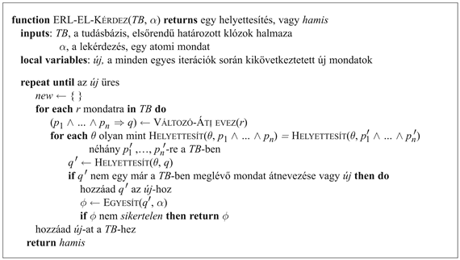
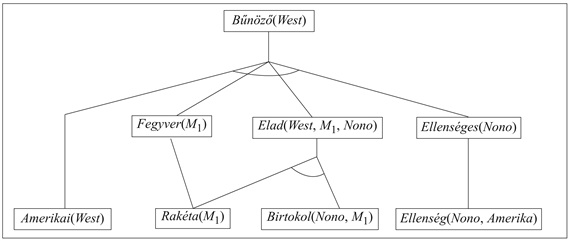
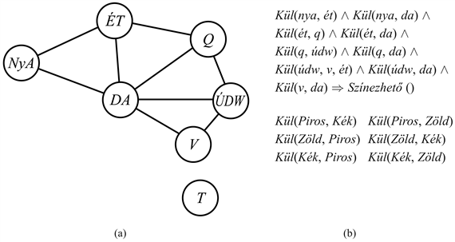

<?xml version="1.0" encoding="UTF-8" standalone="no"?>

<html xmlns="http://www.w3.org/1999/xhtml"><head><meta name="generator" content="DocBook XSL Stylesheets V1.76.1"/></head><body>

<h1 class="title"><a id="id607726"/>Előrefelé láncolás</h1>

Az ítéletlogikai határozott klózokra már megadtunk egy előrefelé láncolási algoritmust a 7.5. alfejezetben. A gondolat egyszerű: kezdjük a tudásbázisban szereplő atomi mondatokkal, és alkalmazzuk a Modus Ponenst előrefelé haladva, új atomi mondatokat hozzáadva, egészen addig, amíg további következtetések már nem végezhetők. Most megmutatjuk, hogyan alkalmazzuk az algoritmust az elsőrendű határozott klózokra, és hogyan valósíthatjuk ezt meg hatékonyan. A határozott klózok, mint például a  <em>Helyzet</em> ⇒ <em>Válasz </em>különösen hasznosak az olyan rendszerek számára, amelyek újonnan érkezett információk alapján végeznek következtetéseket válaszként. Számos rendszert tervezhetünk ilyen módon, és ezekben az esetekben az előrefelé láncolással történő következtetés sokkal hatékonyabb lehet, mint a rezolúciós tételbizonyítás. Ebből az következik, hogy gyakran érdemes megpróbálni olyan tudásbázist építeni, amely csak határozott klózokat használ, és így elkerülhetjük a rezolúcióval járó nehézségeket.

<h2 class="title"><a id="id607739"/>Elsőrendű határozott klózok</h2>

Az elsőrendű határozott klózok nagyon emlékeztetnek az ítéletlogikai határozott klózokra (<a class="xref" href="ch07s04.md#ID_272_oldal">„A rezolúció teljessége”</a>részben). Az ilyen klózok olyan literálok diszjunkciói, amelyek közül <em>pontosan egy diszjunkt pozitív. </em>Egy határozott klóz vagy egy atomi mondat, vagy egy implikáció, amelynek a feltétel része pozitív literálok konjunkciója, és amelynek következménye egyetlen pozitív literál. A következő mondatok elsőrendű határozott klózok:

<code class="code"><em>Király</em>(<em>x</em>)<em> </em>∧<em> Mohó</em>(<em>x</em>) ⇒ <em>Gonosz</em>(<em>x</em>)</code>

<code class="code"><em>Király</em>(<em>János</em>)</code>

<code class="code"><em>Mohó</em>(<em>y</em>)</code>

Eltérően az ítéletlogikai literáloktól, az elsőrendű literálok tartalmazhatnak változókat, amely esetben a változókat univerzális kvantorral ellátottnak tételezzük fel. (A határozott klózok írásánál általában elhagyjuk az univerzális kvantorokat.) A határozott klóz egy megfelelő normál forma, hogy az általánosított Modus Ponensszel alkalmazhassuk. Nem minden tudásbázist lehet átalakítani határozott klózok halmazává, az egyetlen pozitív literális korlátja miatt, de sokat igen. Gondoljuk át a következő problémát:

<strong>A törvény kimondja, hogy bűntény az, ha egy amerikai polgár fegyvert ad el egy Amerikával ellenséges nemzetnek. A Nono ország, amely ellensége Amerikának, fel van szerelve rakétákkal, és ezeket a rakétákat mind West ezredes adta el, aki amerikai.</strong>

Be fogjuk bizonyítani, hogy West bűnöző. Először leírjuk a tényeinket elsőrendű határozott klózokként. A következő alfejezet fogja bemutatni, hogy az előrefelé láncolás algoritmus hogyan oldja meg a problémát.

 „…bűntény az, ha egy amerikai polgár fegyvert ad el egy Amerikával ellenséges nemzetnek”:

<code class="code"><em>Amerikai</em>(<em>x</em>) ∧ <em>Fegyver</em>(<em>y</em>) ∧ <em>Ellenséges</em>(<em>z</em>) ∧ <em>Elad</em>(<em>x</em>, <em>z</em>, <em>y</em>) ⇒ <em>Bűnöző</em>(<em>x</em>)	(9.3)</code>

„Nono… fel van szerelve rakétákkal.” Azt a mondatot, hogy ∃<em>x Birtokol</em>(<em>Nono</em>,<em> x</em>)<em> </em>∧<em> Rakéta</em>(<em>x</em>)<em> </em>átalakítjuk két határozott klózzá Egzisztenciális Eliminációval, egy új konstans, az <em>M</em>1<em> </em>bevezetésével:

<code class="code"><em>Birtokol</em>(<em>Nono</em>, <em>M</em>1)						(9.4)</code>

<code class="code"><em>Rakéta</em>(<em>M</em>1)<em>							</em>(9.5)</code>

„És ezeket a rakétákat mind West ezredes adta el”:

<code class="code"><em>Rakéta</em>(<em>x</em>) ∧ <em>Birtokol</em>(<em>Nono</em>, <em>x</em>) ⇒ <em>Elad</em>(<em>West</em>, <em>x</em>,<em> Nono</em>)			(9.6)</code>

Tudnunk kell még, hogy a rakéták fegyverek:

<code class="code"><em>Rakéta</em>(<em>x</em>) ⇒ <em>Fegyver</em>(<em>x</em>)						(9.7)</code>

és hogy Amerika ellensége „ellenségesnek” számít:

<code class="code"><em>Ellensége</em>(<em>x</em>, <em>Amerika</em>) ⇒ <em>Ellenséges</em>(<em>x</em>)					(9.8)</code>

„West ezredes…, aki amerikai”:

<code class="code"><em>Amerikai</em>(<em>West</em>)							(9.9)</code>

„Nono ország, amely ellensége Amerikának…”

<code class="code"><em>Ellensége</em>(<em>Nono</em>, <em>Amerika</em>)						(9.10)</code>

A tudásbázis nem tartalmaz függvényszimbólumokat, és így egy példája a <strong>Datalog</strong> (<strong>Datalog</strong>) tudásbázisok osztályának – ami függvényszimbólumok nélküli elsőrendű határozott klózok halmaza. Látni fogjuk, hogy a függvényszimbólumok hiánya sokkal könnyebbé teszi a következtetést.

<h2 class="title"><a id="id608046"/>Egy egyszerű előrefelé láncolási algoritmus</h2>

Az első előrefelé láncolási algoritmus, amit megvizsgálunk, nagyon egyszerű lesz, amint azt láthatjuk a 9.3. ábrán. Az algoritmus az ismert tényekből kiindulva végrehajtja az összes olyan szabályt, amelynek premisszái ki vannak elégítve, és ezek következményeit hozzáadja az ismert tényekhez. Ez az eljárás addig ismétlődik, amíg a kérdést meg nem válaszoltuk (feltételezve, hogy csak egy válaszra van szükségünk), vagy amikor már nem tudunk új tényeket a tudásbázishoz hozzáadni. Vegyük észre, hogy egy tény nem számít „újnak”, ha csak <strong>átnevezés</strong>e (<strong>rename</strong>) egy már ismert ténynek. Egy mondat átnevezése egy másiknak, ha az alkalmazott változók neveitől eltekintve megegyeznek. Például a <em>Szereti</em>(<em>x</em>,<em> Fagylalt</em>)<em> </em>és a <em>Szereti</em>(<em>y</em>,<em> Fagylalt</em>) mondatok egymás átnevezésének számítanak, mert csak az <em>x </em>és az <em>y </em>választásában különböznek. A két mondat jelentése megegyezik: mindenki szereti a fagylaltot.

Az előző bűntényproblémánkat fogjuk felhasználni az ERL-EL-<code class="code">KÉRDEZ</code> algoritmus bemutatásához. Az implikációs mondatok a (9.3), (9.6), (9.7) és a (9.8). Két iterációs lépés szükséges:

<ul class="itemizedlist"><li class="listitem">
Az első iterációban a (9.3) szabály nem elégítette ki a premisszákat.
</li></ul>

	A (9.6) szabályt kielégíti az {x/<em>M</em>1} és az <em>Elad</em>(<em>West</em>,<em> M</em>1, <em>Nono</em>) hozzáadása.

	A (9.7) szabályt kielégíti az {<em>x</em>/<em>M</em>1} és a <em>Fegyver</em>(<em>M</em>1) hozzáadása.

	A (9.8) szabályt kielégíti az {<em>x</em>/<em>Nono</em>} és az <em>Ellenséges</em>(<em>Nono</em>)<em> </em>hozzáadása.

<ul class="itemizedlist"><li class="listitem">
A második iterációban a (9.3) szabályt kielégíti az {<em>x</em>/<em>West</em>,<em> y</em>/<em>M</em>1,<em> z</em>/<em>Nono</em>),<em> </em>és hozzáadjuk azt, hogy: <em>Bűnöző</em>(<em>West</em>)<em>.</em>
</li></ul>

<a id="id608222"/>
<strong>9.3. ábra - Egy koncepcionálisan egyszerű, de kevéssé hatékony előrefelé láncolási algoritmus. Minden egyes iterációban hozzáadja a <em>TB</em>-hez az összes atomi mondatot, amelyet egy lépésben az implikációs mondatokból és a <em>TB</em>-ben már meglévő atomi mondatokból kikövetkeztethetünk.</strong>

<a id="id608238"/>
<strong>9.4. ábra - Az előrefelé láncolás algoritmus által generált bizonyítási fa a bűntény példára. A kiinduló tények az alsó sorban jelennek meg, az első iterációban kikövetkeztetett tények a középső sorban, míg a második iterációban kikövetkeztetett tények a legfelső sorban.</strong>

A 9.4. ábra bemutatja a generált bizonyítási fát. Vegyük észre, hogy új következtetések már nem lehetségesek ezen a ponton, mivel minden mondatot, amelyet kikövetkeztethetnénk az előrefelé láncolással, már explicit módon tartalmaz a <em>TB. </em>Egy ilyen tudásbázist a következtetési folyamat <strong>fix pont</strong>jának (<strong>fixed point</strong>) nevezzük. Az elsőrendű határozott klózok előrefelé láncolásával létrehozott fix pontok hasonlítanak az ítéletlogikai előrefelé láncolással (<a class="xref" href="ch07s04.md#ID_273_oldal">„Előre- és hátrafelé láncolás”</a>részben) generáltakhoz. A leglényegesebb különbség az, hogy egy elsőrendű fix pont tartalmazhat univerzális kvantorral ellátott atomi mondatokat.

A ERL-EL-<code class="code">KÉRDEZ</code>-t könnyű kielemezni. Először is megállapítható, hogy az eljárás <strong>helyes</strong> (<strong>sound</strong>), mivel minden következtetés csak az általánosított Modus Ponens alkalmazása, amelyről már igazoltuk, hogy helyes. Másodszor, <strong>teljes</strong> (<strong>complete</strong>) a határozott klózokat tartalmazó tudásbázisokra, ami azt jelenti, hogy képes minden olyan lekérdezést megválaszolni, amely következik bármely határozott kózokból álló tudásbázisból. A Datalog tudásbázisok esetére, amelyek nem tartalmaznak függvényszimbólumokat, a teljesség bizonyítása meglehetősen egyszerű. Először megszámoljuk a <em>TB</em>-hez hozzáadható tényeket, amely szám meghatározza az iterációk maximális számát. Legyen a <em>k </em>ez a maximális érték (argumentumok száma) az adott predikátumokra, <em>p </em>a predikátumok száma és <em>n</em> a konstansszimbólumok száma. Egyértelmű, hogy nem lehet <em>pnk</em> különböző alapténynél több, tehát ennyi iteráció után az algoritmus el fog érni egy fix pontot. Ezután már az ítéletlogikai előrefelé láncolás bizonyításánál leírtakhoz nagyon hasonlóan érvelhetünk (<a class="xref" href="ch07s04.md#ID_273_oldal">„Előre- és hátrafelé láncolás”</a>részben.) Az ítéletlogikai teljes eljárás átalakítását egy elsőrendű teljes eljárássá a 9.5. alfejezetben mutatjuk majd meg.

Függvényszimbólumokat is tartalmazó általános határozott klózok esetében az ERL-EL-<code class="code">KÉRDEZ</code> végtelen számú új tényt generálhat, így ilyenkor óvatosabbnak kell lennünk. Ha egy lekérdezésre adható válaszmondat levezethető a <em>TB</em>-ből, akkor Herbrand tételét kell alkalmaznunk, hogy biztosítsuk, hogy az algoritmus megtalál egy bizonyítást (lásd a 9.5. alfejezetet a rezolúciós esetre). Ha a lekérdezésre nincs válasz, akkor az algoritmus néhány esetben nem tud leállni. Például ha a tudásbázis a Peano-axiómákat tartalmazza, 

<code class="code"><em>TermSzám</em>(0)</code>

<code class="code">∀<em>n TermSzám</em>(<em>n</em>)<em> </em>⇒ <em>TermSzám</em>(<em>S</em>(<em>n</em>))</code>

akkor az előrefelé láncolás hozzáadja a <em>TermSzám</em>(<em>S</em>(0)), <em>TermSzám</em>(<em>S</em>(<em>S</em>(0))), <em>TermSzám</em>(<em>S</em>(<em>S</em>(<em>S</em>(0)))) mondatokat és így tovább. Általánosságban ezt a problémát nem lehet kikerülni. Hasonlóan, mint az általános elsőrendű logikában, a határozott klózokkal való következtetés félig eldönthető.

<h2 class="title"><a id="id608392"/>Hatékony előrefelé láncolás</h2>

A 9.3. ábrán látható előrefelé láncolási algoritmust inkább a megértés megkönnyítése céljából mutattuk be, és nem mint egy hatékonyan végrehajtható algoritmust. A komplexitásnak  három lehetséges forrása van. Először is, az algoritmus „belső hurka” elvégzi az összes lehetséges egyesítés megtalálását, ahol egy szabály premisszája egyesíthető a <em>TB</em> egy alkalmas tényhalmazával. Ezt gyakran <strong>mintaillesztés</strong>nek (<strong>pattern matc</strong><strong>hing</strong>) nevezzük, és igen költséges lépés. Másodszor, az algoritmus újra ellenőriz minden szabályt minden iterációban, hogy megvizsgálja, hogy a premisszák ki vannak-e elégítve, még olyankor is, amikor nagyon kevés változtatást végzünk a tudásbázisban az egyes ciklusokban. Végül, az algoritmus számos olyan tényt is generálhat, melyek irrelevánsak a cél szempontjából. Mindhárom problémaforrást meg fogjuk vizsgálni.

<h3 class="title"><a id="id608415"/>Szabályok illesztése az ismert tényekhez</h3>

A szabályok premisszáinak a <em>TB</em> tényeihez történő illesztése egyszerű problémának tűnhet. Például tételezzük fel, hogy a következő szabályt akarjuk alkalmazni:

<code class="code"><em>Rakéta</em>(<em>x</em>) ⇒ <em>Fegyver</em>(<em>x</em>)</code>

Ezután meg kell találnunk az összes tényt, amely egyesíthető a <em>Rakéta</em>(<em>x</em>)-szel. Egy megfelelően indexelt tudásbázisban ez elvégezhető a tények számával lineáris időben. Vizsgáljunk meg egy szabályt, mint amilyen például a:

<code class="code"><em>Rakéta</em>(<em>x</em>) ∧ <em>Birtokol</em>(<em>Nono</em>, <em>x</em>) ⇒ <em>Elad</em>(<em>West</em>,<em> x</em>,<em> Nono</em>)</code>

Itt is megkereshetjük a Nono által birtokolt összes objektumot objektumonként konstans idő alatt. Ezután minden egyes objektumra meg tudjuk vizsgálni, hogy az rakéta-e.

Amennyiben a tudásbázis sok Nono által birtokolt objektumot tartalmaz és nagyon kevés rakétát, akkor azonban célszerűbb lenne először az összes rakétát megkeresni, és aztán ellenőrizni, hogy azokat Nono birtokolja-e. Ez a <strong>konjunkt sorrendezés</strong> (<strong>conjunct ordering</strong>) probléma: találjunk egy olyan sorrendet, amely a szabály premissza részének konjunktjait megoldja úgy, hogy ezzel a teljes költséget minimalizáljuk. Megmutatható, hogy az optimális sorrend megtalálása önmagában is NP-nehéz, de egy jó heurisztika elérhető. Például ilyen a <strong>legkorlátozottabb változó</strong> (<strong>most constrained variable</strong>) heurisztikája, amelyet az 5. fejezetben a kényszerkielégítési problémákra használtunk. Ez azt a logikát követi, hogy rendezzük sorba a konjunktokat úgy, hogy először a rakétákat keressük, ha kevesebb rakéta van, mint Nono által birtokolt objektum.

<h3 class="title">Fontos</h3>
A kapcsolat a mintaillesztés és a kényszer kielégítése között valójában nagyon szoros. Bármelyik konjunktot úgy tekinthetünk, mint az általa tartalmazott változók korlátozását – például, a <em>Rakéta</em>(<em>x</em>)<em> </em>egy unáris korlátozás az <em>x</em>-en. Ezt a gondolatot kiterjesztve, <em>minden véges tárgyterületű kényszerkielégítési problémát kifejezhetünk egyszeri határozott klózként, néhány társított alapténnyel kiegészítve. </em>Vizsgáljuk meg az 5.1. ábrán látható térképszínezési problémát, amelyet a 9.5. (a) ábrán újra bemutatunk. Egy ezzel megegyező formulát adtunk meg egy határozott klóz formájában a 9.5. (b) ábrán. Világos, hogy a <em>Színezhető</em>()<em> </em>konklúzió csak akkor kikövetkeztethető, ha a kényszerkielégítési problémának van egy megoldása. Mivel a kényszerkielégítési problémák általában magukba foglalják a 3SAT problémákat különleges esetekként, levonhatjuk azt a következtetést, hogy <em>egy határozott klóz illesztése egy tényhalmazhoz NP-nehéz.</em>

<a id="id608544"/>
<strong>9.5. ábra - (a) Ausztrália térképének kiszínezését bemutató kényszergráf (5.1. ábra). (b) A térképszínező kényszerkielégítési probléma egy határozott klózzal reprezentálva. Vegyük észre, hogy a változók tárgyterülete a <code class="code">KÜL</code>-re megadott alaptények konstansai által implicit módon definiáltak.</strong>

Elég elkeserítőnek tűnhet, hogy az előrefelé láncolás tartalmaz egy NP-nehéz illesztési problémát a belső hurokban. Három módja van annak, hogy felvidítsuk magunkat:

<ul class="itemizedlist"><li class="listitem">
Emlékezhetünk arra, hogy a legtöbb szabály a valódi tudásbázisokban kisméretű és egyszerű (mint a bűntény példa szabályai), és nem nagy és komplex (mint a 9.5. ábrán látható kényszerproblémánál). Az adatbázisok területén fel szokták tételezni, hogy mind a szabályok mérete, mind a predikátumok argumantumszáma egy konstanssal megadható korlát alatt marad, és így csak az <strong>adatkomplexitás</strong> (<strong>data complexity</strong>) miatt kell aggódni – vagyis a következtetés komplexitása miatt, ami az adatbázisban lévő alaptények számának függvénye. Könnyű megmutatni, hogy az előrefelé láncolás adatkomplexitása polinomiális.
</li><li class="listitem">
Tekinthetjük a szabályok azon csoportját, amelyekre az illesztés hatékony tud lenni. Alapjában véve minden Datalog klózt tekinthetünk úgy, mint ami egy kényszerkielégítési problémát határoz meg, így az illesztés kivitelezhető akkor, ha a megfelelő kényszerkielégítési probléma is nyomon követhető. Az 5. fejezet leírja a kényszerkielégítési problémák néhány praktikusan megoldható családját. Például ha a kényszergráf (egy olyan gráf, amelynek a csomópontjai változók és az élei kényszerek) fát formáz, akkor a kényszerkielégítési probléma lineáris időben megoldható. Pontosan ugyanez a szabály áll fenn a szabályillesztésre. Például ha eltávolítjuk Dél-Ausztráliát a 9.5. ábráról, akkor az új klóz a következő lesz:
</li></ul>

<code class="code"><em>	Kül</em>(<em>nya</em>,<em> ét</em>)<em> </em>∧<em> Kül</em>(<em>ét</em>,<em> q</em>) ∧ <em>Kül</em>(<em>q</em>,<em> údw</em>) ∧ <em>Kül</em>(<em>údw</em>,<em> v</em>) ⇒ <em>Színezhető</em>()</code>

	Ez megfelel az 5.11. ábrán bemutatott redukált kényszerkielégítési problémának. A faszerkezetű kényszerkielégítési problémák megoldására használt algoritmusokat közvetlenül alkalmazhatjuk a szabályillesztés problémájára.

<ul class="itemizedlist"><li class="listitem">
És végül dolgozhatunk azon, hogy megszüntessük a felesleges szabályillesztési kísérleteket az előrefelé láncolási algoritmusban, amely a következő alfejezet témája lesz.
</li></ul>

<h3 class="title"><a id="id608646"/>Inkrementális előrefelé láncolás</h3>

<h3 class="title">Fontos</h3>
Amikor a bűntény példán bemutattuk az előrefelé láncolás működését, akkor csaltunk, nevezetesen abban, hogy kihagytunk néhány szabályillesztést, amelyet a 9.3. ábrán bemutatott algoritmus elvégzett. Például a második iterációban a:

<code class="code"><em>Rakéta</em>(<em>x</em>) ⇒ <em>Fegyver</em>(<em>x</em>)</code>

szabály (ismét) illeszthető a <em>Rakéta</em>(<em>M</em>1)<em>-</em>hez, és természetesen a <em>Fegyver</em>(<em>M</em>1) konklúziót már ismerjük, így semmi sem történik. Az ilyen felesleges szabályillesztést elkerülhetjük, ha figyelembe vesszük a következő megfigyelést: <em>Minden, α t-edik iterációban kikövetkeztethető új tény levezetéséhez szükséges legalább egy, α t</em> – 1<em> ciklusban kikövetkeztetett új tény felhasználása. </em>Ez azért igaz, mert bármely olyan következtetés, amely nem igényel egy új tényt a <em> t</em> – 1<em> </em>ciklusból, már elvégezhető lett volna a <em>t</em> – 1<em> </em>ciklusban.

Ez a megfigyelés természetes módon elvezet minket egy inkrementális előrefelé láncolási algoritmushoz, ahol a <em>t </em>ciklusban csak akkor ellenőrzünk egy szabályt, ha annak premisszája tartalmaz egy <em>pi </em>konjunktot, amely egyesíthető egy <em>p′i </em>ténnyel, és amelyre újonnan következtettünk a <em>t</em> – 1<em> </em>ciklusban. A szabályillesztő lépés aztán rögzíti a <em>pi</em>-t, hogy illeszkedjen a <em>p</em>′i-hez, de lehetővé teszi, hogy a szabály többi konjunktja illeszkedjen bármely megelőző ciklus tényeihez. Ez az algoritmus pontosan ugyanazokat a tényeket generálja minden egyes ciklusban, mint amelyeket a 9.3. ábrán látható algoritmus, de annál sokkal hatékonyabb.

Megfelelő indexeléssel könnyű megtalálni azokat a szabályokat, amelyeket egy adott tény kielégíthetővé tehet. Valójában számos rendszer egy ilyen frissítési módban működik, ahol az előrefelé láncolás minden egyes olyan tényre aktualizálódik, amelyet <code class="code">KIJELENT</code>-ettünk a rendszernek. A következtetések sorban végigveszik a szabályok halmazát, amíg el nem érik a fix pontot, és ez a folyamat a következő új ténynél újra kezdődik.

A tudásbázisban lévő szabályoknak tipikusan csak egy kis töredékét eredményezi egy adott tény hozzáadása. Ez azt jelenti, hogy jelentős mennyiségű felesleges munkát végzünk néhány ki nem elégített premisszát is tartalmazó részleges illesztések ismételt létrehozásával. A bűntény példánk túl kicsi ahhoz, hogy ezt megfelelően bemutassuk, de vegyük észre, hogy egy részleges illesztést az első ciklusban már létrehoztunk az:

<code class="code"><em>Amerikai</em>(<em>x</em>)<em> </em>∧<em> Fegyver</em>(<em>y</em>)<em> </em>∧<em> Elad</em>(<em>x</em>,<em> y</em>,<em> z</em>) ∧ <em>Ellenséges</em>(<em>z</em>)<em> </em>⇒<em> Bűnöző</em>(<em>x</em>)</code>

szabály és az <em>Amerikai</em>(<em>West</em>) tény között<em>. </em>Ezt a részleges illesztést aztán kiselejtezzük, de újraépítjük a második ciklusban is (amikor a szabály sikeres). Hatékonyabb lenne megőrizni, és fokozatosan kiegészíteni újabb részleges illesztésekkel, amikor az új tények beérkeznek, ahelyett hogy kiselejteznénk őket.

A <strong>rete</strong> algoritmus[<a id="id609557" href="#ftn.id609557" class="footnote">89</a>] volt az első, amely alaposan foglalkozott ezzel a problémával. Az algoritmus feldolgozza a tudásbázis szabályait, hogy létrehozzon egy adatfolyam-hálózatot, amelyben minden csomópont egy literál egy szabály premissza részéből. Változó lekötések áramlanak a hálózaton, megszűrve azokat, amelyek nem illeszkednek egy literálhoz. Ha egy szabályban két literálnak ugyanaz a változója – például <em>Elad</em>(<em>x</em>,<em> y</em>,<em> z</em>) ∧<em> Ellenséges</em>(<em>z</em>)<em> </em>a bűnöző példában –, akkor a literálokhoz tartozó lekötések egy egyenlőségi csomóponton mennek keresztül. Egy változó lekötésnek, amely elér egy csomópontot egy<em> n</em> argumentumú literálnál úgy, mint az <em>Elad</em>(<em>x</em>,<em> y</em>,<em> z</em>),<em> </em>várakoznia kell, mielőtt a folyamat újra kezdődne, amíg a többi változóhoz tartozó lekötéseket is létrehozzuk. Egy adott pontban a rete háló állapota megadja a szabályok összes, addig elvégzett részleges illesztéseit, és így elkerülhető a jelentős újraszámolás.

A rete hálók, és más, hatékonyságot növelő fejlesztések mindig is jelentős szerepet játszottak az úgynevezett <strong>produkciós rendszer</strong>ekben (<strong>production system</strong>s), amelyek az első széles körben használt előrefelé láncolási rendszerek voltak.[<a id="id609622" href="#ftn.id609622" class="footnote">90</a>] Az <code class="code">XCON</code> szakértői rendszer (eredetileg R1-nek hívták, McDermott, 1982) egy produkciós rendszer felépítését felhasználva készült. Az <code class="code">XCON</code> néhány ezer szabályt tartalmazott számítógép-tartozékok konfigurációinak megtervezésére a DEC cég vásárlóinak számára. Ez volt az egyik első igazi kereskedelmi siker a szakértő rendszerek feltörekvő piacán. Sok más hasonló rendszer épült ugyanezt a technológiát felhasználva, amelyet be is építettek egy általános célú programozási nyelvbe, az <code class="code">OPS</code>-5-be. 

A produkciós rendszerek a <strong>kognitív architektúrá</strong>kban (<strong>cognitive architecture</strong>s), mint például az ACT (Anderson, 1983) vagy a <code class="code">SOAR</code> (Laird és társai, 1987), is népszerűek. A kognitív architektúrák az emberi gondolkodás modelljei. Az ilyen rendszerekben a rendszer „munkamemóriája” az ember rövid távú memóriáját modellezi, és a produkált következmények a hosszú távú memória részei. A működés minden egyes ciklusában a produkciókat a tények munkamemóriájához illesztik. Egy olyan következmény, amelynek feltételeit kielégítik, hozzátehet és kitörölhet tényeket a működő memóriából. Az adatbázisokkal ellentétben a produkciós rendszerekben gyakran sok szabály és viszonylag kevés tény van. Megfelelően optimalizált illesztési technológiával néhány modern rendszer képes valós időben működni több mint egymillió szabállyal is.

<h3 class="title"><a id="id609664"/>Irreleváns tények</h3>

Úgy tűnik, hogy a rossz hatékonyság problémájának az utolsó forrása az előrefelé láncolásban a megközelítésből fakad, ez már az ítéletlogikai kontextusban is felmerült. (lásd 7.5. alfejezet). Az előrefelé láncolás az ismert tényeken alapuló összes lehetséges következtetést elvégzi, <em>akkor is, ha azok irrelevánsak az elérendő célhoz. </em>A bűntény példánkban nem voltak olyan szabályok, amelyek irreleváns konklúziókat vontak volna maguk után, így az irányítottság hiánya nem jelentett problémát. Más esetekben (például ha több szabályunk van, amelyek leírják az amerikaiak étkezési szokásait és a rakéták árát is), a ERL-EL-<code class="code">KÉRDEZ</code> számos irreleváns konklúziót fog generálni.

Az irreleváns konklúziók elkerülésének egy lehetséges módja a hátrafelé láncolás használata, amint az a 9.4. alfejezetben látható lesz. Másik megoldás, hogy az előrefelé láncolást a kiválogatott szabályok egy részhalmazára korlátozzuk. Ezt a megközelítést az ítéletlogikai kontextusban már tárgyaltuk. Egy harmadik megközelítést használnak a deduktív adatbázisok területén, ahol az előrefelé láncolás elterjedt eszköznek számít. Az alapötlet az, hogy írjuk át a szabályhalmazt felhasználva a célállítást, hogy aztán csak releváns változó kapcsolatokat – amelyek az úgynevezett <strong>mágikus halmaz</strong>hoz (<strong>magic set</strong>) tartoznak – vegyük figyelembe az előrefelé következtetésben. Például ha a cél állítás a <em>Bűnöző</em>(<em>West</em>)<em>, </em>akkor a szabályt, amely a <em>Bűnöző</em>(<em>x</em>)-re következtet<em>, </em>át kell írni úgy, hogy tartalmazzon egy további konjunktot, amely korlátozza az <em>x </em>értékét:

<code class="code"><em>Mágikus</em>(<em>x</em>)<em> </em>∧<em> Amerikai</em>(<em>x</em>)<em> </em>∧ <em>Fegyver</em>(<em>y</em>)<em> </em>∧<em> Elad</em>(<em>x</em>,<em> y</em>,<em> z</em>) ∧ <em>Ellenséges</em>(<em>z</em>) ⇒<em> Bűnöző</em>(<em>x</em>)<em> </em></code>

A <em>Mágikus</em>(<em>West</em>)<em> </em>tény is hozzáadódik a <em>TB</em>-hez. Ily módon, még akkor is, ha a tudásbázis amerikaiak millióiról tartalmaz is adatokat, csak West ezredest fogjuk figyelembe venni az előrefelé láncolási folyamatban. A mágikus halmazok definiálásának és a tudásbázis átírásának teljes folyamata túl összetett ahhoz, hogy most itt részletezzük, de az alapötlet egyfajta „generikus” hátrafelé való következtetés elvégzése a célból kiindulva azért, hogy megtaláljuk, mely változókapcsolatokat kell korlátozni. A mágikus halmaz megközelítést egy hibrid algoritmusnak tekinthetjük az előrefelé következtetés és a hátrafelé haladó előfeldolgozó folyamat között.

 

[<a id="ftn.id609557" href="#id609557" class="para">89</a>]  A rete hálót jelent latinul, angol kiejtésben (riti) a „treaty”-vel rímel.

[<a id="ftn.id609622" href="#id609622" class="para">90</a>]  A <strong>produkció</strong> kifejezés a <strong>produkciós rendszer</strong>ekben egy feltétel–cselekvés szabályt jelent.

</body></html>
