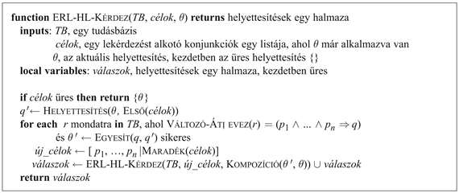
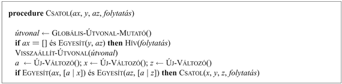
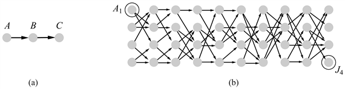
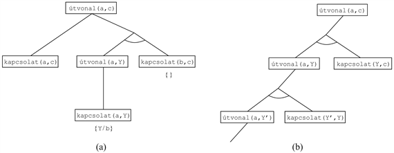

<?xml version="1.0" encoding="UTF-8" standalone="no"?>
<!DOCTYPE html PUBLIC "-//W3C//DTD XHTML 1.1//EN" "http://www.w3.org/TR/xhtml11/DTD/xhtml11.dtd">
<html xmlns="http://www.w3.org/1999/xhtml"><head><meta name="generator" content="DocBook XSL Stylesheets V1.76.1"/></head><body>

<h1 class="title"><a id="id609797"/>Hátrafelé láncolás</h1>

A logikai következtetési algoritmusoknak a második nagy családja a 7.5. alfejezetben bemutatott <strong>hátrafelé láncolás</strong> (<strong>backward chaining</strong>) megközelítést használja. Ezek az algoritmusok a célból kiindulva hátrafelé dolgoznak, láncszerűen haladva a szabályokon keresztül, hogy megtalálják a bizonyítást alátámasztó már ismert tényeket. Először bemutatjuk az alapvető algoritmust, majd leírjuk, hogyan használják ezt a <strong>logikai programozás</strong>ban (<strong>logic programming</strong>), amely a legelterjedtebb formája az automatizált következtetéseknek. Azt is látni fogjuk, hogy a hátrafelé láncolásnak vannak hátrányai is az előrefelé láncolással szemben, és meg fogjuk vizsgálni, milyen módon kerekedhetünk felül ezeken. Végül megmutatjuk a logikai programozás és a kényszerek kielégítésének problémája közötti szoros kapcsolatot.

<h2 class="title"><a id="id609822"/>Egy hátrafelé láncolási algoritmus</h2>

A 9.6. ábra egy egyszerű hátrafelé láncolási algoritmust mutat be, az ERL-HL-<code class="code">KÉRDEZ</code>-t. Az algoritmust célok listájával hívjuk meg, amely kezdetben egy elemet tartalmaz, az eredeti lekérdezést, és az eljárás visszaadja az összes olyan helyettesítéshalmazt, amelyek kielégítik a lekérdezést. A célok listáját úgy tekinthetjük, mint egy feldolgozásra váró „vermet”. A bizonyítás aktuális ága akkor lesz sikeres, ha a verem <em>összes elemét </em>ki tudjuk elégíteni. Az algoritmus először veszi a lista első célját, és megtalálja az öszszes olyan klózt a tudásbázisban, amelynek a pozitív literálja, vagyis a <strong>fej</strong>e (<strong>head</strong>) egyesíthető a céllal. Minden ilyen klóz létrehoz egy új rekurzív hívást, amelyben a premissza, vagyis a klóz <strong>törzs</strong>e (<strong>body</strong>) hozzá lesz adva a célveremhez. Emlékezzünk, hogy a tények olyan klózok, amelyeknek fejük van, de törzsük nincs, így amikor egy cél egyesül egy ismert ténnyel, nem adunk új alcélokat a veremhez, és így a célt megoldjuk. A 9.7. ábra a <em>Bűnöző</em>(<em>West</em>)<em> </em>származtatásának a bizonyítási fáját mutatja be, a (9.3)<em> </em>mondataiból kiindulva a (9.10)-en keresztül.

<a id="id609869"/>
<strong>9.6. ábra - Egy egyszerű hátrafelé láncolási algoritmus</strong>

<a id="id609878"/>
<strong>9.7. ábra - Egy hátrafelé láncolással létrehozott bizonyítási fa, annak bizonyítására, hogy West egy bűnöző. A fát mélységi kereséssel kell kiértékelni, balról jobbra. Hogy bebizonyítsuk a <em>Bűnöző</em>(<em>West</em>)<em> </em>klózt, be kell bizonyítanunk az alatta elhelyezkedő négy konjunktot is. Néhányan közülük megtalálhatók a tudásbázisban, míg mások további hátrafelé láncolást igényelnek. Mindegy egyes sikeres egyesítés lekötéseit láthatjuk a megfelelő részcél mellett. Jegyezzük meg, hogy mihelyt egy konjunkcióban egy részcél sikeres, helyettesítéseit a következő részcélokhoz alkalmazzuk. Így tehát, mire az ERL-HL-<code class="code">KÉRDEZ</code> eljut az utolsó konjunkcióig, az eredetileg <em>Ellenséges</em>(<em>z</em>)-ig, az már a <em>Nono</em>-hoz lesz lekötve.</strong>

Az algoritmus a helyettesítések egy <strong>kompozíció</strong>ját (<strong>composition</strong>) használja. A <code class="code">KOMPOZÍCIÓ</code> (<em>θ</em>1, <em>θ</em>2) olyan helyettesítés, amelynek hatása ugyanaz, mintha sorban minden helyettesítést alkalmaznánk. Tehát:

<code class="code">Helyettesít(Kompozíció(<em>θ</em>1, <em>θ</em>2), <em>p</em>) = Helyettesít(<em>θ</em>2, Helyettesít(<em>θ</em>1, <em>p</em>))</code>

Az algoritmusban a <em>θ</em>-ban tárolt aktuális változólekötéseket összevonjuk azokkal a lekötésekkel, amelyeket a célnak a klózfejjel való egyesítése eredményez, megkapva így egy új aktuális lekötéshalmazt a visszafelé történő híváshoz.

A hátrafelé láncolás, ahogyan bemutattuk, egy tiszta mélységi keresési algoritmus. Ez azt is jelenti, hogy a helyigénye a bizonyítás méretének lineáris függvénye (most figyelmen kívül hagyva a megoldások összegyűjtéséhez szükséges helyet). Ez azt is jelenti, hogy a hátrafelé láncolás alkalmazása (eltérően az előrefelé láncolástól) olyan ismert problémákkal jár, mint amilyen az ismétlődő állapotok és a nem teljesség. Később meg fogjuk vizsgálni ezeket a problémákat és néhány lehetséges megoldást, de először nézzük meg, hogyan használják a hátrafelé láncolást a logikai programozási rendszerekben.

<h2 class="title"><a id="id609985"/>Logikai programozás</h2>

A logikai programozás közel áll egy olyan technológiához, amely megtestesíti azt a deklaratív ideált, amelyet a 7. fejezetben írtunk le, miszerint a rendszereket úgy kell létrehozni, hogy a tudást formális nyelven fejezzük ki, és a problémákat egy következtetési folyamat végigfuttatásával oldjuk meg. Ezt az ideális megközelítést Robert Kowalski egyenlete foglalja össze:

<code class="code"><em>Algoritmus = Logika </em>+<em> Vezérlés</em></code>

A <strong>Prolog</strong> messze a legszélesebb körben használt logikai programozási nyelv. Több százezer használója van. Elsősorban gyors prototípusnyelvként használták, valamint szimbólummanipulációs feladatokhoz, mint például fordítóprogramok írására (Van Roy, 1990) vagy természetes nyelvek elemzésére (Pereira és Warren, 1980). Számos szakértőrendszert írtak Prologban jogi, orvosi, pénzügyi és más tárgyterületeken.

A Prolog programok határozott klózok halmazai, jelölési rendszere kissé eltér a standard elsőrendű logikáétól. A Prolog nagybetűket használ a változókra és kisbetűket a konstansokra. A klózok leírásában a fej megelőzi a törzset; a „:-” -t használja a bal oldali implikációra, vesszők választják el a literálokat a törzsben, és pont jelzi a mondat végét:

<code class="code">bűnöző(X):- amerikai(X), fegyver(Y), elad(X,Y,Z), ellenséges(Z)</code>

A Prolog a listák jelölésére és az aritmetikára tartalmazza a „szintaktikai nyalánkságot”. Példaként íme egy Prolog program a csatol(X,Y,Z)-re, amely akkor sikeres, ha a Z- lista az X- és az Y -listák csatolásának az eredménye:

<code class="code">csatol([],Y,Y)</code>

<code class="code">csatol([A1∣2 X, Y, A½Z]):- csatol(X,Y,Z)</code>

Természetes nyelven úgy olvashatóak ezek a klózok, hogy (1) egy üres listát hozzácsatolva az Y listához, egy ugyanolyan Y listát kapunk eredményként, és a (2) szerint az [A|Z] az [A|X] Y-hoz csatolásának az eredménye. A csatol ezen definíciója eléggé hasonlónak tűnik a Lispben megtalálható megfelelő definíciókhoz, de valójában ez sokkal kifejezőbb. Például feltehetjük a következő kérdést: csatol(A,B, [1, 2]): melyik két listát kell csatolni ahhoz, hogy összeállítsuk az [1, 2]-t? A programot futtatva ezeket a megoldásokat kapjuk vissza:

<code class="code">A = []	B = [1, 2]</code>

<code class="code">A = [1]	B = [2]</code>

<code class="code">A = [1, 2]	B = []</code>

A Prolog-programok végrehajtása mélységi keresést alkalmazó hátrafelé láncoláson keresztül történik, ahol a klózokat olyan sorrendben alkalmazzák, ahogyan a tudásbázisban szerepelnek. A Prolog néhány aspektusa a standard logikai következtetésen kívül esik.

<ul class="itemizedlist"><li class="listitem">
Beépített aritmetikai függvényeket tartalmaz. Az ilyen függvényszimbólumokat használó literálokat a kód végrehajtásával „bizonyítja” a program, és nem végez további következtetéseket. Például az „X egyenlő 4+3” akkor sikeres, ha az X értékét a 7-hez kötjük. Ugyanakkor, az a célállítás, hogy: „5 egyenlő X+Y” sikertelen lesz, mert a beépített függvények nem képesek önállóan egy tetszőleges egyenletmegoldást elvégezni.[<a id="id610046" href="#ftn.id610046" class="footnote">91</a>]
</li><li class="listitem">
Vannak olyan beépített predikátumok, amelyeknek mellékhatásai vannak, ha végrehajtjuk őket. Ilyenek a bemeneti-kimeneti predikátumok és a tényeket a <em>TB</em>-hez hozzáadó, illetve onnan törlő kijelent/visszavon predikátumok. Ezeknek a predikátumoknak nincs megfelelőjük a logikában, és hatásukat sokszor nem egyszerű végigkövetni – például ha a tényeket egy olyan bizonyítási fa egyik ágán jelentjük ki, amely végül sikertelennek bizonyul.
</li><li class="listitem">
A Prolog lehetővé tesz olyan egyedi formájú tagadást, amelyet <strong>sikertelenségi tagadás</strong>nak (<strong>negation as failure</strong>) nevezünk. Egy negált cél, mint a a nem P, akkor tekintető bizonyítottnak, ha a rendszernek nem sikerül bebizonyítania a P-t. Így a következő mondat:
</li></ul>

<code class="code">élő(X) :- nem halott(X)</code>

	úgy olvasható, hogy: „Mindenki élő, ha nem bizonyítható, hogy halott.”

<ul class="itemizedlist"><li class="listitem">
A Prolognak van egy egyenlőségi operátora (=), de ez nem rendelkezik a logikai egyenlőség teljes hatékonyságával. Egy egyenlőséget tartalmazó célállítás akkor sikeres, ha a két term <em>egyesíthető, </em>máskülönben sikertelen. Tehát az X + Y = 2 + 3 akkor sikeres, ha az X lekötött értéke a 2, és az Y lekötött értéke a 3, de a hajnalcsillag=esthajnalcsillag sikertelen. (A klasszikus logikában az utóbbi egyenlet lehet igaz, vagy lehet nem igaz.) Az egyenlőségről sem tényt, sem szabályt nem tudunk hozzáadni a <em>TB</em>-hez.
</li><li class="listitem">
A Prolog egyesítési algoritmusa nem tartalmazza az <strong>előfordulási próbá</strong>t. Ennek az a következménye, hogy lehetséges nem helyes következtetést végezni. Ez azonban ritkán okoz problémát, leginkább olyankor, amikor a Prologot matematikai tételek bizonyítására használjuk.
</li></ul>

A Prolog tervezésénél meghozott döntések kompromisszumot jelentenek a deklarativitás és a végrehajtási hatékonyság között – mármint amit hatékonyságon értettünk a Prolog tervezésének idején. Visszatérünk majd ehhez a témához, miután megvizsgáltuk, hogyan valósítják meg a Prologot.

<h2 class="title"><a id="id610108"/>A logikai programok hatékony megvalósítása</h2>

Egy Prolog program végrehajtása kétféle módon történhet: lehet interpretált és lehet lefordított. Az interpretáció általában az ERL-HL-<code class="code">KÉRDEZ</code> algoritmus (lásd 9.6. ábra) futtatását jelenti a programmal mint tudásbázissal. Azt mondjuk, hogy „általában”, mivel a Prolog különböző interpretációi különböző megoldásokat tartalmaznak a sebesség maximalizálására. Itt mi csak két implementációt nézünk meg.

Először is ahelyett, hogy minden lépésben összeállítanánk az összes lehetséges válasz listáját minden egyes részcélhoz, a Prolog interpreter egy választ hoz létre, és egy „ígéretet” ad meg arra, hogy a többi lehetséges választ is generálni fogja, miután az aktuális választ teljes mértékben feltárta. Ezt az ígéretet <strong>választási pont</strong>nak (<strong>choice point</strong>) nevezzük. Mikor a mélységi keresés befejezte az aktuális válaszból fakadó lehetséges megoldások feltárását, és visszalép a választási ponthoz, a választási pontot kiterjesztjük úgy, hogy megadjon egy új választ a részcélhoz, és egy új választási pontot. Ez a megközelítés időt és tárolóhelyet takarít meg. Ezenkívül nagyon egyszerű határfelületet biztosít a hibakereséshez, mert egy adott pillanatban csak egyetlen megoldási útvonal vizsgálata történik meg.

Másodszor, az ERL-HL-<code class="code">KÉRDEZ</code> egyszerű alkalmazása a helyettesítések generálásakor és kompozíciójakor jól gazdálkodik az idővel. A Prolog a helyettesítéseket úgy alkalmazza, hogy olyan logikai változókat használ, amelyek emlékezni tudnak az aktuális lekötéseikre. A program futásának bármely pontján a programban lévő minden egyes változó vagy szabad, vagy valamely értékhez lekötött. Ezek a változók és értékek együtt definiálják implicit módon a helyettesítést a bizonyítás aktuális ágához. A vizsgált ágak kiterjesztése csak további változólekötéseket hoz létre, mivel egy új lekötés hozzáadása egy már lekötött változóhoz az egyesítés sikertelenségét eredményezi. Mikor a keresésben sikertelennek bizonyul egy ág, a Prolog visszalép egy megelőző választási ponthoz, és ekkor esetleg fel kell oldania néhány változót. Ezt úgy hajtja végre, hogy nyomon követi a veremben – amelynek <strong>útvonal</strong> (<strong>trail</strong>) a neve – lekötött összes változót. Mivel minden egyes új változó az <code class="code">EGYESÍT-VÁLT</code>-tal kapcsolódik, a változót beteszi az útvonalba. Amikor egy cél sikertelen, és ideje visszatérni egy megelőző választási ponthoz, minden egyes változó szabaddá válik, minthogy kivesszük az útvonalból.

Még a leghatékonyabb Prolog interpretereknek is néhány ezer gépi utasításra van szükségük egy következtetési lépés végrehajtásához; az index kikeresésének, az egyesítésnek, a rekurzív hívási verem felépítésének a költsége miatt. Valójában az interpreter úgy viselkedik, mint aki még soha sem látta a programot. Például újra meg kell <em>találnia </em>a célhoz illeszkedő klózokat. Egy lefordított Prolog program ezzel szemben egy olyan következtetési eljárás, amelyet egy specifikus klózhalmazra készítettek, és így <em>tudja, </em>mely klózok illeszthetők az adott célhoz. A Prolog fordító alapjában véve minden egyes különböző predikátumra egy miniatűr tételbizonyítót generál, kiküszöbölve így az interpretációs lépések nagy részét. Lehetséges az is, hogy az egyesítési eljárást <strong>nyitott kód</strong>dal (<strong>open-code</strong>) lássuk el az egyes eljárás hívásokra, elkerülve így a termek struktúrájának explicit elemzését. A nyitott kódú egyesítés részleteit megtalálhatók a (Warren és társai, 1977)-ben.

A mai számítógépek utasításkészletei szegényesnek tűnnek összehasonlítva a Prolog szemantikájával, így tehát a Prolog fordítóit egy átmeneti nyelvre fordítják le ahelyett, hogy közvetlenül gépi nyelvre fordítanák. A legnépszerűbb átmeneti nyelv a Warren Absztrakt Gép (Warren Abstract Machine) vagy WAM, amelyet David H. D. Warrenről neveztek el, aki az első Prolog fordító egyik megvalósítója volt. A WAM a Prolog számára alkalmas absztrakt utasításkészlet, és interpretálható vagy lefordítható gépi nyelvre. Más fordítók, mint például a Lisp vagy a C, egy magas szintű nyelvre fordítják le a Prologot, és ezután használják a nyelvnek a fordítóját, hogy azt a gépi nyelvre fordítsa. Például, a Csatol definícióját a 9.8. ábrán bemutatott kódra lehet fordítani. Van még néhány kérdés, amit fontos megemlíteni:

<ul class="itemizedlist"><li class="listitem">
Ahelyett hogy keresgélni kellene a tudásbázisban a Csatol klózokat, a klózokat eljárássá lehet alakítani, és a következtetéseket egyszerűen úgy hajtjuk végre, hogy meghívjuk az eljárást.
</li><li class="listitem">
Mint azt korábban leírtuk, az aktuális változók lekötéseit egy útvonalhoz rendeljük. Az eljárás első lépése elmenti az útvonal pillanatnyi állapotát úgy, hogy azok visszaállíthatóak lesznek a <code class="code">VISSZAÁLLÍT-ÚTVONAL</code>-lal, ha az első klóz sikertelen. Ez fel fog oldani minden lekötést, amelyet az első <code class="code">EGYESÍT</code> hívás generált.
</li><li class="listitem">
A legtrükkösebb rész a <strong>folytatás</strong>ok (<strong>continuation</strong>s) listájának használata a választási pontok implementálására. Gondolhatunk úgy egy folytatásra, mint egy eljárás és egy argumentumlista becsomagolására, melyek együtt határozzák meg, hogy mit kell legközelebb csinálni, amikor az aktuális cél sikeres lesz. Nem elég csak úgy egyszerűen visszatérni egy olyan eljárásból, mint a <code class="code">CSATOL</code>, amikor a cél sikeres,  mivel itt sokféle módon lehet sikeres az eljárás, és minden egyes esetet fel kell deríteni. A folytatás argumentum megoldja ezt a problémát, mert minden egyes esetben lehívhatjuk, ha egy cél sikeres. A <code class="code">CSATOL</code> kódban, ha az első argumentum üres, akkor a <code class="code">CSATOL</code> predikátum sikeres. Ezután <code class="code">HÍVJUK</code> a folytatást, az útvonalhoz rendelt lekötésekkel, hogy végrehajtsa, amit a folytatásban legközelebb meg kell tenni. Például ha a <code class="code">CSATOL</code> hívása a legfelső szinten történik, a folytatás kinyomtatja a változók lekötéseit.
</li></ul>

<a id="id610224"/>
<strong>9.8. ábra - A Csatol predikátum fordításának pszeudokódos reprezentációja. Az <code class="code">ÚJ-VÁLTOZÓ</code> függvény egy új változót ad vissza, amely különbözik a korábban visszaadott változóktól. A <code class="code">HÍV</code> (<em>folytatás</em>)<em> </em>eljárás folytatja a végrehajtást a megadott folytatással.</strong>

Mielőtt Warren a Prolog fordítót elkészítette volna, a logikai programozás túl lassú volt általános célú felhasználáshoz. A Warren és mások által létrehozott fordítók lehetővé tették, hogy a Prolog kód olyan sebességet érjen el, amelyek – különböző standard tesztek szerint is – versenyképessé tették a C nyelvvel (Van Roy, 1990). Természetesen az a tény, hogy egy tervkészítőt vagy egy elemzőt egy természetes nyelvhez néhány tucat Prolog sorban meg lehet írni, lényegesen vonzóbbá teszi a Prologot a C-nél a legtöbb kisebb MI-kutatási projekt prototípusának az elkészítésénél.

A párhuzamosítás szintén jelentős gyorsítást eredményezhet. Két elsődleges tere van a párhuzamosításnak. Az első, amelynek neve <strong>VAGY-párhuzamosság</strong> (<strong>OR-paralellism</strong>), abból a lehetőségből származik, hogy egy cél számos különböző klózzal lehet egyesíthető a tudásbázisban. Mindegyik egyesítés egy potenciális megoldáshoz vezető független ág megjelenését eredményezi a keresési helyen, és minden ilyen ágat párhuzamosan is megoldhatunk. A második, amelynek neve <strong>ÉS-párhuzamosság</strong> (<strong>AND-paralellism</strong>), abból származik, hogy az implikáció törzsében minden egyes konjunktot egy párhuzamos implikációval is meg lehet oldani. Az ÉS-párhuzamosságot nehezebb megvalósítani, mert a megoldás az egész konjunkcióra konzisztens lekötéseket igényel az összes változóra. Így minden egyes konjunktív ágnak kommunikálnia kell a többi ággal, hogy biztosítsák a globális megoldást.

<h2 class="title"><a id="id610272"/>Redundáns következtetés és végtelen hurkok</h2>

Most nézzük meg a Prolog nyelv Achilles-sarkát, a mélységi keresés és az ismételt állapotokat és végtelen útvonalakat tartalmazó fák illeszkedésének hiányát. Vizsgáljuk meg a következő logikai programot, amely eldönti, hogy létezik-e egy útvonal két pont között egy irányított gráfban:

<code class="code">útvonal(X, Z):- kapcsolat(X, Z)</code>

<code class="code">útvonal(X, Z):- útvonal(X, Y), kapcsolat(Y, Z)</code>

Egy egyszerű, három csomópontos gráfot, amelyet a kapcsolat(a,b) és a kapcsolat(b,c) definiál, mutat be a 9.9. (a) ábra. Az útvonal(a,c)  lekérdezésére a program a 9.10. (a) ábrán látható bizonyítási fát generálja. Másrészt viszont, ha a két klózt ebbe a sorrendbe tesszük:

<code class="code">útvonal(X, Z):- útvonal(X, Y), kapcsolat(Y, Z)</code>

<code class="code">útvonal(X, Z):- kapcsolat(X, Z)</code>

akkor a Prolog a 9.10. (a) ábrán bemutatott végtelen keresést végzi. A Prolog tehát, mint egy tételbizonyító, határozott klózokból álló <em>TB</em>-re <strong>nem teljes</strong> (<strong>incomplete</strong>) (még a Datalog programok esetében sem teljes, mint azt a példánk mutatja), mivel léteznek olyan tudásbázisok, amelyekben nem tud bizonyítani vonzat mondatokat. Vegyük észre, hogy az előrefelé láncolással nincs ilyen probléma: ha egyszer az útvonal(a, b), az útvonal(b, c) és az útvonal(a, c) útvonalak ki lettek következtetve, az előrefelé láncolás leáll.

A mélységi keresésen alapuló hátrafelé láncolásnak is akad problémája a felesleges számításokkal. Például amikor meg akarunk találni egy útvonalat az <em>A</em>1<em>-</em>ből a <em>J</em>4-be a 9.9. (b) ábrán, a Prolog 877 következtetést hajt végre, amelyek legnagyobb részét a csomópontokhoz tartozó összes lehetséges útvonal megtalálása képezi, amelyekből pedig nem lehet elérni a célt. Ez hasonló a 3. fejezetben megtárgyalt ismételt állapot problémához. A következtetési lépések teljes száma a generált alaptények számának exponenciális függvénye lehet. Ha az előrefelé láncolást alkalmazzuk ehelyett, akkor legfeljebb <em>n</em>2 útvonal(X, Y) tény generálható az <em>n </em>csomópont összekötésével. A 9.9. (b) ábrán látható problémához csak 62 következtetési lépés szükséges.

<a id="id610337"/>
<strong>9.9. ábra - (a) Az <em>A</em>-ból a <em>C</em>-be vezető útvonal megtalálása a Prologot egy végtelen hurokba vezetheti. (b) Egy gráf, amelyben minden csomópontot két véletlenszerű következő rétegbeli csomóponthoz kapcsolunk a következő rétegben. Egy útvonal megtalálása az <em>A</em>1-ből a <em>J</em>4-be 877 következtetést igényel.</strong>

Az előrefelé láncolás a gráfkeresési problémáknál a <strong>dinamikus programozás</strong> (<strong>dyna</strong><strong>mic programming</strong>) egyik példája, amelyben a részproblémákra vonatkozó megoldások előállítása inkrementálisan történik a kisebb részproblémáktól indulva, végig tárolva a részmegoldásokat, hogy elkerüljük az újraszámolást. Ugyanezt a hatást érhetjük el egy hátrafelé láncoló rendszerben a <strong>memók gyűjtésé</strong>nek (<strong>memoization</strong>) használatával, ami azt jelenti, hogy a részcélok megoldásait tároljuk, amint megtaláltuk őket, hogy azután újra felhasználhassuk ezeket a megoldásokat, amikor a részcél visszatér, megtakarítva így az előző számítás megismétlését. Ezt a megközelítést használják a <strong>táblázatos </strong><strong>logikai programozás</strong>i (<strong>tabled logic programming</strong>) rendszerek, amelyeknek hatékony tárolási és visszakeresési mechanizmusuk van a memók gyűjtésének megvalósítására. A táblázatos logikai programozás egyesíti a hátrafelé láncolás célirányosságát az előrefelé láncolás dinamikus programozási hatékonyságával. Ez az eljárás teljes a Datalog programokra is, ami azt eredményezi, hogy a programozónak kevesebbet kell aggódnia a végtelen hurkok problémája miatt.

<a id="id610404"/>
<strong>9.10. ábra - (a) Az <em>A</em>-ból a <em>C</em>-be vezető útvonal bizonyítása. (b) Végtelen mélységű bizonyítási fa, amely akkor generálódik, ha a klózok „rossz” sorrendben vannak.</strong>

<h2 class="title"><a id="id610421"/>Korlátozott logikai programozás</h2>

Az előrefelé láncolás tárgyalásánál (lásd 9.3. alfejezet) bemutattuk, hogy a kényszerkielégítési problémákat hogyan lehet határozott klózokként kódolni. A standard Prolog képes megoldani az ilyen problémákat, pontosan úgy, mint az 5.3. ábrán bemutatott visszalépéses algoritmus.

Mivel a visszalépéses módszer sorba veszi a változók tárgyterületeit, ezért csak <strong>véges tárgyterületű</strong> (<strong>finite domain</strong>) kényszerkielégítési problémákra működik. A Prolog termjeiben véges számú megoldásnak szabad léteznie bármely szabad változókkal rendelkező célra. (Például, a kül(q, sa)  célnak, amely azt jelenti ki, hogy Queenslandnek és Dél-Ausztráliának különböző színűnek kell lenni, hat megoldása van, ha három szín megengedett.) A végtelen méretű tárgyterületekre alkalmazott módszerek – például az egész számokat felvevő vagy valós értékű változókat tartalmazó problémáknál alkalmazható módszerek – teljesen különböző algoritmust igényelnek, mint például a kényszerpropagálást vagy a lineáris programozást. 

A következő klóz akkor tehető sikeressé, ha a három szám kielégíti a háromszög egyenlőtlenséget:

<code class="code">háromszög(X, Y, Z):-</code>

<code class="code">X&gt;=0, Y&gt;=0, Z&gt;=0, X+Y&gt;=Z, Y+Z&gt;=X, X+Z&gt;=Y</code>

Ha a Prolognak a háromszög (3, 4, 5) lekérdezést adjuk, akkor ez jól működik. Ha viszont azt kérdezzük: háromszög (3, 4, Z), akkor erre nem talál megoldást, mert a Z&gt;=0 részcélt a Prolog nem tudja kezelni. A nehézséget az okozza, hogy a Prologban a változóknak két állapot valamelyikében kell lenniük: egy változó szabad vagy egy bizonyos termhez lekötött.

Egy változó lekötése egy termhez a korlátozás egyik speciális fajtájának tekinthető, nevezetesen egy egyenlőségkényszernek. A <strong>korlátozott logikai programozás</strong> (<strong>constraint logic programming</strong>, <strong>CLP</strong>) lehetővé teszi, hogy a változók <em>korlátozva </em>legyenek, ahelyett hogy <em>lekötöttek </em>lennének<em>. </em>Egy korlátozott logikai program megoldása a korlátoknak a tudásbázisból származtatható legspecifikusabb halmaza a lekérdezés változóin. Például a háromszög (3, 4, Z) lekérdezésre a megoldás a 7 &gt;= Z &gt;= 1 kényszer. A standard logikai programok csak a CLP speciális esetei, amelyekben a megoldás kényszereinek egyenlőségi kényszereknek – azaz lekötéseknek – kell lenniük.

A CLP-rendszerek különféle kényszermegoldó algoritmusokat is tartalmaznak a nyelvben megengedett kényszerek kezelésére. Például egy valós értékű változókon értelmezett, lineáris egyenlőtlenségeket megengedő rendszer tartalmazhat egy lineáris programozási algoritmust ezen kényszerek feloldására. A CLP-rendszerek egy sokkal rugalmasabb megközelítést is adoptálnak a standard logikai programozási lekérdezések megoldására. Például a mélységi, balról jobbra történő visszalépéses keresés helyett használhatják bármelyik ennél hatékonyabb, az 5. fejezetben tárgyalt algoritmust, beleértve a heurisztikus konjunktok sorba rendezését, a visszaugrást, a vágási halmaz kondicionálást és így tovább. A CLP-rendszerek tehát vegyesen alkalmazzák a kényszerekkielégítési algoritmusok, a logikai programozás és a deduktív adatbázisok elemeit.

A CLP-rendszerek szintén hasznosítják az 5. fejezetben bemutatott különböző kényszerprogramozási keresési optimalizációs módszereket, mint a változók és értékek sorba rendezését, az előrefelé ellenőrzést vagy az intelligens visszalépés módszerét. Számos rendszert úgy terveztek meg, hogy a programozónak nagyobb kontrollja legyen a következtetések keresésének a sorrendje felett. Például az MRS nyelv (Genesereth és Smith, 1981; Russell, 1985) lehetővé teszi a programozó számára, hogy <strong>metaszabály</strong>okat (<strong>metarule</strong>s) írjon a konjunktok megvizsgálási sorrendjének meghatározására. A felhasználó például írhat egy olyan szabályt, amely azt mondja ki, hogy a legkevesebb változóval rendelkező cél legyen először kipróbálva, vagy írhat tárgyterület-specifikus szabályokat bizonyos predikátumokhoz.

 

[<a id="ftn.id610046" href="#id610046" class="para">91</a>]  Jegyezzük meg, hogy ha a Peano-axiómák meg vannak adva, akkor az ilyen célok megoldhatók egy Prolog-programon belüli következtetéssel.

</body></html>
