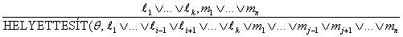
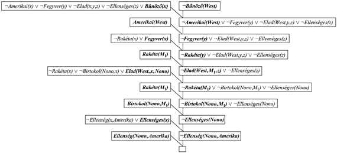
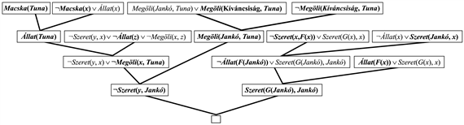
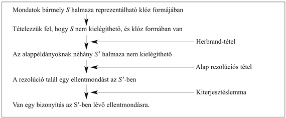
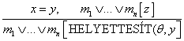
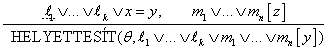
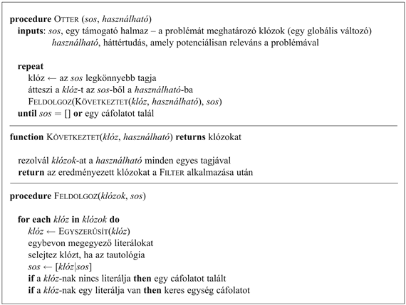

<?xml version="1.0" encoding="UTF-8" standalone="no"?>
<!DOCTYPE html PUBLIC "-//W3C//DTD XHTML 1.1//EN" "http://www.w3.org/TR/xhtml11/DTD/xhtml11.dtd">
<html xmlns="http://www.w3.org/1999/xhtml"><head><meta name="generator" content="DocBook XSL Stylesheets V1.76.1"/></head><body>

<h1 class="title"><a id="id610493"/>Rezolúció</h1>

A logikai rendszerek általunk bemutatandó három családjának az utolsó tagja a <strong>rezolúció</strong>n (<strong>resolution</strong>) alapul. Láttuk a 7. fejezetben, hogy a propozíciós rezolúció egy cáfolásteljes következtetési folyamat az ítéletlogikában. Ebben az alfejezetben meg fogjuk vizsgálni, hogyan lehet kiterjeszteni a rezolúciót az elsőrendű logikára.

A teljes bizonyítási eljárás létezésének kérdése a matematikusokat érdekli közvetlenül. Ha egy teljes bizonyítási eljárás megtalálható matematikai állításokra, ebből két dolog következik. Először is, az összes tétel előfeltételeit mechanikusan elő tudjuk állítani; másodszor, a teljes matematika felépíthető alapaxiómák halmazának logikai következményeként. A teljesség kérdésének vizsgálata így a 20. századi matematika néhány legfontosabb eredményének a megszületéséhez vezetett. 1930-ban Kurt Gödel német matematikus bebizonyította az első <strong>teljességi tétel</strong>t (<strong>completeness theor</strong><strong>em</strong>) az elsőrendű logikára, megmutatva, hogy minden kikövetkeztetett mondatnak létezik véges bizonyítása. (Gyakorlatban is felhasználható bizonyítási módszert viszont nem találtak egészen addig, amíg J. A. Robinson nem publikálta a rezolúciós algoritmust 1965-ben.) 1931-ben Gödel bebizonyította a még híresebb <strong>nemteljességi tétel</strong>t (<strong>incompleteness theorem</strong>). A tétel kimondja, hogy egy logikai rendszer, amely tartalmazza az indukció elvét – amely nélkül a diszkrét matematika igen kis része építhető fel – szükségszerűen nem teljes. Ebből az következik, hogy léteznek olyan kikövetkeztetett mondatok, amelyeknek a rendszeren belül nincs véges bizonyítása. Lehet, hogy a tű ott van a metaforikus szénakazalban, de nincs olyan eljárás, amely garantálná, hogy megtaláljuk.

Gödel tétele ellenére, a rezolúcióalapú tételbizonyításokat széles körben alkalmazták matematikai tételek levezetésére, beleértve néhány olyan tételt is, amelyre előzőleg nem volt ismert bizonyítás. A tételbizonyításokat – más alkalmazások mellett – használták például hardvertervezés verifikálására vagy logikailag helyes programok generálására.

<h2 class="title"><a id="id610536"/>Az elsőrendű logika konjunktív normál formája</h2>

Mint az ítéletlogika esetében, az elsőrendű rezolúció is megköveteli, hogy a mondatok <strong>konjunktív normál formá</strong>ban (<strong>conjunctive normal form</strong>) (<strong>CNF</strong>) legyenek, tehát minden mondat klózok konjunkciója, ahol minden egyes klózt literálok diszjunkciója alkot.[<a id="id610556" href="#ftn.id610556" class="footnote">92</a>] A literálok tartalmazhatnak változókat, amelyeket univerzális kvantorral ellátottnak feltételezünk. Például a 

<code class="code">∀<em>x Amerikai</em>(<em>x</em>)<em> </em>∧ <em>Fegyver</em>(<em>y</em>)<em> </em>∧<em> Elad</em>(<em>x, y, z</em>)<em> </em>∧<em> Ellenséges</em>(<em>z</em>) ⇒<em> Bűnöző</em>(<em>x</em>)</code>

mondat CNF-formára átalakítva ilyen lesz:

<code class="code">¬<em>Amerikai</em>(<em>x</em>)<em> </em>∨ ¬<em>Fegyver</em>(<em>y</em>)  ∨ ¬<em>Elad</em>(<em>x, y, z</em>)  ∨ ¬<em>Ellenséges</em>(<em>z</em>)  ∨<em> Bűnöző</em>(<em>x</em>)</code>

<h3 class="title">Fontos</h3>
<em>Minden elsőrendű logikai mondat átalakítható a következtetés szempontjából egyenértékű CNF-mondattá. </em>Ami azt jelenti, hogy egy CNF-mondat akkor kielégíthetetlen, ha az eredeti mondat is kielégíthetetlen, ezáltal a CNF-mondatok között ellentmondásokat keresve létre tudunk hozni bizonyításokat.

A CNF-mondatok átalakításának eljárása nagyon hasonló az ítéletlogikai eljáráshoz, amelyet a <a class="xref" href="ch07s04.md#ID_269_oldal">„Konjunktív normál forma”</a>részben láthatunk. A legfontosabb különbség abból fakad, hogy ki kell vonnunk a mondatokból az egzisztenciális kvantorokat. Ezt az eljárást a következő mondat lefordításával illusztráljuk: „Mindenkit, aki az összes állatot szereti, valaki szeret”, vagyis:

<code class="code">∀<em>x  </em>[∀<em>y  Állat</em>(<em>y</em>)<em> </em>⇒ <em>Szereti</em>(<em>x</em>,<em> y</em>)]<em> </em>⇒ [∃<em>y  Szereti</em>(<em>y</em>,<em> x</em>)]</code>

A lépések a következők:

<ul class="itemizedlist"><li class="listitem">
Az implikációk eliminálása.
</li></ul>

<code class="code">	∀<em>x </em>[¬∀<em>y  </em>¬<em>Állat</em>(<em>y</em>)<em> </em>∨<em> Szereti</em>(<em>x</em>,<em> y</em>)] ∨ [∃<em>y  Szereti</em>(<em>y</em>,<em> x</em>)]</code>

<ul class="itemizedlist"><li class="listitem">
<strong>A ¬befelé mozgatása. </strong>A negált összekötőjelekre vonatkozó már ismert szabályok mellett szükségünk van a negált kvantorokra vonatkozó szabályokra is. Így ezt kapjuk:
</li></ul>

<code class="code">	¬∀<em>x  p</em>-ből lesz ∃<em>x  </em>¬<em>p</em></code>

<code class="code">	¬∃<em>x  p</em>-ből lesz ∀<em>x  </em>¬<em>p</em></code>

A mondatunk a következő átalakításokon megy keresztül:

<code class="code">	∀<em>x  </em>[∃<em>y  </em>¬(¬<em>Állat</em>(<em>y</em>)<em> </em>∨<em> Szereti</em>(<em>x</em>,<em> y</em>))] ∨ [∃<em>y  Szereti</em>(<em>y</em>,<em> x</em>)]</code>

<code class="code">	∀<em>x  </em>[∃<em>y  </em>¬ ¬<em>Állat</em>(<em>y</em>) ∧  ¬<em>Szereti</em>(<em>x</em>,<em> y</em>)] ∨ [∃<em>y  Szereti</em>(<em>y</em>,<em> x</em>)]</code>

<code class="code">	∀<em>x  </em>[∃<em>y </em> <em>Állat</em>(<em>y</em>) ∧ ¬<em>Szereti</em>(<em>x</em>,<em> y</em>)] ∨ [∃<em>y  Szereti</em>(<em>y</em>,<em> x</em>)]</code>

	Figyeljük meg, hogyan alakítottuk át az univerzális kvantort (∀<em>y</em>) az implikáció premisszájában egzisztenciális kvantorrá. A mondatot most így lehet kiolvasni „Vagy van olyan állat, amelyet <em>x </em>nem szeret, vagy (ha ez nem áll fenn) valaki szereti <em>x</em>-et.” Világos, hogy az eredeti mondat jelentését megőriztük.

<ul class="itemizedlist"><li class="listitem">
<strong>A változók átnevezése. </strong>Az olyan mondatokban, mint a (∀<em>x </em> <em>P</em>(<em>x</em>)) ∨ (∃<em>x </em> <em>Q</em>(<em>x</em>)), amelyek ugyanazt a változó nevet kétszer is használják, változtassuk meg az egyik változó nevét. Ezzel elkerüljük, hogy később keveredés lehessen, amikor elhagyjuk a kvantorokat. Így ezt kapjuk:
</li></ul>

<code class="code">	∀<em>x  </em>[∃<em>y</em>  <em>Állat</em>(<em>y</em>) ∧ ¬<em>Szereti</em>(<em>x</em>,<em> y</em>)] ∨ [∃<em>z  Szereti</em>(<em>z</em>,<em> x</em>)]</code>

<ul class="itemizedlist"><li class="listitem">
<strong>Skolemizáció. </strong>A<strong> skolemizáció</strong> (<strong>skolemization</strong>) az az eljárás, amelynek során eliminációval eltávolítjuk az egzisztenciális kvantorokat. Egyszerű esetben ez megegyezik a 9.1. alfejezetben található egzisztenciális példányosítási szabállyal: fordítsuk le a ∃<em>x  P</em>(<em>x</em>)<em>-</em>et <em>P</em>(<em>A</em>)<em>-</em>ra, ahol az <em>A </em>egy új konstans. Ha ezt a szabályt alkalmazzuk a mintamondatunkra, akkor azonban ezt kapjuk:
</li></ul>

<code class="code">	∀<em>x  </em>[<em>Állat</em>(<em>A</em>) ∧ ¬<em>Szereti</em>(<em>x</em>,<em> A</em>)] ∨<em> Szereti</em>(<em>B</em>,<em> x</em>)</code>

	amelynek teljesen téves a jelentése: azt mondja ki, hogy mindenki vagy nem tud szeretni egy bizonyos <em>A</em> állatot, vagy egy bizonyos <em>B </em>entitás szereti őt. Valójában, az eredeti mondatunk lehetővé teszi minden egyes személy számára, hogy ne szeressen egy másik állatot, vagy egy másik személy szeresse őt. Így tehát, azt szeretnénk, hogy a Skolem entitások az <em>x-</em>től függjenek:

<code class="code">	∀<em>x  </em>[<em>Állat</em>(<em>F</em>(<em>x</em>)) ∧ ¬<em>Szereti</em>(<em>x</em>,<em> F</em>(<em>x</em>))] ∨<em> Szereti</em>(<em>G</em>(<em>x</em>),<em> x</em>)</code>

	Itt az <em>F </em>és a <em>G </em><strong>Skolem-függvény</strong>ek<strong>.</strong> Az általános szabály az, hogy a Skolem-függvények argumentumai mind univerzális kvantorral ellátott változók, amelyeknek a hatókörében az egzisztenciális kvantor értelmezett. Hasonlóan az Egzisztenciális Példányosításhoz, a skolemizált mondat is pontosan akkor kielégíthető, ha az eredeti mondat is kielégíthető.

<ul class="itemizedlist"><li class="listitem">
<strong>Az univerzális kvantorok elhagyása. </strong>Ezen a ponton minden megmaradt változó univerzális kvantorral van ellátva. Mi több, a mondat egyenértékű azzal a mondattal, amelyben az összes univerzális kvantort balra rendezték. Így tehát most már elhagyhatjuk az univerzális kvantorokat:
</li></ul>

<code class="code">	[<em>Állat</em>(<em>F</em>(<em>x</em>)) ∧ ¬<em>Szereti</em>(<em>x</em>,<em> F</em>(<em>x</em>))] ∨ <em>Szereti</em>(<em>G</em>(<em>x</em>),<em> x</em>)</code>

<ul class="itemizedlist"><li class="listitem">
<strong>Az </strong>∧ <strong>elosztása a </strong>∨ <strong>felett.</strong>
</li></ul>

	[<em>Állat</em>(<em>F</em>(<em>x</em>)) ∨ <em>Szereti</em>(<em>G</em>(<em>x</em>),<em> x</em>)] ∧ [ ¬<em>Szereti</em>(<em>x</em>,<em> F</em>(<em>x</em>)) ∨ <em>Szereti</em>(<em>G</em>(<em>x</em>),<em> x</em>)]

	Ennek a lépésnek az elvégzéséhez szükség lehet az egymásba ágyazott konjunkciók és diszjunkciók kibontására is.

A mondat most CNF formájú, és két klózból áll. Eléggé olvashatatlan lett. (Némiképpen segíthet, ha megmagyarázzuk, hogy az <em>F</em>(<em>x</em>)<em> </em>függvény egy, az <em>x </em>személy által potenciálisan nem szeretett állatra vonatkozik, míg a <em>G</em>(<em>x</em>)<em> </em>olyan valakire utal, aki szeretheti <em>x</em>-et.) Szerencsére, nekünk ritkán kell CNF-mondatokat vizsgálnunk – a fordítási folyamat könnyen automatizálható.

<h2 class="title"><a id="id611356"/>A rezolúciós következtetési szabály</h2>

Az elsőrendű klózokra vonatkozó következtetési szabály egyszerűen a <a class="xref" href="ch07s04.md#ID_268_oldal">„Rezolúció”</a> részben megadott propozíciós rezolúciós szabály kiterjesztett változata. Két klóz, amelyek standardizálva vannak, tehát nem tartalmaznak azonos változókat, akkor rezolválható, ha tartalmaznak komplememens literálokat. Az ítéletlogikai literálok akkor komplemensek, ha az egyik a negációja a másiknak; míg az elsőrendű literálok akkor komplemensek, ha az egyik <em>egyesül </em>a másik negációjával. Így ezt kapjuk:

ahol az <code class="code">EGYESÍT</code> (<em>li</em>, ¬<em>mj</em>) = <em>θ</em>. Például rezolválhatjuk ezt a két klózt:

<code class="code">[<em>Állat</em>(<em>F</em>(<em>x</em>)) ∨ <em>Szereti</em>(<em>G</em>(<em>x</em>), (<em>x</em>)] és [¬<em>Szereti</em>(<em>u</em>,<em> v</em>) ∨  ¬<em>Megöli</em>(<em>u</em>,<em> v</em>)]</code>

a <em>θ </em>=<em> </em>{<em>u</em>/<em>G</em>(<em>x</em>),<em> v</em>/<em>x</em>} egyesítő felhasználásával a komplemens literálokat, a <em>Szereti</em>(<em>G</em>(<em>x</em>),<em> x</em>)-t<em> </em>és a ¬<em>Szereti</em>(<em>u</em>,<em> v</em>)-t<em> </em>eliminálva kapjuk meg a <strong>rezolvens</strong> (<strong>resolvent</strong>) klózt:

<code class="code">[<em>Állat</em>(<em>F</em>(<em>x</em>)) ∨ ¬<em>Megöli</em>(<em>G</em>(<em>x</em>),<em> x</em>)]</code>

A bemutatott szabály neve <strong>bináris rezolúció</strong>s (<strong>binary resolution</strong>) szabály, mert pontosan két literált old fel. A bináris rezolúciós szabály önmagában nem eredményez egy teljes következtetési folyamatot. A teljes rezolúciós szabály literálok részhalmazait rezolválja minden egyes egyesíthető klózban. Egy alternatív megközelítés a <strong>faktorálás</strong>nak (<strong>factoring</strong>), a felesleges literálok eltávolításának a kiterjesztése az elsőrendű logikára. A propozíciós faktorálás két literált eggyé redukál, ha azok <em>azonosak. </em>Az elsőrendű faktorálás két literált eggyé redukál, ha azok <em>egyesíthetők. </em>Az egyesítőt a teljes klózra kell alkalmazni. A bináris rezolúció és a faktorálás kombinációja már teljes eljárást eredményez.

<h2 class="title"><a id="id611576"/>Példabizonyítások</h2>

A rezolúció a <em>TB </em>⊨ <em>α</em> állítást úgy igazolja, hogy bebizonyítja, hogy a <em>TB </em>∧ ¬α nem kielégíthető, vagyis a bizonyítás az üres klóz származtatásával történik. Az algoritmikus megközelítés megegyezik az ítéletlogikában lévővel, amelyet a 7.12. ábrán már bemutattunk, így ezt itt most nem ismételjük meg. Ehelyett inkább két példabizonyítást adunk meg. Az első a bűntény példa a 9.3. alfejezetből. A mondatok CNF-ben a következők:

<code class="code">¬<em>Amerikai</em>(<em>x</em>) ∨  ¬<em>Fegyver</em>(<em>y</em>) ∨ ¬<em>Elad</em>(<em>x</em>, <em>z</em>, <em>y</em>) ∨ ¬<em>Ellenséges</em>(<em>z</em>) ∨ <em>Bűnöző</em>(<em>x</em>)</code>

<code class="code">¬<em>Rakéta</em>(<em>x</em>) ∨ ¬<em>Birtokol</em>(<em>Nono</em>, <em>x</em>) ∨ <em>Elad</em>(<em>West</em>, <em>x</em>, <em>Nono</em>)</code>

<code class="code">¬<em>Ellenség</em>(<em>x</em>,<em> Amerika</em>) ∨ <em>Ellenséges</em>(<em>x</em>)</code>

<code class="code">¬<em>Rakéta</em>(<em>x</em>) ∨ <em>Fegyver</em>(<em>x</em>)</code>

<code class="code"><em>Birtokol</em>(<em>Nono</em>,<em> M</em>1)<em>       Rakéta</em>(<em>M</em>1)</code>

<code class="code"><em>Amerikai</em>(<em>West</em>)<em>             Ellenség</em>(<em>Nono</em>,<em> Amerika</em>)</code>

Hozzáadjuk a mondatok halmazához a negált célt is ¬<em>Bűnöző</em>(<em>West</em>)<em>. </em>A rezolúciós bizonyítást a 9.11. ábra mutatja be. Figyeljük meg a szerkezetét: a bizonyításnak egy egyszerű „gerince” van, amely a célklózzal kezdődik, és folyamatosan rezolvál a tudásbázisból származó klózokkal, mindaddig, amíg az üres klózt nem generálja. Ez jellemző a Horn-klózokat tartalmazó tudásbázisokon végzett rezolúcióra. Valójában a fő gerinc mentén található klózok <em>pontosan </em>megfelelnek a 9.6. ábrán látható hátrafelé láncolási algoritmusban<em> a célváltozók </em>egymást követő értékeinek. Ez azért van így, mert mindig azt a klózt választjuk ki rezolválásra, amelynek a pozitív literálja egyesíthető a gerincen lévő „aktuális” klóz bal szélen elhelyezkedő literáljával, és pontosan ez történik a hátrafelé láncolásban is. Így tehát a hátrafelé láncolás valójában a rezolúció egy speciális esete, egy különleges vezérlési stratégiával, amely meghatározza, hogy melyik rezolúciót hajtsuk végre legközelebb. 

<a id="id612835"/>
<strong>9.11. ábra - Egy rezolúciós bizonyítás arra, hogy West bűnöző</strong>

A második példánk kihasználja a skolemizációt, és nem határozott klózokat is tartalmaz. Ez valamivel bonyolultabb bizonyítási struktúrát eredményez. Természetes nyelven megfogalmazva a probléma a következő:

<strong>Mindenkit, aki az összes állatot szereti, szeret valaki.</strong>

<strong>Bárkit, aki megöl egy állatot, senki sem szeret.</strong>

<strong>Jankó szereti az összes állatot.</strong>

<strong>Vagy Jankó, vagy a Kíváncsiság ölte meg a macskát, akinek a neve Tuna.</strong>

<strong>A Kíváncsiság ölte meg a macskát?</strong>

Először is leírjuk az eredeti mondatokat, némi háttértudást, és a G negált célt az elsőrendű logikában:

<code class="code">   A.	∀<em>x </em>[∀<em>y Állat</em>(<em>y</em>)<em> </em>⇒ <em>Szereti</em>(<em>x</em>,<em> y</em>)] ⇒ [∃<em>y Szereti</em>(<em>y</em>,<em> x</em>)]</code>

<code class="code">   B.	∀<em>x </em>[∃<em>y Állat</em>(<em>y</em>)<em> </em>∧ <em>Megöli</em>(<em>x</em>,<em> y</em>)] ⇒ [∀<em>z </em>¬<em>Szereti</em>(<em>z</em>,<em> x</em>)]</code>

<code class="code">   C.	∀<em>x Állat</em>(<em>x</em>)<em> </em>⇒ <em>Szereti</em>(<em>Jankó</em>,<em> x</em>)</code>

<code class="code">   D.	<em>Megöli</em>(<em>Jankó</em>,<em> Tuna</em>)<em> </em>∨ <em>Megöli</em>(<em>Kíváncsiság</em>,<em> Tuna</em>)</code>

<code class="code">   E.	<em>Macska</em>(<em>Tuna</em>)</code>

<code class="code">   F.	∀<em>x Macska</em>(<em>x</em>)<em> </em>⇒ <em>Állat</em>(<em>x</em>)</code>

<code class="code">G.	¬<em>Megöli</em>(<em>Kíváncsiság</em>,<em> Tuna</em>)</code>

Most pedig alkalmazzuk az átalakítási procedúrát, hogy minden egyes mondatot CNF-be konvertáljunk:

<code class="code">  A1.	<em>Állat</em>(<em>F</em>(<em>x</em>))<em> </em>∨ <em>Szereti</em>(<em>G</em>(<em>x</em>),<em> x</em>)</code>

<code class="code">  A2.	¬<em>Szereti</em>(<em>x</em>,<em> F</em>(<em>x</em>))  ∨ <em>Szereti</em>(<em>G</em>(<em>x</em>),<em> x</em>)</code>

<code class="code">  B.	¬<em>Állat</em>(<em>y</em>)  ∨ ¬<em>Megöli</em>(<em>x</em>,<em> y</em>)<em> </em>∨ ¬<em>Szereti</em>(<em>z</em>,<em> x</em>)</code>

<code class="code">  C.	¬<em>Állat</em>(<em>x</em>) ∨ <em>Szereti</em>(<em>Jankó</em>,<em> x</em>)</code>

<code class="code">   D.	<em>Megöli</em>(<em>Jankó</em>,<em> Tuna</em>) ∨ <em>Megöli</em>(<em>Kíváncsiság</em>,<em> Tuna</em>)</code>

<code class="code">  E.	<em>Macska</em>(<em>Tuna</em>)</code>

<code class="code">  F.	¬<em>Macska</em>(<em>x</em>) ∨ <em>Állat</em>(<em>x</em>)<em> </em></code>

<code class="code">¬G.	¬<em>Megöli</em>(<em>Kíváncsiság</em>,<em> Tuna</em>)</code>

A 9.12. ábrán látható a rezolúciós bizonyítása annak, hogy a Kíváncsiság ölte meg a macskát. Magyarul a bizonyítást így írhatjuk át:

<strong>Tegyük fel, hogy a Kíváncsiság nem ölte meg Tunát. Tudjuk, hogy vagy Jankó, vagy a Kíváncsiság tette; tehát biztosan Jankó tehette. Mármost, Tuna egy macska, és a macskák állatok, tehát Tuna egy állat. Mivel bárkit, aki megöl egy állatot, senki sem szeret, tudjuk, hogy Jankót nem szereti senki. Másrészt, Jankó minden állatot szeret, tehát valaki szereti őt, tehát ez az ellentmondás áll fenn. Így tehát a Kíváncsiság ölte meg a macskát.</strong>

A bizonyítás képes megválaszolni a „A Kíváncsiság ölte meg a macskát?” kérdést, de gyakran ennél általánosabb kérdéseket akarunk feltenni, mint például: „Ki ölte meg a macskát?” A rezolúció meg tudja válaszolni ezt is, de ennek a válasznak a levezetése egy kicsit több munkát igényel. A célállítás a ∃<em>w Megöli</em>(<em>w</em>,<em> Tuna</em>)<em>, </em>amely negáláskor CNF-ben ¬<em>Megöli</em>(<em>w</em>, <em>Tuna</em>) lesz<em>. </em>Megismételve a bizonyítást a 9.12. ábrán az új negált céllal, hasonló bizonyítási fát kapunk, de a következő helyettesítéssel: {<em>w</em>/<em>Kíváncsiság</em>} az egyik lépésben. Így ebben az esetben, annak a kiderítése, hogy ki ölte meg a macskát, nem áll másból, mint a lekérdezés változóiban lévő lekötések nyomon követése a bizonyításban.

Sajnos, a rezolúció csak <strong>nem konstruktív bizonyítás</strong>t (<strong>nonconstructive proof</strong>s) tud előállítani az egzisztenciális célmondatokra. Például a ¬<em>Megöli</em>(<em>w</em>,<em> Tuna</em>)<em> </em>rezolválható a <em>Megöli</em>(<em>Jankó</em>,<em> Tuna</em>)<em> </em>∨ <em>Megöli</em>(<em>Kíváncsiság</em>, <em>Tuna</em>)-val<em>,</em> hogy a <em>Megöli</em>(<em>Jankó, Tuna</em>) mondatot megkapjuk<em>, </em>amely megint rezolválható ezzel: ¬<em>Megöli</em>(<em>w</em>,<em> Tuna</em>),<em> </em>és így kapjuk meg az üres klózt. Figyeljük meg, hogy ebben a bizonyításban a <em>w</em>-nek két különböző lekötése van. A rezolúció megmutatja azt, hogy igen, valaki megölte Tunát – vagy Jankó, vagy a Kíváncsiság. Ez nem túl meglepő! Egy lehetséges megoldás korlátozni a rezolúciós lépéseket úgy, hogy a kérdés változóinak csak egy lekötésük lehessen egy adott bizonyításban, majd képesnek kell lennünk arra, hogy visszakövessük a lehetséges lekötéseket. Egy másik megoldás egy speciális <strong>válasz literál</strong> (<strong>answer literal</strong>) hozzáadása a negált célhoz, amelyből ez lesz: ¬<em>Megöli</em>(<em>w, Tuna</em>)  ∨ <em>Válasz</em>(<em>w</em>)<em>. </em>Ilyenkor a rezolúciós folyamat mindig generál egy pontosan egy literált tartalmazó választ, amikor egy ilyan klóz generálódik. A 9.12. ábrán látható bizonyításra ez a <em>Válasz</em>(<em>Kíváncsiság</em>)<em>.</em>A nem konstruktív bizonyítás ezt a klózt generálná: <em>Válasz</em>(<em>Kíváncsiság</em>)  ∨ <em>Válasz</em>(<em>Jankó</em>)<em>, </em>amely nem ad számunkra választ.

<a id="id613441"/>
<strong>9.12. ábra - Egy rezolúciós bizonyítása annak, hogy a Kíváncsiság ölte meg a macskát. Figyeljük meg a faktorálás használatát a <em>Szereti</em>(<em>G</em>(<em>Jankó</em>),<em> Jankó</em>) klóz származtatásánál.</strong>

<h2 class="title"><a id="id613466"/>A rezolúció teljessége</h2>

Ebben a részben bebizonyítjuk a rezolúció teljességét. A fejezet elolvasását nyugodtan kihagyhatja bárki, aki megelégszik azzal, hogy elhiszi ezt az állítást.

Be fogjuk mutatni, hogy a rezolúció <strong>cáfolásteljes</strong> (<strong>refutation-complete</strong>)<em>,</em> ami azt jelenti, hogy <em>ha</em> egy mondathalmaz kielégíthetetlen, akkor a rezolúció mindig képes levezetni egy ellentmondást. A rezolúció nem alkalmazható arra, hogy mondatok egy halmazának összes logikai következményét generálja, de használható arra, hogy megmondjuk, hogy egy adott mondat következménye-e a mondathalmaznak. Így alkalmazható egy adott kérdésre adható összes válasz megtalálására, felhasználva a korábban a fejezetben már bemutatott célnegálás módszert.

<h3 class="title">Fontos</h3>
Tényként tekintjük, hogy minden (egyenlőséget nem tartalmazó) elsőrendű logikai mondat átírható CNF-klózok halmazára. Ez a mondat alakján végzett indukciós bizonyítással igazolható, az atomi mondatból, mint alapesetből kiindulva (Davis és Putnam, 1960). Célunk tehát bizonyítani a következőt: <em>ha S egy kielégíthetetlen</em> <em>klózhalmaz</em>,<em> akkor az S-en elvégzett véges számú rezolúciós lépés alkalmazása ellentmondáshoz vezet.</em>

Bizonyításunk váza követi Robinson eredeti bizonyítását, néhány Geneserethtől és Nilssontól származó egyszerűsítés hozzáadásával (Genesereth és Nilsson, 1987). A 9.13. ábra mutatja be a bizonyítás alapvető struktúráját, ami a következő:

<ol class="orderedlist"><li class="listitem">
Először megvizsgáljuk, hogy ha <em>S</em> kielégíthetetlen, akkor létezik <em>S </em>klózai között bizonyos <em>alappéldányoknak</em> egy olyan halmaza, ami szintén kielégíthetetlen. (Herbrand-tétel).
</li><li class="listitem">
Ekkor az <strong>alap rezolúciós tétel</strong>hez (<strong>ground resolution theorem</strong>) fordulunk, amelyet a 7. fejezetben adtunk meg, és amely kijelenti, hogy a propozíciós rezolúció teljes az alapmondatokra.
</li><li class="listitem">
Ezután alkalmazzuk a <strong>kiterjesztéslemmá</strong>t (<strong>lifting lemma</strong>) annak megmutatására, hogy bármely propozíciós rezolúciós bizonyításhoz, amely alapmondatok halmazát használja, található olyan elsőrendű rezolúciós bizonyítás, amely azokat az elsőrendű logikai mondatokat használja, amelyekből az alapmondatokat megkaptuk.
</li></ol>

Az első lépés elvégzéséhez szükségünk lesz három új fogalomra:

<ul class="itemizedlist"><li class="listitem">
<strong>Herbrand-univerzum</strong>: Ha <em>S</em> a klózok egy halmaza, akkor a <em>HS</em> a Herbrand-univerzuma <em>S</em>-nek, vagyis az összes alaptermből álló halmaz, amelyet létrehozhatunk a következőkből:

<ol class="orderedlist"><li class="listitem">
Az <em>S</em> függvény szimbólumai, ha vannak ilyenek.
</li><li class="listitem">
Az <em>S</em> konstansszimbólumai, ha vannak ilyenek. Ha nincs ilyen, akkor az <em>A</em> konstans szimbólum.
</li></ol>
</li></ul>

<a id="id613604"/>
<strong>9.13. ábra - A rezolúcióteljesség bizonyításának a szerkezete</strong>

Például, ha az <em>S</em> csak a ¬<em>P</em>(<em>x</em>, <em>F</em>(<em>x</em>, <em>A</em>)) ∧ ¬<em>Q</em>(<em>x</em>, <em>A</em>) ∨ <em>R</em>(<em>x</em>, <em>B</em>) klózt tartalmazza, akkor a <em>HS</em> az alapmondatok következő végtelen halmaza:

<code class="code">	{<em>A</em>, <em>B</em>, <em>F</em>(<em>A</em>, <em>A</em>), <em>F</em>(<em>A</em>, <em>B</em>), <em>F</em>(<em>B</em>, <em>A</em>), <em>F</em>(<em>B</em>, <em>B</em>), <em>F</em>(<em>A</em>, <em>F</em>(<em>A</em>, <em>A</em>)), …}</code>

<ul class="itemizedlist"><li class="listitem">
<strong>Telítődés</strong>: Ha <em>S </em>a klózok egy halmaza, és <em>P</em> az alaptermek egy halmaza, és <em>P</em>(<em>S</em>) az <em>S</em> telített halmaza <em>P</em>-re vonatkoztatva, akkor <em>P</em>(<em>S</em>) az összes alapklóz halmaza, amelyet úgy kapunk meg, hogy alkalmazzuk az összes lehetséges konzisztens helyettesítését a <em>P</em>-beli alaptermeknek az <em>S</em>-beli változókkal.
</li><li class="listitem">
<strong>Herbrand-bázis</strong>: Egy <em>S</em> klózhalmaznak a hozzá tartozó Herbrand-univerzumra vonatkozó telítődését <em>S </em>Herbrand-bázisának nevezzük, és <em>HS</em>(<em>S</em>)-sel jelöljük. Például, ha <em>S</em> csak a korábban példaként használt klózt tartalmazza, akkor a <em>HS</em>(<em>S</em>) a következő végtelen klózhalmaz :
</li></ul>

<code class="code">     {¬<em>P</em>(<em>A</em>, <em>F</em>(<em>A</em>, <em>A</em>)) ∨ ¬<em>Q</em>(<em>A</em>, <em>A</em>) ∨ <em>R</em>(<em>A</em>, <em>B</em>),</code>

<code class="code"><em>      </em>¬<em>P</em>(<em>B</em>, <em>F</em>(<em>B</em>, <em>A</em>)) ∨ ¬<em>Q</em>(<em>B</em>, <em>A</em>) ∨ <em>R</em>(<em>B</em>, <em>B</em>),</code>

<code class="code"><em>      </em>¬<em>P</em>(<em>F</em>(<em>A</em>, <em>A</em>), <em>F</em>(<em>F</em>(<em>A</em>, <em>A</em>), <em>A</em>)) ∨ ¬<em>Q</em>(<em>F</em>(<em>A</em>, <em>A</em>), <em>A</em>) ∨ <em>R</em>(<em>F</em>(<em>A</em>, <em>A</em>), <em>B</em>)</code>

<code class="code"><em>      </em>¬<em>P</em>(<em>F</em>(<em>A</em>, <em>B</em>), <em>F</em>(<em>F</em>(<em>A</em>, <em>B</em>), <em>A</em>)) ∨ ¬<em>Q</em>(<em>F</em>(<em>A</em>, <em>B</em>), <em>A</em>) ∨ <em>R</em>(<em>F</em>(<em>A</em>, <em>B</em>), <em>B</em>), …}</code>

Ezek a definíciók lehetővé teszik, hogy a <strong>Herbrand-tétel</strong> (<strong>Herbrand’s theorem</strong>) egyik formáját állítsuk:

<table border="0" width="100%" cellspacing="0" cellpadding="0" class="blockquote" summary="Block quote"><tr><td valign="top"> </td><td valign="top">
Ha a<em> </em>klózok egy <em>S</em> halmaza nem kielégíthető, akkor létezik egy véges <em>HS</em>(<em>S</em>) részhalmaz, amely szintén nem kielégíthető.
</td><td valign="top"> </td></tr><tr><td valign="top"> </td><td colspan="2" align="right" valign="top">--(Herbrand, 1930)</td></tr></table>

Legyen <em>S′ </em>ez a véges részhalmaza az alapmondatoknak. Mármost, alkalmazhatjuk az alap rezolúciós tételt (<a class="xref" href="ch07s04.md#ID_272_oldal">„A rezolúció teljessége”</a> részben), hogy kimutassuk, hogy a <strong>rezolúciós! lezárt</strong> (<strong>resolution! closure</strong>) <em>RC</em>(<em>S′</em>)<em> </em>tartalmazza az üres klózt. Ez azt jelenti, hogy a propozíciós rezolúció futtatása a teljességig az <em>S</em>′-en egy ellentmondást fog eredményezni.

<h3 class="title">Fontos</h3>
<strong>Gödel nemteljesség tétele</strong>

A <strong>matematikai indukciós sémá</strong>kkal (<strong>mathematical induction schema</strong>) kibővítve az elsőrendű logikát, Gödel <strong>nemteljesség tétel</strong>e (<strong>incompleteness theorem</strong>) megmutatta, hogy léteznek olyan igaz aritmetikai mondatok, amelyek nem bizonyíthatók.

A nemteljesség elmélet igazolása mintegy 30 oldalt kívánna, így túlmutat ennek a könyvnek a keretein, de a bizonyítás lényegét felvázoljuk a következőkben. Először a számok logikai elméletét vezetjük be. Ebben az elméletben egyetlen konstans létezik, a 0, és egyetlen függvény, az <em>S </em>(az utód-függvény). Az így létrehozott modellben <em>S</em>(0) fejezi ki az 1-et, <em>S</em>(<em>S</em>(0)) jelöli a 2-t és így tovább. A nyelv tehát alkalmas az összes természetes szám kifejezésére. A nyelv szótára tartalmazza ezenkívül a +, a × és az <em>exp</em> (exponenciális) függvényszimbólumokat és a logikai összekötőjelek és a kvantorok szokásos halmazát. Először figyeljük meg, hogy a nyelv mondatai megszámozhatók. (Definiáljunk alfabetikus sorrendet a szimbólumok között, és rendezzük alfabetikus sorrendbe a nyelv 1, 2, …, <em>n</em>, … hosszúságú mondatait.) Így minden <em>α</em> mondathoz hozzárendelhetünk egy egyedi #<em>α </em>természetes számot, a <strong>Gödel-szám</strong>ot (<strong>Gödel number</strong>). Fontos tehát, hogy a számelmélet minden saját mondatához tartalmaz egy nevet. Hasonlóan megszámozhatunk minden egyes <em>P</em> bizonyítást egy <em>G</em>(<em>P</em>) Gödel-számmal, mivel egy bizonyítás nem más, mint mondatok véges sorozata.

Most tegyük fel, hogy adott egy <em>A</em> halmaz, amely a természetes számokról igaz állításokat megfogalmazó mondatokat tartalmaz. Mivel az <em>A</em> halmaz megadható egész számoknak egy adott halmazával (az <em>A</em> halmazban található mondatok Gödel-számaival), ezért létre tudunk hozni a definiált nyelvben egy <em>α</em>(<em>j</em>, <em>A</em>) mondatot, amely a következő állítás:

∀<em>i</em> <em>i </em>nem a Gödel-száma a <em>j </em>Gödel-számú mondat olyan bizonyításának, amely bizonyítás csak <em>A</em>-beli<em> </em>premisszákat használ.

Legyen a <em>σ</em> az <em>α</em>(#<em>σ</em>, <em>A</em>) mondat, vagyis egy olyan mondat, amely kifejezi önmagának a bizonyíthatatlanságát <em>A</em>-ból. (Igazolható, hogy ilyen mondat mindig létezik, de nem egyszerű ezt belátni.)

Kövessük végig a következő ügyes érvelést. Tegyük fel, hogy <em>σ</em> bizonyítható <em>A</em>-ból, de akkor <em>σ</em> hamis, mivel <em>σ</em> épp azt mondja ki, hogy nem igazolható. Ebben az esetben viszont létezik egy hamis mondat, ami bizonyítható <em>A</em>-ból, így <em>A</em> nem tartalmazhatna csak igaz mondatokat – ez az előzetes feltételezésünkkel ellentétes. Tehát <em>σ</em> nem bizonyítható <em>A</em>-ból. Ez viszont éppen az, amit <em>σ</em> állít saját magáról, tehát <em>σ</em> egy igaz mondat.

Tehát megmutattuk (29 és fél oldalnyi levezetést átugorva), hogy bármely, a számelméletben definiálható igaz mondatokat tartalmazó halmaz esetében, bizonyos alapaxiómák feltételezése mellett, léteznek olyan igaz mondatok, amelyek <em>nem </em>bizonyíthatók az axiómákból. Ez az eredmény, más következmények mellett azt jelenti, hogy a matematika <em>bármely axiómarendszerében</em> megfogalmazható olyan tétel, amely nem bizonyítható az adott rendszer axiómáiból. Ez a matematikának egy igen fontos eredménye. A Gödel-tétel hatását a mesterséges intelligencia területére sokan vitatták, köztük maga Gödel is. A 26. fejezetben visszatérünk erre a kérdésre.

Most, hogy megállapítottuk, hogy mindig van egy rezolúciós bizonyítás, amely magában foglal néhány véges részhalmazt a Herbrand <em>S </em>bázisból, a következő lépés annak megmutatása, hogy létezik egy rezolúciós bizonyítás, amely magának az <em>S</em>-nek a klózait tartalmazza, amelyek nem szükségszerűen alapklózok. Azzal kezdjük, hogy megvizsgáljuk a rezolúciós szabály egy egyszerű alkalmazását. Robinson alaplemmája magába foglalja a következő tényt:

Legyen <em>C</em>1 és <em>C</em>2 két klóz, amelyeknek nincsenek közös változói. Legyenek <em>C</em>1′ és <em>C</em>2′ az alappéldányai <em>C</em>1-nek és <em>C</em>2-nek. Ha <em>C</em>′ rezolvense <em>C</em>1′-nek és<em> C</em>2′-nek, akkor létezik egy olyan <em>C</em> klóz, amelyik (1) rezolvense <em>C</em>1-nek és<em> C</em>2-nek és (2) <em>C</em>′<em> </em>alappéldánya <em>C</em>-nek.

Ezt <strong>kiterjesztéslemmá</strong>nak (<strong>lifting lemma</strong>) nevezik, mivel kiterjeszti a bizonyítási lépést az alap klózokról az általános elsőrendű klózokra. A kiterjesztési lemma bizonyításához Robinsonnak szüksége volt az egyesítés módszerének megalkotására és a legáltalánosabb egyesítő tulajdonságainak levezetésére is. A bizonyítás áttekintése helyett a következőkben illusztráljuk a lemmát:

<code class="code"><em>C</em>1 = ¬<em>P</em>(<em>x</em>, <em>F</em>(<em>x</em>, <em>A</em>)) ∨  ¬<em>Q</em>(<em>x</em>, <em>A</em>) ∨ <em>R</em>(<em>x</em>, <em>B</em>)</code>

<code class="code"><em>C</em>2 = ¬<em>N</em>(<em>G</em>(<em>y</em>), <em>z</em>)) ∨ <em>P</em>(<em>H</em>(<em>y</em>), <em>z</em>)</code>

<code class="code"><em>C</em>'1 = ¬<em>P</em>(<em>H</em>(<em>B</em>), <em>F</em>(<em>H</em>(<em>B</em>), <em>A</em>)) ∨  ¬<em>Q</em>(<em>H</em>(<em>B</em>), <em>A</em>) ∨ <em>R</em>(<em>H</em>(<em>B</em>), <em>B</em>)</code>

<code class="code"><em>C'</em>2 = ¬<em>N</em>(<em>G</em>(<em>B</em>), <em>F</em>(<em>H</em>(<em>B</em>), <em>A</em>)) ∨ <em>P</em>(<em>H</em>(<em>B</em>), <em>F</em>(<em>H</em>(<em>B</em>), <em>A</em>))</code>

<code class="code"><em>C</em>' = ¬<em>N</em>(<em>G</em>(<em>B</em>), <em>F</em>(<em>H</em>(<em>B</em>), <em>A</em>)) ∨  ¬<em>Q</em>(<em>H</em>(<em>B</em>), <em>A</em>) ∨ <em>R</em>(<em>H</em>(<em>B</em>), <em>B</em>)</code>

<code class="code"><em>C</em> = ¬<em>N</em>(<em>G</em>(<em>y</em>), <em>F</em>(<em>H</em>(<em>y</em>), <em>A</em>)) ∨ ¬<em>Q</em>(<em>H</em>(<em>y</em>), <em>A</em>) ∨ <em>R</em>(<em>H</em>(<em>y</em>), <em>B</em>)</code>

Látható, hogy <em>C</em>′ valóban <em>C</em> alaptermje. Általánosságban ahhoz, hogy <em>C</em>1′-nek és<em> C</em>2′-nek legyen rezolvense, úgy kell létrehozni őket, hogy először a <em>C</em>1-beli és a <em>C</em>2-beli komplemens literálok legáltalánosabb egyesítőjét alkalmazzuk <em>C</em>1-re és <em>C</em>2-re. A kiterjesztési lemma felhasználásával könnyű hasonló állításokat levezetni a rezolúciós szabály alkalmazásának bármely sorozatára:

Bármely az<em> S</em>′<em>  </em>lezárásához tartozó <em>C</em>′<em> </em>klózhoz létezik egy <em>S</em> lezárásában levő <em>C </em>klóz, amelyre a <em>C</em>′ klóz a <em>C</em> klóz alappéldánya, és a <em>C</em> levezetése azonos hosszúságú a <em>C</em>′ levezetésével.

Ebből a tényből következik, hogy ha <em>S</em>′<em> </em>lezárásában megjelenik az üres klóz, akkor ez szintén megtalálható az <em>S</em> rezolúciós lezárásában. Ez azért van, mivel az üres<em> </em>klóz semmilyen más klóznak sem alappéldánya. Összefoglalva: megmutattuk, hogyha <em>S</em> nem kielégíthető, akkor létezik az üres<em> </em>klóznak egy véges méretű rezolúciós szabályt alkalmazó levezetése.

Az elmélet bizonyításában az alapklózokról az elsőrendű klózokra történő kiterjesztés az állítás erejének igen jelentős növelése. Ez abból következik, hogy az elsőrendű bizonyításban már csak annyiszor kell a változókat helyettesíteni, amennyiszer ez a bizonyításhoz szükséges, míg az alapklózmódszereknél szükséges volt nagyszámú önkényes példányosítást megvizsgálni.

<h2 class="title"><a id="id614870"/>Az egyenlőség kezelése</h2>

Az ebben a fejezetben az eddig leírt következtetési módszerek közül egyik sem foglalkozott az egyenlőséggel. Három jól elkülöníthető megközelítést alkalmazhatunk. Az első az, hogy axiómákkal látjuk el az egyenlőséget – vagyis leírunk mondatokat az egyenlőségi relációról a tudásbázisban. El kell mondanunk, hogy az egyenlőség reflexív, szimmetrikus, tranzitív, és hogy az egyenlők helyettesíthetők egyenlőkkel bármely predikátumban vagy függvényben. Ezért van szükségünk három alapaxiómára, majd ezután egy továbbira minden egyes predikátumhoz vagy függvényhez:

<code class="code">∀<em>x</em>   <em>x</em> = <em>x</em></code>

<code class="code">    ∀<em>x</em>, <em>y</em>   <em>x</em> = <em>y</em> ⇒ <em>y</em> = <em>x</em></code>

<code class="code">    ∀<em>x</em>, <em>y</em>, <em>z</em>   <em>x</em> = <em>y</em> ∧ <em>y</em> = <em>z</em> ⇒ <em>x</em> = <em>z</em></code>

<code class="code">    ∀<em>x</em>, <em>y</em>   <em>x</em> = <em>y</em> ⇒ (<em>P</em>1(<em>x</em>) ⇔ <em>P</em>1(<em>y</em>))</code>

<code class="code">    ∀<em>x</em>, <em>y</em>   <em>x</em> = <em>y</em> ⇒ (<em>P</em>2(<em>x</em>) ⇔ <em>P</em>2(<em>y</em>))</code>

<code class="code">	.           </code>

<code class="code">	.</code>

<code class="code">	.</code>

<code class="code">∀<em>w</em>, <em>x</em>, <em>y</em>,<em> z</em>   <em>w</em> = <em>y</em> ∧ <em>x</em> = <em>z </em>⇒ (<em>F</em>1(<em>w</em>, <em>x</em>) = <em>F</em>1(<em>y</em>,<em> z</em>))</code>

<code class="code">∀<em>w</em>, <em>x</em>, <em>y</em>,<em> z</em>   <em>w</em> = <em>y</em> ∧ <em>x</em> = <em>z</em> ⇒ (<em>F</em>2(<em>w</em>, <em>x</em>) = <em>F</em>2(<em>y</em>,<em> z</em>))</code>

<code class="code">	.           </code>

<code class="code">	.</code>

<code class="code">	.</code>

Mikor ezek a mondatok adottak, egy standard következtetési eljárás, mint amilyen a rezolúció elvégezhet olyan feladatokat, amelyek egyenlőségi következtetést igényelnek, mint például a matematikai egyenletek megoldása.

Az egyenlőség kezelésének másik módja egy további következtetési szabály alkalmazása. A legegyszerűbb szabály, a <strong>demoduláció</strong> (<strong>demodulation</strong>) vesz egy egységklózt, <em>x </em>=<em> y</em> és helyettesíti az <em>y</em>-t bármely termmel, ami <em>x</em>-szel egyesíthető egy másik klózban. Formálisabban kifejezve ezt kapjuk:

<ul class="itemizedlist"><li class="listitem">
<strong>Demoduláció</strong>. Bármely <em>x</em>, <em>y</em> és <em>z</em> termekre, ahol <code class="code">EGYESÍT</code> (<em>x</em>, <em>z</em>) = <em>θ</em>, és az <em>mn</em>[<em>z</em>] egy literál, ami tartalmazza a <em>z</em>-t.<em> </em>
</li></ul>

	A demodulációt jellemzően arra használják, hogy leegyszerűsítsen állítások kollekcióit használó kifejezéseket, mint például <em>x </em>+ 0<em> </em>=<em> x</em>,<em> x</em>1 =<em> x </em>és így tovább. A szabályt ki lehet terjeszteni, hogy olyan nem egység klózokkal is tudjon foglalkozni, amelyekben egy egyenlőségi literál megjelenik.

<ul class="itemizedlist"><li class="listitem">
<strong>Paramoduláció</strong> (<strong>paramodulation</strong>). Bármely <em>x</em>,<em> y </em>és <em>z </em>termre, ahol az <code class="code">EGYESÍT</code> (<em>x</em>,<em> z</em>)<em> </em>=<em> θ</em>
</li></ul>

	

A demodulációval ellentétben a paramoduláció egy teljes következtetési eljárást eredményez az egyenlőséggel rendelkező elsőrendű logikában.

Egy harmadik megközelítés az egyenlőségi következtetést teljes mértékben egy kiterjesztett egyesítési algoritmuson belül kezeli. Ez azt jelenti, hogy a termek egyesíthetők, ha <em>bizonyíthatóan </em>egyenlők egy bizonyos helyettesítés alatt, ahol a „bizonyíthatóan” lehetővé tesz egy bizonyos mennyiségű egyenlőségi következtetést. Például, azok a termek, hogy 1 + 2 és 2 + 1 normális esetben nem egyesíthetők, de egy egyesítési algoritmus, amely ismeri, hogy <em>x </em>+<em> y </em>=<em> y </em>+ <em>x</em>, tudná őket egyesíteni az üres helyettesítéssel. Az ilyen fajta <strong>egyenleti egyesítés</strong> (<strong>equational unification</strong>) elvégezhető hatékony algoritmusokkal, amelyeket arra terveztek, hogy a felhasznált bizonyos axiómákat használja (kommutativitás, asszociativitás és így tovább), ahelyett hogy explicit következtetéseket tenne ugyanazokkal az axiómákkal. A tételbizonyítások, amelyek ezt a technikát használják, szoros kapcsolatban állnak a korlátozott logikai programozási rendszerekkel, amelyeket a 9.4. alfejezetben írtunk le.

<h2 class="title"><a id="id617070"/>Rezolúciós stratégiák</h2>

Tudjuk, hogy a rezolúció ismételt alkalmazása megtalálja a bizonyítást, ha létezik. Ebben a részben olyan stratégiákat tekintünk át, amelyek <em>hatékonyan</em> segítenek megtalálni a bizonyításokat.

<h3 class="title"><a id="id617079"/>Egységpreferencia</h3>

Ez a stratégia előnybe helyezi azoknak a mondatoknak az alkalmazását, amelyek egyetlen literált tartalmaznak (szokták ezeket <strong>egységklóz</strong>nak (<strong>unit clause</strong>) is nevezni). A stratégia alapötlete az, hogy próbáljunk meg létrehozni egy üres klózt, így tehát jó ötlet lehet előnyben részesíteni az olyan következtetéseket, amelyek rövidebb klózokat hoznak létre. Egy egységmondat feloldása (mint amilyen a <em>P</em>) egy bármely más mondattal (mint amilyen a ¬<em>P</em> ∨ ¬<em>Q</em> ∨ <em>R</em>), mindig egy olyan klózt eredményez (ebben az esetben:  ¬<em>Q </em>∨ <em>R</em> ), amely rövidebb lesz, mint a másik klóz. Amikor az egységpreferencia-stratégiát először alkalmazták az ítéletkalkulusban, akkor ez drámai gyorsulást eredményezett, megvalósíthatóvá téve olyan bizonyítások elvégzését, amelyek a preferenciák meghatározása nélkül nem voltak kivitelezhetők. Az egységpreferencia azonban önmagában nem csökkenti le eléggé az elágazások számát a közepes méretű problémákban ahhoz, hogy ezek kezelhetők legyenek rezolúcióval. Mindenesetre a módszer egy hasznos heurisztika, amit jól lehet kombinálni más stratégiákkal.

Az <strong>egységrezolúció</strong> (<strong>unit resolution</strong>) a rezolúció egy korlátozott formája, amelyben minden rezolúciós lépésnek tartalmaznia kell egy egységklózt. Az egységrezolúció általában nem teljes, de a Horn-tudásbázisokban teljes. Az egységrezolúciós bizonyítások a Horn-tudásbázisokon emlékeztetnek az előrefelé láncolásra.

<h3 class="title"><a id="id617129"/>Támogató halmaz</h3>

Hasznosak azok a módszerek, amelyek megpróbálják meghatározni, hogy melyik rezolúciót érdemes először elvégezni, de még hatékonyabbak, ha megpróbáljuk kizárni a lehetséges rezolúciók egy csoportját is. A <strong>támogató halmaz</strong> (<strong>set of support</strong>) stratégia pontosan ezt teszi. Az eljárás mondatok egy halmazának kiválasztásával kezdődik, amelyet támogató halmaznak nevezünk. Minden rezolúció egy támogató halmazbeli elemet és egy másik, nem halmazbeli elemet kombinál össze, és hozzáadja a rezolvenst a támogató halmazhoz. Ha a támogató halmaz viszonylag kicsi a tudásbázishoz képest, akkor a módszer alkalmazása jelentős mértékben lecsökkenti a keresési teret.

Óvatosan kell alkalmaznunk a megközelítést, mivel az algoritmus nem lesz teljes, ha a támogató halmazt rosszul választjuk meg. Ha az <em>S</em> támogató halmazt úgy választjuk meg, hogy a maradék mondatok együttesen kielégíthetők, akkor a támogató halmaz stratégiáját alkalmazó rezolúció teljes. Elterjedt módszer, hogy a negált lekérdezés mondatot használjuk támogató halmazként, azt feltételezve, hogy az eredeti tudásbázis konzisztens. (Végül is, ha a tudásbázis nem konzisztens, akkor a lekérdezésből következtethető tény is jelentés nélküli.) A támogató halmaz stratégiának további előnye, hogy a létrehozott bizonyítási fák célorientáltak, így az olvasók számára könnyen érthetők.

<h3 class="title"><a id="id617150"/>Bemeneti rezolúció</h3>

A <strong>bemeneti rezolúció</strong> (<strong>input resolution</strong>) stratégiában minden rezolúció egy (tudásbázisbeli vagy lekérdező-) mondatot kombinál más mondatokkal. A 9.11. ábrán<em> </em>látható bizonyítás csak bemeneti rezolúciót használ. Ezt az ábrákon sok oldalkapcsolattal rendelkező vonal jellemzi, ahol a kapcsolódásokon egyedi mondatok találhatók. Egyértelmű, hogy az ilyen alakú bizonyítási fák mérete kisebb, mint bármely más bizonyítási fáé. Horn formájú tudásbázisok esetében a Modus Ponens egyfajta bemeneti rezolúciós stratégia, mivel mindig az eredeti <em>TB</em> egy mondatát kombinálja egy másik mondattal. Így nem meglepő, hogy a bemeneti rezolúció teljes a Horn formájú tudásbázisok esetében, de nem teljes általános esetben. A <strong>lineáris rezolúció</strong> (<strong>linear resolution</strong>) stratégia egy olyan általánosítás, amely megengedi, hogy <em>P</em> és <em>Q</em> együtt szerepeljenek a rezolúcióban, ha <em>P</em> eredeti eleme a <em>TB</em>-nek, vagy ha <em>P</em> leszármazottja <em>Q</em>-nak a bizonyítási fában. A lineáris rezolúció teljes eljárás.

<h3 class="title"><a id="id617204"/>Bennfoglalás</h3>

A <strong>bennfoglalás</strong> (<strong>subsumption</strong>) módszere kizárja a keresésből azokat a mondatokat, amelyek benne foglaltatnak (például mert specifikusabbak) más tudásbázisbeli mondatokban. Például ha <em>P</em>(<em>x</em>) megtalálható a tudásbázisban, akkor nincs értelme hozzáadni <em>P</em>(<em>A</em>)-t, még kevesebb értelme van hozzáadni <em>P</em>(<em>A</em>) ∨ <em>Q</em>(<em>B</em>)-t. A bennfoglalás segít kis méreten tartani a <em>TB</em>-t, amely a keresési tér méretének csökkentését eredményezi.

<h2 class="title"><a id="id617252"/>Tételbizonyítók</h2>

A tételbizonyítók (amelyeket automatizált következtetőknek is szoktunk nevezni) két szempontból különböznek a logikai programozási nyelvektől. Először is a legtöbb logikai programozási nyelv csak Horn klózokkal dolgozik, ezzel szemben a tételbizonyítások elfogadják a teljes elsőrendű logikát. Másodszor, a Prolog programok egymásba fűzik a logikát és a kontrollt. Ha a programozó választása az A:-B, C-re esik az A:-C, B helyett, ez a program végrehajtására van hatással. A legtöbb tételbizonyításban a mondatok választott szintaktikai formája nincs hatással a kapott eredményekre. A tételbizonyításoknak is szükségük van az információ kontrolljára, hogy hatékonyan működhessenek, de ezt az információt általában külön tárolják a tudásbázistól, ahelyett, hogy magának a tudásreprezentációnak a részeként jelenne meg. A legtöbb kutatás a tételbizonyítások tárgyában magában foglalja az általában hasznos kontrollstratégiákat, amelyek a sebességet is növelhetik.

<h3 class="title"><a id="id617258"/>Egy tételbizonyítás szerkesztése</h3>

Ebben a részben leírjuk az <code class="code">OTTER</code> (Organized Techniques for Theoremproving and Effective Research) nevű tételbizonyítót (McCune, 1992), különös figyelmet fordítva a vezérlési stratégiájára. Ahhoz, hogy egy problémát készítsen elő az <code class="code">OTTER</code> számára, a felhasználónak négy részre kell osztania a tudásbázist:

<ul class="itemizedlist"><li class="listitem">
Egy klózhalmazra, melyet <strong>támogató halmaz</strong>nak (<strong>set of support</strong>) (vagy <em>sos-</em>nek) nevezünk, és amely definiálja a problémáról szóló legfontosabb tényeket. Minden rezolúciós lépés a támogató halmaz egy tagját rezolválja egy másik axiómához képest, tehát a keresést a támogató halmazra koncentráljuk.
</li><li class="listitem">
A <strong>használható axiómá</strong>kra (<strong>usable axioms</strong>), amely egy halmaz a támogató halmazon kívül. Ez háttértudást biztosít a problématerületről. A határ megválasztása a probléma részei (tehát ami az <em>sos</em>-en belül van) és a háttér (tehát a használható axiómák) között a felhasználó megítélésén múlik.
</li><li class="listitem">
Az egyenletek egy halmazára, amelyeket <strong>átírás</strong>oknak (<strong>rewrite</strong>s) vagy <strong>demodulátor</strong>oknak<strong> </strong>(<strong>demodulator</strong>s) nevezünk. Habár a demodulátorok egyenletek, mindig balról jobbra irányban alkalmazzák őket. Így tehát egy kanonikus formát határoznak meg, amelyben az összes term leegyszerűsödik. Például az <em>x </em>+ 0 =<em> x </em>demodulátor kimondja, hogy minden termet az <em>x</em> + 0 formában az <em>x </em>termmel kell helyettesíteni.
</li><li class="listitem">
Paraméterek és klózok egy halmazára, amelyek meghatározzák a vezérlési stratégiát. A felhasználónak egy heurisztikus funkciót szükséges specifikálni, hogy kontrollálja a keresést, és egy szűrő funkciót, hogy kitöröljön néhány lényegtelen részcélt.
</li></ul>

Az <code class="code">OTTER</code> úgy működik, hogy folyamatosan rezolválja a támogatóhalmaz egy elemét az egyik használható axiómával szemben. A Prologgal ellentétben, ez egy „a legjobbat-először” keresést használ. A heurisztikus funkciója megméri minden egyes klóz „súlyát”, ahol a könnyebb klózokat részesíti előnyben. A heurisztika egzakt kiválasztása a felhasználón múlik, de általában a klóz súlyának korrelálnia kell a méretével vagy a nehézségével. 

<a id="id617367"/>
<strong>9.14. ábra - Az <code class="code">OTTER</code> tételbizonyítás vázlata. A heurisztikus kontrollt alkalmazzák a „legkönnyebb” klóz kiválasztására és a <code class="code">FILTER</code> funkcióban, amely kitörli a jelentéktelen klózokat a további vizsgálatból.</strong>

Az egységklózokat könnyűként kezeljük; így tehát a keresést az egységpreferencia-stratégia általánosításának tekinthetjük. Minden egyes lépésnél az <code class="code">OTTER</code> átteszi a „legkönynyebb” klózt a támogatóhalmazból a használható listára, és hozzáadja a használható listához a legkönnyebb klóz és a használható lista elemeinek rezolválásakor keletkezett néhány közvetlen következményt. Az <code class="code">OTTER</code> leáll, amikor talál egy cáfolatot, vagy amikor nincs több klóz a támogatóhalmazban. Az algoritmus a 9.14. ábrán látható részletesebben.

<h3 class="title"><a id="id617394"/>A Prolog kiterjesztése</h3>

Egy tételbizonyító létrehozásának alternatív módja, ha a Prolog fordítóból indulunk ki, és ezt kiterjesztjük úgy, hogy egy helyes és teljes következtetőgépet kapjunk a teljes elsőrendű logikához. Ezt a megközelítést alkalmazták a Prolog Technológia Tételbizonyítóban (Prolog Technology Theorem Prover, PTTP) (Stickel, 1988). A PTTP négy jelentős változtatást tartalmaz a Prologhoz képest, hogy helyreállítsa a teljességet és a kifejezőképességet:

<ul class="itemizedlist"><li class="listitem">
Az előfordulási próba visszakerül az egyesítési folyamatba, hogy azt biztosabbá tegye.
</li><li class="listitem">
A mélységi keresést felváltja egy iteratívan mélyülő keresés. Ez a keresési stratégiát teljessé teszi, és csak egy konstans értékkel vesz több időt igénybe.
</li><li class="listitem">
A negált literálok (mint a ¬<em>P</em>(<em>x</em>))<em> </em>engedélyezettek. A megvalósításban két különálló folyamat van, az egyik a <em>P</em>-t akarja bebizonyítani, a másik a ¬<em>P</em>-t.
</li><li class="listitem">
Egy <em>n </em>atommal rendelkező klóz <em>n </em>különböző szabályként kerül tárolásra. Például az <em>A </em>⇐ <em>B </em>∧ <em>C</em>-t úgy is tárolnánk, mint ¬<em>B </em>⇐ <em>C </em>∧ <em>A </em>és úgy is, mint ¬<em>C</em> ⇐ <em>B </em>∧ ¬<em>A. </em>Ez a technika, amelyet <strong>zárás</strong>nak (<strong>locking</strong>) nevezünk, azt eredményezi, hogy az aktuális célt csak minden egyes klóz fejével kell egyesíteni, de még így is lehetővé teszi a negálás helyes kezelését.
</li><li class="listitem">
A következtetést teljessé teszik (még a nem Horn-klózokra is) a lineáris bemeneti szabály hozzáadásával: ha a <em>z</em> aktuális cél egyesül a veremben lévő egyik cél negáltjával, akkor azt a célt rezolváltnak kell tekinteni. Ez egy módja az ellentmondásokkal való következtetésnek. Tételezzük fel, hogy az eredeti cél a <em>P</em>,<em> </em>és ezt redukáltuk következtetések sorozatával a ¬<em>P </em>célra. Ez a ¬<em>P </em>⇒ <em>P </em>mondatra vezet,<em> </em>amely logikailag egyenértékű a <em>P</em>-vel.
</li></ul>

A felsorolt változtatások ellenére a PTTP megőrzi azokat a tulajdonságokat, amelyek a Prologot gyorssá teszik. Az egyesítések még így is a változók közvetlen változtatásával történnek úgy, hogy a lekötések feloldása a visszalépés során az útvonal lezárásával együtt történik. A keresési stratégia itt is a bemeneti rezolúción alapszik, ami azt jeleneti, hogy minden rezolúció a probléma egyik eredeti kijelentésében megadott klózzal szemben történik (és nem egy származtatott klózzal). Ez lehetővé teszi a probléma eredeti kijelentésében adott összes klóz lefordítását.

A PTTP fő hátránya az, hogy a felhasználó elveszít minden vezérlési lehetőséget a megoldások keresése során. Minden következtetési szabályt a rendszer mind az eredeti, mind a kontrapozitív formájában felhasznál. Ez nehezen értelmezhető kereséseket eredményez. Például figyeljük meg ezt a szabályt:

<code class="code">(<em>f</em>(<em>x</em>,<em> y</em>)<em> </em>=<em> f</em>(<em>a</em>,<em> b</em>))<em> </em>⇐ (<em>x </em>=<em> a</em>)<em> </em>∧<em> </em>(<em>y </em>=<em> b</em>)</code>

Prolog szabályként tekintve, ez is egy következetes módja annak a bizonyításának, hogy két <em>f </em>term megegyezik. De a PTTP még a kontrapozitív állítást is generálhatja:

<code class="code">(<em>x</em> ≠ <em>a</em>)<em> </em>⇐ (<em>f</em>(<em>x</em>,<em> y</em>) ≠ <em>f</em>(<em>a</em>,<em> b</em>))<em> </em>∧ (<em>y </em>=<em> b</em>)</code>

Úgy tűnik, hogy ez igen fáradságos módja annak, hogy bizonyítsuk két term, <em>x </em>és <em>a</em> különbözőségét.

<h3 class="title"><a id="id617647"/>Tételbizonyítások mint segédeszközök</h3>

Eddig úgy tekintettünk a következtető rendszerekre, mint független ágensre, amelynek önállóan kell döntéseket hoznia és cselekednie. A tételbizonyítások másik felhasználása, amikor segítőként használjuk, és tanácsokkal lát el, mondjuk egy matematikust. Ebben a használati módban a matematikus felügyelőként viselkedik, feltérképezi a következő lépés meghatározásának stratégiáját, hogy mi legyen, és megkéri a tételbizonyítót, hogy töltse ki a részleteket. Egy bizonyos fokig mellékessé teszi a félig eldönthetőség problémáját, mivel a felügyelő megszüntethet egy lekérdezést, és próbálhat egy másik megközelítést, ha a lekérdezés túl sok időt vesz igénybe. A tételbizonyítás <strong>bizonyítás-ellenőrző</strong>ként (<strong>proof checker</strong>) is működhet, ahol a bizonyítást mi adjuk meg vázlatosan, nagyobb lépések sorozataként, és a rendszer tölti ki az egyedi következtetések részleteit, amelyek igazolják lépéseink helyességét.

A <strong>Socratic következtető</strong> (<strong>Socratic reasoner</strong>) egy tételbizonyító, amelynek a <code class="code">KÉRDEZ</code> függvénye nem teljes, de amely mindig elérkezhet egy megoldáshoz, ha a megfelelő kérdéssorozatot tesszük fel. Így tehát a Socratic következtetők jó segítők, feltéve, ha van egy felügyelő, aki a megfelelő <code class="code">KÉRDEZ</code> hívásokat összeállítja. Az <code class="code">ONTIC</code> (McAllester, 1989) egy Socratic következtető rendszer matematikai tételbizonyításhoz.

<h3 class="title"><a id="id617685"/>A tételbizonyítások gyakorlati felhasználása</h3>

A tételbizonyítók újszerű matematikai eredményeket produkáltak. A <code class="code">SAM</code> (Semi-Automated Mathematics) program volt az első, amely bebizonyított egy lemmát a rácselméletben (Guard és társai, 1969). Az <code class="code">AURA</code> program szintén nyitott kérdéseket válaszolt meg a matematika különféle területein (Wos és Winker, 1983). A Boyer–Moore-tételbizonyítót (Boyer és Moore, 1979) sok éven keresztül használták és bővítették. Natarajan Shankar ezt használta fel, hogy megadja az első teljes, precíz formális bizonyítását Gödel nemteljesség tételének (Shankar, 1986). Az <code class="code">OTTER</code> program az egyik legerősebb tételbizonyító. Használták a kombinatorikus logika néhány nyitott kérdésének megoldására. A legismertebb ezek közül a <strong>Robbins-algebra</strong>. 1933-ban Herbert Robbins egy egyszerű axiómasorozatot javasolt, amely a Boole-algebra definiálására látszott alkalmasnak, de nem találtak hozzá bizonyítást (több matematikus, köztük Alfred Tarski, jelentős munkája ellenére). 1996. október 10-én, nyolc nap számítás után az EQP (az <code class="code">OTTER</code> egyik változata) megtalálta a bizonyítást (McCune, 1997).

A tételbizonyításokat alkalmazhatjuk a hardver- és szoftvertervezésben a <strong>verifikáció</strong> (<strong>verification</strong>) és a <strong>szintézis</strong> (<strong>synthesis</strong>) során felmerülő problémákra, mivel mindkét tárgyterülethez lehetséges megfelelő axiómarendszert definiálni. Így tehát a tételbizonyítási kutatást megtalálhatjuk a hardvertervezés, a programozási nyelvek és a szoftverfejlesztés területein is – nem csupán az MI-ben. A szoftver esetében az axiómák meghatározzák a programozási nyelv minden egyes szintaktikus elemének tulajdonságait. (A programokról történő következtetés eléggé hasonló az akciókról történő következtetéshez a szituációkalkulusban.) Egy algoritmus akkor tekinthető igazoltnak, ha a kimenetei megfelelnek a specifikációnak minden bemenet mellett. Az RSA nyilvános kulcskódolási algoritmust és a Boyer–Moore-féle húrillesztési algoritmust is ilyen módon igazolták (Boyer és Moore, 1984). A hardver esetében az axiómák leírják a jelek és az áramkör elemei közötti interakciókat (lásd a 8. fejezetbeli példát). Egy 16 bites összeadó tervét az <code class="code">AURA</code> igazolta (Wojcik, 1983). A logikai következtetők, amelyeket speciálisan igazolásokra terveztek, egész CPU-kat voltak képesek verifikálni, beleértve ezek időzítési tulajdonságait is (Srivas és Bickford, 1990).

Az algoritmusok formális szintézise volt a tételbizonyítások egyik első felhasználása, amint azt Cordell Green (Green, 1969a) felvázolta, aki Simon korábbi ötleteire támaszkodott (Simon, 1963). Az alapötlet az volt, hogy egyféle módon bizonyítsák azt a tételt, hogy „létezik egy <em>p </em>program, amely eleget tesz egy bizonyos specifikációnak”. Ha a bizonyítást úgy korlátozzuk, hogy konstruktív legyen, a program maga is kinyerhető lesz a bizonyításból. Habár ez egy teljesen automatizált <strong>deduktív szintézis</strong> (<strong>deductive synthesis</strong>), legalábbis így nevezzük, még nemigen használható általános célú programok készítésére, ám a kézzel irányított deduktív szintézis már sikeresen tervezett néhány újszerű és bonyolult algoritmust. A speciális célú programok szintézise szintén aktív kutatási terület. Az <code class="code">AURA</code> tételbizonyítót sikerrel alkalmazták a hardverszintézis területén olyan áramkörök tervezésére, amelyek kompaktabbak, mint minden azt megelőző terv (Wojciechowski és Wojcik, 1983). Sok áramkör tervezésénél az ítéletlogika elegendő, mivel a legfontosabb ítéletállítások halmaza rögzített, ugyanis ezek az áramkör elemeit írják le. Az ítéletlogikai következtetés alkalmazása a hardverszintézisben ma már egy standard technika, amelynek sok nagyméretű hálózati alkalmazása létezik (lásd például Nowick és társai, 1993).

Ugyanezeket a technikákat mostanában kezdik el alkalmazni a szoftverek verifikációjához is, például a <code class="code">SPIN</code> modell ellenőrző programmal (Holzmann, 1997). A Remote Agent űrhajó vezérlési programot például sikerült verifikálni a repülés előtt és után (Havelund és társai, 2000).

 

[<a id="ftn.id610556" href="#id610556" class="para">92</a>]  Egy klózt implikációként is reprezentálhatunk a bal oldali atomok konjunkciójával és a jobb oldali atomok diszjunkciójával, mint azt a 7.12. feladatban láthatjuk. Ezt a formát, amelyet <strong>Kowalski-formá</strong>nak (<strong>Kowalski form</strong>) szoktak nevezni, gyakran sokkal könnyebb kiolvasni, ha az implikációk írása jobbról balra történik (Kowalski, 1979b).

</body></html>
