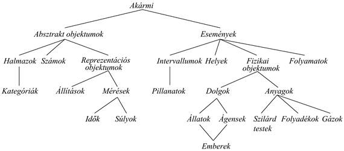

<?xml version="1.0" encoding="UTF-8" standalone="no"?>
<!DOCTYPE html PUBLIC "-//W3C//DTD XHTML 1.1//EN" "http://www.w3.org/TR/xhtml11/DTD/xhtml11.dtd">
<html xmlns="http://www.w3.org/1999/xhtml"><head><meta name="generator" content="DocBook XSL Stylesheets V1.76.1"/></head><body>

<h1 class="title"><a id="id620044"/>10. fejezet - Tudásbázis reprezentáció</h1>

<em>Ebben a fejezetben megmutatjuk, hogy az elsőrendű logikát hogyan kell használni a valódi világ olyan legfontosabb aspektusainak ábrázolására, mint a cselekvés, a tér, az idő, a mentális események és a bevásárlás.</em>

Az utolsó három fejezet a tudásalapú ágens technológiáját mutatta be, avagy az ítélet- és az elsőrendű logika szintaxisát, szemantikáját, bizonyításelméletét és az ilyen logikákat használó ágens implementációját. Ebben a fejezetben azzal a kérdéssel foglalkozunk, hogy milyen <em>tartalmat</em> tegyünk az ágens tudásbázisába, azaz, hogy a világról szóló tényeket hogyan reprezentáljuk.

A 10.1. alfejezet bevezeti az általános ontológia gondolatát, amely világban mindent a kategóriák hierarchiájába szervez. A 10.2. alfejezet az objektumok és a szubsztanciák alapvető kategóriáival foglalkozik. A 10.3. alfejezet a cselekvések reprezentációját elemzi, amelyek a tudásalapú ágens megtervezése szempontjából központi fontosságúak, továbbá bemutatja a tér-idő darabkák, az <strong>esemény</strong>ek (<strong>event</strong>s) általánosabb fogalmát. A 10.4. alfejezet a hiedelmekkel foglalkozik, a 10.5. alfejezet pedig az egészet egybefogja az internetes bevásárlás kontextusában. A 10.6. és a 10.7. alfejezet a bizonytalan és a változó ismeretekkel dolgozó specializált következtető rendszerekkel foglalkozik.

<h1 class="title"><a id="id620070"/>Ontológiaszervezés</h1>

„Játék” tárgyterületeken a reprezentáció megválasztása nem annyira lényeges. Könnyű egy konzisztens fogalomkészletet kialakítani. Az olyan komplex területeken azonban, mint például az interneten történő bevásárlás vagy egy robot vezérlése változó fizikai környezetben, általánosabb és rugalmasabb reprezentációra van szükség. Ebben a fejezetben megmutatjuk, hogy ilyen reprezentációkat hogyan lehet létesíteni, olyan általános fogalmakra fókuszálva, mint a <em>Cselekvés</em>, az <em>Idő</em>, a <em>FizikaiObjektum</em> és a <em>Hiedelem</em>,<em> </em>amelyek számos tárgyterületen fordulnak elő. Ezen absztrakt fogalmak reprezentálását néha <strong>ontológiaszervezés</strong>nek (<strong>ontological engineering</strong>) nevezik. Az ontológiaszervezés kapcsolatban áll a 8.4. alfejezetben leírt tudásszervezés folyamatával, de a hatása szélesebb körű.

A világról <em>mindent</em> reprezentálni ijesztő perspektíva. Valójában természetesen nem fogjuk mindennek a komplex leírását megadni – ez még egy 1000 oldalas könyvnek is sok lenne –, de megjelöljük világosan annak a helyét, ahova egy tetszőleges területről szóló új tudás beilleszthető. Így például definiálni fogjuk, hogy mit is jelent fizikai objektumnak lenni, és a különböző objektumok részletei – robotok, tv-készülékek, könyvek vagy bármi más – később illeszthetők ebbe a keretbe. A fogalmak egy általános keretét <strong>felső ontológiá</strong>nak (<strong>upper ontology</strong>) nevezzük, mert az az általános konvenció, hogy a gráfszerű ábrázolásnál az általánosabb fogalmak felül helyezkednek el, a konkrétabb fogalmak pedig alul (lásd 10.1. ábra).

Mielőtt az ontológiát tovább tekintenénk, egy fontos figyelmeztetést kell tennünk. A tudás tartalmának és szervezésének a megvitatására elsőrendű logikát választottunk. A valódi világ bizonyos aspektusait ezen a nyelven nehéz lesz kifejezni. Egy alapvető tulajdonságot kénytelenek leszünk kihagyni: azt, hogy minden általánosítás alól léteznek kivételek, vagy hogy a részletesebb információ hiányában csupán az alapértelmezést tekinthetjük, vagy pedig hogy minden általánosítás csak egy bizonyos mértékig érvényes. Bár a „paradicsom piros” hasznos szabály, van zöld, sárga és narancssárga paradicsom is. Hasonló kivételeket ebben a részfejezetben majdnem mindegyik állítás esetén lehet találni. A kivételek és a bizonytalanság kezelése nagyon fontos képességek, azonban egy általános ontológia megértéséhez viszonyítva ortogonálisak. Ezért a kivételek és az alapértelmezés megvitatását a 10.6. alfejezetre, a bizonytalan információ sokkal általánosabb témáját pedig a 13. fejezetre hagyjuk.

Milyen haszna van egy felső ontológiának? Gondoljunk vissza a 8.4. alfejezet áramköri ontológiájára. Megkonstruálásánál igen sok egyszerűsítő feltételezéssel éltünk. Így például az időt teljes egészében ki is hagytuk. A jelek rögzítettek voltak, és a jeltovábbterjedésről nem is esett szó. Az áramkörök struktúrája változatlan maradt. Az általánosság felé úgy tudnánk lépni, hogy a jeleket konkrét időpillanatokban definiálnánk és foglalkoznánk a vezetékek hosszával, valamint a vezetékekben és a berendezésekben fellépő jelterjedési késleltetésekkel. Ezzel szimulálni tudnánk az áramkör időzítési tulajdonságait; és valóban az áramkörtervezők gyakran folyamodnak is az ilyen elemzéshez. A kapuk érdekesebb osztályait is be lehetne vezetni, például leírva a technológiát (TTL, MOS, CMOS stb.) és a bemeneti/kimeneti specifikációkat is. Ha a megbízhatósággal vagy diagnózissal szeretnénk foglalkozni, engedélyezni kellene, hogy az áramkör struktúrája spontán módon megváltozhasson. A szórt kapacitások figyelembevételéhez a tisztán topológiai reprezentációval fel kellene hagyni, és át kellene térni a geometriai tulajdonságok valósághűbb leírására.

<a id="id620124"/>
<strong>10.1. ábra - A világ ontológiájának felsőbb szintjei, amelyek a fejezetben később tárgyalt témákat mutatják. Minden él azt jelzi, hogy az alsó fogalom a felső fogalom egy specializálódása.</strong>

Hasonló megfontolások érvényesek, ha a wumpus világát nézzük. Bár foglalkozunk az idővel, ennek struktúrája igen egyszerű. A dolgok csak az ágens cselekvésével egy időben történnek, és minden változás azonnali jellegű. Egy általánosabb, a valódi világhoz jobban illeszkedő ontológia engedélyezné például, hogy az egyidejű változásoknak legyen időbeli kiterjedésük. Arra, hogy egy konkrét négyzetben csapda van, a <em>Csapda</em> konstanst használtuk, mert minden csapda azonos volt. Engedélyezni lehetne a csapdák több fajtáját is, a csapdák osztályához tartozó, eltérő tulajdonságú példányokat használva. Hasonló módon több állatfajtát is be tudnánk vezetni a wumpuson kívül. Elképzelhető, hogy a rendelkezésre álló érzékelésekből az állat konkrét fajtáját nehéz lenne megállapítani. Az ágens megsegítésére a wumpus világ biológiai taxonómiáját fel lehetne állítani, hogy gyenge nyomravezető jelekből képes legyen megjósolni az állat viselkedését.

Az ilyen módosítások révén minden speciális rendeltetésű ontológiában lehetséges egy nagyobb általánosság felé elmozdulni. A nyilvánvaló kérdés ilyenkor az, hogy konvergálnak-e ezek a módosítások egy általános célú ontológiához? Évszázadokon át folyó filozófiai és számítási kutatások után a válasz az, hogy „lehetséges”. Ebben a fejezetben egy lehetséges változatot mutatunk be, amely az évszázadok során született gondolatok szintetizálását képviseli. Az általános célú ontológiának két olyan fő jellemzője van, ami azt a speciális rendeltetésű ontológiák sokaságától megkülönbözteti:

<ul class="itemizedlist"><li class="listitem">
Az általános ontológiát (a tárgytartományra vonatkozó axiómák hozzáadásával) többé-kevésbé minden speciális rendeltetésű tárgytartományban kell tudnunk alkalmazni. Lehetőség szerint tehát egyetlen reprezentációs problémával sem lehet ravaszkodni vagy azt a szőnyeg alá söpörni. 
</li><li class="listitem">
Minden kellően igényes tárgytartományban a tudás egyes részeit <em>egyesíteni</em> kell, hiszen a következtetés és a problémamegoldás egyszerre több területet is igényelhet. Egy robot áramkörjavító rendszer esetén például az áramkörökről a villamos összeköttetések és a fizikai elrendezés szempontjából kell tudnunk következtetni, de az idő az áramkör-időzítési analízis és a munkaköltségek szempontjából egyaránt lényeges. Az időt leíró állításokat tehát össze kell tudnunk kombinálni a fizikai elrendezést leíró állításokkal, és ezeknek az állításoknak egyformán jól kell működniük nanomásodpercekre és percekre is, valamint nanométerekre és méterekre is.
</li></ul>

Miután az általános ontológiát megalkottuk, felhasználjuk az internetes bevásárlás tárgytartományra. Ez a tárgytartomány több mint alkalmas arra, hogy az ontológiánkkal kísérletezzünk. Sok helyet hagy az olvasó részére is, hogy a reprezentációba a saját kreativitását is bevihesse. Gondoljunk például arra, hogy egy interneten bevásárló ágensnek rengeteg témát és szerzőt kell ismernie, hogy az Amazon.com-tól könyveket vásároljon, élelmiszerek egész választékáról kell tudnia, hogy a Peapod.com-nál élelmiszert vásároljon, és mindenről, amit egy bolhapiacon találni lehet ismeretekkel kell rendelkeznie, hogy az Ebay.com[<a id="id620161" href="#ftn.id620161" class="footnote">93</a>]-nál az alkalmi jó üzletekre vadásszon. 

 

[<a id="ftn.id620161" href="#id620161" class="para">93</a>]  Az olvasó elnézését kérjük, ha rajtunk kívül eső okok miatt ezen online boltok valamelyike a könyv olvasásának pillanatában már nem működik.

</body></html>
