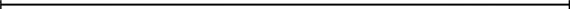

<?xml version="1.0" encoding="UTF-8" standalone="no"?>
<!DOCTYPE html PUBLIC "-//W3C//DTD XHTML 1.1//EN" "http://www.w3.org/TR/xhtml11/DTD/xhtml11.dtd">
<html xmlns="http://www.w3.org/1999/xhtml"><head><meta name="generator" content="DocBook XSL Stylesheets V1.76.1"/></head><body>

<h1 class="title"><a id="id620167"/>Kategóriák és objektumok</h1>

<h3 class="title">Fontos</h3>
Az objektumok <strong>kategóriá</strong>kba (<strong>categories</strong>) való szervezése a tudásreprezentáció szempontjából létfontosságú. Bár a világgal való kölcsönhatás az egyedi objektumok szintjén történik, <em>a következtetések  zöme a kategóriák szintjén valósul meg</em>. A bevásárló célja egy kosárlabda megvásárlása és nem egy konkrét kosárlabdapéldánynak, mondjuk <em>KL</em>9-nek a megvétele. Ha az objektumok osztályozását elvégeztük, kategóriák segítségével megjósolhatjuk az objektumok tulajdonságait. Érzékelő jelek alapján következtetünk bizonyos objektumok jelenlétére, az érzékelt tulajdonságokból következtetünk, hogy az objektumok milyen kategóriákhoz tartoznak, majd a kategóriákra vonatkozó ismereteket felhasználhatjuk, hogy az objektumokra vonatkozóan előrejelzéseket hozzunk. Így például a zöld, foltos felület, a tekintélyes nagyság és az ovális vagy gömbszerű alak alapján görögdinnyére következtethetünk; a görögdinnyére vonatkozó ismereteink alapján pedig arra, hogy az felhasználható lenne gyümölcssaláta készítéséhez.

Az elsőrendű logikában a kategóriák reprezentálására két alapvető választásunk lehet: a predikátumok és az objektumok. Használhatunk egy <em>KosárLabda</em>(<em>l</em>) predikátumszimbólumot, vagy a kategóriát <em>KosárLabda</em> objektumként <strong>reifikál</strong>hatjuk (<strong>reification</strong>). Mondhatjuk akkor, hogy <em>Eleme</em>(<em>l</em>, <em>KosárLabda</em>) (rövidítve <em>l</em> ∈ <em>KosárLabda</em>) annak a kifejezésére, hogy <em>l</em> a kosárlabda-kategória eleme. Azt mondjuk, hogy <em>Részhalmaza</em>(<em>KosárLabda</em>, <em>Labda</em>) (rövidítve <em>KosárLabda</em> ∈ <em>Labda</em>) annak a kifejezésére, hogy a <em>KosárLabda</em> a <em>Labda</em> egy alkategóriája vagy részhalmaza. Egy kategóriát tekinthetünk az elemeiből álló halmaznak, de egy sokkal bonyolultabb objektumnak is képzelhetjük, olyannak, amire az <em>Eleme</em> és a <em>Részhalmaza</em> relációk definiáltak. 

A kategóriák <strong>öröklődés</strong> (<strong>inheritance</strong>) révén szolgálják a tudásbázis szervezését és egyszerűsítését. Ha kijelentjük, hogy az <em>Élelem</em> kategória minden egyes példánya ehető, és feltételezzük, hogy a <em>Gyümölcs</em> <em>Élelem</em>, az <em>Alma</em> viszont a <em>Gyümölcs</em> kategória egy alosztálya, akkor tudjuk, hogy minden alma ehető. Azt mondjuk, hogy az egyes almák az ehetőségi tulajdonságukat <strong>örököl</strong>ték (<strong>inherit</strong>), jelen esetben az <em>Élelem </em>kategóriához való tartozás révén.

Az alosztály-relációk a kategóriákat <strong>taxonómiá</strong>ba vagy<strong> taxonomikus hierarchiá</strong>ba (<strong>taxonomy</strong>, <strong>taxonomic hierarchy</strong>) szervezik. A taxonómiákat tudományos területeken évszázadok óta alkalmazták. Így például a rendszerező biológia az összes élő és kihalt faj taxonómiáját igyekszik megadni, a könyvtártudomány az összes tudományos területet átfogó taxonómiáját – a Dewey Decimális rendszert – alakította ki, az adóhatóságok és más kormányzati szervek a foglalkozások és termékek kiterjedt taxonómiáját hozták létre. A taxonómiák – ahogy a további elemzéseinkben látni fogjuk – fontos aspektusai a józan ész tudásnak is.

A kategóriákról az elsőrendű logikában könnyű állításokat megfogalmazni az objektumok és a kategóriák egymáshoz való rendelésével vagy a kategóriához tartozó egyedek szerinti kvantifikálás révén:

<ul class="itemizedlist"><li class="listitem">
Egy objektum egy kategória egyede, például:
</li></ul>

<code class="code"><em>KL</em>9 ∈ <em>KosárLabda</em></code>

<ul class="itemizedlist"><li class="listitem">
Egy kategória egy másik kategória alosztálya, például:
</li></ul>

<code class="code"><em>KosárLabda</em> ⊂ <em>Labda</em></code>

<ul class="itemizedlist"><li class="listitem">
Egy kategória összes egyede egy bizonyos tulajdonsággal rendelkezik, például:
</li></ul>

<code class="code">	∀<em>x</em> ∈ <em>KosárLabda</em> ⇒ <em>Gömbölyű</em>(<em>x</em>)</code>

<ul class="itemizedlist"><li class="listitem">
Egy kategória egyedeit bizonyos tulajdonságaik alapján fel lehet ismerni, például:
</li></ul>

<code class="code"><em>	Narancsszinű</em>(<em>x</em>) ∧ <em>Gömbölyű</em>(<em>x</em>) ∧ <em>Átmérő</em>(<em>x</em>) = 24 ∧ <em>x</em> ∈ <em>Labda</em> ⇒ <em>x</em> ∈ <em>KosárLabda</em></code>

<ul class="itemizedlist"><li class="listitem">
Egy kategóriának önmagában bizonyos tulajdonságai vannak, például:
</li></ul>

<code class="code">	<em>Kutya</em> ∈ <em>HonosítottFajta</em></code>

Jegyezzük meg, hogy mivel a <em>Kutya</em> egy kategória és a <em>HonosítottFajta</em> kategóriának egy egyede, így a <em>HonosítottFajta</em> a kategóriák kategóriája. A kategóriák kategóriáinak a kategóriáiról is lehetne beszélni, de ennek kevés a haszna.

Bár az alosztály- és az egyedrelációk a kategóriák szempontjából a legfontosabbak, olyan kategóriák közötti relációkat is ki szeretnénk fejezni, amelyek egymásnak nem alosztályai. Ha például azt mondjuk, hogy a <em>Hím </em>és a <em>Nőstény </em>az<em> Állat </em>alosztályai, ezzel nem mondtuk azt, hogy egy hím nem lehet nőstény. Azt mondjuk, hogy két vagy több kategória <strong>diszjunkt</strong> (<strong>disjoint</strong>), ha közös egyedei nincsenek. Ha tudjuk azt is, hogy a hímek és a nőstények kölcsönösen kizárják egymást, attól még nem tudjuk, hogy egy állatnak, amely nem hím, nősténynek kell lennie, hacsak nem mondjuk ki, hogy a hímek és a nőstények az állatok <strong>kimerítő felosztás</strong>át (<strong>exhaustive decomposition</strong>) képezik. A diszjunkt kimerítő felosztás a <strong>partíció</strong> (<strong>partition</strong>). Ezt a három fogalmat az alábbi példák illusztrálják:

<code class="code"><em>Diszjunkt</em>({<em>Állat</em>, <em>Zöldség</em>})</code>

<code class="code"><em>KimerítőFelosztás</em>({<em>Amerikai</em>, <em>Kanadai</em>, <em>Mexikói</em>}, <em>ÉszakAmerikai</em>)</code>

<code class="code"><em>Partíció</em>({<em>Hím</em>, <em>Nőstény</em>}, <em>Állat</em>)</code>

(Jegyezzük meg, hogy az <em>ÉszakAmerikai</em> <em>KimerítőFelosztás</em>-a nem <em>Partíció</em>, mert vannak kettős állampolgárságú személyek is.) E három predikátum definíciója az alábbi:

<code class="code"><em>Diszjunkt</em>(<em>s</em>) ⇔ (∀<em>c</em>1, <em>c</em>2 <em>c</em>1 ∈ <em>s</em> ∧ <em>c</em>2 ∈ <em>s</em> ∧ <em>c</em>1 ≠ <em>c</em>2 ⇒ <em>Metszet</em>(<em>c</em>1, <em>c</em>2) = { })</code>

<code class="code"><em>KimerítőFelosztás</em>(<em>s</em>, <em>c</em>) ⇔ (∀<em>i</em> <em>i</em> ∈ <em>c</em> ⇔ ∃<em>c</em>2 <em>c</em>2 ∈ <em>s</em> ∧ <em>i</em> ∈ <em>c</em>2)</code>

<code class="code"><em>Partíció</em>(<em>s</em>, <em>c</em>) ⇔ <em>Diszjunkt</em>(<em>s</em>) ∧ <em>KimerítőFelosztás</em>(<em>s</em>, <em>c</em>)</code>

Kategóriákat úgy is <em>definiálhatunk,</em> hogy megadjuk a tagságuk elégséges és szükséges feltételeit. Például egy agglegény egy felnőtt, nem házas férfi: 

<code class="code"><em>x </em>∈ <em>Agglegény</em> ⇔ <em>NemHázas</em>(<em>x</em>) ∧ <em>x </em>∈ <em>Felnőtt</em> ∧ <em>x </em>∈ <em>Férfi</em></code>

Ahogy erről a természetes fajtákról szóló rövid kitérőben szó lesz, a kategóriák szigorú logikai definíciója nem mindig lehetséges, és nem is mindig szükséges.

<h2 class="title"><a id="id620772"/>Fizikai összetétel</h2>

Az a gondolat, hogy egy objektum része lehet egy másik objektumnak, nem újkeletű. Valakinek az orra része a fejének, Románia Európa része, ez a fejezet a könyvünk egy része. Hogy megmondhassuk, hogy egy dolog része egy másiknak, egy általános <em>Része</em> relációt fogunk használni. Az objektumokat tehát <em>Része</em> hierarchiába lehet szervezni, ami hasonlít a <em>Részhalmaza</em> hierarchiára:

<code class="code"><em>Része</em>(<em>Bukarest</em>, <em>Románia</em>)</code>

<code class="code"><em>Része</em>(<em>Románia</em>, <em>KeletEurópa</em>)</code>

<code class="code"><em>Része</em>(<em>KeletEurópa</em>, <em>Európa</em>)</code>

<code class="code"><em>Része</em>(<em>Európa</em>, <em>Föld</em>)</code>

A <em>Része</em> reláció tranzitív és reflexív, azaz:

<code class="code"><em>Része</em>(<em>x</em>, <em>y</em>) ∧ <em>Része</em>(<em>y</em>, <em>z</em>) ⇒<em> Része</em>(<em>x</em>, <em>z</em>)</code>

<code class="code"><em>Része</em>(<em>x</em>, <em>x</em>)</code>

Ebből adódóan kikövetkeztethető, hogy <em>Része</em>(<em>Bukarest</em>, <em>Föld</em>)

Az <strong>összetett objektum</strong>ok (<strong>composite object</strong>) kategóriáit gyakran ezen objektumok részei között értelmezett strukturális relációkkal jellemezzük. Például egy kétlábúnak pontosan két lába van, ami egy testhez van rögzítve:

<code class="code"><em>KétLábú</em>(<em>a</em>) ⇒ ∃<em>l</em>1, <em>l</em>2, <em>b</em> <em>Láb</em>(<em>l</em>1) ∧ <em>Láb</em>(<em>l</em>2) ∧ <em>Test</em>(<em>b</em>) ∧ <em>Része</em>(<em>l</em>1,<em> a</em>)  ∧ <em>Része</em>(<em>l</em>2,<em> a</em>)</code>

<code class="code">			∧ <em>Része</em>(<em>b</em>, <em>a</em>) ∧ <em>Rögzített</em>(<em>l</em>1, <em>b</em>) ∧ <em>Rögzített</em>(<em>l</em>2, <em>b</em>) ∧ <em>l</em>1 ≠ <em>l</em>2</code>

<code class="code">			∧ [∀<em>l</em>3  <em>Láb</em>(<em>l</em>3) ∧ <em>Része</em>(<em>l</em>3,<em> a</em>) ⇒ (<em>l</em>3 = <em>l</em>1 ∨ <em>l</em>3 = <em>l</em>2)</code>

A „pontosan kettő” jelölés egy kicsit fura. Kénytelenek vagyunk kijelenteni, hogy két láb van, és ezek nem azonosak, és ha valaki egy harmadik lábbal jön elő, annak azonosnak kell lennie a kettő valamelyikével. A 10.6. alfejezetben látni fogjuk, hogy a leíró logikának nevezett formalizmus a „pontosan kettő” típusú korlátozásokat egyszerűbben fejezi ki.

A kategóriákra vonatkozó <em>Partíció</em> reláció mintájára egy <em>RészPartíció</em> relációt definiálhatunk (lásd 10.6. feladat). Egy objektum a <em>RészPartíció</em>-jában felsorolt részeiből áll, és bizonyos tulajdonságaira ezekből a részekből lehet következtetni. Így például egy összetett objektum tömege a részeihez tartozó tömegek összege. Jegyezzük meg, hogy ez a kategóriákra nem vonatkozik: egy kategóriának nincs tömege annak ellenére, hogy az elemeinek lehet tömege.

Hasznos olyan összetett objektumokat is definiálni, amelyeknek meghatározott részei vannak, de konkrét struktúrájuk nincsen. Előfordulhat, hogy azt szeretnénk mondani, hogy: „A zacskóban 3 kg alma van.” Kísértést érezhetnénk, hogy a zacskóban-alma <em>halmazhoz</em> súlyt rendeljük, ez azonban hiba lenne, mert egy halmaz absztrakt matematikai fogalom, aminek vannak elemei, de súlya nincs. Ahelyett egy új fogalomra van szükségünk, amit <strong>köteg</strong>nek (<strong>bunch</strong>) fogunk nevezni. Ha az almák például az <em>Alma</em>1, az <em>Alma</em>2 és az <em>Alma</em>3, akkor a:

<code class="code"><em>Köteg</em>({<em>Alma</em>1, <em>Alma</em>2, <em>Alma</em>3})</code>

a három almából (mint részből, de nem mint elemből) álló összetett objektumot jelöli. A köteget egy közönséges, bár nem strukturált objektumként használhatjuk. Jegyezzük meg, hogy <em>Köteg</em>({<em>x</em>}) = <em>x.</em>Továbbá, hogy a <em>Köteg</em>(<em>Alma</em>) az összes almából álló összetett objektum, amit az <em>Alma</em> kategóriával összetéveszteni nem szabad.

A <em>Köteg</em>-et a <em>Része</em> relációval tudjuk definiálni. Az <em>s</em> minden eleme, eleme a <em>Köteg</em>({<em>s</em>})-nek is:

<code class="code">∀<em>x </em> <em>x</em> ∈ <em>s</em> ⇒ <em>Része</em>(<em>x</em>, <em>Köteg</em>(<em>s</em>))</code>

Továbbá, a <em>Köteg</em>(<em>s</em>) a legkisebb objektum, amely ezt a feltételt teljesíti. Más szóval a <em>Köteg</em>(<em>s</em>) részének kell lennie minden olyan objektumnak, amely az <em>s</em> összes elemét részeként tartalmazza:

<code class="code">∀<em>y</em> [∀<em>x x</em> ∈ <em>s</em> ⇒ <em>Része</em>(<em>x, y</em>)] ⇒ <em>Része</em>(<em>Köteg</em>(<em>s</em>), <em>y</em>)</code>

Ezek az axiómák a <strong>logikai minimalizálás</strong>nak (<strong>logical minimization</strong>) nevezett általános módszer egy példáját jelentik. A logikai minimalizálás azt jelenti, hogy egy objektumot bizonyos feltételeket kielégítő legkisebb objektumnak definiálunk.

<h2 class="title"><a id="id621323"/>Mértékek</h2>

A világnak mind a tudományos, mind a józan ész elméleteiben az objektumoknak magassága, tömege, ára van és így tovább. Az ezekhez a tulajdonságokhoz előírt értékek a <strong>mérték</strong>ek (<strong>measure</strong>s). Közönséges, kvantitatív mértékeket könnyű reprezentálni. Képzeljük el, hogy az univerzum absztrakt „mértékobjektumokat” tartalmaz, mint például a <em>hossz</em>, ami az itt látható vonalszegmens hossza: 

Nevezhetjük ezt a hosszat 1,5 hüvelyknek vagy 3,81 cm-nek. Ugyanannak a hossznak tehát a nyelvünkben több, különböző neve is lehet. Logikailag ez úgy lehetséges, hogy egy <strong>egységfüggvény</strong>t (<strong>unit function</strong>) egy számmal kombinálunk. (Egy alternatív sémával a 10.8. feladatban foglalkozunk.) Ha <em>L</em>1 a vonalszegmens neve, akkor azt írhatjuk, hogy:

<code class="code"><em>Hossz</em>(<em>L</em>1) = <em>Hüvelyk</em>(1,5) = <em>Centiméter</em>(3,81)</code>

Az egységek közötti konverziót olyan állításokkal lehet megoldani, amelyek az egyik egység többszörösét a másik egységgel teszik azonossá:

<code class="code"><em>Centiméter</em>(2,54 × <em>l</em>) = <em>Hüvelyk</em>(<em>l</em>)</code>

Hasonló axiómákat a fontokra és kilogrammokra, a másodpercekre és a napokra, a dollárokra és a centekre is felírhatunk. A mértékekkel az objektumokat az alábbi módon tudjuk leírni:

<code class="code"><em>Átmérő</em>(<em>KosárLabda</em>12) = <em>Hüvelyk</em>(9,5)</code>

<code class="code"><em>Ár</em>(<em>KosárLabda</em>12) = $(19)</code>

<code class="code"><em>d</em> ∈ <em>Napok</em> ⇒ <em>Tartam</em>(<em>d</em>) = <em>Óra</em>(24)</code>

Jegyezzük meg, hogy a $(1) nem egy egydolláros bankó! Az egydolláros bankóból lehet kettő, de a $(1) nevű objektumból csak egy van. Jegyezzük meg azt is, hogy míg a <em>Hüvelyk</em>(0) és <em>Centiméter</em>(0) ugyanarra a zérushosszra hivatkozik, más zérusmértékekkel, mint például a <em>Másodperc</em>(0) nem azonosak.

Egyszerű, kvantitatív mértékeket reprezentálni könnyű. Más mértékek több problémát okoznak, mert nincs hozzájuk elfogadott értékskála. A gyakorlat nehéz, a desszert finom és a vers szép, azonban e kvalitásokhoz nehéz számokat rendelni. Valaki megkísérelhetné az ilyen tulajdonságokat teljesen elutasítani, mint olyanokat, melyeknek a logikai következtetés szempontjából nincs hasznuk, vagy – ami még rosszabb – megkísérelhetne a szépségre egy numerikus skálát rákényszeríteni. Ez súlyos hiba lenne, mert ilyen lépésre nincs is szükség. A mértékek legfontosabb tulajdonsága nem az, hogy valamilyen konkrét numerikus értékkel rendelkeznek, hanem, hogy <em>rendezettek</em>.

Annak ellenére, hogy a mértékek nem számok, összehasonlításukra a &gt; rendező szimbólumot fogjuk használni. Így például hihetjük azt, hogy a Norvig írta feladatok nehezebbek, mint azok, amiket Russell írt, és hogy egy nehezebb feladatnál kevesebb pontot lehet elérni:

<code class="code"><em>e</em>1  ∈ <em>Feladatok </em>∧ <em>e</em>2 ∈ <em>Feladatok </em>∧ <em>Írta</em>(<em>Norvig</em>, <em>e</em>1) ∧ <em>Írta</em>(<em>Russell</em>, <em>e</em>1) ⇒</code>

<code class="code">	      <em>Nehézség</em>(<em>e</em>1) &gt; <em>Nehézség</em>(<em>e</em>2)</code>

<code class="code"><em>e</em>1  ∈ <em>Feladatok</em> ∧ <em>e</em>2 ∈ <em>Feladatok </em>∧ <em>Nehézség</em>(<em>e</em>1) ∧ <em>Nehézség</em>(<em>e</em>2) ⇒</code>

<code class="code">		     <em>VárhatóEredmény</em>(<em>e</em>1) &lt; <em>VárhatóEredmény</em>(<em>e</em>2)</code>

Ez elég is ahhoz, hogy valaki eldönthesse, melyik feladattal érdemes foglalkoznia, bármennyire nem használtunk semmiféle numerikus értéket a nehézség kifejezésére. (Azért azt meg kell tudnunk állapítani, hogy melyik feladatot ki írta.) A mértékek közötti efféle monoton reláció az alapja a <strong>kvalitatív fizika</strong> (<strong>qualitative physics</strong>) területének. Ez az MI egy részterülete, amely azt vizsgálja, hogy hogyan lehetne a fizikai rendszerekre következtetni anélkül, hogy a részletes egyenletekbe és a numerikus szimulációkba belebonyolódnánk. A kvalitatív fizikával a történeti megjegyzésekben foglalkozunk.

<h3 class="title">Fontos</h3>
<strong>Természetes fajták</strong>

Egyes kategóriáknak szigorú definíciói vannak. Egy objektum akkor és csak akkor háromszög, ha egy háromoldalú sokszög. A valódi világban viszont a kategóriák többsége <strong>természetes fajtájú</strong> (<strong>natural kind</strong>) anélkül, hogy bármilyen letisztult definíciója lenne. Tudjuk például, hogy a paradicsomok mélyvörös színűek és nagyjából gömbszerűek szoktak lenni, a tetejükön, ahol a száruk csatlakozott, egy kis bemélyedéssel rendelkeznek, nagyjából 5–8 cm átmérőjűek, és vékony, de erős bőrrel, belül hússal, magvakkal és lével rendelkeznek. Azt is tudjuk azonban, hogy eltérések is vannak. Egyes paradicsomok narancsszínűek, az éretlen paradicsom zöld, egyesek kisebbek, illetve nagyobbak, mint az átlag, a miniparadicsomok egységesen kisméretűek. Ahelyett hogy a paradicsomok tökéletes definíciójára törekednénk, inkább egy tulajdonsághalmazzal rendelkezünk, amely arra szolgál, hogy azonosítsunk bizonyos objektumokat, amelyek nyilvánvalóan tipikus paradicsomok, más objektumok esetén azonban lehet, hogy a felismerés csődöt mond. (Lehet egy paradicsom szőrös, mint egy őszibarack?)

Egy logikai ágens részére ez problémát jelent. Az ágens nem lehet biztos abban, hogy az általa érzékelt objektum valóban egy paradicsom, és ha mégis biztos lenne benne, nem tudná eldönteni, hogy a tipikus paradicsom tulajdonságai közül az érzékelt objektum melyekkel rendelkezik. Ez a probléma egyenes következménye annak, hogy az ágens egy hozzáférhetetlen környezetben működik. 

Egy hasznos megközelítés szétválasztani mindazt, ami a kategória minden egyedére igaz, attól, ami csupán a kategória tipikus egyedeire igaz. A <em>Paradicsom</em> kategória mellett szükség van még a <em>Tipikus</em>(<em>Paradicsom</em>) kategóriára. A <em>Tipikus</em> függvény egy kategóriát egy olyan alosztályra képez le, amely csak tipikus egyedekből áll:

<code class="code"><em>Tipikus</em>(<em>c</em>) ⊆ <em>c</em></code>

A természetes fajtákra vonatkozó tudás többsége tulajdonképpen tipikus egyedekről szól:

<code class="code"><em>x</em> ∈ <em>Tipikus</em>(<em>Paradicsom</em>) ⇒ <em>Piros</em>(<em>x</em>) ∧ <em>Gömbölyű</em>(<em>x</em>)</code>

Ily módon képesek vagyunk a kategóriákra vonatkozó fontos tényeket feljegyezni anélkül, hogy pontos definíciókat kellene megadnunk.

Azzal, hogy a természetes kategóriák többsége esetén az egzakt definíció megalkotása nehézségekbe ütközik, részletesen Wittgenstein foglalkozott a <em>Philosophical Investigations</em> c. művében (Wittgenstein, 1953). A <em>játékok</em> példáját használta fel, hogy kimutassa, a kategória egyedei inkább egyfajta „családi hasonlóságban” és nem valami szükséges és elégséges jellegzetességekben osztoznak. 

Quine szintén támadta a szigorú definíció hasznosságát (Quine, 1953). Azt mutatta ki, hogy az „agglegény” definíciója, mint egy nem házas felnőtt férfi is gyanús. Valaki megkérdőjelezhetné például, hogy „A Pápa agglegény” értelmes állítás-e. Bár nem kifejezetten <em>hamis</em>, ez a fogalomhasználat mégis <em>szerencsétlen</em>, mert az olvasónak nem szándékolt következtetések levonását teszi lehetővé. A feszültséget fel lehetne oldani megkülönböztetést téve a tudásreprezentációban való belső használatra alkalmas logikai definíció és a helyes nyelvészeti használat jobban árnyalt kritériumai között. A másik megkapható az elsőből a levont következtetések szűrésével. Az is lehetséges, hogy a nyelvészeti használat kudarcai visszacsatolásként hatnak a belső definíció módosítása érdekében, fölöslegessé téve a szűrést.

<h2 class="title"><a id="id621725"/>Szubsztanciák és objektumok</h2>

A világot lehetne úgy szemlélni, hogy primitív objektumokból (részecskékből) és az azokból felépülő összetett objektumokból áll. Az olyan nagy objektumok, mint például az almák vagy az autók szintjén végzett következtetéssel meg tudunk birkózni a primitív objektumok óriási számából eredő bonyolultsággal. A valóság tekintélyes része azonban az <strong>egyedesítés</strong> (<strong>individuation</strong>) – az elkülönülő objektumokra való felbontásnak – látszólag ellenáll. A valóságnak ezt a részét az <strong>anyag</strong> (<strong>stuff</strong>) általános névvel fogjuk illetni. Példaképpen tételezzük fel, hogy van előttem egy malac és egy kevés vaj.[<a id="id621751" href="#ftn.id621751" class="footnote">94</a>] Azt mondhatom, hogy malacból egy van, de a „vaj objektum” nem megszámlálható, hiszen akármilyen része a vaj objektumnak szintén vaj objektum, legalábbis amíg az igazán kicsi részekhez el nem jutunk. Ez az anyag és a dolgok közötti fő különbség. Sajnos nem lesz két malacunk, ha a malacot kettészeljük. 

Vegyük észre, hogy a magyar nyelv az anyag és a dolgok között különbséget tesz.[<a id="id621766" href="#ftn.id621766" class="footnote">95</a>] Azt mondjuk „egy malac”, de bizonyos éttermi vagy bolti gyakorlattól eltekintve, nem mondhatjuk azt, hogy „egy vaj”. A nyelvészek különbséget tesznek a <strong>megszámlálható főnevek</strong> (<strong>count nouns</strong>), mint például malacok, gödrök vagy tételek, és a <strong>nem megszámlálható főnevek</strong> (<strong>mass nouns</strong>), mint például vaj, víz és energia között. Néhány versengő ontológiáról azt állítják, hogy e különbségeket képes kezelni. Az egyiket itt írjuk le, a többiről a történeti feljegyzésekben lehet olvasni.

Hogy az anyagot jól reprezentálhassuk, egy nyilvánvaló dologgal kezdünk. Ontológiánkban az anyag nagyobb kötegeit kell tudnunk objektumként kezelni. Például a vajban felismerjük azt a vajat, amit tegnap este az asztalon hagytunk, esetleg felemelhetjük, megmérhetjük, eladhatjuk, vagy akármi mást csinálhatunk vele. Ilyen értelemben ez egy objektum, pontosan olyan, mint egy malac. Nevezzük <em>Vaj</em>3-nak. Definiálni fogjuk a <em>Vaj</em> kategóriát is. Ennek elemei, informálisan, mindazok az objektumok, amikre azt lehet mondani: „Ez vaj”, a <em>Vaj</em>3-at is beleértve. A nagyon kicsi, de most elhanyagolt alkotórészek szerepére vonatkozó intésről nem megfeledkezve, a vaj objektum minden része szintén vaj objektum:

<code class="code"><em>x</em> ∈ <em>Vaj </em>∧ <em>Része</em>(<em>y</em>, <em>x</em>) ⇒ <em>y</em> ∈ <em>Vaj</em></code>

Most már mondhatjuk, hogy vaj kb. 30 foknál olvad meg:

<code class="code"><em>Vaj</em>(<em>x</em>) ⇒ <em>OlvadásiPont</em>(<em>x</em>, <em>Celsius</em>(30))</code>

A vaj sárga, kevésbé sűrű, mint a víz, szobahőmérsékleten puha, magas zsírtartalmú stb. Másrészt a vajnak nincs konkrét nagysága, alakja vagy súlya. Specializáltabb kategóriákat is definiálhatunk, mint például <em>NemSózottVaj</em>, ami szintén egy anyag, mert a nem sózott vaj objektum akármilyen része szintén nem sózott vaj objektum. Ha azonban az <em>EgyKilóVaj</em> kategóriát definiáljuk, amely az összes, egy kiló súlyú vaj objektumot tartalmazza, nincs többé anyagunk! Ha egy kiló vajat kettévágunk, nem kapunk kétszer egy kiló vajat – ami a valódi világ azon bosszantó dolgainak egyike, amivel sajnos együtt kell élni.

Valójában arról van szó, hogy vannak ún. <strong>belső</strong> (<strong>intrinsic</strong>) <strong>tulajdonság</strong>ok: ezek inkább magához az objektum szubsztanciájához tartoznak, mint az objektum egészéhez. Ha valamit kettévágunk, a részei a belső tulajdonságukat megtartják – legyen ez sűrűség, forráspont, íz, szín, a tulajdonos stb. A <strong>külső</strong> (<strong>extrinsic</strong>) <strong>tulajdonság</strong>ok éppen az ellenkezőt jelentik: olyan tulajdonságokat, mint a súlyt, hosszat, alakot, funkciót stb., amelyeket a részekre bontásnál megtartani nem lehet.

Az objektumok olyan osztálya, amelyek definíciójában csakis <em>belső</em> tulajdonságok szerepelnek, a szubsztanciák, illetve a nem megszámlálható főnevek osztálya. Az az osztály, amelynek definíciójában <em>bármilyen</em> külső tulajdonság is szerepel, a megszámlálható főnevek osztálya. Az <em>anyag</em> kategória a legáltalánosabb szubsztanciakategória, egyetlen belső tulajdonsága sincs. A <em>dolog</em> a diszkrét objektumok legáltalánosabb kategóriája, egyetlen külső tulajdonsága sincs. Minden fizikai objektum mindkét kategóriába tartozik, így a kategóriák együtt léteznek – ugyanazokra az entitásokra utalnak. 

 

[<a id="ftn.id621751" href="#id621751" class="para">94</a>]  A szövegben eredetileg „aardvark” (földimalac) szerepel, ami egy malacszerű dél-afrikai állatfajta. (<em>A ford.</em>)

[<a id="ftn.id621766" href="#id621766" class="para">95</a>]  A szövegben eredetileg természetesen angol példa szerepel – „an aardvark” és „a butter/butter”. (<em>A ford.</em>)

</body></html>
