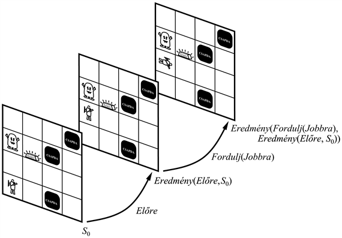
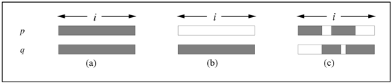
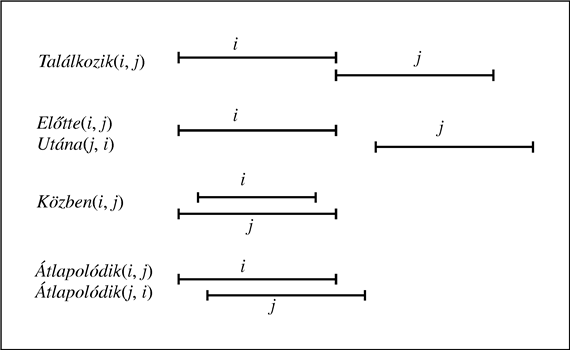
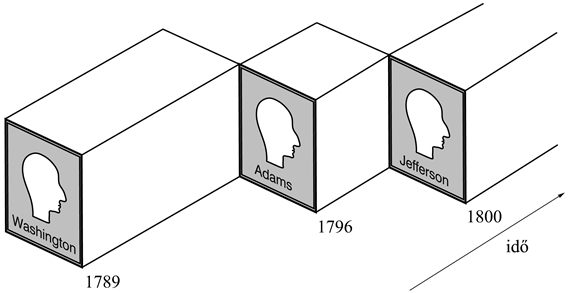

<?xml version="1.0" encoding="UTF-8" standalone="no"?>

<html xmlns="http://www.w3.org/1999/xhtml"><head><meta name="generator" content="DocBook XSL Stylesheets V1.76.1"/></head><body>

<h1 class="title"><a id="id623596"/>Cselekvések, szituációk és események</h1>

A cselekvések eredményeiről következtetni kulcsfontosságú egy tudásalapú ágens számára. A 7. fejezetben példákat láttuk olyan ítéletállításokra, amelyek leírják, hogy a cselekvések hogyan hatnak a wumpus világra. A <a class="xref" href="ch07s06.md#ID_283_oldal">„A hely és az irány nyomkövetése”</a> részben lévő (7.3) egyenlet azt állítja például, hogy az ágens lokációja hogyan változik az ágens mozgásával. Az ítéletkalkulus egyik hátránya, hogy cselekvés leírásáról külön másolatokkal kell rendelkeznünk azokra az időpontokra, amikor a cselekvést végre fogják hajtani. Ebben az alfejezetben leírt, az elsőrendű logikára alapozó reprezentációs módszer ezt a problémát elkerüli.

<h2 class="title"><a id="id623605"/>A szituációkalkulus ontológiája</h2>

Az axiómák többszörös másolatainak az elkerülésére nyilvánvaló módszer az idő szerinti kvantifikálás – azaz azt mondani, hogy „∀<em>t</em>-re a <em>t</em>-beli cselekvésnek ez a <em>t</em> + 1-beli eredménye”. A <em>t</em> + 1 típusú explicit időpillanatok helyett ebben az alfejezetben szituációkkal dolgozunk, amelyek a cselekvések végrehajtásából adódó állapotok jelölései. E megközelítés neve <strong>szituációkalkulus</strong> (<strong>situation calculus</strong>) és az alábbi ontológiára támaszkodik:

<ul class="itemizedlist"><li class="listitem">
A 8. fejezethez hasonlóan a cselekvések logikai termek, például az <em>Előre</em>, a <em>Fordulj</em>(<em>Jobbra</em>). Egyelőre feltételezzük, hogy a környezetben csakis egy ágens tartózkodik. (Ha több lenne, egy további argumentummal megjelölhetjük, hogy melyik ágens hajtja végre a cselekvést).
</li><li class="listitem">
A <strong>szituáció</strong>k (<strong>situation</strong>s) logikai termek, amelyekhez tartozik egy (általában <em>S</em>0-nak jelölt) kezdeti szituáció és minden más szituáció, amely a szituációra vonatkozó cselekvés végrehajtásából adódott. Ha az <em>a</em> cselekvést az <em>s</em> szituációban hajtották végre, az eredményezett szituációt <em>Eredmény</em>(<em>a</em>, <em>s</em>) (néha <em>Csináld</em>-nak nevezett) függvény nevezi meg. A gondolatot a 10.2. ábra illusztrálja.
</li><li class="listitem">
A <strong>folyó esemény</strong>ek (<strong>fluent</strong>s) olyan függvények és predikátumok, amelyek szituációról szituációra változnak. Ilyen például az ágens lokációja vagy a wumpus jóléte. A szótár szerint a folyó valamilyen folyadékszerű viselkedésre utal. Használatunkban a szituációk menti lefolyását vagy változását jelenti. ¬<em>Tart</em>(<em>G</em>1, <em>S</em>0) például azt mondja, hogy az ágens a kezdeti <em>S</em>0 szituációban a <em>G</em>1 aranyat nem tartja a kezében. <em>Kor</em>(Wumpus, <em>S</em>0) a wumpus <em>S</em>0-beli életkorára vonatkozik.
</li><li class="listitem">
Engedélyezzük az <strong>időtlen</strong>, <strong>örök</strong> (<strong>atemporal</strong>, <strong>eternal</strong>) predikátumokat és függvényeket is. Példaként tekinthetjük az <em>Arany</em>(<em>G</em>1) vagy a <em>BalLába</em>(<em>Wumpus</em>) predikátumokat.
</li></ul>

Az egyedi cselekvéseken túlmenően hasznos, ha a cselekvések sorozatairól is tudunk következtetni. A sorozat eredményét az egyedi cselekvések eredménye alapján definiálhatjuk. Először azt fogjuk mondani, hogy egy üres sorozat végrehajtása a szituációt változatlanul meghagyja:

<code class="code"><em>Eredmény</em>([], <em>s</em>) = <em>s</em></code>

<a id="id623810"/>
<strong>10.2. ábra - Szituációkalkulusban minden szituáció (az <em>S</em>0-t kivéve) valamilyen cselekvés eredménye</strong>

Egy nem üres sorozat végrehajtása nem más, mint az első cselekvés végrehajtása, majd az eredményül adódó szituációban a maradó sorozatnak a végrehajtása:

<code class="code"><em>Eredmény</em>([<em>a</em>]<em>sorozat</em>, <em>s</em>) = <em>Eredmény</em>(<em>sorozat</em>, <em>Eredmény</em>(<em>a</em>, <em>s</em>))</code>

Egy szituációkalkulus ágensnek tudnia kellene egy adott cselekvéssorozat eredményét kikövetkeztetni, ez az ún. <strong>előrevetítő feladat</strong> (<strong>projection task</strong>). A megfelelő konstruktív következtetési mechanizmus birtokában képesnek kellene lennie arra is, hogy egy kívánatos eredményt biztosító sorozatot <em>megtaláljon, </em>ez az ún. <strong>tervkészítési feladat</strong> (<strong>planning task</strong>).

Egy módosított wumpus világról fogunk példát venni, ahol az ágens orientációjával nem törődünk, és ahol az ágens egy helyről egy szomszédos helyre <em>Megy</em>. Tegyük fel, hogy ágens az [1, 1]-nél és arany az [1, 2]-nél van. A cél az aranyat az [1,1] helyen birtokoljuk. A folyó esemény predikátumok a <em>Nála</em>(<em>o</em>, <em>x</em>, <em>s</em>) és <em>Tart</em>(<em>o</em>, <em>s</em>). A kezdeti tudásbázis az alábbi leírást tartalmazhatná:

<code class="code"><em>Nála</em>(<em>Ágens</em>, [1, 1], <em>S</em>0) ∧ <em>Nála</em>(<em>G</em>1, [1, 2], <em>S</em>0)</code>

Ez azonban még nem elég, mert nem mondtuk, hogy az <em>S</em>0-ban mi <em>nem</em> igaz (a probléma további elemzését lásd a <a class="xref" href="ch10s07.md#ID_425_oldal">„Következtetés alapértelmezett információval”</a> részben). A teljes leírás az alábbi:

<code class="code"><em>Nála</em>(<em>o</em>, <em>x</em>, <em>S</em>0) ⇔ ∧ [(<em>o </em>= <em>Ágens</em> ∧ <em>x</em> = [1, 1]) ∨ (<em>o</em> = <em>G</em>1 ∧ <em>x </em>= [1, 2])]</code>

<code class="code">¬<em>Tart</em>(<em>o</em>, <em>S</em>0)</code>

Arra is szükség van, hogy kijelentsük, <em>G</em>1 egy arany, és [1, 1] és [1, 2] szomszédosak:

<code class="code"><em>Arany</em>(<em>G</em>1) ∧ <em>Szomszédos</em>([1, 1], [1, 2]) ∧ <em>Szomszédos</em>([1, 2], [1, 1])</code>

Valaki bizonyára azt szeretné bebizonyítani, hogy ágens a célját eléri, ha az [1, 2]-re átmegy, ott megfogja az aranyat és az [1, 1]-re visszatér, azaz:

<code class="code"><em>Nála</em>(<em>G</em>1, [1, 1], <em>Eredmény</em>([<em>Megy</em>([1, 1], [1, 2]), <em>Megfog</em>(<em>G</em>1), <em>Megy</em>([1, 2], [1, 1])], <em>S</em>0)</code>

Annál érdekesebb lehetőség az arany birtoklását biztosító tervet készíteni, amit a „milyen cselekvéssorozat eredménye az arany az [1, 1]-en?” kérdés megválaszolásával lehet megtenni. 

<code class="code">∃<em>sorozat  Nála</em>(<em>G</em>1, [1, 1], <em>Eredmény</em>(<em>sorozat</em>, <em>S</em>0))</code>

Nézzük, hogy e kérdések megválaszolásához mivel kellene a tudásbázist kiegészíteni.

<h2 class="title"><a id="id624124"/>Cselekvések leírása a szituációkalkulusban</h2>

A szituációkalkulus legegyszerűbb változatában minden cselekvést két axiómával lehet leírni. A <strong>lehetőségi axióma</strong> (<strong>possibility axiom</strong>) megmondja, hogy a cselekvést mikor lehet elvégezni, a <strong>hatásaxióma</strong> (<strong>effect axiom</strong>) pedig azt, hogy a cselekvés végrehajtásával mi is fog történni. Annak jelölésére, hogy az <em>s</em> szituációban az <em>a</em> cselekvés végrehajtása lehetséges, a <em>Lehet</em>(<em>a</em>, <em>s</em>) predikátumot fogjuk használni. Az axiómák formája az alábbi:

<code class="code">Lehetőségi Axióma: <em>Előfeltételek </em>⇒ <em>Lehet</em>(<em>a</em>, <em>s</em>)</code>

<code class="code">Hatásaxióma: <em>Lehet</em>(<em>a</em>, <em>s</em>) ⇒ <em>A cselekvés végrehajtásából adódó változások</em></code>

Ezeket az axiómákat a módosított wumpus világra fogjuk felírni. A mondatok rövidsége érdekében el fogjuk hagyni az egész mondatra vonatkozó univerzális kvantorokat. Feltételezzük, hogy az <em>s</em> változó a szituációkra, az <em>a</em> változó a cselekvésekre, az <em>o</em> változó az objektumokra (az ágenseket beleértve), a <em>g</em> változó az aranyra, az <em>x</em> és az <em>y</em> változók pedig a helyre vonatkoznak.

Az erre a világra vonatkozó lehetőségi axióma azt mondja, hogy egy ágens a szomszédos helyek között mozoghat, az aktuális helyen megfoghatja az aranyat és elengedheti az aranyat, amelyet tartott:

<code class="code"><em>Nála</em>(<em>Ágens</em>, <em>x</em>, <em>s</em>) ∧ <em>Szomszédos</em>(<em>x</em>, <em>y</em>)  	          ⇒ <em>Lehet</em>(<em>Megy</em>(<em>x</em>, <em>y</em>), <em>s</em>)</code>

<code class="code"><em>Arany</em>(<em>g</em>) ∧ <em>Nála</em>(<em>Ágens</em>, <em>x</em>, <em>s</em>) ∧ <em>Nála</em>(<em>g</em>, <em>x</em>, <em>s</em>)     ⇒ <em>Lehet</em>(<em>Megfog</em>(<em>g</em>), <em>s</em>)</code>

<code class="code"><em>Tart</em>(<em>g</em>, <em>s</em>) 				         ⇒ <em>Lehet</em>(<em>Elenged</em>(<em>g</em>), <em>s</em>)</code>

A hatásaxióma azt állítja, hogy ha egy cselekvés lehetséges, akkor a cselekvés végrehajtásából adódó szituációban bizonyos tulajdonságok (folyó események) érvényesek lesznek. Az <em>x</em>-ről az <em>y</em>-ra menni cselekvés eredménye az <em>y</em>-ban tartózkodni, az aranyat megfogni eredménye az aranyat tartani, végül az aranyat elengedni eredménye az aranyat nem tartani:

<code class="code"><em>Lehet</em>(<em>Megy</em>(<em>x</em>, <em>y</em>), <em>s</em>)   ⇒ <em>Nála</em>(<em>Ágens</em>, <em>y</em>, <em>Eredmény</em>(<em>Megy</em>(<em>x</em>, <em>y</em>), <em>s</em>))</code>

<code class="code"><em>Lehet</em>(<em>Megfog</em>(<em>g</em>), <em>s</em>)   ⇒ <em>Tart</em>(<em>g</em>, <em>Eredmény</em>(<em>Megfog</em>(<em>g</em>), <em>s</em>))</code>

<code class="code"><em>Lehet</em>(<em>Elenged</em>(<em>g</em>), <em>s</em>)   ⇒ ¬<em>Tart</em>(<em>g</em>, <em>Eredmény</em>(<em>Elenged</em>(<em>g</em>), <em>s</em>))</code>

Az axiómák megállapításával tudjuk-e bizonyítani, hogy a tervünk biztosítja a cél elérését? Sajnos még nem! Először minden jól működik: a <em>Megy</em>([1, 1], [1, 2]) valójában lehetséges az <em>S</em>0-ban, és a <em>Megy</em> hatásaxiómája meggyőzhet minket, hogy az ágens tényleg eléri az [1, 2]-t:

<code class="code"><em>Nála</em>(<em>Ágens</em>, [1, 2], <em>Eredmény</em>(<em>Megy</em>([1, 1], [1, 1 ]), <em>S</em>0))</code>

Most tekintsük a <em>Megfog</em>(<em>G</em>1) cselekvést. Ki kell mutatni, hogy ez lehetséges az új szituációban, azaz:

<code class="code"><em>Nála</em>(<em>G</em>1, [1, 2], <em>Eredmény</em>(<em>Megy</em>([1, 1], [1, 2]), <em>S</em>0))</code>

<h3 class="title">Fontos</h3>
Sajnos a tudásbázisunkban az ilyen konklúziót semmi sem támasztja alá. Intuitíve persze megértjük, hogy az ágens <em>Megy</em> cselekvése az arany helyzetére nincs hatással, így az még mindig az [1, 2]-ben van, ahogy ott volt az <em>S</em>0 szituációban is. <em>A probléma az, hogy a hatásaxióma kijelenti, hogy mi változik, de nem mond semmit arról, hogy mi nem változik</em>.

A változatlanul megmaradó dolgok reprezentálása az ún. <strong>keretprobléma</strong> (<strong>frame problem</strong>). A keretproblémára hatékony megoldást kell találnunk, mert a valódi világban az idő többségében majdnem minden változatlan marad. Minden egyes cselekvés a folyó eseményeknek csak kis töredékét befolyásolja. 

Az egyik megközelítés az expblicit <strong>keretaxiómá</strong>k (<strong>frame axiom</strong>s) felírása, amelyek <em>azt mondják,</em> hogy mi marad változatlan. Az ágens mozgásai például más objektumok helyzetét változatlanul hagyják, hacsak azokat az ágens nem tartja magánál:

<code class="code"><em>Nála</em>(<em>o</em>, <em>x</em>, <em>s</em>) ∧ (<em>o</em> ≠ <em>Ágens</em>) ∧ ¬<em>Tart</em>(<em>o</em>, <em>s</em>) ⇒<em> Nála</em>(<em>o</em>, <em>x</em>, <em>Eredmény</em>(<em>Megy</em>(<em>y</em>, <em>z</em>), s))</code>

Ha összesen <em>F</em> folyó esemény és <em>A</em> cselekvés lenne, akkor <em>O</em>(<em>AF</em>) keretaxiómára lenne szükségünk. Másfelől, ha minden cselekvésnek legfeljebb <em>E</em> hatása lenne, ahol az <em>E</em> tipikusan jóval kisebb, mint <em>F</em>, akkor a történteket sokkal kisebb, <em>O</em>(<em>AE</em>) nagyságú tudásbázissal is ki tudnánk fejezni. Ez a <strong>reprezentációs keretprobléma</strong> (<strong>representational frame problem</strong>). A vele szorosan kapcsolódó <strong>következtetési keretprobléma</strong> (<strong>inferential frame problem</strong>) egy <em>t</em>-lépéses cselekvéssorozat eredményeinek <em>O</em>(<em>Et</em>) időben, és nem <em>O</em>(<em>Ft</em>) vagy <em>O</em>(<em>AEt</em>) időben való kivetítése. Sorban egymás után az összes problémával fogunk foglalkozni. Azonban egy probléma mégis marad – biztosítani, hogy egy cselekvés sikeres elvégzéséhez minden feltételt sikerült megfogalmazni. Így például a <em>Megy</em> kudarccal fenyeget, ha az ágens <em>útközben</em> meghal. Ez az ún. <strong>kvalifikációs probléma</strong> (<strong>qualification problem</strong>), melynek teljes megoldása nincs.

<h2 class="title"><a id="id624773"/>A reprezentációs probléma megoldása</h2>

A reprezentációs probléma megoldása csak egy kis változást igényel abban, hogy az axiómákat hogyan írjuk fel. Ahelyett hogy felírnánk minden cselekvés hatását, azzal foglalkozunk inkább, hogy egy folyó esemény időben hogyan evolvál.[<a id="id624779" href="#ftn.id624779" class="footnote">96</a>] Az általunk használt axiómákat <strong>követő állapot axiómá</strong>knak (<strong>successor-state axiom</strong>s) hívják. Alakjuk a következő:

<code class="code">Követő-Állapot Axióma: </code>

<code class="code"><em>Cselekvés lehetséges</em> ⇒</code>

<code class="code"><em>(Folyó esemény igaz az eredmény állapotban </em>⇔ <em>A cselekvés hatása igazzá tette</em></code>

<code class="code"><em>					           </em>∨<em> Igaz volt a cselekvés előtt  és a cselekvés nem változtatta)</em></code>

Feltételezve, hogy lehetetlen cselekvésekkel nem foglalkozunk, vegyük észre, hogy a definícióban ⇔ szerepel ⇒ helyett. Ez azt jelenti, hogy a folyó esemény <em>akkor és csak akkor</em> lesz igaz, ha a jobb oldali rész igaz. Más szóval minden folyó eseménynek a következő állapotban érvényes igazságértékét a cselekvésnek és az aktuális állapotban érvényes értékének a függvényeként határozzuk meg. Ez azt jelenti, hogy a következő állapot teljesen meghatározott az aktuális állapottól kiindulva, és így pótlagos keretaxiómákra nincs szükség.

Az ágens helyére érvényes követő állapot axióma azt mondja, hogy ágens egy cselekvés után az <em>y</em>-ban lesz, ha a cselekvés lehetséges, és az az <em>y</em>-ba való mozgásból áll, vagy ha az ágens már az <em>y</em>-ban tartózkodott, és a cselekvésnek a mozgáshoz nem volt köze:

<code class="code"><em>Lehet</em>(<em>a</em>, <em>s</em>) ⇒ </code>

<code class="code">(<em>Nála</em>(<em>Ágens</em>, <em>y</em>, <em>Eredmény</em>(<em>a</em>, <em>s</em>)) ⇔ (<em>a</em> = <em>Megy</em>(<em>x</em>, <em>y</em>)) </code>

<code class="code">				         ∨ (<em>Nála</em>(<em>Ágens</em>, <em>y</em>, <em>s</em>) ∧ (<em>a</em> ≠ <em>Megy</em>(<em>y</em>, <em>z</em>)))</code>

A<em> Tart</em> axiómája azt fejezi ki, hogy ágens tarja a <em>g</em>-t, ha a cselekvés a <em>g</em> megfogását jelentette, és a cselekvés lehetséges volt, vagy ha az ágens már tartotta a <em>g</em>-t és a cselekvés nem annak elengedése volt:

<code class="code"><em>Lehet</em>(<em>a</em>, <em>s</em>) ⇒</code>

<code class="code">(<em>Tart</em>(<em>g</em>, <em>Eredmény</em>(<em>a</em>, <em>s</em>)) ⇔ (<em>a</em> = <em>Megfog</em>(<em>g</em>)) ∨ (<em>Tart</em>(<em>g</em>, <em>s</em>) ∧ (<em>a </em>≠ <em>Elenged</em>(<em>g</em>)))</code>

<h3 class="title">Fontos</h3>
<em>A követő állapot axiómák a reprezentációs keretproblémát megoldják</em>, mert az axiómák össz-száma <em>O</em>(<em>AE</em>) literál. Az <em>E</em> hatások és az <em>A</em> cselekvések mindegyike pontosan egyszer kerül említésre. A literálok <em>F</em> különböző axióma között vannak szétosztva, így egy axióma átlagos nagysága <em>AE</em>/<em>F</em>. 

Az éles szemű olvasó észreveszi, hogy ezek az axiómák a <em>Nála</em> folyó eseményt kezelik az ágens számára, de nem így az arany esetében. Még mindig nem tudjuk bebizonyítani, hogy ez a háromlépéses terv eljut a célhoz, az arany eléréséhez az [1, 1]-ben. Amire szükségünk lenne még, az annak a kijelentése, hogy az ágens <em>x</em>-től <em>y</em>-ig való mozgásának <strong>implicit hatás</strong>a (<strong>implicit effect</strong>), hogy minden, általa megfogott arany is vele fog mozogni (ahogy az aranyon a hangya, a hangyán a bacilus stb.). Az implicit hatások kezelését <strong>ramifikációs problémá</strong>nak (<strong>ramification problem</strong>) nevezzük. A problémát általánosságban később vitatjuk meg. A jelenlegi speciális tárgyterületen e probléma a <em>Nála</em> számára kissé általánosabb követő állapot axiómák felírásával megoldható. Az új axiómák, amelyek a régieket magukban foglalják, azt fejezik ki, hogy minden <em>o</em> objektum <em>y</em>-ban tartózkodik, ha az ágens az <em>y</em>-ba ment, és az <em>o</em> maga az ágens, vagy bármi, amit az ágens tart; vagy ha az <em>o</em> már az <em>y</em>-ban volt, és az ágens nem ment sehová, miközben az <em>o</em> maga az ágens, vagy bármi, amit az ágens tart.

<code class="code"><em>Lehet</em>(<em>a</em>, <em>s</em>) ⇒ </code>

<code class="code"><em>Nála</em>(<em>o</em>, <em>y</em>, <em>Eredmény</em>(<em>a</em>, <em>s</em>)) ⇔ (<em>a </em>= <em>Megy</em>(<em>x</em>, <em>y</em>) ∧ (<em>o </em>= <em>Ágens </em>∨ <em>Tart</em>(<em>o</em>, <em>s</em>)))</code>

<code class="code">			∨ (<em>Nála</em>(<em>o</em>, <em>y</em>, <em>s</em>) ∧ ¬(∃<em>z</em> <em>y </em>≠ <em>z </em>∧ <em>a </em>= <em>Megy</em>(<em>y</em>, <em>z</em>) ∧</code>

<code class="code">			          (<em>o</em> = <em>Ágens </em>∨ <em>Tart</em>(<em>o</em>, <em>s</em>))))</code>

Egy további technikai nehézséggel számolnunk kell. Az ilyen axiómákat felhasználó következtetési eljárásnak képesnek kell lennie az azonosság hiányát kimutatni.A legegyszerűbb eset a két konstans esete, például <em>Ágens</em> ≠ <em>G</em>1. Az elsőrendű logika általános szemantikája lehetővé teszi, hogy a különböző konstansok ugyanazt az objektumot jelentsék, a tudásbázisnak tartalmaznia kell tehát az ilyen eseteket kitiltó axiómát. Az <strong>egyedi elnevezések axiómá</strong>ja (<strong>unique names axiom</strong>) a konstansok azonossághiányát fejezi ki, a tudásbázisban létező minden konstanspárra. Ha a tételbizonyító rendszer az azonossághiányt feltételezi, ahelyett hogy explicit módon a tudásbázisban ez le lenne írva, az <strong>egyedi elnevezések feltételezés</strong>ről (<strong>unique names assumption</strong>) beszélünk. Az azonossághiányát ki kell jelentenünk a cselekvésekre is: a <em>Megy</em>([1, 1], [1, 2]) cselekvés és a <em>Megy</em>([1, 2], [1, 1]), vagy a <em>Megfog</em>(<em>G</em>1) cselekvés nem ugyanaz. Először azt fogjuk mondani, hogy a cselekvések minden típusa különböző – semmilyen <em>Megy</em> cselekvés nem lehet egy <em>Megfog</em> cselekvés. A cselekvésnevek minden párjára:

<code class="code"><em>A</em>(<em>x</em>1, …, <em>xm</em>) ≠ <em>B</em>(<em>y</em>1, …, <em>yn</em>)</code>

Most kijelentjük, hogy két, ugyanahhoz a cselekvéshez tartozó cselekvésterm ugyanazt a cselekvést jelenti, ha a benne szereplő objektumok mind azonosak:

<code class="code"><em>A</em>(<em>x</em>1, …, <em>xm</em>) = <em>B</em>(<em>y</em>1, …, <em>ym</em>) ⇔ <em>x</em>1 = <em>y</em>1 ∧ … ∧ <em>xm </em>= <em>ym</em></code>

Ezeket az állításokat együttesen <strong>egyedi cselekvés axiómá</strong>knak (<strong>unique action axiom</strong>s) nevezzük. A kezdeti állapotleírás, a követő állapot axiómák, az egyedi elnevezések axiómák és az egyedi cselekvésaxiómák együttese elegendő annak bizonyításához, hogy a javasolt terv megvalósítja a célt.

<h2 class="title"><a id="id625399"/>A következtetési keretprobléma megoldása</h2>

Követő állapot axiómák a reprezentációs keretproblémát ugyan megoldják, de a következtetési keretproblémát nem. Tekintsünk egy olyan <em>t</em>-lépésű <em>p</em> tervet, hogy <em>St</em> = <em>Eredmény</em>(<em>p</em>, <em>S</em>0). Hogy eldönthessük, mely folyó esemény igaz <em>St</em>-ben, szükséges minden egyes <em>F</em> keretaxiómát minden <em>t</em> időlépésben kiértékelni. Mivel az axiómáknak átlagosan <em>AE</em> / <em>F</em> a nagyságuk, <em>O</em>(<em>AEt</em>) következtetéssel kell számolnunk. A munka zöme rá fog menni arra, hogy a folyó eseményeket az egyik szituációról a másikra változatlanul másoljuk át.

A következtetési keretprobléma megoldására két lehetőségünk van. Először is, eldobhatjuk a szituációkalkulust, és kitalálhatjuk az axiómák egészen új felírási módját. Ez történt meg az olyan formalizmusokban, mint a <strong>folyó esemény kalkulus</strong> (<strong>fluent calculus</strong>). Másodszor, megváltoztathatjuk magát a következtetési eljárást, hogy a keretaxiómákat hatékonyabban dolgozza fel. Erre utalást ad magának az egyszerű megközelítésnek az <em>O</em>(<em>AEt</em>) jellege. De miért függ ez a cselekvések <em>A</em> számától, amikor pontosan tudjuk, hogy mindegyik időlépésben melyik cselekvés kerül végrehajtásra? Hogy belássuk, hogyan tudnánk a dolgokon javítani, nézzük meg először a keretaxiómák formátumát:

<code class="code"><em>Lehet</em>(<em>a</em>, <em>s</em>) ⇒ </code>

<code class="code"><em>   Fi</em>(<em>Eredmény</em>(<em>a</em>, <em>s</em>)) ⇔ (<em>a </em>= <em>A</em>1 ∨ <em>a </em>= <em>A</em>2 …)</code>

<code class="code">			∨ <em>Fi</em>(<em>s</em>) ∧ (<em>a </em>≠ <em>A</em>3) ∧ (<em>a </em>≠ <em>A</em>4) …</code>

Vagyis mindegyik axióma említ tehát néhány cselekvést, amelyek a folyó eseményt igazzá, és néhányat, amelyek azt hamissá teszik. Ezt a körülményt formalizálhatjuk a <em>PozHatás</em>(<em>a</em>, <em>Fi</em>) és a <em>NegHatás</em>(<em>a</em>, <em>Fi</em>) predikátumok bevezetésével. A <em>PozHatás</em>(<em>a</em>, <em>Fi</em>) azt jelenti, hogy az <em>a</em> cselekvés az <em>Fi</em>-t igazzá, a <em>NegHatás</em>(<em>a</em>, <em>Fi</em>) pedig azt, hogy hamissá teszi. A fenti axióma ezzel a következőképpen írható át:

<code class="code"><em>Lehet</em>(<em>a</em>, <em>s</em>) ⇒ </code>

<code class="code"><em>   Fi</em>(<em>Eredmény</em>(<em>a</em>, <em>s</em>)) ⇔ <em>PozHatás</em>(<em>a</em>, <em>Fi</em>) ∨ [<em>Fi</em>(<em>s</em>) ∧ ¬<em>NegHatás</em>(<em>a</em>, <em>Fi</em>)]</code>

<code class="code"><em>PozHatás</em>(<em>A</em>1, <em>Fi</em>)</code>

<code class="code"><em>PozHatás</em>(<em>A</em>2, <em>Fi</em>)</code>

<code class="code"><em>NegHatás</em>(<em>A</em>3, <em>Fi</em>)</code>

<code class="code"><em>NegHatás</em>(<em>A</em>4, <em>Fi</em>)</code>

Az, hogy ez mennyire automatizálható, a keretaxiómák pontos formátumán múlik. Hogy az ilyen axiómákra alapozva hatékony következtetési eljárást dolgozhassunk ki, három dolgot kell még megtenni:

<ol class="orderedlist"><li class="listitem">
Indexeljük a <em>PozHatás</em> és a <em>NegHatás</em> predikátumokat az első argumentumaik szerint, hogy amikor adott egy <em>t</em> időpontban bekövetkező cselekvés, a hatásait <em>O</em>(1) időben meg lehessen keresni.
</li><li class="listitem">
Indexeljük az axiómákat úgy, hogy amikor világos már, hogy egy cselekvés hatása <em>Fi</em>, <em>O</em>(1) idő alatt ki lehessen keresni az <em>Fi</em>-re vonatkozó axiómákat. Ekkor a cselekvés hatásai között nem szereplő folyó esemény axiómáival nem is kell törődni.
</li><li class="listitem">
Minden szituációt reprezentáljunk egy megelőző szituáció plusz egy növekményként. Így, amikor lépésről lépésre nem változik semmi, nem kell semmiféle munkát végeznünk. A régebbi megközelítésben <em>O</em>(<em>F</em>) munka ment volna rá, hogy minden folyó esemény esetén a megelőző <em>Fi</em>(<em>s</em>) feltételezésből <em>Fi</em>(<em>Eredmény</em>(<em>a</em>, <em>s</em>)) feltételezést generáljunk.
</li></ol>

Minden időlépésnél tehát megnézzük az aktuális cselekvést, megkeressük a hatásait és az igaz folyó események halmazát felfrissítjük. Minden időlépésben átlagosan <em>E</em> ilyen frissítéssel kell számolnunk, ami az eredő komplexitásra <em>O</em>(<em>Et</em>)-t ad. Ez megadja a következtetési keretprobléma megoldását.

<h2 class="title"><a id="id626495"/>Idő- és eseménykalkulus</h2>

A szituációkalkulus akkor működik jól, ha egy ágens diszkrét, azonnal lezajló cselekvéseket hajt végre. Ha cselekvéseknek időtartamuk is van, és egymással át is lapolódhatnak, a szituációkalkulus nehézkessé kezd válni. Emiatt e kérdésekkel egy más megközelítésen belül próbálkozunk, amit <strong>eseménykalkulus</strong>nak (<strong>event calculus</strong>) fogunk nevezni és amely inkább az időpontokon, mint a szituációkon alapul. (Az „esemény” és a „cselekvés” fogalmakat felváltva is használhatjuk. Egy „esemény” informálisan a cselekvések tágabb osztályát jelenti, az explicit ágenst nélkülöző cselekvéseket beleértve. Az eseményeket az eseménykalkulusban könnyebben kezelhetjük, mint a szituációkalkulusban.)

Az eseménykalkulusban a folyó események időpillanatokra és nem szituációkra vonatkoznak, és a kalkulust úgy tervezték, hogy az időintervallumokról is lehessen következtetni. Az eseménykalkulus axióma azt mondja ki, hogy egy folyó esemény igaz egy időpontban, ha a folyó eseményt valamilyen múltbeli esemény kezdeményezte, és időközben a folyó eseményt semmilyen közbenső esemény nem állította le. Az <em>Inicializál</em> és a <em>Leállít</em> relációk a szituációkalkulus-beli <em>Eredmény</em> relációhoz hasonló szerepet töltenek be. Az <em>Inicializál</em>(<em>e</em>, <em>f</em>, <em>t</em>) azt jelenti, hogy az <em>e</em> esemény <em>t</em> időpontban történő bekövetkezése az <em>f</em> folyó eseményt igazzá teszi, míg a <em>Leállít</em>(<em>w</em>, <em>f</em>, <em>t</em>) jelentése, hogy <em>f</em> igaz értéke megszűnt. A <em>Történik</em>(<em>e</em>, <em>t</em>) azt fogja jelenteni, hogy az <em>e</em> esemény a <em>t</em> időpontban történik, a <em>Levág</em>(<em>f</em>, <em>t</em>, <em>t</em>2)-t pedig arra fogjuk használni, hogy leírhassuk, hogy az <em>f</em>-et valamilyen esemény a <em>t</em> és a <em>t</em>2 időpontok között leállította. Formálisan az axióma a következő:

<code class="code">Eseménykalkulus Axióma: </code>

<code class="code"><em>T(f</em>,<em> t</em>2<em>) </em>⇔ ∃<em>e</em>, <em>t</em>  <em>Történik(e</em>,<em> t) </em>∧ <em>Inicializál</em>(<em>e</em>, <em>f</em>, <em>t</em>) ∧ (<em>t</em> &lt; <em>t</em>2) ∧ ¬<em>Levág</em>(<em>f</em>, <em>t</em>, <em>t</em>2)</code>

<code class="code"><em>Levág</em>(<em>f</em>, <em>t</em>, <em>t</em>2) ⇔ ∃<em>e</em>, <em>t</em>1  <em>Történik(e</em>,<em> t</em>1<em>) </em>∧ <em>Leállít</em>(<em>e</em>, <em>f</em>, <em>t</em>1) ∧ (<em>t </em>&lt; <em>t</em>1) ∧ (<em>t</em>1 &lt; <em>t</em>2)</code>

A kapott funkcionalitás hasonlít a szituációkalkulusra, azonban az időpontokról és az időintervallumokról is nyilatkozhatunk. Így képesek vagyunk a <em>Történik</em>(<em>Kikapcs</em>(<em>LámpaKapcs</em>1), 1:00)-val azt mondani, hogy a lámpakapcsolót pontosan 1:00-kor kapcsolták ki.

Az eseménykalkulus számos továbbfejlesztését dolgozták ki, hogy a közvetett hatásokkal, a nem zérus időtartalmú eseményekkel, a folyamatosan változó eseményekkel, a nemdeterminisztikus hatásokkal, a kauzális korlátozásokkal és más bonyodalmakkal is tudjanak dolgozni. Egyes kérdésekkel a következő alfejezetben fogunk találkozni. A tisztesség kedvéért megjegyezzük, hogy teljesen elfogadható megoldások máig sem születtek, azonban legyőzhetetlen akadályok sem merültek fel.

<h2 class="title"><a id="id626786"/>Általánosított események</h2>

Egyelőre két fő fogalommal – a cselekvésekkel és az objektumokkal – foglalkoztunk. Ideje most utánanézni annak, hogyan illeszkednek ezek a fogalmak egy olyan befogadó ontológiába, ahol mind a cselekvések, mind az objektumok a fizikai univerzum aspektusának foghatók fel. Egy konkrét univerzumról feltesszük, hogy térbeli és időbeli dimenziója is van. A wumpus világ a kétdimenziós rács által definiált térbeli dimenzióval és diszkrét idővel rendelkezett. A világ térben háromdimenziós és időben egydimenziós,[<a id="id626792" href="#ftn.id626792" class="footnote">97</a>] mely dimenziók mindegyike folytonos. Egy <strong>általánosított esemény</strong> (<strong>generalized event</strong>) a többdimenziós univerzum egy részének – a „tér-idő darabkának” – aspektusaiból áll össze. Ez az absztrakció az eddig látott fogalmak többségét általánosítja, a cselekvéseket, a lokációkat, az időket, a folyó eseményeket és a fizikai objektumokat beleértve. Az általános ötletet a 10.3. ábra szemlélteti. Mostantól kezdve az „esemény” egyszerű fogalommal az általánosított eseményeket fogjuk nevezni.

A második világháború például egy olyan esemény, amely a tér-idő különböző pontjaiban történt meg, ezt a szabálytalan szürke folt jelzi. Az eseményt a <strong>részesemény</strong>ekre (<strong>s</strong><strong>ubevent</strong>s)[<a id="id626823" href="#ftn.id626823" class="footnote">98</a>] bonthatjuk szét:

<code class="code"><em>RészEsemény</em>(<em>AngliaiCsata</em>, <em>MásodikVilágHáború</em>)</code>

Hasonlóképpen a második világháború a 20. század részeseménye:

<code class="code"><em>RészEsemény</em>(<em>MásodikVilágHáború</em>, <em>HuszadikSzázad</em>)</code>

A 20. század az időnek egy <em>intervalluma</em>. Intervallumok a tér-idő olyan darabkái, amelyek két időpont között az egész teret tartalmazzák. A <em>Periodus</em>(<em>e</em>) függvény az <em>e</em> eseményt bezáró legkisebb intervallumot jelöli. A <em>Tartam</em>(<em>i</em>) egy intervallum által foglalt idő hossza, mondhatjuk tehát, hogy <em>Tartam</em>(<em>Periodus</em>(<em>MásodikVilágHáború</em>)) &gt; <em>Év</em>(5). 

Ausztrália egy <em>hely</em>, egy darabka rögzített térbeli határokkal. A határok időben változnak, geológiai vagy politikai okoknál fogva. A <em>Benne</em> predikátumot fogjuk használni az olyan részesemény reláció megjelölésére, amely akkor áll fenn, ha egy esemény térbeli vetülete <em>Része</em> egy másik esemény vetületének:

<code class="code"><em>Benne</em>(<em>Sydney</em>, <em>Ausztrália</em>)</code>

A <em>Hely</em>(<em>e</em>) függvény az <em>e</em> eseményt befogadó legkisebb helyet jelenti.

Mint minden más objektumot, az eseményeket szintén lehet kategóriákba szervezni. A <em>MásodikVilágHáború</em> például a <em>Háború</em> kategóriába tartozik. Azt, hogy Angliában 1640-ben polgárháború zajlott, a következőképpen mondhatjuk:

<code class="code">∃<em>w w</em> ∈ <em>PolgárHáború</em> ∧ <em>RészEsemény</em>(<em>w</em>, 1640) ∧ <em>Benne</em>(<em>Lokáció</em>(<em>w</em>), <em>Anglia</em>)</code>

Az eseménykategória fogalma segít megválaszolni azt a kérdést, amit igyekeztünk elkerülni, amikor a 10.3. alfejezetben a cselekvések hatásairól beszéltünk. Mire hivatkoznak pontosan az olyan logikai termek, mint a <em>Megy</em>([1,  1], [1, 2])? Események ezek? 

<a id="id626993"/>
<strong>10.3. ábra - Általánosított események. Az univerzumnak térbeli és időbeli dimenziója van. Ezen az ábrán csak egy térbeli dimenziót mutatunk. Minden esemény az univerzum <em>Része</em>. Az olyan esemény, mint a <em>MásodikVilágHáború</em> a tér-idő egy tartományában történik, melynek határai kissé szabadon választhatók, és időben változók. Egy <em>Intervallum</em>, mint amilyen a <em>HuszadikSzázad</em>, rögzített és korlátos időbeli, valamint maximális térbeli kiterjedéssel rendelkezik. A <em>Hely</em>, amilyen például Ausztrália, nagyjából rögzített térbeli és maximális időbeli kiterjedéssel rendelkezik.</strong>

A válasz, talán meglepő, de az, hogy <em>nem</em>. Ennek megértéséhez nézzünk meg két „azonos” cselekvést tartalmazó tervet, mint például:

<code class="code">[<em>Megy</em>([1, 1], [1, 2]), <em>Megy</em>([1, 2], [1, 1]), <em>Megy</em>([1, 1], [1, 2])]</code>

Ebben a tervben a <em>Megy</em>([1, 1], [1, 2]) nem lehet egy esemény neve, mert <em>két különböző esemény</em> van, amelyek különböző időpontban történnek meg. Helyette a <em>Megy</em>([1, 1], [1, 2]) egy <em>eseménykategória</em> neve – azoké az eseményeké, amikor az ágens az [1, 1]-ről az [1, 2]-re lép át. A háromlépéses terv azt mondja ki, hogy e három eseménykategória példányai fognak előfordulni.

Jegyezzük meg, hogy ez az első alkalom, amikor a kategóriák megnevezésére komplex termeket vetettünk be, egyszerű konstansszimbólumok helyett. Ez nem jelent új nehézséget. Az argumentumstruktúrát valójában a hasznunkra is fordíthatjuk. Az argumentumok eliminálása az általánosabb kategóriák bevezetését teszi lehetővé:

<code class="code"><em>Megy</em>(<em>x</em>, <em>y</em>) ⊆ <em>MegyHová</em>(<em>y</em>)		<em>Megy</em>(<em>x</em>, <em>y</em>) ⊆ <em>MegyHonnan</em>(<em>x</em>)</code>

Hasonlóan, argumentumok hozzáadásával még specifikusabb kategóriákat hozhatunk létre. Más ágensek cselekvéseinek leírásához például hozzáadhatjuk az ágenseket jelölő argumentumot. Így ahhoz, hogy azt mondhassuk, hogy „tegnap Shankar New Yorkból Újdelhibe utazott”, azt írhatnánk, hogy:

<code class="code">∃<em>e  e</em> ∈ <em>Repül</em>(<em>Shankar</em>,<em> NewYork</em>,<em> Újdelhi</em>) ∧ <em>RészEsemény</em>(<em>e</em>, <em>Tegnap</em>)</code>

Az állítás e formája annyira gyakori, hogy külön rövidítést fogunk rá alkalmazni: <em>E</em>(<em>c</em>, <em>i</em>), aminek az a jelentése, hogy a <em>c</em> eseménykategória egy eleme egy <em>i</em> intervallum, vagy az esemény részeseménye:

<code class="code"><em>E</em>(<em>c</em>, <em>i</em>) ⇔ ∃<em>e</em>  <em>e </em>∈ <em>c</em> ∧ <em>RészEseménye</em>(<em>e</em>, <em>i</em>)</code>

Így:

<code class="code"><em>E</em>(<em>Repül</em>(<em>Shankar</em>,<em> NewYork</em>,<em> Újdelhi</em>), <em>Tegnap</em>)</code>

<h2 class="title"><a id="id627216"/>Folyamatok</h2>

Az eddig látott események meghatározott struktúrával rendelkező <strong>diszkrét esemény</strong>ek (<strong>discrete event</strong>s) voltak. Shankar utazásának van kezdete, közepe és vége. Ha félbeszakítjuk, az esemény megváltozik – nem lesz többé egy New York és Újdelhi közötti utazás, hanem helyette egy New York és egy Európában valahol fekvő pont közötti utazás. A <em>Repül</em>(<em>Shankar</em>) által jelölt eseménykategóriának ezzel szemben más a jellege. Ha Shankar repülésének egy rövid intervallumát vesszük, mondjuk a harmadik 20 perces időszakaszát (amikor is türelmetlenül várja már a második csomag mézben pörkölt földimogyorót), ez az esemény még mindig a <em>Repül</em>(<em>Shankar</em>) egy része. Valójában ez akármilyen részintervallum esetében is igaz.

Az ilyen tulajdonságú események kategóriáit <strong>folyamat</strong>- (<strong>process</strong>) kategóriáknak, illetve <strong>folytonos esemény</strong> (<strong>liquid event</strong>) kategóriáknak nevezzük. Egy folyamat akármilyen részintervalluma ugyanannak a folyamatkategóriának a tagja. A diszkrét eseményekre kialakított jelölést alkalmazva mondhatjuk például, hogy Shankar valamikor tegnap repült:

<code class="code"><em>E</em>(<em>Repül</em>(<em>Shankar</em>), <em>Tegnap</em>)</code>

Gyakran ki szeretnénk jelenteni, hogy valamilyen folyamat egy teljes intervallumon <em>keresztül</em> tartott, és nem csak annak valamilyen részintervallumában. Erre <em>T</em> predikátumot fogjuk használni:

<code class="code"><em>T</em>(<em>Dolgozik</em>(<em>István</em>), <em>MaiEbédIdő</em>)</code>

<em>T</em>(<em>c</em>, <em>i</em>)-nek az a jelentése, hogy egy <em>c</em> típusú esemény az egész <em>i</em> intervallum ideje alatt tartott – azaz az esemény pontosan akkor kezdődik és fejeződik be, amikor az intervallum.

Folyékony és nem folyékony események közötti megkülönböztetés pontosan analóg a szubsztanciák, avagy az <em>anyag</em> és az egyedi objektumok közötti különbséggel. Tény, hogy egyes kutatók folyékony eseményeket <strong>temporális szubsztanciá</strong>knak (<strong>temporal substance</strong>s) nevezték el, míg a vajszerű dolgok <strong>térbeli szubsztanciá</strong>k (<strong>spatial substance</strong>s).

A folytonos események a folyamatosan változó folyamatokon túlmenően képesek a folyamatosan nem változó folyamatok leírására is. Ezeket gyakran <strong>állapot</strong>oknak<strong> </strong>(<strong>state</strong>s) nevezzük. A „Shankar New Yorkban tartózkodik” például egy olyan állapotkategória, amit <em>Benne</em>(<em>Shankar</em>, <em>NewYork</em>)-kal lehetne jelölni. Azt, hogy Sankar az egész mai napot New Yorkban töltötte, úgy írhatnánk, hogy:

<code class="code"><em>T</em>(<em>Benne</em>(<em>Shankar</em>, <em>NewYork</em>), <em>Ma</em>)</code>

<a id="id627404"/>
<strong>10.4. ábra - Összetett események ábrázolása. (a) <em>T</em>(<em>Mindkettő</em>(<em>p</em>,<em> q)</em>,<em> i</em>), másképpen <em>T</em>(<em>p </em>o<em> q</em>,<em> i</em>),<em> </em>(<em>b</em>)<em> T</em>(<em>Egyik</em>(<em>p</em>,<em> q</em>),<em> i</em>),<em> </em>(<em>c</em>)<em> T</em>(<em>VagyVagy</em>(<em>p</em>,<em> q</em>),<em> i</em>).</strong>

Primitív állapotok vagy események kombinálásával bonyolultabb képződményeket is kialakíthatunk. Ez a megközelítés a <strong>folyó esemény kalkulus</strong> (<strong>fluent calculus</strong>). A folyó esemény kalkulus nem egyedi folyó eseményeket, hanem folyó események kombinációit reifikálja. Láttuk már annak a módját, hogy az egyszerre történő két dolog eseményét hogyan reprezentáljuk, azaz láttuk a <em>Mindkettő</em>(<em>e</em>1, <em>e</em>2) függvényt. A folyó kalkulusban ezt általában az <em>e</em>1 o <em>e</em>2 infix jelöléssel rövidítik. Hogy megmondhassuk, hogy például „valaki sétált és közben rágógumit rágott”, azt írhatjuk, hogy:

<code class="code">∃<em>p</em>, <em>i</em>  (<em>p</em> ∈ <em>Ember</em>) ∧ <em>T</em>(<em>Sétál</em>(<em>p</em>) o <em>RágótRág</em>(<em>p</em>), <em>i</em>)</code>

A „o” függvény kommutatív és asszociatív, pontosan úgy, mint a logikai konjunkció. Definiálhatjuk a diszjunkció és a negálás analógiáját is, azzal viszont óvatosabban kell eljárnunk, mivel a diszjunkciót kétféle módon lehet értelmesen interpretálni. Amikor azt mondjuk, hogy „az ágens az utóbbi két percben vagy sétált, vagy rágógumit rágott”, gondolhatunk arra, hogy az ágens az egész idő alatt az egyik cselekvést végezte, vagy pedig, hogy a két cselekvést felváltva tette. E két lehetőség megjelölésére az <em>Egyik</em> és a <em>VagyVagy</em> függvényeket fogjuk használni. A komplex eseményeket a 10.4. ábra szemlélteti. 

<h2 class="title"><a id="id627585"/>Intervallumok</h2>

Az idő fontos minden cselekvő ágens számára, és az időintervallumok reprezentálására számos erőfeszítés történt. Az időintervallumok két fajtájával foglalkozunk: az időpillanatokkal és a kiterjesztett intervallumokkal. A különbség köztük az, hogy csak az időpillanatnak lehet zérus időtartama:

<code class="code"><em>Partíció</em>({<em>IdőPillanatok</em>, <em>KiterjesztettIntervallumok</em>}, <em>IdőIntervallumok</em>)</code>

<code class="code"><em>i</em>  ∈  <em>IdőIntervallumok</em> ⇔ (<em>Tartam</em>(<em>i</em>) = <em>Másodperc</em>(0)</code>

Most egy időskálát konstruálunk, amelynek pontjait időpillanatokhoz rendeljük hozzá; ezzel abszolút időpontokat kapunk. Az időskála tetszőleges lehet. Az időt másodpercekben fogjuk mérni, és kimondjuk, hogy a 0. idő az 1900. január 1-jei (GMT) éjfél. A <em>Kezdet</em> és a <em>Vég</em> függvények az időintervallum legkorábbi és a legkésőbbi időpillanatát adják vissza, az <em>Idő</em> függvény egy időpillanathoz tartozó pontot keres ki az időskálán. Az <em>IdőTartam</em> függvény megadja a kezdeti idő és a végidő közötti különbséget.

<code class="code"><em>IdőIntervallum</em>(<em>i</em>) → <em>IdőTartam</em>(<em>i</em>) = (<em>Idő</em>(<em>Vége</em>(<em>i</em>)) – <em>Idő</em>(<em>Kezdete</em>(<em>i</em>)))</code>

<code class="code"><em>Idő</em>(<em>Kezdete</em>(<em>AD</em>1900)) = <em>Másodperc</em>(0)</code>

<code class="code"><em>Idő</em>(<em>Kezdete</em>(<em>AD</em>2001) = <em>Másodperc</em>(3187324800)</code>

<code class="code"><em>Idő</em>(<em>Vége</em>(<em>AD</em>2001))  = <em>Másodperc</em>(3218860800)</code>

<code class="code"><em>IdőTartam</em>(<em>AD</em>2001) = <em>Másodperc</em>(31536000)</code>

Hogy a számokat könnyebb legyen olvasni, vezessünk be egy határgumentumú <em>Dátum</em> függvényt (óra, percek, másodpercek, hónap, nap és év), melynek visszaadott értéke egy pont az időskálán:

<code class="code"><em>Idő</em>(<em>Kezdete</em>(<em>AD</em>2001)) = <em>Dátum</em>(0, 0, 0, 1, <em>Január</em>, 2001)</code>

<code class="code"><em>Dátum</em>(0, 20, 21, 24, 1, 1995) = <em>Másodperc</em>(3000000000)</code>

Két intervallum <em>Találkozik</em>, ha az egyiknek a végideje megegyezik a másiknak a kezdeti idejével. Már egyedül a <em>Találkozik</em> segítségével is lehetséges olyan további predikátumokat definiálni, mint az <em>Előtte</em>, az <em>Utána</em>, a <em>Közben</em> és az <em>Átlapolódik.</em> Azonban sokkal intuitívebb, ha a definiálásuk az időskála pontjainak segítségével történik (lásd 10.5. ábrán a grafikus reprezentációt).

<code class="code"><em>Találkozik</em>(<em>i</em>, <em>j</em>)   ⇔ <em>Idő</em>(<em>Vége</em>(<em>i</em>)) = <em>Idő</em>(<em>Kezdete</em>(<em>j</em>))</code>

<code class="code"><em>Előtte</em>(<em>i</em>, <em>j</em>)	  ⇔ <em>Idő</em>(<em>Vége</em>(<em>i</em>)) &lt; <em>Idő</em>(<em>Kezdete</em>(<em>j</em>))</code>

<code class="code"><em>Utána</em>(<em>j</em>, <em>i</em>)	  ⇔ <em>Előtte</em>(<em>i</em>, <em>j</em>)</code>

<code class="code"><em>Közben</em>(<em>i</em>, <em>j</em>)	  ⇔ <em>Idő</em>(<em>Kezdete</em>(<em>j</em>)) ≤ <em>Idő</em>(<em>Kezdete</em>(<em>i</em>)) ∧ <em>Idő</em>(<em>Vége</em>(<em>i</em>)) ≤ <em>Idő</em>(<em>Vége</em>(<em>j</em>))</code>

<code class="code"><em>Átlapolódik</em>(<em>i</em>, <em>j</em>) ⇔ ∃<em>k</em> <em>Közben</em>(<em>k</em>, <em>i</em>) ∧ <em>Közben</em>(<em>k</em>, <em>j</em>)</code>

Annak megadására, hogy II. Erzsébet uralkodása VI. György uralkodását követte, Elvis uralkodása viszont az 1950-es évekkel átlapolódott, a következőt írhatjuk:

<code class="code"><em>Utána</em>(<em>Uralkodása</em>(<em>II</em>.<em>Erzsébet</em>), <em>Uralkodása</em>(<em>VI</em>.<em>György</em>))</code>

<code class="code"><em>Átlapolódik</em>(<em>ÖtvenesÉvek</em>, <em>Uralkodása</em>(<em>Elvis</em>))</code>

<code class="code"><em>Kezdete</em>(<em>ÖtvenesÉvek</em>) = <em>Kezdete</em>(<em>AD</em>1950)</code>

<code class="code"><em>Vége</em>(<em>ÖtvenesÉvek</em>) = <em>Vége</em>(<em>AD</em>1950)</code>

<a id="id628076"/>
<strong>10.5. ábra - Az időintervallumok predikátumai</strong>

<h2 class="title"><a id="id628086"/>Folyó események és objektumok</h2>

Említettük, hogy fizikai objektumokat általánosított objektumoknak lehet tekinteni, abban az értelemben, hogy egy objektum a tér-idő egy darabkája. Az <em>USA</em> például egy olyan eseménynek képzelhető el, amely mondjuk 1776-ban, 13 állam uniójaként kezdődött és ma, 50 állam uniójaként, még folyamatban van. Az <em>USA</em> változó aspektusait állapot folyó eseményekkel írhatjuk le. Mondhatjuk például, hogy valamikor, az 1999. évben a lakossága 271 millió fő volt:

<code class="code"><em>E</em>(<em>Lakosság</em>(<em>USA, </em>(271000000), <em>AD</em>1999)</code>

Egy másik ilyen aspektus, amely a szerencsétlenségektől eltekintve, négy- vagy nyolcévenként változik, az ország elnöke. Felvehető, hogy az <em>Elnök</em>(<em>USA</em>) egy olyan logikai term, amely különböző időkben különböző objektumokat jelent. Ez sajnos nem lehetséges, mert egy term egy adott modellstruktúrában pontosan egy objektumot jelöl meg. (Az <em>Elnök</em>(<em>USA</em>, <em>t</em>) jelölhetne különböző objektumokat <em>t</em> értékének megfelelően, az ontológiánk azonban az időpontokat és a folyó eseményeket szétválasztja.) Egyetlen lehetőség, hogy az <em>Elnök</em>(<em>USA</em>) egy olyan egyedi objektumot jelöl, amely különböző időkben különböző emberekből áll. Az <em>Elnök</em>(<em>USA</em>), mint objektum, George Washington volt 1789-tól 1796-ig, John Adams volt 1796-tól 1800-ig stb. (lásd 10.6. ábra). Azt, hogy George Washington 1790-ben elnök volt, a következőképpen írhatjuk le:

<code class="code"><em>T</em>(<em>Elnök</em>(<em>USA</em>) = <em>GeorgeWashington</em>, <em>AD</em>1790)</code>

Azonban óvatosnak kell lenni. Ebben a mondatban az „=” inkább egy függvény, és nem egy standard logikai operátor. Az interpretáció <em>nem</em> az, hogy <em>GeorgeWashington</em> és az <em>Elnök</em>(<em>USA</em>) 1790-ben logikailag azonosak. A logikai azonosság nem olyan dolog, ami időben változhat. A logikai azonosság az egyes objektumok azon részeseményei között áll fenn, amelyeket az 1790-es elnöki periódus definiált.

Ne tévessze össze a <em>GeorgeWashington</em> fizikai objektumot az atomok egy gyűjteményével. George Washington logikailag nem azonos semmilyen konkrét atomgyűjteménnyel, mert az az atomhalmaz, amiből áll, időben lényegesen változik. Neki rövid élettartama van, minden atomnak saját hosszú élettartama van. Bizonyos periódusban metszik egymást, amikor is az atom temporális szelete a <em>RészEsemény</em>e George-nak, majd külön útjukat járják. 

<a id="id628201"/>
<strong>10.6. ábra - Az <em>Elnök</em>(<em>USA</em>) objektum sémaszerű ábrázolása létezésének első 15 évében</strong>

 

[<a id="ftn.id624779" href="#id624779" class="para">96</a>]  Ez lényegében az a megközelítés, amit a 7. fejezetben a logikai áramkör-ágens tervezésénél alkalmaztunk. Az olyan axiómákat, mint a (7.4) és a (7.5), valóban követő állapot axiómáknak lehet nézni.

[<a id="ftn.id626792" href="#id626792" class="para">97</a>]  A füzérelméletet tanulmányozó néhány fizikus a 10 vagy több dimenzió mellett foglal állás, mások diszkrét világról beszélnek, a 4-D folytonos tér-idő azonban a józan ész következtetési céloknak megfelelő reprezentáció.

[<a id="ftn.id626823" href="#id626823" class="para">98</a>]  Jegyezzük meg, hogy a <em>RészEsemény</em> a <em>Része </em>reláció speciális esete, és ugyanúgy tranzitív és reflexív.

</body></html>
