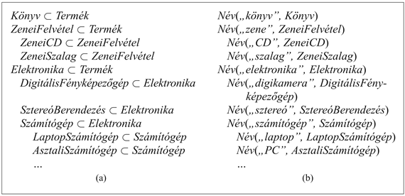

<?xml version="1.0" encoding="UTF-8" standalone="no"?>

<html xmlns="http://www.w3.org/1999/xhtml"><head><meta name="generator" content="DocBook XSL Stylesheets V1.76.1"/></head><body>

<h1 class="title"><a id="id629610"/>Az internetes bevásárlás világa</h1>

Ebben az alfejezetben az internetes bevásárlással kapcsolatos tudás egy részét fogjuk kódolni. Egy olyan vásárló-kutató ágenst fogunk tervezni, amely segíti a vásárlónak az interneten megtalálni a termékek ajánlatait. A vásárló ágens a vásárlótól a termék leírását kapja és feladata a termék eladását hirdető weblapok listáját előállítani. Egyes esetekben a vásárló leírása pontos lesz, mint amilyen például a <em>Coolpix 995 digitális</em> <em>fényképezőgép – </em>a feladat ekkor a legjobb ajánlatot tevő boltot megtalálni. Más esetekben a leírás csak részben lesz specifikált, mint például a <em>300 dollárnál olcsóbb digitális fényképezőgép,</em> és az ágens kénytelen lesz különböző termékeket összehasonlítani.

A vásárló ágens környezete az egész világháló – ami semmiképpen sem egy játékkörnyezet. Ugyanaz a komplex, folyamatosan evolváló környezet, amit az emberek milliói mindennap használnak. Az ágens érzetei weblapok, de amíg egy emberi webfelhasználó a lapokat a képernyőre kivetített pixelek formájában látja, a vásárló ágens a lapokat karakterfüzérek alakjában fogja érzékelni, ahol közönséges szavak keverednek a HTML jelölőnyelv formattáló utasításaival. A 10.7. ábra egy weblapot mutat és a hozzá tartozó HTML-karakterfüzért. A vásárló ágens érzékelési problémájának lényege a hasznos információnak az ilyen fajtájú érzetből való kiemelése.

Világos, hogy weblapokat érzékelni egyszerűbb, mint mondjuk, Kairóban taxi vezetése közben érzékeléseket szerezni. Az internetes érzékelés mégsem mentes a bonyodalmaktól. A 10.7. ábrán látható weblap igen egyszerű a valódi vásárlási lapokhoz képest, ahol találkozni lehet olyan elemekkel, mint sütik, Java, Javascript, Flash, robot kizáró protokollok, elgépelt HTML, hangfájlok, filmfelvételek és egy JPEG kép részeként megjelenő szövegek. Egy ágens, amely képes az internet <em>egészével</em> elbánni, majdnem olyan bonyolult, mint egy robot, amely a valódi világban képes mozogni. Mi egy egyszerű ágensre összpontosítunk, amely e bonyodalmak zömét nem fogja figyelembe venni.

Az ágens első feladata, hogy releváns termékajánlatokat találjon (majd később meglátjuk, hogy a releváns ajánlatok közül hogyan kell kiválasztani a legjobbat). Legyen a <em>lekérdezés</em> a terméknek a felhasználó által begépelt leírása (például „laptop”), akkor egy weblap a <em>lekérdezés</em> szempontjából releváns ajánlat, ha a lap releváns és tényleg egy ajánlat. A lappal kapcsolatos URL-t is nyomon fogjuk követni:

<code class="code"><em>RelevánsAjánlat</em>(<em>lap</em>,<em> url</em>,<em> lekérdezés</em>)<em> </em>⇔<em> Releváns</em>(<em>lap</em>,<em> url</em>,<em> lekérdezés</em>)<em> </em>∧<em> Ajánlat</em>(<em>lap</em>)</code>

A legmodernebb laptopot bemutató lap releváns lenne, ha azonban a vásárlásra nem ad lehetőséget, nem ajánlat. Egyelőre azt fogjuk mondani, hogy egy lap ajánlat, ha a lapon egy HTML-hivatkozáson, vagy űrlapon belül a „vásárol” vagy az „ára” szavakat tartalmazza. Más szóval, ha a lap tartalmaz egy „&lt;a … vásárol … &lt;/a&gt;” alakú füzért, akkor ez egy ajánlat. A „vásárol” helyett lehetne az „ára”, illetve az „a” helyett a „form”. Felírhatjuk ennek axiomatikus alakját:

<a id="id629693"/>
<strong>10.7. ábra - Egy absztrakt online bolt weblapja, ahogy egy böngészőt használó ember látja (felül), és a hozzá tartozó HTML-füzér, ahogy azt a böngésző vagy a vásárló ágens látja (alul). A HTML-ben a &lt; és a &gt; közötti karakterek a jelölő direktívák, amelyek meghatározzák, hogy a lapot hogyan kell kijelezni. Az &lt;i&gt;Válasszon&lt;/i&gt; füzér például jelzi, hogy dőlt betűre kell átkapcsolni, a <em>Válasszon</em> szót kijelezni és a dőlt betű használatát befejezni. Egy lapazonosító, mint amilyen a http://absz-bolt.com/zene az ún. egységes erőforrás azonosító (uniform resource locator, URL).Az &lt;a href="<em>url</em>"&gt;<em>hivatkozás</em>&lt;/a&gt; bejelölés jelzi, hogy az <em>url</em> felé létesíteni kell egy hipertextkapcsolatot a hivatkozó szöveg (anchor text) <em>hivatkozással</em>.</strong>

<code class="code"><em>Ajánlat</em>(<em>lap</em>)		              ⇔    (<em>Címkében</em>(„<em>a</em>”, <em>füzér</em>, <em>lap</em>) ∨</code>

<code class="code">			    <em>Címkében</em>(„<em>form</em>”, <em>füzér</em>, <em>lap</em>))</code>

<code class="code">			∧ (<em>Benne</em>(„<em>vásárol</em>”, <em>füzér</em>)) ∨ <em>Benne</em>(„<em>ára</em>”, <em>füzér</em>))</code>

<code class="code"><em>Címkében</em>(„<em>címke</em>”, <em>füzér</em>, <em>lap</em>)  ⇔    <em>Benne</em>(„&lt;” + <em>címke</em> + <em>füzér</em>  + „&lt;/” + <em>címke</em>, <em>lap</em>)</code>

<code class="code"><em>Benne</em>(<em>alfüzér</em>, <em>füzér</em>)             ⇔ ∃<em>i </em> <em>füzér</em>[<em>i </em>: <em>i</em> + <em>Hossza</em>(<em>alfüzér</em>)] = <em>alfüzér</em></code>

Most szükséges releváns lapokat találni. A stratégia az online bolt honlapjától kezdeni, és azokkal a lapokkal foglalkozni, amelyet a releváns linkek mentén el lehet érni.[<a id="id629886" href="#ftn.id629886" class="footnote">100</a>] Ágensünk számos boltról fog tudni, például:

<code class="code"><em>Amazon </em>∈<em> OnlineBolt </em>∧<em> HonLap</em>(<em>Amazon, </em>„<em>amazon.com</em>”)</code>

<code class="code"><em>Ebay </em>∈<em> OnlineBolt </em>∧<em> HonLap</em>(<em>Ebay, </em>„<em>ebay.com</em>”)</code>

<code class="code"><em>ÁltBolt </em>∈<em> OnlineBolt </em>∧<em> HonLap</em>(<em>ÁltBolt, </em>„<em>ált-bolt.com</em>”)</code>

E boltok termékeit termékkategóriákba sorolják, és a fő kategóriákhoz linkeket biztosítanak a honlaptól kiindulva. Kisebb kategóriákat a releváns linkek láncának követésével lehet elérni, és végül az ajánlatokhoz is eljutunk. Más szóval, egy lap a lekérdezés szempontjából releváns, ha a bolt honlapjától a releváns kategóriakapcsolat láncán át elérhető, és egy további link követésével a termékajánlathoz is eljutunk:

<code class="code"><em>Releváns</em>(<em>lap</em>,<em> url</em>,<em> lekérdezés</em>) ⇔</code>

<code class="code">∃<em>bolt</em>, <em>hon</em> <em>bolt</em> ∈ <em>OnLineBolt</em> ∧ <em>Honlap</em>(<em>bolt</em>,<em>hon</em>)</code>

<code class="code">∧ ∃<em>url</em>2 <em>RelevánsLánc</em>(<em>hon</em>, <em>url</em>2, <em>lekérdezés</em>) ∧ <em>Link</em>(<em>url</em>2, <em>url</em>)</code>

<code class="code">∧ <em>lap</em> = <em>VeddElőLapot</em>(<em>url</em>)</code>

A<em> Link</em>(<em>tól</em>, <em>ig</em>) predikátum jelentése, hogy a <em>tól</em> URL-től az <em>ig</em> URL-ig létezik egy hiperhivatkozás (lásd 10.13. feladat). Hogy a <em>RelevánsLánc</em>-ot definiálhassuk, nem valamilyen régi hiperhivatkozást kell követnünk, hanem azokat, amelyeknél a csatolt hivatkozó szöveg jelzi, hogy a hivatkozás a lekérdezés szempontjából releváns. Erre a <em>LinkSzöveg</em>(<em>tól</em>, <em>ig</em>, <em>szöveg</em>)-et fogjuk használni, melynek jelentése, hogy létezik egy hivatkozás <em>tól</em>-tól <em>ig</em>-ig, <em>szöveg</em>-gel mint hivatkozó szöveggel. A <em>start</em> és a <em>vége</em> URL-ek közötti hivatkozáslánc a <em>d</em> leírás szempontjából releváns, ha minden hivatkozás hivatkozó szövege a <em>d</em> szempontjából releváns kategórianév. A lánc létezését egy rekurzív definíció biztosítja, az üres lánccal (<em>start</em> = <em>vége</em>) mint kiinduló állapottal:

<code class="code"><em>RelevánsLánc</em>(<em>start</em>,<em> vége</em>,<em> lekérdezés</em>) ⇔ (<em>start</em> = <em>vége</em>) </code>

<code class="code">	∨ (∃<em>u</em>,<em> szöveg LinkSzöveg</em>(<em>start</em>,<em> u</em>,<em> szöveg) </em> </code>

<code class="code"><em>	</em>∧ <em>RelevánsKategóriaNév</em>(<em>lekérdezés</em>,<em> szöveg</em>)</code>

<code class="code">	∧ <em>RelevánsLánc</em>(<em>u</em>, <em>vége</em>, <em>lekérdezés</em>))</code>

Most definiálnunk kell, hogy egy <em>lekérdezés</em> szempontjából egy <em>szöveg</em> mikor lesz egy <em>RelevánsKategóriaNév</em>. Először tudnunk kell a füzéreket és az általuk megnevezett kategóriákat kapcsolatba hozni. Jó lesz erre a <em>Név</em>(<em>s</em>, <em>c</em>), amely azt állítja, hogy az <em>s</em> füzér a <em>c</em> kategória neve – mondhatjuk például hogy <em>Név</em>(„<em>laptop</em>”, <em>LaptopSzámítógép</em>). A <em>Név</em> predikátumra további példák a 10.8. ábrán találhatók. A következő a relevancia definiálása. Tegyük fel, hogy a lekérdezés a „laptop”. <em>RelevánsKategóriaNév</em>(<em>lekérdezés</em>,<em> szöveg</em>) igaz lesz, feltéve, hogy az alábbiak közül egy teljesül:

<ul class="itemizedlist"><li class="listitem">
A <em>szöveg</em> és a <em>lekérdezés</em> ugyanazt a kategóriát nevezi meg – például „laptop számítógép” és „laptop”.
</li><li class="listitem">
A <em>szöveg</em> egy szuperkategóriát nevez meg, mint például „számítógép”.
</li><li class="listitem">
A <em>szöveg</em> egy alkategóriát nevez meg, mint például „ultrakönnyű laptop”.
</li></ul>

A <em>RelevánsKategóriaNév</em> logikai definíciója az alábbi:

<code class="code"><em>RelevánsKategóriaNév</em>(<em>lekérdezés</em>,<em> szöveg</em>) ⇔</code>

<code class="code">∃<em>c</em>1, <em>c</em>2  <em>Név</em>(<em>lekérdezés</em>, <em>c</em>1) ∧ <em>Név</em>(<em>szöveg</em>, <em>c</em>2) ∧ (<em>c</em>1 ⊆ <em>c</em>2) ∨ (<em>c</em>2 ⊆ <em>c</em>1) (10.1)</code>

Máskülönben a hivatkozó szöveg irreleváns, mert egy, ezen a vonulaton kívüli kategóriát nevez meg, mint például a „mainframe számítógép” vagy „pázsit és kert”.

Hogy képesek legyünk releváns kapcsolatokat követni, lényeges, hogy rendelkeznünk kell a termékek gazdag kategóriahierarchiájával. E hierarchia legfelső része hasonlíthat például a 10.8. ábrán látható hierarchiára. Nem lenne jó ötlet <em>az összes</em> lehetséges bevásárlási kategóriát listázni, mert a bevásárlónak mindig lehetnek új kívánalmai, és a termékgyártók mindig új termékekkel fognak előrukkolni, hogy a vásárlókat kielégítsék (elektromos térdmelegítő?). Egy, mondjuk ezer kategóriából álló ontológia azonban a vásárlók többsége számára hasznos eszköznek fog bizonyulni. 

<a id="id630389"/>
<strong>10.8. ábra - (a) A termékkategóriák taxonómiája. (b) Ezen kategóriák számára a hivatkozó szövegek.</strong>

A termékhierarchián túlmenően rendelkeznünk kell a kategórianevek gazdag szótárával. Az élet sokkal egyszerűbb lenne, ha a kategóriák és az azokat megnevező füzérek között egy-egyértelmű kapcsolat állna fenn. A <strong>szinonima</strong> (<strong>synonymy</strong>) problémáját – két név, például „laptop számítógép” és „laptop” ugyanazon kategória számára – már láttuk. Van még továbbá az <strong>egyértelműsítés</strong> (<strong>ambiguity</strong>) problémája – egy név két vagy több különböző kategória számára. Ha például a 10.8. (b) ábrán látható tudásbázishoz a:

<code class="code"><em>Név</em>(„<em>CD</em>”,<em> DiplomataJármű</em>)</code>

mondatot is hozzáadjuk, akkor a „CD” két különböző kategóriát fog megnevezni.

A szinonimák és az egyértelműsítés lényegesen megnövelheti az ágens által követendő utak számát, és néha megnehezítheti annak eldöntését, hogy egy adott lap tényleg releváns-e. Sokkal komolyabb probléma, hogy a felhasználó által begépelhető leírások vagy a bolt által használt kategórianevek választéka igen széles lehet. A link például a „laptop”-ról szólhat, holott a tudásbázis csak „laptopok”-ról tud, vagy pedig a felhasználó „egy számítógépet” keres, „amely elférne a Boeing 737 turistaosztályán az étkezőasztalkán”. Lehetetlen előre végig felsorolni egy kategória megnevezéseinek minden változatát, így az ágensnek bizonyos esetekben tovább kell következtetnie, hogy kiderítse, érvényes-e a <em>Név</em> reláció. A legrosszabb esetben ez a természetes nyelv teljes megértését igényelné, mely téma tárgyalását a 22. fejezetig késleltetjük. A gyakorlatban néhány egyszerű szabály, mint például engedélyezni, hogy a „laptop” illeszkedjen a „laptopok” kategóriára, igen jól szuperál. A 10.5. feladatban megkérjük majd az olvasót, hogy egy ilyen szabálykészletet fejlesszen ki, azt követően, hogy az online boltokban egy kicsit körbenézett.

Az előbbi bekezdésben megadott logikai definíció, valamint a termékkategóriákat és a megnevezési konvenciókat tartalmazó megfelelő tudásbázisok birtokában készek vagyunk-e már, hogy a lekérdezésünkre vonatkozó releváns ajánlatok halmazát kikövetkeztető algoritmust alkalmazzuk? Még nem! A hiányzó elem a <em>VeddElőLapot</em>(<em>url</em>) függvény, amely egy adott <em>url</em> címen lévő HTML lapra hivatkozik. Az ágens nem rendelkezik a tudásbázisában minden URL lap tartalmával, és az ilyen tartalom kitalálására vonatkozó explicit szabályokkal sem rendelkezik. Ehelyett elintézhetjük, hogy amikor egy részcél a <em>VeddElőLapot</em> függvényre hivatkozik, a megfelelő HTTP eljárás fog meghívódni. A következtető gép számára ily módon mintha az egész világháló jelenne meg a tudásbázisában. Ez az ún. <strong>procedurális kibővítés</strong>ként (<strong>procedural attachment</strong>) ismert általános módszer egy példája, ahol az egyes predikátumokat és függvényeket speciális rendeltetésű eljárásokkal kezeljük.

<h2 class="title"><a id="id630470"/>Ajánlatok összehasonlítása</h2>

Tegyük fel, hogy az előbbi részfejezet következtetési eljárása a „laptop” lekérdezésünkre több ajánlatlapot is adott vissza. Az ajánlatok összehasonlításához az ágensnek a lapokból releváns információt – ár, sebesség, diszkkapacitás, súly stb. – ki kell nyerni. Az előbb említett okoknál fogva, valódi weblapok esetén, ez igen nehéz feladatnak bizonyulhat. E probléma kezelésének megszokott módja a lapról információt kinyerő ún. <strong>csomagolóprogram</strong>ok (<strong>wrapper</strong>s) használata. Az információkinyerés technológiájával a 23.3. alfejezetben foglalkozunk. Egyelőre feltételezzük, hogy csomagolóprogram létezik, és egy lap és a tudásbázis birtokában a tudásbázishoz tényeket ad hozzá. A lapra tipikusan csomagolóprogramok egész hierarchiáját lehetne alkalmazni. Egy általánosat a dátumok és az árak kinyeréséhez, egy specifikusabbat, hogy a számítógépes termékek attribútumait találja meg, végül, ha szükséges, egy weboldal-specifikust, amely az adott bolt weboldalformátumát is tudja. Ha az ált-bolt.com egy weboldalt tartalmaz:

<code class="code">YVM ThinkBook 970. Ára: 300.000.- Ft</code>

szöveggel, amit mindenféle technikai specifikáció követ, a csomagolótól elvárnánk, hogy az alábbi információt nyerje ki:

<code class="code">∃<em>lc</em>, <em>ajánlat</em>  <em>lc</em> ∈ <em>LaptopSzámítógép </em>∧ <em>ajánlat</em> ∈ <em>TermékAjánlat</em> ∧</code>

<code class="code">	<em>KépernyőNagyság</em>(<em>lc</em>, <em>Cm</em>(32)) ∧ <em>KépernyőTípus</em>(<em>lc</em>, <em>SzínLCD</em>) ∧</code>

<code class="code">	<em>MemóriaNagyság</em>(<em>lc</em>, <em>Mbyte</em>(512)) ∧ <em>CPUSebesség</em>(<em>lc</em>, <em>GHz</em>(2,4)) ∧</code>

<code class="code"><em>	AjánlottTermék</em>(<em>ajánlat, lc</em>) ∧ <em>Bolt</em>(<em>ajánlat</em>, <em>AbsztBolt</em>) ∧ </code>

<code class="code"><em>	URL</em>(<em>ajánlat</em>, „abszt-bolt.com/szg/34356.md”) ∧ </code>

<code class="code"><em>	Ára</em>(<em>ajánlat, Ft</em>(300000)) ∧ <em>Dátum</em>(<em>ajánlat</em>, <em>Ma</em>)</code>

Ez a példa néhány olyan problémát hivatott megmutatni, amelyek akkor jelentkeznek, ha a kereskedelmi tranzakciókhoz szükséges tudásszervezést komolyan vesszük. Vegyük észre például, hogy az ár az <em>ajánlatnak,</em> és nem magának a terméknek az attribútuma. Ez fontos, mert egy adott bolt ajánlata napról napra változhat, akár ugyanarra az egyedi laptopra nézve. Egyes kategóriák esetén – mint például a házak és a festmények esetén – ugyanazt az egyedi objektumot különböző közvetítők egy időben különböző áron is ajánlhatják. Több bonyodalom is elképzelhető, amelyek kezelésével nem foglalkoztunk. Ilyen például annak a lehetősége, hogy az ár függhet a fizetés módjától, vagy hogy a vásárlóra bizonyos kedvezmények vonatkozhatnak. Összegezve, sok érdekes munka még hátramaradt.

Az utolsó feladat a kiemelt ajánlatok összehasonlítása. Tekintsük például az alábbi három ajánlatot:

<em>A</em>: 2,4 GHz CPU, 512 Mbyte RAM, 80 Gbyte diszk, DVD, CDRW, 350000 Ft

<em>B</em>: 2,0 GHz CPU, 1 Gbyte RAM, 120 Gbyte diszk, DVD, CDRW, 400000 Ft

<em>C</em>: 2,2 GHz CPU, 512 Mbyte RAM, 80 Gbyte diszk, DVD, CDRW, 400000 Ft

A <em>C</em>-t az <em>A </em><strong>dominálj</strong>a. Az <em>A </em>olcsóbb és gyorsabb, különben ugyanolyan. Általánosságban azt mondjuk, hogy <em>X</em> dominálja <em>Y</em>-t, ha <em>X</em> legalább egy attribútum esetében kedvezőbb értékű, és semmilyen más attribútum esetében sem rosszabb. Az <em>A</em> és a <em>B</em> közül egyik sem dominálja a másikat. Hogy megállapítsuk, melyik a jobb, tudnunk kell, hogy a vásárló hogyan mérlegeli a CPU sebességét és árát a memóriához és a diszkkapacitáshoz képest. Többszörös attribútum esetében a preferenciák általános tárgyalását a 16.4. alfejezet tartalmazza. Most az ágensünk egyszerűen ki fogja jelezni a vásárló leírásával megegyező, nem dominált ajánlatok listáját. Ebben a példában sem az <em>A</em>, sem a <em>B</em> nem dominált. Jegyezzük meg, hogy ez az eredmény azon a feltevésen alapul, hogy mindenki jobban kedveli az olcsóbb árakat, a gyorsabb processzorokat és a nagyobb tárat. Bizonyos attribútumok, mint például a notebook képernyőmérete, a vásárló partikuláris preferenciáitól függenek (a hordozhatóság a láthatósággal szemben). Az ilyenekről a vásárló ágensnek a felhasználót kell kérdeznie.

A leírt vásárló ágens egy egyszerű rendszer, és számos finomítása lehetséges. Mégis elegendő a képessége arra, hogy a megfelelő területspecifikus tudással a vásárlót ténylegesen tudja segíteni. Deklaratív konstrukciója miatt könnyen felskálázható bonyolultabb alkalmazásokhoz. Ennek az alfejezetnek a fő célja az volt, hogy kimutassuk, hogy bizonyos tudásreprezentáció – különösképpen a termék hierarchiája – szükséges az ilyen típusú ágensek számára, és ha már az ilyen formájú tudás rendelkezésre áll, a többi már nem is olyan nehéz egy tudásalapú ágens számára.

 

[<a id="ftn.id629886" href="#id629886" class="para">100</a>]  A hivatkozáskövető stratégia alternatívája egy internetkereső gépnek a használata. Az internetkeresésről, az információkinyerés mögött húzódó technológiákról a 23.2. alfejezetben lesz szó.

</body></html>
